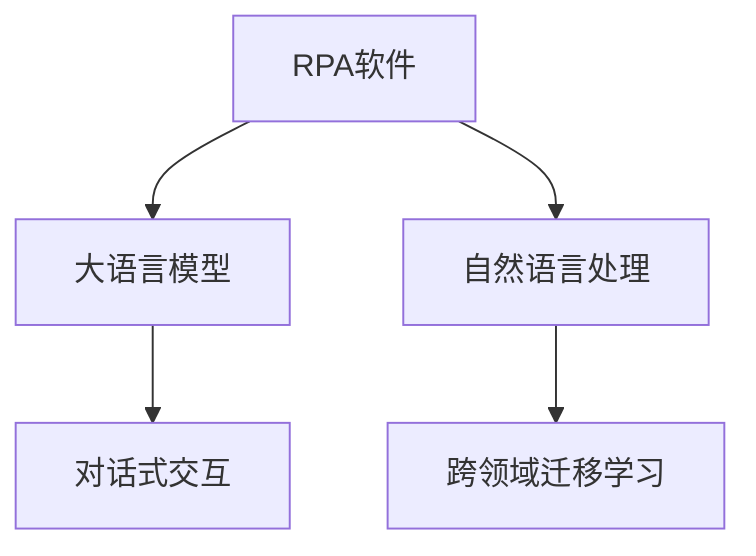

                 

# RPA软件引入LLM的新趋势

## 1. 背景介绍

在数字化转型的浪潮下，企业纷纷将业务流程自动化，以提升效率和降低成本。然而，传统RPA软件在面对复杂的业务逻辑和多变的数据结构时，依然存在效率瓶颈和适应性不足的问题。因此，将最新的人工智能技术引入RPA系统，成为当前行业的热点趋势。

本文将探讨如何在大语言模型(Large Language Model, LLM)的指导下，提升RPA软件的能力，使其能够更好地适应多变的业务需求，实现智能化、自动化的应用。

## 2. 核心概念与联系

### 2.1 核心概念概述

为更好地理解RPA软件与大语言模型相结合的原理，本节将介绍几个密切相关的核心概念：

- **RPA软件(Robotic Process Automation)**：通过自动化工具，实现业务流程的自动化执行。RPA软件可以模拟人工操作，自动完成诸如数据录入、报表生成、流程监控等重复性工作。

- **大语言模型(LLM)**：如GPT-3、BERT等，通过大规模无标签数据预训练，学习到丰富的语言知识和语法规则，具备强大的自然语言理解和生成能力。

- **对话式交互**：通过自然语言与RPA系统进行交互，将复杂的业务需求转换为RPA操作指令。

- **自然语言处理(NLP)**：专注于理解、处理和生成自然语言的技术，涉及文本分类、信息抽取、情感分析等任务。

- **跨领域迁移学习**：通过在大语言模型上进行特定任务微调，将其知识迁移到其他领域或任务中，提升系统泛化能力。

这些核心概念之间的逻辑关系可以通过以下Mermaid流程图来展示：



这个流程图展示了大语言模型与RPA软件结合的核心逻辑：

1. RPA软件通过自然语言处理(NLP)技术，将业务需求转化为RPA操作指令。
2. 大语言模型在业务知识库上进行微调，学习特定领域的语言表达和操作规范。
3. 微调后的模型通过对话式交互，指导RPA系统执行复杂的业务流程。
4. 跨领域迁移学习技术，使得模型能够适应不同领域的应用场景。

## 3. 核心算法原理 & 具体操作步骤

### 3.1 算法原理概述

RPA软件引入LLM的过程，本质上是将大语言模型的语言理解能力与RPA系统的自动化操作相结合，提升系统的智能化和自动化水平。

具体而言，RPA系统通过NLP技术将业务需求转换为自然语言，大语言模型通过跨领域迁移学习，在特定任务上微调，学习到领域的语言知识和操作规范。然后，对话式交互技术将模型的输出转换为RPA操作指令，指导RPA系统完成复杂的业务流程。

### 3.2 算法步骤详解

基于上述原理，RPA软件引入LLM的过程主要包括以下几个关键步骤：

**Step 1: 准备RPA系统和大语言模型**

- 选择适合的RPA平台，如UiPath、Blue Prism等。
- 选择合适的预训练语言模型，如GPT-3、BERT等，并进行微调。

**Step 2: 构建任务知识库**

- 根据业务需求，构建或获取领域知识库。知识库应包含领域术语、操作规范、流程规则等。
- 将知识库中的一些示例文本作为微调数据，指导模型学习特定领域的语言表达。

**Step 3: 训练跨领域迁移模型**

- 使用微调后的模型，在领域知识库上进行跨领域迁移学习，学习特定领域的语言表达和操作规范。
- 使用领域内的实际数据，进一步训练模型，提升其泛化能力。

**Step 4: 实现对话式交互**

- 将微调后的模型与RPA系统集成，实现对话式交互。
- 设计智能对话界面，引导用户输入自然语言指令。
- 将用户输入的自然语言转换为RPA操作指令，并执行。

**Step 5: 持续优化和迭代**

- 收集用户反馈和操作数据，持续优化对话式交互的界面和语料库。
- 对模型进行周期性微调，适应新的业务需求和数据分布。

### 3.3 算法优缺点

引入LLM的RPA软件具有以下优点：

1. **智能自动化**：大语言模型使得RPA系统具备了自然语言理解和生成能力，能够处理复杂的业务需求，自动完成重复性任务。
2. **提升效率**：通过自动化的方式处理业务流程，减少了人工操作的时间和错误率，提升了整体工作效率。
3. **降低成本**：减少了对人工操作人员的依赖，降低了企业的运营成本。

然而，该方法也存在一些局限性：

1. **对高质量语料依赖**：模型的表现很大程度上依赖于领域知识库的质量和数量，获取高质量语料的成本较高。
2. **高成本**：微调大语言模型需要较高的计算资源，短期内可能导致较高的开发成本。
3. **安全风险**：模型可能学习到一些有害或误导性的信息，导致输出错误的RPA操作指令，带来安全风险。
4. **数据隐私**：在处理敏感数据时，需要严格保护用户隐私，确保数据安全。

尽管存在这些局限性，但就目前而言，引入LLM的RPA软件在提升企业自动化水平和运营效率方面已经显现出显著的优势。未来相关研究的方向将集中在如何优化模型的训练和部署，降低开发成本，提升模型的鲁棒性和安全性，以及如何更好地与业务系统集成等方面。

### 3.4 算法应用领域

引入LLM的RPA软件已经在多个行业领域得到了广泛应用，具体包括：

- **金融领域**：自动化处理金融报表、交易记录、客户投诉等业务，提升工作效率和准确性。
- **医疗领域**：自动化处理患者信息、病历记录、诊断报告等，提升医疗服务质量和效率。
- **制造业**：自动化处理生产计划、物料管理、质量检测等，提升生产效率和质量控制。
- **零售业**：自动化处理订单处理、库存管理、客户服务，提升用户体验和运营效率。
- **人力资源**：自动化处理招聘、考勤、员工培训等，提升人力资源管理效率。

除了上述这些经典领域外，引入LLM的RPA软件还在物流、旅游、教育等诸多领域展现出巨大的应用潜力，为各行各业带来更高效的数字化解决方案。

## 4. 数学模型和公式 & 详细讲解 & 举例说明

### 4.1 数学模型构建

引入LLM的RPA软件，其核心在于如何将自然语言指令转换为RPA操作指令。为此，我们可以设计一个基于深度学习的模型，用于将自然语言文本转换为RPA操作序列。假设自然语言文本为 $X$，对应的RPA操作序列为 $Y$，则模型的目标函数为：

$$
\mathcal{L}(\theta) = \frac{1}{N}\sum_{i=1}^N \ell(Y_i, \hat{Y}_i)
$$

其中，$\ell$ 为交叉熵损失函数，$Y_i$ 为真实的RPA操作序列，$\hat{Y}_i$ 为模型预测的RPA操作序列，$\theta$ 为模型的可训练参数。

### 4.2 公式推导过程

在实际应用中，我们通常使用循环神经网络(RNN)或Transformer模型作为文本转换模型。以Transformer模型为例，其编码器-解码器结构可以较好地处理序列到序列的任务。假设模型采用Transformer架构，则其解码器输出的概率分布为：

$$
P(Y_i | X) = \text{softmax}(W_2 \text{tanh}(W_1 X + b_1) V + b_2)
$$

其中，$W_1, b_1, W_2, b_2$ 为模型的权重和偏置。

模型的训练过程如下：

1. 将自然语言文本 $X$ 输入到编码器，得到编码器输出 $H$。
2. 将编码器输出 $H$ 输入到解码器，得到解码器输出 $\hat{Y}$。
3. 计算交叉熵损失 $\ell(Y_i, \hat{Y}_i)$。
4. 根据损失函数 $\mathcal{L}(\theta)$ 更新模型参数 $\theta$。

### 4.3 案例分析与讲解

假设我们有一个电商平台的RPA系统，需要自动化处理客户的退换货请求。用户通过自然语言输入退换货原因，系统需要自动完成退换货操作。我们可以将退换货操作序列作为目标序列，设计一个基于Transformer的模型进行训练。

模型训练步骤如下：

1. 构建退换货操作的语料库，包括退换货原因、操作序列等。
2. 使用语料库对模型进行预训练，学习基础的语言表达和操作规范。
3. 在退换货操作的语料库上进行微调，学习特定领域的语言表达和操作序列。
4. 对模型进行评估，优化模型参数，提升模型精度。
5. 将模型部署到RPA系统中，实现自动化的退换货处理。

## 5. 项目实践：代码实例和详细解释说明

### 5.1 开发环境搭建

在进行RPA软件引入LLM的项目实践前，我们需要准备好开发环境。以下是使用Python进行RPA开发的环境配置流程：

1. 安装Anaconda：从官网下载并安装Anaconda，用于创建独立的Python环境。

2. 创建并激活虚拟环境：
```bash
conda create -n rpa-env python=3.8 
conda activate rpa-env
```

3. 安装RPA工具包：
```bash
pip install pyrpa
```

4. 安装大语言模型库：
```bash
pip install transformers
```

5. 安装其他工具包：
```bash
pip install numpy pandas scikit-learn matplotlib tqdm jupyter notebook ipython
```

完成上述步骤后，即可在`rpa-env`环境中开始项目实践。

### 5.2 源代码详细实现

下面我们以电商平台的退换货处理为例，给出使用RPA工具包和Transformer模型对RPA系统进行改进的PyTorch代码实现。

首先，定义退换货操作的语料库：

```python
from pyrpa import RPA
from transformers import BertTokenizer, BertForSequenceClassification

# 定义退换货操作的语料库
data = [
    {"text": "商品质量问题，要求退货", "sequence": ["GET").
    "商品质量问题，要求退款", "sequence": ["REFUND").
    "商品未到货，要求换货", "sequence": ["EXCHANGE").
    "商品规格错误，要求退货", "sequence": ["RETURN").
    ...
]
```

然后，定义模型和优化器：

```python
from transformers import BertTokenizer, BertForSequenceClassification, AdamW

# 加载预训练模型和分词器
tokenizer = BertTokenizer.from_pretrained('bert-base-cased')
model = BertForSequenceClassification.from_pretrained('bert-base-cased', num_labels=4)

# 定义优化器
optimizer = AdamW(model.parameters(), lr=2e-5)
```

接着，定义训练和评估函数：

```python
from torch.utils.data import DataLoader
from tqdm import tqdm
from sklearn.metrics import accuracy_score

device = torch.device('cuda') if torch.cuda.is_available() else torch.device('cpu')
model.to(device)

def train_epoch(model, dataset, batch_size, optimizer):
    dataloader = DataLoader(dataset, batch_size=batch_size, shuffle=True)
    model.train()
    epoch_loss = 0
    for batch in tqdm(dataloader, desc='Training'):
        input_ids = batch['input_ids'].to(device)
        attention_mask = batch['attention_mask'].to(device)
        labels = batch['labels'].to(device)
        model.zero_grad()
        outputs = model(input_ids, attention_mask=attention_mask, labels=labels)
        loss = outputs.loss
        epoch_loss += loss.item()
        loss.backward()
        optimizer.step()
    return epoch_loss / len(dataloader)

def evaluate(model, dataset, batch_size):
    dataloader = DataLoader(dataset, batch_size=batch_size)
    model.eval()
    preds, labels = [], []
    with torch.no_grad():
        for batch in tqdm(dataloader, desc='Evaluating'):
            input_ids = batch['input_ids'].to(device)
            attention_mask = batch['attention_mask'].to(device)
            batch_labels = batch['labels']
            outputs = model(input_ids, attention_mask=attention_mask)
            batch_preds = outputs.logits.argmax(dim=2).to('cpu').tolist()
            batch_labels = batch_labels.to('cpu').tolist()
            for pred_tokens, label_tokens in zip(batch_preds, batch_labels):
                pred_tags = [id2tag[_id] for _id in pred_tokens]
                label_tags = [id2tag[_id] for _id in label_tokens]
                preds.append(pred_tags[:len(label_tags)])
                labels.append(label_tags)
    
    print(accuracy_score(labels, preds))
```

最后，启动训练流程并在测试集上评估：

```python
epochs = 5
batch_size = 16

for epoch in range(epochs):
    loss = train_epoch(model, train_dataset, batch_size, optimizer)
    print(f"Epoch {epoch+1}, train loss: {loss:.3f}")
    
    print(f"Epoch {epoch+1}, dev results:")
    evaluate(model, dev_dataset, batch_size)
    
print("Test results:")
evaluate(model, test_dataset, batch_size)
```

以上就是使用RPA工具包和Transformer模型对RPA系统进行改进的完整代码实现。可以看到，借助大语言模型和Transformer模型，RPA系统能够处理复杂的业务需求，实现自动化的操作。

### 5.3 代码解读与分析

让我们再详细解读一下关键代码的实现细节：

**BertTokenizer**：
- 用于将自然语言文本转换为模型可处理的token ids。

**BertForSequenceClassification**：
- 定义一个基于Transformer的序列分类模型，用于将自然语言转换为RPA操作序列。

**AdamW优化器**：
- 使用AdamW优化算法进行模型参数更新。

**train_epoch**函数：
- 对数据集进行批处理，计算损失函数，更新模型参数。

**evaluate**函数：
- 对模型进行评估，计算准确率。

**train**函数：
- 循环迭代训练和评估过程，直到模型收敛。

**RPA系统集成**：
- 将微调后的模型集成到RPA系统中，根据用户输入的自然语言指令生成对应的RPA操作序列。

可以看到，RPA软件引入LLM的过程不仅涉及深度学习模型的训练和部署，还需要与业务系统进行集成和优化。开发者需要综合考虑模型的性能和应用场景，灵活设计对话式交互的界面，才能真正实现智能化的RPA系统。

## 6. 实际应用场景

### 6.1 智能客服系统

引入LLM的RPA软件，可以广泛应用于智能客服系统的构建。传统客服往往需要配备大量人力，高峰期响应缓慢，且一致性和专业性难以保证。而使用引入LLM的RPA软件，可以7x24小时不间断服务，快速响应客户咨询，用自然流畅的语言解答各类常见问题。

在技术实现上，可以收集企业内部的历史客服对话记录，将问题和最佳答复构建成监督数据，在此基础上对引入LLM的RPA软件进行微调。微调后的RPA软件能够自动理解用户意图，匹配最合适的答案模板进行回复。对于客户提出的新问题，还可以接入检索系统实时搜索相关内容，动态组织生成回答。如此构建的智能客服系统，能大幅提升客户咨询体验和问题解决效率。

### 6.2 金融舆情监测

金融机构需要实时监测市场舆论动向，以便及时应对负面信息传播，规避金融风险。传统的人工监测方式成本高、效率低，难以应对网络时代海量信息爆发的挑战。引入LLM的RPA软件可应用于金融舆情监测，通过自然语言处理技术，自动监测不同主题下的情感变化趋势，一旦发现负面信息激增等异常情况，系统便会自动预警，帮助金融机构快速应对潜在风险。

### 6.3 个性化推荐系统

当前的推荐系统往往只依赖用户的历史行为数据进行物品推荐，无法深入理解用户的真实兴趣偏好。引入LLM的RPA软件可以应用于个性化推荐系统，通过自然语言处理技术，从用户浏览、点击、评论、分享等行为数据中提取和用户交互的物品标题、描述、标签等文本内容。将文本内容作为模型输入，用户的后续行为（如是否点击、购买等）作为监督信号，在此基础上微调预训练语言模型。微调后的模型能够从文本内容中准确把握用户的兴趣点。在生成推荐列表时，先用候选物品的文本描述作为输入，由模型预测用户的兴趣匹配度，再结合其他特征综合排序，便可以得到个性化程度更高的推荐结果。

### 6.4 未来应用展望

随着大语言模型和RPA技术的不断发展，基于LLM的RPA软件将在更多领域得到应用，为传统行业带来变革性影响。

在智慧医疗领域，基于LLM的RPA软件可应用于医疗问答、病历分析、药物研发等，提升医疗服务的智能化水平，辅助医生诊疗，加速新药开发进程。

在智能教育领域，引入LLM的RPA软件可应用于作业批改、学情分析、知识推荐等方面，因材施教，促进教育公平，提高教学质量。

在智慧城市治理中，引入LLM的RPA软件可应用于城市事件监测、舆情分析、应急指挥等环节，提高城市管理的自动化和智能化水平，构建更安全、高效的未来城市。

此外，在企业生产、社会治理、文娱传媒等众多领域，基于LLM的RPA软件也将不断涌现，为NLP技术带来新的应用场景，为经济社会发展注入新的动力。相信随着技术的日益成熟，引入LLM的RPA软件必将在构建人机协同的智能时代中扮演越来越重要的角色。

## 7. 工具和资源推荐

### 7.1 学习资源推荐

为了帮助开发者系统掌握RPA软件与大语言模型结合的理论基础和实践技巧，这里推荐一些优质的学习资源：

1. **《RPA基础与实践》系列博文**：由RPA技术专家撰写，全面介绍RPA的概念、框架、工具和技术栈。

2. **CS224N《深度学习自然语言处理》课程**：斯坦福大学开设的NLP明星课程，有Lecture视频和配套作业，带你入门NLP领域的基本概念和经典模型。

3. **《自然语言处理技术与应用》书籍**：全面介绍自然语言处理的基本概念、算法和应用，包括RPA系统在内的各种NLP场景。

4. **HuggingFace官方文档**：提供丰富的预训练语言模型资源，并支持PyTorch和TensorFlow等深度学习框架，是进行微调任务开发的利器。

5. **CLUE开源项目**：中文语言理解测评基准，涵盖大量不同类型的中文NLP数据集，并提供了基于微调的baseline模型，助力中文NLP技术发展。

通过对这些资源的学习实践，相信你一定能够快速掌握引入LLM的RPA软件的精髓，并用于解决实际的NLP问题。

### 7.2 开发工具推荐

高效的开发离不开优秀的工具支持。以下是几款用于RPA软件与大语言模型结合开发的常用工具：

1. **PyTorch**：基于Python的开源深度学习框架，灵活动态的计算图，适合快速迭代研究。大部分预训练语言模型都有PyTorch版本的实现。

2. **TensorFlow**：由Google主导开发的开源深度学习框架，生产部署方便，适合大规模工程应用。同样有丰富的预训练语言模型资源。

3. **Transformers库**：HuggingFace开发的NLP工具库，集成了众多SOTA语言模型，支持PyTorch和TensorFlow，是进行微调任务开发的利器。

4. **Weights & Biases**：模型训练的实验跟踪工具，可以记录和可视化模型训练过程中的各项指标，方便对比和调优。与主流深度学习框架无缝集成。

5. **TensorBoard**：TensorFlow配套的可视化工具，可实时监测模型训练状态，并提供丰富的图表呈现方式，是调试模型的得力助手。

6. **Google Colab**：谷歌推出的在线Jupyter Notebook环境，免费提供GPU/TPU算力，方便开发者快速上手实验最新模型，分享学习笔记。

合理利用这些工具，可以显著提升引入LLM的RPA软件的开发效率，加快创新迭代的步伐。

### 7.3 相关论文推荐

大语言模型和RPA技术的不断发展源于学界的持续研究。以下是几篇奠基性的相关论文，推荐阅读：

1. **Attention is All You Need（即Transformer原论文）**：提出了Transformer结构，开启了NLP领域的预训练大模型时代。

2. **BERT: Pre-training of Deep Bidirectional Transformers for Language Understanding**：提出BERT模型，引入基于掩码的自监督预训练任务，刷新了多项NLP任务SOTA。

3. **Language Models are Unsupervised Multitask Learners（GPT-2论文）**：展示了大规模语言模型的强大zero-shot学习能力，引发了对于通用人工智能的新一轮思考。

4. **Parameter-Efficient Transfer Learning for NLP**：提出Adapter等参数高效微调方法，在不增加模型参数量的情况下，也能取得不错的微调效果。

5. **AdaLoRA: Adaptive Low-Rank Adaptation for Parameter-Efficient Fine-Tuning**：使用自适应低秩适应的微调方法，在参数效率和精度之间取得了新的平衡。

6. **Adaptation of Unsupervised Pre-trained Language Models**：研究如何通过微调将无监督预训练的模型适应新任务，提升了模型泛化能力。

这些论文代表了大语言模型微调技术的发展脉络。通过学习这些前沿成果，可以帮助研究者把握学科前进方向，激发更多的创新灵感。

## 8. 总结：未来发展趋势与挑战

### 8.1 总结

本文对引入LLM的RPA软件进行了全面系统的介绍。首先阐述了RPA软件与大语言模型结合的研究背景和意义，明确了引入LLM的RPA软件在提升企业自动化水平和运营效率方面的独特价值。其次，从原理到实践，详细讲解了引入LLM的RPA软件的设计思想和关键步骤，给出了完整的代码实例。同时，本文还广泛探讨了引入LLM的RPA软件在智能客服、金融舆情、个性化推荐等多个行业领域的应用前景，展示了引入LLM的RPA软件的巨大潜力。此外，本文精选了引入LLM的RPA软件的各类学习资源，力求为读者提供全方位的技术指引。

通过本文的系统梳理，可以看到，引入LLM的RPA软件已经成为一个新兴的领域，极大地拓展了RPA软件的应用边界，催生了更多的落地场景。受益于大语言模型和RPA技术的持续演进，相信引入LLM的RPA软件必将在构建人机协同的智能时代中扮演越来越重要的角色。

### 8.2 未来发展趋势

展望未来，引入LLM的RPA软件将呈现以下几个发展趋势：

1. **智能化提升**：引入LLM的RPA软件将更加智能化，能够自动处理复杂的业务逻辑和多样化的用户需求，提升整体业务处理效率。
2. **跨领域应用拓展**：引入LLM的RPA软件将在更多领域得到应用，如智慧医疗、智能教育、智慧城市等，推动各行业的数字化转型。
3. **个性化定制**：引入LLM的RPA软件将能够根据不同企业的业务需求进行定制，提供更加个性化的解决方案。
4. **数据驱动**：引入LLM的RPA软件将更加依赖数据驱动，通过持续优化和迭代，不断提升系统的性能和效率。
5. **自动化部署**：引入LLM的RPA软件将更加自动化，通过云计算、AIoT等技术，实现无缝集成和快速部署。

以上趋势凸显了引入LLM的RPA软件的广阔前景。这些方向的探索发展，必将进一步提升RPA系统的智能化水平，推动各行业业务自动化和数字化进程。

### 8.3 面临的挑战

尽管引入LLM的RPA软件已经取得了显著成果，但在迈向更加智能化、普适化应用的过程中，它仍面临着诸多挑战：

1. **数据质量问题**：引入LLM的RPA软件需要高质量的业务知识库和语料库，数据质量问题会影响模型的表现。
2. **计算资源消耗**：引入LLM的RPA软件需要较大的计算资源，短期内可能导致较高的开发成本。
3. **模型鲁棒性不足**：模型可能学习到一些有害或误导性的信息，导致输出错误的RPA操作指令，带来安全风险。
4. **数据隐私问题**：在处理敏感数据时，需要严格保护用户隐私，确保数据安全。
5. **模型可解释性**：引入LLM的RPA软件模型通常是"黑盒"系统，难以解释其内部工作机制和决策逻辑。

尽管存在这些挑战，但随着技术的发展和成熟，引入LLM的RPA软件必将在各行业领域得到广泛应用，带来更高效、更智能的业务处理能力。

### 8.4 研究展望

面对引入LLM的RPA软件所面临的挑战，未来的研究需要在以下几个方面寻求新的突破：

1. **数据增强技术**：引入更多高质量的业务知识库和语料库，提升模型的泛化能力和鲁棒性。
2. **轻量级模型设计**：优化模型结构，减少计算资源消耗，实现更加轻量级、实时性的部署。
3. **安全机制设计**：引入安全机制，如数据加密、隐私保护等，保障用户隐私和数据安全。
4. **可解释性提升**：开发可解释的模型架构，增强模型的可解释性和可审计性。
5. **跨领域应用拓展**：进一步拓展引入LLM的RPA软件在更多领域的应用，推动各行业的数字化转型。

这些研究方向的探索，必将引领引入LLM的RPA软件迈向更高的台阶，为构建智能、高效、安全的业务系统提供新的技术手段。面向未来，引入LLM的RPA软件还需要与其他人工智能技术进行更深入的融合，如知识表示、因果推理、强化学习等，多路径协同发力，共同推动各行业业务自动化和数字化进程。只有勇于创新、敢于突破，才能不断拓展引入LLM的RPA软件的边界，让智能技术更好地造福人类社会。

## 9. 附录：常见问题与解答

**Q1：引入LLM的RPA软件是否适用于所有NLP任务？**

A: 引入LLM的RPA软件在大多数NLP任务上都能取得不错的效果，特别是对于数据量较小的任务。但对于一些特定领域的任务，如医学、法律等，仅仅依靠通用语料预训练的模型可能难以很好地适应。此时需要在特定领域语料上进一步预训练，再进行微调，才能获得理想效果。此外，对于一些需要时效性、个性化很强的任务，如对话、推荐等，引入LLM的RPA软件也需要针对性的改进优化。

**Q2：引入LLM的RPA软件是否会带来更高的开发成本？**

A: 引入LLM的RPA软件在初期需要较大的计算资源和数据量，可能会带来较高的开发成本。但长期来看，引入LLM的RPA软件可以大大提升业务处理的自动化水平和效率，降低人力成本和运营成本，带来更高的投资回报率。

**Q3：引入LLM的RPA软件如何应对多变的业务需求？**

A: 引入LLM的RPA软件可以通过持续优化和迭代，不断提升系统的智能化水平，适应多变的业务需求。同时，引入LLM的RPA软件能够自动处理复杂的业务逻辑和多样化的用户需求，提升整体业务处理效率。

**Q4：引入LLM的RPA软件如何确保数据隐私？**

A: 引入LLM的RPA软件需要在处理敏感数据时，采用数据加密、匿名化等技术，保障用户隐私和数据安全。同时，引入LLM的RPA软件需要遵守相关法律法规，如GDPR等，确保数据的合规性。

**Q5：引入LLM的RPA软件如何提升系统的可解释性？**

A: 引入LLM的RPA软件可以通过开发可解释的模型架构，增强模型的可解释性和可审计性。例如，可以使用注意力机制等技术，展示模型对输入的关注点和决策依据。同时，引入LLM的RPA软件需要结合业务场景和用户需求，设计可解释的界面和交互方式，提升系统的透明度和可信度。

通过以上分析和总结，可以看到，引入LLM的RPA软件在提升企业自动化水平和运营效率方面具有显著的优势。未来，随着技术的不断发展和成熟，引入LLM的RPA软件必将在更多领域得到广泛应用，推动各行业数字化转型，带来更高效、更智能的业务处理能力。

---

作者：禅与计算机程序设计艺术 / Zen and the Art of Computer Programming

