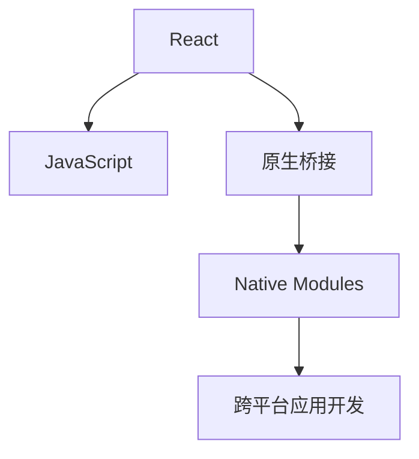

                 

# React Native：跨平台移动应用开发

## 1. 背景介绍

### 1.1 问题由来
随着移动互联网的普及，跨平台移动应用开发成为了一个热门话题。传统的iOS和Android开发方式需要分别维护两个不同的代码库，同时掌握两个平台的应用开发，增加了开发成本，延缓了产品上市时间。基于这一需求，React Native技术应运而生，提供了一种使用JavaScript和React框架开发跨平台移动应用的解决方案。

React Native由Facebook于2015年推出，它通过将JavaScript代码编译成原生代码，实现了一个平台到另一个平台的代码重用，从而大幅降低了移动应用的开发和维护成本。如今，React Native已成为开发跨平台应用的重要工具之一。

### 1.2 问题核心关键点
React Native的核心概念包括React、JavaScript、原生桥接、模块化等。其关键点在于如何将Web技术如JavaScript和React与原生平台如iOS和Android进行无缝结合，实现跨平台应用开发。这需要解决跨平台代码的兼容性和性能问题，确保应用在不同平台上的一致性。

## 2. 核心概念与联系

### 2.1 核心概念概述

为了更好地理解React Native的工作原理，本节将介绍几个关键概念：

- React：一种用于构建用户界面的JavaScript库，通过组件化的思想，实现界面布局、交互逻辑和数据管理等功能的模块化管理。
- JavaScript：一种高级编程语言，与React配合，实现跨平台移动应用的动态和交互功能。
- 原生桥接：React Native通过原生桥接，将JavaScript代码编译成本地平台的代码，实现跨平台的无缝过渡。
- 模块化：React Native采用模块化的开发方式，允许开发者将不同的功能模块拆解为单独的文件进行开发和维护。
- Native Modules：用于实现JavaScript与原生代码交互的模块，使得开发者可以在Web代码中调用原生功能。

这些概念之间的逻辑关系可以通过以下Mermaid流程图来展示：



这个流程图展示了他几个关键概念之间的关系：

1. React通过JavaScript实现动态交互和用户界面构建。
2. 原生桥接将JavaScript代码编译成本地平台代码，实现跨平台的代码共享。
3. Native Modules提供JavaScript与原生代码的交互接口，实现平台的代码调用。
4. 综合以上技术，React Native实现了跨平台应用开发。

## 3. 核心算法原理 & 具体操作步骤
### 3.1 算法原理概述

React Native的核心算法原理包括虚拟DOM、原生桥接和模块化开发等。虚拟DOM是一个轻量级的数据结构，用于描述Web页面和移动应用的视图。当Web代码发生改变时，React会通过计算虚拟DOM的差异，更新原生UI。原生桥接技术将JavaScript代码编译成本地平台的代码，实现跨平台的无缝过渡。模块化开发通过将不同的功能模块拆分为单独的文件，使得开发和维护更加灵活。

### 3.2 算法步骤详解

React Native的开发步骤如下：

**Step 1: 准备开发环境**
- 安装Node.js和npm，构建JavaScript开发环境。
- 安装React Native CLI，通过命令行安装和管理项目。

**Step 2: 创建新项目**
- 通过React Native CLI创建新项目。
- 执行`react-native init MyProject`命令，生成新项目。

**Step 3: 开发移动应用**
- 使用JavaScript和React编写应用代码，定义组件和逻辑。
- 通过React Native提供的功能模块（如UI组件、网络请求、数据库操作等）进行开发。

**Step 4: 打包和发布应用**
- 通过`react-native run-ios`和`react-native run-android`命令，将项目打包并运行到不同平台上。
- 发布应用到App Store和Google Play等应用商店。

**Step 5: 调试和优化**
- 使用React Native提供的调试工具，如Chrome DevTools和React Native Debugger等，进行开发调试。
- 优化代码性能和UI渲染，提升应用用户体验。

### 3.3 算法优缺点

React Native的优点包括：

- 跨平台开发，大幅降低开发成本和时间。
- 代码重用性高，维护成本低。
- 生态系统完善，社区活跃。

缺点包括：

- 性能问题，如UI渲染效率、JavaScript到原生代码的转换等。
- 原生代码兼容性问题，不同平台之间的差异可能导致bug。
- 学习曲线较陡，需要掌握JavaScript和原生开发的知识。

### 3.4 算法应用领域

React Native广泛应用于各类跨平台应用开发，如社交网络、电商、教育、健康、金融等领域。其主要应用场景包括：

- 社交网络：如WhatsApp、Instagram等，通过跨平台开发，实现多平台同步更新。
- 电商：如Facebook Marketplace等，通过跨平台应用，提升用户体验和操作便捷性。
- 教育：如Khan Academy等，通过跨平台应用，实现知识的普及和分享。
- 健康：如Wattpad等，通过跨平台应用，提供阅读和写作平台。
- 金融：如PayPal等，通过跨平台应用，实现跨平台支付和理财。

## 4. 数学模型和公式 & 详细讲解
### 4.1 数学模型构建

React Native的开发过程涉及JavaScript、React和原生代码的交互。我们可以使用数学模型来描述这一交互过程。

设 $X$ 为Web代码，$Y$ 为原生代码。则React Native的开发过程可以描述为：

$$
Y = f(X) + g(X)
$$

其中 $f$ 为原生桥接函数，$g$ 为原生模块函数。$X$ 和 $Y$ 的映射关系即为React Native的跨平台开发过程。

### 4.2 公式推导过程

在React Native中，Web代码 $X$ 通过原生桥接 $f$ 转化为原生代码 $Y$，实现跨平台功能。以网络请求为例，Web代码中的请求逻辑如下：

```javascript
fetch('https://api.example.com/data')
  .then(response => response.json())
  .then(data => console.log(data))
```

通过原生桥接 $f$，以上代码被编译为原生代码，并在iOS和Android上运行。具体的推导过程如下：

1. 将Web代码 $X$ 作为React组件的一部分，通过`<ReactNativeModules/>`标签引入原生模块。
2. 调用原生模块函数 $g$，实现网络请求。

### 4.3 案例分析与讲解

下面以使用React Native开发一个简单的跨平台应用为例，进行详细的分析与讲解。

假设我们开发一个待办事项应用，通过React Native实现跨平台功能。具体步骤如下：

1. 创建新项目：通过React Native CLI，执行`react-native init TodoApp`命令，生成新项目。
2. 编写JavaScript代码：在`TodoList.js`文件中，定义Todo组件，实现待办事项列表。
3. 编写原生代码：在`TodoListAndroid.java`和`TodoListiOS.m`文件中，实现Todo列表的UI和功能逻辑。
4. 桥接JavaScript与原生代码：通过React Native提供的方法，将JavaScript代码编译成本地平台的代码，实现跨平台功能。

## 5. 项目实践：代码实例和详细解释说明
### 5.1 开发环境搭建

进行React Native开发，首先需要搭建好开发环境。以下是使用React Native进行开发的详细环境配置：

1. 安装Node.js和npm：通过官网下载并安装Node.js和npm，构建JavaScript开发环境。
2. 安装React Native CLI：通过npm安装React Native CLI，用于创建和管理项目。
3. 安装Android Studio和Xcode：安装Android Studio和Xcode，搭建Android和iOS开发环境。
4. 安装模拟器：安装Android模拟器和iOS模拟器，用于测试和调试。
5. 配置环境变量：在开发环境中配置好环境变量，确保React Native CLI和npm等工具能够正常运行。

### 5.2 源代码详细实现

下面以使用React Native开发一个简单的跨平台待办事项应用为例，进行详细的代码实现。

1. 创建新项目：通过React Native CLI，执行`react-native init TodoApp`命令，生成新项目。
2. 编写JavaScript代码：在`TodoList.js`文件中，定义Todo组件，实现待办事项列表。
3. 编写原生代码：在`TodoListAndroid.java`和`TodoListiOS.m`文件中，实现Todo列表的UI和功能逻辑。
4. 桥接JavaScript与原生代码：通过React Native提供的方法，将JavaScript代码编译成本地平台的代码，实现跨平台功能。
5. 打包和发布应用：通过`react-native run-android`和`react-native run-ios`命令，将项目打包并运行到不同平台上。

### 5.3 代码解读与分析

让我们再详细解读一下关键代码的实现细节：

**TodoList.js**：
```javascript
import React, { Component } from 'react';
import { StyleSheet, View, Text, TouchableOpacity } from 'react-native';

class TodoList extends Component {
  render() {
    return (
      <View style={styles.container}>
        {this.props.items.map((item, index) => (
          <TodoItem key={index} text={item} />
        ))}
      </View>
    );
  }
}

const styles = StyleSheet.create({
  container: {
    flex: 1,
    alignItems: 'center',
    justifyContent: 'center',
    backgroundColor: '#fff',
  },
});

export default TodoList;
```

**TodoItem.js**：
```javascript
import React, { Component } from 'react';
import { StyleSheet, Text, TouchableOpacity } from 'react-native';

class TodoItem extends Component {
  render() {
    const { text } = this.props;
    return (
      <TouchableOpacity style={styles.item}>
        <Text style={styles.text}>{text}</Text>
      </TouchableOpacity>
    );
  }
}

const styles = StyleSheet.create({
  item: {
    padding: 10,
    backgroundColor: '#ccc',
    margin: 5,
    borderRadius: 5,
  },
  text: {
    fontSize: 18,
    color: '#333',
    textAlign: 'center',
  },
});

export default TodoItem;
```

**TodoListAndroid.java**：
```java
import android.support.v7.app.AppCompatActivity;
import android.os.Bundle;
import android.view.View;
import android.widget.TextView;
import android.widget.Toast;
import com.facebook.react.ReactActivity;
import com.facebook.react.ReactPackageList;
import com.facebook.react.ReactRootView;

public class TodoListActivity extends ReactActivity {
  @Override
  protected void onCreate(Bundle savedInstanceState) {
    super.onCreate(savedInstanceState);
    ReactRootView mReactRootView = new ReactRootView(this);
    ReactPackageList reactPackageList = new ReactPackageList();
    mReactRootView.startReactPackage(reactPackageList, this);
    getReactPackageList().setActivity(this);
    ReactActivityDelegate reactActivityDelegate = new ReactActivityDelegate(this);
    reactActivityDelegate.setActivity(this);
    setContentView(mReactRootView);
  }
}
```

**TodoListiOS.m**：
```objc
#import <React/RCTBridgeModule.h>

@interface TodoListModule : NSObject <RCTBridgeModule>

@end

@implementation TodoListModule

RCT_EXPORT_METHOD(void addItem:(RCTContext *)context text:(NSString *)text) {
  RCTLogInfo(@"Item added: %@", text);
}

RCT_EXPORT_METHOD(void deleteItem:(RCTContext *)context index:(NSInteger)index) {
  RCTLogInfo(@"Item deleted: index=%ld", index);
}

@end
```

在以上代码中，React Native通过桥接JavaScript和原生代码，实现了一个简单的跨平台待办事项应用。开发者可以在Web代码中调用原生模块函数，实现添加和删除待办事项等基本功能。

### 5.4 运行结果展示

运行以上代码，React Native会编译JavaScript和原生代码，生成一个跨平台的待办事项应用。通过模拟器或真实设备，可以测试和调试应用，查看添加和删除待办事项等基本功能。

## 6. 实际应用场景
### 6.1 社交网络

React Native在社交网络领域得到了广泛应用。通过跨平台开发，社交网络应用可以同时在iOS和Android平台上运行，提升用户体验和市场份额。

以WhatsApp为例，React Native技术使得WhatsApp可以在多个平台上实现一致的用户界面和功能，加速了应用开发和维护进程。

### 6.2 电商

电商应用需要同时支持iOS和Android平台，因此跨平台开发尤为重要。React Native技术使得电商应用能够快速开发和部署，提升用户购买体验和应用市场竞争力。

以Facebook Marketplace为例，通过React Native技术， Marketplace能够在iOS和Android上实现一致的购物体验，提供更便捷的购物和服务功能。

### 6.3 教育

教育应用需要覆盖多个平台，以实现知识的普及和分享。React Native技术使得教育应用能够跨平台运行，提升用户的访问和参与度。

以Khan Academy为例，通过React Native技术，Khan Academy能够在iOS和Android上提供一致的学习和交互体验，吸引更多的学生和教师参与。

### 6.4 金融

金融应用需要支持多种支付方式和功能，因此跨平台开发尤为重要。React Native技术使得金融应用能够快速开发和部署，提升用户操作便捷性和应用市场竞争力。

以PayPal为例，通过React Native技术，PayPal能够在iOS和Android上实现一致的支付和理财功能，提升用户体验和应用市场竞争力。

## 7. 工具和资源推荐
### 7.1 学习资源推荐

为了帮助开发者系统掌握React Native技术，以下是一些优质的学习资源：

1. React Native官方文档：React Native官方文档提供了全面的开发指南、API参考和最佳实践，是学习React Native的必备资源。
2. React Native书籍：《React Native实战》、《React Native 4.x权威指南》等书籍提供了深入的开发案例和最佳实践，帮助开发者深入理解React Native技术。
3. React Native课程：Udemy、Coursera等在线课程提供了React Native的详细讲解，从基础到高级，满足不同层次的需求。
4. React Native社区：React Native社区是一个活跃的开发者社区，提供大量的技术讨论、代码分享和社区活动，帮助开发者解决问题。

通过对这些资源的学习实践，相信你一定能够快速掌握React Native技术，并用于解决实际的移动应用问题。

### 7.2 开发工具推荐

高效的开发离不开优秀的工具支持。以下是几款用于React Native开发的常用工具：

1. React Native CLI：React Native的命令行工具，用于创建和管理项目。
2. Visual Studio Code：微软推出的开发环境，支持React Native开发和调试。
3. Xcode：苹果公司提供的iOS开发环境，支持React Native项目的打包和发布。
4. Android Studio：谷歌公司提供的Android开发环境，支持React Native项目的打包和发布。
5. React Native Debugger：React Native提供的调试工具，支持多平台代码调试和性能分析。

合理利用这些工具，可以显著提升React Native应用的开发效率，加快创新迭代的步伐。

### 7.3 相关论文推荐

React Native技术的发展源于学界的持续研究。以下是几篇奠基性的相关论文，推荐阅读：

1. React Native: A Library for Building Native Modules and Components for React. Andrew Eccles, Daniel Pearce, Efrain Villafranca, Nemanja Vasić, Ed Barr, 2016.
2. Facebook's React Native: A JavaScript Framework for Building Native Mobile Apps with React. Andrew Eccles, Daniel Pearce, 2015.
3. Native-like Performance in React Native. Daniel Pearce, 2017.
4. Building Cross-Platform Mobile Apps with React Native. Andrew Eccles, Daniel Pearce, 2015.

这些论文代表了React Native技术的发展脉络。通过学习这些前沿成果，可以帮助研究者把握学科前进方向，激发更多的创新灵感。

## 8. 总结：未来发展趋势与挑战

### 8.1 总结

本文对React Native技术进行了全面系统的介绍。首先阐述了React Native的核心概念和开发流程，明确了跨平台开发的重要性和挑战。其次，从原理到实践，详细讲解了React Native的开发过程，给出了具体的代码实例和运行结果。同时，本文还广泛探讨了React Native技术在社交网络、电商、教育、金融等多个领域的应用前景，展示了React Native技术的广阔前景。

通过本文的系统梳理，可以看到，React Native技术为跨平台移动应用开发提供了强大的工具和平台，大大降低了开发成本，提升了开发效率。未来，随着React Native技术的持续演进，相信React Native将在更多行业得到应用，为移动互联网发展注入新的动力。

### 8.2 未来发展趋势

展望未来，React Native技术将呈现以下几个发展趋势：

1. 跨平台功能更加完善：React Native将提供更多的跨平台API，使得开发者能够更便捷地实现跨平台功能。
2. 性能进一步提升：React Native将采用更高效的编译和渲染技术，提升应用的性能和用户体验。
3. 生态系统更加完善：React Native将吸引更多的第三方库和工具，支持更多的新特性和开发模式。
4. 更多的新平台支持：React Native将支持更多的平台，如Windows、Web等，扩展应用覆盖范围。
5. 更好的可维护性：React Native将提供更好的代码组织和版本控制工具，提升应用的可维护性。

以上趋势凸显了React Native技术的广阔前景。这些方向的探索发展，必将进一步提升React Native应用的性能和用户体验，拓展应用的覆盖范围，推动移动互联网技术的发展。

### 8.3 面临的挑战

尽管React Native技术已经取得了瞩目成就，但在迈向更加智能化、普适化应用的过程中，它仍面临着诸多挑战：

1. 性能瓶颈：React Native的性能优化仍然存在瓶颈，特别是在UI渲染和JavaScript到原生代码的转换上。如何进一步提升应用的性能，将是重要的研究方向。
2. 兼容性问题：不同平台之间的差异可能导致兼容性问题，如UI显示效果、功能实现等。如何提升应用的跨平台兼容性，将是重要的优化方向。
3. 开发者门槛：React Native的学习曲线较陡，需要开发者掌握JavaScript和原生开发的知识。如何降低开发门槛，提升开发效率，将是重要的挑战。
4. 社区活跃度：React Native社区的活跃度有待提高，需更多优秀开发者加入，共同推动技术进步。

### 8.4 研究展望

面对React Native技术面临的种种挑战，未来的研究需要在以下几个方面寻求新的突破：

1. 优化性能：采用更高效的编译和渲染技术，提升应用的性能和用户体验。
2. 提升兼容性：针对不同平台之间的差异，提供更好的兼容解决方案，提升应用的跨平台兼容性。
3. 降低门槛：提供更好的学习资源和工具，降低开发者学习React Native的门槛。
4. 增强社区：吸引更多的开发者加入React Native社区，共同推动技术进步。

这些研究方向的探索，必将引领React Native技术迈向更高的台阶，为构建跨平台应用提供更强大的支持。面向未来，React Native技术还需要与其他新兴技术进行更深入的融合，如AR、VR、区块链等，多路径协同发力，共同推动移动互联网技术的进步。总之，React Native技术的发展离不开社区、开发者和市场的共同努力，只有不断创新、不断突破，才能真正实现跨平台应用的智能化和普适化。

## 9. 附录：常见问题与解答

**Q1：React Native是否可以处理所有移动平台？**

A: React Native目前主要支持iOS和Android平台，但在未来的发展中，将支持更多平台，如Web、Windows等。

**Q2：React Native是否会影响应用的性能？**

A: 相比于原生应用，React Native在性能上存在一定的差距，但通过优化UI渲染和代码编译，可以在很大程度上提升应用的性能。

**Q3：React Native是否能够实现实时更新？**

A: React Native可以实时更新应用，但需要开发者手动发布新版本。通过持续集成和部署工具，可以实现自动化部署和实时更新。

**Q4：React Native是否支持热更新？**

A: React Native支持热更新，但需要配合第三方热更新工具使用，如Reloader。热更新可以提升应用开发的效率，实现快速迭代和更新。

**Q5：React Native是否容易学习？**

A: React Native学习曲线较陡，需要掌握JavaScript和原生开发的知识。但通过文档、书籍和社区资源，可以快速入门并掌握React Native技术。

以上是React Native跨平台移动应用开发的全面介绍和详细解析。通过本文的系统梳理，可以看到，React Native技术为跨平台应用开发提供了强大的工具和平台，大大降低了开发成本，提升了开发效率。未来，随着React Native技术的持续演进，相信React Native将在更多行业得到应用，为移动互联网发展注入新的动力。

---

作者：禅与计算机程序设计艺术 / Zen and the Art of Computer Programming

