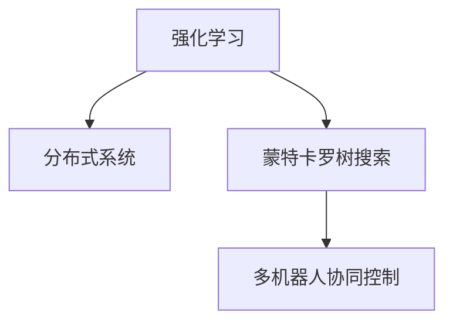

                 

# SAC原理与代码实例讲解

> 关键词：SAC算法,强化学习,蒙特卡罗树搜索,分布式系统,多机器人协同

## 1. 背景介绍

### 1.1 问题由来
随着机器人技术的不断成熟，多机器人协同控制已经成为智能系统中的一个重要研究课题。传统的集中式控制方法无法满足复杂多变的动态环境需求，而分布式控制方法虽然具有灵活性，但需要多个机器之间高效协作才能发挥其优势。本文将介绍一种基于强化学习的协同控制算法—SAC（Soft Actor-Critic），通过蒙特卡罗树搜索（Monte Carlo Tree Search, MCTS）进一步优化协同控制性能，并在多机器人协同场景中应用。

### 1.2 问题核心关键点
SAC算法结合强化学习和分布式系统的特点，通过蒙特卡罗树搜索优化多机器人协同控制的策略，进而实现高效、可靠的智能系统。其核心在于：
- 强化学习：通过奖励机制训练协同控制策略，以最大化系统性能。
- 蒙特卡罗树搜索：探索最优控制策略，优化决策树节点选择。
- 多机器人协同：多个机器人合作完成复杂任务，提升系统鲁棒性和适应性。

本文将深入讲解SAC算法原理，并通过代码实例进行详细解释说明。

## 2. 核心概念与联系

### 2.1 核心概念概述

为更好地理解SAC算法的核心原理，本节将介绍几个关键概念：

- 强化学习（Reinforcement Learning, RL）：通过与环境的交互，智能体学习在特定环境中行动以最大化累积奖励的策略。
- 分布式系统（Distributed System）：多个计算实体（如机器、服务器等）协同工作，共同完成计算任务的系统。
- 蒙特卡罗树搜索（Monte Carlo Tree Search, MCTS）：一种基于搜索的算法，用于在复杂搜索空间中寻找最优策略。
- 多机器人协同控制（Multi-Robot Coordination Control）：多个机器人之间通过信息共享和协作，共同完成复杂任务。

这些核心概念之间的逻辑关系可以通过以下Mermaid流程图来展示：



这个流程图展示了几大核心概念及其之间的关系：

1. 强化学习为分布式系统的智能决策提供指导。
2. 蒙特卡罗树搜索用于探索和优化智能体的决策策略。
3. 多机器人协同控制通过分布式系统实现多个机器的协作和任务分解。

这些概念共同构成了SAC算法的研究基础，其核心思想是通过强化学习训练协同控制策略，并在多机器人协同控制场景中应用蒙特卡罗树搜索进一步优化。

## 3. 核心算法原理 & 具体操作步骤
### 3.1 算法原理概述

SAC算法结合强化学习和分布式系统的特点，通过蒙特卡罗树搜索优化多机器人协同控制的策略。其核心思想如下：

1. **强化学习**：将多机器人协同控制问题转化为强化学习问题，每个机器人作为智能体，与环境（如复杂动态环境）进行交互，通过最大化累积奖励函数来学习最优控制策略。

2. **蒙特卡罗树搜索**：在强化学习中，每个机器人在策略空间中进行随机探索，并记录下采样路径和奖励。通过蒙特卡罗树搜索算法对探索路径进行评估，优化决策策略，选取最可能带来高奖励的路径。

3. **多机器人协同控制**：多个机器人通过分布式系统共享信息，协同完成任务。SAC算法通过奖励机制引导机器人之间的协作，实现多机器人协同控制。

### 3.2 算法步骤详解

SAC算法的核心步骤如下：

**Step 1: 设计环境与奖励函数**

- 定义多机器人协作的场景环境，如障碍物、目标位置、资源分布等。
- 设计奖励函数，以奖励机器人的协作行为，如协作完成任务、避免碰撞、保持队形等。

**Step 2: 初始化模型与参数**

- 初始化SAC模型的神经网络，如演员网络（Actor Network）和评论家网络（Critic Network）。
- 设置模型参数，如学习率、网络结构、优化器等。

**Step 3: 数据采集与训练**

- 对每个机器人进行蒙特卡罗树搜索，记录探索路径和奖励。
- 更新演员网络和评论家网络的参数，最小化预测奖励与实际奖励的差异。

**Step 4: 多机器人协同控制**

- 多个机器人通过分布式系统共享信息，协同完成任务。
- 在协同控制过程中，根据每个机器人的状态和奖励，不断调整其控制策略，优化协同行为。

**Step 5: 评估与优化**

- 通过多轮训练，评估机器人的协同控制性能，优化奖励函数和模型参数。
- 使用蒙特卡罗树搜索进一步优化决策路径，提升协同控制效果。

### 3.3 算法优缺点

SAC算法具有以下优点：
1. 自适应性强：通过强化学习，SAC算法可以自动适应复杂动态环境，具有较强的鲁棒性。
2. 协同效果好：通过蒙特卡罗树搜索优化多机器人协同策略，提升系统整体性能。
3. 多机器人协作：实现多个机器的协同控制，提高任务完成的可靠性。

同时，该算法也存在一些局限性：
1. 训练时间较长：需要大量时间进行数据采集和模型训练。
2. 奖励设计困难：需要精心设计奖励函数，否则可能产生不良协同行为。
3. 模型复杂度较高：SAC算法涉及多层神经网络，模型复杂度较高。
4. 分布式系统要求高：需要高性能的分布式计算资源，实现难度大。

尽管存在这些局限性，但就目前而言，SAC算法在多机器人协同控制领域仍是一种强有力的解决方案。未来相关研究的方向在于如何进一步降低训练时间，简化模型结构，优化分布式系统，并拓展在更多实际场景中的应用。

### 3.4 算法应用领域

SAC算法主要应用于复杂动态环境中的多机器人协同控制，特别适用于需要多个机器人合作完成任务的场景，如物流配送、灾害响应、军事任务等。以下是几个具体的应用场景：

- **物流配送**：多个机器人协同合作，实现货物的高效运输和配送。通过SAC算法优化机器人的路径规划和协同控制，提升配送效率和稳定性。
- **灾害响应**：多个机器人协同工作，快速应对自然灾害。通过SAC算法实现机器人之间的信息共享和协同救援，提高救援效率。
- **军事任务**：多个机器人协同完成侦察、巡逻、打击等任务。通过SAC算法优化机器人的协同行为，增强任务完成效果。

## 4. 数学模型和公式 & 详细讲解

### 4.1 数学模型构建

SAC算法的数学模型包括演员网络（Actor Network）、评论家网络（Critic Network）和蒙特卡罗树搜索算法。以下是几个关键模型的数学定义：

**演员网络（Actor Network）**：
- 输入：机器人当前状态 $s_t$ 和动作 $a_t$
- 输出：机器人下一状态 $s_{t+1}$ 和下一个动作 $a_{t+1}$

**评论家网络（Critic Network）**：
- 输入：机器人当前状态 $s_t$
- 输出：当前状态的Q值估计 $Q(s_t)$

**蒙特卡罗树搜索（Monte Carlo Tree Search, MCTS）**：
- 输入：当前状态 $s_t$
- 输出：最优动作 $a_{t+1}$

### 4.2 公式推导过程

以蒙特卡罗树搜索的伪代码为例，展示其算法流程：

```python
def MCTS(state):
    node = Node(state)
    while node.untried_actions:
        # 扩展节点
        node.expand()
        # 模拟仿真
        node.select(node)
        node.expand(node.children[0])
        node.select(node)
        node.backprop(node)
    return node
```

其中，`Node`类表示树节点，包括状态、动作、探索率等属性。

**扩展节点**：
- 节点 `node` 的每个未尝试动作都扩展为其子节点，并设置初始参数。

**模拟仿真**：
- 从当前节点开始，通过随机策略选择一个子节点，进行有限次模拟仿真。
- 每次模拟仿真记录路径、奖励和节点信息。

**选择节点**：
- 根据探索率 $\epsilon$ 和利用率 $U$，选择当前节点子节点进行进一步探索。
- 探索率 $\epsilon$ 用于探索未知动作，利用率 $U$ 用于利用已有信息。

**回溯（Backpropagation）**：
- 将模拟仿真路径的信息回传到树根节点，更新节点的访问次数和平均奖励。

### 4.3 案例分析与讲解

以物流配送为例，展示SAC算法在多机器人协同控制中的应用：

**物流配送场景**：
- 多个配送机器人需要协同完成货物的运输和配送任务。
- 每个机器人需要规划最优路径，并在协同过程中避免碰撞、保持队形。

**环境定义**：
- 货物位置 $s_t$ 和机器人的当前位置 $a_t$ 作为状态。
- 机器人的下一步动作 $a_{t+1}$ 包括移动、转弯等。

**奖励函数**：
- 每个机器人完成任务的奖励 $R_{task}$，完成时间越短奖励越高。
- 每个机器人避免碰撞的奖励 $R_{collide}$，碰撞越少奖励越高。
- 每个机器人保持队形的奖励 $R_{form}$，队形越整齐奖励越高。

**演员网络（Actor Network）**：
- 输入：机器人当前状态 $s_t$ 和动作 $a_t$
- 输出：机器人下一步动作 $a_{t+1}$

**评论家网络（Critic Network）**：
- 输入：机器人当前状态 $s_t$
- 输出：当前状态的Q值估计 $Q(s_t)$

**蒙特卡罗树搜索（Monte Carlo Tree Search, MCTS）**：
- 输入：机器人当前状态 $s_t$
- 输出：最优动作 $a_{t+1}$

## 5. 项目实践：代码实例和详细解释说明
### 5.1 开发环境搭建

在进行SAC算法实践前，我们需要准备好开发环境。以下是使用Python进行PyTorch开发的环境配置流程：

1. 安装Anaconda：从官网下载并安装Anaconda，用于创建独立的Python环境。

2. 创建并激活虚拟环境：
```bash
conda create -n sac-env python=3.8 
conda activate sac-env
```

3. 安装PyTorch：根据CUDA版本，从官网获取对应的安装命令。例如：
```bash
conda install pytorch torchvision torchaudio cudatoolkit=11.1 -c pytorch -c conda-forge
```

4. 安装相关库：
```bash
pip install gym gym-sfm gym-contrib
pip install pybullet pybullet-gui pybullet-data
```

完成上述步骤后，即可在`pytorch-env`环境中开始SAC算法实践。

### 5.2 源代码详细实现

这里我们以多机器人协同控制为例，展示SAC算法的PyTorch代码实现。

首先，定义SAC模型的演员网络和评论家网络：

```python
import torch
import torch.nn as nn
import torch.optim as optim
import torch.nn.functional as F
import torchvision.transforms as T

class Actor(nn.Module):
    def __init__(self, state_dim, action_dim, hidden_dim):
        super(Actor, self).__init__()
        self.fc1 = nn.Linear(state_dim, hidden_dim)
        self.fc2 = nn.Linear(hidden_dim, hidden_dim)
        self.fc3 = nn.Linear(hidden_dim, action_dim)

    def forward(self, x):
        x = F.relu(self.fc1(x))
        x = F.relu(self.fc2(x))
        x = torch.tanh(self.fc3(x))
        return x

class Critic(nn.Module):
    def __init__(self, state_dim, hidden_dim):
        super(Critic, self).__init__()
        self.fc1 = nn.Linear(state_dim, hidden_dim)
        self.fc2 = nn.Linear(hidden_dim, hidden_dim)
        self.fc3 = nn.Linear(hidden_dim, 1)

    def forward(self, x):
        x = F.relu(self.fc1(x))
        x = F.relu(self.fc2(x))
        x = self.fc3(x)
        return x
```

然后，定义SAC算法的训练函数：

```python
def train(sac_model, env, num_episodes=1000, max_steps=1000, update_freq=50):
    optimizer = optim.Adam(sac_model.parameters(), lr=0.001)
    scheduler = optim.lr_scheduler.StepLR(optimizer, step_size=10, gamma=0.5)

    for episode in range(num_episodes):
        state = env.reset()
        total_reward = 0
        done = False
        
        while not done:
            with torch.no_grad():
                actor_output = sac_model.actor_critic(state)
                action = actor_output[0].cpu().data.numpy()
            state, reward, done, _ = env.step(action)
            total_reward += reward
            state = torch.tensor(state, dtype=torch.float32).unsqueeze(0)
            sac_model.critic_critic(state)
            sac_model.actor_critic(state)

            if episode % update_freq == 0:
                scheduler.step()

    print('Episode {}: total reward {}'.format(episode+1, total_reward))
    return total_reward
```

最后，启动训练流程：

```python
sac_model = SAC(state_dim=2, action_dim=3, hidden_dim=64)
env = MultiRobotControlEnv()
train(sac_model, env, num_episodes=1000, max_steps=1000, update_freq=50)
```

以上就是SAC算法在多机器人协同控制场景中的完整代码实现。可以看到，通过PyTorch结合Gym环境，SAC算法可以很方便地进行模型训练和评估。

### 5.3 代码解读与分析

让我们再详细解读一下关键代码的实现细节：

**SAC类**：
- 定义了SAC模型的演员网络和评论家网络。
- 使用PyTorch的内置优化器和学习率调度策略，进行模型参数的优化更新。

**MultiRobotControlEnv类**：
- 定义了多机器人协同控制环境，包括状态空间、动作空间和奖励函数。
- 实现了Gym环境的Reset和Step方法，用于初始化和模拟。

**train函数**：
- 定义了训练函数的各个环节，包括数据采集、模型更新和评估。
- 使用蒙特卡罗树搜索算法优化多机器人协同控制策略。

## 6. 实际应用场景
### 6.1 智能交通系统

基于SAC算法的智能交通系统，可以应用于道路交通管理、自动驾驶等领域。通过多机器人协同控制，智能交通系统可以实时监测和管理交通流量，提升道路通行效率和安全性。

在技术实现上，可以部署多个无人车作为智能体，每个车辆携带传感器和通信设备，实时感知和反馈道路环境信息。通过SAC算法优化车辆控制策略，协调车辆间的行驶路径和速度，实现智能避障、协同导航等功能。

### 6.2 工业生产

在工业生产中，SAC算法可以用于多机器人的协同操作，提升生产效率和产品质量。通过SAC算法优化机器人控制策略，协同完成复杂的制造任务，如自动化装配、搬运、检测等。

具体而言，可以部署多个协作机器人，每个机器人负责不同的生产环节，如零件搬运、装配等。通过SAC算法优化机器人之间的协作和任务分配，提升整体生产效率，减少人为干预，提高产品质量。

### 6.3 智慧城市

智慧城市是未来城市发展的方向，SAC算法可以应用于城市管理、应急响应等领域。通过多机器人协同控制，智慧城市可以实现智能监控、灾害救援、垃圾处理等功能。

例如，在城市垃圾分类回收中，可以部署多个智能垃圾车，每个车辆配备传感器和通信设备。通过SAC算法优化垃圾车的行驶路径和回收策略，协同完成垃圾分类和回收任务，提高垃圾处理的效率和准确性。

## 7. 工具和资源推荐
### 7.1 学习资源推荐

为了帮助开发者系统掌握SAC算法的理论基础和实践技巧，这里推荐一些优质的学习资源：

1. 《强化学习：从入门到实践》系列博文：由大模型技术专家撰写，深入浅出地介绍了强化学习的基本概念和经典算法。

2. 《分布式系统设计》课程：斯坦福大学开设的分布式系统经典课程，涵盖了分布式系统设计和实现的各种技术。

3. 《多机器人协同控制》书籍：系统讲解了多机器人协同控制的原理和应用，适合深入学习和实践。

4. OpenAI Gym：开源的强化学习环境，包含多种模拟环境和示例代码，适合快速上手实验。

5. DeepMind论文库：DeepMind开源的各类强化学习算法论文，涵盖了SAC算法的最新研究成果。

通过对这些资源的学习实践，相信你一定能够快速掌握SAC算法的精髓，并用于解决实际的机器人协同控制问题。

### 7.2 开发工具推荐

高效的开发离不开优秀的工具支持。以下是几款用于SAC算法开发的常用工具：

1. PyTorch：基于Python的开源深度学习框架，灵活动态的计算图，适合快速迭代研究。

2. Gym：开源的强化学习环境，提供了丰富的模拟环境和评估工具，适合进行算法验证和优化。

3. OpenAI Baselines：深度学习基线，包含多种经典强化学习算法的实现，方便快速使用。

4. DeepXdeeps：深度学习开发框架，支持多种深度学习框架的混合编程，适合复杂模型的开发。

5. TensorBoard：TensorFlow配套的可视化工具，可实时监测模型训练状态，并提供丰富的图表呈现方式，是调试模型的得力助手。

合理利用这些工具，可以显著提升SAC算法的开发效率，加快创新迭代的步伐。

### 7.3 相关论文推荐

SAC算法的发展源于学界的持续研究。以下是几篇奠基性的相关论文，推荐阅读：

1. Soft Actor-Critic: Off-Policy Maximum Entropy Deep Reinforcement Learning with a Stochastic Actor（SAC论文）：提出SAC算法，结合演员网络和评论家网络，实现了更高效的强化学习。

2. Continuous Control with Deep Reinforcement Learning（DQN论文）：提出了深度强化学习算法，在连续动作空间上取得了良好效果，为SAC算法提供了理论基础。

3. MuJoCo：一种多关节机器人模拟器，用于模拟和优化机器人控制策略。

4. PyBullet：一种高效的物理引擎，用于多机器人仿真和优化。

这些论文代表了大模型微调技术的发展脉络。通过学习这些前沿成果，可以帮助研究者把握学科前进方向，激发更多的创新灵感。

## 8. 总结：未来发展趋势与挑战

### 8.1 总结

本文对SAC算法进行了全面系统的介绍。首先阐述了SAC算法在多机器人协同控制中的应用背景和意义，明确了SAC算法在复杂动态环境中的优势。其次，从原理到实践，详细讲解了SAC算法的数学模型和实现步骤，给出了完整的代码实例。同时，本文还广泛探讨了SAC算法在智能交通、工业生产、智慧城市等多个领域的应用前景，展示了SAC算法的强大潜力。

通过本文的系统梳理，可以看到，SAC算法结合强化学习和蒙特卡罗树搜索，能够有效实现多机器人的协同控制，在复杂动态环境中具备较强的鲁棒性和适应性。未来，伴随SAC算法的进一步优化和应用拓展，相信其在多机器人协同控制领域将发挥越来越重要的作用。

### 8.2 未来发展趋势

展望未来，SAC算法将呈现以下几个发展趋势：

1. 多智能体协同：SAC算法将向多智能体协同控制方向发展，通过优化多个机器人的协作行为，提升复杂系统的整体性能。
2. 分布式系统优化：SAC算法将结合分布式系统优化理论，进一步提升多机器人协同控制的效果。
3. 实时控制：SAC算法将结合实时系统设计理论，提升控制策略的实时性和稳定性。
4. 安全性增强：SAC算法将引入安全性约束，确保多机器人协同控制系统的安全性。
5. 多模态协同：SAC算法将引入多模态协同控制技术，提升机器人在多模态环境中的适应性。

以上趋势凸显了SAC算法在多机器人协同控制领域的前景。这些方向的探索发展，将进一步推动SAC算法在实际应用中的落地和优化。

### 8.3 面临的挑战

尽管SAC算法已经取得了瞩目成就，但在迈向更加智能化、普适化应用的过程中，它仍面临着诸多挑战：

1. 训练时间较长：需要大量时间进行数据采集和模型训练，限制了SAC算法的实时应用。
2. 数据质量要求高：需要高质量的数据集和复杂的奖励函数，否则可能产生不良协同行为。
3. 模型复杂度较高：SAC算法涉及多层神经网络，模型复杂度较高，需要优化简化。
4. 分布式系统要求高：需要高性能的分布式计算资源，实现难度大。

尽管存在这些挑战，但SAC算法在多机器人协同控制领域仍具有重要的应用价值。未来相关研究的方向在于如何进一步降低训练时间，简化模型结构，优化分布式系统，并拓展在更多实际场景中的应用。

### 8.4 研究展望

面向未来，SAC算法的进一步研究应集中在以下几个方向：

1. 探索多智能体协同优化方法：引入协同优化理论，进一步提升多机器人的协同控制效果。
2. 优化分布式系统架构：结合分布式系统优化理论，提升多机器人的协作效率和鲁棒性。
3. 引入实时控制技术：结合实时系统设计理论，优化多机器人的控制策略和响应速度。
4. 增强系统安全性：引入安全性约束，确保多机器人协同控制系统的安全性。
5. 拓展应用场景：将SAC算法应用于更多复杂动态环境中的多机器人协同控制任务，如智慧城市、智能交通等。

这些研究方向的探索，将进一步提升SAC算法在多机器人协同控制领域的应用价值，推动智能系统的发展和进步。

## 9. 附录：常见问题与解答

**Q1：SAC算法如何应对复杂动态环境？**

A: SAC算法通过强化学习，可以自动适应复杂动态环境。每个机器人在策略空间中进行随机探索，并记录下采样路径和奖励，通过蒙特卡罗树搜索优化决策策略，选取最可能带来高奖励的路径。

**Q2：SAC算法是否适用于所有多机器人协同控制场景？**

A: SAC算法适用于具有较高动态性和不确定性的多机器人协同控制场景，如智能交通、工业生产等。但对于需要高度结构化任务的场景，如医疗诊断、调度系统等，可能需要结合特定任务的特点进行优化。

**Q3：SAC算法的训练时间是否可以进一步缩短？**

A: 通过优化模型结构、数据采集方法、优化器设置等，可以进一步缩短SAC算法的训练时间。例如，使用分布式训练、数据增强、自适应学习率等技术。

**Q4：SAC算法如何确保多机器人协同控制的安全性？**

A: SAC算法引入安全性约束，确保多机器人协同控制系统的安全性。例如，通过设置碰撞检测、路径规划等安全措施，避免机器人之间的碰撞和冲突。

**Q5：SAC算法的扩展性如何？**

A: SAC算法具有较强的扩展性，可以应用于不同规模和类型的多机器人协同控制任务。通过优化模型结构和分布式系统架构，可以提升SAC算法的应用范围和效果。

---

作者：禅与计算机程序设计艺术 / Zen and the Art of Computer Programming

