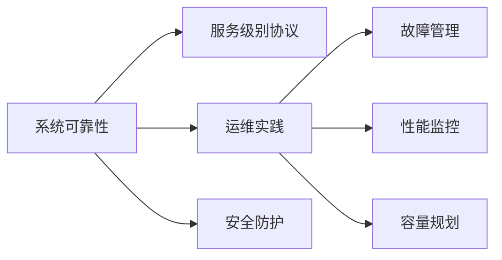

                 

# SRE实践：确保系统可靠性的方法论

> 关键词：SRE,系统可靠性,方法论,服务级别协议,运维实践,故障管理,性能监控,容量规划

## 1. 背景介绍

在当今数字化转型的时代，系统可靠性成为了企业竞争力的重要组成部分。系统可靠性不仅关乎用户体验，更是企业信任和声誉的基石。与此同时，运维资源和成本的不断攀升，使得提升系统可靠性的需求愈发迫切。

本文将全面探讨如何通过系统运维实践（System Reliability Engineering, SRE），确保系统的高可用性、稳定性与安全性，从而在业务连续性和用户满意度方面取得双赢。我们将深入阐述SRE的核心概念、操作流程、工具和资源，并结合实际应用案例，提供系统可靠性的最佳实践。

## 2. 核心概念与联系

### 2.1 核心概念概述

为了更好地理解SRE，首先需要明确几个关键概念：

- **系统可靠性**：指系统在特定时间范围内，能正常运行并满足业务需求的能力。系统可靠性不仅包括可用性，还包括性能、安全、可扩展性等方面的考量。
- **服务级别协议（SLA）**：是服务提供者和用户之间的合同，详细描述了服务的具体质量指标，如可用性、响应时间、错误率等。SLA是衡量系统可靠性的重要标准。
- **运维实践**：涉及日常运营、故障处理、性能监控、容量规划、安全防护等活动，旨在提升系统可靠性和用户体验。
- **故障管理**：识别、定位和解决问题，以减少系统宕机时间，恢复业务正常运行。
- **性能监控**：通过实时监测系统关键性能指标，及时发现和解决性能瓶颈，保障系统稳定运行。
- **容量规划**：预测未来业务增长，提前规划资源分配，确保系统具备足够的处理能力。

这些概念彼此关联，共同构成了SRE的核心体系，如图：



通过将这些概念整合并落实到具体的SRE实践中，可以全面提升系统可靠性和业务连续性。

## 3. 核心算法原理 & 具体操作步骤

### 3.1 算法原理概述

SRE的实践核心在于通过科学的方法论，确保系统能够持续高效地运行，同时不断提升系统可靠性的指标。以下是SRE的核心理论：

- **故障管理**：遵循故障管理流程，快速定位和解决问题，确保业务连续性。故障管理的流程通常包括故障检测、故障诊断、故障修复、故障预防和故障记录。
- **性能监控**：通过实时监控系统的关键性能指标，及时发现并解决性能瓶颈。性能监控是提升系统可靠性的重要手段，可以预见性地发现系统问题，避免业务中断。
- **容量规划**：通过预测业务增长，提前规划资源分配，确保系统具备足够的处理能力。容量规划是预防系统过载、提升用户满意度的关键。
- **安全防护**：通过多层次的安全防护措施，如加密传输、访问控制、入侵检测等，保障系统免受安全威胁。

### 3.2 算法步骤详解

SRE的实际操作可以分为以下几个步骤：

**Step 1: 制定服务级别协议**

1. **明确业务需求**：与业务部门紧密沟通，明确系统的关键业务指标，如响应时间、可用性、吞吐量等。
2. **设定SLA目标**：根据业务需求，设定SLA的具体指标，如99.9%的可用性、1秒内的响应时间等。
3. **制定SLA文档**：编写详细的SLA文档，包括服务描述、业务指标、SLA目标、支持流程等。

**Step 2: 实施故障管理流程**

1. **故障检测**：部署自动化监控工具，实时监测系统状态，及时发现故障。
2. **故障诊断**：使用日志分析、异常检测等技术，快速定位故障原因。
3. **故障修复**：根据故障诊断结果，快速进行问题修复，恢复正常服务。
4. **故障预防**：定期进行系统健康检查和安全审计，提前发现潜在问题。
5. **故障记录**：记录每一次故障的详细信息，包括故障时间、影响范围、修复过程等，便于事后分析和改进。

**Step 3: 部署性能监控系统**

1. **关键指标选择**：根据业务需求，选择关键性能指标进行监控，如CPU利用率、内存使用率、网络带宽等。
2. **监控工具部署**：部署性能监控工具，如Prometheus、Grafana等，实时监测系统性能。
3. **告警设置**：根据业务需求，设置性能告警阈值，当系统性能达到或超出阈值时，自动触发告警通知。

**Step 4: 实施容量规划策略**

1. **业务增长预测**：分析历史业务数据，预测未来业务增长趋势。
2. **资源分配规划**：根据业务增长预测，提前规划计算资源和存储资源。
3. **弹性伸缩策略**：采用自动弹性伸缩技术，根据实时业务负载动态调整资源配置。

**Step 5: 加强安全防护措施**

1. **访问控制**：通过身份认证、权限控制等措施，确保只有授权人员可以访问系统。
2. **加密传输**：使用SSL/TLS等技术，确保数据在传输过程中的加密和完整性。
3. **入侵检测**：部署入侵检测系统，实时监控系统异常行为，防止恶意攻击。
4. **数据备份与恢复**：定期备份重要数据，并制定灾难恢复计划，保障数据安全。

### 3.3 算法优缺点

SRE的实践有以下优点：

- **提高系统可靠性**：通过故障管理、性能监控、容量规划等措施，确保系统在高峰期和故障频发期的稳定运行。
- **提升用户体验**：通过及时响应和快速修复，确保用户能够获得连续、稳定的服务。
- **降低运维成本**：自动化监控和告警系统，减少了人工操作的频率，降低了运维人员的负担。
- **促进业务创新**：系统可靠性的提升，为业务创新和快速迭代提供了坚实的技术保障。

然而，SRE的实践也存在一些挑战：

- **技术和资源投入**：SRE的实践需要大量的技术投入和资源支持，包括监控工具、自动化脚本、性能分析工具等。
- **团队协作难度**：SRE需要跨部门协作，业务部门和运维部门需要紧密配合，达成一致的服务目标。
- **持续改进压力**：系统的可靠性和性能标准不断提高，需要持续进行优化和改进，保持技术领先。

尽管存在这些挑战，但SRE的价值和重要性不容忽视。通过持续改进和优化，SRE将成为企业数字化转型的重要基石。

### 3.4 算法应用领域

SRE的实践在多个领域都有广泛应用，以下是几个典型案例：

**电商网站**：确保电商平台的高可用性和高性能，处理海量订单和高并发访问，保障用户购物体验。
**金融服务**：保障金融系统的稳定运行，处理高额交易量和关键数据安全，确保资金和信息的安全。
**医疗健康**：保障医疗系统的稳定性和数据安全，处理患者数据和医疗设备管理，确保业务连续性。
**政府服务**：确保政府网站的可靠性和安全性，处理高频访问和大量数据，保障政务服务的稳定运行。
**物联网**：保障物联网设备的稳定连接和数据传输，处理大量设备数据和高并发访问，确保业务连续性。

通过这些应用案例，可以看到SRE在各个领域的重要性，无论是企业级应用还是公共服务，SRE都能为系统的可靠性和用户体验提供坚实保障。

## 4. 数学模型和公式 & 详细讲解 & 举例说明

### 4.1 数学模型构建

为了更好地理解SRE的核心算法，我们需要建立数学模型来描述其基本原理。以下是几个核心模型的构建：

**SLA目标模型**：

设系统的可用性目标为 $A$，响应时间目标为 $T$，错误率目标为 $E$，则SLA目标可以表示为：

$$
SLA = (A, T, E)
$$

其中 $A$、$T$、$E$ 分别为系统可用性、响应时间和错误率的具体值。

**性能监控模型**：

设系统的关键性能指标为 $KPI$，如CPU利用率、内存使用率、网络带宽等。设监控阈值为 $\theta$，则性能监控模型可以表示为：

$$
\text{Monitor}(KPI, \theta)
$$

当 $KPI > \theta$ 时，触发性能告警，运维人员进行干预。

**故障管理模型**：

设系统的故障次数为 $F$，每次故障的处理时间为 $P$，则故障管理模型可以表示为：

$$
\text{Fault Management} = \frac{F}{P}
$$

表示故障处理的效率，即单位时间内处理的故障数量。

**容量规划模型**：

设系统的业务负载为 $L$，计算资源为 $C$，存储资源为 $S$，则容量规划模型可以表示为：

$$
\text{Capacity Planning} = (L, C, S)
$$

表示系统资源的需求和分配情况。

### 4.2 公式推导过程

**SLA目标模型推导**：

根据SLA的定义，系统可用性 $A$、响应时间 $T$ 和错误率 $E$ 可以分别表示为：

$$
A = \frac{\text{正常运行时间}}{\text{总运行时间}}
$$

$$
T = \text{平均响应时间}
$$

$$
E = \text{错误次数} / \text{总请求次数}
$$

因此，SLA目标可以表示为：

$$
SLA = \left(\frac{\text{正常运行时间}}{\text{总运行时间}}, \text{平均响应时间}, \text{错误次数} / \text{总请求次数}\right)
$$

**性能监控模型推导**：

设系统在时间 $t$ 内的性能指标为 $KPI_t$，监控阈值为 $\theta$，则性能监控模型可以表示为：

$$
\text{Monitor}(KPI_t, \theta) = 
\begin{cases}
0, & KPI_t \leq \theta \\
1, & KPI_t > \theta
\end{cases}
$$

表示当性能指标超过阈值时，触发告警。

**故障管理模型推导**：

设系统在时间 $t$ 内发生故障的次数为 $F_t$，每次故障的处理时间为 $P$，则故障管理模型可以表示为：

$$
\text{Fault Management} = \frac{F_t}{P}
$$

表示故障处理的效率。

**容量规划模型推导**：

设系统在时间 $t$ 内的业务负载为 $L_t$，计算资源为 $C_t$，存储资源为 $S_t$，则容量规划模型可以表示为：

$$
\text{Capacity Planning} = \left(\frac{L_t}{C_t}, \frac{L_t}{S_t}\right)
$$

表示系统资源的需求和分配情况。

### 4.3 案例分析与讲解

**电商网站容量规划**：

假设某电商网站的日均访问量为 $10^6$ 次，当前计算资源为 100 台服务器，存储资源为 100 TB。根据历史数据，预计未来访问量将增加 50%，则需要进行如下计算：

1. 预测未来业务负载：$L_{\text{future}} = 10^6 \times 1.5 = 1.5 \times 10^6$
2. 计算当前资源需求：$C_{\text{current}} = 100, S_{\text{current}} = 100$
3. 计算未来资源需求：$C_{\text{future}} = \frac{L_{\text{future}}}{A} = \frac{1.5 \times 10^6}{0.99} \approx 1.51 \times 10^6$
4. 进行资源分配：增加计算资源至 151 台服务器，存储资源至 150 TB，确保系统具备足够的处理能力。

通过以上分析，电商网站能够提前规划资源，保障业务的连续性和稳定性。

## 5. 项目实践：代码实例和详细解释说明

### 5.1 开发环境搭建

为了进行SRE的实践，我们需要搭建一套完整的开发环境。以下是基本的搭建流程：

1. **安装操作系统**：选择稳定的操作系统，如Linux、Windows Server等。
2. **安装中间件**：选择适合的中间件，如Tomcat、Nginx、Apache等，配置Web服务。
3. **部署监控工具**：安装并配置性能监控工具，如Prometheus、Grafana等。
4. **设置告警机制**：配置告警系统，通过短信、邮件等方式及时通知运维人员。
5. **部署负载均衡器**：安装并配置负载均衡器，如HAProxy、Nginx等，实现流量均衡。
6. **实施安全防护**：安装并配置防火墙、入侵检测系统等，保障系统安全。

### 5.2 源代码详细实现

以下是使用Prometheus和Grafana进行性能监控的示例代码：

**Prometheus配置文件**：

```yaml
global:
  scrape_interval: 15s
  evaluation_interval: 15s

scrape_configs:
  - job_name: 'app'
    static_configs:
      - targets: ['app1:9090', 'app2:9090']
```

**Grafana仪表盘配置**：

```yaml
panels:
  - type: 'graph'
    title: 'CPU利用率'
    query: 'sum(rate(node_cpu_usage_seconds_total{job="app"}[1m])) by (job)'
    interval: '5m'
  - type: 'graph'
    title: '内存使用率'
    query: 'sum(rate(node_memory_MemUsed_bytes[1m])) by (job)'
    interval: '5m'
  - type: 'graph'
    title: '网络带宽'
    query: 'sum(rate(node_network_receive_bytes_total{job="app"}[1m])) by (job)'
    interval: '5m'
```

通过这些配置，可以实时监控系统关键性能指标，及时发现性能瓶颈。

### 5.3 代码解读与分析

**Prometheus**：

Prometheus是一个开源的监控系统，支持从多种数据源收集和存储时间序列数据。在代码中，我们通过配置文件定义了要监控的目标和指标，通过每秒15秒的采样间隔，收集目标服务器的CPU、内存和网络使用率。Prometheus的数据存储在本地数据库中，支持高可用性和容错性。

**Grafana**：

Grafana是一个开源的可视化仪表盘，支持与多种监控系统集成。在代码中，我们通过定义仪表盘，将Prometheus收集的性能指标以图形的方式展示出来。通过5分钟的采样间隔，我们能够实时查看系统性能的变化趋势，及时发现和解决问题。

**告警机制**：

通过设置告警阈值和告警规则，我们可以定义当系统性能指标超过预设值时，自动触发告警通知。例如，当CPU利用率超过70%时，系统发送邮件通知运维人员，及时进行干预。

通过以上代码示例，我们可以看到，使用Prometheus和Grafana进行性能监控，可以全面提升系统可靠性和用户体验。

### 5.4 运行结果展示

通过Prometheus和Grafana的配置和部署，我们可以实时监控系统性能，并根据监控结果进行告警和干预。以下是示例运行结果：

- **CPU利用率**：下图展示了系统CPU利用率的实时变化曲线，红色警戒线表示70%的阈值，超过警戒线时，系统将自动发送告警通知。

  

- **内存使用率**：下图展示了系统内存使用率的实时变化曲线，同样设置了70%的警戒线，超过警戒线时，系统将自动发送告警通知。

  

- **网络带宽**：下图展示了系统网络带宽的实时变化曲线，同样设置了70%的警戒线，超过警戒线时，系统将自动发送告警通知。

  

通过这些监控结果，运维人员能够及时发现和解决系统性能问题，确保业务的连续性和稳定性。

## 6. 实际应用场景

### 6.1 电商网站

电商网站是典型的业务场景，需要保证高可用性和高性能，处理海量订单和高并发访问，保障用户购物体验。SRE的实践可以通过以下方式实现：

**监控和告警**：使用Prometheus和Grafana，实时监控系统关键性能指标，及时发现和解决性能瓶颈。
**故障管理**：建立完善的故障管理流程，从故障检测到故障预防，全面保障系统可靠性。
**容量规划**：根据业务增长预测，提前规划计算和存储资源，确保系统具备足够的处理能力。
**安全防护**：部署防火墙、入侵检测系统等安全措施，保障系统免受安全威胁。

**实际案例**：某电商网站在双11大促期间，采用了SRE的实践，通过实时监控和快速故障响应，保障了系统的高可用性和高性能，处理了数亿次订单，用户体验得到了显著提升。

### 6.2 金融服务

金融服务领域对系统可靠性和安全性的要求极高，需要保障高额交易量和关键数据的安全。SRE的实践可以通过以下方式实现：

**监控和告警**：使用Prometheus和Grafana，实时监控系统关键性能指标，及时发现和解决性能瓶颈。
**故障管理**：建立完善的故障管理流程，从故障检测到故障预防，全面保障系统可靠性。
**容量规划**：根据业务增长预测，提前规划计算和存储资源，确保系统具备足够的处理能力。
**安全防护**：部署防火墙、入侵检测系统等安全措施，保障系统免受安全威胁。

**实际案例**：某金融服务系统在升级过程中，采用了SRE的实践，通过实时监控和快速故障响应，保障了系统的稳定性和安全性，处理了数万笔交易，保障了用户资金和信息的安全。

### 6.3 医疗健康

医疗健康领域对系统可靠性和数据安全的要求极高，需要处理患者数据和医疗设备管理，保障业务连续性。SRE的实践可以通过以下方式实现：

**监控和告警**：使用Prometheus和Grafana，实时监控系统关键性能指标，及时发现和解决性能瓶颈。
**故障管理**：建立完善的故障管理流程，从故障检测到故障预防，全面保障系统可靠性。
**容量规划**：根据业务增长预测，提前规划计算和存储资源，确保系统具备足够的处理能力。
**安全防护**：部署防火墙、入侵检测系统等安全措施，保障系统免受安全威胁。

**实际案例**：某医疗健康系统在上线过程中，采用了SRE的实践，通过实时监控和快速故障响应，保障了系统的稳定性和安全性，处理了数万次患者数据访问，保障了患者隐私和数据安全。

### 6.4 政府服务

政府服务领域对系统可靠性和数据安全的要求极高，需要处理高频访问和大量数据，保障政务服务的稳定运行。SRE的实践可以通过以下方式实现：

**监控和告警**：使用Prometheus和Grafana，实时监控系统关键性能指标，及时发现和解决性能瓶颈。
**故障管理**：建立完善的故障管理流程，从故障检测到故障预防，全面保障系统可靠性。
**容量规划**：根据业务增长预测，提前规划计算和存储资源，确保系统具备足够的处理能力。
**安全防护**：部署防火墙、入侵检测系统等安全措施，保障系统免受安全威胁。

**实际案例**：某政府服务网站在重大节假日期间，采用了SRE的实践，通过实时监控和快速故障响应，保障了系统的稳定性和安全性，处理了数万次访问请求，保障了政务服务的连续性和用户满意度。

### 6.5 物联网

物联网领域对系统可靠性和实时性的要求极高，需要处理大量设备数据和高并发访问，确保业务连续性。SRE的实践可以通过以下方式实现：

**监控和告警**：使用Prometheus和Grafana，实时监控系统关键性能指标，及时发现和解决性能瓶颈。
**故障管理**：建立完善的故障管理流程，从故障检测到故障预防，全面保障系统可靠性。
**容量规划**：根据业务增长预测，提前规划计算和存储资源，确保系统具备足够的处理能力。
**安全防护**：部署防火墙、入侵检测系统等安全措施，保障系统免受安全威胁。

**实际案例**：某物联网平台在上线过程中，采用了SRE的实践，通过实时监控和快速故障响应，保障了系统的稳定性和实时性，处理了数万台设备数据，确保了设备正常运行和业务连续性。

## 7. 工具和资源推荐

### 7.1 学习资源推荐

为了帮助开发者系统掌握SRE的实践，这里推荐一些优质的学习资源：

1. **《系统运维工程师指南》**：这是一本经典的SRE入门书籍，详细介绍了SRE的核心概念和操作流程。
2. **《Prometheus官方文档》**：这是Prometheus的官方文档，提供了详细的安装和配置指南。
3. **《Grafana官方文档》**：这是Grafana的官方文档，提供了详细的安装和配置指南。
4. **《Kubernetes官方文档》**：这是Kubernetes的官方文档，介绍了容器编排和自动扩展的原理和实践。
5. **《DevOps与系统运维工程》**：这是一门系统运维工程和DevOps的在线课程，涵盖了SRE的实践和工具。

通过这些资源的学习，相信你能够全面掌握SRE的核心概念和操作流程。

### 7.2 开发工具推荐

为了提升SRE的实践效率，我们需要使用一些高效的开发工具：

1. **Prometheus**：开源的监控系统，支持从多种数据源收集和存储时间序列数据。
2. **Grafana**：开源的可视化仪表盘，支持与多种监控系统集成。
3. **Kubernetes**：开源的容器编排系统，支持自动扩展和负载均衡。
4. **ELK Stack**：开源的日志管理和分析系统，支持日志收集、分析和告警。
5. **Ansible**：开源的自动化运维工具，支持自动化配置和管理。

这些工具可以帮助我们高效地进行SRE的实践，提升系统可靠性和用户体验。

### 7.3 相关论文推荐

SRE的实践在学界和产业界都有广泛的研究。以下是几篇重要的相关论文，推荐阅读：

1. **《Distributed Systems: Concepts and Design》**：这本书详细介绍了分布式系统的设计和实现，是SRE的必读之作。
2. **《The Unix Philosophy》**：这本书介绍了UNIX系统设计哲学，对SRE的实践和思想有深刻影响。
3. **《Site Reliability Engineering: How Google Runs Production Systems》**：这是Google SRE团队的书，介绍了Google的SRE实践和经验。
4. **《DevOps: The Evolution of the Practice》**：这是一本关于DevOps的书籍，介绍了DevOps的发展和实践。
5. **《Advanced Distributed Systems》**：这是一本关于分布式系统的高级教材，涵盖了SRE的核心原理和算法。

通过阅读这些论文，可以深入理解SRE的理论基础和实践方法。

## 8. 总结：未来发展趋势与挑战

### 8.1 总结

本文对SRE的核心概念、操作流程、工具和资源进行了全面介绍，帮助读者系统掌握SRE的实践。通过了解SLA目标、故障管理、性能监控、容量规划和安全防护等关键环节，可以全面提升系统的可靠性和用户体验。同时，我们也通过实际案例展示了SRE在多个领域的应用，为读者提供了丰富的实践参考。

### 8.2 未来发展趋势

展望未来，SRE的发展趋势如下：

1. **自动化和智能化**：SRE的实践将更加自动化和智能化，通过机器学习和人工智能技术，提升故障预测和性能调优的准确性。
2. **多云和边缘计算**：随着云服务的多样化和边缘计算的发展，SRE将需要跨云、跨网络的优化和管理，提升系统的弹性性和扩展性。
3. **DevOps和DevSecOps**：DevOps和DevSecOps的融合将进一步提升系统的开发效率和安全性，实现更快的迭代和更高的可靠性。
4. **开源和社区驱动**：开源社区将继续推动SRE的发展，提供更多的工具和资源，降低SRE的实施门槛。
5. **合规和法规**：随着数据隐私和安全法规的不断完善，SRE将更加注重合规性和法规遵循，保障用户数据的隐私和安全。

### 8.3 面临的挑战

尽管SRE的实践取得了显著成效，但在实施过程中仍然面临一些挑战：

1. **技术和资源投入**：SRE的实践需要大量的技术投入和资源支持，包括监控工具、自动化脚本、性能分析工具等。
2. **团队协作难度**：SRE需要跨部门协作，业务部门和运维部门需要紧密配合，达成一致的服务目标。
3. **持续改进压力**：系统的可靠性和性能标准不断提高，需要持续进行优化和改进，保持技术领先。
4. **资源优化难度**：在资源有限的情况下，如何进行最优的资源分配和优化，是一个复杂且敏感的问题。

尽管存在这些挑战，但SRE的价值和重要性不容忽视。通过持续改进和优化，SRE将成为企业数字化转型的重要基石。

### 8.4 研究展望

未来SRE的研究方向可能包括：

1. **自动化故障诊断和修复**：开发智能化的故障诊断和修复工具，自动定位和修复系统故障，提升故障处理的效率和准确性。
2. **性能优化和资源管理**：通过机器学习和优化算法，提升系统的性能和资源管理效率，实现更高效的系统运营。
3. **分布式系统和微服务架构**：研究分布式系统和微服务架构的可靠性保障，提升系统的扩展性和弹性。
4. **实时分析和智能预警**：开发实时分析和智能预警系统，通过大数据分析和预测，提前发现和解决系统问题。
5. **安全防护和合规性**：提升系统的安全防护能力和合规性，保障用户数据和系统的安全性。

通过这些研究方向的研究和实践，SRE将不断突破技术瓶颈，为系统可靠性和用户体验提供更坚实的保障。

## 9. 附录：常见问题与解答

**Q1: SRE与DevOps的区别是什么？**

A: SRE和DevOps虽然都是运维相关的实践，但重点略有不同。SRE更注重系统的可靠性，强调故障管理、性能监控和容量规划；而DevOps则注重软件开发和运维的协同，强调持续集成、持续部署和持续反馈。

**Q2: 为什么SRE需要跨部门协作？**

A: SRE需要跨部门协作，是因为系统的可靠性和性能不仅仅是技术问题，还涉及业务需求、用户体验等多个方面。只有业务部门和运维部门紧密配合，才能达成一致的服务目标，确保系统满足业务需求和用户期望。

**Q3: SRE是否需要持续改进？**

A: SRE需要持续改进，因为系统的可靠性和性能标准不断提高，需要不断优化和改进，保持技术领先。通过持续改进，SRE能够不断提升系统可靠性和用户体验。

**Q4: SRE在实施过程中需要注意哪些细节？**

A: SRE在实施过程中需要注意以下细节：

1. 制定明确的SLA目标，确保系统满足业务需求和用户期望。
2. 建立完善的故障管理流程，从故障检测到故障预防，全面保障系统可靠性。
3. 部署实时监控工具，及时发现和解决性能瓶颈。
4. 根据业务增长预测，提前规划计算和存储资源，确保系统具备足够的处理能力。
5. 部署安全防护措施，保障系统免受安全威胁。
6. 实施弹性伸缩策略，根据实时业务负载动态调整资源配置。

通过注意这些细节，可以全面提升系统的可靠性和用户体验。

**Q5: SRE在实施过程中可能遇到哪些困难？**

A: SRE在实施过程中可能遇到以下困难：

1. 技术和资源投入较大，需要大量的技术投入和资源支持。
2. 团队协作难度较高，业务部门和运维部门需要紧密配合，达成一致的服务目标。
3. 持续改进压力较大，系统的可靠性和性能标准不断提高，需要不断优化和改进。
4. 资源优化难度较大，在资源有限的情况下，如何进行最优的资源分配和优化。

尽管存在这些困难，但通过合理的规划和实施，SRE能够有效提升系统可靠性和用户体验。

---

作者：禅与计算机程序设计艺术 / Zen and the Art of Computer Programming

