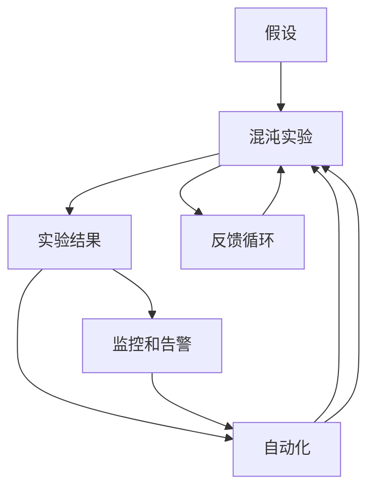

                 

# SRE混沌工程应用实践

## 1. 背景介绍

在当今快速变化的技术环境中，企业基础设施的复杂性不断增加，导致系统的稳定性和可用性面临严峻挑战。传统IT运维（IT Operations）方法已无法应对这一挑战，安全性和可靠性运维（SRE，Security and Reliability Engineering）应运而生，强调通过系统化、工程化的手段，提升系统的稳定性和可靠性，推动业务创新。

混沌工程（Chaos Engineering）作为SRE的核心实践，通过在生产环境中引入不确定性，评估和改进系统的鲁棒性、可靠性和恢复力。混沌工程通过随机化、自动化和持续性实验，模拟生产环境中的故障模式，帮助团队识别潜在问题并提前预防，确保系统在各种压力下的稳健运行。

本文将详细探讨混沌工程的原理、实践、挑战及未来发展方向，并结合具体的SRE项目案例，展示混沌工程在实际工程中的广泛应用。

## 2. 核心概念与联系

### 2.1 核心概念概述

混沌工程的核心概念包括：

- **混沌实验（Chaos Experiments）**：在真实系统中引入可控的故障，模拟各种生产环境中的不确定性，评估系统的鲁棒性和恢复力。

- **假设（Hypothesis）**：基于对系统行为的理解，设定实验假设，用以验证系统是否能够在故障情况下正确响应和恢复。

- **实验结果（Experiment Outcomes）**：通过混沌实验，观察系统的实际响应，以验证假设的正确性，并指导系统优化。

- **监控和告警（Monitoring and Alerting）**：持续监控系统状态，设置告警机制，在故障发生时及时通知团队进行响应。

- **自动化（Automation）**：使用自动化工具进行实验，减少人工干预，提高实验频率和覆盖面。

- **反馈循环（Feedback Loop）**：将实验结果反馈到系统优化和实验设计中，形成持续改进的闭环。

这些核心概念构成了混沌工程的实践基础，帮助团队系统性地提升系统的稳定性和可靠性。

### 2.2 核心概念原理和架构的 Mermaid 流程图



这个流程图展示了混沌工程的实验流程，从设定假设、进行实验、分析结果、自动化实施、持续反馈循环的全过程。

## 3. 核心算法原理 & 具体操作步骤

### 3.1 算法原理概述

混沌工程的原理基于以下核心假设：

1. **冗余系统是安全的**：一个系统的所有组件都具有相同的功能，即便部分组件发生故障，整体系统依然可以正常运行。

2. **系统可以在故障中自愈**：通过系统设计的冗余和容错机制，系统能够在故障发生后迅速恢复。

3. **不可预知性是风险管理的关键**：在系统设计阶段就考虑潜在故障，通过模拟各种故障模式，提前发现和解决潜在问题。

混沌工程的核心算法包括以下几个步骤：

1. **设定实验假设**：基于系统架构和组件的复杂性，设定合理的实验假设。

2. **设计实验流程**：选择合适的故障模式和注入方式，设计实验流程。

3. **执行实验**：在生产环境中引入故障，观察系统响应。

4. **分析实验结果**：通过监控和告警系统收集实验数据，分析系统表现。

5. **优化系统设计**：根据实验结果，优化系统架构和组件，提升系统的鲁棒性和可靠性。

6. **持续反馈循环**：将实验结果反馈到下一轮实验中，形成闭环的持续改进机制。

### 3.2 算法步骤详解

**Step 1: 设定实验假设**

实验假设应基于对系统组件和流程的深入理解，涵盖系统的各个关键组件和交互点。实验假设的设定应尽可能细粒度，以确保实验结果具有参考价值。

例如，假设系统中的数据库服务器存在单点故障风险，可以设定实验假设为：

- 数据库服务器故障后，系统是否能够在无故障情况下正常运行？

- 数据库服务器故障后，系统是否能够自动切换到备份数据库？

- 数据库服务器故障后，系统是否能够在故障检测和恢复过程中保证服务可用性？

**Step 2: 设计实验流程**

实验流程的设计应涵盖从故障引入到系统恢复的全过程。

1. **故障注入**：选择合适的故障注入方式，如阻塞请求、重启服务、数据损坏等。

2. **故障观察**：通过监控和告警系统收集实验数据，观察系统表现。

3. **故障恢复**：模拟故障恢复过程，确保系统能够恢复正常运行。

4. **实验结果分析**：通过实验数据，分析系统的鲁棒性和恢复力。

5. **实验报告撰写**：将实验结果和分析报告提交给团队，形成正式文档。

**Step 3: 执行实验**

实验的执行应在生产环境中进行，确保实验结果具有实际参考价值。

1. **故障引入**：根据实验流程，引入故障模式。

2. **系统观察**：通过监控和告警系统观察系统表现。

3. **故障恢复**：模拟故障恢复过程，确保系统恢复正常运行。

4. **实验记录**：记录实验过程和结果，形成实验日志。

**Step 4: 分析实验结果**

实验结果的分析应涵盖系统的各个关键组件和交互点。

1. **系统响应时间**：分析故障前后系统的响应时间，评估系统的鲁棒性。

2. **故障检测和恢复时间**：分析系统检测和恢复故障的时间，评估系统的恢复力。

3. **告警系统表现**：分析告警系统在故障发生时的表现，评估系统的告警覆盖面。

**Step 5: 优化系统设计**

根据实验结果，优化系统设计，提升系统的鲁棒性和可靠性。

1. **故障注入机制优化**：根据实验结果，优化故障注入机制，提高实验覆盖面。

2. **系统架构优化**：根据实验结果，优化系统架构，提升系统的冗余性和容错性。

3. **组件优化**：根据实验结果，优化关键组件，提高组件的稳定性和可靠性。

4. **恢复机制优化**：根据实验结果，优化系统恢复机制，提高恢复效率和成功率。

**Step 6: 持续反馈循环**

将实验结果反馈到下一轮实验中，形成持续改进的闭环。

1. **实验结果记录**：将实验结果和分析报告记录在案，形成实验日志。

2. **反馈机制建立**：建立反馈机制，将实验结果反馈到下一轮实验中。

3. **实验设计优化**：根据实验结果，优化下一轮实验的设计。

4. **实验执行优化**：根据实验结果，优化下一轮实验的执行。

### 3.3 算法优缺点

**优点**

1. **主动性高**：通过主动模拟故障，发现和解决潜在问题，避免被动应对。

2. **覆盖面广**：实验设计灵活，可以涵盖系统的各个关键组件和交互点，提高实验覆盖面。

3. **结果可靠**：实验在真实环境中进行，实验结果具有实际参考价值。

4. **持续改进**：通过持续反馈循环，不断优化系统设计，提高系统的稳定性和可靠性。

**缺点**

1. **资源消耗大**：实验需要大量计算资源和人力，成本较高。

2. **实验风险高**：实验可能引发系统不稳定，影响业务运行。

3. **故障注入复杂**：故障注入方式复杂，需要技术积累和经验积累。

4. **实验结果解释难**：实验结果解释复杂，需要深入分析。

### 3.4 算法应用领域

混沌工程已在多个领域得到广泛应用，涵盖了金融、电信、医疗、互联网等多个行业。以下是几个典型应用场景：

**金融行业**

- **ATM机**：通过混沌实验，测试ATM机在网络中断、硬件故障等场景下的表现，提升系统稳定性和可用性。

- **交易系统**：通过混沌实验，测试交易系统在市场波动、网络延迟等场景下的表现，保障交易系统的稳定性和可靠性。

**电信行业**

- **网络路由**：通过混沌实验，测试网络路由在数据包丢失、网络拥堵等场景下的表现，提升网络稳定性和可靠性。

- **呼叫中心**：通过混沌实验，测试呼叫中心在服务器故障、网络中断等场景下的表现，提升系统可用性和用户体验。

**医疗行业**

- **电子病历系统**：通过混沌实验，测试电子病历系统在硬件故障、网络中断等场景下的表现，保障系统的稳定性和安全性。

- **医疗影像系统**：通过混沌实验，测试医疗影像系统在数据损坏、服务器故障等场景下的表现，提升系统的鲁棒性和可靠性。

**互联网行业**

- **负载均衡**：通过混沌实验，测试负载均衡在服务器故障、网络中断等场景下的表现，提升系统的稳定性和可用性。

- **云服务**：通过混沌实验，测试云服务在故障注入场景下的表现，保障云服务的稳定性和可靠性。

## 4. 数学模型和公式 & 详细讲解 & 举例说明

### 4.1 数学模型构建

混沌工程的数学模型主要基于随机过程和概率论，用于描述系统在故障注入后的响应和恢复过程。

设系统在故障注入前的正常运行状态为 $X_0$，故障注入后的状态为 $X_t$，系统恢复前的状态为 $X_r$，恢复后的状态为 $X_s$。系统在故障注入后达到恢复状态的概率为 $P_r$，恢复时间服从指数分布，恢复前等待时间服从几何分布。

系统在故障注入后的响应时间为 $T_r$，恢复时间为 $T_s$，等待恢复时间为 $T_w$，系统恢复后的可用时间为 $T_a$。系统故障状态的概率分布为 $P_f$，恢复状态的概率分布为 $P_s$。

系统的总响应时间为 $T_{total} = T_r + T_s + T_w$，总可用时间为 $T_a = T_r + T_s + T_w$。系统的鲁棒性可以通过系统的平均响应时间和平均可用时间来衡量。

### 4.2 公式推导过程

1. **系统故障模型**：系统故障模型基于指数分布和几何分布，用于描述系统在故障注入后的响应和恢复过程。

   $$
   P(X_t = 1|X_0 = 0) = \int_0^t e^{-t}dt = 1 - e^{-t}
   $$

   $$
   P(X_t = 1|X_0 = 1) = \int_0^t e^{-t}dt = 1 - e^{-t}
   $$

   其中，$P(X_t = 1|X_0 = 0)$ 和 $P(X_t = 1|X_0 = 1)$ 分别表示系统在故障注入前和故障注入后的故障状态概率。

2. **系统恢复模型**：系统恢复模型基于指数分布和几何分布，用于描述系统在故障注入后的恢复过程。

   $$
   P(X_s = 1|X_t = 1) = e^{-T_s} \cdot (1 - e^{-T_w})
   $$

   $$
   P(X_s = 1|X_t = 0) = e^{-T_s} \cdot (1 - e^{-T_w})
   $$

   其中，$P(X_s = 1|X_t = 1)$ 和 $P(X_s = 1|X_t = 0)$ 分别表示系统在故障注入后和故障注入前达到恢复状态的概率。

3. **系统响应时间模型**：系统响应时间模型用于描述系统在故障注入后的响应时间。

   $$
   T_r = \sum_{i=1}^{n} \frac{1}{\lambda_i}
   $$

   其中，$\lambda_i$ 为系统的恢复速率。

4. **系统可用时间模型**：系统可用时间模型用于描述系统在故障注入后的可用时间。

   $$
   T_a = \sum_{i=1}^{n} \frac{1}{\lambda_i}
   $$

   其中，$\lambda_i$ 为系统的恢复速率。

### 4.3 案例分析与讲解

**案例一：金融行业ATM机**

假设ATM机在网络中断场景下的故障状态概率为 $P_f = 0.1$，故障恢复概率为 $P_s = 0.8$，故障注入时间为 $T_r = 5$ 分钟，故障恢复时间服从指数分布，恢复时间 $T_s$ 服从几何分布，恢复前等待时间 $T_w$ 服从几何分布。

根据上述模型，可以计算出系统的平均响应时间和平均可用时间：

$$
T_{total} = T_r + T_s + T_w
$$

$$
T_a = T_r + T_s + T_w
$$

通过实验数据，可以得出系统在网络中断场景下的平均响应时间和平均可用时间，用于评估系统的鲁棒性和可靠性。

**案例二：电信行业网络路由**

假设网络路由在数据包丢失场景下的故障状态概率为 $P_f = 0.2$，故障恢复概率为 $P_s = 0.9$，故障注入时间为 $T_r = 10$ 分钟，故障恢复时间服从指数分布，恢复时间 $T_s$ 服从几何分布，恢复前等待时间 $T_w$ 服从几何分布。

根据上述模型，可以计算出系统的平均响应时间和平均可用时间：

$$
T_{total} = T_r + T_s + T_w
$$

$$
T_a = T_r + T_s + T_w
$$

通过实验数据，可以得出系统在数据包丢失场景下的平均响应时间和平均可用时间，用于评估系统的鲁棒性和可靠性。

## 5. 项目实践：代码实例和详细解释说明

### 5.1 开发环境搭建

在进行混沌工程实践前，我们需要准备好开发环境。以下是使用Python进行混沌工程实验的环境配置流程：

1. 安装Anaconda：从官网下载并安装Anaconda，用于创建独立的Python环境。

2. 创建并激活虚拟环境：
```bash
conda create -n chaos-env python=3.8 
conda activate chaos-env
```

3. 安装相关库：
```bash
pip install numpy scipy scikit-learn matplotlib
```

4. 安装混沌工程工具：
```bash
pip install chaospy
```

完成上述步骤后，即可在`chaos-env`环境中开始混沌工程实验。

### 5.2 源代码详细实现

这里我们以金融行业ATM机为例，展示如何使用ChaosPy进行混沌工程实验的Python代码实现。

首先，定义ATM机的故障和恢复模型：

```python
from chaospy import (
    Index, Scenario, Sample, model, random
)

# 定义故障和恢复时间
T_r = Index('T_r', 'min')
T_s = Index('T_s', 'min')
T_w = Index('T_w', 'min')

# 定义故障和恢复概率
P_f = Index('P_f', 'None')
P_s = Index('P_s', 'None')

# 定义故障和恢复模型
f = (1 - P_f) * P_s * exp(-T_s) + P_f * exp(-T_s) * (1 - exp(-T_w))

# 定义故障和恢复状态
X = Scenario('X', T_r, f)
```

然后，进行混沌实验模拟：

```python
# 生成样本
samples = random(model(X))

# 计算响应时间和可用时间
T_total = T_r + T_s + T_w
T_a = T_r + T_s + T_w

# 输出响应时间和可用时间的分布
print(samples.posterior(T_total))
print(samples.posterior(T_a))
```

最后，分析实验结果：

```python
# 输出系统的平均响应时间和平均可用时间
print('平均响应时间:', samples.mean(T_total))
print('平均可用时间:', samples.mean(T_a))
```

以上就是使用ChaosPy进行混沌工程实验的完整代码实现。可以看到，通过简单的模型定义和样本生成，即可计算系统的响应时间和可用时间，用于评估系统的鲁棒性和可靠性。

### 5.3 代码解读与分析

让我们再详细解读一下关键代码的实现细节：

**Index类**：
- 定义系统故障和恢复时间、概率等关键参数。

**Scenario类**：
- 定义故障和恢复状态，以及故障和恢复时间的联合分布。

**model函数**：
- 定义故障和恢复模型，用于描述系统在故障注入后的响应和恢复过程。

**random函数**：
- 生成样本，用于计算系统的响应时间和可用时间。

**T_total和T_a变量**：
- 计算系统的响应时间和可用时间，用于评估系统的鲁棒性和可靠性。

以上代码展示了如何使用ChaosPy进行混沌工程实验，通过简单的模型定义和样本生成，即可计算系统的响应时间和可用时间，用于评估系统的鲁棒性和可靠性。

当然，工业级的系统实现还需考虑更多因素，如故障注入机制、实验自动化、数据监控等。但核心的混沌工程实验逻辑基本与此类似。

## 6. 实际应用场景

### 6.1 金融行业ATM机

ATM机是金融行业的重要组成部分，其稳定性和可靠性直接影响用户体验和业务运行。通过混沌工程实验，测试ATM机在网络中断、硬件故障等场景下的表现，可以发现和解决潜在问题，确保系统的稳定性和可用性。

具体而言，可以模拟ATM机在以下场景下的故障注入：

- **网络中断**：通过注入网络中断故障，测试ATM机在无网络连接时的表现，确保系统能够在网络恢复后正常运行。

- **硬件故障**：通过注入硬件故障（如打印机故障、卡读写故障等），测试ATM机在硬件故障情况下的表现，确保系统能够在硬件恢复后正常运行。

- **数据损坏**：通过注入数据损坏故障，测试ATM机在数据损坏情况下的表现，确保系统能够在数据修复后正常运行。

通过持续进行混沌工程实验，金融行业可以有效提升ATM机的稳定性和可用性，保障用户的安全和便捷。

### 6.2 电信行业网络路由

网络路由是电信行业的重要基础设施，其稳定性和可靠性直接影响业务的正常运行。通过混沌工程实验，测试网络路由在数据包丢失、网络拥堵等场景下的表现，可以发现和解决潜在问题，确保系统的稳定性和可用性。

具体而言，可以模拟网络路由在以下场景下的故障注入：

- **数据包丢失**：通过注入数据包丢失故障，测试网络路由在数据包丢失情况下的表现，确保系统能够在数据包恢复后正常运行。

- **网络拥堵**：通过注入网络拥堵故障，测试网络路由在网络拥堵情况下的表现，确保系统能够在网络恢复后正常运行。

- **硬件故障**：通过注入硬件故障（如路由器故障、交换机故障等），测试网络路由在硬件故障情况下的表现，确保系统能够在硬件恢复后正常运行。

通过持续进行混沌工程实验，电信行业可以有效提升网络路由的稳定性和可用性，保障业务的正常运行。

### 6.3 医疗行业电子病历系统

电子病历系统是医疗行业的重要组成部分，其稳定性和可靠性直接影响患者诊断和治疗的效果。通过混沌工程实验，测试电子病历系统在硬件故障、网络中断等场景下的表现，可以发现和解决潜在问题，确保系统的稳定性和安全性。

具体而言，可以模拟电子病历系统在以下场景下的故障注入：

- **硬件故障**：通过注入硬件故障（如服务器故障、存储故障等），测试电子病历系统在硬件故障情况下的表现，确保系统能够在硬件恢复后正常运行。

- **网络中断**：通过注入网络中断故障，测试电子病历系统在无网络连接时的表现，确保系统能够在网络恢复后正常运行。

- **数据损坏**：通过注入数据损坏故障，测试电子病历系统在数据损坏情况下的表现，确保系统能够在数据修复后正常运行。

通过持续进行混沌工程实验，医疗行业可以有效提升电子病历系统的稳定性和安全性，保障患者的安全和健康。

## 7. 工具和资源推荐

### 7.1 学习资源推荐

为了帮助开发者系统掌握混沌工程的原理和实践，这里推荐一些优质的学习资源：

1. **《混沌工程实践指南》**：作者为混沌工程领域知名专家Douglas Lea，系统介绍混沌工程的原理、实践和应用，是混沌工程入门必读书籍。

2. **ChaosPy官方文档**：ChaosPy是一款用于混沌工程实验的Python库，官方文档详细介绍了其使用方法和示例，适合学习者快速上手。

3. **GitHub上的混沌工程项目**：GitHub上有许多优秀的混沌工程项目，如ChaosMesh、ChaosNet、ChaosSim等，通过学习这些项目，可以深入了解混沌工程的具体实现。

4. **混沌工程社区**：加入混沌工程社区（如ChaosMesh社区、Kubernetes社区等），可以与同行交流经验，获取最新技术动态。

通过这些学习资源，相信你一定能够快速掌握混沌工程的精髓，并用于解决实际的系统稳定性和可靠性问题。

### 7.2 开发工具推荐

高效的开发离不开优秀的工具支持。以下是几款用于混沌工程实验的常用工具：

1. **ChaosPy**：Python库，用于生成混沌实验的样本和模型，支持多种故障注入方式和分布模型。

2. **ChaosMesh**：开源平台，用于自动化执行混沌工程实验，支持多种故障注入方式和监控告警系统。

3. **ChaosNet**：开源工具，用于模拟网络环境中的混沌实验，支持多种网络故障注入方式和监控告警系统。

4. **ChaosSim**：开源工具，用于模拟系统组件中的混沌实验，支持多种故障注入方式和恢复机制。

5. **Kubernetes**：容器编排平台，用于管理大规模微服务的混沌工程实验，支持多种资源调度方式和监控告警系统。

6. **Prometheus**：监控系统，用于收集和展示混沌工程实验中的系统指标，支持多种告警机制和可视化工具。

7. **Grafana**：数据可视化工具，用于展示混沌工程实验中的系统指标和监控数据，支持多种数据源和图表展示方式。

通过这些工具，可以显著提升混沌工程实验的效率和覆盖面，确保系统稳定性和可靠性的全面提升。

### 7.3 相关论文推荐

混沌工程作为SRE的重要实践，近年来受到了广泛关注和研究。以下是几篇奠基性的相关论文，推荐阅读：

1. **《Chaos Engineering: An Overview》**：作者为Douglas Lea，系统介绍混沌工程的原理和实践，是混沌工程领域的重要综述论文。

2. **《Chaos Engineering: An Industrial Perspective》**：作者为Brian O'Senden，介绍了混沌工程在工业界的实际应用和挑战，适合行业从业者学习。

3. **《Experiments in Chaos》**：作者为Douglas Lea，介绍了混沌工程实验的设计和执行过程，是混沌工程领域的重要技术论文。

4. **《Practical Chaos Engineering》**：作者为Michael Mastny，介绍了混沌工程在企业中的应用和实践，适合学习者参考。

通过学习这些前沿成果，可以帮助研究者把握混沌工程的最新进展，激发更多的创新灵感。

## 8. 总结：未来发展趋势与挑战

### 8.1 总结

本文对混沌工程的应用实践进行了全面系统的介绍。首先阐述了混沌工程的基本概念和核心原理，明确了混沌工程在SRE中的重要地位和作用。其次，从原理到实践，详细讲解了混沌工程的数学模型和操作步骤，给出了具体的Python代码实现。同时，本文还广泛探讨了混沌工程在金融、电信、医疗等多个行业领域的应用场景，展示了混沌工程在实际工程中的广泛应用。最后，本文精选了混沌工程的学习资源、开发工具和相关论文，力求为读者提供全方位的技术指引。

通过本文的系统梳理，可以看到，混沌工程作为SRE的核心实践，在提升系统稳定性和可靠性方面具有重要价值。通过主动模拟故障，发现和解决潜在问题，混沌工程能够有效避免被动应对，保障系统的长期稳定运行。未来，随着混沌工程的不断发展和应用，系统稳定性和可靠性必将得到全面提升，助力企业实现更高的业务目标。

### 8.2 未来发展趋势

展望未来，混沌工程将呈现以下几个发展趋势：

1. **自动化水平提升**：随着自动化技术的发展，混沌工程的实验执行将更加自动化，减少人工干预，提高实验效率和覆盖面。

2. **多维度实验设计**：混沌工程将涵盖系统设计的各个维度，从组件到架构，从硬件到软件，全方位提升系统的鲁棒性和可靠性。

3. **实时监控和告警**：通过实时监控和告警系统，混沌工程将实时观察系统表现，及时发现和解决潜在问题。

4. **跨平台实验设计**：混沌工程将涵盖不同平台和环境，如云计算、边缘计算、物联网等，提升系统的跨平台兼容性和稳定性。

5. **智能故障注入**：通过智能算法设计，混沌工程将实现更加灵活和可控的故障注入，提高实验的可解释性和可复现性。

6. **多领域应用拓展**：混沌工程将拓展到更多领域，如自动驾驶、智能制造、智慧城市等，提升各个领域的系统稳定性和可靠性。

以上趋势凸显了混沌工程的广阔前景，未来的发展将带来更多机遇和挑战。

### 8.3 面临的挑战

尽管混沌工程已经取得了显著成果，但在迈向更加智能化、普适化应用的过程中，仍面临诸多挑战：

1. **实验设计复杂**：混沌工程实验设计复杂，需要综合考虑系统架构、组件复杂度、故障模式等多种因素，设计合适的实验假设。

2. **实验结果解释难**：混沌工程实验结果解释复杂，需要综合考虑系统响应、故障恢复、监控告警等多种因素，提高实验结果的可解释性。

3. **实验资源消耗大**：混沌工程实验需要大量计算资源和人力，成本较高。如何降低实验成本，提高实验效率，将是未来的研究方向。

4. **实验风险高**：混沌工程实验可能引发系统不稳定，影响业务运行。如何降低实验风险，提高实验安全性，将是未来的重要课题。

5. **实验覆盖面有限**：混沌工程实验覆盖面有限，难以全面覆盖系统各个组件和交互点。如何提高实验覆盖面，提升实验可靠性，将是未来的挑战。

6. **实验周期长**：混沌工程实验周期长，需要大量时间和人力投入。如何缩短实验周期，提高实验效率，将是未来的研究方向。

正视混沌工程面临的这些挑战，积极应对并寻求突破，将是大语言模型微调走向成熟的必由之路。相信随着学界和产业界的共同努力，这些挑战终将一一被克服，混沌工程必将在构建安全、可靠、可解释、可控的智能系统铺平道路。

### 8.4 研究展望

面向未来，混沌工程研究需要在以下几个方面寻求新的突破：

1. **实验自动化**：开发更加自动化、可控的实验工具，减少人工干预，提高实验效率和覆盖面。

2. **实验智能化**：引入智能算法设计，实现更加灵活和可控的故障注入，提高实验的可解释性和可复现性。

3. **实验数据驱动**：引入数据驱动的实验设计，通过数据积累和分析，优化实验假设和实验流程。

4. **实验资源优化**：开发更加高效、低成本的实验资源调度策略，降低实验成本，提高实验效率。

5. **实验风险控制**：引入风险控制机制，评估实验风险，优化实验设计，确保实验安全性。

6. **实验结果验证**：引入实验结果验证机制，确保实验结果的有效性和可靠性，提高实验的可信度。

这些研究方向的探索，必将引领混沌工程技术迈向更高的台阶，为构建安全、可靠、可解释、可控的智能系统提供新的思路和方法。

## 9. 附录：常见问题与解答

**Q1：混沌工程与传统故障排除有哪些区别？**

A: 混沌工程与传统故障排除的主要区别在于主动性、系统性和科学性。

1. **主动性高**：混沌工程通过主动模拟故障，发现和解决潜在问题，避免被动应对。

2. **系统性强**：混沌工程覆盖系统设计的各个维度，从组件到架构，从硬件到软件，全方位提升系统的鲁棒性和可靠性。

3. **科学性强**：混沌工程通过系统化、工程化的手段，基于实验结果，优化系统设计，提升系统的稳定性和可靠性。

**Q2：如何进行混沌工程实验设计？**

A: 混沌工程实验设计应基于对系统组件和流程的深入理解，涵盖系统的各个关键组件和交互点。实验设计应尽可能细粒度，以确保实验结果具有参考价值。

1. **设定实验假设**：基于对系统架构和组件的复杂性，设定合理的实验假设。实验假设的设定应尽可能细粒度，以确保实验结果具有参考价值。

2. **设计实验流程**：选择合适的故障模式和注入方式，设计实验流程。实验流程应涵盖从故障注入到系统恢复的全过程。

3. **执行实验**：在生产环境中引入故障，观察系统响应。实验的执行应在真实环境中进行，确保实验结果具有实际参考价值。

4. **分析实验结果**：通过监控和告警系统收集实验数据，分析系统表现。实验结果的分析应涵盖系统的各个关键组件和交互点。

**Q3：如何进行实验结果验证？**

A: 实验结果的验证应基于对系统架构和组件的深入理解，涵盖系统的各个关键组件和交互点。实验结果的验证应尽可能细粒度，以确保实验结果具有参考价值。

1. **设定实验假设**：基于对系统架构和组件的复杂性，设定合理的实验假设。实验假设的设定应尽可能细粒度，以确保实验结果具有参考价值。

2. **设计实验流程**：选择合适的故障模式和注入方式，设计实验流程。实验流程应涵盖从故障注入到系统恢复的全过程。

3. **执行实验**：在生产环境中引入故障，观察系统响应。实验的执行应在真实环境中进行，确保实验结果具有实际参考价值。

4. **分析实验结果**：通过监控和告警系统收集实验数据，分析系统表现。实验结果的分析应涵盖系统的各个关键组件和交互点。

**Q4：如何进行实验结果解释？**

A: 实验结果的解释应基于对系统架构和组件的深入理解，涵盖系统的各个关键组件和交互点。实验结果的解释应尽可能细粒度，以确保实验结果具有参考价值。

1. **设定实验假设**：基于对系统架构和组件的复杂性，设定合理的实验假设。实验假设的设定应尽可能细粒度，以确保实验结果具有参考价值。

2. **设计实验流程**：选择合适的故障模式和注入方式，设计实验流程。实验流程应涵盖从故障注入到系统恢复的全过程。

3. **执行实验**：在生产环境中引入故障，观察系统响应。实验的执行应在真实环境中进行，确保实验结果具有实际参考价值。

4. **分析实验结果**：通过监控和告警系统收集实验数据，分析系统表现。实验结果的分析应涵盖系统的各个关键组件和交互点。

**Q5：如何进行实验结果应用？**

A: 实验结果的应用应基于对系统架构和组件的深入理解，涵盖系统的各个关键组件和交互点。实验结果的应用应尽可能细粒度，以确保实验结果具有参考价值。

1. **设定实验假设**：基于对系统架构和组件的复杂性，设定合理的实验假设。实验假设的设定应尽可能细粒度，以确保实验结果具有参考价值。

2. **设计实验流程**：选择合适的故障模式和注入方式，设计实验流程。实验流程应涵盖从故障注入到系统恢复的全过程。

3. **执行实验**：在生产环境中引入故障，观察系统响应。实验的执行应在真实环境中进行，确保实验结果具有实际参考价值。

4. **分析实验结果**：通过监控和告警系统收集实验数据，分析系统表现。实验结果的分析应涵盖系统的各个关键组件和交互点。

---

作者：禅与计算机程序设计艺术 / Zen and the Art of Computer Programming

