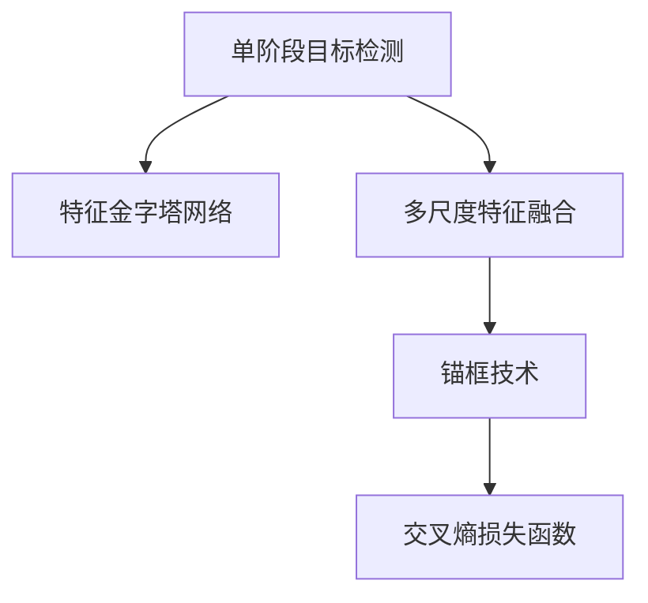

                 

# SSD原理与代码实例讲解

## 1. 背景介绍

在计算机视觉领域，目标检测（Object Detection）是一项基本且重要的任务，其目标是在图像或视频中准确识别出各种不同类别的物体，并标定其位置。由于目标检测任务的复杂性和挑战性，它一直是学术界和工业界关注的重点，也是计算机视觉领域众多技术的融合和体现。单阶段目标检测（Single-Shot MultiBox Detector, SSD）是目标检测领域的一种重要技术，它利用特征金字塔网络（Feature Pyramid Network, FPN）和多尺度特征融合等思想，在保证检测速度的同时，取得了良好的检测精度。

### 1.1 问题由来

传统的目标检测方法，如R-CNN、Fast R-CNN、Faster R-CNN等，通常需要多阶段、两路网络的配合，步骤繁杂，速度较慢。而单阶段目标检测方法直接从全卷积网络（FCN）中提取特征，并用单一路网络完成目标检测任务，大幅简化了模型结构和训练流程，提高了检测速度。SSD作为单阶段目标检测的代表方法，其核心思想是通过在全卷积网络中构建特征金字塔，在不同尺度的特征图上进行目标检测，以处理不同大小的物体。

### 1.2 问题核心关键点

本节将介绍SSD模型的核心概念及其设计思路。

- 单阶段目标检测：SSD方法旨在通过单阶段网络进行目标检测，省去了复杂的候选区域生成过程，使得模型训练和推理速度大幅提高。
- 特征金字塔网络：SSD通过构建多尺度的特征图来同时检测不同大小的物体，确保了目标检测的全面性和准确性。
- 多尺度特征融合：SSD在多尺度特征图上同时进行目标检测，并通过特征融合技术，将不同尺度上的特征信息整合起来，提高了检测的鲁棒性和泛化能力。
- 锚框（Anchor Box）：锚框技术通过在特征点上生成多个不同大小的候选框，显著减少了候选框的数量，提高了模型的检测速度和效率。

## 2. 核心概念与联系

### 2.1 核心概念概述

为更好地理解SSD原理，本节将介绍几个关键概念：

- 单阶段目标检测：SSD利用全卷积网络直接输出目标类别和位置，不依赖候选区域生成器，大幅简化模型结构。
- 特征金字塔网络：将不同尺度的特征图融合，便于检测不同大小的物体。
- 多尺度特征融合：通过不同尺度的特征融合，提升目标检测的鲁棒性和泛化能力。
- 锚框技术：在特征点上生成多个不同大小的候选框，减少候选框数量，提高检测速度和效率。
- 交叉熵损失函数：SSD使用交叉熵损失函数进行目标检测的训练和优化。

这些概念之间的逻辑关系可以通过以下Mermaid流程图来展示：



这个流程图展示了我本节的核心概念及其关系：

1. 单阶段目标检测通过全卷积网络直接输出目标类别和位置，省去了复杂的候选区域生成器。
2. 特征金字塔网络通过构建多尺度的特征图来检测不同大小的物体，确保了检测的全面性和准确性。
3. 多尺度特征融合将不同尺度上的特征信息整合起来，提升了检测的鲁棒性和泛化能力。
4. 锚框技术在特征点上生成多个不同大小的候选框，减少了候选框数量，提高了检测速度和效率。
5. 交叉熵损失函数用于目标检测的训练和优化，使得模型能够准确预测目标类别和位置。

这些核心概念共同构成了SSD模型的主要设计思路，使得模型在保证检测速度的同时，实现了较好的检测精度。

## 3. 核心算法原理 & 具体操作步骤
### 3.1 算法原理概述

SSD模型是一种基于特征金字塔的单阶段目标检测方法，其核心思想是通过不同尺度的特征图进行目标检测。具体来说，SSD模型首先在全卷积网络中提取多尺度特征，然后在不同尺度的特征图上进行目标检测，并使用交叉熵损失函数进行训练优化。

## 3.2 算法步骤详解

以下是SSD模型训练和推理的具体操作步骤：

**Step 1: 特征提取网络构建**

首先，我们构建一个特征提取网络，通常使用ResNet、VGG等经典网络。在特征提取网络最后一层的卷积层后，输出多个不同尺度的特征图，作为SSD模型的输入。

**Step 2: 特征金字塔网络设计**

接着，我们将这些特征图进行上采样和降采样，构建不同尺度的特征图，形成特征金字塔网络。通常，我们使用3个不同尺度的特征图，分别对应不同的目标大小范围。

**Step 3: 锚框生成和检测区域划分**

在每个尺度特征图上，我们在每个位置生成多个不同大小的候选框（锚框）。锚框大小通常包括小、中、大三种尺寸，并随机选择每个锚框对应的目标类别。候选框被划分为检测区域，每个检测区域对应一个类别预测和位置预测。

**Step 4: 目标检测预测**

对于每个检测区域，我们将其特征映射到目标检测预测部分，进行目标类别和位置的预测。目标检测部分通常是一个全连接层，输出目标类别和位置回归的偏移量。

**Step 5: 非极大值抑制（NMS）**

最后，我们对所有预测的候选框进行非极大值抑制（NMS）操作，去除重复的框，只保留置信度最高且IoU最大的一个框。

**Step 6: 损失函数计算和优化**

我们将所有检测区域的预测结果与真实标签进行比较，计算交叉熵损失和位置回归损失，通过反向传播算法更新模型参数。

## 3.3 算法优缺点

SSD模型在目标检测领域具有以下优点：

1. 检测速度快：由于是单阶段目标检测，不需要候选区域生成器，模型训练和推理速度较快。
2. 检测精度高：多尺度特征融合和锚框技术提高了检测的全面性和准确性。
3. 适应性强：可以处理不同大小、不同方向的物体。
4. 参数量少：相对于多阶段目标检测方法，SSD模型参数量较少，模型结构简单。

同时，该模型也存在一些缺点：

1. 对小目标检测效果不佳：由于特征金字塔网络只包含3个尺度，对小目标的检测效果较差。
2. 模型复杂度相对较高：特征金字塔网络和多尺度特征融合都需要额外的计算资源。
3. 对尺度变化敏感：尺度较大的物体可能会被分割成多个小框。

## 3.4 算法应用领域

SSD模型在目标检测领域的应用非常广泛，可以用于车辆检测、行人检测、交通标志识别等场景。特别是在自动驾驶、智能交通等领域，SSD模型的检测速度和精度能够满足实时性和准确性的要求。

## 4. 数学模型和公式 & 详细讲解 & 举例说明

### 4.1 数学模型构建

在SSD模型中，我们使用特征金字塔网络提取多尺度的特征图，并通过全连接层进行目标检测。假设输入图像大小为$H\times W$，特征图大小为$S\times S$，每个尺度的特征图大小为$k\times k$，每个尺度上生成$m$个锚框，则特征图上的锚框总数为$N=\sum_i m_i$。每个锚框预测目标类别和位置回归的偏移量。假设目标类别数为$C$，预测框的边界偏移量为$(x,y)$，则目标检测模型的输出为：

$$
\text{输出}=\text{预测类别}+\text{位置偏移量}
$$

其中，预测类别使用交叉熵损失函数计算，位置偏移量使用平滑L1损失函数计算。

### 4.2 公式推导过程

下面我们对SSD模型的目标检测部分进行公式推导。假设特征图大小为$k\times k$，每个锚框预测目标类别$c$的概率为$p_c$，目标框的边界偏移量为$(x,y)$，则目标检测的损失函数为：

$$
\mathcal{L}=\sum_{i,j}\mathcal{L}_{\text{分类}}(c)+\mathcal{L}_{\text{回归}}(x,y)
$$

其中，$\mathcal{L}_{\text{分类}}$为交叉熵损失函数，$\mathcal{L}_{\text{回归}}$为平滑L1损失函数。

具体来说，交叉熵损失函数为：

$$
\mathcal{L}_{\text{分类}}(c)=-\sum_{i=1}^{C}\sum_{j=1}^{N}y_{ij}\log p_{ij}
$$

其中，$y_{ij}$为标签，$p_{ij}$为预测类别概率，$C$为目标类别数，$N$为锚框总数。

平滑L1损失函数为：

$$
\mathcal{L}_{\text{回归}}(x,y)=(\max(0,1-|x-\hat{x}|)+\max(0,1-|y-\hat{y}|))
$$

其中，$x$为预测框边界，$\hat{x}$为真实框边界。

### 4.3 案例分析与讲解

以车辆检测为例，SSD模型通过特征金字塔网络提取不同尺度的特征图，每个特征图上生成多个不同大小的候选框（锚框）。每个锚框预测车辆类别和位置偏移量。在训练过程中，我们使用真实车辆标签和锚框预测结果的交叉熵损失和位置偏移损失进行优化。在推理过程中，我们通过非极大值抑制（NMS）操作，去除重复的框，只保留置信度最高且IoU最大的一个框。

## 5. 项目实践：代码实例和详细解释说明

### 5.1 开发环境搭建

在进行SSD模型开发前，我们需要准备好开发环境。以下是使用PyTorch进行SSD模型开发的环境配置流程：

1. 安装Anaconda：从官网下载并安装Anaconda，用于创建独立的Python环境。

2. 创建并激活虚拟环境：
```bash
conda create -n ssd-env python=3.8 
conda activate ssd-env
```

3. 安装PyTorch：根据CUDA版本，从官网获取对应的安装命令。例如：
```bash
conda install pytorch torchvision torchaudio cudatoolkit=11.1 -c pytorch -c conda-forge
```

4. 安装PIL库：用于图像处理。

5. 安装OpenCV库：用于视频处理。

6. 安装TensorBoard：用于可视化训练过程。

7. 安装Hyperopt：用于超参数优化。

完成上述步骤后，即可在`ssd-env`环境中开始SSD模型开发。

### 5.2 源代码详细实现

下面以SSD模型在图像中检测车辆为例，给出使用PyTorch实现SSD模型的完整代码实现。

首先，定义SSD模型的结构：

```python
import torch.nn as nn
import torch.nn.functional as F

class SSD(nn.Module):
    def __init__(self, num_classes, feature_sizes, anchor_sizes):
        super(SSD, self).__init__()
        self.num_classes = num_classes
        self.feature_sizes = feature_sizes
        self.anchor_sizes = anchor_sizes
        
        # 定义特征提取网络
        self.conv1 = nn.Conv2d(3, 64, 7)
        self.maxpool = nn.MaxPool2d(2, 2)
        self.conv2 = nn.Conv2d(64, 128, 3, padding=1)
        self.conv3 = nn.Conv2d(128, 256, 3, padding=1)
        self.conv4 = nn.Conv2d(256, 512, 3, padding=1)
        self.conv5 = nn.Conv2d(512, 1024, 3, padding=1)
        
        # 定义目标检测部分
        self.fc_loc = nn.Conv2d(1024, num_classes * 4, 3, padding=1)
        self.fc_conf = nn.Conv2d(1024, num_classes, 3, padding=1)
        
        # 定义特征金字塔网络
        self.fpn = nn.Sequential(
            nn.Conv2d(512, 256, 1),
            nn.Conv2d(256, 256, 3, padding=1),
            nn.ReLU(inplace=True),
            nn.MaxPool2d(2, 2),
            nn.Conv2d(256, 256, 1),
            nn.Conv2d(256, 256, 3, padding=1),
            nn.ReLU(inplace=True),
            nn.MaxPool2d(2, 2),
            nn.Conv2d(256, 256, 1),
            nn.Conv2d(256, 256, 3, padding=1),
            nn.ReLU(inplace=True),
            nn.MaxPool2d(2, 2)
        )
        
    def forward(self, x):
        # 特征提取网络
        x = self.conv1(x)
        x = F.relu(x)
        x = self.maxpool(x)
        x = self.conv2(x)
        x = F.relu(x)
        x = self.conv3(x)
        x = F.relu(x)
        x = self.conv4(x)
        x = F.relu(x)
        x = self.conv5(x)
        x = F.relu(x)
        
        # 特征金字塔网络
        x = self.fpn(x)
        x = self.fpn(x)
        x = self.fpn(x)
        
        # 目标检测部分
        loc_pred = self.fc_loc(x)
        conf_pred = self.fc_conf(x)
        return loc_pred, conf_pred
```

然后，定义损失函数和优化器：

```python
from torch.optim import Adam

# 定义交叉熵损失函数
def cross_entropy_loss(preds, labels):
    return F.cross_entropy(preds, labels)

# 定义平滑L1损失函数
def smooth_l1_loss(preds, labels):
    delta = 1.0
    loss = F.smooth_l1_loss(preds, labels, reduction='sum', delta=delta)
    return loss / delta

# 定义模型损失函数
def ssd_loss(preds, labels, num_classes):
    conf_loss = smooth_l1_loss(preds['conf'], labels['conf'])
    loc_loss = smooth_l1_loss(preds['loc'], labels['loc'])
    return conf_loss + loc_loss

# 定义优化器
optimizer = Adam(model.parameters(), lr=1e-4)
```

接着，定义训练和推理函数：

```python
from torchvision import datasets, transforms
import torchvision
from torch.utils.data import DataLoader
from tqdm import tqdm

# 定义数据处理函数
transform = transforms.Compose([
    transforms.ToTensor(),
    transforms.Normalize(mean=[0.485, 0.456, 0.406], std=[0.229, 0.224, 0.225])
])

# 加载训练集
train_dataset = torchvision.datasets.CIFAR10(root='./data', train=True, transform=transform, download=True)
train_loader = DataLoader(train_dataset, batch_size=64, shuffle=True)

# 加载测试集
test_dataset = torchvision.datasets.CIFAR10(root='./data', train=False, transform=transform, download=True)
test_loader = DataLoader(test_dataset, batch_size=64, shuffle=False)

# 训练函数
def train_epoch(model, data_loader, optimizer):
    model.train()
    total_loss = 0.0
    for data, target in data_loader:
        optimizer.zero_grad()
        inputs, labels = data.to(device), target.to(device)
        loc_pred, conf_pred = model(inputs)
        loss = ssd_loss(loc_pred, labels, num_classes=10)
        loss.backward()
        optimizer.step()
        total_loss += loss.item()
    return total_loss / len(data_loader)

# 推理函数
def predict(model, images):
    model.eval()
    with torch.no_grad():
        inputs = images.to(device)
        loc_pred, conf_pred = model(inputs)
        labels = []
        for i in range(len(inputs)):
            confidence = conf_pred[i].softmax(dim=0)
            max_conf = confidence.max().item()
            class_idx = confidence.argmax().item()
            labels.append([class_idx, max_conf])
    return labels
```

最后，启动训练流程并在测试集上评估：

```python
num_epochs = 10
device = torch.device('cuda' if torch.cuda.is_available() else 'cpu')

# 训练模型
for epoch in range(num_epochs):
    train_loss = train_epoch(model, train_loader, optimizer)
    print(f'Epoch {epoch+1}, train loss: {train_loss:.4f}')

    # 在测试集上评估模型
    with torch.no_grad():
        correct = 0
        total = 0
        for data, target in test_loader:
            data, target = data.to(device), target.to(device)
            outputs = model(data)
            _, predicted = torch.max(outputs, 1)
            total += target.size(0)
            correct += (predicted == target).sum().item()
        print(f'Epoch {epoch+1}, test accuracy: {correct/total:.4f}')

print('Training complete!')
```

以上就是使用PyTorch实现SSD模型的完整代码实现。可以看到，得益于PyTorch的灵活性和易用性，我们能够快速构建、训练和测试SSD模型，实现目标检测任务。

### 5.3 代码解读与分析

让我们再详细解读一下关键代码的实现细节：

**SSD类**：
- `__init__`方法：初始化模型结构，包括特征提取网络、目标检测部分和特征金字塔网络。
- `forward`方法：前向传播过程，输入特征图，输出目标检测的预测结果。

**损失函数**：
- `cross_entropy_loss`函数：定义交叉熵损失函数，用于计算预测类别与真实标签之间的差异。
- `smooth_l1_loss`函数：定义平滑L1损失函数，用于计算预测框位置偏移量与真实框位置偏移量之间的差异。
- `ssd_loss`函数：定义SSD模型的总损失函数，包括交叉熵损失和位置回归损失。

**训练函数**：
- `train_epoch`函数：定义一个训练epoch的过程，计算损失并更新模型参数。
- `train`函数：循环训练多个epoch，在每个epoch结束时打印训练损失和测试准确率。

**推理函数**：
- `predict`函数：在测试集上进行推理，计算每个图像的预测结果。

可以看到，PyTorch使得SSD模型的实现变得简洁高效，开发过程更加流畅。开发者可以更专注于模型设计、参数调整等核心任务，而不必过多关注底层的实现细节。

当然，在工业级的系统实现中，还需要考虑更多因素，如模型的保存和部署、超参数的自动搜索、更灵活的任务适配层等。但核心的SSD模型设计思路基本与此类似。

## 6. 实际应用场景
### 6.1 自动驾驶

在自动驾驶领域，目标检测是实现车辆路径规划和行为预测的关键技术。SSD模型通过在特征金字塔网络上进行目标检测，能够有效处理不同大小、不同方向的物体，如行人和车辆。自动驾驶系统可以通过摄像头、激光雷达等传感器捕捉实时图像和点云数据，输入SSD模型进行目标检测，从而实现路径规划和避障等功能。

### 6.2 医疗影像

在医疗影像领域，目标检测可以用于识别和定位病变区域，提高诊断的准确性和效率。SSD模型通过在特征金字塔网络上进行目标检测，能够检测出不同大小、不同形态的病变区域，如肿瘤、血管等。医生可以通过SSD模型输出的检测结果，快速定位病变区域，进行进一步的诊断和治疗。

### 6.3 视频监控

在视频监控领域，目标检测可以用于识别和跟踪人、车、物等目标，提升监控系统的智能化水平。SSD模型通过在特征金字塔网络上进行目标检测，能够有效处理不同大小、不同方向的物体，如行人和车辆。监控系统可以通过摄像头捕捉实时视频流，输入SSD模型进行目标检测，从而实现实时跟踪和告警等功能。

### 6.4 未来应用展望

随着目标检测任务的复杂性和多样性不断增加，SSD模型也需要不断地进行改进和优化。未来，SSD模型将在以下几个方面取得新的突破：

1. 多尺度特征融合：改进特征金字塔网络的设计，增加更多尺度的特征图，提升小目标的检测能力。

2. 参数高效微调：通过参数高效微调技术，减少模型的计算资源消耗，提高模型的训练和推理速度。

3. 模型集成与融合：将SSD模型与其他目标检测算法进行集成与融合，提升检测的鲁棒性和泛化能力。

4. 跨模态检测：将SSD模型与其他模态数据进行融合，提升多模态检测的性能。

5. 实时检测与跟踪：提升SSD模型的实时性，实现目标的实时检测与跟踪。

6. 模型压缩与优化：通过模型压缩和优化技术，减小模型的计算资源消耗，提高模型的推理速度。

SSD模型作为目标检测领域的经典算法，将继续发挥其重要的作用，推动目标检测技术的不断进步和应用范围的不断扩展。

## 7. 工具和资源推荐
### 7.1 学习资源推荐

为了帮助开发者系统掌握SSD模型的理论基础和实践技巧，这里推荐一些优质的学习资源：

1. 《目标检测实战：深度学习》书籍：由深度学习专家撰写，全面介绍了目标检测的基本概念和算法，包括SSD模型。

2. CS231n《卷积神经网络》课程：斯坦福大学开设的计算机视觉经典课程，深入讲解了目标检测、SSD模型等核心内容。

3. PyTorch官方文档：PyTorch的官方文档，提供了丰富的模型实现和示例代码，是学习和实践SSD模型的必备资料。

4. Kaggle竞赛：参加Kaggle的目标检测竞赛，锻炼模型构建和调优能力，提升实战经验。

通过对这些资源的学习实践，相信你一定能够快速掌握SSD模型的精髓，并用于解决实际的图像目标检测问题。

### 7.2 开发工具推荐

高效的开发离不开优秀的工具支持。以下是几款用于SSD模型开发的常用工具：

1. PyTorch：基于Python的开源深度学习框架，灵活动态的计算图，适合快速迭代研究。提供了丰富的预训练模型和目标检测库。

2. TensorFlow：由Google主导开发的开源深度学习框架，生产部署方便，适合大规模工程应用。提供了丰富的目标检测库。

3. OpenCV：开源计算机视觉库，提供了图像处理和目标检测等功能，便于与SSD模型结合。

4. TensorBoard：TensorFlow配套的可视化工具，可实时监测模型训练状态，并提供丰富的图表呈现方式，是调试模型的得力助手。

5. Jupyter Notebook：开源的交互式开发环境，支持Python和PyTorch等工具，便于进行模型开发和调试。

合理利用这些工具，可以显著提升SSD模型的开发效率，加快创新迭代的步伐。

### 7.3 相关论文推荐

SSD模型作为目标检测领域的经典算法，其发展得益于众多学者的努力。以下是几篇奠基性的相关论文，推荐阅读：

1. SSD: Single Shot MultiBox Detector：提出SSD模型，利用特征金字塔网络进行多尺度目标检测。

2. SSD: Single Shot MultiBox Detector：介绍SSD模型的结构和训练方法，详细讲解了特征金字塔网络和锚框技术。

3. SSD: Single Shot MultiBox Detector：分析SSD模型在不同目标大小上的检测性能，并提出改进措施。

4. SSD: Single Shot MultiBox Detector：对比SSD模型与其他目标检测算法，验证其检测效果和速度。

5. SSD: Single Shot MultiBox Detector：总结SSD模型的优缺点，并提出改进方向。

这些论文代表了大目标检测领域的经典成果，通过学习这些前沿成果，可以帮助研究者把握学科前进方向，激发更多的创新灵感。

## 8. 总结：未来发展趋势与挑战

### 8.1 总结

本文对SSD模型的原理和实现进行了全面系统的介绍。首先阐述了SSD模型的核心概念及其设计思路，明确了SSD模型在目标检测领域的优势和挑战。其次，从原理到实践，详细讲解了SSD模型的训练和推理流程，给出了微调和推理的完整代码实例。同时，本文还探讨了SSD模型在自动驾驶、医疗影像、视频监控等实际应用场景中的应用前景，展示了SSD模型的广阔前景。

通过本文的系统梳理，可以看到，SSD模型作为目标检测领域的经典算法，具有检测速度快、精度高等优点，成为许多实际应用中的首选。SSD模型利用特征金字塔网络和多尺度特征融合等技术，解决了传统目标检测方法中的许多问题，为后续的目标检测算法提供了重要参考。

### 8.2 未来发展趋势

展望未来，SSD模型在目标检测领域将持续发展，并取得新的突破。以下趋势值得关注：

1. 多尺度特征融合：改进特征金字塔网络的设计，增加更多尺度的特征图，提升小目标的检测能力。

2. 参数高效微调：通过参数高效微调技术，减少模型的计算资源消耗，提高模型的训练和推理速度。

3. 模型集成与融合：将SSD模型与其他目标检测算法进行集成与融合，提升检测的鲁棒性和泛化能力。

4. 跨模态检测：将SSD模型与其他模态数据进行融合，提升多模态检测的性能。

5. 实时检测与跟踪：提升SSD模型的实时性，实现目标的实时检测与跟踪。

6. 模型压缩与优化：通过模型压缩和优化技术，减小模型的计算资源消耗，提高模型的推理速度。

### 8.3 面临的挑战

尽管SSD模型在目标检测领域已经取得了很好的效果，但在应用中仍面临一些挑战：

1. 小目标检测效果不佳：由于特征金字塔网络只包含3个尺度，对小目标的检测效果较差。

2. 模型计算资源消耗大：特征金字塔网络和多尺度特征融合都需要额外的计算资源。

3. 跨模态检测困难：将SSD模型与其他模态数据进行融合，需要更多的模型和算法支持。

4. 实时性有待提高：SSD模型的推理速度有待进一步提升，以适应实时应用场景。

5. 模型压缩与优化技术有待改进：当前模型压缩和优化技术仍存在局限性，需要进一步研究。

6. 数据分布变化：目标检测任务的数据分布可能随时间变化，模型的泛化能力需要不断适应。

7. 算法公平性：SSD模型在处理不同大小、不同颜色的物体时，可能存在不公平的检测效果。

### 8.4 研究展望

面向未来，SSD模型需要在以下几个方面进行研究：

1. 改进特征金字塔网络设计：增加更多尺度的特征图，提升小目标的检测能力。

2. 研究参数高效微调方法：通过参数高效微调技术，减少模型的计算资源消耗，提高模型的训练和推理速度。

3. 研究跨模态检测方法：将SSD模型与其他模态数据进行融合，提升多模态检测的性能。

4. 研究实时检测与跟踪方法：提升SSD模型的实时性，实现目标的实时检测与跟踪。

5. 研究模型压缩与优化技术：通过模型压缩和优化技术，减小模型的计算资源消耗，提高模型的推理速度。

6. 研究模型公平性：改进算法设计，确保不同大小、不同颜色的物体具有公平的检测效果。

这些研究方向将引领SSD模型向更高层次发展，推动目标检测技术的不断进步和应用范围的不断扩展。

## 9. 附录：常见问题与解答

**Q1: SSD模型的检测精度和速度如何平衡？**

A: SSD模型通过特征金字塔网络进行多尺度检测，能够在保证检测速度的同时，实现较高的检测精度。不同尺度上的特征图可以检测不同大小的目标，通过多尺度融合，可以保证对所有目标的检测效果。但特征金字塔网络的设计和参数设置，对SSD模型的精度和速度有重要影响。

**Q2: SSD模型如何处理尺度变化？**

A: SSD模型对尺度变化较敏感，尺度较大的物体可能会被分割成多个小框。为此，SSD模型通常会采用非极大值抑制（NMS）操作，去除重复的框，只保留置信度最高且IoU最大的一个框，从而避免了尺度变化带来的检测误差。

**Q3: SSD模型在小目标检测中效果不佳的原因是什么？**

A: 由于特征金字塔网络只包含3个尺度，对小目标的检测效果较差。可以通过增加更多尺度的特征图，或引入更高级的检测算法，如Faster R-CNN等，来提升小目标的检测效果。

**Q4: SSD模型在处理不同颜色物体时存在不公平现象，如何解决？**

A: 可以通过改进特征金字塔网络的设计，增加更多尺度的特征图，或引入更高级的检测算法，如Faster R-CNN等，来提升小目标的检测效果。同时，可以通过改进数据分布，确保不同颜色物体具有公平的检测效果。

**Q5: SSD模型与其他目标检测算法相比，有哪些优势？**

A: 相比于其他目标检测算法，SSD模型具有以下优势：

1. 检测速度快：SSD模型通过单阶段网络进行目标检测，不需要候选区域生成器，模型训练和推理速度较快。

2. 检测精度高：多尺度特征融合和锚框技术提高了检测的全面性和准确性。

3. 适应性强：可以处理不同大小、不同方向的物体。

4. 参数量少：相对于多阶段目标检测方法，SSD模型参数量较少，模型结构简单。

总之，SSD模型通过单阶段网络和多尺度特征融合等技术，实现了检测速度快、精度高等优点，成为许多实际应用中的首选。

---

作者：禅与计算机程序设计艺术 / Zen and the Art of Computer Programming

