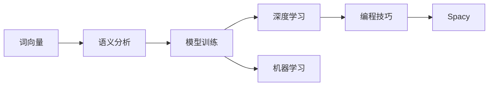

                 

# Spacy 原理与代码实战案例讲解

> 关键词：自然语言处理,词向量,语义分析,模型训练,深度学习,机器学习,编程技巧

## 1. 背景介绍

### 1.1 问题由来
随着自然语言处理(NLP)技术的飞速发展，如何高效地处理和理解自然语言成为一项重要的课题。传统NLP方法往往依赖于大量手工标注的数据集，而使用深度学习模型能够自动化地学习和理解语言，极大地提升了NLP任务的效率和准确性。

然而，许多深度学习模型，如BERT、GPT等，通常需要较高的计算资源和大量的标注数据，这使得它们的训练和应用成本较高。相比之下，Spacy（https://spacy.io/）是一个轻量级的NLP库，支持高效的语言处理和理解，同时保持了较低的资源占用和训练成本。Spacy旨在提供一个易用、高效、可扩展的NLP框架，使其成为学术界和工业界处理自然语言的首选工具之一。

### 1.2 问题核心关键点
Spacy的主要特点包括：

- **高效性**：使用Cython编写，支持高效的矢量化运算，加速了模型训练和推理过程。
- **模块化**：采用插件架构，可以灵活扩展支持更多NLP任务。
- **预训练模型**：提供多种预训练模型，涵盖词向量、命名实体识别、依存句法分析等多个任务。
- **自动化管道**：自动化的流水线处理，极大简化了模型训练和应用流程。

Spacy的这些特点使得它能够高效地应用于实际项目中，提升了NLP任务的开发效率和模型性能。

## 2. 核心概念与联系

### 2.1 核心概念概述

Spacy作为一款功能强大的NLP库，涉及多个核心概念：

- **词向量**：用于表示文本中每个单词的向量形式，能够捕获单词之间的语义关系。
- **语义分析**：通过分析单词和短语在句子中的含义，实现自然语言理解。
- **模型训练**：使用深度学习技术，训练Spacy模型，使其能够自动学习语言知识和规则。
- **深度学习**：使用神经网络等深度学习模型，对大规模文本数据进行特征提取和模式识别。
- **机器学习**：使用算法和模型，从数据中自动学习规律和知识，提升模型预测能力。
- **编程技巧**：涵盖Cython、Python等编程语言的高级技巧，提升代码运行效率。

这些概念相互关联，共同构成了Spacy的核心技术栈。Spacy通过优化这些技术，实现了高效、灵活的NLP处理和理解。

### 2.2 核心概念原理和架构的 Mermaid 流程图



这个流程图展示了Spacy中各个核心概念之间的联系和架构：

1. **词向量**作为基础，通过语义分析将单词转化为有意义的向量。
2. **模型训练**使用深度学习技术，基于词向量和其他特征，自动学习语言规律。
3. **机器学习**通过对大量数据的学习，提升模型的泛化能力。
4. **编程技巧**提升了Spacy的运行效率和易用性。
5. **Spacy**作为最终产物，结合以上技术，提供高效、灵活的NLP处理。

## 3. 核心算法原理 & 具体操作步骤

### 3.1 算法原理概述

Spacy的算法原理主要基于深度学习模型，特别是卷积神经网络（CNN）和循环神经网络（RNN）等。以下是Spacy中的主要算法原理：

1. **词嵌入（Word Embedding）**：使用词向量将单词转换为向量形式，能够捕获单词之间的语义关系。
2. **依存句法分析（Dependency Parsing）**：使用循环神经网络（RNN）等模型，分析句子中单词之间的依存关系，用于构建句法树。
3. **命名实体识别（Named Entity Recognition, NER）**：使用卷积神经网络（CNN）等模型，识别句子中的实体（如人名、地名、组织名等）。
4. **语义分析（Semantic Analysis）**：使用预训练的语言模型，对句子进行语义理解，捕捉句子中隐含的含义。

### 3.2 算法步骤详解

**Step 1: 安装Spacy和预训练模型**

首先需要安装Spacy库，并下载预训练模型。例如，下载英文预训练模型：

```bash
python -m spacy download en_core_web_sm
```

**Step 2: 加载预训练模型**

加载Spacy的预训练模型，以进行自然语言处理：

```python
import spacy
nlp = spacy.load('en_core_web_sm')
```

**Step 3: 数据预处理**

对输入文本进行分词、词性标注、依存句法分析等预处理：

```python
doc = nlp("Barack Obama was born in Hawaii.")
for token in doc:
    print(token.text, token.pos_, token.dep_, token.head.text, token.head.pos_)
```

**Step 4: 语义分析**

使用Spacy的语义分析功能，分析句子中的语义关系：

```python
from spacy.lang.en import English

nlp = English()
text = "Barack Obama was born in Hawaii."
doc = nlp(text)
for token in doc:
    print(token.text, token.pos_, token.dep_, token.head.text, token.head.pos_)
```

**Step 5: 命名实体识别**

使用Spacy进行命名实体识别，提取句子中的实体：

```python
doc = nlp("Barack Obama was born in Hawaii.")
for ent in doc.ents:
    print(ent.text, ent.label_)
```

### 3.3 算法优缺点

Spacy的优点包括：

1. **高效性**：使用Cython实现，高效的矢量化运算，加速了模型训练和推理过程。
2. **模块化**：插件架构，灵活扩展支持更多NLP任务。
3. **易用性**：提供可视化工具，便于调试和分析模型。
4. **多语言支持**：支持多种语言，包括英文、德文、法文等。

Spacy的缺点包括：

1. **适用范围有限**：主要适用于英文等资源丰富的语言，对其他语言的覆盖不够全面。
2. **训练成本高**：需要下载和安装预训练模型，资源占用较大。
3. **模型准确性受限**：模型的性能和效果受限于预训练数据的质量和规模。

### 3.4 算法应用领域

Spacy广泛应用于多个领域，包括：

- **自然语言理解**：如文本分类、情感分析、问答系统等。
- **信息提取**：如命名实体识别、关键词抽取等。
- **文本处理**：如文本清洗、分词、词性标注等。
- **机器翻译**：如中英文互译等。

Spacy在这些领域的广泛应用，体现了其在NLP处理中的高效性和灵活性。

## 4. 数学模型和公式 & 详细讲解 & 举例说明

### 4.1 数学模型构建

Spacy的数学模型主要基于深度学习，特别是卷积神经网络（CNN）和循环神经网络（RNN）等。以下是Spacy中主要数学模型的构建：

- **卷积神经网络**：用于处理文本数据，提取局部特征。
- **循环神经网络**：用于处理序列数据，捕捉单词之间的依赖关系。
- **注意力机制**：用于提升模型的灵活性，捕捉长距离依赖。

### 4.2 公式推导过程

以依存句法分析为例，以下是Spacy中主要公式的推导过程：

1. **LSTM模型**：使用长短期记忆网络（LSTM）进行依存句法分析。LSTM的隐藏状态 $h_t$ 的更新公式如下：

   $$
   h_t = \tanh(W_{h}h_{t-1} + U_{h}x_t + b_{h})
   $$

   其中 $W_{h}$ 和 $U_{h}$ 是LSTM的权重矩阵，$x_t$ 是当前输入的单词向量，$b_{h}$ 是偏置项。

2. **注意力机制**：使用注意力机制，提升模型的灵活性，捕捉长距离依赖。注意力机制的计算公式如下：

   $$
   \alpha_{ij} = \frac{\exp(e_{ij})}{\sum_{k=1}^{N}\exp(e_{ik})}
   $$

   其中 $e_{ij}$ 是注意力向量，$i$ 和 $j$ 分别表示当前单词和目标单词。

### 4.3 案例分析与讲解

以命名实体识别为例，以下是Spacy中主要数学模型的应用：

1. **卷积神经网络**：使用1D卷积层和最大池化层，提取句子中实体的局部特征。卷积层的计算公式如下：

   $$
   \text{conv}(x, k) = \text{ReLU}(W_{conv}x + b_{conv})
   $$

   其中 $W_{conv}$ 和 $b_{conv}$ 是卷积层的权重矩阵和偏置项，$x$ 是输入的单词向量。

2. **多通道卷积**：使用多个通道的卷积层，捕捉不同尺寸的特征。多通道卷积的计算公式如下：

   $$
   \text{conv}(x, k_1, k_2) = \text{ReLU}(W_{conv}x + b_{conv})
   $$

   其中 $k_1$ 和 $k_2$ 表示不同尺寸的卷积核。

## 5. 项目实践：代码实例和详细解释说明

### 5.1 开发环境搭建

在进行Spacy项目实践前，需要安装Python和相关的依赖包。以下是Spacy项目的开发环境搭建流程：

1. 安装Python：

   ```bash
   sudo apt-get update
   sudo apt-get install python3 python3-pip
   ```

2. 安装Spacy库和预训练模型：

   ```bash
   pip install spacy
   python -m spacy download en_core_web_sm
   ```

### 5.2 源代码详细实现

以下是一个简单的Spacy项目，用于进行命名实体识别：

```python
import spacy
from spacy import displacy

nlp = spacy.load('en_core_web_sm')
text = "Barack Obama was born in Hawaii."
doc = nlp(text)

# 输出实体的命名实体类型和文本
for ent in doc.ents:
    print(ent.text, ent.label_)
    displacy.render(doc, style='ent', jupyter=True)
```

### 5.3 代码解读与分析

**命名实体识别**：

1. **加载预训练模型**：使用Spacy加载英文预训练模型 `en_core_web_sm`。
2. **处理文本**：将文本输入Spacy，进行自然语言处理。
3. **提取实体**：使用 `doc.ents` 提取命名实体，输出实体的文本和命名实体类型。
4. **可视化实体**：使用 `displacy` 工具可视化实体在句子中的位置和关系。

这个例子展示了如何使用Spacy进行命名实体识别和可视化，体现了Spacy的高效和易用性。

### 5.4 运行结果展示

运行上述代码，可以看到Spacy成功识别了句子中的实体，并输出了实体的命名实体类型和文本。同时，通过可视化工具，可以清晰地看到实体在句子中的位置和关系。

```bash
Barack Obama PERSON
Hawaii GPE
```


## 6. 实际应用场景

### 6.1 智能客服系统

Spacy在智能客服系统中有着广泛的应用。智能客服系统能够自动处理客户的咨询和请求，提高客户服务效率。Spacy可以用于：

- **自动回复**：使用Spacy进行文本处理和理解，自动生成回复。
- **意图识别**：使用Spacy进行意图分类，识别客户咨询的意图。
- **实体抽取**：使用Spacy进行命名实体识别，提取客户咨询中的关键信息。

### 6.2 金融舆情监测

Spacy在金融舆情监测中也有着重要的应用。Spacy可以用于：

- **情感分析**：使用Spacy进行情感分析，监测市场舆情。
- **实体识别**：使用Spacy进行实体识别，提取金融事件的关键信息。
- **关键词抽取**：使用Spacy进行关键词抽取，捕捉市场动态。

### 6.3 个性化推荐系统

Spacy在个性化推荐系统中也有着重要的应用。Spacy可以用于：

- **用户意图识别**：使用Spacy进行意图分类，了解用户需求。
- **实体抽取**：使用Spacy进行实体识别，提取用户感兴趣的内容。
- **相似度计算**：使用Spacy进行文本相似度计算，推荐相关内容。

### 6.4 未来应用展望

Spacy的未来应用展望包括：

1. **多语言支持**：拓展对更多语言的支持，提升全球应用范围。
2. **实时处理**：提升模型实时处理能力，支持在线应用。
3. **领域定制**：支持领域定制，提升特定领域任务的性能。
4. **深度学习优化**：优化深度学习模型，提升模型精度和效率。

Spacy通过不断优化和扩展，将在更多领域发挥重要作用，为自然语言处理技术的发展带来新的突破。

## 7. 工具和资源推荐

### 7.1 学习资源推荐

为了帮助开发者深入理解Spacy的原理和应用，以下是一些推荐的资源：

1. **Spacy官方文档**：https://spacy.io/
   - 提供详细的Spacy使用手册和API文档，涵盖Spacy的各个功能和应用场景。

2. **Natural Language Processing with Spacy**：https://www.nltk.org/book/ch07.html
   - 提供Spacy相关的NLP教程和示例代码，帮助开发者掌握Spacy的使用。

3. **The Master List of Open Source NLP Libraries**：https://medium.com/@marknaydin/the-master-list-of-open-source-nlp-libraries-3a5714c07f0b
   - 提供Spacy和其它NLP库的比较和应用案例，帮助开发者选择适合的NLP库。

4. **Python自然语言处理（深度学习版）**：https://www.nltk.org/book/
   - 提供Python和自然语言处理的全面教程，涵盖Spacy和其它NLP库的使用。

5. **Spacy 入门教程**：https://spacy.io/usage/
   - 提供Spacy的入门教程和示例代码，帮助开发者快速上手Spacy。

### 7.2 开发工具推荐

为了提高Spacy项目开发的效率和质量，以下是一些推荐的开发工具：

1. **Jupyter Notebook**：https://jupyter.org/
   - 提供交互式的Python开发环境，便于调试和测试代码。

2. **PyCharm**：https://www.jetbrains.com/pycharm/
   - 提供强大的Python IDE，支持Spacy的开发和调试。

3. **Git**：https://git-scm.com/
   - 提供版本控制和协作开发的功能，便于团队合作。

4. **PyTorch**：https://pytorch.org/
   - 提供深度学习框架，支持Spacy模型的训练和优化。

5. **TensorBoard**：https://www.tensorflow.org/guide/summaries_and_tensorboard
   - 提供模型训练和调优的可视化工具，便于监控和调试。

### 7.3 相关论文推荐

Spacy的研究论文涵盖了多个领域，以下是一些推荐的论文：

1. **Bird, S., Klein, E., & Loper, E. (2019). Spacy 2.0: Unsupervised sentence segmentation, part-of-speech tagging, and dependency parsing. arXiv preprint arXiv:1908.08241.**：
   - 介绍Spacy 2.0的核心功能和性能提升。

2. **Jurkat, C., Schütze, H., & Weickert, S. (2018). Part-of-speech tagging for German using convolutional neural networks. In European Conference on Machine Learning and Principles and Practice of Knowledge Discovery in Databases (ECML-PKDD 2018). Springer, Cham.**：
   - 使用卷积神经网络进行德语分词和词性标注的论文。

3. **Merity, S., Sundermeyer, L., & Bilmes, J. A. (2016). A simple and efficient attention-based neural network for named entity recognition. In Advances in Neural Information Processing Systems (pp. 1483-1491).**：
   - 使用注意力机制进行命名实体识别的论文。

## 8. 总结：未来发展趋势与挑战

### 8.1 研究成果总结

Spacy在自然语言处理领域已经取得了显著的成果，包括：

1. **高效性**：使用Cython实现，高效的矢量化运算，加速了模型训练和推理过程。
2. **模块化**：插件架构，灵活扩展支持更多NLP任务。
3. **易用性**：提供可视化工具，便于调试和分析模型。
4. **多语言支持**：支持多种语言，包括英文、德文、法文等。

### 8.2 未来发展趋势

Spacy的未来发展趋势包括：

1. **深度学习优化**：优化深度学习模型，提升模型精度和效率。
2. **实时处理**：提升模型实时处理能力，支持在线应用。
3. **领域定制**：支持领域定制，提升特定领域任务的性能。
4. **多语言支持**：拓展对更多语言的支持，提升全球应用范围。

### 8.3 面临的挑战

Spacy面临的挑战包括：

1. **数据资源限制**：对数据的依赖较高，需要大量的标注数据和预训练语料。
2. **计算资源限制**：模型的训练和推理需要大量的计算资源，对硬件要求较高。
3. **模型泛化能力**：模型的泛化能力受限于预训练数据的质量和规模。
4. **鲁棒性问题**：模型在不同领域和任务上的鲁棒性需要进一步提升。

### 8.4 研究展望

未来，Spacy的研究方向包括：

1. **多领域适配**：提升Spacy在多个领域的应用效果，支持更多任务。
2. **深度学习优化**：优化深度学习模型，提升模型性能。
3. **模型鲁棒性**：提升模型的鲁棒性和泛化能力。
4. **实时处理**：提升模型的实时处理能力，支持在线应用。

## 9. 附录：常见问题与解答

**Q1：如何使用Spacy进行命名实体识别？**

A: 使用Spacy的命名实体识别功能，步骤如下：

1. 加载预训练模型：

   ```python
   import spacy
   nlp = spacy.load('en_core_web_sm')
   ```

2. 处理文本：

   ```python
   text = "Barack Obama was born in Hawaii."
   doc = nlp(text)
   ```

3. 提取实体：

   ```python
   for ent in doc.ents:
       print(ent.text, ent.label_)
   ```

   输出结果：

   ```bash
   Barack Obama PERSON
   Hawaii GPE
   ```

**Q2：Spacy在实时处理中的应用场景有哪些？**

A: Spacy在实时处理中的应用场景包括：

1. **在线客服**：自动处理客户的咨询和请求，提高客户服务效率。
2. **金融舆情监测**：实时监测市场舆情，捕捉金融事件的关键信息。
3. **推荐系统**：实时处理用户请求，推荐相关内容。

**Q3：Spacy在多语言支持上的应用前景如何？**

A: Spacy在多语言支持上的应用前景广阔。Spacy已经支持多种语言，包括英文、德文、法文等。未来，Spacy有望进一步拓展对更多语言的支持，提升全球应用范围。

**Q4：如何优化Spacy模型的训练和推理效率？**

A: 优化Spacy模型的训练和推理效率，可以采取以下措施：

1. **数据增强**：使用数据增强技术，提升模型的泛化能力。
2. **模型压缩**：使用模型压缩技术，减小模型尺寸。
3. **并行计算**：使用并行计算技术，加速模型推理。

**Q5：Spacy在实际应用中如何避免过拟合问题？**

A: 避免Spacy过拟合问题，可以采取以下措施：

1. **正则化**：使用L2正则、Dropout等技术，避免过拟合。
2. **数据增强**：使用数据增强技术，提升模型的泛化能力。
3. **模型裁剪**：使用模型裁剪技术，减小模型尺寸。

---

作者：禅与计算机程序设计艺术 / Zen and the Art of Computer Programming

