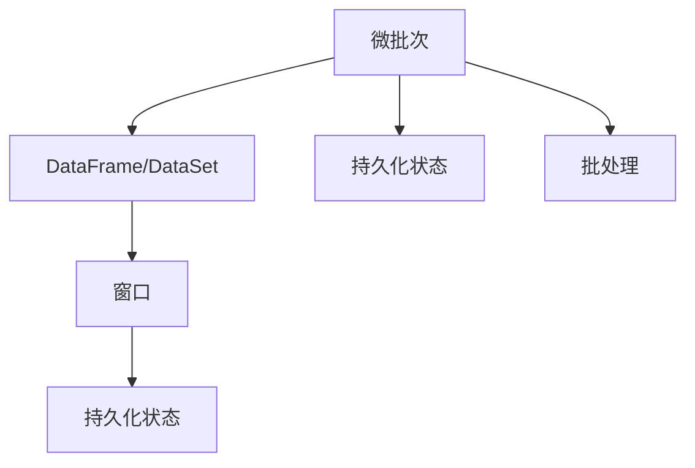

                 

## 1. 背景介绍

### 1.1 问题由来

随着大数据时代的到来，数据的增长速度呈现爆炸性增长。实时数据流处理在金融、物联网、社交网络等领域变得愈发重要。传统的数据流处理方式（如批处理）已无法满足业务需求。因此，实时流处理技术应运而生。

Spark Streaming（Spark的流处理模块）是Apache Spark生态中重要的组成部分。它通过将数据流拆分成微批次（Micro-batch）进行批处理，实现了流处理和批处理的统一处理框架。通过Spark Streaming，用户可以在数百个节点上高效地处理实时数据流。

### 1.2 问题核心关键点

Spark Streaming通过将实时数据流转换为批处理任务，实现了实时流处理与批处理的无缝衔接。核心问题在于：

1. **数据流划分**：如何将实时数据流划分为微批次。
2. **状态管理**：如何在微批次间共享状态，以实现流处理的持久性。
3. **高吞吐量**：如何保证数据流的处理效率，支持高吞吐量的数据处理。

## 2. 核心概念与联系

### 2.1 核心概念概述

为更好地理解Spark Streaming的实时流处理机制，本节将介绍几个密切相关的核心概念：

1. **微批次(Micro-batch)**：实时数据流被拆分成固定大小的批次进行处理。Spark Streaming默认每个批次的处理时间为2秒，也可以自定义时间间隔。
2. **持久化状态(Persistence State)**：Spark Streaming支持在微批次间共享状态，以实现流处理的持久化。
3. **窗口(Window)**：Spark Streaming使用滑动窗口技术，以对数据进行窗口操作，支持基于时间的窗口计算。
4. **DataFrame/DataSet**：Spark Streaming内部使用DataFrame和DataSet作为数据处理的基础数据结构。

这些核心概念之间的逻辑关系可以通过以下Mermaid流程图来展示：



这个流程图展示了几大核心概念及其之间的关系：

1. 实时数据流被拆分为微批次。
2. 在微批次上进行批处理。
3. 对微批次进行窗口操作。
4. 窗口操作的结果可以作为持久化状态。
5. 批处理和微批次的统一处理。

这些概念共同构成了Spark Streaming的核心工作机制，使得Spark Streaming能够在实时数据流处理中高效稳定地运行。

## 3. 核心算法原理 & 具体操作步骤

### 3.1 算法原理概述

Spark Streaming的核心算法原理是基于微批次和批处理的无缝衔接。通过将实时数据流拆分成固定大小的微批次，然后在每个微批次上执行批处理任务，实现实时流数据的批处理。

微批次的划分是Spark Streaming的核心特性。它通过定时器(如心跳机制)来感知实时数据流的变化，将数据流拆分为固定大小的微批次。Spark Streaming通过数据流的固定时间间隔和状态管理，确保了实时数据流的处理效率和稳定性。

### 3.2 算法步骤详解

Spark Streaming的核心算法步骤包括以下几个关键步骤：

**Step 1: 数据源接入**

Spark Streaming需要接入实时数据源，常见的数据源包括Kafka、Flume、HDFS等。通过Spark Streaming提供的API，用户可以轻松接入不同类型的数据源。

**Step 2: 微批次划分**

Spark Streaming将实时数据流划分为固定大小的微批次。默认每个微批次的处理时间为2秒，用户可以根据实际需求进行调整。

**Step 3: 批处理执行**

Spark Streaming内部使用DataFrame/DataSet作为数据处理的基础数据结构。在每个微批次上，Spark Streaming将微批次的数据流转换为DataFrame/DataSet，并在其上进行批处理任务。

**Step 4: 窗口操作**

Spark Streaming支持对数据进行窗口操作，如滑动窗口、固定窗口等。窗口操作的结果可以作为持久化状态，用于后续的微批次计算。

**Step 5: 持久化状态管理**

Spark Streaming支持在微批次间共享状态，以实现流处理的持久化。状态可以通过RDD、DataSet等数据结构实现。

**Step 6: 批处理结果输出**

Spark Streaming将批处理的结果输出到外部系统，如Kafka、HDFS等。用户可以根据实际需求进行灵活配置。

### 3.3 算法优缺点

Spark Streaming的实时流处理算法具有以下优点：

1. **高效性**：通过微批次划分和批处理的无缝衔接，Spark Streaming能够高效地处理实时数据流。
2. **稳定性**：通过状态管理和批处理机制，Spark Streaming能够保证实时数据流的稳定性和可靠性。
3. **灵活性**：Spark Streaming支持自定义微批次大小和批处理时间间隔，满足不同业务的需求。

同时，该算法也存在一些缺点：

1. **延迟性**：由于微批次的划分和批处理的开销，Spark Streaming的延迟相对较大。
2. **内存占用**：Spark Streaming需要保存部分微批次的状态，内存占用较大。
3. **复杂性**：Spark Streaming的实现较为复杂，需要一定的开发经验和调优能力。

尽管存在这些缺点，但Spark Streaming仍然是目前最主流的实时流处理框架之一，广泛应用于金融、物联网、社交网络等领域。

### 3.4 算法应用领域

Spark Streaming在多个领域得到了广泛的应用，例如：

1. **金融风控**：实时监测市场数据，及时发现异常交易和风险事件。
2. **物联网设备监控**：实时收集设备数据，进行异常检测和故障诊断。
3. **社交网络分析**：实时分析用户行为数据，挖掘用户兴趣和社交关系。
4. **实时广告投放**：实时处理用户点击数据，进行精准广告投放。
5. **实时舆情监测**：实时监测社交媒体数据，进行舆情分析和情感分析。
6. **实时日志处理**：实时处理系统日志数据，进行错误追踪和性能优化。

以上场景展示了Spark Streaming在实时数据流处理中的强大应用潜力。未来，随着实时流处理技术的不断发展，Spark Streaming必将在更多领域发挥重要作用。

## 4. 数学模型和公式 & 详细讲解 & 举例说明

### 4.1 数学模型构建

本节将使用数学语言对Spark Streaming的实时流处理过程进行更加严格的刻画。

设实时数据流为 $D=\{d_1, d_2, \cdots, d_n\}$，数据流的处理时间间隔为 $\Delta t$。则Spark Streaming将数据流划分为微批次 $\{B_1, B_2, \cdots, B_k\}$，其中 $B_i = \{d_{i\Delta t+1}, d_{i\Delta t+2}, \cdots, d_{(i+1)\Delta t}\}$。

Spark Streaming内部使用DataFrame/DataSet作为数据处理的基础数据结构。假设DataFrame为 $X=\{(x_1, y_1), (x_2, y_2), \cdots, (x_m, y_m)\}$，其中 $x_i$ 为数据，$y_i$ 为标签。

Spark Streaming支持在微批次上进行批处理操作。假设批处理函数为 $f(X)$，则批处理结果为 $f(B_i)$。

### 4.2 公式推导过程

Spark Streaming的核心公式推导如下：

1. **微批次划分**：
   $$
   \{B_1, B_2, \cdots, B_k\} = \{d_1, d_2, \cdots, d_n\} \quad s.t. \quad B_i = \{d_{i\Delta t+1}, d_{i\Delta t+2}, \cdots, d_{(i+1)\Delta t}\}
   $$

2. **批处理操作**：
   $$
   \{f(B_1), f(B_2), \cdots, f(B_k)\} = \{f(B_1), f(B_2), \cdots, f(B_k)\} \quad s.t. \quad f(B_i) = f(\{d_{i\Delta t+1}, d_{i\Delta t+2}, \cdots, d_{(i+1)\Delta t}\})
   $$

3. **窗口操作**：
   $$
   W(B_i) = \{d_{(i-1)\Delta t+1}, d_{(i-1)\Delta t+2}, \cdots, d_{(i+1)\Delta t}\}
   $$

4. **持久化状态管理**：
   $$
   S_{i+1} = S_i \cup W(B_i)
   $$

5. **批处理结果输出**：
   $$
   \{f(B_1), f(B_2), \cdots, f(B_k)\} \rightarrow \text{外部系统}
   $$

### 4.3 案例分析与讲解

以实时日志处理为例，分析Spark Streaming的处理过程。

假设系统日志数据流为 $D=\{d_1, d_2, \cdots, d_n\}$，其中 $d_i=(t_i, m_i)$，$t_i$ 为日志时间戳，$m_i$ 为日志内容。

Spark Streaming将数据流划分为微批次 $\{B_1, B_2, \cdots, B_k\}$，每个微批次的处理时间为2秒。假设批处理函数为 $f(X) = \text{avg}(Y)$，其中 $Y$ 为日志内容。

批处理结果为 $\{f(B_1), f(B_2), \cdots, f(B_k)\} = \{\text{avg}(Y_1), \text{avg}(Y_2), \cdots, \text{avg}(Y_k)\}$。

假设窗口大小为5，则窗口操作为 $W(B_i) = \{d_{(i-1)\Delta t+1}, d_{(i-1)\Delta t+2}, \cdots, d_{(i+1)\Delta t}\}$。

假设持久化状态为 $S_{i+1} = S_i \cup W(B_i)$，则状态管理流程为：

1. $S_1 = \emptyset$
2. $S_2 = \{d_1, d_2, d_3, d_4, d_5\}$
3. $S_3 = \{d_1, d_2, d_3, d_4, d_5, d_6, d_7, d_8, d_9\}$
4. ...

最后，将批处理结果输出到外部系统，如Kafka、HDFS等。

## 5. 项目实践：代码实例和详细解释说明

### 5.1 开发环境搭建

在进行Spark Streaming项目实践前，我们需要准备好开发环境。以下是使用Python进行PySpark开发的环境配置流程：

1. 安装Anaconda：从官网下载并安装Anaconda，用于创建独立的Python环境。

2. 创建并激活虚拟环境：
```bash
conda create -n pyspark-env python=3.8 
conda activate pyspark-env
```

3. 安装PySpark：从官网下载并安装PySpark，以支持实时数据流处理。

4. 安装必要的依赖包：
```bash
pip install pyspark kafka-python
```

5. 启动Spark Streaming服务：
```bash
spark-submit spark-streaming-receiver.jar --master local[2] --deploy-mode client
```

完成上述步骤后，即可在`pyspark-env`环境中开始Spark Streaming项目开发。

### 5.2 源代码详细实现

下面我们以实时日志处理为例，给出使用PySpark进行Spark Streaming项目开发的完整代码实现。

```python
from pyspark import SparkContext
from pyspark.streaming import StreamingContext
from pyspark.streaming.kafka import KafkaUtils

# 创建Spark上下文和流上下文
sc = SparkContext()
ssc = StreamingContext(sc, 2)  # 微批次处理时间为2秒

# 创建Kafka Streams
kafkaStreams = KafkaUtils.createStream(ssc, "localhost:2181", "test", {"log":1})

# 定义Kafka数据流接收器
logStream = KafkaUtils.makeStream(ssc, kafkaStreams, "log")

# 定义批处理函数
def averageLog(logStream):
    count = 0
    total = 0
    for log in logStream:
        count += 1
        total += float(log)
    return total / count

# 定义窗口操作
def windowedAverage(logStream):
    count = 0
    total = 0
    for log in logStream:
        count += 1
        total += float(log)
    return total / count

# 对微批次进行处理
logStream.foreachRDD(lambda rdd: rdd.map(lambda x: (x[1], averageLog(x[1]))).updateOrAppendStateByKey(lambda k, v: (v[0]+k[1], v[1]+1))

# 对窗口进行操作
logStream.foreachRDD(lambda rdd: rdd.map(lambda x: (x[1], windowedAverage(x[1]))).updateOrAppendStateByKey(lambda k, v: (v[0]+k[1], v[1]+1))

# 批处理结果输出
result = ssc.map(lambda x: x[1])
result.pprint()

# 启动Spark Streaming服务
ssc.start()
ssc.awaitTermination()
```

### 5.3 代码解读与分析

让我们再详细解读一下关键代码的实现细节：

**Kafka Streams**：
- 使用Kafka作为数据源，Spark Streaming内部使用KafkaUtils创建Kafka Streams。
- 创建Kafka Streams时，指定Kafka集群地址、主题、批处理时间间隔等参数。

**数据流接收器**：
- 使用KafkaUtils.makeStream方法，创建数据流接收器。
- 指定Kafka Streams对象、主题和批处理时间间隔。

**批处理函数**：
- 使用foreachRDD方法，对微批次进行批处理。
- 定义平均计算函数，对每个微批次进行计算。

**窗口操作**：
- 使用foreachRDD方法，对微批次进行窗口操作。
- 定义窗口大小和计算函数，对每个窗口进行计算。

**持久化状态管理**：
- 使用foreachRDD方法，对微批次进行持久化状态更新。
- 使用updateOrAppendStateByKey方法，实现状态的更新和累加。

**批处理结果输出**：
- 使用map方法，将批处理结果转换为输出格式。
- 使用print方法，输出批处理结果。

完成上述步骤后，即可在Spark Streaming上进行实时数据流处理。

## 6. 实际应用场景

### 6.1 智能运维

智能运维是Spark Streaming在云计算领域的重要应用。通过实时监测云计算平台的服务性能指标，Spark Streaming能够及时发现系统异常和故障。

具体而言，可以收集云计算平台的服务日志、系统监控数据、应用运行数据等，并实时处理和分析。一旦发现异常，Spark Streaming可以自动告警并推送修复建议，帮助运维人员快速定位问题并解决问题。

### 6.2 实时广告投放

实时广告投放是Spark Streaming在互联网广告领域的应用。通过实时处理用户行为数据，Spark Streaming能够进行精准广告投放。

具体而言，可以收集用户的浏览行为数据、点击行为数据、购买行为数据等，并实时处理和分析。通过Spark Streaming的实时分析，可以实时调整广告投放策略，提高广告投放的精准度和转化率。

### 6.3 实时舆情监测

实时舆情监测是Spark Streaming在社交媒体领域的应用。通过实时监测社交媒体数据，Spark Streaming能够进行舆情分析和情感分析。

具体而言，可以收集用户在社交媒体上的评论、点赞、分享等数据，并实时处理和分析。通过Spark Streaming的实时分析，可以实时监测舆情变化，预测社会热点事件，提供实时舆情报告。

### 6.4 未来应用展望

随着Spark Streaming技术的不断进步，未来的实时流处理将呈现以下几个发展趋势：

1. **高吞吐量**：随着硬件性能的不断提升，Spark Streaming将支持更高吞吐量的实时流处理。未来有望达到每秒处理数千万条数据。
2. **低延迟**：通过优化微批次划分和批处理机制，Spark Streaming将进一步降低延迟，实现毫秒级的数据处理。
3. **实时计算**：Spark Streaming将支持实时计算模型，如流时间窗口、滑动时间窗口等，进一步提升流处理的灵活性和计算能力。
4. **跨平台支持**：Spark Streaming将支持多种数据源和计算平台，实现跨平台的实时流处理。
5. **数据融合**：Spark Streaming将支持多种数据类型和格式，实现数据融合和混合计算，提升流处理的综合能力。
6. **边缘计算**：Spark Streaming将支持边缘计算，实现数据处理的分布式和本地化，提升流处理的效率和可靠性。

以上趋势将进一步提升Spark Streaming的实时流处理能力，使其能够更好地适应现代互联网环境下的数据处理需求。

## 7. 工具和资源推荐

### 7.1 学习资源推荐

为了帮助开发者系统掌握Spark Streaming的实时流处理技术，这里推荐一些优质的学习资源：

1. Apache Spark官方文档：Spark Streaming的官方文档，详细介绍了实时流处理的基本概念和实现方法。
2. Scala语言教程：Spark Streaming主要使用Scala语言开发，掌握Scala语言是Spark Streaming开发的基础。
3. Spark Streaming实战指南：详细介绍Spark Streaming的开发实践和应用案例，涵盖从入门到进阶的内容。
4. KAFKA: The Definitive Guide：Kafka作为Spark Streaming的重要数据源，深入了解Kafka原理和应用，有助于提升Spark Streaming的性能。
5. Streaming with Python: By Example：通过Python语言实现Spark Streaming，适合Python开发者快速上手。

通过对这些资源的学习实践，相信你一定能够系统掌握Spark Streaming的实时流处理技术，并用于解决实际的实时数据流处理问题。

### 7.2 开发工具推荐

Spark Streaming的开发离不开高效的开发工具支持。以下是几款用于Spark Streaming开发的常用工具：

1. PySpark：基于Python语言的Spark Streaming API，支持交互式开发和调试。
2. Scala：Spark Streaming主要使用Scala语言开发，适合大规模工程应用。
3. Kafka：Spark Streaming的主要数据源之一，支持高吞吐量的数据流处理。
4. Akka：Apache Akka是Spark Streaming的底层框架，支持分布式计算和容错机制。
5. Kubernetes：Kubernetes作为Spark Streaming的容器化解决方案，支持大规模集群部署和管理。

合理利用这些工具，可以显著提升Spark Streaming的开发效率，加快创新迭代的步伐。

### 7.3 相关论文推荐

Spark Streaming的发展离不开学界的持续研究。以下是几篇奠基性的相关论文，推荐阅读：

1. Speed Scaling for Distributed Real-Time Data Processing: A Case Study on Spark Streaming：介绍Spark Streaming的发展历程和性能优化方法。
2. Stream Computing with Apache Spark Streaming：详细介绍Spark Streaming的基本概念和实现方法。
3. Architectural and Operational Analysis of Spark Streaming：对Spark Streaming进行架构和操作性能的详细分析。
4. Spark Streaming: Unified Stream Processing with High-Performance and Easy State Management：详细介绍Spark Streaming的高性能和状态管理机制。
5. State Management for Large-scale Streaming Data Processing in Apache Spark Streaming：详细介绍Spark Streaming的状态管理机制和优化方法。

这些论文代表了大数据流处理的发展脉络。通过学习这些前沿成果，可以帮助研究者把握Spark Streaming的研究方向，激发更多的创新灵感。

## 8. 总结：未来发展趋势与挑战

### 8.1 总结

本文对Spark Streaming的实时流处理技术进行了全面系统的介绍。首先阐述了Spark Streaming的实时流处理背景和意义，明确了Spark Streaming在实时数据流处理中的重要价值。其次，从原理到实践，详细讲解了Spark Streaming的核心算法和操作步骤，给出了Spark Streaming项目开发的完整代码实例。同时，本文还广泛探讨了Spark Streaming在智能运维、实时广告投放、实时舆情监测等多个领域的应用前景，展示了Spark Streaming的强大应用潜力。此外，本文精选了Spark Streaming的学习资源，力求为读者提供全方位的技术指引。

通过本文的系统梳理，可以看到，Spark Streaming的实时流处理技术已经逐步成为大数据时代的重要技术手段，广泛应用于多个行业领域。未来，随着Spark Streaming技术的不断进步，实时流处理必将在更多领域得到应用，为互联网业务的发展提供更加强大的技术支撑。

### 8.2 未来发展趋势

展望未来，Spark Streaming的实时流处理技术将呈现以下几个发展趋势：

1. **高吞吐量**：随着硬件性能的不断提升，Spark Streaming将支持更高吞吐量的实时流处理。未来有望达到每秒处理数千万条数据。
2. **低延迟**：通过优化微批次划分和批处理机制，Spark Streaming将进一步降低延迟，实现毫秒级的数据处理。
3. **实时计算**：Spark Streaming将支持实时计算模型，如流时间窗口、滑动时间窗口等，进一步提升流处理的灵活性和计算能力。
4. **跨平台支持**：Spark Streaming将支持多种数据源和计算平台，实现跨平台的实时流处理。
5. **数据融合**：Spark Streaming将支持多种数据类型和格式，实现数据融合和混合计算，提升流处理的综合能力。
6. **边缘计算**：Spark Streaming将支持边缘计算，实现数据处理的分布式和本地化，提升流处理的效率和可靠性。

以上趋势将进一步提升Spark Streaming的实时流处理能力，使其能够更好地适应现代互联网环境下的数据处理需求。

### 8.3 面临的挑战

尽管Spark Streaming在实时流处理领域已经取得了瞩目成就，但在迈向更加智能化、普适化应用的过程中，它仍面临着诸多挑战：

1. **数据源问题**：Spark Streaming依赖数据源的稳定性，一旦数据源出现问题，实时流处理将无法正常进行。
2. **状态管理**：Spark Streaming的状态管理机制需要优化，以支持更大规模的状态持久化。
3. **批处理优化**：Spark Streaming的批处理机制需要进一步优化，以提升流处理的速度和效率。
4. **资源管理**：Spark Streaming的资源管理机制需要改进，以支持更大规模的分布式计算。
5. **开发复杂度**：Spark Streaming的开发复杂度较高，需要一定的开发经验和调优能力。

尽管存在这些挑战，但Spark Streaming仍然是目前最主流的实时流处理框架之一，广泛应用于金融、物联网、社交网络等领域。未来，随着技术的不断进步和优化，这些挑战终将一一克服，Spark Streaming必将在实时流处理领域发挥更加重要的作用。

### 8.4 研究展望

面对Spark Streaming面临的挑战，未来的研究需要在以下几个方面寻求新的突破：

1. **微批次优化**：优化微批次的划分机制，支持更小的微批次处理时间间隔，进一步提升流处理的实时性。
2. **状态压缩**：使用更高效的状态压缩算法，支持更大规模的状态持久化。
3. **批处理优化**：优化批处理机制，减少前向传播和反向传播的资源消耗，提升流处理的效率。
4. **资源管理**：改进资源管理机制，支持更大规模的分布式计算。
5. **开发工具**：开发更易于使用的开发工具和API，降低开发难度，提升开发效率。

这些研究方向将进一步提升Spark Streaming的实时流处理能力，使其能够更好地适应复杂多变的实时数据流处理需求。

## 9. 附录：常见问题与解答

**Q1：Spark Streaming支持哪些数据源？**

A: Spark Streaming支持多种数据源，包括Kafka、Flume、HDFS、Twitter等。其中，Kafka是最常用的数据源之一。

**Q2：Spark Streaming的微批次划分和批处理是如何实现的？**

A: Spark Streaming的微批次划分和批处理是通过定时器(如心跳机制)和批处理函数实现的。每个微批次的处理时间为2秒，用户可以根据实际需求进行调整。在每个微批次上，Spark Streaming将微批次的数据流转换为DataFrame/DataSet，并在其上进行批处理任务。

**Q3：Spark Streaming的状态管理机制是如何实现的？**

A: Spark Streaming支持在微批次间共享状态，以实现流处理的持久化。状态可以通过RDD、DataSet等数据结构实现。使用foreachRDD方法和updateOrAppendStateByKey方法，实现状态的更新和累加。

**Q4：如何优化Spark Streaming的性能？**

A: 优化Spark Streaming的性能可以从以下几个方面入手：
1. 优化微批次划分机制，支持更小的微批次处理时间间隔。
2. 优化批处理机制，减少前向传播和反向传播的资源消耗。
3. 使用高效的状态压缩算法，支持更大规模的状态持久化。
4. 改进资源管理机制，支持更大规模的分布式计算。
5. 开发更易于使用的开发工具和API，降低开发难度，提升开发效率。

**Q5：Spark Streaming在实时数据流处理中有哪些应用场景？**

A: Spark Streaming在实时数据流处理中有多个应用场景，包括智能运维、实时广告投放、实时舆情监测等。

总之，Spark Streaming作为实时流处理的重要框架，已经在多个行业领域得到了广泛应用。未来，随着实时流处理技术的不断发展，Spark Streaming必将在更多领域发挥重要作用，为互联网业务的发展提供更加强大的技术支撑。

---

作者：禅与计算机程序设计艺术 / Zen and the Art of Computer Programming

