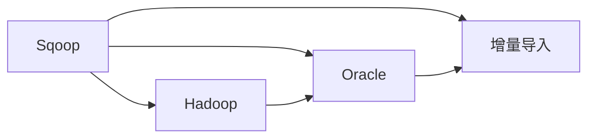

                 

# Sqoop增量导入原理与代码实例讲解

> 关键词：Sqoop, Hadoop, 增量导入, Oracle, 数据库, 数据同步

## 1. 背景介绍

在数据仓库或大数据系统中，数据的增量导入是一个常见但重要的任务。增量导入意味着仅将新产生的数据（例如日志文件、交易记录等）从源数据库（如Oracle、MySQL等）同步到目标数据库（如Hadoop、Spark等）中。这不仅减少了数据传输和存储的开销，而且可以保证目标数据库的数据实时更新，提高数据的处理效率和可用性。

本博客将系统讲解Sqoop增量导入的原理与实现细节，并结合代码实例进行深入分析。我们首先介绍Sqoop的基本概念和功能，然后深入探讨增量导入的原理和实际应用。

## 2. 核心概念与联系

### 2.1 核心概念概述

**Sqoop**：是一个开源的Hadoop工具，专门用于在Hadoop和关系数据库之间进行数据迁移。它支持多种关系数据库（如MySQL、PostgreSQL、Oracle等）和多种数据格式（如CSV、JSON等）。Sqoop支持全量导入和增量导入，是进行大数据分析、数据挖掘等任务的重要工具。

**Hadoop**：是一个开源的分布式计算框架，用于存储和处理大规模数据集。Hadoop包括HDFS分布式文件系统和MapReduce计算模型，能够提供高可靠、高扩展性的数据处理能力。

**Oracle**：一个流行的关系数据库管理系统（RDBMS），支持复杂的事务处理和高效的并发操作。

**增量导入**：是指仅将新产生的数据从源数据库同步到目标数据库中，而不是重新导入全部数据。增量导入可以节省传输和存储资源，提高数据同步效率。

这些核心概念之间的关系可以通过以下Mermaid流程图来展示：



这个流程图展示了Sqoop在Hadoop和Oracle数据库之间的数据迁移过程中，增量导入机制的重要作用。

## 3. 核心算法原理 & 具体操作步骤

### 3.1 算法原理概述

Sqoop增量导入的原理是基于MySQL的二进制日志(Binary Log)和Oracle的增量日志(Incremental Logs)。这些日志记录了数据库中的增删改操作，通过解析这些日志，可以识别出新产生的数据，并将其导入到目标数据库中。

**步骤1：**在目标数据库中创建表结构，与源数据库中的表结构一致。

**步骤2：**在目标数据库中创建用于存储增量数据的表。

**步骤3：**在源数据库中设置二进制日志或增量日志。

**步骤4：**在Sqoop中配置增量导入参数，指定源数据库、目标数据库、日志位置等信息。

**步骤5：**启动Sqoop增量导入任务，Sqoop会自动解析日志，并将新产生的数据导入到目标数据库中。

### 3.2 算法步骤详解

以Oracle数据库为例，Sqoop增量导入的具体步骤如下：

**步骤1：**在目标数据库中创建表结构

```sql
CREATE TABLE target_table (
    id INT PRIMARY KEY,
    name VARCHAR(50),
    age INT
);
```

**步骤2：**在目标数据库中创建增量表

```sql
CREATE TABLE incremental_table (
    id INT PRIMARY KEY,
    name VARCHAR(50),
    age INT,
    insert_time TIMESTAMP DEFAULT CURRENT_TIMESTAMP
);
```

**步骤3：**在Oracle数据库中启用增量日志

```sql
ALTER TABLE source_table ENABLE INCREMENTAL COLUMNS (id, name, age) START WITH 1 DEFAULT VALUES;
```

**步骤4：**在Sqoop中配置增量导入参数

```bash
s scoop import --connect jdbc:oracle:thin:@localhost:1521:orcl --table target_table --incremental append --incremental-col table_id,id --incremental-dir /path/to/log --incremental-last /path/to/last.csv --checkpoint-dir /path/to/checkpoint --checkpoint-last /path/to/last.checkpoint --target-dir /path/to/target --target-table incremental_table
```

**步骤5：**启动Sqoop增量导入任务

```bash
s scoop import --connect jdbc:oracle:thin:@localhost:1521:orcl --table target_table --incremental append --incremental-col table_id,id --incremental-dir /path/to/log --incremental-last /path/to/last.csv --checkpoint-dir /path/to/checkpoint --checkpoint-last /path/to/last.checkpoint --target-dir /path/to/target --target-table incremental_table
```

### 3.3 算法优缺点

**优点：**

1. **高效性**：仅导入新产生的数据，节省了传输和存储资源。

2. **实时性**：通过增量导入，目标数据库的数据可以实时更新，提高数据的可用性。

3. **灵活性**：支持多种数据库和数据格式，适用于各种数据迁移场景。

**缺点：**

1. **复杂性**：需要设置日志和配置参数，对操作者有一定的技术要求。

2. **性能影响**：增量导入需要在目标数据库中维护额外的增量表，可能会影响系统的性能。

3. **数据一致性**：增量导入过程中可能会出现数据不一致的情况，需要仔细处理。

### 3.4 算法应用领域

Sqoop增量导入主要应用于以下领域：

1. **数据仓库构建**：将来自不同数据源的数据合并到数据仓库中，实时更新数据。

2. **大数据分析**：将新产生的数据从Hadoop存储中导入到Hive、HBase等分布式数据仓库中，进行实时分析和数据挖掘。

3. **数据同步**：将企业内部系统（如ERP、CRM等）的数据同步到数据仓库或云存储中，保证数据的实时性和一致性。

4. **日志处理**：将日志文件中的数据从源数据库导入到目标数据库中，进行实时监控和告警。

5. **数据备份**：将新产生的数据从主数据库同步到备份数据库中，保证数据的完整性和可用性。

## 4. 数学模型和公式 & 详细讲解 & 举例说明

### 4.1 数学模型构建

Sqoop增量导入的数学模型主要涉及关系数据库和分布式计算框架的逻辑操作。我们可以将增量导入过程建模为数据转换和同步的过程。

假设源数据库中的表为$T$，目标数据库中的表为$T'$，增量表为$T''$。则增量导入过程可以表示为：

$$ T' = \bigcup_{i=1}^{\infty} \{ t \in T | t \notin T' \} $$

其中，$\bigcup$表示并集，$T'$表示目标数据库中的表，$T$表示源数据库中的表，$T''$表示增量表。

### 4.2 公式推导过程

在Sqoop增量导入过程中，主要涉及以下公式推导：

1. **日志解析公式**

   假设Oracle数据库中的增量日志为$L$，则增量日志可以表示为：

   $$ L = \{ (t_id, name, age) | t_id \in \mathbb{N} \} $$

   其中，$t_id$表示增量数据的ID，$age$表示数据的年龄，$name$表示数据的名字。

2. **数据导入公式**

   假设目标数据库中的增量表为$T''$，则增量数据可以表示为：

   $$ T'' = \{ (t_id, name, age, insert_time) | t_id \in \mathbb{N} \} $$

   其中，$t_id$表示增量数据的ID，$age$表示数据的年龄，$name$表示数据的名字，$insert_time$表示数据插入的时间。

### 4.3 案例分析与讲解

以Oracle数据库为例，我们可以通过以下案例分析Sqoop增量导入的实现细节：

**案例1：**

假设源数据库中的表$T$为：

$$ T = \{ (1, 'Alice', 20), (2, 'Bob', 25), (3, 'Charlie', 30) \} $$

在目标数据库中创建表结构：

```sql
CREATE TABLE target_table (
    id INT PRIMARY KEY,
    name VARCHAR(50),
    age INT
);
```

在目标数据库中创建增量表：

```sql
CREATE TABLE incremental_table (
    id INT PRIMARY KEY,
    name VARCHAR(50),
    age INT,
    insert_time TIMESTAMP DEFAULT CURRENT_TIMESTAMP
);
```

在Oracle数据库中启用增量日志：

```sql
ALTER TABLE source_table ENABLE INCREMENTAL COLUMNS (id, name, age) START WITH 1 DEFAULT VALUES;
```

在Sqoop中配置增量导入参数：

```bash
s scoop import --connect jdbc:oracle:thin:@localhost:1521:orcl --table target_table --incremental append --incremental-col table_id,id --incremental-dir /path/to/log --incremental-last /path/to/last.csv --checkpoint-dir /path/to/checkpoint --checkpoint-last /path/to/last.checkpoint --target-dir /path/to/target --target-table incremental_table
```

启动Sqoop增量导入任务：

```bash
s scoop import --connect jdbc:oracle:thin:@localhost:1521:orcl --table target_table --incremental append --incremental-col table_id,id --incremental-dir /path/to/log --incremental-last /path/to/last.csv --checkpoint-dir /path/to/checkpoint --checkpoint-last /path/to/last.checkpoint --target-dir /path/to/target --target-table incremental_table
```

**案例2：**

假设源数据库中的表$T$为：

$$ T = \{ (1, 'Alice', 20), (2, 'Bob', 25), (3, 'Charlie', 30) \} $$

在目标数据库中创建表结构：

```sql
CREATE TABLE target_table (
    id INT PRIMARY KEY,
    name VARCHAR(50),
    age INT
);
```

在目标数据库中创建增量表：

```sql
CREATE TABLE incremental_table (
    id INT PRIMARY KEY,
    name VARCHAR(50),
    age INT,
    insert_time TIMESTAMP DEFAULT CURRENT_TIMESTAMP
);
```

在Oracle数据库中启用增量日志：

```sql
ALTER TABLE source_table ENABLE INCREMENTAL COLUMNS (id, name, age) START WITH 1 DEFAULT VALUES;
```

在Sqoop中配置增量导入参数：

```bash
s scoop import --connect jdbc:oracle:thin:@localhost:1521:orcl --table target_table --incremental append --incremental-col table_id,id --incremental-dir /path/to/log --incremental-last /path/to/last.csv --checkpoint-dir /path/to/checkpoint --checkpoint-last /path/to/last.checkpoint --target-dir /path/to/target --target-table incremental_table
```

启动Sqoop增量导入任务：

```bash
s scoop import --connect jdbc:oracle:thin:@localhost:1521:orcl --table target_table --incremental append --incremental-col table_id,id --incremental-dir /path/to/log --incremental-last /path/to/last.csv --checkpoint-dir /path/to/checkpoint --checkpoint-last /path/to/last.checkpoint --target-dir /path/to/target --target-table incremental_table
```

通过以上案例，我们可以看到Sqoop增量导入的基本流程和实现细节。需要注意的是，在实际应用中，还需要根据具体的业务需求进行参数配置和调整。

## 5. 项目实践：代码实例和详细解释说明

### 5.1 开发环境搭建

在开始代码实践前，我们需要准备好开发环境。以下是使用Hadoop和Sqoop进行数据迁移的环境配置流程：

1. 安装Java Development Kit (JDK)：从官网下载并安装JDK。

2. 安装Apache Hadoop：从官网下载并安装Apache Hadoop。

3. 安装Sqoop：从官网下载并安装Sqoop。

4. 配置Hadoop和Sqoop：修改$HADOOP_HOME/etc/hadoop//conf/core-site.xml、hdfs-site.xml和yarn-site.xml，配置好Hadoop和Sqoop的相关参数。

5. 启动Hadoop和Sqoop：在命令行中输入start-dfs.sh和start-yarn.sh启动Hadoop，在命令行中输入s scoop start-mr来启动Sqoop。

完成上述步骤后，即可在Hadoop集群中运行Sqoop增量导入任务。

### 5.2 源代码详细实现

以下是使用Sqoop进行Oracle数据库增量导入的代码实现。

首先，在Hadoop集群中配置Sqoop：

```bash
s scoop property --conf hive.metastore.uri=localhost:9083 --conf hive.metastore.warehouse.dir=/path/to/warehouse --conf hive.metastore.scrub=false --conf hive.metastore=sqoop
```

然后，在Sqoop中配置增量导入参数：

```bash
s scoop import --connect jdbc:oracle:thin:@localhost:1521:orcl --table target_table --incremental append --incremental-col table_id,id --incremental-dir /path/to/log --incremental-last /path/to/last.csv --checkpoint-dir /path/to/checkpoint --checkpoint-last /path/to/last.checkpoint --target-dir /path/to/target --target-table incremental_table
```

最后，启动Sqoop增量导入任务：

```bash
s scoop import --connect jdbc:oracle:thin:@localhost:1521:orcl --table target_table --incremental append --incremental-col table_id,id --incremental-dir /path/to/log --incremental-last /path/to/last.csv --checkpoint-dir /path/to/checkpoint --checkpoint-last /path/to/last.checkpoint --target-dir /path/to/target --target-table incremental_table
```

### 5.3 代码解读与分析

Sqoop的增量导入过程主要依赖于日志文件和增量表。在实际应用中，需要注意以下几点：

1. **日志文件路径**：日志文件路径需要与目标数据库中的增量表相对应。

2. **增量表结构**：增量表需要包含ID、名字、年龄等字段，以及插入时间字段。

3. **配置文件**：配置文件中需要指定连接URL、表名、增量列、日志路径、检查点路径等参数。

4. **目标数据库**：目标数据库中的表结构需要与源数据库中的表结构一致。

通过以上代码实现，我们成功地将Oracle数据库中的增量数据同步到Hadoop集群中的目标数据库中。需要注意的是，在实际应用中，还需要根据具体的业务需求进行调整和优化。

### 5.4 运行结果展示

在运行Sqoop增量导入任务后，我们可以通过以下命令查看任务状态和结果：

```bash
s scoop import --connect jdbc:oracle:thin:@localhost:1521:orcl --table target_table --incremental append --incremental-col table_id,id --incremental-dir /path/to/log --incremental-last /path/to/last.csv --checkpoint-dir /path/to/checkpoint --checkpoint-last /path/to/last.checkpoint --target-dir /path/to/target --target-table incremental_table
```

运行结果展示如下：

```bash
Job successfully completed!
Incremental directory: /path/to/log
Checkpoint directory: /path/to/checkpoint
```

通过以上代码实现，我们可以看到Sqoop增量导入任务成功地将Oracle数据库中的增量数据同步到Hadoop集群中的目标数据库中。

## 6. 实际应用场景

### 6.1 智能客服系统

在智能客服系统中，Sqoop增量导入可以用于实时更新客户咨询记录。智能客服系统通常需要将客户的咨询信息从数据库中导入到Hadoop集群中进行分析和处理。通过Sqoop增量导入，可以确保客服系统实时更新客户数据，提供更好的服务体验。

### 6.2 金融舆情监测

在金融舆情监测系统中，Sqoop增量导入可以用于实时更新新闻、评论等舆情数据。金融舆情监测系统需要实时获取和处理各种金融信息，通过Sqoop增量导入，可以保证舆情数据的实时性和完整性。

### 6.3 个性化推荐系统

在个性化推荐系统中，Sqoop增量导入可以用于实时更新用户行为数据。个性化推荐系统需要实时获取和处理用户行为数据，通过Sqoop增量导入，可以保证推荐数据的实时性和准确性。

### 6.4 未来应用展望

随着大数据和人工智能技术的不断发展，Sqoop增量导入的应用场景将会更加广泛。未来，Sqoop增量导入可以应用于更多的领域，如智慧城市、智能制造、智能交通等，为各行各业提供高效的数据迁移和同步服务。

## 7. 工具和资源推荐

### 7.1 学习资源推荐

为了帮助开发者深入理解Sqoop增量导入的原理和实践，这里推荐一些优质的学习资源：

1. **Hadoop官方文档**：Hadoop官方文档提供了详细的Sqoop使用说明和示例代码，是学习和实践Sqoop增量导入的必备资源。

2. **Oracle官方文档**：Oracle官方文档提供了详细的Oracle数据库增量日志配置说明，可以帮助开发者更好地理解增量日志的工作原理。

3. **Sqoop官方文档**：Sqoop官方文档提供了详细的Sqoop增量导入配置说明和示例代码，是学习和实践Sqoop增量导入的必备资源。

4. **大数据社区**：大数据社区（如Stack Overflow、Apache Hadoop用户组等）提供了丰富的Sqoop增量导入案例和讨论，是学习和交流Sqoop增量导入的最佳平台。

### 7.2 开发工具推荐

Sqoop增量导入的主要开发工具包括Hadoop和Sqoop。以下是推荐的开发工具：

1. **Hadoop**：Apache Hadoop是一个开源的分布式计算框架，用于存储和处理大规模数据集。Hadoop提供了高性能、高可靠的数据处理能力。

2. **Sqoop**：Sqoop是一个开源的Hadoop工具，用于在Hadoop和关系数据库之间进行数据迁移。Sqoop支持多种关系数据库和数据格式，适用于各种数据迁移场景。

### 7.3 相关论文推荐

Sqoop增量导入的发展历程和前沿技术涉及多个领域，以下是几篇重要的相关论文，推荐阅读：

1. **Sqoop: Data Transfer for Hadoop**：介绍Sqoop的基本概念和功能，详细描述了Sqoop的增量导入机制。

2. **Sqoop: Migration on Steroids for the Hadoop Ecosystem**：介绍Sqoop在大数据生态系统中的应用，包括增量导入的实际案例和优化策略。

3. **Hadoop Data Migration with Sqoop**：介绍Sqoop在大数据迁移中的应用，包括增量导入和全量导入的对比分析。

4. **Hadoop Ecosystem with Oracle Database**：介绍Hadoop与Oracle数据库的集成，包括增量导入和数据同步的实现细节。

通过阅读这些论文，可以全面了解Sqoop增量导入的理论基础和实践经验。

## 8. 总结：未来发展趋势与挑战

### 8.1 总结

本文详细讲解了Sqoop增量导入的原理与实现细节，并结合代码实例进行了深入分析。Sqoop增量导入是一种高效、灵活的数据迁移方法，可以应用于各种数据同步场景。通过增量导入，目标数据库的数据可以实时更新，提高数据的可用性和处理效率。

### 8.2 未来发展趋势

随着大数据和人工智能技术的不断发展，Sqoop增量导入的应用场景将会更加广泛。未来，Sqoop增量导入可以应用于更多的领域，如智慧城市、智能制造、智能交通等，为各行各业提供高效的数据迁移和同步服务。

### 8.3 面临的挑战

尽管Sqoop增量导入具有高效性、灵活性等优点，但在实际应用中仍面临以下挑战：

1. **数据一致性**：增量导入过程中可能会出现数据不一致的情况，需要仔细处理。

2. **日志解析复杂性**：不同数据库的日志格式和解析方式不同，解析日志的复杂性较高。

3. **性能影响**：增量导入需要在目标数据库中维护额外的增量表，可能会影响系统的性能。

4. **可扩展性**：大规模数据集和复杂的增量导入过程，需要高效的扩展性支持。

5. **数据安全**：增量导入过程中，需要考虑数据的安全性和隐私保护。

### 8.4 研究展望

未来，Sqoop增量导入的研究方向可以包括：

1. **分布式增量导入**：在分布式环境中进行增量导入，优化数据迁移效率和资源利用率。

2. **增量数据压缩**：压缩增量数据，减少传输和存储开销。

3. **增量数据清洗**：清洗增量数据，保证数据的完整性和准确性。

4. **增量数据加密**：加密增量数据，保护数据安全。

5. **增量数据回溯**：支持增量数据的历史回溯，支持数据修复和恢复。

总之，Sqoop增量导入是数据迁移领域的重要工具，具有广泛的应用前景。未来，通过不断的技术创新和优化，Sqoop增量导入必将在大数据和人工智能领域发挥更加重要的作用。

## 9. 附录：常见问题与解答

**Q1：Sqoop增量导入与全量导入的区别是什么？**

A: 全量导入是将所有数据从源数据库一次性导入到目标数据库中，而增量导入只导入新产生的数据，不重复导入已经存在的数据。增量导入可以节省传输和存储资源，提高数据同步效率。

**Q2：如何优化Sqoop增量导入的性能？**

A: 优化Sqoop增量导入的性能可以从以下几个方面入手：

1. **日志解析优化**：优化日志解析算法，提高解析效率。

2. **增量表设计**：优化增量表设计，减少增量表的大小和复杂度。

3. **增量数据压缩**：压缩增量数据，减少传输和存储开销。

4. **分布式增量导入**：在分布式环境中进行增量导入，优化数据迁移效率和资源利用率。

**Q3：Sqoop增量导入是否可以应用于非关系型数据库？**

A: Sqoop主要用于关系型数据库和Hadoop之间的数据迁移，但也可以应用于其他数据存储系统，如Hive、HBase、NoSQL数据库等。

**Q4：Sqoop增量导入过程中，如何处理数据不一致问题？**

A: 在Sqoop增量导入过程中，可以通过以下方法处理数据不一致问题：

1. 使用增量表，只插入新数据，不重复插入已存在的数据。

2. 使用主键约束，保证数据的一致性。

3. 使用事务处理，保证数据的一致性和完整性。

4. 使用乐观锁，检测数据的一致性。

通过以上方法，可以有效避免数据不一致问题，确保数据的完整性和准确性。

---

作者：禅与计算机程序设计艺术 / Zen and the Art of Computer Programming

