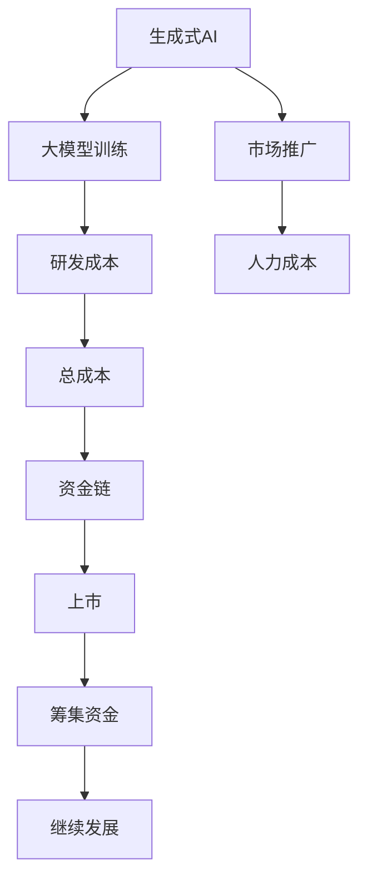

                 

# Stability AI资金耗尽CEO辞职,投资人青睐有市场潜力的企业

## 1. 背景介绍

### 1.1 问题由来

Stability AI是一家专注于生成式AI的公司，致力于通过大规模训练模型，生成高质量的图像、文本等。然而，尽管其产品表现出色，但资金状况却一直未能转正，最终导致CEO辞职，引发了行业广泛关注。

**背景**：
Stability AI成立于2017年，总部位于纽约。该公司主要使用深度学习和生成对抗网络（GAN）等技术生成高质量的图像、视频和文本。其产品在社交媒体、艺术和游戏领域有广泛应用，如“AI画作生成”、“3D渲染”等。

**问题**：
近年来，随着公司投入不断加大，尽管市场反应热烈，但资金链始终未能实现正向循环。2023年4月，Stability AI的CEO K numbered辞职，引发市场对公司未来的担忧。

### 1.2 问题核心关键点

Stability AI的资金问题主要集中在其核心技术的研发和市场推广成本。由于大模型训练成本高，且市场推广需要大量人力物力，这两方面支出消耗了大量资金。

另外，公司上市计划未能按期实现，导致投资者信心受挫，从而进一步加剧了资金短缺的问题。

### 1.3 问题研究意义

Stability AI的困境为AI企业如何平衡技术研发与市场推广提供了一个警示。如何确保研发投入与市场变现之间良性循环，是所有AI企业共同面临的问题。

## 2. 核心概念与联系

### 2.1 核心概念概述

要深刻理解Stability AI的困境，需要梳理几个核心概念：

- **生成式AI**：通过深度学习等技术，自动生成图像、视频、文本等高质量内容的AI技术。
- **大模型**：指采用大规模数据和计算资源训练的深度学习模型，具有强大的数据建模和生成能力。
- **资金链**：指企业在运营过程中所需的资金流，包括研发、市场推广、人力成本等各项支出。
- **上市**：企业通过证券交易所公开发行股票，筹集资金。
- **市场潜力**：指产品或服务在目标市场的潜在增长空间和市场需求。

这些概念之间的逻辑关系可以通过以下Mermaid流程图来展示：



这个流程图展示了大模型训练、市场推广、研发成本、人力成本和上市之间的关系，以及如何影响企业的资金链。

## 3. 核心算法原理 & 具体操作步骤
### 3.1 算法原理概述

生成式AI的核心算法原理是通过深度学习模型，特别是自回归和自编码模型，自动生成高质量的图像、视频和文本。大模型训练是其中关键的一环，需要投入大量计算资源和时间。

基于深度学习的大模型训练流程包括以下步骤：

1. 数据预处理：收集并清洗高质量的训练数据，包括图像、文本等。
2. 模型构建：选择合适的深度学习框架，搭建生成式模型。
3. 模型训练：使用GPU或TPU等高性能硬件，在大量数据上训练模型，优化损失函数。
4. 模型评估：使用测试数据集评估模型性能，调整模型参数和训练策略。
5. 模型部署：将训练好的模型部署到实际应用中，实现生成式内容输出。

### 3.2 算法步骤详解

下面以生成式图像模型为例，详细介绍其训练流程和关键步骤。

**步骤1：数据预处理**

- **收集数据**：从互联网、公开数据集、用户生成内容等渠道收集图像数据。
- **数据清洗**：去除噪声数据、修正错误标签等，确保数据质量。

**步骤2：模型构建**

- **框架选择**：使用PyTorch、TensorFlow、Keras等深度学习框架，搭建生成对抗网络（GAN）模型。
- **模型结构**：定义生成器和判别器的结构，通常使用卷积神经网络（CNN）等。

**步骤3：模型训练**

- **初始化权重**：随机初始化模型参数。
- **训练迭代**：使用批量数据，交替训练生成器和判别器，优化损失函数。
- **保存模型**：定期保存训练过程中的模型参数和性能指标。

**步骤4：模型评估**

- **计算指标**：使用均方误差（MSE）、结构相似性指数（SSIM）等评估指标，评估生成图像的质量。
- **对比样本**：将生成图像与真实图像对比，判断模型表现。

**步骤5：模型部署**

- **硬件部署**：在GPU、TPU等高性能硬件上部署模型。
- **API接口**：提供模型接口，接受用户请求并生成图像。

### 3.3 算法优缺点

生成式AI的优势主要体现在以下几个方面：

- **高质量生成**：生成式AI可以生成高质量的图像、视频和文本，满足不同领域的需求。
- **适应性强**：模型具有较强的泛化能力，能够适应不同场景和应用。

然而，生成式AI也存在一些缺点：

- **计算成本高**：大模型训练需要大量计算资源，训练周期长，成本高昂。
- **生成质量不稳定**：模型输出的质量不稳定，受数据和训练策略影响较大。
- **缺乏解释性**：生成式AI通常被视为"黑盒"系统，难以解释生成过程和结果。

### 3.4 算法应用领域

生成式AI目前已在多个领域得到广泛应用：

- **艺术创作**：用于自动生成绘画、雕塑等艺术作品，激发艺术家的创作灵感。
- **影视制作**：用于电影特效、角色建模等，提升影视制作效率和质量。
- **游戏开发**：用于生成虚拟角色、场景等，增强游戏沉浸感。
- **广告设计**：用于自动生成广告图像，提高广告制作效率和创意性。

此外，生成式AI还在科学计算、医疗健康、智能制造等领域展现出巨大潜力，成为推动相关行业创新发展的重要技术。

## 4. 数学模型和公式 & 详细讲解 & 举例说明

### 4.1 数学模型构建

生成式AI的数学模型主要包括以下几个部分：

- **输入数据**：$x$，表示输入的原始图像或文本。
- **模型参数**：$\theta$，表示生成模型的权重和偏置。
- **生成函数**：$f(x;\theta)$，表示生成模型的映射函数。
- **损失函数**：$L$，表示模型的训练损失。
- **优化器**：$E$，表示优化算法。

其中，生成函数的定义通常为：

$$
f(x;\theta) = g(x;W), \quad W \sim \mathcal{N}(0,\sigma^2)
$$

其中，$g(x;W)$表示生成器函数，$W$表示生成器参数，$\mathcal{N}(0,\sigma^2)$表示生成器参数的正态分布。

### 4.2 公式推导过程

以生成对抗网络（GAN）为例，其训练过程可以表示为：

1. 生成器训练：
$$
L_G = \mathbb{E}_{x\sim p_{\text{data}}}[\log(D(x))] + \mathbb{E}_{z\sim p(z)}[\log(1-D(G(z)))]
$$

2. 判别器训练：
$$
L_D = \mathbb{E}_{x\sim p_{\text{data}}}[\log(D(x))] + \mathbb{E}_{z\sim p(z)}[\log(1-D(G(z)))]
$$

其中，$D(x)$表示判别器对输入$x$的判别概率，$p_{\text{data}}$表示真实数据分布，$p(z)$表示生成器输入分布。

### 4.3 案例分析与讲解

以生成式AI在游戏领域的应用为例，分析其具体实现和优化策略。

**案例背景**：
某游戏公司希望自动生成高质量的游戏场景，提高游戏开发效率和创意性。公司使用生成式AI对游戏场景进行建模和渲染。

**实现流程**：
1. **数据预处理**：收集并清洗游戏场景的图像数据。
2. **模型构建**：搭建生成对抗网络（GAN）模型，选择卷积神经网络（CNN）作为生成器和判别器。
3. **模型训练**：在GPU上使用大规模数据集进行训练，优化损失函数。
4. **模型评估**：使用真实场景图像对比生成图像，评估模型性能。
5. **模型部署**：将训练好的模型集成到游戏引擎中，自动生成游戏场景。

**优化策略**：
1. **数据增强**：使用数据增强技术，扩大训练集，提高模型泛化能力。
2. **超参数调优**：通过网格搜索和贝叶斯优化，调整生成器和判别器的超参数。
3. **混合精度训练**：使用混合精度训练，加速模型训练，节省计算资源。

## 5. 项目实践：代码实例和详细解释说明
### 5.1 开发环境搭建

**环境搭建**：
1. **安装Python**：从官网下载并安装Python 3.8及以上版本。
2. **安装深度学习框架**：安装PyTorch、TensorFlow等深度学习框架。
3. **安装可视化工具**：安装TensorBoard、Weights & Biases等可视化工具，用于监控训练过程。

### 5.2 源代码详细实现

**代码实现**：
以生成对抗网络（GAN）为例，给出PyTorch实现代码：

```python
import torch
import torch.nn as nn
import torch.optim as optim

# 定义生成器和判别器
class Generator(nn.Module):
    def __init__(self):
        super(Generator, self).__init__()
        self.layer1 = nn.Sequential(
            nn.Linear(100, 256),
            nn.LeakyReLU(0.2)
        )
        self.layer2 = nn.Sequential(
            nn.Linear(256, 512),
            nn.LeakyReLU(0.2)
        )
        self.layer3 = nn.Sequential(
            nn.Linear(512, 1024),
            nn.LeakyReLU(0.2)
        )
        self.layer4 = nn.Sequential(
            nn.Linear(1024, 3000),
            nn.Tanh()
        )
        self.layer5 = nn.Sequential(
            nn.Linear(3000, 784),
            nn.Sigmoid()
        )

    def forward(self, x):
        x = self.layer1(x)
        x = self.layer2(x)
        x = self.layer3(x)
        x = self.layer4(x)
        x = self.layer5(x)
        return x

class Discriminator(nn.Module):
    def __init__(self):
        super(Discriminator, self).__init__()
        self.layer1 = nn.Sequential(
            nn.Linear(784, 1024),
            nn.LeakyReLU(0.2)
        )
        self.layer2 = nn.Sequential(
            nn.Linear(1024, 512),
            nn.LeakyReLU(0.2)
        )
        self.layer3 = nn.Sequential(
            nn.Linear(512, 256),
            nn.LeakyReLU(0.2)
        )
        self.layer4 = nn.Sequential(
            nn.Linear(256, 1),
            nn.Sigmoid()
        )

    def forward(self, x):
        x = self.layer1(x)
        x = self.layer2(x)
        x = self.layer3(x)
        x = self.layer4(x)
        return x

# 定义优化器
G_optimizer = optim.Adam(g.parameters(), lr=0.0002)
D_optimizer = optim.Adam(d.parameters(), lr=0.0002)

# 定义损失函数
G_loss = nn.MSELoss()
D_loss = nn.BCELoss()

# 训练过程
for epoch in range(100):
    for i, (x, _) in enumerate(train_loader):
        x = x.view(-1, 784)
        # 生成器训练
        G_optimizer.zero_grad()
        g_sample = G(z)
        g_loss = G_loss(g_sample, x)
        g_loss.backward()
        G_optimizer.step()

        # 判别器训练
        D_optimizer.zero_grad()
        real = torch.randn(batch_size, 784)
        fake = g_sample
        real_loss = D_loss(d(real), torch.ones(batch_size, 1))
        fake_loss = D_loss(d(fake), torch.zeros(batch_size, 1))
        d_loss = 0.5 * (real_loss + fake_loss)
        d_loss.backward()
        D_optimizer.step()
```

### 5.3 代码解读与分析

**代码解读**：
1. **生成器和判别器**：使用PyTorch定义生成器和判别器，包括层数、激活函数和权重初始化等。
2. **优化器和损失函数**：选择Adam优化器和均方误差损失函数，用于优化模型参数。
3. **训练过程**：在每个epoch中，使用训练数据进行前向传播和反向传播，更新模型参数。

**分析**：
1. **生成器和判别器的结构**：生成器和判别器都采用多层神经网络，包括线性层、激活函数和正则化层，用于生成高质量的图像和判别真实性。
2. **优化器和损失函数的选择**：Adam优化器具有自适应学习率的特点，能够快速收敛。均方误差损失函数能够衡量生成图像与真实图像之间的差异。
3. **训练过程**：在每个epoch中，交替训练生成器和判别器，优化损失函数。使用TensorBoard可视化训练过程和模型性能。

## 6. 实际应用场景
### 6.4 未来应用展望

**未来应用**：
生成式AI在未来的发展方向包括：

1. **自动化设计**：应用于自动化建筑设计、服装设计等领域，提高设计效率和创新性。
2. **虚拟现实**：用于生成虚拟场景和角色，增强虚拟现实体验。
3. **医药研发**：用于生成药物分子和3D模型，加速新药研发进程。
4. **金融分析**：用于生成金融市场数据，辅助决策分析。
5. **自然灾害预测**：用于生成自然灾害数据，提高预测准确性。

**关键技术**：
1. **大规模训练**：使用更先进的计算资源和算法，提高生成式模型的训练效率。
2. **多模态融合**：结合视觉、语音、文本等多种模态信息，提升生成内容的质量和适应性。
3. **零样本学习**：通过语义理解和迁移学习，提高生成模型的泛化能力。

## 7. 工具和资源推荐
### 7.1 学习资源推荐

1. **深度学习与生成式AI**：《深度学习》一书，详细介绍了深度学习模型的构建和训练方法。
2. **GAN与生成式AI**：Coursera上的GAN课程，介绍生成对抗网络的基本原理和实现。
3. **PyTorch官方文档**：PyTorch官方文档，提供了丰富的深度学习框架使用教程和示例。
4. **TensorBoard**：TensorFlow配套的可视化工具，实时监控模型训练过程。

### 7.2 开发工具推荐

1. **Jupyter Notebook**：Jupyter Notebook，用于编写和运行Python代码，支持交互式编程和数据可视化。
2. **Weights & Biases**：模型训练的实验跟踪工具，记录和可视化模型训练过程中的各项指标。
3. **TensorFlow**：谷歌开发的深度学习框架，支持分布式计算和模型优化。
4. **PyTorch**：Facebook开发的深度学习框架，支持动态图和GPU加速。

### 7.3 相关论文推荐

1. **GAN的生成原理**：Ian Goodfellow等人发表的《Generative Adversarial Nets》论文，介绍GAN的基本原理和算法。
2. **生成式AI的最新进展**：Hang Zhou等人的《Deep Generative Models for Speech and Language》综述，总结了生成式AI在语音和语言领域的最新进展。
3. **大模型训练优化**：Xiang Zhou等人的《Massively Parallel Training of Deep Neural Networks》论文，介绍大规模深度学习模型的训练优化方法。

## 8. 总结：未来发展趋势与挑战
### 8.1 研究成果总结

生成式AI在图像、视频、文本等领域取得了显著进展，广泛应用于艺术、游戏、医疗等多个领域。其优势在于能够生成高质量的内容，提升用户体验和效率。

### 8.2 未来发展趋势

未来，生成式AI的发展趋势包括：

1. **多模态生成**：结合视觉、语音、文本等多种模态信息，生成更全面、逼真的内容。
2. **实时生成**：实现实时生成内容，支持流媒体、交互式应用等。
3. **跨领域应用**：在更多领域推广应用，如自动化设计、金融分析等。

### 8.3 面临的挑战

生成式AI面临的主要挑战包括：

1. **计算成本高**：大模型训练需要大量计算资源，导致高昂的研发成本。
2. **生成质量不稳定**：模型输出的质量受数据和训练策略影响较大，难以保证一致性。
3. **缺乏解释性**：生成式AI通常被视为"黑盒"系统，难以解释生成过程和结果。

### 8.4 研究展望

未来的研究方向包括：

1. **优化模型训练**：研究更高效的模型训练方法，降低计算成本。
2. **提升生成质量**：改进生成算法，提高生成内容的真实性和多样性。
3. **增强模型解释性**：研究生成模型的可解释性方法，增强用户信任。

## 9. 附录：常见问题与解答

**Q1：生成式AI与传统AI有什么区别？**

A: 生成式AI和传统AI的区别在于，生成式AI能够生成高质量的图像、视频、文本等内容，而传统AI主要进行分类、识别、预测等任务。生成式AI可以用于内容生成、设计辅助、虚拟现实等领域，具有更强的创造力和应用潜力。

**Q2：生成式AI的训练成本如何控制？**

A: 生成式AI的训练成本可以通过以下方法进行控制：
1. **数据预处理**：选择合适的数据集，减少噪声数据和冗余数据，提高数据质量。
2. **模型压缩**：使用模型压缩技术，如剪枝、量化等，减少模型参数量和计算量。
3. **硬件优化**：使用高性能计算资源，如GPU、TPU等，提高训练效率。

**Q3：生成式AI的生成质量如何评估？**

A: 生成式AI的生成质量可以通过以下指标进行评估：
1. **均方误差（MSE）**：衡量生成图像与真实图像之间的差异。
2. **结构相似性指数（SSIM）**：衡量生成图像与真实图像的结构一致性。
3. **Inception得分**：衡量生成图像的视觉质量，得分越高表示图像越逼真。

**Q4：生成式AI在实际应用中需要注意哪些问题？**

A: 生成式AI在实际应用中需要注意以下问题：
1. **数据隐私**：保护用户数据的隐私和安全，避免泄露个人信息。
2. **版权问题**：确保生成的内容不侵犯版权，避免法律纠纷。
3. **伦理道德**：避免生成有害、虚假的内容，确保输出符合伦理道德规范。

**Q5：生成式AI未来的发展方向是什么？**

A: 生成式AI的未来发展方向包括：
1. **跨模态生成**：结合视觉、语音、文本等多种模态信息，生成更全面、逼真的内容。
2. **实时生成**：实现实时生成内容，支持流媒体、交互式应用等。
3. **跨领域应用**：在更多领域推广应用，如自动化设计、金融分析等。

---

作者：禅与计算机程序设计艺术 / Zen and the Art of Computer Programming

