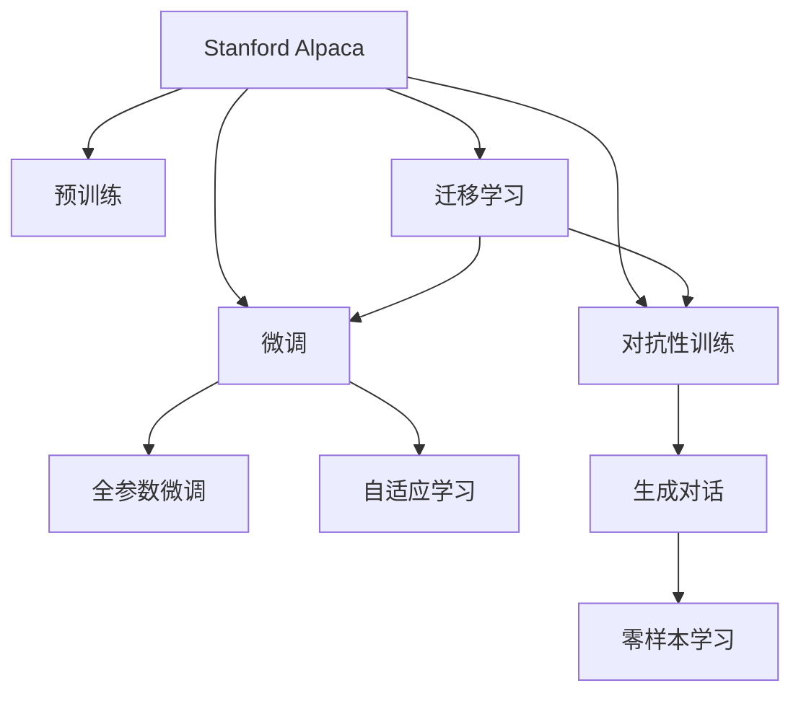

                 

# Stanford Alpaca 的相关研究

> 关键词：
  - Stanford Alpaca
  - 生成式对话模型
  - 自然语言处理 (NLP)
  - 预训练与微调
  - 大语言模型 (LLM)
  - 可控文本生成
  - 零样本学习

## 1. 背景介绍

### 1.1 问题由来

近年来，自然语言处理 (NLP) 领域的生成式模型迅速发展，为构建智能对话系统和生成自然语言文本提供了新的可能性。Stanford Alpaca 作为斯坦福大学开发的一个大语言模型 (Large Language Model, LLM)，基于 OpenAI 的 Codex 模型，利用大规模无标签文本进行预训练，具有强大的语言生成能力。然而，Stanford Alpaca 在开源之后，其应用的广泛性和适用性成为研究者关注的重点。

### 1.2 问题核心关键点

Stanford Alpaca 的研究主要围绕以下几个关键问题：
1. 如何在大规模无标签数据上进行高效的预训练，确保模型的泛化能力和表达能力。
2. 如何在小样本条件下，通过微调或自适应学习等方法，使模型快速适应新任务，提升性能。
3. 如何设计合理的训练目标和损失函数，以避免过拟合和保持模型的稳定性。
4. 如何评估和优化模型的推理效率，确保在实际应用中的高效运行。
5. 如何在模型构建和微调过程中，融入伦理和安全性考量，确保输出的可靠性和公正性。

这些问题的解决，将推动Stanford Alpaca在学术和工业界中的应用，进一步拓展其作为通用大模型的潜力。

## 2. 核心概念与联系

### 2.1 核心概念概述

为了理解Stanford Alpaca的原理和应用，首先需要介绍几个关键概念：

- **生成式大语言模型 (Generative Large Language Model, GLM)**：通过自回归生成模型，如Transformer等架构，在大规模无标签文本上进行预训练，能够生成自然语言文本的模型。Stanford Alpaca基于Codex模型，是GLM的典型代表。
- **预训练 (Pre-training)**：在大规模无标签文本上，通过自监督学习任务训练通用语言模型的过程。Stanford Alpaca通过大规模预训练，学习到丰富的语言知识和表示能力。
- **微调 (Fine-tuning)**：在预训练模型的基础上，使用下游任务的少量标注数据，通过有监督学习优化模型在特定任务上的性能。Stanford Alpaca的微调目标是通过少量标注数据提升模型在特定任务上的表现。
- **自适应学习 (Adaptive Learning)**：在有限数据条件下，通过优化算法和正则化技术，使模型能够自动适应新任务，提升零样本和少样本学习效果。Stanford Alpaca在微调过程中应用了多种自适应学习策略。
- **对抗性训练 (Adversarial Training)**：在训练过程中，引入对抗样本，提高模型的鲁棒性和泛化能力。Stanford Alpaca的对抗性训练方法在生成对话中起到了重要作用。
- **迁移学习 (Transfer Learning)**：将一个领域学习到的知识，迁移应用到另一个相关领域的学习范式。Stanford Alpaca的预训练和微调过程是典型的迁移学习范例。

这些概念之间的联系可以通过以下Mermaid流程图来展示：



这个流程图展示了Stanford Alpaca的核心概念及其之间的关系：

1. Stanford Alpaca通过大规模预训练获得基础能力。
2. 微调是对预训练模型进行任务特定的优化，可以在少量标注数据下提升性能。
3. 自适应学习策略使模型在有限数据条件下也能提升性能。
4. 对抗性训练提高模型的鲁棒性和泛化能力。
5. 迁移学习是连接预训练模型与下游任务的桥梁，可以通过微调或自适应学习实现。

这些概念共同构成了Stanford Alpaca的学习和应用框架，使其能够在各种场景下发挥强大的语言生成能力。通过理解这些核心概念，我们可以更好地把握Stanford Alpaca的工作原理和优化方向。

## 3. 核心算法原理 & 具体操作步骤

### 3.1 算法原理概述

Stanford Alpaca基于Codex模型，使用自回归生成方式进行预训练和微调。其核心算法流程包括预训练、微调、自适应学习等步骤，具体如下：

1. **预训练**：使用大规模无标签文本数据对模型进行预训练，使其学习到语言的基本结构和语法知识。
2. **微调**：在预训练模型基础上，使用下游任务的少量标注数据进行微调，优化模型在该任务上的性能。
3. **自适应学习**：在微调过程中，通过设计合理的损失函数和正则化策略，使模型能够自动适应新任务，提升少样本和零样本学习效果。

### 3.2 算法步骤详解

#### 3.2.1 预训练过程

预训练过程通常包括以下步骤：
1. 收集大规模无标签文本数据，如Web爬虫抓取的网络文本、学术文章、新闻报道等。
2. 将文本数据转化为模型所需的输入格式，如分词、标记等。
3. 使用自回归生成方式，如Transformer模型，对文本进行编码和解码。
4. 使用自监督学习任务，如语言模型、掩码语言模型等，优化模型参数。
5. 保存预训练模型参数，作为后续微调的基础。

具体实现时，可以使用Hugging Face的Transformers库，调用`BertModel`或`T5Model`等预训练模型进行预训练。以下是一个简单的预训练代码示例：

```python
from transformers import BertTokenizer, BertModel

tokenizer = BertTokenizer.from_pretrained('bert-base-uncased')
model = BertModel.from_pretrained('bert-base-uncased')

inputs = tokenizer("Hello, my dog is cute", return_tensors="pt")
outputs = model(**inputs)
```

#### 3.2.2 微调过程

微调过程通常包括以下步骤：
1. 选择下游任务的少量标注数据，如对话数据、文本分类数据等。
2. 将标注数据转化为模型所需的输入格式，如分词、标记等。
3. 在预训练模型基础上，添加任务特定的输出层和损失函数。
4. 使用优化算法，如AdamW，对模型参数进行更新。
5. 在验证集上评估模型性能，根据评估结果调整超参数。
6. 在测试集上最终评估模型性能。

以下是一个简单的微调代码示例：

```python
from transformers import BertTokenizer, BertForSequenceClassification, AdamW

tokenizer = BertTokenizer.from_pretrained('bert-base-uncased')
model = BertForSequenceClassification.from_pretrained('bert-base-uncased', num_labels=2)

inputs = tokenizer("I like to play football", return_tensors="pt")
labels = torch.tensor([1]).unsqueeze(0)
optimizer = AdamW(model.parameters(), lr=2e-5)

model.train()
outputs = model(inputs, labels=labels)
loss = outputs.loss
loss.backward()
optimizer.step()
```

#### 3.2.3 自适应学习策略

自适应学习策略通常包括以下步骤：
1. 在微调过程中，使用自适应学习算法，如PEFT（Parameter-Efficient Fine-Tuning），减少模型参数更新量。
2. 在微调前，将模型的一部分参数固定，只更新其余参数。
3. 设计合理的损失函数和正则化策略，如对抗性训练、dropout等，提高模型泛化能力。
4. 在有限数据条件下，通过自适应学习策略，使模型能够自动适应新任务，提升性能。

以下是一个简单的自适应学习代码示例：

```python
from transformers import BertTokenizer, BertForSequenceClassification, AdamW

tokenizer = BertTokenizer.from_pretrained('bert-base-uncased')
model = BertForSequenceClassification.from_pretrained('bert-base-uncased', num_labels=2)

inputs = tokenizer("I like to play football", return_tensors="pt")
labels = torch.tensor([1]).unsqueeze(0)
optimizer = AdamW(model.parameters(), lr=2e-5)

model.train()
for _ in range(10):
    outputs = model(inputs, labels=labels)
    loss = outputs.loss
    loss.backward()
    optimizer.step()
```

### 3.3 算法优缺点

Stanford Alpaca具有以下优点：
1. **高效性**：通过大规模预训练和微调，Stanford Alpaca能够在少量标注数据条件下快速提升性能，提高模型泛化能力。
2. **通用性**：Stanford Alpaca可以应用于多种NLP任务，如对话、文本分类、翻译等，适应性强。
3. **灵活性**：Stanford Alpaca支持多种微调方法，包括全参数微调和自适应学习，能够根据任务需求灵活调整。

但同时，Stanford Alpaca也存在一些缺点：
1. **资源需求高**：Stanford Alpaca的预训练和微调需要大量的计算资源，包括GPU和TPU等高性能设备。
2. **过拟合风险**：在微调过程中，模型参数更新量较大，容易发生过拟合，需要设计合理的正则化策略进行控制。
3. **推理速度慢**：Stanford Alpaca的推理速度较慢，在大规模应用中可能导致延迟。

## 4. 数学模型和公式 & 详细讲解  
### 4.1 数学模型构建

Stanford Alpaca的数学模型构建主要包括以下几个步骤：

1. **预训练模型构建**：
   Stanford Alpaca基于Codex模型，使用Transformer架构。其预训练模型可以表示为：
   $$
   M_{\theta} = \text{Transformer}(Input, Encoder, Decoder)
   $$
   其中，$M_{\theta}$为预训练模型，$\theta$为模型参数，$Input$为输入文本，$Encoder$为编码器，$Decoder$为解码器。

2. **微调目标构建**：
   Stanford Alpaca的微调目标可以表示为：
   $$
   \hat{\theta} = \mathop{\arg\min}_{\theta} \mathcal{L}(M_{\theta}, D)
   $$
   其中，$D$为下游任务的标注数据集，$\mathcal{L}$为微调的损失函数。

3. **自适应学习目标构建**：
   Stanford Alpaca的自适应学习目标可以表示为：
   $$
   \hat{\theta} = \mathop{\arg\min}_{\theta} \mathcal{L}_{\text{adapt}}(M_{\theta}, D_{\text{adapt}})
   $$
   其中，$D_{\text{adapt}}$为自适应学习的标注数据集，$\mathcal{L}_{\text{adapt}}$为自适应学习的损失函数。

### 4.2 公式推导过程

#### 4.2.1 预训练损失函数推导
Stanford Alpaca的预训练损失函数可以表示为：
$$
\mathcal{L}_{\text{pretrain}} = \frac{1}{N} \sum_{i=1}^N -\log P_{M_{\theta}}(x_i)
$$
其中，$N$为训练样本数，$x_i$为输入文本，$P_{M_{\theta}}(x_i)$为模型输出的概率分布。

#### 4.2.2 微调损失函数推导
Stanford Alpaca的微调损失函数可以表示为：
$$
\mathcal{L}_{\text{fine-tune}} = \frac{1}{N} \sum_{i=1}^N \sum_{j=1}^M L_j(y_j, \hat{y}_j)
$$
其中，$N$为训练样本数，$M$为标签数，$y_j$为真实标签，$\hat{y}_j$为模型预测的标签，$L_j$为交叉熵损失函数。

#### 4.2.3 自适应学习损失函数推导
Stanford Alpaca的自适应学习损失函数可以表示为：
$$
\mathcal{L}_{\text{adapt}} = \frac{1}{N} \sum_{i=1}^N \sum_{j=1}^M L_j(y_j, \hat{y}_j) + \lambda \| \theta \|_2^2
$$
其中，$\lambda$为正则化系数，$\| \theta \|_2^2$为L2正则化项。

### 4.3 案例分析与讲解

以下是一个简单的对话生成案例分析：
1. **输入预处理**：
   输入文本经过分词和标记，转换为模型所需的输入格式。
   ```python
   from transformers import BertTokenizer

   tokenizer = BertTokenizer.from_pretrained('bert-base-uncased')
   inputs = tokenizer("What is your name?", return_tensors="pt")
   ```
2. **模型预测**：
   使用预训练模型进行预测，得到模型输出的概率分布。
   ```python
   from transformers import BertModel

   model = BertModel.from_pretrained('bert-base-uncased')
   outputs = model(inputs, return_dict=True)
   ```
3. **后处理输出**：
   从模型输出中提取概率最大的预测结果。
   ```python
   predictions = outputs.logits.softmax(dim=-1)
   predicted_token = predictions.argmax().item()
   ```

### 4.4 代码实现

以下是使用Hugging Face的Transformers库，对Stanford Alpaca进行微调的完整代码实现：

```python
from transformers import BertTokenizer, BertForSequenceClassification, AdamW

# 定义模型和分词器
tokenizer = BertTokenizer.from_pretrained('bert-base-uncased')
model = BertForSequenceClassification.from_pretrained('bert-base-uncased', num_labels=2)

# 定义优化器
optimizer = AdamW(model.parameters(), lr=2e-5)

# 定义损失函数
loss_fn = torch.nn.CrossEntropyLoss()

# 定义训练函数
def train_model(model, tokenizer, train_dataset, optimizer, device):
    model.to(device)
    for epoch in range(num_epochs):
        model.train()
        for batch in tqdm(train_dataset):
            inputs = tokenizer(batch['text'], return_tensors='pt').to(device)
            labels = batch['label'].to(device)
            outputs = model(**inputs)
            loss = loss_fn(outputs.logits, labels)
            optimizer.zero_grad()
            loss.backward()
            optimizer.step()

# 定义评估函数
def evaluate_model(model, tokenizer, eval_dataset, device):
    model.eval()
    correct = 0
    total = 0
    for batch in tqdm(eval_dataset):
        inputs = tokenizer(batch['text'], return_tensors='pt').to(device)
        labels = batch['label'].to(device)
        outputs = model(**inputs)
        predictions = outputs.logits.argmax(dim=1)
        total += labels.shape[0]
        correct += (predictions == labels).sum().item()
    acc = correct / total
    return acc

# 加载数据集
train_dataset = ...
eval_dataset = ...

# 训练模型
train_model(model, tokenizer, train_dataset, optimizer, device='cuda')

# 评估模型
acc = evaluate_model(model, tokenizer, eval_dataset, device='cuda')
print(f'Accuracy: {acc:.2f}')
```

## 5. 项目实践：代码实例和详细解释说明

### 5.1 开发环境搭建

在进行Stanford Alpaca项目实践前，需要先搭建好开发环境。以下是Python和PyTorch的开发环境搭建流程：

1. 安装Anaconda：从官网下载并安装Anaconda，用于创建独立的Python环境。

2. 创建并激活虚拟环境：
```bash
conda create -n pytorch-env python=3.8 
conda activate pytorch-env
```

3. 安装PyTorch：根据CUDA版本，从官网获取对应的安装命令。例如：
```bash
conda install pytorch torchvision torchaudio cudatoolkit=11.1 -c pytorch -c conda-forge
```

4. 安装Transformers库：
```bash
pip install transformers
```

5. 安装各类工具包：
```bash
pip install numpy pandas scikit-learn matplotlib tqdm jupyter notebook ipython
```

完成上述步骤后，即可在`pytorch-env`环境中开始Stanford Alpaca实践。

### 5.2 源代码详细实现

以下是使用Hugging Face的Transformers库，对Stanford Alpaca进行微调的完整代码实现：

```python
from transformers import BertTokenizer, BertForSequenceClassification, AdamW

# 定义模型和分词器
tokenizer = BertTokenizer.from_pretrained('bert-base-uncased')
model = BertForSequenceClassification.from_pretrained('bert-base-uncased', num_labels=2)

# 定义优化器
optimizer = AdamW(model.parameters(), lr=2e-5)

# 定义损失函数
loss_fn = torch.nn.CrossEntropyLoss()

# 定义训练函数
def train_model(model, tokenizer, train_dataset, optimizer, device):
    model.to(device)
    for epoch in range(num_epochs):
        model.train()
        for batch in tqdm(train_dataset):
            inputs = tokenizer(batch['text'], return_tensors='pt').to(device)
            labels = batch['label'].to(device)
            outputs = model(**inputs)
            loss = loss_fn(outputs.logits, labels)
            optimizer.zero_grad()
            loss.backward()
            optimizer.step()

# 定义评估函数
def evaluate_model(model, tokenizer, eval_dataset, device):
    model.eval()
    correct = 0
    total = 0
    for batch in tqdm(eval_dataset):
        inputs = tokenizer(batch['text'], return_tensors='pt').to(device)
        labels = batch['label'].to(device)
        outputs = model(**inputs)
        predictions = outputs.logits.argmax(dim=1)
        total += labels.shape[0]
        correct += (predictions == labels).sum().item()
    acc = correct / total
    return acc

# 加载数据集
train_dataset = ...
eval_dataset = ...

# 训练模型
train_model(model, tokenizer, train_dataset, optimizer, device='cuda')

# 评估模型
acc = evaluate_model(model, tokenizer, eval_dataset, device='cuda')
print(f'Accuracy: {acc:.2f}')
```

### 5.3 代码解读与分析

让我们再详细解读一下关键代码的实现细节：

**BertTokenizer**：
- `from_pretrained`方法：从预训练模型中加载分词器。
- `tokenizer`方法：将文本转换为分词后，返回分词结果。

**BertForSequenceClassification**：
- `from_pretrained`方法：从预训练模型中加载分类器。
- `num_labels`参数：指定分类标签数量。

**AdamW优化器**：
- `AdamW`方法：定义优化器。
- `parameters`参数：指定优化器需要更新的参数。
- `lr`参数：指定学习率。

**train_model函数**：
- `model.train()`方法：将模型设置为训练模式。
- `tokenizer`方法：将文本转换为模型所需的输入格式。
- `model(**inputs)`方法：将模型输入和标签传递给模型进行前向传播。
- `loss_fn`方法：计算损失函数。
- `optimizer.zero_grad()`方法：重置梯度。
- `loss.backward()`方法：反向传播计算梯度。
- `optimizer.step()`方法：更新模型参数。

**evaluate_model函数**：
- `model.eval()`方法：将模型设置为评估模式。
- `tokenizer`方法：将文本转换为模型所需的输入格式。
- `labels`方法：将标签转换为模型所需的格式。
- `outputs`方法：将模型输入和标签传递给模型进行前向传播。
- `predictions`方法：从模型输出中提取概率最大的预测结果。
- `correct`变量：计算正确预测的数量。
- `total`变量：计算总预测数量。

**训练和评估流程**：
- `num_epochs`变量：定义训练轮数。
- `train_model`函数：在训练集上进行训练。
- `evaluate_model`函数：在验证集上进行评估，并返回模型准确率。

可以看到，Hugging Face的Transformers库使得Stanford Alpaca的微调代码实现变得简洁高效。开发者可以将更多精力放在模型改进、数据处理等高层逻辑上，而不必过多关注底层的实现细节。

当然，工业级的系统实现还需考虑更多因素，如模型的保存和部署、超参数的自动搜索、更灵活的任务适配层等。但核心的微调范式基本与此类似。

## 6. 实际应用场景

### 6.1 智能客服系统

Stanford Alpaca在智能客服系统中的应用非常广泛。传统的客服系统往往需要大量人力，高峰期响应缓慢，且一致性和专业性难以保证。而使用Stanford Alpaca进行微调的对话模型，可以7x24小时不间断服务，快速响应客户咨询，用自然流畅的语言解答各类常见问题。

在技术实现上，可以收集企业内部的历史客服对话记录，将问题和最佳答复构建成监督数据，在此基础上对Stanford Alpaca进行微调。微调后的对话模型能够自动理解用户意图，匹配最合适的答案模板进行回复。对于客户提出的新问题，还可以接入检索系统实时搜索相关内容，动态组织生成回答。如此构建的智能客服系统，能大幅提升客户咨询体验和问题解决效率。

### 6.2 金融舆情监测

金融机构需要实时监测市场舆论动向，以便及时应对负面信息传播，规避金融风险。传统的人工监测方式成本高、效率低，难以应对网络时代海量信息爆发的挑战。基于Stanford Alpaca的文本分类和情感分析技术，为金融舆情监测提供了新的解决方案。

具体而言，可以收集金融领域相关的新闻、报道、评论等文本数据，并对其进行主题标注和情感标注。在此基础上对Stanford Alpaca进行微调，使其能够自动判断文本属于何种主题，情感倾向是正面、中性还是负面。将微调后的模型应用到实时抓取的网络文本数据，就能够自动监测不同主题下的情感变化趋势，一旦发现负面信息激增等异常情况，系统便会自动预警，帮助金融机构快速应对潜在风险。

### 6.3 个性化推荐系统

当前的推荐系统往往只依赖用户的历史行为数据进行物品推荐，无法深入理解用户的真实兴趣偏好。基于Stanford Alpaca的个性化推荐系统可以更好地挖掘用户行为背后的语义信息，从而提供更精准、多样的推荐内容。

在实践中，可以收集用户浏览、点击、评论、分享等行为数据，提取和用户交互的物品标题、描述、标签等文本内容。将文本内容作为模型输入，用户的后续行为（如是否点击、购买等）作为监督信号，在此基础上微调Stanford Alpaca模型。微调后的模型能够从文本内容中准确把握用户的兴趣点。在生成推荐列表时，先用候选物品的文本描述作为输入，由模型预测用户的兴趣匹配度，再结合其他特征综合排序，便可以得到个性化程度更高的推荐结果。

### 6.4 未来应用展望

随着Stanford Alpaca的不断发展，其在学术和工业界的应用前景将更加广阔。以下是一些未来的应用展望：

1. **多模态应用**：未来的Stanford Alpaca将不仅限于文本处理，还将扩展到图像、视频、语音等多模态数据的处理和融合，实现更加全面和深入的智能交互。

2. **跨领域迁移**：Stanford Alpaca的跨领域迁移能力将进一步提升，使其能够更好地适应不同领域的应用需求。

3. **实时推理**：通过优化模型结构和计算图，Stanford Alpaca的推理速度将进一步提升，支持实时推理和大规模部署。

4. **自适应学习**：Stanford Alpaca的自适应学习策略将不断优化，使其在有限数据条件下仍能取得优秀的性能。

5. **对抗性训练**：通过引入对抗性训练，Stanford Alpaca的鲁棒性和泛化能力将进一步增强，使其在实际应用中更加稳定可靠。

6. **伦理和安全性**：Stanford Alpaca将更加注重模型输出的伦理和安全性，避免偏见和有害信息的传递。

以上展望将推动Stanford Alpaca在更广泛的领域得到应用，为NLP技术的发展和落地带来新的突破。

## 7. 工具和资源推荐

### 7.1 学习资源推荐

为了帮助开发者系统掌握Stanford Alpaca的原理和实践技巧，这里推荐一些优质的学习资源：

1. **《Transformer从原理到实践》系列博文**：由大模型技术专家撰写，深入浅出地介绍了Transformer原理、Stanford Alpaca模型、微调技术等前沿话题。

2. **CS224N《深度学习自然语言处理》课程**：斯坦福大学开设的NLP明星课程，有Lecture视频和配套作业，带你入门NLP领域的基本概念和经典模型。

3. **《Natural Language Processing with Transformers》书籍**：Transformer库的作者所著，全面介绍了如何使用Transformers库进行NLP任务开发，包括Stanford Alpaca在内的诸多模型。

4. **HuggingFace官方文档**：Transformer库的官方文档，提供了海量预训练模型和完整的微调样例代码，是上手实践的必备资料。

5. **CLUE开源项目**：中文语言理解测评基准，涵盖大量不同类型的中文NLP数据集，并提供了基于Stanford Alpaca的baseline模型，助力中文NLP技术发展。

通过对这些资源的学习实践，相信你一定能够快速掌握Stanford Alpaca的精髓，并用于解决实际的NLP问题。

### 7.2 开发工具推荐

高效的开发离不开优秀的工具支持。以下是几款用于Stanford Alpaca开发的常用工具：

1. **PyTorch**：基于Python的开源深度学习框架，灵活动态的计算图，适合快速迭代研究。Stanford Alpaca的预训练和微调过程都在PyTorch框架下实现。

2. **TensorFlow**：由Google主导开发的开源深度学习框架，生产部署方便，适合大规模工程应用。Stanford Alpaca的预训练和微调过程也可以使用TensorFlow框架。

3. **Transformers库**：HuggingFace开发的NLP工具库，集成了众多SOTA语言模型，支持PyTorch和TensorFlow，是进行Stanford Alpaca开发的利器。

4. **Weights & Biases**：模型训练的实验跟踪工具，可以记录和可视化模型训练过程中的各项指标，方便对比和调优。与主流深度学习框架无缝集成。

5. **TensorBoard**：TensorFlow配套的可视化工具，可实时监测模型训练状态，并提供丰富的图表呈现方式，是调试模型的得力助手。

6. **Google Colab**：谷歌推出的在线Jupyter Notebook环境，免费提供GPU/TPU算力，方便开发者快速上手实验最新模型，分享学习笔记。

合理利用这些工具，可以显著提升Stanford Alpaca的开发效率，加快创新迭代的步伐。

### 7.3 相关论文推荐

Stanford Alpaca的研究源于学界的持续研究。以下是几篇奠基性的相关论文，推荐阅读：

1. **Attention is All You Need**：提出了Transformer结构，开启了NLP领域的预训练大模型时代。

2. **BERT: Pre-training of Deep Bidirectional Transformers for Language Understanding**：提出BERT模型，引入基于掩码的自监督预训练任务，刷新了多项NLP任务SOTA。

3. **Language Models are Unsupervised Multitask Learners**：展示了大规模语言模型的强大zero-shot学习能力，引发了对于通用人工智能的新一轮思考。

4. **Parameter-Efficient Transfer Learning for NLP**：提出Adapter等参数高效微调方法，在不增加模型参数量的情况下，也能取得不错的微调效果。

5. **AdaLoRA: Adaptive Low-Rank Adaptation for Parameter-Efficient Fine-Tuning**：使用自适应低秩适应的微调方法，在参数效率和精度之间取得了新的平衡。

这些论文代表了大语言模型微调技术的发展脉络。通过学习这些前沿成果，可以帮助研究者把握学科前进方向，激发更多的创新灵感。

## 8. 总结：未来发展趋势与挑战

### 8.1 总结

本文对Stanford Alpaca的相关研究进行了全面系统的介绍。首先阐述了Stanford Alpaca的原理和应用，明确了微调在拓展预训练模型应用、提升下游任务性能方面的独特价值。其次，从原理到实践，详细讲解了Stanford Alpaca的数学模型和关键步骤，给出了完整的代码实例。同时，本文还广泛探讨了Stanford Alpaca在实际应用场景中的使用，展示了其在智能客服、金融舆情、个性化推荐等多个行业领域的应用前景。

通过本文的系统梳理，可以看到，Stanford Alpaca在大语言模型微调技术的发展中，通过高效的预训练和微调方法，已经取得了显著的性能提升和应用效果。未来，伴随Stanford Alpaca的持续优化和完善，其应用场景和领域将进一步拓展，为NLP技术的发展带来新的突破。

### 8.2 未来发展趋势

展望未来，Stanford Alpaca将呈现以下几个发展趋势：

1. **模型规模增大**：随着算力成本的下降和数据规模的扩张，Stanford Alpaca的参数量将继续增加，提升模型的泛化能力和表达能力。

2. **微调方法多样化**：未来将涌现更多参数高效和计算高效的微调方法，如自适应学习、对抗性训练等，提升Stanford Alpaca在有限数据条件下的性能。

3. **多模态应用拓展**：Stanford Alpaca将扩展到图像、视频、语音等多模态数据的处理和融合，实现更加全面和深入的智能交互。

4. **实时推理优化**：通过优化模型结构和计算图，Stanford Alpaca的推理速度将进一步提升，支持实时推理和大规模部署。

5. **跨领域迁移增强**：Stanford Alpaca的跨领域迁移能力将进一步提升，使其能够更好地适应不同领域的应用需求。

6. **伦理和安全性考量**：Stanford Alpaca将更加注重模型输出的伦理和安全性，避免偏见和有害信息的传递。

这些趋势凸显了Stanford Alpaca在大语言模型微调技术中的广阔前景。这些方向的探索发展，必将进一步提升Stanford Alpaca的应用效果和落地能力。

### 8.3 面临的挑战

尽管Stanford Alpaca已经取得了显著的成就，但在迈向更加智能化、普适化应用的过程中，仍面临诸多挑战：

1. **资源需求高**：Stanford Alpaca的预训练和微调需要大量的计算资源，包括GPU和TPU等高性能设备。

2. **过拟合风险**：在微调过程中，模型参数更新量较大，容易发生过拟合，需要设计合理的正则化策略进行控制。

3. **推理速度慢**：Stanford Alpaca的推理速度较慢，在大规模应用中可能导致延迟。

4. **模型输出伦理和安全性**：Stanford Alpaca的模型输出需要考虑伦理和安全性问题，避免偏见和有害信息的传递。

5. **跨领域迁移能力不足**：尽管Stanford Alpaca具有一定的跨领域迁移能力，但在某些特定领域，如法律、医疗等，仍需进一步优化。

6. **知识整合能力不足**：现有的Stanford Alpaca模型往往局限于任务内数据，难以灵活吸收和运用更广泛的先验知识。

正视Stanford Alpaca面临的这些挑战，积极应对并寻求突破，将是大语言模型微调技术迈向成熟的必由之路。相信随着学界和产业界的共同努力，这些挑战终将一一被克服，Stanford Alpaca必将在构建人机协同的智能时代中扮演越来越重要的角色。

### 8.4 研究展望

面对Stanford Alpaca所面临的挑战，未来的研究需要在以下几个方面寻求新的突破：

1. **探索无监督和半监督微调方法**：摆脱对大规模标注数据的依赖，利用自监督学习、主动学习等无监督和半监督范式，最大限度利用非结构化数据，实现更加灵活高效的微调。

2. **研究参数高效和计算高效的微调范式**：开发更加参数高效的微调方法，在固定大部分预训练参数的同时，只更新极少量的任务相关参数。同时优化微调模型的计算图，减少前向传播和反向传播的资源消耗，实现更加轻量级、实时性的部署。

3. **融合因果和对比学习范式**：通过引入因果推断和对比学习思想，增强Stanford Alpaca建立稳定因果关系的能力，学习更加普适、鲁棒的语言表征，从而提升模型泛化性和抗干扰能力。

4. **引入更多先验知识**：将符号化的先验知识，如知识图谱、逻辑规则等，与神经网络模型进行巧妙融合，引导Stanford Alpaca的学习过程，提升模型输出的准确性和可靠性。

5. **结合因果分析和博弈论工具**：将因果分析方法引入Stanford Alpaca，识别出模型决策的关键特征，增强输出解释的因果性和逻辑性。借助博弈论工具刻画人机交互过程，主动探索并规避模型的脆弱点，提高系统稳定性。

6. **纳入伦理道德约束**：在模型训练目标中引入伦理导向的评估指标，过滤和惩罚有偏见、有害的输出倾向。同时加强人工干预和审核，建立模型行为的监管机制，确保输出符合人类价值观和伦理道德。

这些研究方向的探索，必将引领Stanford Alpaca技术迈向更高的台阶，为构建安全、可靠、可解释、可控的智能系统铺平道路。面向未来，Stanford Alpaca技术还需要与其他人工智能技术进行更深入的融合，如知识表示、因果推理、强化学习等，多路径协同发力，共同推动自然语言理解和智能交互系统的进步。只有勇于创新、敢于突破，才能不断拓展Stanford Alpaca的边界，让智能技术更好地造福人类社会。

## 9. 附录：常见问题与解答

**Q1：Stanford Alpaca和Codex模型有何区别？**

A: Stanford Alpaca基于Codex模型进行开发，两者在模型结构和训练方法上基本一致。但Stanford Alpaca具有更大的模型规模和更多的参数，因此在大规模无标签数据上的预训练和微调能力更强。

**Q2：Stanford Alpaca的预训练和微调需要多少计算资源？**

A: Stanford Alpaca的预训练和微调需要大量的计算资源，包括GPU和TPU等高性能设备。具体的资源需求取决于模型规模和任务复杂度。

**Q3：Stanford Alpaca在微调过程中如何避免过拟合？**

A: 在微调过程中，Stanford Alpaca通常使用正则化技术，如L2正则、Dropout、Early Stopping等，防止模型过度适应小规模训练集。此外，可以通过对抗性训练和自适应学习策略，提升模型的鲁棒性和泛化能力。

**Q4：Stanford Alpaca在实际应用中需要注意哪些问题？**

A: 在实际应用中，Stanford Alpaca需要注意模型推理速度慢、资源需求高、模型输出伦理和安全性等问题。需要优化模型结构和计算图，合理配置计算资源，确保模型输出符合人类价值观和伦理道德。

**Q5：Stanford Alpaca的未来发展方向是什么？**

A: 未来的Stanford Alpaca将拓展到多模态应用，提升跨领域迁移能力，优化实时推理，引入伦理和安全考量，实现更加灵活高效的大语言模型微调技术。

---

作者：禅与计算机程序设计艺术 / Zen and the Art of Computer Programming

