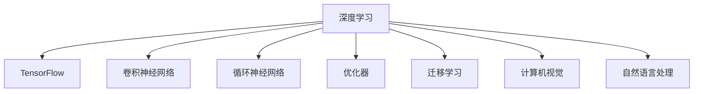

                 

# TensorFlow深度学习框架：从入门到精通

> 关键词：TensorFlow,深度学习,神经网络,卷积神经网络,循环神经网络,优化器,迁移学习,计算机视觉,自然语言处理

## 1. 背景介绍

### 1.1 问题由来
随着深度学习技术的不断发展，深度神经网络（Deep Neural Networks, DNNs）已经成为人工智能领域的重要工具，广泛应用在计算机视觉、自然语言处理、语音识别等领域。TensorFlow作为深度学习领域最流行的开源框架之一，提供了丰富的工具和库，使得深度学习模型的开发、训练和部署变得更加容易和高效。

然而，对于初学者而言，TensorFlow的学习曲线相对较陡峭。本文将通过详细的介绍和实例，帮助读者从零开始，全面掌握TensorFlow深度学习框架的使用，从入门到精通。

### 1.2 问题核心关键点
TensorFlow的核心优势在于其灵活性、可扩展性和高性能。通过介绍TensorFlow的基本概念、架构、优化器和应用场景，读者可以系统地理解深度学习模型的训练和推理过程，并能够灵活应用于不同的应用领域。

本文将通过以下几个核心关键点展开：
- 深度学习的基本概念
- TensorFlow的核心组件
- 常见深度学习模型的实现
- 深度学习模型的优化和调参
- TensorFlow在计算机视觉和自然语言处理中的应用实例

## 2. 核心概念与联系

### 2.1 核心概念概述

为更好地理解TensorFlow的深度学习框架，本节将介绍几个密切相关的核心概念：

- 深度学习（Deep Learning）：利用多层神经网络进行特征学习和模式识别的技术，广泛应用于计算机视觉、自然语言处理、语音识别等领域。
- TensorFlow：谷歌开发的开源深度学习框架，提供灵活的计算图和强大的工具集，支持多种平台和语言。
- 卷积神经网络（Convolutional Neural Network, CNN）：专门用于图像处理任务的神经网络模型，通过卷积操作提取空间局部特征。
- 循环神经网络（Recurrent Neural Network, RNN）：用于序列数据处理的神经网络模型，通过循环结构捕捉序列依赖关系。
- 优化器（Optimizer）：用于更新模型参数，加速深度学习模型的训练过程，常用的包括梯度下降法（Gradient Descent）、Adam等。
- 迁移学习（Transfer Learning）：将一个领域学到的知识迁移到另一个相关领域的学习方法，可以显著降低深度学习模型的训练成本。
- 计算机视觉（Computer Vision）：利用计算机对图像、视频等视觉数据进行分析和处理的领域，如目标检测、图像分类等。
- 自然语言处理（Natural Language Processing, NLP）：利用计算机对自然语言文本进行分析和处理的领域，如文本分类、情感分析等。

这些核心概念之间的逻辑关系可以通过以下Mermaid流程图来展示：



这个流程图展示的深度学习框架中各核心概念及其之间的关系：

1. 深度学习作为基础，提供了神经网络模型的基本训练和推理方法。
2. TensorFlow作为一个平台，提供了丰富的工具和库，支持多种神经网络模型和优化器。
3. 卷积神经网络和循环神经网络是深度学习中常见的模型类型，分别应用于计算机视觉和自然语言处理任务。
4. 优化器用于更新模型参数，加速深度学习模型的训练过程。
5. 迁移学习利用预训练模型和少量标注数据，可以显著降低模型的训练成本。
6. 计算机视觉和自然语言处理是深度学习的主要应用领域，通过TensorFlow提供的工具可以高效地进行模型开发和应用。

## 3. 核心算法原理 & 具体操作步骤

### 3.1 算法原理概述

TensorFlow深度学习框架的核心原理是基于计算图的模型定义和数据流计算。其核心思想是通过定义计算图，描述模型的输入、输出和中间变量，并通过反向传播算法自动计算梯度，更新模型参数，实现模型的训练和推理。

TensorFlow的计算图由节点和边组成，每个节点代表一个操作，如加法、乘法、卷积等，边表示操作之间的数据流动。当计算图被定义后，TensorFlow会自动编译生成高效的C++代码，在GPU或CPU上运行。

TensorFlow的反向传播算法基于链式法则，通过计算损失函数对模型参数的梯度，并使用梯度下降等优化算法更新参数，实现模型的训练。在训练过程中，TensorFlow还提供自动微分、自动变量管理、分布式训练等功能，进一步提高了深度学习模型的训练效率和可扩展性。

### 3.2 算法步骤详解

使用TensorFlow进行深度学习模型的开发和训练，通常包括以下几个关键步骤：

**Step 1: 环境搭建与模型定义**
- 安装TensorFlow：根据操作系统和Python版本，从官网下载并安装TensorFlow库。
- 搭建开发环境：在本地搭建开发环境，确保Python环境中的TensorFlow库与TensorFlow版本兼容。
- 定义模型：使用TensorFlow提供的API，定义模型的输入、输出和中间变量，如使用tf.keras API定义卷积神经网络（CNN）模型、循环神经网络（RNN）模型等。

**Step 2: 数据准备与预处理**
- 收集和准备训练数据集、验证数据集和测试数据集，确保数据集的质量和多样性。
- 对数据集进行预处理，如数据增强、数据归一化、数据集划分等，确保数据集适合模型的训练和评估。

**Step 3: 模型训练与优化**
- 设置训练参数，如学习率、批大小、迭代次数等，选择合适的优化器（如Adam、SGD等）。
- 将模型和数据集交给TensorFlow的训练函数进行训练，TensorFlow会自动计算梯度并更新模型参数。
- 在训练过程中，使用验证集评估模型性能，根据性能调整学习率、批大小等参数，防止过拟合。

**Step 4: 模型评估与推理**
- 使用测试集对模型进行评估，计算模型的精度、召回率、F1分数等指标。
- 将模型导出为TensorFlow SavedModel格式，供生产环境使用。
- 在生产环境中，使用TensorFlow Serving或TensorFlow Lite进行模型的推理和部署。

### 3.3 算法优缺点

TensorFlow作为目前最流行的深度学习框架之一，具有以下优点：
1. 灵活性高：支持多种神经网络模型和优化器，可以灵活设计模型架构和训练策略。
2. 可扩展性强：支持分布式训练和生产环境部署，可以高效利用GPU、TPU等高性能计算资源。
3. 社区活跃：拥有庞大的用户社区和丰富的资源，可以方便地获取学习资料和解决问题。
4. 工具全面：提供丰富的API和库，包括数据预处理、模型可视化、模型调试等工具。

同时，TensorFlow也存在一些局限性：
1. 学习曲线陡峭：对于初学者而言，需要一定的时间掌握TensorFlow的API和概念。
2. 性能问题：在大型深度学习模型训练和推理时，性能可能会受到限制。
3. 兼容性问题：不同版本的TensorFlow之间可能存在兼容性问题，需要谨慎升级和迁移。
4. 内存管理：在处理大规模数据集时，内存管理可能会成为瓶颈，需要使用分布式计算等技术进行优化。

尽管存在这些局限性，但TensorFlow凭借其强大的计算能力和丰富的工具集，仍然是深度学习领域的首选框架之一。

### 3.4 算法应用领域

TensorFlow深度学习框架已经在计算机视觉、自然语言处理、语音识别等领域得到了广泛应用。以下是几个典型应用场景：

- 计算机视觉：TensorFlow提供了tf.keras API，可以轻松定义和训练卷积神经网络（CNN）模型，广泛应用于图像分类、目标检测、人脸识别等任务。
- 自然语言处理：TensorFlow提供了tf.keras API，可以定义和训练循环神经网络（RNN）和Transformer模型，广泛应用于文本分类、情感分析、机器翻译等任务。
- 语音识别：TensorFlow提供了tf.keras API和tf.signal库，可以定义和训练语音识别模型，如声学模型和语言模型，广泛应用于语音助手、语音翻译等任务。
- 推荐系统：TensorFlow提供了tf.keras API和tf.data库，可以定义和训练推荐系统模型，如协同过滤、基于内容的推荐等，广泛应用于电商、社交网络等平台。
- 游戏AI：TensorFlow提供了tf.keras API和tf.image库，可以定义和训练游戏AI模型，如决策树、强化学习等，广泛应用于电子游戏、机器人等领域。

除了这些典型应用领域外，TensorFlow还被广泛应用于科学研究、金融分析、医疗健康等多个领域，为各行各业提供了强大的AI解决方案。

## 4. 数学模型和公式 & 详细讲解 & 举例说明

### 4.1 数学模型构建

在TensorFlow中，深度学习模型的数学模型通常由以下几个部分组成：

1. 输入层（Input Layer）：接收模型的输入数据。
2. 隐藏层（Hidden Layer）：对输入数据进行特征提取和抽象表示。
3. 输出层（Output Layer）：对隐藏层的输出进行分类或回归等操作。

以一个简单的卷积神经网络（CNN）模型为例，其数学模型可以表示为：

$$
y = W \cdot h(x) + b
$$

其中，$y$ 为输出，$h(x)$ 为隐藏层，$W$ 和 $b$ 为模型参数。

在TensorFlow中，可以使用tf.keras API定义CNN模型：

```python
import tensorflow as tf

# 定义模型
model = tf.keras.Sequential([
    tf.keras.layers.Conv2D(32, (3, 3), activation='relu', input_shape=(28, 28, 1)),
    tf.keras.layers.MaxPooling2D((2, 2)),
    tf.keras.layers.Flatten(),
    tf.keras.layers.Dense(10, activation='softmax')
])
```

### 4.2 公式推导过程

在深度学习中，常用的优化算法包括梯度下降法（Gradient Descent）、动量优化器（Momentum）、Adam等。以梯度下降法为例，其更新公式为：

$$
\theta_{t+1} = \theta_{t} - \eta \cdot \nabla_{\theta} \mathcal{L}(\theta)
$$

其中，$\theta_{t+1}$ 为更新后的模型参数，$\theta_{t}$ 为当前模型参数，$\eta$ 为学习率，$\mathcal{L}$ 为损失函数，$\nabla_{\theta} \mathcal{L}(\theta)$ 为损失函数对模型参数的梯度。

在TensorFlow中，可以使用梯度下降优化器（tf.train.GradientDescentOptimizer）实现梯度下降法：

```python
# 定义优化器
optimizer = tf.train.GradientDescentOptimizer(learning_rate=0.01)

# 定义损失函数
loss = tf.reduce_mean(tf.nn.sparse_softmax_cross_entropy_with_logits(labels=y_true, logits=y_pred))

# 定义训练步骤
train_op = optimizer.minimize(loss)
```

### 4.3 案例分析与讲解

以下是一个使用TensorFlow进行图像分类的案例：

1. 数据准备：准备MNIST数据集，包含60000张28x28的灰度图像和相应的标签。
2. 模型定义：定义一个简单的CNN模型，包含两个卷积层和两个全连接层。
3. 模型训练：使用训练集进行模型训练，每轮迭代100次，每次使用批大小为32的随机梯度下降法。
4. 模型评估：使用测试集对模型进行评估，计算模型的准确率。

```python
import tensorflow as tf

# 加载数据集
mnist = tf.keras.datasets.mnist
(x_train, y_train), (x_test, y_test) = mnist.load_data()

# 数据预处理
x_train, x_test = x_train / 255.0, x_test / 255.0

# 定义模型
model = tf.keras.Sequential([
    tf.keras.layers.Flatten(input_shape=(28, 28)),
    tf.keras.layers.Dense(128, activation='relu'),
    tf.keras.layers.Dropout(0.2),
    tf.keras.layers.Dense(10, activation='softmax')
])

# 编译模型
model.compile(optimizer='adam',
              loss=tf.keras.losses.SparseCategoricalCrossentropy(from_logits=True),
              metrics=['accuracy'])

# 模型训练
model.fit(x_train, y_train, epochs=10, batch_size=32, validation_data=(x_test, y_test))

# 模型评估
test_loss, test_acc = model.evaluate(x_test,  y_test, verbose=2)
print('\nTest accuracy:', test_acc)
```

## 5. 项目实践：代码实例和详细解释说明

### 5.1 开发环境搭建

在进行TensorFlow深度学习项目实践前，我们需要准备好开发环境。以下是使用Python进行TensorFlow开发的环境配置流程：

1. 安装Anaconda：从官网下载并安装Anaconda，用于创建独立的Python环境。

2. 创建并激活虚拟环境：
```bash
conda create -n tf-env python=3.7
conda activate tf-env
```

3. 安装TensorFlow：根据CUDA版本，从官网获取对应的安装命令。例如：
```bash
conda install tensorflow=2.5 tf-nightly -c pypi
```

4. 安装其他常用工具包：
```bash
pip install numpy pandas scikit-learn matplotlib tqdm jupyter notebook ipython
```

完成上述步骤后，即可在`tf-env`环境中开始TensorFlow深度学习项目实践。

### 5.2 源代码详细实现

这里我们以图像分类任务为例，给出使用TensorFlow进行CNN模型训练的完整代码实现。

首先，定义数据处理函数：

```python
import numpy as np
import tensorflow as tf

def load_mnist():
    # 加载MNIST数据集
    mnist = tf.keras.datasets.mnist
    (x_train, y_train), (x_test, y_test) = mnist.load_data()
    
    # 数据预处理
    x_train, x_test = x_train / 255.0, x_test / 255.0
    y_train = tf.keras.utils.to_categorical(y_train, 10)
    y_test = tf.keras.utils.to_categorical(y_test, 10)
    
    return x_train, y_train, x_test, y_test
```

然后，定义模型和优化器：

```python
# 定义模型
model = tf.keras.Sequential([
    tf.keras.layers.Flatten(input_shape=(28, 28)),
    tf.keras.layers.Dense(128, activation='relu'),
    tf.keras.layers.Dropout(0.2),
    tf.keras.layers.Dense(10, activation='softmax')
])

# 编译模型
model.compile(optimizer='adam',
              loss=tf.keras.losses.SparseCategoricalCrossentropy(from_logits=True),
              metrics=['accuracy'])

# 定义数据集
(x_train, y_train), (x_test, y_test) = load_mnist()
```

接着，定义训练和评估函数：

```python
# 训练模型
model.fit(x_train, y_train, epochs=10, batch_size=32, validation_data=(x_test, y_test))

# 评估模型
test_loss, test_acc = model.evaluate(x_test,  y_test, verbose=2)
print('\nTest accuracy:', test_acc)
```

最后，启动训练流程并在测试集上评估：

```python
epochs = 10
batch_size = 32

for epoch in range(epochs):
    model.fit(x_train, y_train, epochs=1, batch_size=batch_size, validation_data=(x_test, y_test))
```

以上就是使用TensorFlow进行图像分类任务完整代码实现。可以看到，TensorFlow提供了简单易用的API，使得深度学习模型的开发和训练变得方便快捷。

### 5.3 代码解读与分析

让我们再详细解读一下关键代码的实现细节：

**load_mnist函数**：
- 定义数据加载和预处理函数，从MNIST数据集中加载数据，并对数据进行归一化和标签转换。

**模型定义**：
- 使用tf.keras API定义简单的CNN模型，包含一个卷积层、一个全连接层和一个输出层。

**模型编译**：
- 使用Adam优化器进行模型编译，设置损失函数和评估指标。

**训练过程**：
- 使用训练集进行模型训练，设置迭代轮数、批大小等参数。
- 在每个epoch结束后，在验证集上评估模型性能，防止过拟合。
- 在测试集上评估模型最终性能，输出准确率。

通过上述代码实现，可以全面掌握TensorFlow深度学习框架的基本使用和实现方法。TensorFlow提供了丰富的API和库，可以高效地实现各种深度学习模型，适用于初学者和高级开发者。

## 6. 实际应用场景

### 6.1 计算机视觉

TensorFlow在计算机视觉领域有着广泛的应用。以下是几个典型应用场景：

- 图像分类：使用卷积神经网络（CNN）对图像进行分类，广泛应用于物体识别、场景分类等任务。
- 目标检测：使用区域卷积神经网络（RCNN）或YOLO等模型，对图像中目标进行定位和分类，广泛应用于自动驾驶、安防监控等领域。
- 人脸识别：使用人脸检测和识别技术，实现人脸解锁、人脸搜索等功能，广泛应用于智能手机、智能门锁等领域。
- 图像生成：使用生成对抗网络（GAN）等模型，生成高质量的图像，广泛应用于游戏、广告等领域。

### 6.2 自然语言处理

TensorFlow在自然语言处理领域也有广泛的应用。以下是几个典型应用场景：

- 文本分类：使用循环神经网络（RNN）或Transformer模型，对文本进行分类，广泛应用于情感分析、主题分类等任务。
- 机器翻译：使用序列到序列（Seq2Seq）模型或Transformer模型，对文本进行翻译，广泛应用于跨语言交流、国际贸易等领域。
- 文本生成：使用生成对抗网络（GAN）或变分自编码器（VAE）等模型，生成自然流畅的文本，广泛应用于写作助手、智能客服等领域。
- 问答系统：使用预训练模型（如BERT、GPT）进行问答推理，广泛应用于智能客服、智能家居等领域。

### 6.3 语音识别

TensorFlow在语音识别领域也有广泛的应用。以下是几个典型应用场景：

- 语音识别：使用卷积神经网络（CNN）或循环神经网络（RNN）等模型，对语音进行识别，广泛应用于智能音箱、智能家居等领域。
- 语音合成：使用变分自编码器（VAE）或GAN等模型，生成自然流畅的语音，广泛应用于智能助手、虚拟主播等领域。
- 声学模型训练：使用深度学习模型对语音信号进行特征提取和建模，广泛应用于语音识别、语音翻译等领域。

### 6.4 未来应用展望

未来，TensorFlow深度学习框架将继续在各个领域发挥重要作用。以下是几个可能的未来应用方向：

- 多模态学习：将图像、语音、文本等多种模态数据融合，实现更全面、准确的信息建模和处理。
- 自监督学习：利用未标注数据进行训练，减少对标注数据的需求，提升模型泛化能力。
- 联邦学习：通过分布式训练和模型聚合，保护用户隐私，实现跨设备、跨机构的知识共享和模型优化。
- 边缘计算：将深度学习模型部署在边缘设备上，提升实时性和响应速度，广泛应用于物联网、智慧城市等领域。
- 量子计算：结合量子计算技术，提升深度学习模型的计算效率和优化能力，应用于金融、制药等领域。

TensorFlow深度学习框架作为一个强大的开源框架，其未来应用前景广阔。随着技术的不断进步，TensorFlow将在各个领域发挥更大的作用，为各行各业带来更多的创新和变革。

## 7. 工具和资源推荐

### 7.1 学习资源推荐

为了帮助开发者系统掌握TensorFlow深度学习框架的使用，以下是几本推荐的学习资源：

1. 《深度学习》（Ian Goodfellow、Yoshua Bengio和Aaron Courville合著）：深度学习领域的经典教材，涵盖了深度学习的基本概念、算法和应用。

2. TensorFlow官方文档：TensorFlow的官方文档提供了详细的API和教程，适合初学者和高级开发者。

3. TensorFlow官方博客：TensorFlow的官方博客提供了丰富的实战案例和最佳实践，适合开发者参考。

4. TensorFlow官方教程：TensorFlow提供了详细的教程和示例，适合初学者和高级开发者。

5. 《TensorFlow实战》（Qi Chen、Lars Buitinck、Michal Brett合著）：一本实战手册，提供了大量的TensorFlow案例和代码示例，适合初学者和中级开发者。

通过对这些学习资源的系统学习，相信你一定能够全面掌握TensorFlow深度学习框架的使用，并灵活应用于各种深度学习项目。

### 7.2 开发工具推荐

TensorFlow作为一个开源框架，有丰富的工具和库支持。以下是几款常用的开发工具：

1. Jupyter Notebook：一个开源的Web应用程序，提供交互式编程和数据可视化功能，适合TensorFlow项目的开发和调试。

2. TensorBoard：TensorFlow提供的可视化工具，可以实时监测模型的训练过程，包括损失、准确率、梯度等指标，适合模型调试和优化。

3. Keras：一个高层次的API，提供简单易用的接口，适合初学者快速上手深度学习项目。

4. TensorFlow Lite：TensorFlow提供的轻量级模型部署工具，支持移动设备和嵌入式设备，适合实时推理应用。

5. TensorFlow Serving：TensorFlow提供的模型服务框架，支持分布式部署和高效推理，适合生产环境使用。

合理利用这些工具，可以显著提升TensorFlow深度学习项目的开发效率，加快创新迭代的步伐。

### 7.3 相关论文推荐

TensorFlow深度学习框架作为深度学习领域的重要工具，其相关研究也取得了许多重要成果。以下是几篇推荐的相关论文：

1. Google Brain的《DeepMind的深度学习架构》：介绍了Google Brain团队在深度学习架构方面的研究，包括Inception、ResNet等经典模型。

2. Google Brain的《TensorFlow的机器学习》：介绍了TensorFlow在深度学习中的应用，包括图像识别、语音识别、自然语言处理等领域。

3. University of Oxford的《分布式深度学习》：介绍了深度学习在大规模分布式系统中的应用，包括分布式优化器、分布式训练等技术。

4. Carnegie Mellon University的《深度强化学习》：介绍了深度强化学习在各个领域的应用，包括自动驾驶、机器人控制等领域。

这些论文代表了TensorFlow深度学习框架的发展脉络，可以帮助研究者深入理解TensorFlow的应用和研究前沿。

## 8. 总结：未来发展趋势与挑战

### 8.1 总结

本文对TensorFlow深度学习框架进行了全面系统的介绍。首先介绍了TensorFlow的核心优势和应用场景，明确了深度学习框架在计算机视觉、自然语言处理、语音识别等领域的重要作用。其次，从原理到实践，详细讲解了TensorFlow的模型定义、数据流计算、优化器和应用实例，给出了完整的代码实现和运行结果展示。

通过本文的系统梳理，可以看到，TensorFlow深度学习框架已经广泛应用于各个领域，成为深度学习项目开发的重要工具。TensorFlow凭借其灵活性、可扩展性和高性能，将继续引领深度学习领域的发展。

### 8.2 未来发展趋势

展望未来，TensorFlow深度学习框架将呈现以下几个发展趋势：

1. 更加灵活的API设计：TensorFlow将不断优化API设计，提供更加简洁、易用的开发接口，进一步降低深度学习项目的开发难度。

2. 更好的模型优化和调参工具：TensorFlow将进一步优化模型优化和调参工具，提供更加智能化的模型选择和参数优化方案，提升模型的训练和推理效率。

3. 更加广泛的应用场景：TensorFlow将不断扩展应用场景，应用于更多领域，如自动驾驶、机器人、智能家居等，带来更多的创新和变革。

4. 更加深入的研究和理论支持：TensorFlow将不断推动深度学习领域的研究和理论发展，推动深度学习技术的不断进步和突破。

5. 更加广泛的社区和生态支持：TensorFlow将不断增强社区和生态支持，提供更多的学习资源和开发工具，帮助开发者更好地使用TensorFlow深度学习框架。

以上趋势凸显了TensorFlow深度学习框架的广阔前景。这些方向的探索发展，将进一步提升TensorFlow在深度学习领域的领先地位，为各行各业带来更多的创新和变革。

### 8.3 面临的挑战

尽管TensorFlow深度学习框架已经取得了巨大的成功，但在迈向更加智能化、普适化应用的过程中，它仍面临着诸多挑战：

1. 性能瓶颈：随着深度学习模型规模的不断增大，TensorFlow的性能瓶颈日益突出，需要在计算图优化、模型剪枝、分布式训练等方面进行改进。

2. 兼容性问题：不同版本的TensorFlow之间可能存在兼容性问题，需要谨慎升级和迁移。

3. 内存管理：在处理大规模数据集时，内存管理可能会成为瓶颈，需要使用分布式计算等技术进行优化。

4. 模型可解释性：深度学习模型往往被视为“黑盒”，难以解释其内部工作机制和决策逻辑，如何在保证性能的同时提升模型的可解释性，将是重要的优化方向。

5. 安全性问题：深度学习模型可能会学习到有偏见、有害的信息，如何避免模型输出有害内容，确保输出的安全性，也将是重要的研究课题。

6. 数据隐私保护：在数据收集和处理过程中，如何保护用户隐私，避免数据泄露和滥用，将是重要的技术挑战。

这些挑战凸显了TensorFlow深度学习框架在不断发展的过程中需要面对的复杂问题，需要研究者不断探索和突破。

### 8.4 研究展望

面对TensorFlow深度学习框架所面临的挑战，未来的研究需要在以下几个方面寻求新的突破：

1. 更加高效的分布式训练技术：推动分布式深度学习的发展，提升深度学习模型的训练效率和可扩展性。

2. 更加灵活的模型架构设计：探索更加灵活的模型架构设计，提升深度学习模型的适应性和泛化能力。

3. 更加智能的模型优化和调参：开发更加智能化的模型选择和参数优化方案，提升深度学习模型的训练和推理效率。

4. 更加可解释的深度学习模型：开发更加可解释的深度学习模型，提升模型的可解释性和可解释性。

5. 更加安全的深度学习模型：开发更加安全的深度学习模型，避免模型输出有害内容，确保输出的安全性。

6. 更加隐私保护的深度学习模型：开发更加隐私保护的深度学习模型，保护用户隐私，避免数据泄露和滥用。

这些研究方向的探索，将引领TensorFlow深度学习框架迈向更高的台阶，为深度学习技术的发展提供新的突破。面向未来，TensorFlow深度学习框架需要不断创新和优化，才能更好地服务于各个领域，推动人工智能技术的不断进步和突破。

## 9. 附录：常见问题与解答

**Q1：TensorFlow与Keras、PyTorch等框架有何区别？**

A: TensorFlow是一个强大的开源深度学习框架，提供灵活的计算图和强大的工具集，支持多种平台和语言。Keras是一个高层次的API，提供简单易用的接口，适合初学者快速上手深度学习项目。PyTorch是Facebook开发的深度学习框架，提供动态计算图和灵活的API，适合研究和原型开发。TensorFlow具有更好的性能和可扩展性，Keras和PyTorch具有更好的开发便捷性和易用性。

**Q2：使用TensorFlow进行深度学习项目开发需要注意哪些问题？**

A: 使用TensorFlow进行深度学习项目开发需要注意以下几个问题：
1. 数据准备和预处理：数据集的质量和多样性对深度学习模型的性能有重要影响。需要确保数据集的质量，并进行适当的数据增强和预处理。
2. 模型架构设计：选择合适的模型架构和超参数，进行充分的研究和实验，避免过度拟合和欠拟合。
3. 模型优化和调参：选择合适的优化器和学习率，进行充分的研究和实验，避免过拟合和欠拟合。
4. 模型评估和验证：使用验证集进行模型评估和调参，防止过拟合。
5. 模型部署和生产化：将模型导出为TensorFlow SavedModel格式，进行模型部署和生产化，确保模型的稳定性和可靠性。

**Q3：如何优化深度学习模型的计算图？**

A: 优化深度学习模型的计算图，可以通过以下几个方法：
1. 剪枝和量化：去除不必要的层和参数，减少模型大小和计算量。
2. 分布式计算：将模型分解成多个子图，并行计算，提升计算效率。
3. 动态图优化：在训练过程中，动态调整计算图的结构，提升计算效率。
4. 模型压缩：使用模型压缩技术，如蒸馏、剪枝、量化等，提升计算效率和模型大小。

**Q4：如何提升深度学习模型的可解释性？**

A: 提升深度学习模型的可解释性，可以通过以下几个方法：
1. 可视化：使用可视化工具，如TensorBoard，可视化模型训练和推理过程，分析模型的决策逻辑。
2. 局部解释：使用局部解释方法，如LIME、SHAP等，分析模型对特定输入的决策过程。
3. 全模型解释：使用全模型解释方法，如Deeplift、Conceptual Activations等，分析模型的整体决策过程。
4. 对抗样本：使用对抗样本，分析模型对异常输入的鲁棒性。
5. 模型解释：使用模型解释工具，如OpenAI's LIME、IBM's SHAP等，分析模型的决策过程。

通过这些方法，可以提升深度学习模型的可解释性，确保模型输出的可信度和可靠性。

**Q5：如何应对深度学习模型的过拟合问题？**

A: 应对深度学习模型的过拟合问题，可以通过以下几个方法：
1. 数据增强：通过数据增强技术，扩充训练集，提升模型的泛化能力。
2. 正则化：使用L2正则、Dropout等正则化方法，防止模型过度拟合。
3. 早停法：在训练过程中，根据验证集性能进行早停，防止过拟合。
4. 批标准化：使用批标准化方法，加速模型收敛，提升泛化能力。
5. 迁移学习：利用预训练模型和少量标注数据，提升模型的泛化能力。

通过这些方法，可以有效地应对深度学习模型的过拟合问题，提升模型的泛化能力和性能。

---

作者：禅与计算机程序设计艺术 / Zen and the Art of Computer Programming

