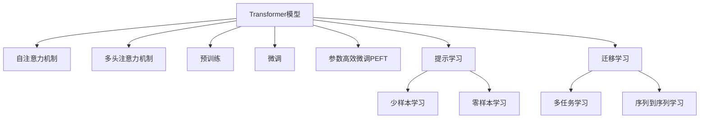

                 

## 1. 背景介绍

### 1.1 问题由来

近年来，随着深度学习技术的快速发展，自然语言处理(NLP)领域取得了显著的进展。其中，基于Transformer的预训练语言模型（如BERT、GPT-3等）在自然语言理解、生成、分类等任务上取得了令人瞩目的成果。这些模型的核心思想是通过大规模无标签文本数据进行自监督预训练，学习到通用且强大的语言表示，然后再通过微调任务相关的数据，将模型迁移到特定任务上，从而实现高性能。

Transformer模型之所以能够在NLP领域取得成功，主要是因为其自注意力机制，可以高效捕捉文本序列中长距离依赖关系。这种机制在文本分类、命名实体识别、机器翻译等任务中表现出了显著的优势。

然而，Transformer模型本身非常复杂，包含了数亿个参数，且训练和推理时间较长，这对资源的消耗巨大。为了更好地理解和应用Transformer模型，我们需要深入其原理和实现细节，进行实战操作。

### 1.2 问题核心关键点

Transformer模型的核心在于其自注意力机制，该机制通过计算词向量间的相似度，使得模型能够捕捉到长距离依赖关系。同时，Transformer模型在预训练和微调过程中，可以通过动态调整注意力权重，来适应不同的任务需求。其基本流程包括：

1. 预训练阶段：在大规模无标签文本数据上进行自监督预训练，学习通用语言表示。
2. 微调阶段：通过少量标注数据进行有监督微调，适配特定任务需求。

### 1.3 问题研究意义

Transformer模型的研究和应用，对自然语言处理领域的自动化和智能化具有重要意义：

1. 自动化：通过大规模预训练和微调，可以实现自动化的文本理解、生成、分类等任务，大大降低了人工干预的必要性。
2. 智能化：Transformer模型具备强大的学习能力，能够从海量的文本数据中学习到复杂的语言规律，从而提升模型的智能化水平。
3. 低成本：相比于从头训练模型，预训练模型可以大幅降低训练成本和时间，加速模型开发进程。
4. 可扩展性：Transformer模型通过微调，可以在不同的任务上灵活应用，具备良好的可扩展性。

## 2. 核心概念与联系

### 2.1 核心概念概述

为了更好地理解Transformer模型，我们需要首先掌握其核心概念，包括：

- **Transformer模型**：基于自注意力机制的深度学习模型，由多头注意力机制和全连接神经网络组成。
- **自注意力机制**：Transformer的核心组件，通过计算输入序列中各词向量间的相似度，动态生成注意力权重，捕捉长距离依赖关系。
- **多头注意力机制**：Transformer的改进版本，通过并行计算多个头的注意力权重，提升模型的泛化能力和表达能力。
- **预训练**：在大规模无标签文本数据上进行自监督学习，学习通用语言表示。
- **微调**：通过少量标注数据进行有监督学习，将预训练模型适配到特定任务上。
- **参数高效微调**：微调过程中只更新部分模型参数，以减少计算资源消耗。
- **提示学习**：通过精心设计的提示模板，引导模型进行特定任务的推理和生成。
- **少样本学习**：在只有少量样本的情况下，模型能够快速适应新任务的学习能力。
- **零样本学习**：模型在没有见过任何特定任务的情况下，仅凭任务描述就能够执行新任务的能力。

这些概念之间的逻辑关系可以通过以下Mermaid流程图来展示：



这个流程图展示了Transformer模型的核心概念及其之间的联系。

## 3. 核心算法原理 & 具体操作步骤

### 3.1 算法原理概述

Transformer模型基于自注意力机制，可以高效地捕捉输入序列中各词向量之间的依赖关系。其核心原理包括以下几个步骤：

1. 编码器（Encoder）：将输入序列中的词向量转换为上下文表示，即每个词向量都可以获取到上下文信息。
2. 解码器（Decoder）：通过注意力机制，解码器可以根据上下文信息，生成目标序列中的词向量。
3. 输出层：将解码器生成的词向量映射到目标语言或任务相关的输出格式上。

Transformer模型的自注意力机制通过计算词向量之间的相似度，动态生成注意力权重，捕捉长距离依赖关系。这种机制在文本分类、命名实体识别、机器翻译等任务中表现出了显著的优势。

### 3.2 算法步骤详解

Transformer模型的实现包括以下几个关键步骤：

1. **编码器模块**：由多个编码层组成，每个编码层包括多头注意力机制和全连接神经网络。多头注意力机制通过计算输入序列中各词向量间的相似度，生成注意力权重，捕捉长距离依赖关系。全连接神经网络用于线性变换，提升模型的表达能力。
2. **解码器模块**：与编码器类似，由多个解码层组成，每个解码层包括多头注意力机制和全连接神经网络。通过注意力机制，解码器可以根据上下文信息，生成目标序列中的词向量。
3. **注意力机制**：通过计算输入序列中各词向量间的相似度，动态生成注意力权重，捕捉长距离依赖关系。多头注意力机制通过并行计算多个头的注意力权重，提升模型的泛化能力和表达能力。
4. **位置编码**：由于Transformer模型不使用循环神经网络，需要引入位置编码，捕捉序列中的位置信息。
5. **初始化**：在模型的初始化阶段，通过预训练或微调，调整模型参数，使其适应特定任务。

### 3.3 算法优缺点

Transformer模型在自然语言处理领域具有显著的优点：

1. **高效性**：通过自注意力机制，Transformer模型可以高效地捕捉长距离依赖关系，适用于各种NLP任务。
2. **通用性**：Transformer模型通过预训练和微调，可以适应不同的任务需求，具备良好的可扩展性。
3. **参数效率**：通过参数高效微调技术，Transformer模型可以在固定大部分预训练参数的情况下，只更新少量的任务相关参数，节省计算资源。
4. **鲁棒性**：Transformer模型通过多头注意力机制，具备较强的泛化能力和鲁棒性。

同时，Transformer模型也存在一些局限性：

1. **计算资源消耗大**：Transformer模型参数众多，训练和推理时间较长，对计算资源要求较高。
2. **训练时间较长**：Transformer模型需要进行大规模的预训练和微调，训练时间较长。
3. **对抗攻击敏感**：由于Transformer模型的自注意力机制，其对抗攻击性能较弱，容易被对抗样本攻击。

### 3.4 算法应用领域

Transformer模型已经在自然语言处理领域得到了广泛应用，覆盖了几乎所有常见的NLP任务，例如：

- 文本分类：如情感分析、主题分类、意图识别等。通过微调使模型学习文本-标签映射。
- 命名实体识别：识别文本中的人名、地名、机构名等特定实体。通过微调使模型掌握实体边界和类型。
- 关系抽取：从文本中抽取实体之间的语义关系。通过微调使模型学习实体-关系三元组。
- 问答系统：对自然语言问题给出答案。将问题-答案对作为微调数据，训练模型学习匹配答案。
- 机器翻译：将源语言文本翻译成目标语言。通过微调使模型学习语言-语言映射。
- 文本摘要：将长文本压缩成简短摘要。将文章-摘要对作为微调数据，使模型学习抓取要点。
- 对话系统：使机器能够与人自然对话。将多轮对话历史作为上下文，微调模型进行回复生成。

除了上述这些经典任务外，Transformer模型也被创新性地应用到更多场景中，如可控文本生成、常识推理、代码生成、数据增强等，为NLP技术带来了全新的突破。

## 4. 数学模型和公式 & 详细讲解 & 举例说明

### 4.1 数学模型构建

Transformer模型的数学模型可以表示为：

$$
\begin{aligned}
&\text{Enc}(x)=\text{MultiHeadAttention}(\text{Enc}_{L}(x))+\text{LayerNorm}(\text{Enc}_{L}(x)) \\
&\text{Dec}(y)=\text{MultiHeadAttention}(\text{Dec}_{L}(y), \text{Enc}(x))+\text{LayerNorm}(\text{Dec}_{L}(y)) \\
&y=f(\text{Softmax}(\text{Dec}(y)))
\end{aligned}
$$

其中，$x$ 和 $y$ 分别为输入序列和输出序列，$Enc$ 和 $Dec$ 分别为编码器和解码器，$MultiHeadAttention$ 为多头注意力机制，$LayerNorm$ 为层归一化，$f$ 为输出层。

### 4.2 公式推导过程

Transformer模型的关键组成部分是自注意力机制。我们以多头注意力机制为例，进行详细推导：

设输入序列为 $X=[x_1, x_2, ..., x_n]$，输出序列为 $Y=[y_1, y_2, ..., y_m]$，多头注意力机制的数学表达式为：

$$
\text{MultiHeadAttention}(Q, K, V)=\text{Concat}([\text{AttentionHead}(QK)^T(QK)^T(QK)^T, ..., \text{AttentionHead}(QK)^T(QK)^T(QK)^T])W^O
$$

其中，$Q$ 和 $K$ 为查询和键矩阵，$V$ 为值矩阵，$W^O$ 为输出权重矩阵，$\text{Concat}$ 为拼接操作，$\text{AttentionHead}$ 为多头注意力头，$QK^T(QK)^T(QK)^T$ 为注意力权重矩阵。

$\text{AttentionHead}$ 的计算公式为：

$$
\text{AttentionHead}(Q, K, V)=\text{Softmax}(\frac{QK^T}{\sqrt{d_k}})V
$$

其中，$d_k$ 为键向量的维度。

### 4.3 案例分析与讲解

以BERT模型为例，BERT模型的预训练任务主要包括两种：掩码语言模型（Masked Language Model, MLM）和下一句预测（Next Sentence Prediction, NSP）。掩码语言模型通过随机遮盖输入序列中的某些词，要求模型预测被遮盖的词，从而学习到单词的上下文表示。下一句预测任务通过随机连接两句话，要求模型判断这两句话是否为相邻的两句话，从而学习到句子间的语义关系。

BERT模型的微调任务主要包括文本分类、命名实体识别、关系抽取、问答系统等。以文本分类任务为例，微调过程将模型输出层改为分类器，并使用交叉熵损失函数进行训练，使得模型能够根据输入文本自动分类到相应的类别。

## 5. 项目实践：代码实例和详细解释说明

### 5.1 开发环境搭建

在进行Transformer模型实战之前，我们需要准备好开发环境。以下是使用Python进行PyTorch开发的环境配置流程：

1. 安装Anaconda：从官网下载并安装Anaconda，用于创建独立的Python环境。

2. 创建并激活虚拟环境：
```bash
conda create -n pytorch-env python=3.8 
conda activate pytorch-env
```

3. 安装PyTorch：根据CUDA版本，从官网获取对应的安装命令。例如：
```bash
conda install pytorch torchvision torchaudio cudatoolkit=11.1 -c pytorch -c conda-forge
```

4. 安装Transformers库：
```bash
pip install transformers
```

5. 安装各类工具包：
```bash
pip install numpy pandas scikit-learn matplotlib tqdm jupyter notebook ipython
```

完成上述步骤后，即可在`pytorch-env`环境中开始Transformer模型的实战。

### 5.2 源代码详细实现

下面我以情感分析任务为例，给出使用Transformers库对BERT模型进行微调的PyTorch代码实现。

首先，定义情感分析任务的数据处理函数：

```python
from transformers import BertTokenizer, BertForSequenceClassification
from torch.utils.data import Dataset
import torch

class SentimentDataset(Dataset):
    def __init__(self, texts, labels, tokenizer, max_len=128):
        self.texts = texts
        self.labels = labels
        self.tokenizer = tokenizer
        self.max_len = max_len
        
    def __len__(self):
        return len(self.texts)
    
    def __getitem__(self, item):
        text = self.texts[item]
        label = self.labels[item]
        
        encoding = self.tokenizer(text, return_tensors='pt', max_length=self.max_len, padding='max_length', truncation=True)
        input_ids = encoding['input_ids'][0]
        attention_mask = encoding['attention_mask'][0]
        
        # 将标签转换为Tensor
        label = torch.tensor(label, dtype=torch.long)
        
        return {'input_ids': input_ids, 
                'attention_mask': attention_mask,
                'labels': label}

# 加载预训练模型和分词器
model = BertForSequenceClassification.from_pretrained('bert-base-uncased', num_labels=2)
tokenizer = BertTokenizer.from_pretrained('bert-base-uncased')

# 创建dataset
train_dataset = SentimentDataset(train_texts, train_labels, tokenizer)
dev_dataset = SentimentDataset(dev_texts, dev_labels, tokenizer)
test_dataset = SentimentDataset(test_texts, test_labels, tokenizer)
```

然后，定义模型和优化器：

```python
from transformers import AdamW

optimizer = AdamW(model.parameters(), lr=2e-5)
```

接着，定义训练和评估函数：

```python
from torch.utils.data import DataLoader
from tqdm import tqdm
from sklearn.metrics import accuracy_score

device = torch.device('cuda') if torch.cuda.is_available() else torch.device('cpu')
model.to(device)

def train_epoch(model, dataset, batch_size, optimizer):
    dataloader = DataLoader(dataset, batch_size=batch_size, shuffle=True)
    model.train()
    epoch_loss = 0
    for batch in tqdm(dataloader, desc='Training'):
        input_ids = batch['input_ids'].to(device)
        attention_mask = batch['attention_mask'].to(device)
        labels = batch['labels'].to(device)
        model.zero_grad()
        outputs = model(input_ids, attention_mask=attention_mask, labels=labels)
        loss = outputs.loss
        epoch_loss += loss.item()
        loss.backward()
        optimizer.step()
    return epoch_loss / len(dataloader)

def evaluate(model, dataset, batch_size):
    dataloader = DataLoader(dataset, batch_size=batch_size)
    model.eval()
    preds, labels = [], []
    with torch.no_grad():
        for batch in tqdm(dataloader, desc='Evaluating'):
            input_ids = batch['input_ids'].to(device)
            attention_mask = batch['attention_mask'].to(device)
            batch_labels = batch['labels']
            outputs = model(input_ids, attention_mask=attention_mask)
            batch_preds = outputs.logits.argmax(dim=1).to('cpu').tolist()
            batch_labels = batch_labels.to('cpu').tolist()
            for pred, label in zip(batch_preds, batch_labels):
                preds.append(pred)
                labels.append(label)
                
    accuracy = accuracy_score(labels, preds)
    print(f"Accuracy: {accuracy:.2f}")
```

最后，启动训练流程并在测试集上评估：

```python
epochs = 5
batch_size = 16

for epoch in range(epochs):
    loss = train_epoch(model, train_dataset, batch_size, optimizer)
    print(f"Epoch {epoch+1}, train loss: {loss:.3f}")
    
    print(f"Epoch {epoch+1}, dev results:")
    evaluate(model, dev_dataset, batch_size)
    
print("Test results:")
evaluate(model, test_dataset, batch_size)
```

以上就是使用PyTorch对BERT进行情感分析任务微调的完整代码实现。可以看到，得益于Transformers库的强大封装，我们可以用相对简洁的代码完成BERT模型的加载和微调。

### 5.3 代码解读与分析

让我们再详细解读一下关键代码的实现细节：

**SentimentDataset类**：
- `__init__`方法：初始化文本、标签、分词器等关键组件。
- `__len__`方法：返回数据集的样本数量。
- `__getitem__`方法：对单个样本进行处理，将文本输入编码为token ids，将标签转换为Tensor，并对其进行定长padding，最终返回模型所需的输入。

**训练和评估函数**：
- 使用PyTorch的DataLoader对数据集进行批次化加载，供模型训练和推理使用。
- 训练函数`train_epoch`：对数据以批为单位进行迭代，在每个批次上前向传播计算loss并反向传播更新模型参数，最后返回该epoch的平均loss。
- 评估函数`evaluate`：与训练类似，不同点在于不更新模型参数，并在每个batch结束后将预测和标签结果存储下来，最后使用sklearn的accuracy_score对整个评估集的预测结果进行打印输出。

**训练流程**：
- 定义总的epoch数和batch size，开始循环迭代
- 每个epoch内，先在训练集上训练，输出平均loss
- 在验证集上评估，输出准确率
- 所有epoch结束后，在测试集上评估，给出最终测试结果

可以看到，PyTorch配合Transformers库使得BERT微调的代码实现变得简洁高效。开发者可以将更多精力放在数据处理、模型改进等高层逻辑上，而不必过多关注底层的实现细节。

当然，工业级的系统实现还需考虑更多因素，如模型的保存和部署、超参数的自动搜索、更灵活的任务适配层等。但核心的微调范式基本与此类似。

## 6. 实际应用场景

### 6.1 智能客服系统

基于Transformer模型的对话技术，可以广泛应用于智能客服系统的构建。传统客服往往需要配备大量人力，高峰期响应缓慢，且一致性和专业性难以保证。而使用微调后的对话模型，可以7x24小时不间断服务，快速响应客户咨询，用自然流畅的语言解答各类常见问题。

在技术实现上，可以收集企业内部的历史客服对话记录，将问题和最佳答复构建成监督数据，在此基础上对预训练对话模型进行微调。微调后的对话模型能够自动理解用户意图，匹配最合适的答案模板进行回复。对于客户提出的新问题，还可以接入检索系统实时搜索相关内容，动态组织生成回答。如此构建的智能客服系统，能大幅提升客户咨询体验和问题解决效率。

### 6.2 金融舆情监测

金融机构需要实时监测市场舆论动向，以便及时应对负面信息传播，规避金融风险。传统的人工监测方式成本高、效率低，难以应对网络时代海量信息爆发的挑战。基于Transformer模型的文本分类和情感分析技术，为金融舆情监测提供了新的解决方案。

具体而言，可以收集金融领域相关的新闻、报道、评论等文本数据，并对其进行主题标注和情感标注。在此基础上对预训练语言模型进行微调，使其能够自动判断文本属于何种主题，情感倾向是正面、中性还是负面。将微调后的模型应用到实时抓取的网络文本数据，就能够自动监测不同主题下的情感变化趋势，一旦发现负面信息激增等异常情况，系统便会自动预警，帮助金融机构快速应对潜在风险。

### 6.3 个性化推荐系统

当前的推荐系统往往只依赖用户的历史行为数据进行物品推荐，无法深入理解用户的真实兴趣偏好。基于Transformer模型的个性化推荐系统可以更好地挖掘用户行为背后的语义信息，从而提供更精准、多样的推荐内容。

在实践中，可以收集用户浏览、点击、评论、分享等行为数据，提取和用户交互的物品标题、描述、标签等文本内容。将文本内容作为模型输入，用户的后续行为（如是否点击、购买等）作为监督信号，在此基础上微调预训练语言模型。微调后的模型能够从文本内容中准确把握用户的兴趣点。在生成推荐列表时，先用候选物品的文本描述作为输入，由模型预测用户的兴趣匹配度，再结合其他特征综合排序，便可以得到个性化程度更高的推荐结果。

### 6.4 未来应用展望

随着Transformer模型的不断发展，其在自然语言处理领域的应用将更加广泛。未来，Transformer模型将会在更多的领域得到应用，为传统行业带来变革性影响：

1. 医疗领域：基于Transformer模型的医疗问答、病历分析、药物研发等应用将提升医疗服务的智能化水平，辅助医生诊疗，加速新药开发进程。
2. 教育领域：微调技术可应用于作业批改、学情分析、知识推荐等方面，因材施教，促进教育公平，提高教学质量。
3. 城市治理：微调模型可应用于城市事件监测、舆情分析、应急指挥等环节，提高城市管理的自动化和智能化水平，构建更安全、高效的未来城市。
4. 金融领域：基于Transformer模型的情感分析、舆情监测等应用，帮助金融机构及时应对市场波动，防范风险。
5. 法律领域：利用Transformer模型的文本分类、关系抽取等能力，辅助法官审判，提升法律文书处理的效率和质量。

Transformer模型在各个领域的应用前景广阔，未来必将带来更多创新和突破，为社会发展和人类进步贡献力量。

## 7. 工具和资源推荐

### 7.1 学习资源推荐

为了帮助开发者系统掌握Transformer模型的理论基础和实践技巧，这里推荐一些优质的学习资源：

1. 《Transformer from Scratch》系列博文：由大模型技术专家撰写，深入浅出地介绍了Transformer模型的原理和实现细节。

2. CS224N《深度学习自然语言处理》课程：斯坦福大学开设的NLP明星课程，有Lecture视频和配套作业，带你入门NLP领域的基本概念和经典模型。

3. 《Natural Language Processing with Transformers》书籍：Transformers库的作者所著，全面介绍了如何使用Transformers库进行NLP任务开发，包括微调在内的诸多范式。

4. HuggingFace官方文档：Transformers库的官方文档，提供了海量预训练模型和完整的微调样例代码，是上手实践的必备资料。

5. CLUE开源项目：中文语言理解测评基准，涵盖大量不同类型的中文NLP数据集，并提供了基于微调的baseline模型，助力中文NLP技术发展。

通过对这些资源的学习实践，相信你一定能够快速掌握Transformer模型的精髓，并用于解决实际的NLP问题。

### 7.2 开发工具推荐

高效的开发离不开优秀的工具支持。以下是几款用于Transformer模型微调开发的常用工具：

1. PyTorch：基于Python的开源深度学习框架，灵活动态的计算图，适合快速迭代研究。大部分预训练语言模型都有PyTorch版本的实现。

2. TensorFlow：由Google主导开发的开源深度学习框架，生产部署方便，适合大规模工程应用。同样有丰富的预训练语言模型资源。

3. Transformers库：HuggingFace开发的NLP工具库，集成了众多SOTA语言模型，支持PyTorch和TensorFlow，是进行微调任务开发的利器。

4. Weights & Biases：模型训练的实验跟踪工具，可以记录和可视化模型训练过程中的各项指标，方便对比和调优。与主流深度学习框架无缝集成。

5. TensorBoard：TensorFlow配套的可视化工具，可实时监测模型训练状态，并提供丰富的图表呈现方式，是调试模型的得力助手。

6. Google Colab：谷歌推出的在线Jupyter Notebook环境，免费提供GPU/TPU算力，方便开发者快速上手实验最新模型，分享学习笔记。

合理利用这些工具，可以显著提升Transformer模型微调的开发效率，加快创新迭代的步伐。

### 7.3 相关论文推荐

Transformer模型的研究和应用源于学界的持续研究。以下是几篇奠基性的相关论文，推荐阅读：

1. Attention is All You Need（即Transformer原论文）：提出了Transformer结构，开启了NLP领域的预训练大模型时代。

2. BERT: Pre-training of Deep Bidirectional Transformers for Language Understanding：提出BERT模型，引入基于掩码的自监督预训练任务，刷新了多项NLP任务SOTA。

3. Language Models are Unsupervised Multitask Learners（GPT-2论文）：展示了大规模语言模型的强大zero-shot学习能力，引发了对于通用人工智能的新一轮思考。

4. Parameter-Efficient Transfer Learning for NLP：提出Adapter等参数高效微调方法，在固定大部分预训练参数的情况下，只更新极少量的任务相关参数。

5. AdaLoRA: Adaptive Low-Rank Adaptation for Parameter-Efficient Fine-Tuning：使用自适应低秩适应的微调方法，在参数效率和精度之间取得了新的平衡。

这些论文代表了大模型微调技术的发展脉络。通过学习这些前沿成果，可以帮助研究者把握学科前进方向，激发更多的创新灵感。

## 8. 总结：未来发展趋势与挑战

### 8.1 总结

本文对Transformer模型的实现和应用进行了全面系统的介绍。首先阐述了Transformer模型的核心思想和实现细节，包括自注意力机制、多头注意力机制、预训练和微调等关键技术。其次，通过代码实例，展示了Transformer模型在情感分析任务上的微调过程，帮助读者掌握实战技能。最后，本文还探讨了Transformer模型在多个领域的实际应用场景，展示了其强大的通用性和适应性。

通过本文的系统梳理，可以看到，Transformer模型通过自注意力机制，高效地捕捉了长距离依赖关系，成为自然语言处理领域的利器。Transformer模型的成功应用，带动了NLP技术的不断进步，为各行各业带来了颠覆性的变革。

### 8.2 未来发展趋势

展望未来，Transformer模型的发展将呈现以下几个趋势：

1. **模型规模持续增大**：随着算力成本的下降和数据规模的扩张，Transformer模型的参数量还将持续增长。超大规模Transformer模型蕴含的丰富语言知识，有望支撑更加复杂多变的NLP任务。
2. **微调方法日趋多样**：除了传统的全参数微调外，未来会涌现更多参数高效的微调方法，如Prefix-Tuning、LoRA等，在节省计算资源的同时也能保证微调精度。
3. **持续学习成为常态**：随着数据分布的不断变化，Transformer模型也需要持续学习新知识以保持性能。如何在不遗忘原有知识的同时，高效吸收新样本信息，将成为重要的研究课题。
4. **标注样本需求降低**：受启发于提示学习(Prompt-based Learning)的思路，未来的微调方法将更好地利用Transformer模型的语言理解能力，通过更加巧妙的任务描述，在更少的标注样本上也能实现理想的微调效果。
5. **多模态微调崛起**：当前的Transformer模型主要聚焦于纯文本数据，未来会进一步拓展到图像、视频、语音等多模态数据微调。多模态信息的融合，将显著提升语言模型对现实世界的理解和建模能力。
6. **知识整合能力增强**：现有的Transformer模型往往局限于任务内数据，难以灵活吸收和运用更广泛的先验知识。如何让Transformer模型更好地与外部知识库、规则库等专家知识结合，形成更加全面、准确的信息整合能力，还有很大的想象空间。

以上趋势凸显了Transformer模型微调技术的广阔前景。这些方向的探索发展，必将进一步提升NLP系统的性能和应用范围，为人类认知智能的进化带来深远影响。

### 8.3 面临的挑战

尽管Transformer模型微调技术已经取得了瞩目成就，但在迈向更加智能化、普适化应用的过程中，它仍面临着诸多挑战：

1. **标注成本瓶颈**：Transformer模型微调需要大量的标注数据，对于长尾应用场景，难以获得充足的高质量标注数据，成为制约微调性能的瓶颈。如何进一步降低微调对标注样本的依赖，将是一大难题。
2. **模型鲁棒性不足**：当前Transformer模型面对域外数据时，泛化性能往往大打折扣。对于测试样本的微小扰动，Transformer模型的预测也容易发生波动。如何提高Transformer模型的鲁棒性，避免灾难性遗忘，还需要更多理论和实践的积累。
3. **推理效率有待提高**：大规模Transformer模型虽然精度高，但在实际部署时往往面临推理速度慢、内存占用大等效率问题。如何在保证性能的同时，简化模型结构，提升推理速度，优化资源占用，将是重要的优化方向。
4. **可解释性亟需加强**：当前Transformer模型更像是"黑盒"系统，难以解释其内部工作机制和决策逻辑。对于医疗、金融等高风险应用，算法的可解释性和可审计性尤为重要。如何赋予Transformer模型更强的可解释性，将是亟待攻克的难题。
5. **安全性有待保障**：预训练Transformer模型难免会学习到有偏见、有害的信息，通过微调传递到下游任务，产生误导性、歧视性的输出，给实际应用带来安全隐患。如何从数据和算法层面消除模型偏见，避免恶意用途，确保输出的安全性，也将是重要的研究课题。

### 8.4 研究展望

面对Transformer模型微调所面临的种种挑战，未来的研究需要在以下几个方面寻求新的突破：

1. **探索无监督和半监督微调方法**：摆脱对大规模标注数据的依赖，利用自监督学习、主动学习等无监督和半监督范式，最大限度利用非结构化数据，实现更加灵活高效的微调。
2. **研究参数高效和计算高效的微调范式**：开发更加参数高效的微调方法，在固定大部分预训练参数的情况下，只更新极少量的任务相关参数。同时优化微调模型的计算图，减少前向传播和反向传播的资源消耗，实现更加轻量级、实时性的部署。
3. **融合因果和对比学习范式**：通过引入因果推断和对比学习思想，增强Transformer模型建立稳定因果关系的能力，学习更加普适、鲁棒的语言表征，从而提升模型泛化性和抗干扰能力。
4. **引入更多先验知识**：将符号化的先验知识，如知识图谱、逻辑规则等，与神经网络模型进行巧妙融合，引导Transformer模型进行特定任务的推理和生成。同时加强不同模态数据的整合，实现视觉、语音等多模态信息与文本信息的协同建模。
5. **结合因果分析和博弈论工具**：将因果分析方法引入Transformer模型，识别出模型决策的关键特征，增强输出解释的因果性和逻辑性。借助博弈论工具刻画人机交互过程，主动探索并规避模型的脆弱点，提高系统稳定性。
6. **纳入伦理道德约束**：在模型训练目标中引入伦理导向的评估指标，过滤和惩罚有偏见、有害的输出倾向。同时加强人工干预和审核，建立模型行为的监管机制，确保输出符合人类价值观和伦理道德。

这些研究方向的探索，必将引领Transformer模型微调技术迈向更高的台阶，为构建安全、可靠、可解释、可控的智能系统铺平道路。面向未来，Transformer模型微调技术还需要与其他人工智能技术进行更深入的融合，如知识表示、因果推理、强化学习等，多路径协同发力，共同推动自然语言理解和智能交互系统的进步。只有勇于创新、敢于突破，才能不断拓展语言模型的边界，让智能技术更好地造福人类社会。

## 9. 附录：常见问题与解答

**Q1：Transformer模型是否适用于所有NLP任务？**

A: Transformer模型在大多数NLP任务上都能取得不错的效果，特别是对于数据量较小的任务。但对于一些特定领域的任务，如医学、法律等，仅仅依靠通用语料预训练的模型可能难以很好地适应。此时需要在特定领域语料上进一步预训练，再进行微调，才能获得理想效果。此外，对于一些需要时效性、个性化很强的任务，如对话、推荐等，Transformer模型也需要针对性的改进优化。

**Q2：Transformer模型的计算资源消耗大，如何解决？**

A: 大规模Transformer模型确实需要较大的计算资源。为了降低资源消耗，可以采用以下方法：
1. 参数高效微调：只更新部分模型参数，如Adapter、Prefix等，减少计算资源消耗。
2. 模型压缩：通过剪枝、量化等方法，减小模型尺寸，加快推理速度。
3. 模型并行：采用多卡并行或分布式训练，提高模型训练速度。

**Q3：Transformer模型的推理效率较低，如何解决？**

A: 推理效率是Transformer模型的一大挑战。为了提升推理效率，可以采用以下方法：
1. 模型压缩：通过剪枝、量化等方法，减小模型尺寸，加快推理速度。
2. 模型加速器：使用如Tensor Core、NVIDIA Turing架构等专用加速器，提高计算效率。
3. 推理优化：通过优化推理代码，减少计算开销，提高推理速度。

**Q4：Transformer模型的可解释性较差，如何解决？**

A: Transformer模型的可解释性确实较弱。为了提升可解释性，可以采用以下方法：
1. 特征可视化：通过特征可视化工具，展示模型对输入数据的关注点，帮助理解模型决策。
2. 注意力机制可视化：展示Transformer模型中各个注意头的注意力分布，帮助理解模型内部工作机制。
3. 可解释性模型：开发基于可解释性模型的Transformer模型，如使用决策树、规则等方法，增强模型的可解释性。

通过这些方法，可以逐步提升Transformer模型的可解释性，使其更好地应用于需要高可解释性的场景，如医疗、金融等领域。

