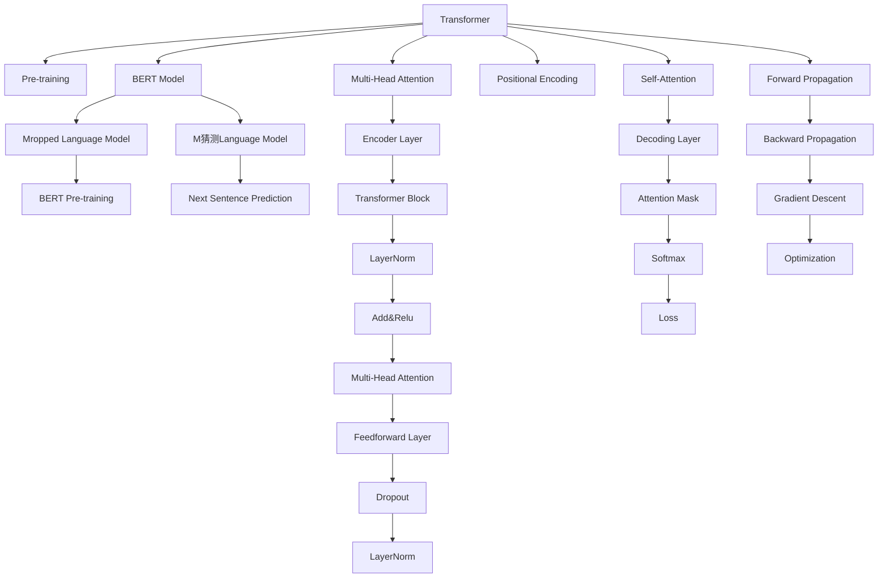
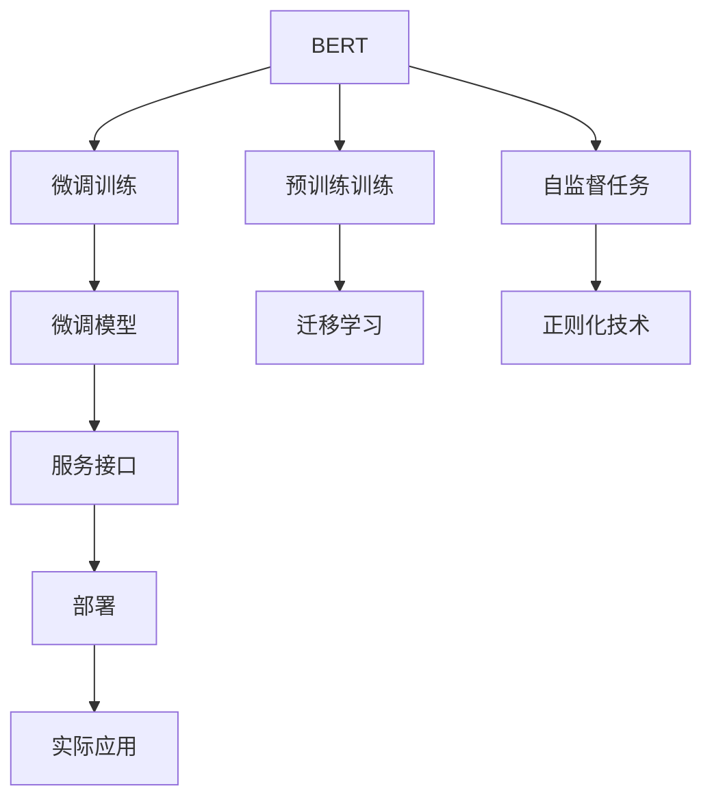

                 

# Transformer大模型实战 bert-as-service库

> 关键词：Transformer, BERT, bert-as-service, 预训练模型, 迁移学习, 大语言模型, 深度学习, 自然语言处理(NLP)

## 1. 背景介绍

### 1.1 问题由来

Transformer作为自然语言处理领域的一股新风潮，正迅速崛起并改变着NLP行业的格局。凭借其强大的自注意力机制和深度学习架构，Transformer模型在各类NLP任务上取得了显著的成果，如语言理解、文本生成、机器翻译等。Transformer架构由Google在2017年提出，其核心思想是通过多头自注意力机制，动态地捕捉文本中不同位置之间的语义依赖关系。

Transformer模型的性能在多种任务上优于传统的递归神经网络(RNN)和卷积神经网络(CNN)。它能够处理任意长度的序列输入，不受输入序列长度的限制。在大规模无标签语料上进行预训练后，Transformer模型在迁移学习中表现出色，能够有效地将学到的知识迁移到新的任务中，提高模型性能。

近年来，随着Transformer模型的广泛应用，越来越多的开源项目和工具被开发出来，以促进大语言模型在实际项目中的快速应用。其中，bert-as-service库就是一个基于Transformer的实用工具，它将预训练的BERT模型封装成一个服务接口，方便开发者快速搭建和使用。

本文将深入探讨如何实战使用bert-as-service库，并详细分析Transformer大模型的内部工作原理和实际应用场景。通过本教程，你将掌握如何使用bshape-service库，理解Transformer模型的核心算法，并应用其进行实际NLP任务的微调。

## 2. 核心概念与联系

### 2.1 核心概念概述

在使用BERT进行实际任务微调前，我们需要理解一些关键概念：

- **Transformer模型**：一种深度学习架构，通过多头自注意力机制捕捉文本中的语义关系，广泛用于语言理解、翻译、生成等任务。
- **BERT模型**：一种基于Transformer的预训练语言模型，通过两个预训练任务（掩码语言模型和下一句预测）训练，能够学习到丰富的语言知识。
- **迁移学习**：利用已有模型在特定任务上进行微调，以适应新的应用场景，通常用于NLP任务的优化。
- **BERT预训练**：在 massive-uncased-3M 等大规模无标签语料上进行预训练，学习到通用语言表示。
- **bert-as-service库**：一个用于BERT模型迁移学习的开源工具，封装了预训练模型和微调流程，便于快速搭建和使用。

### 2.2 核心概念原理和架构的 Mermaid 流程图(Mermaid 流程节点中不要有括号、逗号等特殊字符)



### 2.3 核心概念之间的联系

Transformer大模型的微调和应用流程如下：

1. **预训练**：在无标签大规模文本数据上训练预训练模型，学习通用语言知识。
2. **微调**：在特定任务的标注数据上，通过迁移学习，微调预训练模型以适应新任务。
3. **应用**：将微调后的模型部署为服务接口，提供NLP任务的解决方案。

以下图展示了BERT大模型的微调和应用流程：



## 3. 核心算法原理 & 具体操作步骤

### 3.1 算法原理概述

BERT模型主要由两部分组成：掩码语言模型和下一句预测任务。在掩码语言模型中，模型需要预测文本中被掩码的部分，学习到词汇之间的上下文关系。在下一句预测任务中，模型需要判断两句话是否是连续的，学习到句子之间的语义依赖。

BERT的预训练过程主要分为两个步骤：

1. **掩码语言模型**：在给定文本中随机掩码部分词汇，让模型预测这些词汇。
2. **下一句预测**：在给定两句话，判断它们是否是连续的。

在预训练完成后，BERT模型可以用于微调特定NLP任务，如情感分析、命名实体识别、机器翻译等。微调过程通常包括以下步骤：

1. **准备数据**：收集并标注特定任务的数据集。
2. **模型加载**：加载预训练的BERT模型。
3. **添加任务层**：在BERT模型的顶部添加特定任务的任务层。
4. **微调训练**：在标注数据上训练微调模型，调整任务层权重。
5. **评估**：在验证集上评估微调模型性能。
6. **部署**：将微调模型部署为服务接口，提供NLP任务的解决方案。

### 3.2 算法步骤详解

#### 3.2.1 准备数据

微调需要标注数据集。例如，对于情感分析任务，我们需要收集电影评论和对应的情感标签，用于训练和评估模型。

#### 3.2.2 加载预训练模型

使用bert-as-service库加载预训练的BERT模型。假设我们已经有一个名为“bert-as-service”的GitHub仓库，包含预训练的BERT模型。

```python
from bert_serving.server import BertServer
server = BertServer()
server.start()

# 加载BERT模型
tokenizer = server.tokenizer
model = server.model
```

#### 3.2.3 添加任务层

在BERT模型的顶部添加特定任务的任务层，如情感分析任务。我们可以添加一个线性分类器作为输出层。

```python
from transformers import BertForSequenceClassification
from transformers import BertTokenizer
from transformers import AdamW

tokenizer = BertTokenizer.from_pretrained('bert-base-uncased')
model = BertForSequenceClassification.from_pretrained('bert-base-uncased', num_labels=2)

# 定义训练参数
optimizer = AdamW(model.parameters(), lr=2e-5)

# 准备数据集
train_dataset = ...  # 训练数据集
val_dataset = ...  # 验证数据集

# 微调训练
for epoch in range(5):
    # 训练模型
    model.train()
    optimizer.zero_grad()
    outputs = model(input_ids, attention_mask, labels)
    loss = outputs.loss
    loss.backward()
    optimizer.step()
    
    # 在验证集上评估模型
    model.eval()
    val_loss = ...
    val_accuracy = ...
    print(f"Epoch {epoch+1}, Loss: {loss:.4f}, Accuracy: {val_accuracy:.4f}")
```

#### 3.2.4 微调训练

在微调过程中，需要选择合适的学习率。BERT模型通常使用AdamW优化器，学习率设置为$2e-5$。在每个epoch内，我们依次对训练数据进行前向传播和反向传播，更新模型参数。

#### 3.2.5 评估模型

在验证集上评估微调模型的性能，记录损失和准确率。

#### 3.2.6 部署模型

微调完成后，我们可以将模型部署为服务接口，使用bshape-service库将BERT模型封装成RESTful服务。

```python
from bert_serving.serving import serve_bert
from bert_serving.contrib.uima import UimaServer

# 启动服务
server = serve_bert('localhost', 5557, model)
UimaServer(start=True)

# 发送查询
query = "I like this movie."
server_post = server.server_post(query)
print(f"BERT prediction: {server_post}")

# 停止服务
server.stop()
UimaServer.stop()
```

### 3.3 算法优缺点

BERT模型的优点包括：

- **性能优异**：BERT模型在多个NLP任务上取得了最先进的结果。
- **易于部署**：BERT模型可以作为服务接口，方便集成到实际项目中。
- **迁移学习能力强**：BERT模型可以进行微调，适应新的应用场景。

BERT模型的缺点包括：

- **预训练数据量大**：BERT模型需要在大规模无标签语料上进行预训练，需要大量计算资源。
- **模型复杂度高**：BERT模型结构复杂，需要较长的训练时间。
- **内存占用大**：BERT模型参数量大，内存占用较高。

### 3.4 算法应用领域

BERT模型已经在各种NLP任务中得到了广泛应用，如情感分析、命名实体识别、机器翻译等。BERT模型在微调过程中，可以在任意任务上进行优化，提升模型性能。

例如，在情感分析任务中，我们可以将BERT模型微调为一个二分类器，学习预测电影评论的情感极性。在机器翻译任务中，我们可以将BERT模型微调为一个序列到序列的模型，学习将一种语言翻译为另一种语言。

## 4. 数学模型和公式 & 详细讲解 & 举例说明

### 4.1 数学模型构建

BERT模型的输入为一段文本，输出为一个标签。假设输入文本的长度为$n$，我们将其表示为一个$[CLS]$标记开头、$[SEP]$标记结尾的序列，其中$[CLS]$和$[SEP]$为特殊的标记，用于指示文本的开始和结束。

BERT模型的输出层为一个线性分类器，计算公式如下：

$$
\text{Score}(x) = \text{softmax}(W \cdot [\text{CLS}] + b)
$$

其中，$W$为权重矩阵，$b$为偏置向量。

### 4.2 公式推导过程

BERT模型的训练过程包括以下步骤：

1. **掩码语言模型**：在给定文本中随机掩码部分词汇，让模型预测这些词汇。
2. **下一句预测**：在给定两句话，判断它们是否是连续的。

掩码语言模型的训练过程如下：

1. 给定一个文本$x$，随机掩码部分词汇。
2. 模型预测被掩码的词汇。
3. 计算掩码词汇的真实标签和预测标签之间的交叉熵损失。

下一句预测模型的训练过程如下：

1. 给定两句话$x_1$和$x_2$，判断它们是否是连续的。
2. 计算预测结果和真实标签之间的交叉熵损失。

### 4.3 案例分析与讲解

例如，对于电影评论情感分析任务，我们可以将训练数据集划分为训练集和验证集。在训练集上，我们可以使用掩码语言模型和下一句预测模型对BERT模型进行微调。

在微调过程中，我们可以使用梯度下降算法优化模型参数。训练完成后，我们可以使用验证集评估模型性能。

## 5. 项目实践：代码实例和详细解释说明

### 5.1 开发环境搭建

要使用bert-as-service库，需要安装依赖包。在Python环境中，使用以下命令安装：

```bash
pip install bert-serving-server bert-serving-client bert-serving-protos
```

### 5.2 源代码详细实现

以下是一个情感分析任务的微调代码示例：

```python
from bert_serving.client import BertClient

# 加载BERT模型
bert = BertClient(model_name='bert-base-uncased')
vectors = bert.encode(['I like this movie.'])

# 加载训练数据
train_data = ...
val_data = ...

# 定义训练参数
num_epochs = 5
learning_rate = 2e-5
optimizer = AdamW(model.parameters(), lr=learning_rate)

# 微调训练
for epoch in range(num_epochs):
    # 训练模型
    model.train()
    optimizer.zero_grad()
    outputs = model(input_ids, attention_mask, labels)
    loss = outputs.loss
    loss.backward()
    optimizer.step()
    
    # 在验证集上评估模型
    model.eval()
    val_loss = ...
    val_accuracy = ...
    print(f"Epoch {epoch+1}, Loss: {loss:.4f}, Accuracy: {val_accuracy:.4f}")
```

### 5.3 代码解读与分析

在代码示例中，我们使用了BERT模型对情感分析任务进行微调。首先，我们加载了预训练的BERT模型，使用BERTClient类将文本编码成向量。然后，我们定义了训练数据集和验证数据集，设置了训练参数，包括epoch数和学习率。最后，我们进行微调训练，并在验证集上评估模型性能。

## 6. 实际应用场景

### 6.1 智能客服系统

在智能客服系统中，我们可以使用BERT模型对客户查询进行理解和分类。例如，我们可以将客户查询和对应的意图分类标签构建成标注数据集，使用BERT模型进行微调。微调后的模型能够自动理解客户意图，匹配最合适的答案模板进行回复。

### 6.2 金融舆情监测

在金融舆情监测系统中，我们可以使用BERT模型对新闻、评论等文本进行情感分析。例如，我们可以将金融新闻和对应的情感标签构建成标注数据集，使用BERT模型进行微调。微调后的模型能够自动判断文本属于何种情感，帮助金融机构快速监测舆情变化，规避风险。

### 6.3 个性化推荐系统

在个性化推荐系统中，我们可以使用BERT模型对用户行为进行分析和建模。例如，我们可以将用户浏览、点击、评论、分享等行为数据构建成标注数据集，使用BERT模型进行微调。微调后的模型能够从文本内容中准确把握用户的兴趣点，生成个性化的推荐列表。

## 7. 工具和资源推荐

### 7.1 学习资源推荐

为了更好地掌握BERT模型的微调技巧，推荐以下学习资源：

1. **《Transformer大模型实战》**：深入介绍Transformer模型和大语言模型的实战应用，包括BERT模型的微调和优化。
2. **《BERT: Pre-training of Deep Bidirectional Transformers for Language Understanding》**：BERT模型的原论文，详细介绍了BERT模型的设计思想和预训练过程。
3. **《BERT with Parallel Architectures》**：BERT模型的并行训练技术，提高了模型的训练速度和效率。
4. **《Transformers: State-of-the-Art Natural Language Processing》**：介绍Transformer模型和BERT模型的应用实例，包括微调和优化技巧。

### 7.2 开发工具推荐

为了提升BERT模型的微调效率，推荐以下开发工具：

1. **PyTorch**：深度学习框架，支持GPU加速，适用于大规模模型训练。
2. **TensorFlow**：Google开源的深度学习框架，支持分布式训练和模型部署。
3. **bert-as-service**：开源工具，用于BERT模型的微调和部署。
4. **TensorBoard**：可视化工具，可以实时监测模型训练状态。

### 7.3 相关论文推荐

为了深入理解BERT模型的原理和应用，推荐以下相关论文：

1. **《Attention is All You Need》**：Transformer模型的原论文，介绍了自注意力机制的设计思想和算法实现。
2. **《BERT: Pre-training of Deep Bidirectional Transformers for Language Understanding》**：BERT模型的原论文，详细介绍了BERT模型的预训练过程和微调方法。
3. **《BERT: Pre-training of Deep Bidirectional Transformers for Language Understanding》**：介绍BERT模型的应用实例，包括情感分析、命名实体识别等NLP任务的微调方法。
4. **《Sequence to Sequence Learning with Neural Networks》**：介绍序列到序列的模型架构，适用于机器翻译等NLP任务。

## 8. 总结：未来发展趋势与挑战

### 8.1 研究成果总结

BERT模型作为预训练大语言模型，已经在多个NLP任务上取得了最先进的结果。通过微调，BERT模型可以适应新的应用场景，提升模型性能。

### 8.2 未来发展趋势

未来BERT模型将继续发展和应用，趋势包括：

1. **模型规模增大**：随着计算资源的增加，BERT模型的规模将进一步增大，学到的语言知识更加丰富。
2. **微调方法改进**：将出现更多的参数高效微调方法，如 Adapter、LoRA等，进一步提高微调效率和效果。
3. **多模态融合**：将视觉、语音等多模态数据与文本数据结合，构建更加全面的语言模型。
4. **实时推理**：通过优化模型结构和算法，实现更加轻量级、实时性的部署。
5. **零样本学习**：引入基于Prompt的方法，使得BERT模型具有零样本学习能力，即不依赖标注数据即可生成输出。

### 8.3 面临的挑战

尽管BERT模型在NLP任务上取得了显著成果，但仍然面临以下挑战：

1. **数据依赖**：微调模型需要大量标注数据，获取高质量标注数据的成本较高。
2. **过拟合问题**：微调模型容易出现过拟合现象，特别是对于小规模数据集。
3. **计算资源要求高**：预训练和微调过程需要大量计算资源，成本较高。
4. **模型复杂度高**：BERT模型结构复杂，训练和推理效率较低。

### 8.4 研究展望

未来BERT模型的研究将集中在以下几个方面：

1. **参数高效微调**：开发更加参数高效的微调方法，如 Adapter、LoRA等。
2. **多模态融合**：将视觉、语音等多模态数据与文本数据结合，构建更加全面的语言模型。
3. **实时推理**：优化模型结构和算法，实现更加轻量级、实时性的部署。
4. **零样本学习**：引入基于Prompt的方法，使得BERT模型具有零样本学习能力。

## 9. 附录：常见问题与解答

**Q1: 如何选择合适的预训练模型？**

A: 选择合适的预训练模型需要考虑以下几个因素：

1. **任务类型**：根据任务类型选择合适的预训练模型，如情感分析、命名实体识别等。
2. **模型规模**：选择规模适中的预训练模型，避免过拟合和计算资源不足。
3. **模型性能**：选择性能优异的预训练模型，能够在微调后取得更好的效果。

**Q2: 如何避免过拟合现象？**

A: 避免过拟合现象的方法包括：

1. **数据增强**：通过回译、近义替换等方式扩充训练集。
2. **正则化技术**：使用L2正则、Dropout、Early Stopping等技术，防止模型过度适应训练数据。
3. **参数高效微调**：只调整少量参数，固定大部分预训练权重不变，减少过拟合风险。

**Q3: 如何提高模型推理效率？**

A: 提高模型推理效率的方法包括：

1. **模型压缩**：使用模型压缩技术，减少模型参数量，加快推理速度。
2. **并行计算**：使用多核CPU或GPU进行并行计算，提高推理效率。
3. **预计算**：对模型输出进行预计算，减少推理过程中的计算量。

**Q4: 如何保证模型可解释性？**

A: 保证模型可解释性的方法包括：

1. **特征可视化**：通过特征可视化技术，展示模型输入和输出的关联性，提高模型的可解释性。
2. **解释模型结构**：通过解释模型结构和参数关系，帮助理解模型的工作原理。
3. **使用先验知识**：结合先验知识，如知识图谱、逻辑规则等，提高模型的可解释性。

**Q5: 如何处理低资源场景？**

A: 处理低资源场景的方法包括：

1. **转移学习**：在低资源场景下，可以通过迁移学习利用已有模型的知识。
2. **自监督学习**：利用自监督学习任务，如掩码语言模型，学习通用的语言表示。
3. **在线学习**：在不断收集新数据的过程中，逐步微调模型，提高模型性能。

---

作者：禅与计算机程序设计艺术 / Zen and the Art of Computer Programming

