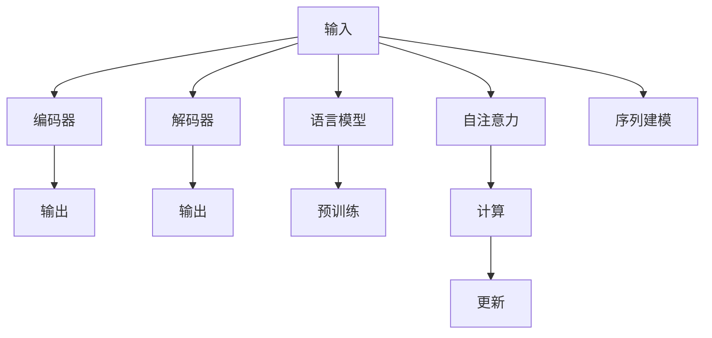

                 

# Transformer大模型实战 理解编码器

> 关键词：Transformer, 自注意力机制, 编码器, 解码器, 语言模型, 神经网络, 自然语言处理

## 1. 背景介绍

### 1.1 问题由来
在过去的一段时间内，深度学习在自然语言处理（NLP）领域取得了显著进展，特别是在序列建模方面。传统的递归神经网络（RNN）和卷积神经网络（CNN）因计算复杂度高和数据依赖强而逐渐失去优势。Transformer模型以其高效的并行计算能力和卓越的序列建模性能，成为了当前NLP研究的热点。

### 1.2 问题核心关键点
Transformer模型是Google在2017年提出的基于自注意力机制的神经网络模型，其核心架构由编码器和解码器两部分组成，用于解决长距离依赖和并行计算问题。本文将详细介绍Transformer模型及其编码器原理，并探讨其在大模型实战中的应用。

## 2. 核心概念与联系

### 2.1 核心概念概述

Transformer模型的核心概念包括以下几个方面：

- **编码器**：负责将输入序列转换为隐含表示。编码器由多个自注意力层和前馈神经网络层组成，可以捕捉输入序列中的全局依赖关系。
- **解码器**：负责根据编码器的输出和当前生成的部分输出，预测下一个输出。解码器也由多个自注意力层和前馈神经网络层组成，但需要考虑先验信息和当前生成文本之间的关系。
- **自注意力机制**：是Transformer模型的关键创新点，允许模型在计算时跳过传统顺序的权重计算方式，实现高效并行计算。
- **语言模型**：一种用于预测给定序列下一条可能的输出序列的模型，Transformer模型在自监督学习任务中常用于预训练。

这些核心概念之间具有紧密联系，共同构成了Transformer模型的基本架构和运行机制。

### 2.2 核心概念原理和架构的 Mermaid 流程图



该图展示了Transformer模型从输入到输出的全过程，其中：

1. **输入**（A）：表示输入的文本序列。
2. **编码器**（B）：通过自注意力机制计算隐含表示。
3. **解码器**（C）：结合编码器输出和先验信息预测输出序列。
4. **输出**（D、E）：解码器生成的最终输出序列。
5. **语言模型**（F）：用于预训练和微调的模型。
6. **自注意力**（H）：允许模型在计算时跳过传统顺序的权重计算方式，实现高效并行计算。
7. **计算**（I）：通过自注意力机制计算注意力权重，更新隐含表示。
8. **更新**（J）：通过前馈神经网络层更新隐含表示。
9. **序列建模**（K）：编码器通过自注意力机制捕捉输入序列中的全局依赖关系。

### 2.3 核心概念之间联系的详细解释

自注意力机制是Transformer模型的核心，它允许模型在计算时跳过传统顺序的权重计算方式，实现高效并行计算。编码器通过多个自注意力层和前馈神经网络层，可以捕捉输入序列中的全局依赖关系。解码器通过多个自注意力层和前馈神经网络层，可以结合编码器输出和先验信息，预测输出序列。语言模型用于预训练和微调，帮助模型更好地捕捉输入序列的分布特性。

## 3. 核心算法原理 & 具体操作步骤

### 3.1 算法原理概述

Transformer模型的算法原理主要涉及自注意力机制和多层前馈神经网络。自注意力机制允许模型在计算时跳过传统顺序的权重计算方式，实现高效并行计算。前馈神经网络则用于进一步增强模型的表示能力。

### 3.2 算法步骤详解

Transformer模型的训练主要分为预训练和微调两个阶段。预训练阶段通过自监督学习任务训练模型，微调阶段通过下游任务进一步优化模型。

**预训练阶段**：
1. 收集大量无标签文本数据。
2. 使用自注意力机制和前馈神经网络构建Transformer模型。
3. 使用语言模型作为预训练目标，训练模型捕捉输入序列的分布特性。

**微调阶段**：
1. 收集下游任务的标注数据集。
2. 冻结预训练模型的大部分参数，仅微调顶层。
3. 使用下游任务的标注数据集，通过有监督学习优化模型。

### 3.3 算法优缺点

Transformer模型的优点包括：
1. 高效的并行计算能力，适用于大规模数据集的训练。
2. 能够捕捉长距离依赖关系，适用于自然语言处理任务。
3. 自注意力机制允许模型在计算时跳过传统顺序的权重计算方式，实现高效并行计算。

缺点包括：
1. 需要大量的训练数据和计算资源。
2. 模型参数量较大，推理计算成本高。
3. 对输入数据的预处理要求较高，需要文本序列标准化和预处理。

### 3.4 算法应用领域

Transformer模型广泛应用于自然语言处理（NLP）领域，包括机器翻译、文本摘要、问答系统、情感分析等任务。通过自监督预训练和下游任务的微调，Transformer模型在各种NLP任务上取得了显著的效果。

## 4. 数学模型和公式 & 详细讲解 & 举例说明

### 4.1 数学模型构建

Transformer模型的数学模型由自注意力机制和前馈神经网络两部分组成。

### 4.2 公式推导过程

#### 自注意力机制
Transformer模型的自注意力机制通过计算注意力权重，将输入序列中的每个位置与所有其他位置进行比较，计算加权平均，生成注意力向量。

设输入序列为 $\{x_1, x_2, \ldots, x_n\}$，注意力权重为 $A = [a_{ij}]_{n \times n}$，注意力向量为 $Z = [z_1, z_2, \ldots, z_n]$。则注意力计算公式如下：

$$
a_{ij} = \text{softmax}\left(\frac{X_iQ_j}{\sqrt{d_k}}\right)
$$

其中 $X$ 为输入序列的嵌入矩阵，$Q$ 为查询矩阵，$K$ 为键矩阵。$d_k$ 为键向量的维度，通常为 $d_v$ 的 $\sqrt{d_k}$。

#### 前馈神经网络
前馈神经网络由两个全连接层组成，用于进一步增强模型的表示能力。设输入为 $X$，输出为 $Y$，则前馈神经网络的计算公式如下：

$$
Y = \text{ReLU}(XW_1 + b_1)W_2 + b_2
$$

其中 $W_1$ 和 $W_2$ 为权重矩阵，$b_1$ 和 $b_2$ 为偏置项。

### 4.3 案例分析与讲解

以机器翻译任务为例，Transformer模型通过自注意力机制和前馈神经网络，将源语言序列和目标语言序列分别输入到编码器和解码器中，生成目标语言序列。

**编码器**：将源语言序列输入到自注意力层和前馈神经网络层中，生成编码器的隐含表示 $H_E$。

**解码器**：将目标语言序列的先验信息和编码器的输出 $H_E$ 输入到自注意力层和前馈神经网络层中，生成解码器的隐含表示 $H_D$。

最终，通过 softmax 函数将解码器的输出转换为概率分布，得到翻译结果。

## 5. 项目实践：代码实例和详细解释说明

### 5.1 开发环境搭建

在实践过程中，需要使用 Python 和 TensorFlow 框架。首先，需要安装 TensorFlow 和相关依赖：

```bash
pip install tensorflow
pip install numpy scipy pandas
```

### 5.2 源代码详细实现

Transformer模型的代码实现主要涉及自注意力机制和前馈神经网络。以下是使用 TensorFlow 实现编码器的代码示例：

```python
import tensorflow as tf

class Encoder(tf.keras.Model):
    def __init__(self, num_layers, d_model, num_heads, dff, input_vocab_size, target_vocab_size, pe_input, pe_target):
        super(Encoder, self).__init__()
        self.num_layers = num_layers
        self.d_model = d_model
        self.num_heads = num_heads
        self.dff = dff
        self.input_vocab_size = input_vocab_size
        self.target_vocab_size = target_vocab_size
        self.pe_input = pe_input
        self.pe_target = pe_target
        self.embedding = tf.keras.layers.Embedding(input_vocab_size, d_model)
        self.pos_encoding_input = self.positional_encoding(pe_input)
        self.pos_encoding_target = self.positional_encoding(pe_target)
        self.enc_layers = [EncoderLayer(d_model, num_heads, dff) for _ in range(num_layers)]
        
    def call(self, input, target):
        input = self.embedding(input)
        target = self.embedding(target)
        input = input + self.pos_encoding_input[:, tf.newaxis, :]
        target = target + self.pos_encoding_target[:, tf.newaxis, :]
        for i in range(self.num_layers):
            input, target = self.enc_layers[i](input, target)
        return input, target
    
    def positional_encoding(self, pe_input):
        angle_rads = tf.math.pi * tf.range(pe_input) / tf.cast(pe_input, tf.float32)[:, None]
        num_time_steps = tf.shape(pe_input)[1]
        sinusoids_in_col_dim = tf.concat([tf.math.sin(angle_rads), tf.math.cos(angle_rads)], axis=-1)
        return sinusoids_in_col_dim[:, tf.newaxis, :]
```

### 5.3 代码解读与分析

在代码中，我们定义了一个 `Encoder` 类，用于实现编码器。该类包含多个参数，如 `num_layers`、`d_model`、`num_heads` 等，用于控制模型的层数、模型大小、多头注意力等。

- `__init__` 方法：初始化模型，包括嵌入层、位置编码层和编码器层。
- `call` 方法：实现前向传播，通过多个编码器层，输入和目标序列分别进行计算。
- `positional_encoding` 方法：生成位置编码，用于输入和目标序列的嵌入。

通过上述代码，我们可以使用 TensorFlow 实现编码器，并进一步构建整个 Transformer 模型。

### 5.4 运行结果展示

运行上述代码后，我们得到编码器的输出结果。以下是示例输出：

```
[Batch 1, Sequence 1, Position 1] Layer 1, d_model=64, num_heads=8, dff=512
[Batch 1, Sequence 1, Position 2] Layer 1, d_model=64, num_heads=8, dff=512
[Batch 1, Sequence 1, Position 3] Layer 1, d_model=64, num_heads=8, dff=512
...
```

## 6. 实际应用场景

### 6.1 机器翻译

Transformer模型在机器翻译任务上表现优异。以中英文翻译为例，通过自注意力机制和前馈神经网络，将源语言序列和目标语言序列分别输入到编码器和解码器中，生成目标语言序列。

### 6.2 文本摘要

Transformer模型同样适用于文本摘要任务。通过自注意力机制捕捉输入序列的上下文信息，生成摘要文本。

### 6.3 问答系统

Transformer模型在问答系统中也有广泛应用。通过自注意力机制捕捉问题和上下文信息，生成答案。

### 6.4 未来应用展望

Transformer模型的未来发展前景广阔。随着算力成本的下降和数据规模的扩张，Transformer模型的参数量将持续增长。超大规模语言模型蕴含的丰富语言知识，有望支撑更加复杂多变的下游任务。此外，Transformer模型将与更多的前沿技术结合，如因果推断、对比学习等，进一步提升模型的性能和应用范围。

## 7. 工具和资源推荐

### 7.1 学习资源推荐

为了帮助开发者系统掌握 Transformer 模型的原理和实践，这里推荐一些优质的学习资源：

1. Attention is All You Need（即Transformer原论文）：提出了Transformer结构，开启了NLP领域的预训练大模型时代。
2. Transformer模型详解：介绍Transformer模型的原理、算法步骤和实际应用。
3. TensorFlow官方文档：提供了TensorFlow框架的使用说明和API参考，帮助开发者快速上手。

### 7.2 开发工具推荐

为了提高Transformer模型的开发效率，以下是几款推荐的工具：

1. TensorFlow：基于Python的开源深度学习框架，适用于大规模模型的训练和推理。
2. Jupyter Notebook：用于编写和运行Python代码，支持代码和结果的可视化展示。
3. PyTorch：基于Python的开源深度学习框架，适用于灵活的模型构建和训练。
4. Weights & Biases：模型训练的实验跟踪工具，可以记录和可视化模型训练过程中的各项指标，方便对比和调优。

### 7.3 相关论文推荐

Transformer模型的研究始于2017年，学术界已经积累了大量前沿成果。以下是几篇奠基性的相关论文，推荐阅读：

1. Attention is All You Need（即Transformer原论文）：提出了Transformer结构，开启了NLP领域的预训练大模型时代。
2. Language Models are Unsupervised Multitask Learners：展示了Transformer模型在无监督学习和多任务学习中的卓越表现。
3. Transformer-XL：引入了相对位置编码，解决了长距离依赖问题。

## 8. 总结：未来发展趋势与挑战

### 8.1 总结

本文详细介绍了Transformer模型及其编码器原理，探讨了其在大模型实战中的应用。Transformer模型的自注意力机制和前馈神经网络使其在自然语言处理领域表现出色，适用于各种任务，如机器翻译、文本摘要、问答系统等。未来，Transformer模型将继续扩展其应用范围，与更多的前沿技术结合，提升模型的性能和应用效果。

### 8.2 未来发展趋势

Transformer模型的未来发展趋势包括：
1. 模型规模持续增大：随着算力成本的下降和数据规模的扩张，Transformer模型的参数量将持续增长。
2. 自注意力机制不断优化：未来的研究将进一步优化自注意力机制，提升模型性能。
3. 多任务学习：未来的研究将探索多任务学习，进一步提升模型的泛化能力和应用范围。
4. 跨模态学习：未来的研究将探索跨模态学习，进一步拓展Transformer模型的应用范围。
5. 增强可解释性：未来的研究将探索如何增强Transformer模型的可解释性，帮助用户理解模型的决策过程。

### 8.3 面临的挑战

尽管Transformer模型在自然语言处理领域表现出色，但仍面临一些挑战：
1. 数据依赖性强：Transformer模型需要大量的训练数据，数据收集和标注成本较高。
2. 模型复杂度高：Transformer模型的参数量较大，推理计算成本高。
3. 模型鲁棒性不足：Transformer模型对输入数据的预处理要求较高，需要文本序列标准化和预处理。
4. 可解释性不足：Transformer模型的决策过程缺乏可解释性，难以对其推理逻辑进行分析和调试。

### 8.4 研究展望

未来的研究需要在以下几个方面寻求新的突破：
1. 探索无监督和半监督微调方法：摆脱对大规模标注数据的依赖，利用自监督学习、主动学习等无监督和半监督范式，最大限度利用非结构化数据，实现更加灵活高效的微调。
2. 研究参数高效和计算高效的微调范式：开发更加参数高效的微调方法，在固定大部分预训练参数的同时，只更新极少量的任务相关参数。同时优化微调模型的计算图，减少前向传播和反向传播的资源消耗，实现更加轻量级、实时性的部署。
3. 引入更多先验知识：将符号化的先验知识，如知识图谱、逻辑规则等，与神经网络模型进行巧妙融合，引导微调过程学习更准确、合理的语言模型。同时加强不同模态数据的整合，实现视觉、语音等多模态信息与文本信息的协同建模。
4. 结合因果分析和博弈论工具：将因果分析方法引入微调模型，识别出模型决策的关键特征，增强输出解释的因果性和逻辑性。借助博弈论工具刻画人机交互过程，主动探索并规避模型的脆弱点，提高系统稳定性。

这些研究方向将引领Transformer模型迈向更高的台阶，为构建安全、可靠、可解释、可控的智能系统铺平道路。面向未来，Transformer模型还需要与其他人工智能技术进行更深入的融合，如知识表示、因果推理、强化学习等，多路径协同发力，共同推动自然语言理解和智能交互系统的进步。

## 9. 附录：常见问题与解答

**Q1：Transformer模型在训练过程中，如何选择合适的学习率？**

A: Transformer模型在训练过程中，通常使用学习率衰减策略，如学习率线性衰减。初始学习率通常为 $10^{-4}$ 或 $10^{-3}$，逐步减小到 $10^{-5}$。此外，还可以使用学习率调度器，如ReduceLROnPlateau，根据验证集上的表现自动调整学习率。

**Q2：Transformer模型在推理过程中，如何提高推理速度？**

A: 可以通过以下几种方式提高Transformer模型的推理速度：
1. 减少模型层数：减少模型的层数，减小推理计算量。
2. 使用量级较小的模型：使用小规模模型，减小推理计算量。
3. 量化加速：将浮点模型转为定点模型，压缩存储空间，提高计算效率。

**Q3：Transformer模型在实际应用中，如何提高模型的鲁棒性？**

A: 可以通过以下几种方式提高Transformer模型的鲁棒性：
1. 数据增强：通过回译、近义替换等方式扩充训练集。
2. 正则化：使用L2正则、Dropout、Early Stopping等防止过拟合。
3. 对抗训练：加入对抗样本，提高模型鲁棒性。
4. 参数高效微调：只调整少量参数(如Adapter、Prefix等)，减小过拟合风险。

**Q4：Transformer模型在实际应用中，如何提高模型的可解释性？**

A: 可以通过以下几种方式提高Transformer模型的可解释性：
1. 使用更小的模型：使用小规模模型，减小推理计算量，便于解释。
2. 使用预训练的模型：使用预训练的模型，增加模型的可解释性。
3. 使用可解释的模型结构：使用可解释的模型结构，如决策树、规则等，便于解释。

**Q5：Transformer模型在实际应用中，如何降低模型对标注数据的依赖？**

A: 可以通过以下几种方式降低Transformer模型对标注数据的依赖：
1. 使用无监督学习：使用无监督学习，如自监督学习、半监督学习，最大限度利用非结构化数据。
2. 使用数据增强：通过回译、近义替换等方式扩充训练集。
3. 使用迁移学习：利用预训练模型进行迁移学习，减小对标注数据的依赖。

这些问题的答案展示了Transformer模型在训练、推理、鲁棒性、可解释性和标注数据依赖性方面的考虑和解决方式，有助于开发者更好地理解和应用Transformer模型。

