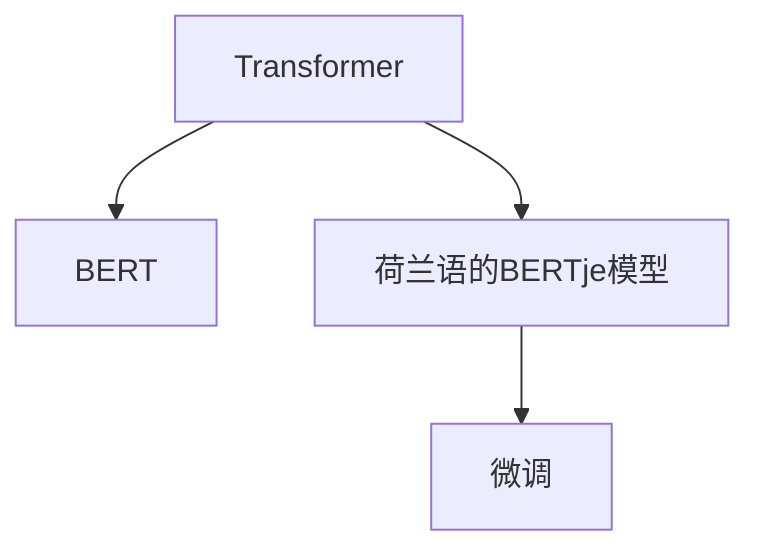
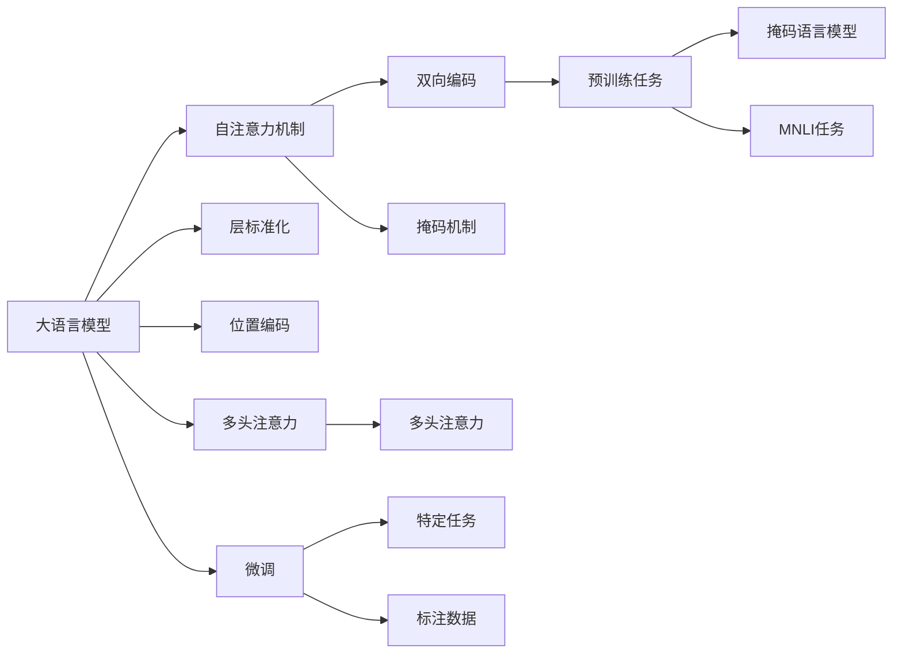

                 

# Transformer大模型实战 荷兰语的BERTje模型

> 关键词：大语言模型，BERT，自然语言处理，Transformer，荷兰语，微调，实践，代码实例

## 1. 背景介绍

### 1.1 问题由来
在当前人工智能和自然语言处理（NLP）领域，Transformer架构的大语言模型（如BERT、GPT等）已经成为了一种极具影响力的工具。然而，这些模型大多以英语为训练语言，对于其他语言，尤其是荷兰语等小语种的支持仍显不足。因此，如何在大模型中集成小语种语言，并针对性地进行微调，以提升其在特定任务上的性能，成为了研究者和开发者共同关注的问题。

### 1.2 问题核心关键点
- 语言模型的多样性需求：不同语言拥有不同的语言特性和语境，因此需要针对性地训练和使用语言模型。
- 小语种数据稀缺性：小语种数据资源相对较少，这为基于大规模数据训练的Transformer模型带来了挑战。
- 微调方法的有效性：如何在有限的标注数据和计算资源下，有效微调模型以适应特定语言和任务。

### 1.3 问题研究意义
荷兰语BERTje模型的开发和使用，不仅能够填补小语种语言模型领域的空白，还能在多个NLP应用中发挥重要作用，包括文本分类、命名实体识别、情感分析等。这对于促进NLP技术的全球化应用具有重要意义。

## 2. 核心概念与联系

### 2.1 核心概念概述

为深入理解荷兰语的BERTje模型，本节将介绍几个核心概念：

- **Transformer**：一种基于自注意力机制的深度学习模型架构，常用于处理序列数据，具有计算效率高、模型表达能力强等优点。
- **BERT (Bidirectional Encoder Representations from Transformers)**：一种基于Transformer的预训练语言模型，通过双向编码和掩码机制，学习到丰富的语言表示。
- **荷兰语的BERTje模型**：通过在荷兰语数据上微调的BERT模型，旨在提升其在荷兰语文本理解和生成任务上的表现。
- **微调**：在大规模预训练模型上，使用小规模标注数据进行有监督学习，以适应特定任务的过程。

这些核心概念之间的联系如下：



### 2.2 核心概念原理和架构的 Mermaid 流程图



这个流程图展示了从Transformer模型到荷兰语的BERTje模型的构建过程，包括自注意力机制、双向编码、掩码机制等关键组件，以及预训练任务和微调过程。

## 3. 核心算法原理 & 具体操作步骤
### 3.1 算法原理概述

荷兰语的BERTje模型基于大规模预训练的BERT模型，通过微调以适应荷兰语的特定语言特性。其核心算法原理如下：

1. **预训练**：在通用大规模语料上训练BERT模型，学习到通用的语言表示。
2. **微调**：在荷兰语数据集上，使用小规模标注数据进行有监督学习，微调模型以适应荷兰语的语法和语境。
3. **集成**：将微调后的荷兰语BERTje模型集成到各种NLP应用中，如文本分类、命名实体识别、情感分析等。

### 3.2 算法步骤详解

1. **数据准备**：
   - 收集荷兰语数据集，包括文本和对应的标注信息。
   - 对数据进行清洗和预处理，如分词、去除停用词、标注实体等。

2. **模型选择**：
   - 选择合适的预训练BERT模型，如bert-base-cased或bert-large-cased。
   - 下载对应的Vocabulary文件，用于将输入文本转换为模型可以理解的格式。

3. **微调步骤**：
   - 初始化微调环境，准备数据集和模型。
   - 加载预训练模型和Vocabulary文件。
   - 定义损失函数和优化器，选择合适的超参数。
   - 使用微调数据进行训练，定期评估模型性能。
   - 保存最优模型，供后续应用使用。

### 3.3 算法优缺点

荷兰语的BERTje模型的优点包括：

- **通用性强**：基于BERT的微调方法，可以应用于多种NLP任务。
- **适应性强**：在有限的荷兰语标注数据下，仍能取得不错的性能提升。
- **参数高效**：通过微调，只更新模型的顶层参数，减小了计算成本。

缺点包括：

- **数据依赖**：微调的效果高度依赖于标注数据的质量和数量。
- **泛化能力有限**：相较于通用语言模型，荷兰语的BERTje模型在非荷兰语文本上可能表现不佳。
- **资源需求高**：微调过程需要较大的计算资源，包括高性能GPU和充足的内存。

### 3.4 算法应用领域

荷兰语的BERTje模型主要应用于以下几个领域：

- **文本分类**：对荷兰语文本进行自动分类，如新闻分类、情感分析等。
- **命名实体识别**：识别荷兰语文本中的命名实体，如人名、地名、组织名等。
- **机器翻译**：将荷兰语文本翻译成其他语言，如英语、德语等。
- **问答系统**：回答以荷兰语编写的自然语言问题，如知识问答、客户服务等。

## 4. 数学模型和公式 & 详细讲解

### 4.1 数学模型构建

荷兰语的BERTje模型基于BERT模型，其数学模型构建如下：

- **输入编码**：将输入文本 $x_i = (x_{i1}, x_{i2}, ..., x_{in})$ 转换为模型可以理解的格式。
- **编码器**：通过Transformer模型中的自注意力机制，学习到文本的上下文表示。
- **输出层**：根据具体任务，将编码器的输出进行线性变换，得到最终的预测结果。

### 4.2 公式推导过程

假设输入文本 $x_i$ 的Vocabulary ID为 $id_i$，模型参数为 $\theta$，则输入编码器的公式为：

$$
h_i = \text{Embedding}(id_i)
$$

其中 $\text{Embedding}$ 为嵌入层，将ID转换为向量表示。

对于编码器，Transformer模型通过多头自注意力机制，学习到文本的上下文表示 $h_i'$：

$$
h_i' = \text{Self-Attention}(h_i)
$$

其中 $\text{Self-Attention}$ 为多头自注意力机制，具体公式为：

$$
\text{Self-Attention}(h_i) = \text{Multi-Head Attention}(h_i)
$$

最终，输出层将编码器的输出进行线性变换，得到预测结果 $y_i$：

$$
y_i = \text{Linear}(h_i')
$$

其中 $\text{Linear}$ 为线性层，将编码器输出转换为模型可以理解的形式。

### 4.3 案例分析与讲解

以文本分类任务为例，假设输入文本为 $x_i$，对应的标注为 $y_i$，微调过程的训练目标为最小化损失函数：

$$
\mathcal{L}(\theta) = \frac{1}{N} \sum_{i=1}^N -y_i\log\hat{y}_i
$$

其中 $\hat{y}_i$ 为模型对输入文本 $x_i$ 的预测结果。

训练过程中，使用随机梯度下降（SGD）优化器，更新模型参数 $\theta$：

$$
\theta \leftarrow \theta - \eta \nabla_{\theta}\mathcal{L}(\theta)
$$

其中 $\eta$ 为学习率。

## 5. 项目实践：代码实例和详细解释说明

### 5.1 开发环境搭建

荷兰语的BERTje模型可以在PyTorch上实现，以下是开发环境搭建步骤：

1. 安装Anaconda：
```bash
conda install anaconda
```

2. 创建虚拟环境：
```bash
conda create -n bertje python=3.8
conda activate bertje
```

3. 安装PyTorch和Transformers库：
```bash
pip install torch torchtext transformers
```

4. 安装Hugging Face预训练模型：
```bash
pip install bert-base-cased
```

### 5.2 源代码详细实现

以下是一个简单的荷兰语BERTje模型微调代码实现：

```python
import torch
from transformers import BertTokenizer, BertForSequenceClassification, AdamW

# 加载预训练模型和tokenizer
model = BertForSequenceClassification.from_pretrained('bert-base-cased')
tokenizer = BertTokenizer.from_pretrained('bert-base-cased')

# 加载荷兰语数据集
train_data = ...
dev_data = ...
test_data = ...

# 定义训练函数
def train_epoch(model, data, batch_size, optimizer):
    model.train()
    total_loss = 0
    for batch in data:
        inputs = tokenizer(batch['text'], padding='max_length', truncation=True, max_length=128, return_tensors='pt')
        labels = torch.tensor(batch['label'], dtype=torch.long)
        outputs = model(**inputs, labels=labels)
        loss = outputs.loss
        total_loss += loss.item()
        loss.backward()
        optimizer.step()
        optimizer.zero_grad()
    return total_loss / len(data)

# 定义评估函数
def evaluate(model, data, batch_size):
    model.eval()
    total_correct = 0
    total_predict = 0
    for batch in data:
        inputs = tokenizer(batch['text'], padding='max_length', truncation=True, max_length=128, return_tensors='pt')
        labels = torch.tensor(batch['label'], dtype=torch.long)
        outputs = model(**inputs)
        predictions = outputs.logits.argmax(dim=1)
        total_correct += (predictions == labels).sum().item()
        total_predict += len(predictions)
    acc = total_correct / total_predict
    return acc

# 训练过程
epochs = 3
batch_size = 16
optimizer = AdamW(model.parameters(), lr=2e-5)
for epoch in range(epochs):
    train_loss = train_epoch(model, train_data, batch_size, optimizer)
    acc = evaluate(model, dev_data, batch_size)
    print(f"Epoch {epoch+1}, train loss: {train_loss:.4f}, dev acc: {acc:.4f}")

# 测试过程
test_acc = evaluate(model, test_data, batch_size)
print(f"Test acc: {test_acc:.4f}")
```

### 5.3 代码解读与分析

- `BertForSequenceClassification`：用于定义分类任务，继承自BertModel，具备多模态处理能力。
- `BertTokenizer`：用于对输入文本进行分词和编码，生成模型可以理解的格式。
- `train_epoch`：定义单批次训练过程，包括前向传播和反向传播，以及参数更新。
- `evaluate`：定义模型在测试集上的评估过程，计算模型在分类任务上的准确率。
- `train`和`test`函数：用于在训练集和测试集上进行模型训练和评估。

### 5.4 运行结果展示

运行上述代码后，会输出每轮训练的损失和测试集上的准确率。通常情况下，模型会随着训练轮数的增加而逐渐提升准确率，最终达到一定水平。

## 6. 实际应用场景

### 6.1 智能客服系统

荷兰语的BERTje模型可以应用于智能客服系统中，提升客户咨询体验。系统可以通过微调模型，自动理解客户问题，提供个性化回复，减少人工成本，提升服务效率。

### 6.2 金融舆情监测

在金融领域，荷兰语的BERTje模型可用于监测市场舆情，帮助分析师及时发现和处理负面信息，降低金融风险。

### 6.3 个性化推荐系统

在个性化推荐场景中，荷兰语的BERTje模型可以结合用户的历史行为和兴趣，推荐合适的荷兰语内容，提升用户体验和满意度。

### 6.4 未来应用展望

未来，荷兰语的BERTje模型将进一步提升其在多模态数据融合、跨领域迁移学习等方面的能力，广泛应用于更多领域，如医疗、教育、旅游等。同时，将与其他AI技术结合，推动智能系统的全面升级。

## 7. 工具和资源推荐

### 7.1 学习资源推荐

- 《Transformer大模型实战》：全面介绍Transformer模型和大语言模型，适合初学者入门。
- 《BERT模型原理与实践》：深入讲解BERT模型的原理和应用，适合中高级读者。
- CS224N《深度学习自然语言处理》课程：斯坦福大学提供的NLP课程，涵盖多种经典模型和任务。
- 《Hugging Face官方文档》：提供丰富的预训练模型和微调样例代码，是实现荷兰语的BERTje模型的重要参考资料。

### 7.2 开发工具推荐

- PyTorch：强大的深度学习框架，支持分布式计算和模型微调。
- Transformers库：提供多种预训练模型和微调接口，简化模型开发过程。
- Weights & Biases：记录和可视化模型训练过程，方便调参和优化。

### 7.3 相关论文推荐

- Attention is All You Need：提出Transformer模型，奠定了大语言模型的基础。
- BERT: Pre-training of Deep Bidirectional Transformers for Language Understanding：提出BERT模型，引入掩码语言模型预训练任务。
- 《Parameter-Efficient Transfer Learning for NLP》：提出适配器机制，优化微调过程，减少计算资源消耗。

## 8. 总结：未来发展趋势与挑战

### 8.1 研究成果总结

荷兰语的BERTje模型的开发，是大语言模型在荷兰语应用上的重要突破。通过微调，模型能够适应荷兰语的特定语法和语境，提升在NLP任务上的性能，推动荷兰语NLP技术的发展。

### 8.2 未来发展趋势

- **模型多样性**：随着小语种数据集的增加，荷兰语的BERTje模型将更加多样化，支持更多类型的NLP任务。
- **模型泛化性**：通过进一步优化微调方法，荷兰语的BERTje模型将在非荷兰语文本上取得更好的泛化性能。
- **计算效率**：随着硬件条件的提升，模型推理速度将进一步加快，资源需求降低。

### 8.3 面临的挑战

- **数据稀缺性**：荷兰语数据集的稀缺性仍是制约模型发展的瓶颈。
- **模型鲁棒性**：在非荷兰语文本上，模型可能面临泛化能力不足的问题。
- **计算资源**：微调过程对计算资源的需求较高，需要进一步优化资源配置。

### 8.4 研究展望

未来的研究将集中在以下几个方面：

- **多语言模型**：开发支持多种语言的通用模型，提升模型的跨领域迁移能力。
- **多模态融合**：结合视觉、听觉等多模态信息，提升模型的全面理解能力。
- **少样本学习**：利用提示学习等技术，在少样本情况下提升模型性能。

## 9. 附录：常见问题与解答

**Q1：荷兰语的BERTje模型如何应用于中文文本？**

A: 荷兰语的BERTje模型无法直接应用于中文文本，需要将其转化为中文模型。可以使用中文版本的BERT模型，或对荷兰语BERTje模型进行迁移学习，以适配中文语料。

**Q2：荷兰语的BERTje模型在处理荷兰语数据时，是否需要做额外的预处理？**

A: 是的，荷兰语BERTje模型在处理荷兰语数据时，需要进行分词、去停用词等预处理。建议使用Hugging Face提供的BERT tokenizer进行文本编码。

**Q3：荷兰语的BERTje模型在微调过程中，如何选择合适的超参数？**

A: 微调过程中的超参数包括学习率、批次大小、训练轮数等，通常需要进行网格搜索或随机搜索以找到最优参数组合。可以使用Hyperopt、Optuna等库进行超参数优化。

**Q4：荷兰语的BERTje模型在微调过程中，如何进行数据增强？**

A: 数据增强可以通过回译、文本改写等方式增加训练集的多样性。在荷兰语BERTje模型中，可以使用类似方法增加训练数据量，提高模型泛化能力。

**Q5：荷兰语的BERTje模型在微调过程中，如何避免过拟合？**

A: 避免过拟合的方法包括正则化、早停策略、批量归一化等。在荷兰语的BERTje模型中，可以使用L2正则、Dropout等技术防止过拟合。

---

作者：禅与计算机程序设计艺术 / Zen and the Art of Computer Programming

