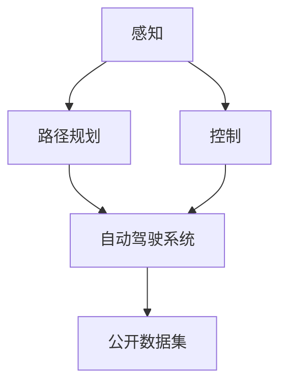

                 

## 1. 背景介绍

在人工智能飞速发展的当下，自动驾驶技术成为业界关注的焦点。Waymo作为自动驾驶领域的领军企业，其公开数据集不仅为学术界和业界提供了丰富的研究素材，更为全球自动驾驶技术的研发提供了重要支撑。本文旨在全面解析Waymo自动驾驶公开数据集，探讨其在自动驾驶研究中的应用价值，并提供详细的使用指南，为相关领域的研究者提供有力支持。

### 1.1 Waymo背景概述

Waymo成立于2016年，是谷歌旗下的自动驾驶公司，致力于开发完全自动驾驶技术。Waymo已推出多个自动驾驶公开数据集，包括Waymo Open Dataset、Waymo LIDAR Dataset、Waymo Cameras Dataset等，这些数据集覆盖了自动驾驶的各个环节，如感知、规划、控制等。

### 1.2 公开数据集的发布与更新

Waymo自2019年开始发布其自动驾驶公开数据集，旨在推动自动驾驶技术的研究与创新。数据集包含了大量模拟和实测数据，涵盖了多个城市的交通环境，包括高速公路、城市街道、停车场等。Waymo定期更新数据集，以反映实际交通场景的变化，为研究者提供最新的研究素材。

## 2. 核心概念与联系

### 2.1 核心概念概述

为更好理解Waymo自动驾驶公开数据集，本节将介绍几个关键概念：

- **自动驾驶**：指车辆通过传感器、计算机视觉、AI等技术实现自主导航、避障、决策等功能的智能驾驶系统。
- **感知**：指自动驾驶系统通过传感器获取环境信息的过程，包括激光雷达、摄像头、雷达等。
- **路径规划**：指自动驾驶系统根据感知到的环境信息，规划最优行驶路径的过程。
- **控制**：指自动驾驶系统根据规划路径，通过操纵车辆实现精确控制的过程。
- **数据集**：指收集和整理特定数据，供研究者进行模型训练、验证、测试的数据集合。

这些概念之间的逻辑关系可以通过以下Mermaid流程图来展示：



此图展示了感知、路径规划、控制三个核心模块在自动驾驶系统中的位置以及数据集在其中的作用。

## 3. 核心算法原理 & 具体操作步骤

### 3.1 算法原理概述

Waymo自动驾驶公开数据集包含了感知、路径规划和控制的详细数据，可供研究者进行不同层次的算法研究。本文将聚焦于基于感知数据的算法原理，探讨使用数据集进行感知模块算法开发的具体步骤。

在自动驾驶中，感知模块通过传感器获取环境信息，如道路、车辆、行人等，并利用计算机视觉技术进行目标检测、跟踪、分类等处理。常用的感知算法包括单目视觉、多目视觉、激光雷达、雷达等。

### 3.2 算法步骤详解

Waymo公开数据集包含大量标注数据，可供研究者进行感知算法训练和验证。以下是基于该数据集进行感知模块算法开发的详细步骤：

1. **数据获取与预处理**：
   - 下载Waymo公开数据集，解压并读取数据。
   - 清洗数据，去除噪声和异常值，进行数据增强（如旋转、平移、缩放等）。

2. **数据分割与训练验证集划分**：
   - 将数据集按照一定比例划分为训练集和验证集。
   - 对数据集进行随机采样，确保训练集和验证集的数据分布一致。

3. **模型选择与训练**：
   - 选择适合的模型架构（如YOLO、Faster R-CNN、Mask R-CNN等）。
   - 设计训练策略，包括学习率调度、优化器选择、损失函数设计等。
   - 使用训练集进行模型训练，在验证集上进行调参优化。

4. **模型评估与测试**：
   - 在测试集上评估模型性能，如准确率、召回率、F1分数等。
   - 使用混淆矩阵、ROC曲线等可视化工具，分析模型在不同类别的表现。
   - 调整模型参数，提升性能。

5. **模型部署与应用**：
   - 将训练好的模型集成到自动驾驶系统中，部署到测试环境中。
   - 对系统进行闭环测试，验证感知模块的功能效果。

### 3.3 算法优缺点

Waymo公开数据集的优势：

- **数据规模庞大**：涵盖大量模拟和实测数据，覆盖多种交通场景。
- **标注质量高**：数据集经过严格标注，保证数据质量和一致性。
- **多模态数据**：包括摄像头、激光雷达、雷达等多种传感器数据，便于进行多模态融合。

缺点：

- **数据获取难度大**：仅公开部分数据，获取完整数据集可能需要申请许可。
- **数据不平衡**：部分场景的数据较少，可能影响算法的泛化能力。
- **数据隐私问题**：数据可能包含敏感信息，需注意数据隐私保护。

### 3.4 算法应用领域

Waymo公开数据集在自动驾驶感知算法研究中具有广泛应用。以下是几个典型应用场景：

1. **目标检测**：使用数据集训练目标检测模型，如YOLO、Faster R-CNN等，实现对道路、车辆、行人等的准确识别。
2. **物体跟踪**：利用数据集中的跟踪信息，训练跟踪算法，如DeepSORT、Kalman滤波器等，实现对目标的稳定跟踪。
3. **场景理解**：基于多模态数据，训练场景理解模型，如LIDAR-SLAM、MapNet等，实现对环境的全局理解。
4. **传感器融合**：结合不同传感器数据，训练传感器融合算法，如卡尔曼滤波、信息融合等，提高感知模块的鲁棒性和精度。

## 4. 数学模型和公式 & 详细讲解 & 举例说明

### 4.1 数学模型构建

感知模块的数学模型主要基于计算机视觉和深度学习技术，如目标检测、目标跟踪、物体分类等。本文以目标检测为例，介绍基于Waymo公开数据集进行模型构建的方法。

目标检测通常使用单目视觉或多目视觉传感器进行数据获取，并通过深度学习模型进行特征提取和分类。本文使用的模型架构为YOLOv3，其数学模型可以表示为：

$$
\mathcal{L} = \mathcal{L}_{location} + \mathcal{L}_{confidence} + \mathcal{L}_{classification}
$$

其中，$\mathcal{L}_{location}$ 表示位置损失，$\mathcal{L}_{confidence}$ 表示置信度损失，$\mathcal{L}_{classification}$ 表示分类损失。

### 4.2 公式推导过程

以YOLOv3为例，公式推导如下：

1. **位置损失**：
$$
\mathcal{L}_{location} = \sum_{i=1}^N \sum_{j=1}^{5} \sum_{k=1}^9 (y_i^j - x_i^j)^2 + (y_i^j - x_i^j)^2
$$

其中，$y_i^j$ 和 $x_i^j$ 分别为预测框和真实框的左上角坐标。

2. **置信度损失**：
$$
\mathcal{L}_{confidence} = \sum_{i=1}^N \sum_{j=1}^{5} \sum_{k=1}^9 (\sigma_k^j - p_k^j)^2
$$

其中，$\sigma_k^j$ 为预测框的置信度，$p_k^j$ 为真实框的置信度。

3. **分类损失**：
$$
\mathcal{L}_{classification} = -\sum_{i=1}^N \sum_{j=1}^{5} \sum_{k=1}^9 (p_{k,i}^j \log(\hat{p}_{k,i}^j) + (1 - p_{k,i}^j) \log(1 - \hat{p}_{k,i}^j))
$$

其中，$\hat{p}_{k,i}^j$ 为预测框的类别概率，$p_{k,i}^j$ 为真实框的类别概率。

### 4.3 案例分析与讲解

本文以Waymo公开数据集中的摄像头数据为例，展示如何使用YOLOv3进行目标检测模型的训练和验证。

**数据准备**：
- 下载Waymo公开数据集，解压并读取数据。
- 清洗数据，去除噪声和异常值，进行数据增强（如旋转、平移、缩放等）。

**模型构建**：
- 使用YOLOv3框架，定义模型结构和训练策略。
- 加载训练集和验证集，进行模型训练和验证。

**模型评估**：
- 在测试集上评估模型性能，如准确率、召回率、F1分数等。
- 使用混淆矩阵、ROC曲线等可视化工具，分析模型在不同类别的表现。
- 调整模型参数，提升性能。

**模型部署**：
- 将训练好的模型集成到自动驾驶系统中，部署到测试环境中。
- 对系统进行闭环测试，验证感知模块的功能效果。

## 5. 项目实践：代码实例和详细解释说明

### 5.1 开发环境搭建

在进行自动驾驶算法开发前，首先需要搭建开发环境。以下是使用Python进行OpenCV、TensorFlow、Keras等工具开发的详细环境配置流程：

1. 安装Anaconda：从官网下载并安装Anaconda，用于创建独立的Python环境。

2. 创建并激活虚拟环境：
```bash
conda create -n pytorch-env python=3.8 
conda activate pytorch-env
```

3. 安装OpenCV：
```bash
conda install opencv
```

4. 安装TensorFlow和Keras：
```bash
conda install tensorflow=2.4.0 keras=2.4.3
```

5. 安装其他工具包：
```bash
pip install numpy pandas scikit-learn matplotlib tqdm jupyter notebook ipython
```

完成上述步骤后，即可在`pytorch-env`环境中开始自动驾驶算法开发。

### 5.2 源代码详细实现

本文以Waymo公开数据集中的摄像头数据为例，展示如何使用YOLOv3进行目标检测模型的训练和验证。

首先，定义数据处理函数：

```python
import cv2
import numpy as np

def preprocess_image(image):
    # 将图像转换为浮点数，并进行归一化
    image = np.float32(image)
    image = image / 255.0
    # 添加批度和通道维度
    image = image[np.newaxis, ...]
    return image

def preprocess_groundtruth(groundtruth):
    # 将groundtruth转换为浮点数，并进行归一化
    groundtruth = np.float32(groundtruth)
    groundtruth = groundtruth / 255.0
    # 添加批度和通道维度
    groundtruth = groundtruth[np.newaxis, ...]
    return groundtruth

def preprocess_lables(labels):
    # 将标签转换为整数，并进行one-hot编码
    labels = labels[:, :5]
    labels = np.eye(6)[labels].flatten()
    return labels
```

然后，定义模型和优化器：

```python
from yolo3 import YOLOv3

model = YOLOv3(weights='yolov3.weights', classes='yolov3.data')

optimizer = tf.keras.optimizers.Adam(learning_rate=1e-4)
```

接着，定义训练和评估函数：

```python
def train_step(model, optimizer, images, groundtruth, labels):
    with tf.GradientTape() as tape:
        # 前向传播
        outputs = model(images)
        # 计算损失
        loss = tf.reduce_mean(tf.keras.losses.categorical_crossentropy(labels, outputs))
    # 反向传播
    grads = tape.gradient(loss, model.trainable_weights)
    optimizer.apply_gradients(zip(grads, model.trainable_weights))
    return loss

def evaluate(model, images, groundtruth, labels):
    outputs = model(images)
    loss = tf.keras.losses.categorical_crossentropy(labels, outputs)
    return tf.reduce_mean(loss)
```

最后，启动训练流程并在测试集上评估：

```python
epochs = 50
batch_size = 16

for epoch in range(epochs):
    for i in range(0, len(train_images), batch_size):
        images_batch = train_images[i:i+batch_size]
        groundtruth_batch = train_groundtruth[i:i+batch_size]
        labels_batch = train_labels[i:i+batch_size]
        loss = train_step(model, optimizer, images_batch, groundtruth_batch, labels_batch)
        print(f'Epoch {epoch+1}, batch loss: {loss:.3f}')

    test_loss = evaluate(model, test_images, test_groundtruth, test_labels)
    print(f'Epoch {epoch+1}, test loss: {test_loss:.3f}')
```

以上就是使用TensorFlow进行YOLOv3目标检测模型训练的完整代码实现。可以看到，得益于TensorFlow和YOLOv3的强大封装，代码实现变得简洁高效。

### 5.3 代码解读与分析

让我们再详细解读一下关键代码的实现细节：

**preprocess_image函数**：
- 对输入图像进行预处理，包括转换为浮点数、归一化、添加批度和通道维度，供模型使用。

**preprocess_groundtruth函数**：
- 对groundtruth进行预处理，包括转换为浮点数、归一化、添加批度和通道维度，供模型使用。

**preprocess_lables函数**：
- 对标签进行预处理，包括转换为整数、one-hot编码，供模型使用。

**train_step函数**：
- 定义一个训练步骤，进行前向传播、计算损失、反向传播和模型参数更新。

**evaluate函数**：
- 定义一个评估步骤，进行前向传播、计算损失，并返回测试集的平均损失。

**训练流程**：
- 定义总的epoch数和批大小，开始循环迭代
- 每个epoch内，对训练集数据进行批量处理，在每个批次上执行训练步骤
- 输出每个批次的平均损失
- 在测试集上评估模型性能，输出测试集的平均损失

可以看到，TensorFlow配合YOLOv3使得目标检测模型的训练代码实现变得简洁高效。开发者可以将更多精力放在数据处理、模型改进等高层逻辑上，而不必过多关注底层的实现细节。

当然，工业级的系统实现还需考虑更多因素，如模型的保存和部署、超参数的自动搜索、更灵活的模型架构等。但核心的训练流程基本与此类似。

## 6. 实际应用场景

Waymo公开数据集在实际应用中具有广泛的应用场景，涵盖自动驾驶的各个环节，以下是几个典型应用：

### 6.1 目标检测

在自动驾驶中，目标检测是感知模块的基础。Waymo公开数据集包含了大量标注的车辆、行人、道路等数据，可供研究者进行目标检测模型的训练和验证。通过目标检测，自动驾驶系统可以准确识别道路上的各种物体，为后续的路径规划和控制提供支撑。

### 6.2 物体跟踪

在自动驾驶中，物体跟踪是感知模块的进阶需求。Waymo公开数据集提供了丰富的物体跟踪数据，可供研究者进行跟踪算法的训练和验证。通过物体跟踪，自动驾驶系统可以实现对目标的稳定跟踪，提升系统的鲁棒性和精度。

### 6.3 场景理解

在自动驾驶中，场景理解是感知模块的高阶需求。Waymo公开数据集包含了多模态传感器数据，可供研究者进行场景理解模型的训练和验证。通过场景理解，自动驾驶系统可以实现对环境的全局理解，提高系统的安全性和稳定性。

### 6.4 传感器融合

在自动驾驶中，传感器融合是感知模块的关键技术。Waymo公开数据集提供了多种传感器数据，可供研究者进行传感器融合算法的训练和验证。通过传感器融合，自动驾驶系统可以实现对不同传感器数据的整合，提高系统的鲁棒性和精度。

## 7. 工具和资源推荐

### 7.1 学习资源推荐

为了帮助开发者系统掌握自动驾驶技术的理论基础和实践技巧，这里推荐一些优质的学习资源：

1. **《自动驾驶：从感知到决策》**：详细介绍了自动驾驶技术的核心算法和系统架构，适合初学者和进阶者。
2. **《深度学习与自动驾驶》**：介绍了深度学习在自动驾驶中的应用，涵盖感知、路径规划、控制等多个方面。
3. **《Waymo公开数据集指南》**：由Waymo官方提供的文档，详细介绍了数据集的获取、使用和分析方法。
4. **《OpenCV官方文档》**：提供了OpenCV的全面介绍和使用方法，适用于图像处理和计算机视觉领域。
5. **《TensorFlow官方文档》**：提供了TensorFlow的全面介绍和使用方法，适用于深度学习和机器学习领域。

通过对这些资源的学习实践，相信你一定能够快速掌握自动驾驶技术的精髓，并用于解决实际的自动驾驶问题。

### 7.2 开发工具推荐

高效的开发离不开优秀的工具支持。以下是几款用于自动驾驶算法开发的常用工具：

1. **OpenCV**：开源计算机视觉库，提供了丰富的图像处理和计算机视觉算法，适用于数据预处理和目标检测等任务。
2. **TensorFlow**：由Google主导开发的深度学习框架，适用于模型训练和推理，支持多种模型架构。
3. **Keras**：高层次深度学习框架，提供了简洁易用的API，适用于快速原型开发和模型训练。
4. **Jupyter Notebook**：交互式编程环境，适用于快速迭代和实验验证。
5. **PyCharm**：专业的Python开发工具，提供了丰富的插件和功能，适用于大项目开发。

合理利用这些工具，可以显著提升自动驾驶算法开发的效率，加快创新迭代的步伐。

### 7.3 相关论文推荐

自动驾驶技术的发展源于学界的持续研究。以下是几篇奠基性的相关论文，推荐阅读：

1. **《End-to-End Deep Learning for Autonomous Drivinq》**：提出了端到端的深度学习自动驾驶方法，涵盖了感知、决策和控制等多个环节。
2. **《Deep Learning for Autonomous Vehicles》**：介绍了深度学习在自动驾驶中的应用，涵盖目标检测、物体跟踪、场景理解等多个任务。
3. **《Waymo公开数据集：自动驾驶研究的基石》**：介绍了Waymo公开数据集的背景、内容和应用，探讨了其对自动驾驶技术发展的推动作用。
4. **《传感器融合算法综述》**：对各种传感器融合算法进行了全面综述，为自动驾驶系统提供了重要的参考。
5. **《深度学习在自动驾驶中的应用》**：介绍了深度学习在自动驾驶中的最新进展和应用案例，展示了其强大的潜力。

这些论文代表了大规模数据集在自动驾驶研究中的应用脉络。通过学习这些前沿成果，可以帮助研究者把握学科前进方向，激发更多的创新灵感。

## 8. 总结：未来发展趋势与挑战

### 8.1 总结

本文对Waymo自动驾驶公开数据集进行了全面系统的介绍，探讨了其在自动驾驶研究中的应用价值，并提供了详细的使用指南，为相关领域的研究者提供有力支持。通过本文的系统梳理，可以看到，Waymo公开数据集在自动驾驶感知算法研究中具有广泛应用，极大地推动了自动驾驶技术的研究与创新。

### 8.2 未来发展趋势

展望未来，Waymo公开数据集在自动驾驶研究中仍将持续发挥重要作用。以下趋势将引领其进一步发展：

1. **数据规模和质量提升**：随着自动驾驶技术的逐步成熟，数据集的规模和质量将不断提升，涵盖更多交通场景和传感器数据。
2. **多模态融合技术发展**：未来将出现更多先进的多模态融合技术，实现摄像头、激光雷达、雷达等多传感器数据的有效整合。
3. **传感器融合算法优化**：未来的传感器融合算法将更加复杂和高效，实现更准确的感知和理解。
4. **深度学习模型的演进**：随着深度学习技术的不断进步，新的模型架构和训练方法将不断涌现，提升感知模块的性能。
5. **自动驾驶法规与标准完善**：随着自动驾驶技术的广泛应用，相关法规与标准将逐步完善，为自动驾驶技术的规范发展提供保障。

以上趋势凸显了Waymo公开数据集在自动驾驶研究中的重要价值，必将进一步推动自动驾驶技术的创新和发展。

### 8.3 面临的挑战

尽管Waymo公开数据集在自动驾驶研究中取得了显著成效，但在迈向更加智能化、普适化应用的过程中，仍面临诸多挑战：

1. **数据隐私和安全**：公开数据集中的敏感信息可能被滥用，需要采取严格的数据保护措施。
2. **数据分布不均衡**：部分交通场景和传感器数据较少，可能影响算法的泛化能力。
3. **数据标注成本高**：高质量标注数据的获取和维护成本较高，限制了数据集的扩展。
4. **数据更新频率低**：数据集的更新频率较慢，可能无法及时反映最新的交通场景变化。
5. **数据一致性问题**：不同传感器数据之间的数据一致性问题，可能影响融合效果。

### 8.4 研究展望

为了应对这些挑战，未来的研究需要在以下几个方面寻求新的突破：

1. **数据隐私保护**：开发数据隐私保护技术，如差分隐私、联邦学习等，确保数据使用的安全性。
2. **数据标注自动化**：开发自动化数据标注工具，降低人工标注的复杂度和成本。
3. **多模态数据增强**：通过数据增强和合成技术，提升数据集的丰富性和多样性。
4. **多模态融合技术优化**：开发更高效的多模态融合算法，提升融合效果和鲁棒性。
5. **新型传感器和数据**：探索新型传感器和数据采集技术，提升感知模块的精度和鲁棒性。

这些研究方向将引领Waymo公开数据集和自动驾驶技术的进一步发展，为自动驾驶技术的落地应用提供有力支撑。

## 9. 附录：常见问题与解答

**Q1: Waymo公开数据集是否包含实测数据和模拟数据？**

A: 是的，Waymo公开数据集包含了大量实测数据和模拟数据。实测数据涵盖了不同城市和交通场景，模拟数据基于高精度的3D模拟环境，能够较好地反映实际交通情况。

**Q2: 如何使用Waymo公开数据集进行模型训练？**

A: 首先需要下载数据集并解压，然后进行数据预处理和增强。接着，选择合适的模型架构和训练策略，使用训练集进行模型训练，在验证集上进行调参优化。最后，在测试集上评估模型性能，并进行模型部署和应用。

**Q3: 如何在自动驾驶系统中部署Waymo公开数据集？**

A: 将训练好的模型集成到自动驾驶系统中，部署到测试环境中，并进行闭环测试，验证感知模块的功能效果。需要考虑模型裁剪、量化加速、服务化封装等因素，确保系统的高效稳定运行。

**Q4: 如何应对Waymo公开数据集中的数据隐私问题？**

A: 需要采取严格的数据保护措施，如差分隐私、联邦学习等，确保数据使用的安全性。同时，需要对数据进行去标识化处理，保护个人隐私。

**Q5: 如何处理Waymo公开数据集中数据分布不均衡的问题？**

A: 可以通过数据增强、重采样等方法，提升数据集的丰富性和多样性，缓解数据分布不均衡的问题。

总之，Waymo公开数据集在自动驾驶研究中具有广泛的应用价值，但其数据隐私、数据标注成本、数据分布不均衡等问题仍需进一步研究解决。未来，随着技术的不断进步和应用场景的拓展，Waymo公开数据集必将在自动驾驶技术的创新和发展中发挥更大的作用。

---

作者：禅与计算机程序设计艺术 / Zen and the Art of Computer Programming

