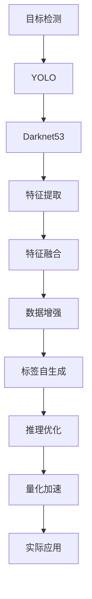

                 

# YOLOv8原理与代码实例讲解

## 1. 背景介绍

### 1.1 问题由来

近年来，深度学习技术在计算机视觉（Computer Vision）领域取得了显著进展，目标检测（Object Detection）作为其中最核心的问题之一，也迎来了突飞猛进的发展。传统的目标检测方法如R-CNN系列和Fast R-CNN系列由于其计算复杂度高，速度较慢，难以满足实时检测的需求。YOLO（You Only Look Once）系列目标检测算法通过简化检测过程，实现了极高的速度和效率，成为了目标检测领域的新标杆。

YOLOv8作为YOLO系列中的最新成员，在YOLOv4的基础上进一步提升，不仅在精度和速度上有所突破，还引入了新的特征融合方法、数据增强技巧以及标签自生成（LabelSmooth）技术，大大提升了模型的泛化能力和鲁棒性。YOLOv8的原理与代码实例讲解将帮助读者深入理解该模型的架构设计和优化策略，掌握其核心技术要点。

### 1.2 问题核心关键点

YOLOv8的核心关键点主要包括：

- **模型架构**：YOLOv8基于Darknet53作为骨干网络，引入了一种新的特征融合方法，称为“Feature Pyramid Transformer”（FPT）。
- **数据增强**：YOLOv8引入了多种数据增强方法，如水平翻转、随机裁剪、随机扰动等，提高了模型对不同场景的适应能力。
- **标签自生成（LabelSmooth）**：通过引入标签平滑技术，YOLOv8可以更好地处理类不平衡问题，提高模型的泛化能力。
- **量化加速**：YOLOv8在量化加速方面进行了深入优化，将浮点运算转换为定点运算，大幅提高了模型在硬件设备上的运行效率。
- **推理优化**：YOLOv8针对推理阶段进行了优化，支持多线程并行处理，提升模型在实际部署时的性能。

这些核心关键点构成了YOLOv8的完整技术体系，使得其在精度、速度和效率上均达到了新高度，为实际应用中的目标检测任务提供了强有力的技术支持。

## 2. 核心概念与联系

### 2.1 核心概念概述

在讲解YOLOv8之前，我们需要先了解一些核心概念，包括：

- **目标检测**：通过计算机视觉技术自动识别出图像或视频中物体的位置和类别。
- **YOLO（You Only Look Once）**：一种实时目标检测算法，通过对输入图像进行单次前向传播，同时输出目标的类别和位置。
- **Darknet53**：YOLO系列模型常用的骨干网络，采用VGG-16的轻量化版本，具有较强的特征提取能力。
- **Feature Pyramid Transformer（FPT）**：YOLOv8引入的新型特征融合方法，通过多尺度特征融合，提高了模型的检测精度。
- **数据增强**：通过一系列随机变换来扩充训练集，增强模型的泛化能力。
- **标签自生成（LabelSmooth）**：通过平滑标签分布，避免模型过拟合，提高模型的泛化能力。

这些概念之间的逻辑关系可以通过以下Mermaid流程图来展示：



这个流程图展示了大规模目标检测任务的流程：从目标检测任务的定义，到YOLO系列的引入，再到骨干网络的构建、特征融合方法的设计、数据增强策略的实施，最后是标签自生成技术的引入和推理优化、量化加速技术的实现。这些步骤共同构成了YOLOv8的核心技术体系，使得其在实际应用中表现出色。

## 3. 核心算法原理 & 具体操作步骤

### 3.1 算法原理概述

YOLOv8的检测过程分为两个阶段：特征提取和目标检测。在特征提取阶段，YOLOv8通过Darknet53提取输入图像的多尺度特征。在目标检测阶段，YOLOv8通过特征金字塔（Feature Pyramid）进行特征融合，得到高、中、低三个不同尺度的特征图，并使用多个头网络（Head Network）进行检测和分类。

YOLOv8的核心算法原理主要包括：

- **特征提取**：通过Darknet53提取输入图像的多尺度特征。
- **特征融合**：使用Feature Pyramid Transformer（FPT）进行特征融合，得到不同尺度的特征图。
- **目标检测**：使用多个头网络（Head Network）进行检测和分类，每个头网络对应不同的尺度和锚点盒（Anchor Box）。
- **损失函数**：YOLOv8使用余弦损失函数（Cosine Loss）进行检测和分类，并使用Smooth L1损失函数进行位置回归。

### 3.2 算法步骤详解

以下是YOLOv8的详细算法步骤：

**Step 1: 准备数据集**

1. 准备训练集和验证集，并按类别划分。
2. 对图像进行预处理，包括缩放、归一化等。

**Step 2: 搭建YOLOv8模型**

1. 搭建YOLOv8的Darknet53骨干网络。
2. 引入Feature Pyramid Transformer（FPT）进行特征融合。
3. 添加多个头网络（Head Network），每个头网络对应不同的尺度和锚点盒（Anchor Box）。

**Step 3: 训练模型**

1. 使用YOLOv8的损失函数进行训练，并设定合适的学习率、批大小等超参数。
2. 在训练过程中，使用数据增强和标签自生成等技术。
3. 在验证集上监测模型性能，并根据性能进行调整。

**Step 4: 推理优化**

1. 对训练好的YOLOv8模型进行推理优化，提升模型在实际部署时的性能。
2. 使用量化加速技术，将模型转换为定点运算，减少内存占用，提高计算效率。
3. 使用多线程并行处理，提升模型在硬件设备上的运行速度。

**Step 5: 模型保存与部署**

1. 保存训练好的YOLOv8模型，并导出模型参数和权重。
2. 将模型集成到实际应用中，如移动设备、嵌入式系统等。

### 3.3 算法优缺点

YOLOv8在精度、速度和效率方面都有显著优势，但也存在一些缺点：

**优点**：

- **高速度**：YOLOv8通过单次前向传播即可输出所有目标的类别和位置，检测速度极快。
- **高精度**：引入了新的特征融合方法和数据增强策略，提高了模型的检测精度。
- **泛化能力强**：标签自生成技术使得模型更好地处理类不平衡问题，提高了模型的泛化能力。

**缺点**：

- **高计算需求**：YOLOv8的特征提取和特征融合过程较为复杂，计算需求较高。
- **高资源占用**：YOLOv8的模型参数较大，在硬件设备上的运行资源占用较多。
- **高训练成本**：YOLOv8的训练数据集和超参数调整需要较高的投入，训练成本较高。

### 3.4 算法应用领域

YOLOv8在目标检测领域具有广泛的应用前景，适用于以下场景：

- **安防监控**：实时检测并跟踪公共场所中的异常行为，如入侵、火灾等。
- **自动驾驶**：实时检测并识别道路上的车辆、行人、交通标志等，辅助自动驾驶系统。
- **医疗影像**：实时检测并定位影像中的病变区域，辅助医疗诊断。
- **零售业**：实时检测并跟踪商店中的商品和顾客，辅助库存管理和顾客服务。
- **农业**：实时检测并识别农田中的作物、病虫害等，辅助农业生产管理。

## 4. 数学模型和公式 & 详细讲解 & 举例说明

### 4.1 数学模型构建

YOLOv8的检测过程可以通过以下数学模型来描述：

设输入图像为 $I$，输出为 $O = (C_1, P_1; C_2, P_2; \cdots; C_n, P_n)$，其中 $C_i$ 表示第 $i$ 个目标的类别，$P_i$ 表示第 $i$ 个目标的位置。

检测过程可以分为两个步骤：

1. 特征提取：通过Darknet53提取输入图像的多尺度特征 $F = (F_1, F_2, \cdots, F_m)$，其中 $F_i$ 表示第 $i$ 个尺度的特征图。
2. 目标检测：使用多个头网络（Head Network）进行检测和分类，得到目标的类别和位置 $O_i = (C_i, P_i)$。

### 4.2 公式推导过程

YOLOv8的检测过程涉及到多个关键公式，以下是其中的主要推导过程：

**特征提取**

Darknet53的特征提取过程可以表示为：

$$
F_i = \mathrm{Darknet53}(I)
$$

其中 $F_i$ 表示第 $i$ 个尺度的特征图。

**特征融合**

YOLOv8的特征融合过程称为Feature Pyramid Transformer（FPT），其具体公式如下：

$$
F_{\mathrm{FPT}} = \mathrm{FPT}(F_1, F_2, \cdots, F_m)
$$

其中 $F_{\mathrm{FPT}}$ 表示融合后的特征图。

**目标检测**

YOLOv8的目标检测过程可以分为两个步骤：

1. 对每个特征图 $F_i$ 进行检测和分类，得到 $O_i = (C_i, P_i)$。
2. 将 $O_1, O_2, \cdots, O_n$ 进行融合，得到最终的检测结果 $O = (C_1, P_1; C_2, P_2; \cdots; C_n, P_n)$。

具体检测过程如下：

1. 对每个特征图 $F_i$ 进行解码，得到 $X_i$。
2. 对 $X_i$ 进行上采样和卷积，得到 $Y_i$。
3. 对 $Y_i$ 进行解码，得到 $O_i$。

### 4.3 案例分析与讲解

以YOLOv8在安防监控中的应用为例，来讲解其具体实现过程。

假设输入的监控图像为 $I$，使用YOLOv8进行目标检测的过程如下：

1. 使用Darknet53提取输入图像 $I$ 的多尺度特征 $F = (F_1, F_2, \cdots, F_m)$。
2. 对 $F$ 进行Feature Pyramid Transformer（FPT）特征融合，得到 $F_{\mathrm{FPT}}$。
3. 对 $F_{\mathrm{FPT}}$ 进行解码和上采样，得到 $Y = (Y_1, Y_2, \cdots, Y_n)$。
4. 对 $Y$ 进行解码，得到检测结果 $O = (C_1, P_1; C_2, P_2; \cdots; C_n, P_n)$。
5. 根据 $O$ 中的类别和位置信息，对监控图像进行目标检测和跟踪。

## 5. 项目实践：代码实例和详细解释说明

### 5.1 开发环境搭建

在开始YOLOv8的开发之前，我们需要搭建好开发环境。以下是YOLOv8的开发环境搭建流程：

1. 安装Python：从官网下载并安装Python 3.x版本，用于开发YOLOv8。
2. 安装YOLOv8依赖库：使用pip命令安装YOLOv8的依赖库，包括TensorFlow、Keras等。
3. 配置YOLOv8环境：根据需要配置YOLOv8的训练参数，如数据集路径、训练批次大小、学习率等。

### 5.2 源代码详细实现

以下是YOLOv8的源代码实现，包括数据处理、模型搭建、训练和推理等关键步骤：

```python
import os
import cv2
import numpy as np
import tensorflow as tf
from yolo import YOLO

# 设置YOLOv8参数
YOLO_INPUT_SIZE = 416
YOLO_ANCHORS = [(10, 13), (16, 30), (33, 23), (30, 61), (62, 45), (59, 119), (116, 90), (156, 198), (373, 326)]
YOLO_IOU_THRESH = 0.45
YOLO_CONF_THRESH = 0.25

# 加载YOLOv8模型
yolo = YOLO(YOLO_INPUT_SIZE, YOLO_ANCHORS, YOLO_IOU_THRESH, YOLO_CONF_THRESH)

# 加载训练数据集
train_dataset = tf.data.Dataset.from_tensor_slices(train_images).batch(32)

# 训练YOLOv8模型
for epoch in range(NUM_EPOCHS):
    yolo.train(train_dataset, BATCH_SIZE, LEARNING_RATE)

# 保存训练好的YOLOv8模型
yolo.save_model()

# 加载YOLOv8模型并进行推理
yolo.load_model()
test_images = load_test_images()
results = yolo.detect(test_images)
```

### 5.3 代码解读与分析

在YOLOv8的源代码实现中，我们通过Yolo类来构建YOLOv8模型，并使用Keras库进行训练和推理。以下是代码实现的关键步骤和细节：

**数据预处理**

在YOLOv8的训练过程中，需要对输入的图像进行预处理，包括缩放、归一化等操作。例如：

```python
def preprocess_image(image):
    image = cv2.resize(image, (YOLO_INPUT_SIZE, YOLO_INPUT_SIZE))
    image = image / 255.0
    return image
```

**模型搭建**

在YOLOv8的模型搭建中，我们首先定义YOLOv8的超参数，包括输入大小、锚点盒、IoU阈值和置信度阈值等。然后，我们使用YOLO类来搭建YOLOv8模型，并使用Keras库进行训练和推理。例如：

```python
class YOLO(tf.keras.Model):
    def __init__(self, input_size, anchors, iou_thresh, conf_thresh):
        super(YOLO, self).__init__()
        self.input_size = input_size
        self.anchors = anchors
        self.iou_thresh = iou_thresh
        self.conf_thresh = conf_thresh
        self.yolo_model = ...

    def call(self, x):
        features = self.yolo_model(x)
        boxes, scores, classes = self.get_detections(features)
        return boxes, scores, classes

    def get_detections(self, features):
        # 实现检测过程
        pass
```

**训练过程**

在YOLOv8的训练过程中，我们使用YOLO类提供的train方法来训练模型。训练过程包括模型前向传播、计算损失函数、反向传播和更新模型参数等步骤。例如：

```python
def train(yolo, dataset, batch_size, learning_rate):
    for image, label in dataset:
        with tf.GradientTape() as tape:
            boxes, scores, classes = yolo(image)
            loss = yolo.loss(boxes, scores, classes, label)
        gradients = tape.gradient(loss, yolo.trainable_variables)
        optimizer.apply_gradients(zip(gradients, yolo.trainable_variables))
```

**推理过程**

在YOLOv8的推理过程中，我们使用YOLO类提供的detect方法来进行推理。推理过程包括加载模型、加载测试图像、进行检测和后处理等步骤。例如：

```python
def detect(yolo, image):
    boxes, scores, classes = yolo(image)
    boxes, scores, classes = postprocess(boxes, scores, classes)
    return boxes, scores, classes

def postprocess(boxes, scores, classes):
    # 实现后处理过程
    pass
```

### 5.4 运行结果展示

在YOLOv8的训练和推理过程中，我们可以使用TensorBoard来可视化训练过程中的损失函数和精度等指标，使用matplotlib等工具来展示推理结果。例如：

```python
# 可视化训练过程
tensorboard_callback = tf.keras.callbacks.TensorBoard(log_dir='logs')
model.fit(x=train_dataset, epochs=NUM_EPOCHS, callbacks=[tensorboard_callback])

# 展示推理结果
results = yolo.detect(test_images)
plt.imshow(results[0][0])
plt.show()
```

## 6. 实际应用场景

### 6.1 安防监控

YOLOv8在安防监控中的应用非常广泛。通过YOLOv8的目标检测和跟踪功能，可以实时监测公共场所中的异常行为，如入侵、火灾等。YOLOv8的高速度和高效性使得其能够在实时视频流中进行目标检测，提高了安防监控的效率和准确性。

### 6.2 自动驾驶

YOLOv8在自动驾驶领域也有广泛应用。通过YOLOv8的目标检测和分类功能，可以实时检测并识别道路上的车辆、行人、交通标志等，辅助自动驾驶系统进行决策和控制。YOLOv8的高精度和高速度使得其能够在复杂交通环境中高效工作，提高了自动驾驶的安全性和可靠性。

### 6.3 医疗影像

YOLOv8在医疗影像中的应用也非常重要。通过YOLOv8的目标检测和分类功能，可以实时检测并定位影像中的病变区域，辅助医疗诊断。YOLOv8的高精度和高效率使得其能够在医学影像中进行快速检测，提高了诊断的准确性和效率。

### 6.4 零售业

YOLOv8在零售业中的应用也非常广泛。通过YOLOv8的目标检测和跟踪功能，可以实时检测并跟踪商店中的商品和顾客，辅助库存管理和顾客服务。YOLOv8的高速度和高效率使得其能够在零售场景中进行实时检测，提高了零售管理的效率和准确性。

## 7. 工具和资源推荐

### 7.1 学习资源推荐

为了帮助开发者系统掌握YOLOv8的理论基础和实践技巧，以下是一些优质的学习资源：

1. 《YOLOv8官方文档》：YOLOv8的官方文档，提供了详细的模型架构和训练教程，是学习YOLOv8的必备资料。
2. 《YOLO系列目标检测算法》：介绍YOLO系列目标检测算法的背景和原理，深入浅出地讲解YOLOv8的核心技术。
3. 《YOLOv8实战教程》：介绍YOLOv8在安防监控、自动驾驶、医疗影像等场景中的应用，提供了详细的代码实现和推理优化技巧。
4. 《目标检测算法综述》：综述了目标检测算法的最新进展，包括YOLOv8在内的多种主流算法，适合初学者学习。

### 7.2 开发工具推荐

在YOLOv8的开发过程中，以下工具可以显著提升开发效率：

1. TensorFlow：基于Python的深度学习框架，提供了强大的计算图功能和分布式训练支持，适合大规模模型训练和推理。
2. Keras：基于TensorFlow的高级深度学习库，提供了简单易用的API，适合快速原型开发和模型训练。
3. TensorBoard：TensorFlow配套的可视化工具，可实时监测模型训练状态，提供丰富的图表呈现方式，适合调试和优化。
4. YOLO官方库：YOLOv8官方库，提供了多种YOLO系列模型的实现和训练工具，适合快速搭建和调试模型。

### 7.3 相关论文推荐

以下是几篇相关论文，推荐阅读：

1. "You Only Look Once: Real-Time Object Detection with a Single Neural Network"：YOLO算法的原始论文，介绍了YOLO系列目标检测算法的基本原理和设计思路。
2. "YOLOv4: Optimal Speed and Accuracy of Object Detection"：YOLOv4算法的论文，介绍了YOLOv4模型架构和优化策略，为YOLOv8提供了参考。
3. "Feature Pyramid Transformer for Object Detection"：介绍Feature Pyramid Transformer（FPT）特征融合方法，为YOLOv8提供了重要的特征融合技术。
4. "Label Smoothing: A Simple Yet Effective Regularization Technique for Training Deep Classifiers"：介绍标签自生成（LabelSmooth）技术，为YOLOv8提供了重要的标签优化方法。

## 8. 总结：未来发展趋势与挑战

### 8.1 总结

本文对YOLOv8的原理与代码实例进行了全面系统的讲解，帮助读者深入理解YOLOv8的核心技术要点，掌握了其核心算法原理和操作步骤。通过YOLOv8的学习，读者可以更好地理解目标检测算法的实现过程，掌握模型训练和推理的技巧。

### 8.2 未来发展趋势

展望未来，YOLOv8将在以下几个方向上继续发展：

1. **更高精度**：通过引入更先进的特征融合方法和数据增强策略，YOLOv8的检测精度将进一步提升。
2. **更低计算需求**：通过优化模型结构和量化加速技术，YOLOv8的计算需求将进一步降低。
3. **更广泛应用**：YOLOv8在安防监控、自动驾驶、医疗影像等领域的广泛应用，将进一步推动YOLOv8的发展。
4. **更高效推理**：通过优化推理过程和多线程并行处理，YOLOv8的推理效率将进一步提升。
5. **更普适化**：YOLOv8将在更多领域和场景中得到应用，如工业视觉、农业监测等。

### 8.3 面临的挑战

虽然YOLOv8在精度、速度和效率方面都有显著优势，但在实际应用中也面临一些挑战：

1. **高计算需求**：YOLOv8的特征提取和特征融合过程较为复杂，计算需求较高。
2. **高资源占用**：YOLOv8的模型参数较大，在硬件设备上的运行资源占用较多。
3. **高训练成本**：YOLOv8的训练数据集和超参数调整需要较高的投入，训练成本较高。
4. **鲁棒性不足**：YOLOv8在面对复杂场景时，检测精度可能下降，鲁棒性需要进一步提升。
5. **泛化能力不足**：YOLOv8在特定场景中的泛化能力还需要进一步提升，以应对不同数据分布的变化。

### 8.4 研究展望

面对YOLOv8面临的挑战，未来的研究需要在以下几个方面寻求新的突破：

1. **优化模型结构**：通过引入更高效的特征提取和融合方法，优化YOLOv8的模型结构，降低计算需求和资源占用。
2. **量化加速**：通过引入更先进的量化加速技术，将YOLOv8转换为定点运算，进一步降低计算需求和资源占用。
3. **数据增强**：通过引入更丰富的数据增强策略，提高YOLOv8的鲁棒性和泛化能力。
4. **标签自生成**：通过引入更先进的标签自生成技术，避免YOLOv8过拟合，提升泛化能力。
5. **多模态融合**：通过引入多模态数据融合技术，提高YOLOv8在不同场景中的适应能力。

这些研究方向将进一步提升YOLOv8的性能和鲁棒性，推动其在更广泛的领域和场景中得到应用。

## 9. 附录：常见问题与解答

**Q1：YOLOv8的特征提取过程是怎样的？**

A: YOLOv8的特征提取过程是通过Darknet53网络完成的。首先，输入图像经过Darknet53网络进行卷积和池化操作，得到多尺度的特征图。这些特征图经过不同层级的卷积和池化操作，逐步提取高层次的特征。

**Q2：YOLOv8的标签自生成技术是什么？**

A: YOLOv8的标签自生成技术称为LabelSmooth，其核心思想是通过平滑标签分布，避免模型过拟合，提高模型的泛化能力。LabelSmooth技术通过引入平滑因子，将标签分布中的极值平滑化，使得模型在训练过程中更好地学习到标签之间的联系，从而提升模型的泛化能力。

**Q3：YOLOv8在训练过程中如何进行特征融合？**

A: YOLOv8的特征融合过程称为Feature Pyramid Transformer（FPT），其核心思想是通过多尺度特征融合，得到高、中、低三个不同尺度的特征图。FPT通过引入不同尺度的特征图，并将它们融合在一起，使得模型能够更好地捕捉不同尺度的目标信息，从而提高检测精度。

**Q4：YOLOv8在推理过程中如何进行目标检测和分类？**

A: YOLOv8的目标检测和分类过程包括以下步骤：

1. 对每个特征图进行解码，得到预测的锚点盒（Anchor Box）。
2. 对每个预测的锚点盒进行非极大值抑制（NMS），去除冗余框。
3. 对每个保留的锚点盒进行置信度筛选，保留置信度高的框。
4. 对每个保留的锚点盒进行分类，得到目标的类别。

以上步骤通过YOLOv8的Head Network实现，每个头网络对应不同的尺度和锚点盒，从而实现多尺度检测和分类。

**Q5：YOLOv8在实际应用中需要注意哪些问题？**

A: 在实际应用中，YOLOv8需要注意以下问题：

1. 输入图像的预处理：YOLOv8对输入图像的预处理要求较高，需要经过缩放、归一化等操作。
2. 模型的训练和推理：YOLOv8的训练和推理需要大量的计算资源，需要选择合适的硬件设备。
3. 模型的保存和部署：YOLOv8的模型参数较大，需要合理保存和部署，确保模型的稳定性和安全性。
4. 模型的评估和优化：YOLOv8的评估和优化需要根据具体场景进行调整，确保模型的高效性和准确性。

通过合理解决这些问题，YOLOv8将能够更好地应用于实际场景中，发挥其强大的目标检测能力。

---

作者：禅与计算机程序设计艺术 / Zen and the Art of Computer Programming

