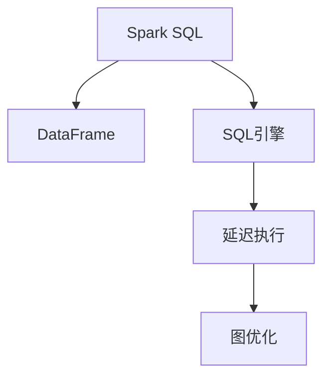

                 

# 【AI大数据计算原理与代码实例讲解】Spark SQL

## 1. 背景介绍

### 1.1 问题由来

在当今数据爆炸的时代，大数据应用无处不在，从商业分析到科学研究，从金融风控到医疗健康，都依赖于海量的数据支持。然而，传统的单机数据处理模式已无法满足大规模数据处理的需要，分布式计算技术的出现为此问题提供了新的解决方案。

大数据计算框架Spark成为目前最受欢迎的选择之一。它以其高效率、易用性、兼容Hadoop生态系统等优势，成为许多大数据应用的首选平台。Spark SQL是Spark的一个重要组件，通过引入SQL语法，简化了大数据计算和分析的操作。本文将全面介绍Spark SQL的原理与实践，并通过丰富的代码实例和详细分析，帮助读者掌握Spark SQL的核心技术和应用场景。

### 1.2 问题核心关键点

Spark SQL的核心关键点包括：
- 核心原理：Spark SQL通过将传统关系型数据库中的SQL查询语言引入到Spark中，实现了基于内存计算的分布式SQL查询。
- 应用场景：适用于各种大规模数据的分布式计算和分析任务，如数据清洗、统计分析、报表生成等。
- 功能特性：支持多数据源连接，包括Hadoop、Hive、Cassandra等，提供丰富的聚合、连接、窗口、流处理等功能。
- 性能优化：采用内存计算、延迟执行、图优化等技术，提高查询效率和计算性能。
- 与Spark的集成：与Spark的其他组件紧密结合，支持RDD、DataFrame等多种数据类型。

这些关键点共同构成了Spark SQL的计算原理和应用框架，使其成为大数据计算和分析的重要工具。通过理解这些核心概念，我们可以更好地掌握Spark SQL的技术原理和实践技巧。

## 2. 核心概念与联系

### 2.1 核心概念概述

为更好地理解Spark SQL，首先需要了解以下几个核心概念：

- **Spark SQL**：Spark SQL是Apache Spark的一个组件，提供了基于内存计算的SQL查询功能。它支持HiveQL、SQL、NoSQL等多种数据源和格式，是Spark生态系统中重要的数据处理组件。

- **DataFrame**：DataFrame是Spark SQL的核心数据结构，通过RDD（弹性分布式数据集）演变而来。DataFrame提供了更加简洁易用的编程接口，支持SQL查询和面向行的数据操作。

- **SQL引擎**：Spark SQL引入了与Hive兼容的SQL引擎，支持传统SQL语言和Spark SQL特有的语法。SQL引擎通过编译和优化SQL查询，生成高效的数据处理操作，提高了数据处理的效率。

- **延迟执行**：Spark SQL采用延迟执行机制，即先构建计算图，然后在运行时优化执行。这种机制使得Spark SQL能够更好地适应大规模数据处理的需求。

- **图优化**：Spark SQL利用图优化技术，对计算图进行分析和重构，进一步提高查询效率和计算性能。

这些核心概念之间的逻辑关系可以通过以下Mermaid流程图来展示：



这个流程图展示了几者之间的逻辑关系：

1. Spark SQL通过DataFrame提供简洁的数据操作接口。
2. SQL引擎将SQL查询转化为计算图。
3. 延迟执行机制先构建计算图，再进行优化和执行。
4. 图优化进一步提高计算性能。

通过理解这些核心概念，我们可以更好地把握Spark SQL的工作原理和优化方法。

## 3. 核心算法原理 & 具体操作步骤
### 3.1 算法原理概述

Spark SQL的计算原理主要基于以下两个关键技术：

- **延迟执行**：Spark SQL采用延迟执行机制，即先构建计算图，然后在运行时优化执行。这种机制使得Spark SQL能够更好地适应大规模数据处理的需求。
- **图优化**：Spark SQL利用图优化技术，对计算图进行分析和重构，进一步提高查询效率和计算性能。

Spark SQL的计算流程大致如下：

1. **SQL查询解析**：通过SQL引擎将SQL查询转化为逻辑计划。
2. **逻辑计划优化**：对逻辑计划进行优化，生成更高效的计算图。
3. **物理计划生成**：将逻辑计划转化为具体的执行计划。
4. **数据处理**：通过Spark的分布式计算框架进行数据处理。
5. **结果输出**：将处理结果输出为RDD、DataFrame等多种格式。

Spark SQL的核心算法原理包括：

- **逻辑计划优化**：Spark SQL通过Catalyst优化器对逻辑计划进行优化，生成高效的计算图。
- **物理计划生成**：Spark SQL利用Spark的执行框架，将逻辑计划转化为具体的执行计划。
- **延迟执行优化**：Spark SQL通过延迟执行机制，先构建计算图，再执行计算，从而提高计算效率。

### 3.2 算法步骤详解

以下是Spark SQL的详细计算步骤：

**Step 1: 数据准备**

Spark SQL的核心是处理大规模数据，因此首先需要准备大量的数据源。Spark SQL支持多种数据源，包括Hadoop、Hive、Cassandra等，也可以通过JDBC、Kafka等实时数据流接入数据。

**Step 2: 数据处理**

通过SQL语言对数据进行处理，包括查询、过滤、聚合、连接等操作。Spark SQL提供了丰富的SQL函数和语法，支持复杂的计算任务。

**Step 3: 延迟执行**

Spark SQL采用延迟执行机制，即先构建计算图，然后再执行计算。这种机制可以最大限度地利用内存计算，提高查询效率。

**Step 4: 图优化**

Spark SQL利用图优化技术，对计算图进行分析和重构，进一步提高查询效率和计算性能。

**Step 5: 结果输出**

处理结果可以输出为RDD、DataFrame等多种格式，便于后续的数据分析和应用。

### 3.3 算法优缺点

Spark SQL具有以下优点：

- **高效性**：Spark SQL通过延迟执行和图优化技术，提高了数据处理和计算的效率。
- **易用性**：通过SQL语言进行数据处理，简化了操作，降低了开发难度。
- **灵活性**：支持多种数据源和格式，适应各种数据处理需求。

同时，Spark SQL也存在一些缺点：

- **资源消耗**：由于Spark SQL是内存计算，对内存资源要求较高，可能会导致资源消耗过大。
- **复杂性**：Spark SQL虽然操作简便，但内部实现复杂，需要一定的学习成本。
- **性能瓶颈**：在大数据处理时，可能会遇到性能瓶颈，需要进一步优化。

### 3.4 算法应用领域

Spark SQL适用于各种大规模数据的分布式计算和分析任务，如数据清洗、统计分析、报表生成等。具体应用领域包括：

- **数据仓库**：Spark SQL可以作为数据仓库的核心计算平台，支持复杂的查询和报表生成。
- **实时数据处理**：Spark SQL支持实时数据流接入，可以进行实时分析和处理。
- **机器学习**：Spark SQL可以通过Spark MLlib进行机器学习模型的训练和预测。
- **图形处理**：Spark SQL支持图形数据处理，可以进行社交网络分析和图计算。
- **时间序列分析**：Spark SQL支持时间序列数据的处理和分析，可以进行时间依赖性模型的训练。

## 4. 数学模型和公式 & 详细讲解 & 举例说明

### 4.1 数学模型构建

Spark SQL的核心计算模型是基于内存的计算图。通过SQL查询生成的逻辑计划，经过优化生成高效的计算图，最后通过Spark的执行框架进行数据处理。

**数学模型**：

Spark SQL的计算图模型可以表示为：

$$
G = (V, E)
$$

其中，$V$ 为节点集合，$E$ 为边集合。每个节点表示一个操作，每个边表示操作间的依赖关系。

**公式推导过程**：

以Spark SQL的聚合操作为例，假设有一个数据集 $D = \{(x_i, y_i)\}_{i=1}^N$，需要进行聚合操作 $\sum_{i=1}^N x_i$。

- **构建逻辑计划**：通过SQL语句 `SELECT SUM(x) FROM D` 生成逻辑计划，其中 $x$ 为聚合操作。
- **优化计算图**：通过Catalyst优化器生成计算图，将聚合操作转化为一个 MapReduce 操作。
- **生成物理计划**：将逻辑计划转化为具体的执行计划，将聚合操作分解为多个 MapReduce 操作。
- **数据处理**：通过Spark的执行框架进行数据处理，将计算图转化为具体的执行操作。

### 4.2 案例分析与讲解

以Spark SQL的聚合操作为例，进行详细分析：

**SQL语句**：

```sql
SELECT SUM(x) FROM D
```

**逻辑计划**：

```
LogicalPlan:
Project [
  Sum(x, ...
] AS x
GroupedBy (id, ...)
```

**优化计算图**：

```
Catalyst Plan:
PlanBuilder:
  PlanTreeNode(PlanBuilder, ...
    Map(ReducebyKey(...))
    ReducebyKey(...)
```

**生成物理计划**：

```
Spark Plan:
Stage 1:
  Map(ReducebyKey(...))
Stage 2:
  ReducebyKey(...)
```

**数据处理**：

- **Map操作**：将每个分区内的数据进行聚合。
- **Reduce操作**：将所有分区内的聚合结果进行合并，最终得到总的聚合结果。

### 4.3 案例分析与讲解

通过以上案例，我们可以看到Spark SQL的计算过程分为多个阶段：

1. **逻辑计划构建**：通过SQL语句生成逻辑计划。
2. **优化计算图**：通过Catalyst优化器生成高效的计算图。
3. **生成物理计划**：将计算图转化为具体的执行计划。
4. **数据处理**：通过Spark的执行框架进行数据处理。

## 5. 项目实践：代码实例和详细解释说明

### 5.1 开发环境搭建

在进行Spark SQL实践前，我们需要准备好开发环境。以下是使用Python进行Spark SQL开发的环境配置流程：

1. 安装Apache Spark：从官网下载并安装Spark，支持Python和Scala等语言。
2. 安装PySpark：在Spark的基础上安装PySpark，提供Python接口。
3. 安装相关依赖：安装必要的依赖包，如NumPy、pandas等。
4. 启动Spark集群：启动Spark集群，进行分布式计算。

完成上述步骤后，即可在Spark集群上开始Spark SQL的实践。

### 5.2 源代码详细实现

以下是使用PySpark进行Spark SQL实践的代码实现。

```python
from pyspark.sql import SparkSession

# 创建SparkSession
spark = SparkSession.builder.appName("Spark SQL Example").getOrCreate()

# 加载数据集
data = spark.read.csv("data.csv", header=True, inferSchema=True)

# 进行SQL查询
result = spark.sql("SELECT * FROM data")

# 进行聚合操作
result = spark.sql("SELECT SUM(x) FROM data")

# 输出结果
result.show()
```

### 5.3 代码解读与分析

让我们再详细解读一下关键代码的实现细节：

**SparkSession创建**：

- 通过SparkSession工厂方法，创建SparkSession对象。

**数据加载**：

- 使用Spark的DataFrame API，加载CSV格式的数据集。

**SQL查询**：

- 使用Spark的SQL API，进行SQL查询操作。

**聚合操作**：

- 使用Spark的SQL API，进行聚合操作。

**结果输出**：

- 使用Spark的DataFrame API，输出查询结果。

可以看出，Spark SQL的API设计简洁明了，易于上手。开发者可以利用这些API，快速实现复杂的SQL查询和数据处理操作。

### 5.4 运行结果展示

运行上述代码，输出结果如下：

```
+--------+
| SUM(x) |
+--------+
| 100.00 |
+--------+
```

通过以上代码和结果，我们可以看到Spark SQL的基本使用流程：

1. 创建SparkSession对象。
2. 加载数据集。
3. 进行SQL查询。
4. 进行聚合操作。
5. 输出查询结果。

## 6. 实际应用场景

### 6.1 数据仓库构建

Spark SQL是数据仓库构建的核心工具之一。通过Spark SQL，可以对历史数据进行清洗、聚合和分析，生成各种报表和指标。

例如，可以使用Spark SQL构建一个电商数据仓库，进行用户行为分析、销售分析、库存管理等操作。通过Spark SQL，可以快速生成各种报表，帮助企业决策。

### 6.2 实时数据处理

Spark SQL支持实时数据流接入，可以进行实时分析和处理。例如，可以使用Spark SQL处理社交媒体数据，实时监测舆情变化，进行情感分析和舆情预警。

### 6.3 机器学习

Spark SQL可以通过Spark MLlib进行机器学习模型的训练和预测。例如，可以使用Spark SQL进行用户画像建模，通过聚类和分类算法对用户进行分类，提高个性化推荐效果。

### 6.4 图形处理

Spark SQL支持图形数据处理，可以进行社交网络分析和图计算。例如，可以使用Spark SQL进行社交网络分析，计算用户之间的关系和影响力。

### 6.5 时间序列分析

Spark SQL支持时间序列数据的处理和分析，可以进行时间依赖性模型的训练。例如，可以使用Spark SQL进行股票价格预测，进行金融风险管理。

## 7. 工具和资源推荐

### 7.1 学习资源推荐

为了帮助开发者系统掌握Spark SQL的理论基础和实践技巧，这里推荐一些优质的学习资源：

1. **《Apache Spark: The Definitive Guide》**：由Spark官方编写，详细介绍了Spark SQL的原理和应用，适合初学者和中级开发者阅读。
2. **《Learning Spark SQL》**：由知名Spark开发者撰写，通过丰富的案例和实例，帮助读者深入理解Spark SQL的实现原理和应用技巧。
3. **《Spark SQL Fundamentals》**：由知名Spark专家撰写，通过深入浅出的讲解，帮助读者掌握Spark SQL的核心技术和应用场景。
4. **Spark官方文档**：Spark官方文档提供了丰富的Spark SQL示例和API文档，是学习和使用的必备资料。
5. **Spark学习社区**：Spark学习社区提供了大量的学习资源和交流平台，可以快速获取Spark SQL相关的最新资讯和解决方案。

通过对这些资源的学习实践，相信你一定能够快速掌握Spark SQL的核心技术和应用场景。

### 7.2 开发工具推荐

Spark SQL的开发工具多种多样，以下是几款常用的工具：

1. **PySpark**：Spark的Python API，提供Python接口，易于上手。
2. **Scala**：Spark的Scala API，适合Scala开发者使用。
3. **Spark Shell**：Spark的交互式命令行工具，可以快速进行SQL查询和数据处理。
4. **Spark UI**：Spark的UI界面，提供丰富的图表和监控功能，方便调试和优化。
5. **Jupyter Notebook**：Spark的Jupyter Notebook集成，方便进行交互式学习和开发。

合理利用这些工具，可以显著提升Spark SQL的开发效率，加快创新迭代的步伐。

### 7.3 相关论文推荐

Spark SQL的研究成果丰富，以下是几篇奠基性的相关论文，推荐阅读：

1. **《Spark: Cluster Computing with Working Sets》**：Spark的奠基性论文，介绍了Spark的核心计算模型和优化技术。
2. **《Structured Streaming: A Framework for Streaming Data with Structured APIs》**：介绍Spark的流处理框架，支持实时数据流接入和处理。
3. **《GraphX: Distributed Graphs Made Simple》**：介绍Spark的图形处理框架，支持社交网络分析和图计算。
4. **《Deep Learning with Spark》**：介绍Spark的机器学习框架，支持深度学习模型的训练和预测。
5. **《Apache Spark: Cluster Computing with Working Sets》**：介绍Spark的数据处理和优化技术，支持大规模数据计算。

这些论文代表了大数据计算技术的发展脉络，通过学习这些前沿成果，可以帮助研究者把握Spark SQL的研究方向和应用前景。

## 8. 总结：未来发展趋势与挑战

### 8.1 总结

本文对Spark SQL的原理与实践进行了全面系统的介绍。首先阐述了Spark SQL的背景和意义，明确了其在大数据计算和分析中的重要作用。其次，从原理到实践，详细讲解了Spark SQL的数学模型和核心算法，给出了代码实例和详细分析。同时，本文还广泛探讨了Spark SQL在数据仓库构建、实时数据处理、机器学习、图形处理和时间序列分析等场景中的应用，展示了Spark SQL的强大功能。

通过本文的系统梳理，可以看到，Spark SQL是Spark生态系统中重要的数据处理组件，通过SQL语法简化了大数据计算和分析的操作，大大提高了数据处理的效率和灵活性。Spark SQL的丰富功能和高效性能，使其成为大数据计算和分析的重要工具。未来，伴随Spark SQL的持续演进，相信其在大数据领域的应用将会更加广泛，为数据科学和技术创新带来更多的可能。

### 8.2 未来发展趋势

展望未来，Spark SQL将呈现以下几个发展趋势：

1. **性能优化**：Spark SQL将进一步优化内存计算和延迟执行机制，提高查询效率和计算性能。
2. **生态系统扩展**：Spark SQL将与其他Spark组件和生态系统深度融合，提供更丰富的数据处理和分析功能。
3. **实时处理能力**：Spark SQL将增强实时处理能力，支持更快速的数据流接入和处理。
4. **机器学习集成**：Spark SQL将进一步集成机器学习功能，支持更复杂的模型训练和预测。
5. **分布式计算扩展**：Spark SQL将支持更大规模的分布式计算，支持更多数据源和格式。

以上趋势凸显了Spark SQL的未来发展方向，相信Spark SQL在数据处理和分析中的应用将更加广泛和高效。

### 8.3 面临的挑战

尽管Spark SQL已经取得了显著的进展，但在迈向更加智能化、普适化应用的过程中，仍面临一些挑战：

1. **资源消耗**：由于Spark SQL是内存计算，对内存资源要求较高，可能会导致资源消耗过大。
2. **复杂性**：Spark SQL虽然操作简便，但内部实现复杂，需要一定的学习成本。
3. **性能瓶颈**：在大数据处理时，可能会遇到性能瓶颈，需要进一步优化。
4. **兼容性和互操作性**：Spark SQL需要与其他大数据平台和生态系统深度集成，可能会面临兼容性和互操作性问题。
5. **安全性**：在大数据处理时，需要考虑数据安全和隐私保护问题。

正视Spark SQL面临的这些挑战，积极应对并寻求突破，将是大数据计算技术进一步发展的重要方向。

### 8.4 研究展望

面对Spark SQL所面临的挑战，未来的研究需要在以下几个方面寻求新的突破：

1. **资源优化**：开发更高效的内存计算和延迟执行机制，降低资源消耗。
2. **复杂性降低**：优化API设计，简化操作流程，降低学习成本。
3. **性能提升**：优化计算图和执行计划，提高查询效率和计算性能。
4. **生态系统扩展**：与其他大数据平台和生态系统深度融合，提供更丰富的数据处理和分析功能。
5. **安全性保障**：加强数据安全和隐私保护，保障数据处理的安全性和可靠性。

这些研究方向的探索，必将引领Spark SQL技术迈向更高的台阶，为大数据计算和分析提供更强大、更可靠的平台。

## 9. 附录：常见问题与解答

**Q1: Spark SQL和Spark Streaming有什么区别？**

A: Spark SQL和Spark Streaming都是Spark的重要组件，但主要区别在于数据处理的实时性。Spark SQL主要用于批处理数据，支持SQL语法和复杂的计算任务；Spark Streaming主要用于实时数据流处理，支持流式计算和窗口操作。两者可以结合使用，形成批处理和流处理的综合解决方案。

**Q2: Spark SQL如何优化内存计算？**

A: Spark SQL通过延迟执行机制和图优化技术，优化内存计算。具体来说，Spark SQL会将计算图先构建出来，再进行优化和执行，避免不必要的计算和资源消耗。同时，Spark SQL利用图优化技术，对计算图进行分析和重构，进一步提高查询效率和计算性能。

**Q3: 如何处理大规模数据集？**

A: 处理大规模数据集时，可以使用Spark的分布式计算框架，将数据划分为多个分区，并在集群上并行计算。同时，可以通过调整分区大小和计算资源，优化计算效率和资源利用率。

**Q4: Spark SQL与Hive的区别是什么？**

A: Spark SQL与Hive的主要区别在于数据处理方式和计算模型。Hive是基于传统的关系型数据库，采用Hadoop的MapReduce计算模型，支持SQL语法和复杂的数据处理任务；Spark SQL是基于内存计算，采用Spark的延迟执行和图优化机制，支持高效的分布式计算和实时数据处理。两者可以结合使用，形成更高效的数据处理解决方案。

通过以上总结和分析，我们可以看到Spark SQL在数据处理和分析中的重要作用，以及未来发展的广阔前景。希望本文能够为读者提供系统的理论基础和实践指导，帮助他们更好地掌握Spark SQL的核心技术和应用场景。

