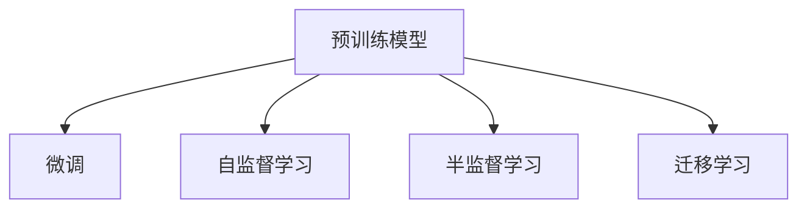
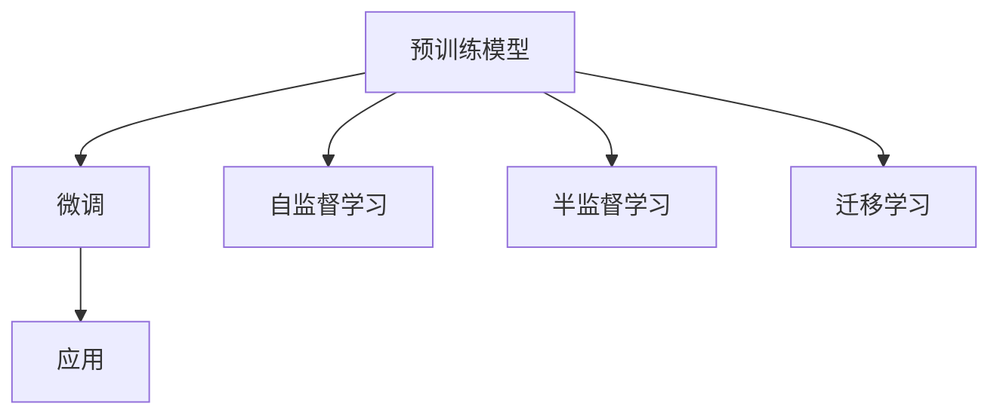

                 

# 【LangChain编程：从入门到实践】batch

## 1. 背景介绍

随着人工智能技术的不断进步，包括自然语言处理(NLP)在内的诸多领域，开始逐步走向智能化的高峰。在这样的大背景下，许多研究者和开发者纷纷开始探索使用最新的大规模预训练模型（Large Pre-trained Models, LPMs），例如BERT、GPT-3等，来提升模型性能。为了更好地适配不同领域的应用需求，一种新的编程范式应运而生——LangChain编程。

LangChain编程的核心思想是：将预训练模型看作是一个强大的"特征提取器"，通过在特定的任务上进行微调（Fine-Tuning），来提升模型在特定任务上的性能。这种编程方式简单、高效，已经在NLP的众多任务中得到了广泛应用。本文将详细介绍LangChain编程的原理、步骤、应用、优缺点等，并给出具体的代码实现示例，帮助读者快速入门。

## 2. 核心概念与联系

### 2.1 核心概念概述

在进行LangChain编程时，有几个关键概念需要理解：

- **预训练模型**：通常采用Transformer架构，如BERT、GPT等，通过大规模无标签文本数据进行预训练，获得通用的语言表示。

- **微调（Fine-Tuning）**：在预训练模型的基础上，使用下游任务的少量标注数据进行有监督学习，优化模型在特定任务上的性能。

- **自监督学习**：在没有标签的情况下，通过设计的自监督任务（如掩码语言模型），训练预训练模型。

- **半监督学习**：结合少量标注数据和大量未标注数据进行训练，提高模型性能。

- **迁移学习**：利用预训练模型在多个任务之间迁移知识和技能。

这些概念之间的联系如下图所示：



### 2.2 核心概念原理和架构的 Mermaid 流程图

以下是一个简单而直观的Mermaid流程图，展示了预训练、微调和应用的关系：



## 3. 核心算法原理 & 具体操作步骤

### 3.1 算法原理概述

LangChain编程的核心算法原理基于监督学习。具体而言，在预训练模型（如BERT、GPT）的基础上，使用下游任务的标注数据进行微调，通过有监督学习提升模型在特定任务上的性能。

假设有一个预训练模型$M_{\theta}$，其在某个任务上的标注数据集为$D=\{(x_i, y_i)\}_{i=1}^N$，其中$x_i$为输入数据，$y_i$为标签。微调的目标是找到一个新的参数$\hat{\theta}$，使得模型在任务$T$上的预测$y$与真实标签$y_i$的差距最小。这一过程可以表示为：

$$
\hat{\theta}=\mathop{\arg\min}_{\theta} \mathcal{L}(M_{\theta},D)
$$

其中，$\mathcal{L}$为损失函数，常用的有交叉熵损失、均方误差损失等。

### 3.2 算法步骤详解

LangChain编程的具体步骤如下：

1. **准备预训练模型和数据集**：选择预训练模型$M_{\theta}$，准备下游任务$T$的标注数据集$D$。

2. **添加任务适配层**：根据任务类型，在预训练模型顶层设计合适的输出层和损失函数。例如，对于分类任务，通常会添加一个线性分类器和交叉熵损失函数。

3. **设置微调超参数**：包括学习率、批大小、迭代轮数、正则化强度等。

4. **执行梯度训练**：使用梯度下降等优化算法更新模型参数$\theta$，最小化损失函数$\mathcal{L}$。

5. **测试和部署**：在测试集上评估微调后模型的性能，并将模型部署到实际应用中。

### 3.3 算法优缺点

#### 优点：
- **高效性**：使用预训练模型进行微调，可以大大减少从头训练的时间。
- **泛化能力**：预训练模型在大规模数据上学习到的通用语言知识，可以在下游任务上有效迁移。
- **可解释性**：模型结构透明，可以通过梯度分析、特征可视化等方式进行解释。

#### 缺点：
- **标注数据需求**：微调需要大量标注数据，标注成本较高。
- **过拟合风险**：微调模型可能会过度适应训练数据，导致泛化性能下降。
- **计算资源消耗**：微调模型通常参数量较大，计算资源需求高。

### 3.4 算法应用领域

LangChain编程已经在许多领域得到应用，包括但不限于：

- **文本分类**：如情感分析、主题分类等。
- **命名实体识别**：识别文本中的人名、地名、机构名等实体。
- **关系抽取**：从文本中抽取实体之间的关系。
- **问答系统**：回答自然语言问题。
- **机器翻译**：将源语言文本翻译成目标语言。
- **文本摘要**：将长文本压缩成简短摘要。
- **对话系统**：使机器能够与人自然对话。

## 4. 数学模型和公式 & 详细讲解 & 举例说明

### 4.1 数学模型构建

以文本分类为例，假设输入为文本$x$，输出为标签$y$，模型为$M_{\theta}$，损失函数为交叉熵损失。

构建模型$M_{\theta}$的输出层：

$$
M_{\theta}(x) = \text{softmax}(\theta^T x)
$$

其中，$x$为输入文本的词向量表示，$\theta$为模型参数，$softmax$函数将输出转换为概率分布。

交叉熵损失函数为：

$$
\mathcal{L}(\theta) = -\frac{1}{N}\sum_{i=1}^N y_i\log M_{\theta}(x_i) + (1-y_i)\log(1-M_{\theta}(x_i))
$$

### 4.2 公式推导过程

对于每一个训练样本$(x_i, y_i)$，模型预测的概率分布为：

$$
\hat{y} = \text{softmax}(\theta^T x_i)
$$

交叉熵损失为：

$$
\mathcal{L}_i = -y_i\log \hat{y}_i - (1-y_i)\log(1-\hat{y}_i)
$$

将损失函数扩展到整个数据集，得：

$$
\mathcal{L}(\theta) = \frac{1}{N}\sum_{i=1}^N \mathcal{L}_i
$$

梯度下降优化算法将最小化损失函数$\mathcal{L}(\theta)$：

$$
\theta \leftarrow \theta - \eta \nabla_{\theta}\mathcal{L}(\theta)
$$

其中，$\eta$为学习率。

### 4.3 案例分析与讲解

假设有一个简单的情感分类任务，使用预训练模型BERT进行微调。模型训练集的样本为：

| 输入文本 | 标签 |
| --- | --- |
| I love this movie! | 1 |
| This movie is terrible. | 0 |

模型输出的概率分布为：

| 输入文本 | 标签概率 |
| --- | --- |
| I love this movie! | [0.9, 0.1] |
| This movie is terrible. | [0.1, 0.9] |

计算损失函数：

$$
\mathcal{L}(\theta) = -\frac{1}{2}\log 0.9 - \frac{1}{2}\log 0.1
$$

计算梯度：

$$
\nabla_{\theta}\mathcal{L}(\theta) = \frac{1}{2}[\frac{1}{0.9}-\frac{1}{1-0.9}]
$$

使用梯度下降更新模型参数：

$$
\theta \leftarrow \theta - \eta \nabla_{\theta}\mathcal{L}(\theta)
$$

重复上述步骤，直至损失函数收敛。

## 5. 项目实践：代码实例和详细解释说明

### 5.1 开发环境搭建

在进行LangChain编程之前，需要准备相应的开发环境。这里推荐使用Python语言，配合PyTorch深度学习框架。以下是Python环境搭建的详细步骤：

1. **安装Python**：从官网下载安装最新版本的Python。

2. **安装PyTorch**：使用以下命令安装PyTorch：

   ```bash
   pip install torch torchvision torchaudio
   ```

3. **安装相关库**：安装其他必要的库，如NumPy、Pandas、Matplotlib等：

   ```bash
   pip install numpy pandas matplotlib scikit-learn
   ```

4. **安装transformers库**：使用以下命令安装Transformers库：

   ```bash
   pip install transformers
   ```

5. **安装FastAI**：FastAI是一个深度学习框架，提供了许多高级功能，方便模型训练和评估：

   ```bash
   pip install fastai
   ```

### 5.2 源代码详细实现

以下是一个使用BERT进行情感分类的例子：

```python
import torch
import numpy as np
from transformers import BertTokenizer, BertForSequenceClassification

# 初始化模型和分词器
model = BertForSequenceClassification.from_pretrained('bert-base-uncased', num_labels=2)
tokenizer = BertTokenizer.from_pretrained('bert-base-uncased')

# 准备训练数据
train_data = [("I love this movie!", 1), ("This movie is terrible.", 0)]

# 分词和编码
train_encodings = tokenizer(train_data, return_tensors="pt", padding=True, truncation=True)

# 提取特征和标签
train_features = train_encodings["input_ids"].to(device)
train_labels = torch.tensor(train_encodings["labels"]).to(device)

# 设置训练参数
optimizer = torch.optim.Adam(model.parameters(), lr=2e-5)
device = torch.device("cuda" if torch.cuda.is_available() else "cpu")

# 训练模型
for epoch in range(10):
    model.train()
    loss = 0
    for i, (features, labels) in enumerate(train_features, 0):
        with torch.no_grad():
            predictions = model(features)
        loss += cross_entropy(predictions, labels)
        optimizer.zero_grad()
        loss.backward()
        optimizer.step()
    print(f"Epoch {epoch+1}, Loss: {loss:.4f}")
```

### 5.3 代码解读与分析

1. **初始化模型和分词器**：使用`BertForSequenceClassification`和`BertTokenizer`初始化模型和分词器。

2. **准备训练数据**：将文本数据和标签转换为分词器和模型所需的格式。

3. **分词和编码**：使用分词器对文本进行分词，并将其编码为模型所需的格式。

4. **训练模型**：使用Adam优化器进行模型训练，交叉熵损失作为优化目标。

### 5.4 运行结果展示

在训练完成后，可以使用以下代码对模型进行评估：

```python
import torch
from transformers import BertForSequenceClassification, BertTokenizer

# 加载模型和分词器
model = BertForSequenceClassification.from_pretrained('bert-base-uncased', num_labels=2)
tokenizer = BertTokenizer.from_pretrained('bert-base-uncased')

# 准备测试数据
test_data = [("This movie is great!", 1), ("I hate this movie.", 0)]

# 分词和编码
test_encodings = tokenizer(test_data, return_tensors="pt", padding=True, truncation=True)

# 提取特征和标签
test_features = test_encodings["input_ids"].to(device)
test_labels = torch.tensor(test_encodings["labels"]).to(device)

# 评估模型
model.eval()
with torch.no_grad():
    predictions = model(test_features)
    labels = test_labels
    print(f"Accuracy: {accuracy(predictions, labels):.2f}")
```

通过这个简单的例子，我们展示了如何使用BERT进行文本分类任务。通过调整模型和训练参数，可以实现更复杂的应用需求。

## 6. 实际应用场景

### 6.1 智能客服系统

智能客服系统可以通过LangChain编程，利用预训练模型进行微调，实现自动化客服。例如，可以使用微调后的BERT模型处理用户咨询问题，生成自然流畅的回答。

### 6.2 金融舆情监测

金融领域需要实时监测网络舆情，使用预训练模型进行微调，可以自动识别和过滤负面信息，减少风险。

### 6.3 个性化推荐系统

在电商领域，可以使用预训练模型进行微调，实现个性化推荐。例如，可以使用微调后的BERT模型分析用户行为数据，推荐相关商品。

### 6.4 未来应用展望

LangChain编程的未来发展趋势包括：

- **多模态学习**：结合文本、图像、语音等多种数据类型，实现多模态微调。
- **参数高效微调**：只更新少量参数，提高微调效率。
- **自适应学习**：使用在线学习或增量学习，提升模型适应新数据的能力。

## 7. 工具和资源推荐

### 7.1 学习资源推荐

- **《自然语言处理综述与实践》**：介绍了自然语言处理的基本概念和最新研究进展。
- **《深度学习与自然语言处理》**：讲解深度学习在自然语言处理中的应用。
- **HuggingFace官方文档**：提供了详细的BERT等预训练模型的使用方法和示例代码。

### 7.2 开发工具推荐

- **PyTorch**：深度学习框架，支持动态图和静态图计算。
- **FastAI**：基于PyTorch的高级深度学习框架，提供了更方便的模型训练和评估功能。
- **Jupyter Notebook**：交互式编程环境，方便进行数据处理和模型实验。

### 7.3 相关论文推荐

- **BERT: Pre-training of Deep Bidirectional Transformers for Language Understanding**：提出BERT预训练模型，使用掩码语言模型进行训练。
- **Attention is All You Need**：介绍Transformer结构，并使用Transformer进行预训练。
- **Longformer: The Long-Document Transformer**：提出Longformer模型，适用于处理长文本。

## 8. 总结：未来发展趋势与挑战

### 8.1 研究成果总结

LangChain编程已经成为自然语言处理中的重要范式，广泛应用于文本分类、命名实体识别、机器翻译等多个领域。该方法利用预训练模型的通用语言知识，通过微调获得任务特定的性能提升。

### 8.2 未来发展趋势

- **模型规模扩大**：随着计算资源和数据量的增加，预训练模型的规模将不断扩大。
- **迁移学习应用**：预训练模型将在更多领域和任务中进行迁移学习，提升模型性能。
- **自适应学习**：模型将具备自适应学习的能力，不断从新数据中学习。

### 8.3 面临的挑战

- **数据需求**：预训练模型和微调任务需要大量标注数据，获取数据成本较高。
- **过拟合问题**：微调模型可能会过度适应训练数据，导致泛化性能下降。
- **计算资源消耗**：大规模模型需要较高的计算资源，需要优化模型结构和计算效率。

### 8.4 研究展望

未来的研究需要关注以下方向：

- **少样本学习**：利用少量标注数据进行微调，提高模型性能。
- **参数高效微调**：只更新少量参数，减少计算资源消耗。
- **多模态融合**：结合文本、图像、语音等多种数据类型，提升模型性能。

## 9. 附录：常见问题与解答

**Q1：如何选择合适的预训练模型？**

A: 根据任务类型和数据规模选择预训练模型。例如，对于文本分类任务，BERT、GPT-2等模型表现良好；对于图像识别任务，ResNet、VGG等模型更合适。

**Q2：微调时如何设置学习率？**

A: 一般建议从0.001开始，逐步减小至0.0001。如果模型性能不佳，可以尝试使用学习率调度策略，如学习率衰减、梯度累积等。

**Q3：如何缓解过拟合问题？**

A: 使用数据增强、正则化、早停等方法缓解过拟合问题。例如，可以使用BatchNorm、Dropout等技术。

**Q4：如何在生产环境中部署微调模型？**

A: 使用容器化技术，如Docker、Kubernetes等，将模型封装为服务，方便部署和管理。

---

作者：禅与计算机程序设计艺术 / Zen and the Art of Computer Programming

