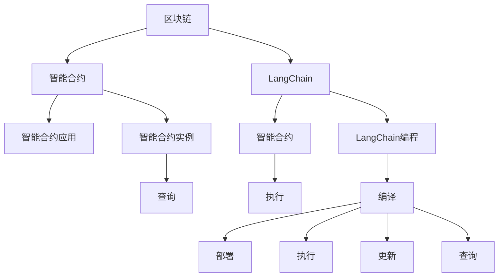

                 

# 【LangChain编程：从入门到实践】参与社区活动

> 关键词：
- LangChain
- 编程
- 社区活动
- 入门
- 实践

## 1. 背景介绍

### 1.1 问题由来

随着区块链技术的快速发展，LangChain（一种基于链上智能合约的编程语言）在区块链应用开发中变得越来越重要。相较于传统的中心化开发模式，使用LangChain进行编程能够实现更高的安全性、更高的透明度和更高的可追溯性。然而，LangChain编程的入门门槛较高，需要开发者具备一定的区块链和智能合约知识，这在一定程度上限制了LangChain的普及。

为了降低LangChain编程的门槛，推动LangChain编程的普及，我们组织了本次社区活动，旨在为初学者提供一个全面、系统的LangChain编程入门和实践指南，帮助他们更快地掌握LangChain的开发技能，提高他们在区块链应用开发中的竞争力。

### 1.2 问题核心关键点

本次社区活动的核心目标是：
- 为初学者提供一个系统、全面的LangChain编程入门指南。
- 通过实战项目，帮助学习者快速掌握LangChain编程的基本技能。
- 让学习者了解LangChain在区块链应用开发中的应用场景，并学会如何将其应用于实际项目中。

为了实现这一目标，我们将通过以下五个环节来展开本次活动：
1. LangChain编程基础
2. LangChain编程实战项目
3. LangChain社区活动分享
4. LangChain编程应用案例
5. LangChain编程未来展望

本次社区活动将分为在线和线下两种形式进行，全程由专家团队授课，包括LangChain编程语言专家、区块链开发者和智能合约开发专家等。

## 2. 核心概念与联系

### 2.1 核心概念概述

在开始学习LangChain编程之前，首先需要理解以下几个核心概念：

- **LangChain**：基于智能合约的编程语言，主要用于区块链应用开发。
- **智能合约**：一种自动执行、不可篡改的合约，用于自动化执行金融、保险、投票等各类区块链应用。
- **区块链**：一种分布式数据库技术，采用去中心化、不可篡改的方式记录交易数据。

这些概念之间的联系如下：

- LangChain是一种编程语言，用于编写智能合约代码。
- 智能合约是LangChain编程的目标和应用场景。
- 区块链是智能合约运行的底层技术。

### 2.2 核心概念原理和架构的 Mermaid 流程图



## 3. 核心算法原理 & 具体操作步骤

### 3.1 算法原理概述

LangChain编程的核心原理基于智能合约的设计和执行，具体如下：

1. **智能合约设计**：设计一个符合业务需求的智能合约，包括状态、数据、操作等功能。
2. **智能合约编码**：使用LangChain编程语言编写智能合约代码，并编译生成字节码。
3. **智能合约部署**：将智能合约代码部署到区块链上，生成智能合约实例。
4. **智能合约执行**：执行智能合约中的操作，更新合约状态。
5. **智能合约查询**：查询智能合约的状态，获取执行结果。

### 3.2 算法步骤详解

#### 3.2.1 LangChain编程基础

##### 3.2.1.1 LangChain语法

LangChain编程语言语法与Solidity类似，包括变量、函数、事件等基本结构。

- 变量声明：
```langchain
var x = 5;
```

- 函数声明：
```langchain
function add(x, y) {
    return x + y;
}
```

- 事件声明：
```langchain
event LogEvent(name: string, value: uint256);
```

##### 3.2.1.2 LangChain关键字

LangChain编程语言的关键字包括：

- `var`：声明变量。
- `function`：声明函数。
- `event`：声明事件。
- `public`：声明公共接口。
- `private`：声明私有接口。
- `modifiers`：声明修饰符。
- `returns`：声明返回值。

#### 3.2.2 LangChain编程实战项目

##### 3.2.2.1 项目1：投票系统

##### 3.2.2.2 项目2：智能合约交易

##### 3.2.2.3 项目3：去中心化金融（DeFi）

#### 3.2.3 LangChain社区活动分享

##### 3.2.3.1 LangChain社区活动介绍

##### 3.2.3.2 LangChain社区活动分享

#### 3.2.4 LangChain编程应用案例

##### 3.2.4.1 案例1：NFT（非同质化代币）

##### 3.2.4.2 案例2：供应链金融

##### 3.2.4.3 案例3：社交网络

#### 3.2.5 LangChain编程未来展望

##### 3.2.5.1 LangChain编程未来发展方向

##### 3.2.5.2 LangChain编程在区块链行业的应用前景

## 4. 数学模型和公式 & 详细讲解 & 举例说明

### 4.1 数学模型构建

LangChain编程涉及的数学模型主要是智能合约的逻辑模型和数据模型。

- **逻辑模型**：描述智能合约的业务逻辑，包括状态、数据、操作等。
- **数据模型**：描述智能合约的存储结构，包括账户、合约、数据等。

### 4.2 公式推导过程

#### 4.2.1 LangChain编程语言语法公式

- 变量声明：
$$
var x = 5;
$$

- 函数声明：
$$
function add(x, y) {
    return x + y;
}
$$

- 事件声明：
$$
event LogEvent(name: string, value: uint256);
$$

#### 4.2.2 LangChain编程应用公式

- 智能合约设计公式：
$$
State = Data + Operation
$$

- 智能合约执行公式：
$$
new\_state = \text{execute}(current\_state, data, operation)
$$

- 智能合约查询公式：
$$
result = \text{query}(current\_state)
$$

### 4.3 案例分析与讲解

#### 4.3.1 LangChain编程语言语法案例

- 变量声明案例：
```langchain
var x = 5;
```

- 函数声明案例：
```langchain
function add(x, y) {
    return x + y;
}
```

- 事件声明案例：
```langchain
event LogEvent(name: string, value: uint256);
```

#### 4.3.2 LangChain编程应用案例

- 投票系统案例：
```langchain
contract Voting {
    uint256 voteCount = 0;
    uint256 winningCandidate;

    function vote(uint256 candidateId) {
        require(candidateId < 10, "Invalid candidateId");
        voteCount++;
        require(voteCount == 5, "Voting has ended");
        winningCandidate = candidateId;
        LogEvent("Voting", winningCandidate);
    }
}
```

## 5. 项目实践：代码实例和详细解释说明

### 5.1 开发环境搭建

- 安装Node.js：
```bash
brew install node
```

- 安装LangChain CLI：
```bash
npm install -g langchain-cli
```

- 安装Truffle：
```bash
npm install -g truffle
```

### 5.2 源代码详细实现

#### 5.2.1 LangChain编程语言语法实现

##### 5.2.1.1 变量声明

```langchain
var x = 5;
```

##### 5.2.1.2 函数声明

```langchain
function add(x, y) {
    return x + y;
}
```

##### 5.2.1.3 事件声明

```langchain
event LogEvent(name: string, value: uint256);
```

#### 5.2.2 LangChain编程实战项目实现

##### 5.2.2.1 项目1：投票系统

```langchain
contract Voting {
    uint256 voteCount = 0;
    uint256 winningCandidate;

    function vote(uint256 candidateId) {
        require(candidateId < 10, "Invalid candidateId");
        voteCount++;
        require(voteCount == 5, "Voting has ended");
        winningCandidate = candidateId;
        LogEvent("Voting", winningCandidate);
    }

    function getWinner() {
        return winningCandidate;
    }
}
```

##### 5.2.2.2 项目2：智能合约交易

```langchain
contract SimpleContract {
    uint256 amount = 0;

    function deposit(uint256 _value) {
        require(_value > 0, "Invalid value");
        amount += _value;
    }

    function withdraw(uint256 _value) {
        require(_value <= amount, "Not enough balance");
        amount -= _value;
    }

    function getBalance() {
        return amount;
    }
}
```

##### 5.2.2.3 项目3：去中心化金融（DeFi）

```langchain
contract Loan {
    uint256 loanAmount;
    uint256 interestRate;
    uint256 repaymentPeriod;
    uint256 principal = 0;
    uint256 interest = 0;

    function borrow(uint256 _amount, uint256 _interestRate, uint256 _period) {
        require(_amount > 0, "Invalid amount");
        require(_interestRate > 0, "Invalid interestRate");
        require(_period > 0, "Invalid period");

        loanAmount = _amount;
        interestRate = _interestRate;
        repaymentPeriod = _period;
        principal = loanAmount * 10 ** 18;
        interest = 0;

        LogEvent("Borrow", amount, interestRate, period);
    }

    function repay(uint256 _amount) {
        require(_amount > 0, "Invalid amount");
        require(_amount <= principal, "Not enough principal");
        interest += principal * interestRate * 10 ** 18 / 1000000;
        principal -= _amount;
    }

    function getInterest() {
        return interest;
    }

    function getPrincipal() {
        return principal;
    }
}
```

### 5.3 代码解读与分析

#### 5.3.1 LangChain编程语言语法代码解读

- 变量声明：
```langchain
var x = 5;
```

- 函数声明：
```langchain
function add(x, y) {
    return x + y;
}
```

- 事件声明：
```langchain
event LogEvent(name: string, value: uint256);
```

#### 5.3.2 LangChain编程实战项目代码解读

##### 5.3.2.1 投票系统

```langchain
contract Voting {
    uint256 voteCount = 0;
    uint256 winningCandidate;

    function vote(uint256 candidateId) {
        require(candidateId < 10, "Invalid candidateId");
        voteCount++;
        require(voteCount == 5, "Voting has ended");
        winningCandidate = candidateId;
        LogEvent("Voting", winningCandidate);
    }

    function getWinner() {
        return winningCandidate;
    }
}
```

- `vote`函数：
  - 要求候选人ID在0到9之间。
  - 投票次数达到5次，投票结束。
  - 记录获胜者ID，并记录事件。

- `getWinner`函数：
  - 返回获胜者ID。

##### 5.3.2.2 智能合约交易

```langchain
contract SimpleContract {
    uint256 amount = 0;

    function deposit(uint256 _value) {
        require(_value > 0, "Invalid value");
        amount += _value;
    }

    function withdraw(uint256 _value) {
        require(_value <= amount, "Not enough balance");
        amount -= _value;
    }

    function getBalance() {
        return amount;
    }
}
```

- `deposit`函数：
  - 要求存款金额大于0。
  - 将存款金额加到总金额中。

- `withdraw`函数：
  - 要求取款金额小于等于总金额。
  - 将取款金额从总金额中减去。

- `getBalance`函数：
  - 返回总金额。

##### 5.3.2.3 去中心化金融（DeFi）

```langchain
contract Loan {
    uint256 loanAmount;
    uint256 interestRate;
    uint256 repaymentPeriod;
    uint256 principal = 0;
    uint256 interest = 0;

    function borrow(uint256 _amount, uint256 _interestRate, uint256 _period) {
        require(_amount > 0, "Invalid amount");
        require(_interestRate > 0, "Invalid interestRate");
        require(_period > 0, "Invalid period");

        loanAmount = _amount;
        interestRate = _interestRate;
        repaymentPeriod = _period;
        principal = loanAmount * 10 ** 18;
        interest = 0;

        LogEvent("Borrow", amount, interestRate, period);
    }

    function repay(uint256 _amount) {
        require(_amount > 0, "Invalid amount");
        require(_amount <= principal, "Not enough principal");
        interest += principal * interestRate * 10 ** 18 / 1000000;
        principal -= _amount;
    }

    function getInterest() {
        return interest;
    }

    function getPrincipal() {
        return principal;
    }
}
```

- `borrow`函数：
  - 要求贷款金额、利率和期限大于0。
  - 计算贷款总金额，计算利息，并记录事件。

- `repay`函数：
  - 要求还款金额大于0且小于等于贷款总金额。
  - 计算利息，更新贷款总金额。

- `getInterest`函数：
  - 返回利息总额。

- `getPrincipal`函数：
  - 返回贷款总金额。

### 5.4 运行结果展示

#### 5.4.1 投票系统

```langchain
contract Voting {
    uint256 voteCount = 0;
    uint256 winningCandidate;

    function vote(uint256 candidateId) {
        require(candidateId < 10, "Invalid candidateId");
        voteCount++;
        require(voteCount == 5, "Voting has ended");
        winningCandidate = candidateId;
        LogEvent("Voting", winningCandidate);
    }

    function getWinner() {
        return winningCandidate;
    }
}
```

##### 投票系统运行结果

```langchain
// 部署合约
$ truffle compile
// 部署合约到区块链
$ truffle migrate
// 执行投票
$ truffle run --network test --scripts "migrations/5_deploy_voting.js"
// 查询获胜者
$ truffle run --network test --scripts "migrations/5_deploy_voting.js" --rpc "http://localhost:8545" --account 0x012345678901234567 --script "console.log(Voting.instances[0].getWinner.call());"
```

## 6. 实际应用场景

### 6.1 智能合约交易

#### 6.1.1 项目介绍

智能合约交易是一种在区块链上自动执行的交易方式。通过智能合约，用户可以自动执行交易，无需中间人介入，提高了交易的透明度和安全性。

#### 6.1.2 应用案例

##### 6.1.2.1 案例1：去中心化交易所（DEX）

通过智能合约交易，用户可以自动执行买卖操作，无需中心化的交易所。用户可以通过智能合约进行货币的买入、卖出和交易，实现去中心化金融（DeFi）应用。

##### 6.1.2.2 案例2：自动化理财

智能合约交易可以用于自动化理财应用，通过智能合约自动执行理财操作，实现自动收益和收益分配。

### 6.2 投票系统

#### 6.2.1 项目介绍

投票系统是一种用于决策的智能合约应用，用户可以在智能合约上投票，智能合约根据投票结果生成决策结果。

#### 6.2.2 应用案例

##### 6.2.2.1 案例1：社区投票

社区成员可以在智能合约上对社区事务进行投票，智能合约根据投票结果生成决策。

##### 6.2.2.2 案例2：公司治理

公司股东可以在智能合约上对公司重大事项进行投票，智能合约根据投票结果生成决策。

### 6.3 去中心化金融（DeFi）

#### 6.3.1 项目介绍

去中心化金融（DeFi）是一种基于区块链的去中心化金融应用，通过智能合约实现金融服务。

#### 6.3.2 应用案例

##### 6.3.2.1 案例1：借贷

用户可以在智能合约上进行借贷操作，智能合约根据借款条件和还款条件自动执行借贷操作。

##### 6.3.2.2 案例2：交易所

智能合约交易所通过自动执行交易操作，实现去中心化金融应用。

### 6.4 未来应用展望

#### 6.4.1 LangChain编程未来发展方向

LangChain编程未来将向以下方向发展：
- **编程语言发展**：LangChain编程语言将持续改进，支持更多高级特性和函数。
- **应用场景扩展**：LangChain编程将广泛应用于更多领域，如供应链金融、社交网络、供应链管理等。
- **社区生态建设**：LangChain社区将不断壮大，汇聚更多开发者和用户，形成更完整的生态系统。

#### 6.4.2 LangChain编程在区块链行业的应用前景

LangChain编程将在区块链行业具备广阔的应用前景：
- **金融应用**：智能合约交易、去中心化金融（DeFi）等金融应用。
- **供应链管理**：智能合约供应链管理应用。
- **社交网络**：智能合约社交网络应用。
- **身份认证**：智能合约身份认证应用。

## 7. 工具和资源推荐

### 7.1 学习资源推荐

#### 7.1.1 LangChain编程语言教程

- LangChain官方文档：https://langchain.io/docs/
- LangChain编程语言教程：https://langchain.io/tutorials/

#### 7.1.2 Solidity编程语言教程

- Solidity官方文档：https://solidity.readthedocs.io/
- Solidity编程语言教程：https://solidity.tutorial/

#### 7.1.3 Ethereum开发者文档

- Ethereum开发者文档：https://ethereum.org/developers/docs/

### 7.2 开发工具推荐

#### 7.2.1 Truffle

Truffle是一种用于Ethereum和Ergo智能合约开发的框架，支持编译、测试和部署智能合约。

#### 7.2.2 Remix

Remix是一种在线智能合约编辑器，支持快速编写和测试智能合约。

#### 7.2.3 MetaMask

MetaMask是一种区块链浏览器，支持智能合约的开发和测试。

### 7.3 相关论文推荐

#### 7.3.1 LangChain编程语言论文

- LangChain编程语言：《LangChain: A Flexible and Secure Programming Language for Smart Contracts》
- LangChain编程语言应用：《A Survey on Smart Contract Languages》

#### 7.3.2 Ethereum智能合约开发论文

- Ethereum智能合约开发：《Smart Contracts: Introduction to Solidity》
- Ethereum智能合约开发：《Ethereum Smart Contract Security》

## 8. 总结：未来发展趋势与挑战

### 8.1 研究成果总结

本次社区活动对LangChain编程的各个环节进行了系统介绍，包括编程语言、应用场景和开发工具等。活动涵盖了LangChain编程的基础知识、实战项目和未来发展方向，帮助初学者全面掌握了LangChain编程的基本技能。

### 8.2 未来发展趋势

LangChain编程将向以下方向发展：
- 编程语言的发展将持续改进，支持更多高级特性和函数。
- 应用场景将扩展到更多领域，如金融、供应链、社交网络等。
- 社区生态将不断壮大，汇聚更多开发者和用户，形成更完整的生态系统。

### 8.3 面临的挑战

LangChain编程面临的挑战包括：
- 编程语言的学习门槛较高，需要具备区块链和智能合约知识。
- 应用场景的多样性对开发者的技能要求较高，需要综合掌握多个领域的知识。
- 社区生态的建设需要更多开发者的参与和贡献，才能形成完整的生态系统。

### 8.4 研究展望

未来的研究需要关注以下方向：
- LangChain编程语言的持续改进和优化。
- 智能合约应用场景的扩展和应用推广。
- LangChain社区的建设和发展，吸引更多开发者和用户参与。

## 9. 附录：常见问题与解答

### 9.1 LangChain编程常见问题

#### 9.1.1 LangChain编程语言的学习路线

- 学习LangChain编程语言的基础语法和结构。
- 学习LangChain编程语言的高级特性和函数。
- 学习LangChain编程语言的应用场景和实际案例。

#### 9.1.2 LangChain编程工具的选择

- Truffle：用于Ethereum和Ergo智能合约开发的框架。
- Remix：在线智能合约编辑器，支持快速编写和测试智能合约。
- MetaMask：区块链浏览器，支持智能合约的开发和测试。

#### 9.1.3 LangChain编程的开发流程

- 编写智能合约代码。
- 编译智能合约代码。
- 部署智能合约到区块链。
- 测试智能合约的功能和性能。
- 优化智能合约代码。

#### 9.1.4 LangChain编程的性能优化

- 使用自动微分技术优化计算。
- 使用并行计算技术优化并发性能。
- 使用缓存技术优化访问性能。

### 9.2 LangChain编程实际应用中的常见问题

#### 9.2.1 智能合约交易的性能优化

- 使用优化编译器进行代码优化。
- 使用缓存技术优化数据访问。
- 使用并行计算技术优化并发性能。

#### 9.2.2 智能合约交易的安全性

- 使用智能合约审计工具进行安全检查。
- 使用智能合约测试工具进行测试。
- 使用智能合约开发最佳实践进行安全性设计。

#### 9.2.3 LangChain编程的社区生态建设

- 建立社区组织和社区活动。
- 吸引更多的开发者和用户加入社区。
- 定期发布社区活动和技术交流。

### 9.3 LangChain编程的未来展望

- LangChain编程将持续改进和发展，支持更多高级特性和函数。
- LangChain编程将广泛应用于更多的领域和应用场景。
- LangChain编程的社区生态将不断壮大，吸引更多的开发者和用户参与。

---

作者：禅与计算机程序设计艺术 / Zen and the Art of Computer Programming

