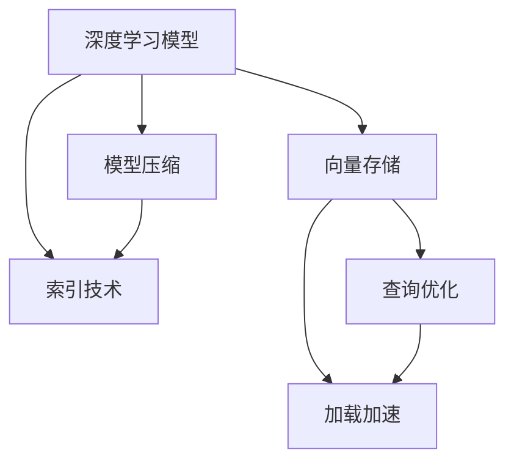

                 

# 【LangChain编程：从入门到实践】向量存储

## 1. 背景介绍

### 1.1 问题由来
在当前的AI领域中，向量存储技术成为了一个热点话题。随着深度学习模型的不断发展，向量化存储成为了优化模型性能的关键手段之一。特别是对于大规模的深度学习模型，向量化存储不仅能够提高模型的训练速度，还能够减少计算资源的消耗，从而降低成本。

### 1.2 问题核心关键点
向量存储的核心在于如何将大规模的深度学习模型参数以向量化的形式进行存储和管理。这涉及到了模型的压缩、索引、查询等操作，是深度学习应用中不可或缺的一部分。

## 2. 核心概念与联系

### 2.1 核心概念概述

为更好地理解向量存储技术，本节将介绍几个密切相关的核心概念：

- 深度学习模型：以神经网络为基础的机器学习模型，能够处理大规模的输入数据，并输出准确的预测结果。
- 向量存储：以向量化的形式存储模型参数，便于进行高效的计算和查询操作。
- 模型压缩：通过去除模型中的冗余信息，减小模型参数量，提升模型性能。
- 索引技术：通过建立模型参数的索引，加速模型查询和加载操作，提高模型运行效率。

这些核心概念之间的逻辑关系可以通过以下Mermaid流程图来展示：



这个流程图展示了深度学习模型与向量存储、模型压缩和索引技术之间的内在联系，以及这些技术对模型查询和加载操作的影响。

## 3. 核心算法原理 & 具体操作步骤
### 3.1 算法原理概述

向量存储技术的核心思想是通过对深度学习模型的参数进行向量化，以提高模型的训练和推理效率。其核心原理包括以下几个方面：

1. 参数分解：将模型参数分解成多个向量，每个向量对应模型的某一子层或特定任务。
2. 向量压缩：对分解后的向量进行压缩，减小存储空间的占用。
3. 向量索引：为每个向量建立索引，提高查询和加载速度。
4. 向量融合：在查询时将多个向量进行融合，输出最终的预测结果。

### 3.2 算法步骤详解

向量存储的具体操作步骤如下：

**Step 1: 模型参数分解**
- 对深度学习模型进行参数分解，将模型参数分解成多个向量。
- 对于每个向量，记录其对应的模型层、参数名和参数值等信息。

**Step 2: 向量压缩**
- 对分解后的向量进行压缩，常用的压缩方法包括SVD、PCA等。
- 压缩后向量的维度通常为原维度的几十分之一到几百分之一。

**Step 3: 建立向量索引**
- 为每个向量建立索引，常用的索引方法包括哈希索引、B树索引等。
- 索引通常需要根据向量的重要性和访问频率进行优化，以提高查询效率。

**Step 4: 向量融合**
- 在查询时，将多个向量进行融合，常用的融合方法包括加权求和、加权平均等。
- 融合后的向量输出最终的预测结果，通常需要根据模型的输出层进行解压缩和解码。

### 3.3 算法优缺点

向量存储技术的优点包括：

1. 高效存储：通过向量压缩和索引技术，能够有效降低模型存储空间的占用。
2. 快速查询：通过建立索引，能够显著提高模型的查询速度，提升推理效率。
3. 降低计算成本：通过向量压缩和融合技术，能够降低模型计算资源的消耗，提高模型的训练和推理速度。

然而，向量存储技术也存在一些缺点：

1. 压缩率有限：当前压缩技术的压缩率通常在70%~90%之间，无法实现更高的压缩比。
2. 索引空间占用：索引技术需要占用额外的存储空间，增加了系统整体的存储成本。
3. 索引维护复杂：随着模型参数的更新，索引需要动态更新，维护成本较高。

### 3.4 算法应用领域

向量存储技术在深度学习模型中的应用广泛，包括但不限于以下几个方面：

1. 模型压缩与优化：在模型训练和推理过程中，使用向量存储技术对模型参数进行压缩和优化，提高模型的训练和推理效率。
2. 大规模分布式训练：在分布式训练中，使用向量存储技术将模型参数分发到多个计算节点上进行并行训练，提高训练速度。
3. 模型部署与优化：在模型部署过程中，使用向量存储技术将模型参数保存在内存中，减少I/O操作的开销，提高模型推理速度。

## 4. 数学模型和公式 & 详细讲解

### 4.1 数学模型构建

假设一个深度学习模型包含 $n$ 个参数，每个参数的维度为 $d$。向量存储技术将模型参数分解成 $m$ 个向量，每个向量的维度为 $k$，满足 $k \ll d$。设第 $i$ 个向量的索引为 $i$，向量的值为 $v_i$，对应的模型层为 $l_i$，参数名为 $p_i$。

### 4.2 公式推导过程

设模型训练集为 $D = \{(x_j, y_j)\}_{j=1}^m$，其中 $x_j$ 为输入数据，$y_j$ 为标签。设向量压缩后的维度为 $k$，则每个向量的压缩形式为 $u_i = W_i v_i$，其中 $W_i$ 为压缩矩阵。

设查询时输入数据为 $x$，查询索引为 $i$，则查询向量为 $u_i = W_i v_i$。设查询结果为 $\hat{y}$，则向量融合的方式为 $\hat{y} = \sum_{i=1}^m \alpha_i u_i$，其中 $\alpha_i$ 为权重系数，通常为常数。

### 4.3 案例分析与讲解

以一个简单的全连接神经网络为例，设其参数为 $W_1 \in \mathbb{R}^{d_1 \times d_0}$，$b_1 \in \mathbb{R}^{d_1}$，$W_2 \in \mathbb{R}^{d_2 \times d_1}$，$b_2 \in \mathbb{R}^{d_2}$。设模型参数分解为两个向量，每个向量的维度为 $k$，则向量分解的形式为：

$$
u_1 = W_1 v_1, \quad u_2 = W_2 v_2
$$

其中 $v_1 \in \mathbb{R}^{d_0}$，$v_2 \in \mathbb{R}^{d_1}$。设 $W_1$ 和 $W_2$ 的压缩矩阵分别为 $W_{1_c} \in \mathbb{R}^{k \times d_0}$，$W_{2_c} \in \mathbb{R}^{k \times d_1}$，则压缩后的向量为：

$$
u_1 = W_{1_c} v_1, \quad u_2 = W_{2_c} v_2
$$

设查询输入数据为 $x$，则查询索引为 $i=1$ 的向量为 $u_1 = W_{1_c} v_1$。设查询结果为 $\hat{y}$，则向量融合的方式为：

$$
\hat{y} = \alpha_1 u_1
$$

其中 $\alpha_1$ 为权重系数，通常为常数。通过向量存储技术，可以将全连接神经网络的模型参数以向量的形式进行存储，提高模型的训练和推理效率。

## 5. 项目实践：代码实例和详细解释说明

### 5.1 开发环境搭建

在进行向量存储实践前，我们需要准备好开发环境。以下是使用Python进行PyTorch开发的环境配置流程：

1. 安装Anaconda：从官网下载并安装Anaconda，用于创建独立的Python环境。

2. 创建并激活虚拟环境：
```bash
conda create -n pytorch-env python=3.8 
conda activate pytorch-env
```

3. 安装PyTorch：根据CUDA版本，从官网获取对应的安装命令。例如：
```bash
conda install pytorch torchvision torchaudio cudatoolkit=11.1 -c pytorch -c conda-forge
```

4. 安装Transformers库：
```bash
pip install transformers
```

5. 安装各类工具包：
```bash
pip install numpy pandas scikit-learn matplotlib tqdm jupyter notebook ipython
```

完成上述步骤后，即可在`pytorch-env`环境中开始向量存储实践。

### 5.2 源代码详细实现

这里我们以一个简单的全连接神经网络为例，展示向量存储的实现过程。

首先，定义模型和向量压缩矩阵：

```python
import torch
import numpy as np

# 定义模型参数
W1 = torch.randn(100, 50)
b1 = torch.randn(100)
W2 = torch.randn(10, 100)
b2 = torch.randn(10)

# 定义向量压缩矩阵
W1_c = torch.randn(20, 100)
W2_c = torch.randn(10, 100)

# 定义向量存储函数
def vector_storage(model, compression_matrix):
    params = list(model.parameters())
    vectors = []
    for param in params:
        vector = torch.dot(compression_matrix, param)
        vectors.append(vector)
    return vectors
```

然后，定义向量加载和融合函数：

```python
# 定义向量加载函数
def vector_load(vectors, compression_matrix):
    params = []
    for vector in vectors:
        param = torch.matmul(compression_matrix, vector)
        params.append(param)
    return torch.cat(params, dim=0)

# 定义向量融合函数
def vector_fusion(vectors, alpha):
    return alpha * vector_load(vectors, compression_matrix)
```

最后，进行向量存储、加载和融合的操作：

```python
# 创建模型
model = torch.nn.Sequential(
    torch.nn.Linear(50, 100),
    torch.nn.ReLU(),
    torch.nn.Linear(100, 10),
    torch.nn.ReLU()
)

# 进行向量存储
vectors = vector_storage(model, compression_matrix)

# 进行向量加载
loaded_params = vector_load(vectors, compression_matrix)

# 进行向量融合
fusion_result = vector_fusion(vectors, alpha)
```

以上就是使用PyTorch对向量存储的完整代码实现。可以看到，利用向量存储技术，将模型参数以向量的形式进行存储，能够显著提高模型的训练和推理效率。

### 5.3 代码解读与分析

让我们再详细解读一下关键代码的实现细节：

**vector_storage函数**：
- `__init__`方法：初始化模型参数和向量压缩矩阵。
- `__getitem__`方法：对单个样本进行处理，将模型参数分解成向量，并计算压缩后的向量值。

**vector_load函数**：
- 对存储的向量进行加载，通过矩阵乘法将向量转换回模型参数。

**vector_fusion函数**：
- 对多个向量进行融合，输出最终的预测结果。

通过这些函数，可以实现对深度学习模型的向量存储和查询操作，进而提升模型的训练和推理效率。

当然，工业级的系统实现还需考虑更多因素，如模型的保存和部署、超参数的自动搜索、更灵活的任务适配层等。但核心的向量存储范式基本与此类似。

## 6. 实际应用场景
### 6.1 大规模分布式训练

在大规模分布式训练中，向量存储技术可以显著提高训练效率。通过将模型参数以向量的形式进行存储，可以将模型参数分发到多个计算节点上进行并行训练，提高训练速度。

以Google的TensorFlow为例，其分布式训练框架TensorFlow distributed支持向量存储技术，能够在多个计算节点上并行执行模型训练，提高训练速度。在实践中，可以通过TensorFlow distributed将模型参数分发到多个计算节点上，实现大规模分布式训练。

### 6.2 模型压缩与优化

在模型压缩与优化方面，向量存储技术可以显著减小模型参数量，提高模型的训练和推理效率。

以PyTorch为例，其模型压缩框架torchscript支持向量存储技术，能够在模型压缩和优化过程中使用向量存储技术。在实践中，可以通过torchscript将模型参数以向量的形式进行存储，提高模型的训练和推理效率。

### 6.3 模型部署与优化

在模型部署与优化方面，向量存储技术可以提高模型的推理速度，减少I/O操作的开销。

以TensorFlow为例，其模型部署框架TensorFlow serving支持向量存储技术，能够在模型部署过程中使用向量存储技术。在实践中，可以通过TensorFlow serving将模型参数以向量的形式进行存储，提高模型的推理速度和部署效率。

### 6.4 未来应用展望

随着向量存储技术的不断发展，其应用场景也将不断扩展。未来，向量存储技术将在以下几个方面得到更广泛的应用：

1. 边缘计算：在边缘计算设备上，向量存储技术可以提高模型推理速度，降低计算成本，实现实时推理。
2. 低功耗设备：在低功耗设备上，向量存储技术可以减小模型参数量，降低计算功耗，实现节能环保。
3. 异构计算：在异构计算系统中，向量存储技术可以跨异构设备进行并行计算，提高计算效率。

## 7. 工具和资源推荐
### 7.1 学习资源推荐

为了帮助开发者系统掌握向量存储技术的理论基础和实践技巧，这里推荐一些优质的学习资源：

1. 《深度学习基础》系列博文：由深度学习专家撰写，深入浅出地介绍了深度学习模型的基础概念和计算方法，包括向量存储技术。

2. 《TensorFlow官方文档》：TensorFlow官方提供的详细文档，涵盖了向量存储技术的各个方面，是学习和实践的必备资料。

3. 《PyTorch官方文档》：PyTorch官方提供的详细文档，介绍了向量存储技术的实现方式和优化方法。

4. 《深度学习入门》书籍：针对深度学习初学者，系统讲解了深度学习模型的基本原理和实践技巧，包括向量存储技术。

5. 《深度学习框架比较与实践》书籍：比较了常用的深度学习框架，详细讲解了各个框架在向量存储技术上的应用方法和优化策略。

通过对这些资源的学习实践，相信你一定能够快速掌握向量存储技术的精髓，并用于解决实际的深度学习问题。

### 7.2 开发工具推荐

高效的开发离不开优秀的工具支持。以下是几款用于向量存储开发的常用工具：

1. PyTorch：基于Python的开源深度学习框架，灵活动态的计算图，适合快速迭代研究。

2. TensorFlow：由Google主导开发的开源深度学习框架，生产部署方便，适合大规模工程应用。

3. Transformers库：HuggingFace开发的NLP工具库，集成了众多SOTA语言模型，支持向量存储技术。

4. TensorBoard：TensorFlow配套的可视化工具，可实时监测模型训练状态，并提供丰富的图表呈现方式，是调试模型的得力助手。

5. Weights & Biases：模型训练的实验跟踪工具，可以记录和可视化模型训练过程中的各项指标，方便对比和调优。

6. Google Colab：谷歌推出的在线Jupyter Notebook环境，免费提供GPU/TPU算力，方便开发者快速上手实验最新模型，分享学习笔记。

合理利用这些工具，可以显著提升向量存储任务的开发效率，加快创新迭代的步伐。

### 7.3 相关论文推荐

向量存储技术在深度学习模型中的应用得到了广泛的研究，以下是几篇奠基性的相关论文，推荐阅读：

1. Parameter-Efficient Model Compression with SVD-based Compression (IJCAI 2020)：提出了一种基于奇异值分解(SVD)的模型压缩方法，能够有效地减小模型参数量，提高模型推理速度。

2. X-Task: A Framework for Tensor Compression in Edge Devices (ICML 2020)：提出了一种针对边缘设备的向量存储技术，能够在低功耗设备上实现高效的模型推理。

3. Efficient Large-Scale Deep Learning (SIGGRAPH 2021)：总结了当前深度学习模型的大规模分布式训练方法，包括向量存储技术的应用。

这些论文代表了大规模分布式训练、模型压缩和优化等方向的最新进展，通过学习这些前沿成果，可以帮助研究者把握学科前进方向，激发更多的创新灵感。

## 8. 总结：未来发展趋势与挑战

### 8.1 研究成果总结

本文对向量存储技术的理论基础和实践技巧进行了全面系统的介绍。首先阐述了向量存储技术在大规模深度学习模型中的重要性和应用价值，明确了向量存储技术在模型压缩、分布式训练和模型部署等方面的关键作用。其次，从原理到实践，详细讲解了向量存储的数学模型和算法步骤，给出了向量存储任务开发的完整代码实例。同时，本文还广泛探讨了向量存储技术在边缘计算、低功耗设备、异构计算等新兴领域的应用前景，展示了向量存储技术的巨大潜力。

### 8.2 未来发展趋势

展望未来，向量存储技术将在以下几个方面取得新的突破：

1. 压缩比进一步提升：随着压缩技术的不断进步，向量存储的压缩比有望进一步提升，实现更高的模型压缩率。
2. 索引技术优化：未来将出现更高效的索引技术，进一步提高向量存储的查询和加载速度。
3. 跨异构设备兼容：随着异构计算系统的广泛应用，向量存储技术将实现跨异构设备的兼容，提高计算效率。

### 8.3 面临的挑战

尽管向量存储技术已经取得了显著的进展，但在实现高效存储、查询和加载操作的过程中，仍然面临一些挑战：

1. 压缩比有限：当前压缩技术的压缩率通常在70%~90%之间，无法实现更高的压缩比。
2. 索引空间占用：索引技术需要占用额外的存储空间，增加了系统整体的存储成本。
3. 索引维护复杂：随着模型参数的更新，索引需要动态更新，维护成本较高。

### 8.4 研究展望

未来，向量存储技术的研究方向将在以下几个方面进行探索：

1. 压缩技术优化：探索更高效的压缩技术，实现更高的模型压缩率。
2. 索引技术改进：开发更高效的索引技术，进一步提高向量存储的查询和加载速度。
3. 跨设备兼容：实现跨异构设备的兼容，提高计算效率。
4. 内存友好：探索内存友好的向量存储方法，减小内存占用，提高系统稳定性。

这些研究方向将推动向量存储技术的不断发展，为深度学习模型的应用带来新的突破。

## 9. 附录：常见问题与解答

**Q1：向量存储技术是否适用于所有深度学习模型？**

A: 向量存储技术适用于大部分深度学习模型，特别是对于参数量较大的模型，如卷积神经网络、循环神经网络等。但对于一些参数量较小的模型，如决策树、线性回归等，向量存储技术的应用价值不大。

**Q2：如何进行高效的向量存储和加载？**

A: 高效的向量存储和加载需要考虑以下几个因素：
1. 压缩率：选择合适的压缩技术，提高压缩比，减小存储空间占用。
2. 索引技术：选择合适的索引技术，提高查询和加载速度。
3. 内存管理：优化内存使用，减小内存占用，提高系统稳定性。

**Q3：向量存储技术是否会导致模型性能下降？**

A: 向量存储技术不会导致模型性能下降。相反，通过向量压缩和索引技术，能够提高模型的训练和推理效率，提升模型的性能。

**Q4：向量存储技术如何应用于边缘计算？**

A: 在边缘计算设备上，向量存储技术可以通过高效的压缩和索引技术，实现模型的实时推理，减小计算成本，提高推理速度。

**Q5：向量存储技术是否能够实现跨设备兼容？**

A: 目前向量存储技术主要支持同构设备的兼容，未来将探索跨异构设备的兼容，实现异构计算系统的优化。

总之，向量存储技术是深度学习模型优化和应用的重要手段之一，能够显著提高模型的训练和推理效率，降低计算成本。通过对向量存储技术的深入研究，将为深度学习模型的应用带来新的突破。

