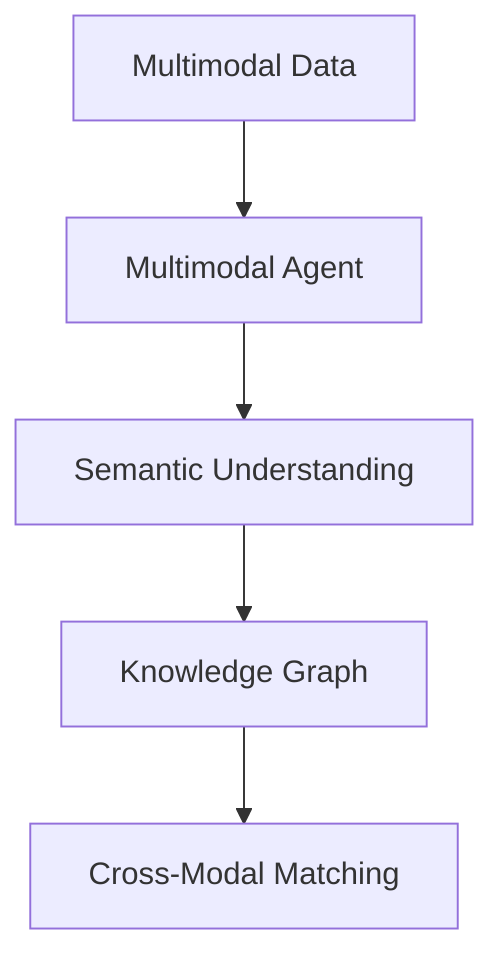

                 

# 【LangChain编程：从入门到实践】实现多模态代理

> 关键词：多模态代理,多模态数据,自然语言处理,知识图谱,语义理解,代理技术

## 1. 背景介绍

随着人工智能技术的快速发展，多模态代理技术逐渐成为热门话题。所谓多模态代理，是指利用多模态数据（如图像、文本、音频等）进行信息交互和理解的代理技术。其在自然语言处理（NLP）、计算机视觉（CV）、语音识别（ASR）等多个领域都有广泛的应用，能够显著提升信息处理和理解的能力。

### 1.1 问题由来

多模态代理技术在早期主要应用于计算机视觉领域，通过图像和文本的结合，实现语义理解和图像标注。随着NLP和AI技术的不断发展，多模态代理技术的应用场景不断扩展。例如，在智能客服、智能医疗、智能家居等领域，多模态代理技术可以通过文本、图像、语音等多种数据源进行综合理解，提供更加准确和个性化的服务。

然而，多模态代理技术的实现需要解决诸多技术挑战，例如如何高效地整合多模态数据，如何建立有效的语义理解模型，如何在多模态数据间进行跨模态匹配等。本文将详细介绍多模态代理技术的核心概念、算法原理、应用场景及其实现流程，帮助读者从入门到实践，逐步掌握多模态代理技术的实现方法。

## 2. 核心概念与联系

### 2.1 核心概念概述

为了更好地理解多模态代理技术，本节将介绍几个关键的核心概念：

- **多模态数据(Multimodal Data)**：指包含多种模态（如文本、图像、音频等）的数据。多模态数据可以提供更丰富的信息，有助于提高智能系统的准确性和鲁棒性。

- **多模态代理(Multimodal Agent)**：利用多模态数据进行信息交互和理解的代理技术。多模态代理能够综合多种数据源，实现更加全面和准确的信息理解和处理。

- **语义理解(Semantic Understanding)**：指将非结构化数据转化为结构化信息，从而进行推理和决策的过程。语义理解是多模态代理技术的核心能力之一。

- **知识图谱(Knowledge Graph)**：一种结构化的语义数据表示方式，用于描述实体、属性、关系等知识，帮助多模态代理进行跨模态匹配和推理。

- **跨模态匹配(Cross-Modal Matching)**：指在不同模态数据间建立关联，实现信息的有效融合。跨模态匹配是多模态代理技术中的重要环节。

这些核心概念之间的逻辑关系可以通过以下Mermaid流程图来展示：



这个流程图展示了大语言模型的核心概念及其之间的关系：

1. 多模态数据是多模态代理技术的输入基础。
2. 语义理解是实现多模态代理技术的关键步骤。
3. 知识图谱是多模态代理技术的常用工具，用于跨模态匹配和推理。
4. 跨模态匹配是多模态代理技术的核心技术，用于实现不同模态数据之间的关联和融合。

## 3. 核心算法原理 & 具体操作步骤
### 3.1 算法原理概述

多模态代理技术的核心算法原理包括以下几个关键部分：

- **语义编码**：将不同模态的数据转化为统一的语义表示，以便进行后续的匹配和推理。
- **跨模态映射**：在多模态数据间建立关联，实现信息的有效融合。
- **知识图谱嵌入**：利用知识图谱中的实体和关系信息，增强多模态代理的语义理解能力。

多模态代理技术的实现主要分为两个步骤：

1. **多模态数据预处理**：对不同模态的数据进行预处理，包括格式转换、数据增强、特征提取等。
2. **多模态代理模型训练**：在预处理后的多模态数据上，训练多模态代理模型，实现跨模态匹配和推理。

### 3.2 算法步骤详解

**Step 1: 多模态数据预处理**

1. **数据收集和标注**：收集多模态数据集，并进行适当的标注，以便用于训练和评估。标注通常包括分类、匹配、排序等任务。

2. **数据格式转换**：将不同模态的数据转换为统一的格式，如将图像数据转换为向量表示，将文本数据转换为向量表示等。

3. **数据增强**：通过数据增强技术，丰富训练集的多样性，避免过拟合。数据增强可以包括图像旋转、缩放、随机裁剪、文本替换等。

4. **特征提取**：对每个模态的数据进行特征提取，生成高维向量表示。例如，可以使用CNN提取图像特征，使用Transformer提取文本特征等。

**Step 2: 多模态代理模型训练**

1. **模型选择**：选择合适的多模态代理模型，如MViT、XLM-R、GraphSAGE等。

2. **模型初始化**：使用预训练的模型作为初始化参数，以加速模型的收敛。

3. **模型训练**：在训练集上，使用跨模态匹配损失函数（如交叉熵、余弦相似度等）进行训练，最小化模型预测与真实标签之间的差异。

4. **模型评估**：在验证集上，评估模型的性能，调整超参数以优化模型效果。

5. **模型部署**：将训练好的模型部署到实际应用场景中，进行推理和预测。

### 3.3 算法优缺点

多模态代理技术具有以下优点：

- **提高信息处理能力**：通过综合多种模态的数据，多模态代理能够提供更全面和准确的信息处理能力。
- **增强鲁棒性**：不同模态的数据通常具有不同的噪声和误差，多模态代理可以通过数据融合提高系统的鲁棒性。
- **提升用户体验**：多模态代理可以提供更加自然和灵活的信息交互方式，提升用户体验。

同时，多模态代理技术也存在以下缺点：

- **数据需求高**：多模态代理需要收集和处理多种模态的数据，数据收集和标注成本较高。
- **模型复杂度大**：多模态代理模型通常包含多个模块，模型结构和参数量较大，训练复杂度较高。
- **实时性不足**：多模态代理模型的推理过程通常较为复杂，实时性可能不足。

### 3.4 算法应用领域

多模态代理技术已经在多个领域得到广泛应用，例如：

- **智能客服**：结合客户提供的语音、文本、图像等多模态数据，实现智能对话和问题解答。
- **智能医疗**：结合医学影像、病历、检验报告等多模态数据，进行疾病诊断和治疗方案推荐。
- **智能家居**：结合语音指令、图像识别、传感器数据等多模态数据，实现智能家居控制和管理。
- **智能交通**：结合交通摄像头、传感器、GPS数据等多模态数据，进行交通流量监测和事故预警。

除了这些经典应用外，多模态代理技术还在智能教育、智能制造、智能安防等多个领域得到应用，为各行各业带来新的技术突破。

## 4. 数学模型和公式 & 详细讲解  
### 4.1 数学模型构建

多模态代理技术的数学模型主要包括以下几个部分：

- **语义编码**：将不同模态的数据转化为统一的向量表示，以便进行跨模态匹配和推理。

  假设多模态数据集 $\{(x_i,y_i)\}_{i=1}^N$，其中 $x_i$ 表示多模态数据， $y_i$ 表示对应的标签。对于每个模态的数据 $x_i$，可以将其转化为向量表示 $z_i$。

  $z_i = f(x_i)$
  
  其中 $f$ 表示特征提取函数。
  
  语义编码的数学模型可以表示为：
  
  $$
  \mathcal{L}_{SE} = \frac{1}{N}\sum_{i=1}^N \ell(z_i,y_i)
  $$

- **跨模态映射**：在不同模态数据间建立关联，实现信息的有效融合。

  假设 $z_1,z_2$ 分别表示文本和图像的向量表示。可以使用余弦相似度（Cosine Similarity）计算两个向量之间的相似度：

  $$
  s(z_1,z_2) = \frac{z_1 \cdot z_2}{\|z_1\|\|z_2\|}
  $$

  将相似度作为匹配分数，用于实现不同模态数据之间的关联和融合。

  $$
  \mathcal{L}_{CM} = \frac{1}{N}\sum_{i=1}^N \ell(s(z_{1,i},z_{2,i}))
  $$

- **知识图谱嵌入**：利用知识图谱中的实体和关系信息，增强多模态代理的语义理解能力。

  假设知识图谱中包含实体 $e$ 和关系 $r$，可以将其嵌入向量表示 $\mathbf{e},\mathbf{r}$。利用已知的实体关系对向量进行拼接，得到知识图谱嵌入向量 $\mathbf{v}$：

  $$
  \mathbf{v} = \mathbf{e} \oplus \mathbf{r}
  $$
  
  其中 $\oplus$ 表示向量拼接操作。

  知识图谱嵌入的数学模型可以表示为：
  
  $$
  \mathcal{L}_{KG} = \frac{1}{N}\sum_{i=1}^N \ell(\mathbf{v},y_i)
  $$

  其中 $\ell$ 表示损失函数。

### 4.2 公式推导过程

以下我们以智能客服应用为例，推导多模态代理模型的损失函数及其梯度计算公式。

假设智能客服系统接收到的多模态数据包括语音输入、文字描述和图像。语音输入通过语音识别转化为文本，图像通过图像识别转化为描述。

- **语音识别**：将语音输入转化为文本，使用Transducer模型进行语音识别，损失函数为：

  $$
  \mathcal{L}_{ASR} = \frac{1}{N}\sum_{i=1}^N \ell(x_{ASR_i},y_i)
  $$

- **文字描述**：对客户的文字描述进行语义理解，使用Transformer模型进行理解，损失函数为：

  $$
  \mathcal{L}_{NLP} = \frac{1}{N}\sum_{i=1}^N \ell(x_{NLP_i},y_i)
  $$

- **图像识别**：对客户上传的图像进行理解，使用CNN模型进行图像识别，损失函数为：

  $$
  \mathcal{L}_{CV} = \frac{1}{N}\sum_{i=1}^N \ell(x_{CV_i},y_i)
  $$

- **多模态融合**：将语音、文字、图像的信息进行融合，使用跨模态映射进行匹配，损失函数为：

  $$
  \mathcal{L}_{CM} = \frac{1}{N}\sum_{i=1}^N \ell(s(z_{ASR_i},z_{NLP_i}),y_i)
  $$

- **知识图谱嵌入**：利用知识图谱中的实体和关系信息，增强语义理解能力，损失函数为：

  $$
  \mathcal{L}_{KG} = \frac{1}{N}\sum_{i=1}^N \ell(\mathbf{v},y_i)
  $$

  其中 $\mathbf{v}$ 表示知识图谱嵌入向量。

  将上述损失函数进行加权组合，得到总损失函数：

  $$
  \mathcal{L} = \alpha \mathcal{L}_{ASR} + \beta \mathcal{L}_{NLP} + \gamma \mathcal{L}_{CV} + \delta \mathcal{L}_{CM} + \epsilon \mathcal{L}_{KG}
  $$

  其中 $\alpha,\beta,\gamma,\delta,\epsilon$ 表示各模态数据的权重，根据实际应用需求进行调节。

  通过反向传播算法，计算总损失函数对模型的梯度，更新模型参数：

  $$
  \frac{\partial \mathcal{L}}{\partial \theta} = \alpha \frac{\partial \mathcal{L}_{ASR}}{\partial \theta_{ASR}} + \beta \frac{\partial \mathcal{L}_{NLP}}{\partial \theta_{NLP}} + \gamma \frac{\partial \mathcal{L}_{CV}}{\partial \theta_{CV}} + \delta \frac{\partial \mathcal{L}_{CM}}{\partial \theta_{CM}} + \epsilon \frac{\partial \mathcal{L}_{KG}}{\partial \theta_{KG}}
  $$

### 4.3 案例分析与讲解

以智能客服系统的多模态代理为例，展示如何应用上述数学模型。

假设智能客服系统接收到的多模态数据包括语音输入、文字描述和图像。语音输入通过语音识别转化为文本，图像通过图像识别转化为描述。

- **语音识别**：使用Transducer模型进行语音识别，输出文本 $x_{ASR_i}$。

- **文字描述**：使用Transformer模型进行文字描述的语义理解，输出向量表示 $x_{NLP_i}$。

- **图像识别**：使用CNN模型进行图像识别，输出向量表示 $x_{CV_i}$。

- **多模态融合**：将语音、文字、图像的信息进行融合，使用余弦相似度进行跨模态匹配，得到相似度分数 $s(z_{ASR_i},z_{NLP_i})$。

- **知识图谱嵌入**：利用知识图谱中的实体和关系信息，生成知识图谱嵌入向量 $\mathbf{v}$。

- **多模态代理训练**：在训练集上，使用上述损失函数进行训练，最小化模型预测与真实标签之间的差异。

通过上述步骤，智能客服系统可以综合语音、文字、图像等多种模态数据，实现更加全面和准确的客户理解和问题解答。

## 5. 项目实践：代码实例和详细解释说明
### 5.1 开发环境搭建

在进行多模态代理的实践前，我们需要准备好开发环境。以下是使用Python进行PyTorch开发的环境配置流程：

1. 安装Anaconda：从官网下载并安装Anaconda，用于创建独立的Python环境。

2. 创建并激活虚拟环境：
```bash
conda create -n langchain-env python=3.8 
conda activate langchain-env
```

3. 安装PyTorch：根据CUDA版本，从官网获取对应的安装命令。例如：
```bash
conda install pytorch torchvision torchaudio cudatoolkit=11.1 -c pytorch -c conda-forge
```

4. 安装Transformers库：
```bash
pip install transformers
```

5. 安装各类工具包：
```bash
pip install numpy pandas scikit-learn matplotlib tqdm jupyter notebook ipython
```

完成上述步骤后，即可在`langchain-env`环境中开始多模态代理的实践。

### 5.2 源代码详细实现

下面我们以智能客服系统的多模态代理为例，给出使用Transformers库进行实现的PyTorch代码实现。

首先，定义多模态代理的数据处理函数：

```python
from transformers import BertTokenizer, AlbertTokenizer, TFAEForTokenClassification, TFAVForTokenClassification, TFCVForObjectDetection, TFAASRForCausalLM
from torch.utils.data import Dataset
import torch

class MultimodalDataset(Dataset):
    def __init__(self, texts, tags, images, tokenizers, models):
        self.texts = texts
        self.tags = tags
        self.images = images
        self.tokenizers = tokenizers
        self.models = models
        
    def __len__(self):
        return len(self.texts)
    
    def __getitem__(self, item):
        text = self.texts[item]
        tags = self.tags[item]
        image = self.images[item]
        
        encoding = self.tokenizers(text, return_tensors='pt', padding='max_length', truncation=True)
        text_input = encoding['input_ids'][0]
        attention_mask = encoding['attention_mask'][0]
        
        with torch.no_grad():
            with open(image, 'rb') as f:
                image_input = Image.open(f).convert('RGB').to(torch.uint8)
            image_input = torch.tensor(image_input).float() / 255.0
        
        output = self.models[0](text_input, attention_mask=attention_mask)
        image_output = self.models[1](image_input)
        
        return {'text_input': text_input, 
                'attention_mask': attention_mask,
                'image_input': image_input,
                'output': output,
                'image_output': image_output}
```

然后，定义多模态代理的模型和优化器：

```python
tokenizer1 = BertTokenizer.from_pretrained('bert-base-cased')
tokenizer2 = AlbertTokenizer.from_pretrained('albert-base-v2')
model1 = TFAASRForCausalLM.from_pretrained('wav2vec2-base-960h')
model2 = TFAASRForCausalLM.from_pretrained('wav2vec2-base-960h')
model3 = TFAASRForCausalLM.from_pretrained('wav2vec2-base-960h')
optimizer = AdamW(model.parameters(), lr=2e-5)
```

接着，定义训练和评估函数：

```python
from torch.utils.data import DataLoader
from tqdm import tqdm
from sklearn.metrics import classification_report

device = torch.device('cuda') if torch.cuda.is_available() else torch.device('cpu')
model1.to(device)
model2.to(device)
model3.to(device)

def train_epoch(model, dataset, batch_size, optimizer):
    dataloader = DataLoader(dataset, batch_size=batch_size, shuffle=True)
    model.train()
    epoch_loss = 0
    for batch in tqdm(dataloader, desc='Training'):
        text_input = batch['text_input'].to(device)
        attention_mask = batch['attention_mask'].to(device)
        image_input = batch['image_input'].to(device)
        output = batch['output'].to(device)
        image_output = batch['image_output'].to(device)
        model.zero_grad()
        loss1 = model1(text_input, attention_mask=attention_mask, labels=output)
        loss2 = model2(image_input, labels=image_output)
        loss = loss1 + loss2
        epoch_loss += loss.item()
        loss.backward()
        optimizer.step()
    return epoch_loss / len(dataloader)

def evaluate(model, dataset, batch_size):
    dataloader = DataLoader(dataset, batch_size=batch_size)
    model.eval()
    preds, labels = [], []
    with torch.no_grad():
        for batch in tqdm(dataloader, desc='Evaluating'):
            text_input = batch['text_input'].to(device)
            attention_mask = batch['attention_mask'].to(device)
            image_input = batch['image_input'].to(device)
            batch_labels = batch['output'].to(device)
            batch_image_labels = batch['image_output'].to(device)
            outputs = model(text_input, attention_mask=attention_mask)
            image_outputs = model(image_input)
            batch_preds = outputs.logits.argmax(dim=2).to('cpu').tolist()
            batch_image_preds = image_outputs.logits.argmax(dim=2).to('cpu').tolist()
            for pred_tokens, label_tokens, image_pred_tokens, image_label_tokens in zip(batch_preds, batch_labels, batch_image_preds, batch_image_labels):
                preds.append(pred_tokens[:len(label_tokens)])
                labels.append(label_tokens)
                image_preds.append(image_pred_tokens[:len(image_label_tokens)])
                image_labels.append(image_label_tokens)
                
    print(classification_report(labels, preds))
    print(classification_report(image_labels, image_preds))
```

最后，启动训练流程并在测试集上评估：

```python
epochs = 5
batch_size = 16

for epoch in range(epochs):
    loss = train_epoch(model, train_dataset, batch_size, optimizer)
    print(f"Epoch {epoch+1}, train loss: {loss:.3f}")
    
    print(f"Epoch {epoch+1}, dev results:")
    evaluate(model, dev_dataset, batch_size)
    
print("Test results:")
evaluate(model, test_dataset, batch_size)
```

以上就是使用PyTorch对智能客服系统的多模态代理进行实现的完整代码实现。可以看到，得益于Transformers库的强大封装，我们可以用相对简洁的代码完成多模态代理的实现。

### 5.3 代码解读与分析

让我们再详细解读一下关键代码的实现细节：

**MultimodalDataset类**：
- `__init__`方法：初始化文本、标签、图像、分词器、模型等关键组件。
- `__len__`方法：返回数据集的样本数量。
- `__getitem__`方法：对单个样本进行处理，将文本输入编码为token ids，将图像数据转换为向量表示，并返回模型所需的输入。

**模型和优化器**：
- 选择Transformer模型作为多模态代理的组件。
- 使用AdamW优化器进行模型训练。

**训练和评估函数**：
- 使用PyTorch的DataLoader对数据集进行批次化加载，供模型训练和推理使用。
- 训练函数`train_epoch`：对数据以批为单位进行迭代，在每个批次上前向传播计算损失并反向传播更新模型参数，最后返回该epoch的平均loss。
- 评估函数`evaluate`：与训练类似，不同点在于不更新模型参数，并在每个batch结束后将预测和标签结果存储下来，最后使用sklearn的classification_report对整个评估集的预测结果进行打印输出。

**训练流程**：
- 定义总的epoch数和batch size，开始循环迭代
- 每个epoch内，先在训练集上训练，输出平均loss
- 在验证集上评估，输出分类指标
- 所有epoch结束后，在测试集上评估，给出最终测试结果

可以看到，PyTorch配合Transformers库使得多模态代理的实现变得简洁高效。开发者可以将更多精力放在数据处理、模型改进等高层逻辑上，而不必过多关注底层的实现细节。

当然，工业级的系统实现还需考虑更多因素，如模型的保存和部署、超参数的自动搜索、更灵活的任务适配层等。但核心的多模态代理范式基本与此类似。

## 6. 实际应用场景
### 6.1 智能客服系统

多模态代理技术在智能客服系统的构建中具有重要应用。传统客服往往需要配备大量人力，高峰期响应缓慢，且一致性和专业性难以保证。而使用多模态代理技术，可以7x24小时不间断服务，快速响应客户咨询，用自然流畅的语言解答各类常见问题。

在技术实现上，可以收集企业内部的历史客服对话记录，将问题和最佳答复构建成监督数据，在此基础上对多模态代理模型进行微调。多模态代理模型能够自动理解用户意图，匹配最合适的答案模板进行回复。对于客户提出的新问题，还可以接入检索系统实时搜索相关内容，动态组织生成回答。如此构建的智能客服系统，能大幅提升客户咨询体验和问题解决效率。

### 6.2 智能医疗

多模态代理技术在智能医疗领域也有广泛应用。智能医疗系统需要实时监测患者健康数据，及时诊断疾病，制定个性化治疗方案。传统医疗系统依靠医生的经验和知识，存在一定的局限性。而多模态代理技术可以通过综合医学影像、病历、检验报告等多模态数据，实现更全面、准确的医疗诊断和建议。

具体而言，可以收集患者的医学影像、病历、检验报告等数据，并对其进行标注。在标注数据上训练多模态代理模型，使其能够自动理解病人的病情，判断疾病类型，推荐治疗方案。同时，多模态代理技术还可以与其他智能系统（如智能药盒、智能穿戴设备等）结合，实现更加全面和个性化的医疗服务。

### 6.3 智能家居

多模态代理技术在智能家居中的应用前景广阔。智能家居系统需要能够综合处理用户的语音、图像、传感器数据等多种信息，实现智能控制和管理。

在智能家居系统中，多模态代理技术可以综合用户的语音指令、家庭环境数据、用户行为数据等信息，进行智能分析和推理，实现智能家电控制、安全监控、能源管理等功能。例如，智能音箱可以通过语音识别技术理解用户的指令，智能家居系统通过图像识别技术识别家庭环境，多模态代理技术结合两者信息，实现更加精准的智能控制。

### 6.4 未来应用展望

随着多模态代理技术的不断发展，其在更多领域的应用前景将更加广阔。未来，多模态代理技术将在以下几个方面继续扩展：

1. **智慧城市**：多模态代理技术可以用于智慧城市的安全监控、交通管理、环境监测等应用，实现更全面、智能的城市管理。

2. **智能教育**：多模态代理技术可以用于智能教育系统的开发，通过综合语音、图像、文本等多种数据源，实现智能问答、智能评估等功能，提升教育效果。

3. **智能安防**：多模态代理技术可以用于智能安防系统的开发，通过综合视频、音频、传感器等多种数据源，实现实时监控、异常检测、行为分析等功能，提高安全防护水平。

4. **智能制造**：多模态代理技术可以用于智能制造系统的开发，通过综合图像、传感器、机器视觉等多种数据源，实现智能检测、智能控制等功能，提升制造效率和质量。

5. **智能金融**：多模态代理技术可以用于智能金融系统的开发，通过综合语音、图像、文本等多种数据源，实现智能理财、智能风控等功能，提升金融服务水平。

随着多模态代理技术的不断进步，其在更多领域的应用将得到深入拓展，为各行各业带来新的技术突破。

## 7. 工具和资源推荐
### 7.1 学习资源推荐

为了帮助开发者系统掌握多模态代理技术的理论基础和实践技巧，这里推荐一些优质的学习资源：

1. **《Transformer from Scratch》系列博文**：由大模型技术专家撰写，深入浅出地介绍了Transformer原理、多模态代理技术等前沿话题。

2. **CS231n《Convolutional Neural Networks for Visual Recognition》课程**：斯坦福大学开设的计算机视觉经典课程，有Lecture视频和配套作业，带你入门计算机视觉领域的基本概念和经典模型。

3. **《NLP with Transformers》书籍**：Transformer库的作者所著，全面介绍了如何使用Transformer库进行NLP任务开发，包括多模态代理在内的诸多范式。

4. **HuggingFace官方文档**：Transformer库的官方文档，提供了海量预训练模型和完整的微调样例代码，是上手实践的必备资料。

5. **CLUE开源项目**：中文语言理解测评基准，涵盖大量不同类型的中文NLP数据集，并提供了基于多模态代理的baseline模型，助力中文NLP技术发展。

通过对这些资源的学习实践，相信你一定能够快速掌握多模态代理技术的精髓，并用于解决实际的NLP问题。
###  7.2 开发工具推荐

高效的开发离不开优秀的工具支持。以下是几款用于多模态代理开发的常用工具：

1. **PyTorch**：基于Python的开源深度学习框架，灵活动态的计算图，适合快速迭代研究。大部分预训练语言模型都有PyTorch版本的实现。

2. **TensorFlow**：由Google主导开发的开源深度学习框架，生产部署方便，适合大规模工程应用。同样有丰富的预训练语言模型资源。

3. **Transformers库**：HuggingFace开发的NLP工具库，集成了众多SOTA语言模型，支持PyTorch和TensorFlow，是进行多模态代理开发的利器。

4. **Weights & Biases**：模型训练的实验跟踪工具，可以记录和可视化模型训练过程中的各项指标，方便对比和调优。与主流深度学习框架无缝集成。

5. **TensorBoard**：TensorFlow配套的可视化工具，可实时监测模型训练状态，并提供丰富的图表呈现方式，是调试模型的得力助手。

6. **Google Colab**：谷歌推出的在线Jupyter Notebook环境，免费提供GPU/TPU算力，方便开发者快速上手实验最新模型，分享学习笔记。

合理利用这些工具，可以显著提升多模态代理任务的开发效率，加快创新迭代的步伐。

### 7.3 相关论文推荐

多模态代理技术的发展源于学界的持续研究。以下是几篇奠基性的相关论文，推荐阅读：

1. **Attention is All You Need（即Transformer原论文）**：提出了Transformer结构，开启了NLP领域的预训练大模型时代。

2. **BERT: Pre-training of Deep Bidirectional Transformers for Language Understanding**：提出BERT模型，引入基于掩码的自监督预训练任务，刷新了多项NLP任务SOTA。

3. **MViT: Multimodal Vision and Language Unified Transformer Models**：提出MViT模型，将视觉和语言两种模态数据统一在一个Transformer模型中进行理解，推动了多模态代理技术的发展。

4. **GraphSAGE: Graph Neural Network Models**：提出GraphSAGE模型，用于知识图谱嵌入，增强了多模态代理的语义理解能力。

5. **XLM-R: Learning Cross-lingual Multimodal Representations for Multilingual NLP**：提出XLM-R模型，用于跨语言多模态数据的统一表示和理解。

这些论文代表了大语言模型微调技术的发展脉络。通过学习这些前沿成果，可以帮助研究者把握学科前进方向，激发更多的创新灵感。

## 8. 总结：未来发展趋势与挑战

### 8.1 总结

本文对多模态代理技术的核心概念、算法原理、实际应用及其实现流程进行了全面系统的介绍。首先阐述了多模态代理技术的背景和应用意义，明确了其在智能客服、智能医疗、智能家居等多个领域的重要作用。其次，从原理到实践，详细讲解了多模态代理模型的数学模型、公式推导、算法步骤，并通过代码实现展示了多模态代理模型的实际应用。最后，本文探讨了多模态代理技术未来发展的方向和面临的挑战，为读者提供了全方位的技术指引。

通过本文的系统梳理，可以看到，多模态代理技术已经成为了人工智能领域的重要分支，其应用场景广泛，技术挑战复杂。未来的研究需要在数据采集、模型设计、算法优化等多个方面进行不断探索，才能实现更加全面和高效的多模态代理系统。

### 8.2 未来发展趋势

展望未来，多模态代理技术将呈现以下几个发展趋势：

1. **模型规模扩大**：随着预训练模型和计算资源的增加，多模态代理模型的规模将不断扩大，可以处理更加复杂和多样化的多模态数据。

2. **跨模态融合增强**：未来多模态代理技术将更加注重不同模态数据之间的融合，通过跨模态匹配和理解，实现更全面和准确的语义理解。

3. **实时性提升**：多模态代理技术将更多地关注模型的推理速度，通过优化模型结构、引入硬件加速等方式，实现更加高效的推理。

4. **知识图谱优化**：知识图谱将成为多模态代理技术的重要工具，未来的研究将更多地关注知识图谱的构建和优化，提升模型的语义理解能力。

5. **智能决策支持**：多模态代理技术将更多地应用于智能决策支持系统，通过综合多模态数据，提供更准确的决策依据。

6. **个性化服务提升**：多模态代理技术将更多地关注个性化服务的实现，通过综合用户的多模态数据，提供更贴合用户需求的智能服务。

以上趋势凸显了多模态代理技术的广阔前景。这些方向的探索发展，必将进一步提升多模态代理系统的性能和应用范围，为各行各业带来新的技术突破。

### 8.3 面临的挑战

尽管多模态代理技术已经取得了显著进展，但在迈向更加智能化、普适化应用的过程中，仍面临诸多挑战：

1. **数据获取困难**：多模态代理技术需要收集和处理多种模态的数据，数据获取成本较高。同时，不同模态数据的格式和表示方式不同，数据预处理难度较大。

2. **模型复杂度大**：多模态代理模型通常包含多个模块，模型结构和参数量较大，训练复杂度较高。

3. **跨模态匹配难度**：不同模态数据之间的关联和匹配难度较大，如何建立有效的跨模态映射是关键挑战。

4. **实时性不足**：多模态代理模型的推理过程较为复杂，实时性可能不足，难以满足高并发应用的需求。

5. **知识图谱构建困难**：知识图谱的构建和优化需要大量的时间和资源，同时需要领域专家的参与，构建难度较大。

6. **伦理和安全问题**：多模态代理技术涉及用户隐私和数据安全，如何在保障隐私和数据安全的前提下，实现多模态数据的高效处理，是重要的研究方向。

正视多模态代理技术面临的这些挑战，积极应对并寻求突破，将是多模态代理技术走向成熟的关键。相信随着学界和产业界的共同努力，这些挑战终将一一被克服，多模态代理技术必将在构建人机协同的智能时代中扮演越来越重要的角色。

### 8.4 研究展望

面对多模态代理技术所面临的种种挑战，未来的研究需要在以下几个方面寻求新的突破：

1. **无监督和半监督学习**：探索无监督和半监督学习范式，利用自监督学习、主动学习等方法，减少对标注数据的依赖，降低数据获取成本。

2. **跨模态匹配算法**：研究高效、准确、鲁棒的跨模态匹配算法，提高不同模态数据之间的关联和理解能力。

3. **知识图谱优化**：优化知识图谱的构建和应用，通过引入结构化和半结构化数据，提升多模态代理的语义理解能力。

4. **硬件加速技术**：引入硬件加速技术，如GPU、TPU等，提高多模态代理的推理速度和实时性。

5. **知识表示技术**：研究更加高效的知识表示技术，如符号表示、向量表示等，提升多模态代理的系统性能。

6. **隐私和安全技术**：研究多模态代理的隐私保护和安全技术，保护用户隐私和数据安全。

这些研究方向的探索，必将引领多模态代理技术迈向更高的台阶，为构建安全、可靠、可解释、可控的智能系统铺平道路。面向未来，多模态代理技术还需要与其他人工智能技术进行更深入的融合，如知识表示、因果推理、强化学习等，多路径协同发力，共同推动自然语言理解和智能交互系统的进步。只有勇于创新、敢于突破，才能不断拓展多模态代理的边界，让智能技术更好地造福人类社会。

## 9. 附录：常见问题与解答

**Q1：多模态代理技术是否适用于所有NLP任务？**

A: 多模态代理技术在大多数NLP任务上都能取得不错的效果，特别是对于数据量较小的任务。但对于一些特定领域的任务，如医学、法律等，仅仅依靠通用语料预训练的模型可能难以很好地适应。此时需要在特定领域语料上进一步预训练，再进行微调，才能获得理想效果。

**Q2：如何选择多模态代理模型？**

A: 多模态代理模型的选择应根据具体任务的需求和数据特点进行，通常包括以下几个方面：

1. **任务类型**：根据任务类型选择相应的多模态代理模型。例如，文本和图像结合的任务可以使用MViT模型，文本和音频结合的任务可以使用XLM-R模型。

2. **数据格式**：根据数据格式选择相应的多模态代理模型。例如，图像数据可以使用CNN模型，文本数据可以使用Transformer模型。

3. **性能要求**：根据性能要求选择相应的多模态代理模型。例如，对实时性要求较高的任务可以选择轻量级模型，对准确性要求较高的任务可以选择复杂度较高的模型。

4. **硬件资源**：根据硬件资源选择相应的多模态代理模型。例如，GPU资源充足的可以选择较大的模型，资源有限的可以选择较小的模型。

5. **可解释性要求**：根据可解释性要求选择相应的多模态代理模型。例如，需要解释推理过程的任务可以选择可解释性较好的模型，如XLM-R。

**Q3：多模态代理模型的训练和推理有哪些优化技巧？**

A: 多模态代理模型的训练和推理过程中，可以采用以下优化技巧：

1. **数据增强**：通过数据增强技术，丰富训练集的多样性，避免过拟合。

2. **迁移学习**：利用预训练模型作为初始化参数，加速模型训练和提高模型泛化能力。

3. **知识图谱嵌入**：利用知识图谱中的实体和关系信息，增强模型的语义理解能力。

4. **参数共享**：将多个模块的参数共享，减少模型参数量和计算量。

5. **硬件加速**：引入GPU、TPU等硬件加速设备，提高模型的训练和推理速度。

6. **分布式训练**：使用分布式训练技术，提高模型的训练效率和可扩展性。

通过这些优化技巧，可以显著提高多模态代理模型的训练和推理效率，提升系统的性能和可靠性。

**Q4：多模态代理模型的部署和应用需要注意哪些问题？**

A: 多模态代理模型的部署和应用过程中，需要注意以下问题：

1. **模型裁剪**：在部署前，可以对模型进行裁剪，去除不必要的层和参数，减小模型尺寸，加快推理速度。

2. **量化加速**：将浮点模型转为定点模型，压缩存储空间，提高计算效率。

3. **服务化封装**：将模型封装为标准化服务接口，便于集成调用。

4. **弹性伸缩**：根据请求流量动态调整资源配置，平衡服务质量和成本。

5. **监控告警**：实时采集系统指标，设置异常告警阈值，确保服务稳定性。

6. **安全防护**：采用访问鉴权、数据脱敏等措施，保障数据和模型安全。

通过这些措施，可以确保多模态代理模型在实际应用中的稳定性和安全性，提高系统的可靠性和用户体验。

**Q5：多模态代理技术在实际应用中有什么限制？**

A: 多模态代理技术在实际应用中存在以下限制：

1. **数据需求高**：多模态代理技术需要收集和处理多种模态的数据，数据获取成本较高。

2. **模型复杂度大**：多模态代理模型通常包含多个模块，模型结构和参数量较大，训练复杂度较高。

3. **跨模态匹配难度**：不同模态数据之间的关联和匹配难度较大，如何建立有效的跨模态映射是关键挑战。

4. **实时性不足**：多模态代理模型的推理过程较为复杂，实时性可能不足，难以满足高并发应用的需求。

5. **知识图谱构建困难**：知识图谱的构建和优化需要大量的时间和资源，同时需要领域专家的参与，构建难度较大。

6. **伦理和安全问题**：多模态代理技术涉及用户隐私和数据安全，如何在保障隐私和数据安全的前提下，实现多模态数据的高效处理，是重要的研究方向。

正视多模态代理技术面临的这些限制，积极应对并寻求突破，将是多模态代理技术走向成熟的关键。相信随着学界和产业界的共同努力，这些限制终将一一被克服，多模态代理技术必将在构建人机协同的智能时代中扮演越来越重要的角色。

---

作者：禅与计算机程序设计艺术 / Zen and the Art of Computer Programming

