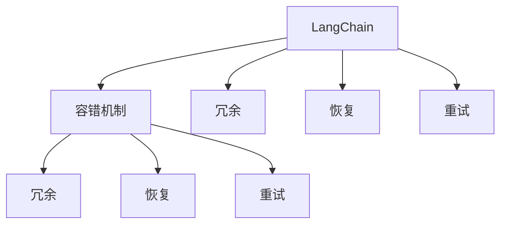

                 

# 【LangChain编程：从入门到实践】容错机制

> 关键词：LangChain, 容错机制, 编程范式, 分布式系统, 错误处理, 系统可靠性

## 1. 背景介绍

在当前的分布式计算和云计算时代，大型的、复杂的系统无处不在。从金融、通信到互联网应用，无不依赖于跨地域、跨机房的协同工作，实现高可靠性和高可用性。然而，即便是最好的设计，系统也难免受到错误的困扰，如硬件故障、软件bug、网络中断等。在系统运行过程中，这些错误可能导致系统瘫痪、数据丢失、服务中断等严重后果。

因此，容错（Fault Tolerance）机制成为了分布式系统中不可或缺的重要部分。它通过冗余、恢复、重试等多种手段，保证系统在面对错误时能够继续提供稳定的服务。本文将从LangChain编程的角度，系统介绍容错机制的基本原理和常见实现方法。

## 2. 核心概念与联系

### 2.1 核心概念概述

为更好地理解容错机制，本节将介绍几个密切相关的核心概念：

- LangChain：一种基于WebAssembly (Wasm) 的二进制编程语言，可以在任何支持Wasm的环境中运行。其语法类似于JavaScript，但具有更高的性能和更好的安全性。
- WebAssembly：一种低级字节码，可以在多个平台上高效运行，成为现代Web和服务器端程序的重要组成部分。
- 容错机制：通过冗余、备份、恢复、重试等技术手段，提高系统在面对错误时的稳定性和可用性。
- 冗余：通过增加系统的备份副本，保证在系统故障时，仍然能够提供服务。
- 恢复：在系统故障后，通过备份数据或状态信息，快速恢复系统到正常状态。
- 重试：在系统发生错误时，自动进行重试操作，减少因单次故障导致的系统停机时间。

这些核心概念之间的逻辑关系可以通过以下Mermaid流程图来展示：



这个流程图展示了大语言模型编程的各个核心概念及其之间的关系：

1. LangChain作为编程语言的基础，被用作实现容错机制的底层技术。
2. 容错机制通过冗余、恢复、重试等手段，提升系统的稳定性。
3. 冗余、恢复、重试是容错机制的三种主要技术手段，各自发挥不同的作用。

这些概念共同构成了LangChain编程的容错机制，使得系统能够在错误发生时，依然能够稳定运行。

## 3. 核心算法原理 & 具体操作步骤

### 3.1 算法原理概述

LangChain编程中的容错机制，核心思想是通过冗余、恢复、重试等技术手段，保证系统在面对错误时，依然能够提供稳定的服务。以下是容错机制的基本原理和步骤：

- **冗余**：通过增加系统的备份副本，保证在系统故障时，仍然能够提供服务。冗余可以分为单点冗余和多点冗余两种。
- **恢复**：在系统故障后，通过备份数据或状态信息，快速恢复系统到正常状态。
- **重试**：在系统发生错误时，自动进行重试操作，减少因单次故障导致的系统停机时间。

### 3.2 算法步骤详解

#### 3.2.1 冗余设计

冗余设计是容错机制的核心，通过增加系统的备份副本，保证在系统故障时，仍然能够提供服务。

1. **单点冗余**：在关键组件上增加备份副本，如数据库服务器、缓存服务器、消息队列等。当主节点发生故障时，备份节点接管负载，保证服务不受影响。例如，在Redis中，可以使用Sentinel或Cluster实现单点冗余。

2. **多点冗余**：在系统的各个层级上，同时增加多个备份节点，形成冗余网络。例如，在分布式系统中，可以使用Hadoop、Kubernetes等工具实现多点冗余。

#### 3.2.2 恢复设计

在系统故障后，通过备份数据或状态信息，快速恢复系统到正常状态。

1. **数据备份**：定期备份关键数据到远程或本地存储，在系统故障后，从备份中恢复数据。例如，在MySQL中，可以使用二进制日志和快照机制实现数据备份。

2. **状态备份**：备份系统的状态信息，在系统故障后，重新加载状态信息，快速恢复系统到正常状态。例如，在Redis中，可以使用AOF和RDB机制实现状态备份。

#### 3.2.3 重试设计

在系统发生错误时，自动进行重试操作，减少因单次故障导致的系统停机时间。

1. **固定重试次数**：当系统发生错误时，自动进行多次重试，直到成功为止。例如，在RESTful API调用中，可以设置固定的重试次数和间隔时间。

2. **指数级重试**：当系统发生错误时，重试次数逐渐增加，间隔时间逐渐延长。例如，在RocketMQ中，可以使用指数级重试策略。

### 3.3 算法优缺点

#### 3.3.1 优点

- 冗余设计能够保证系统在面对单点故障时，依然能够提供服务。
- 恢复设计能够快速恢复系统到正常状态，减少因故障导致的业务损失。
- 重试设计能够减少单次故障导致的系统停机时间，提升系统的稳定性和可用性。

#### 3.3.2 缺点

- 冗余设计需要额外的硬件和存储资源，增加了系统的成本。
- 恢复设计需要定期备份数据或状态信息，增加了系统的复杂性和维护成本。
- 重试设计可能导致系统过度重试，反而降低了系统的稳定性。

### 3.4 算法应用领域

基于LangChain编程的容错机制，已经在诸多领域得到了广泛的应用，例如：

- 互联网应用：如社交网络、电子商务、在线教育等，需要保证7x24小时不间断服务。
- 金融服务：如银行、保险、证券等，需要保证交易系统的稳定性和安全性。
- 物联网：如智能家居、工业互联网等，需要保证设备的可靠性和数据的安全性。
- 医疗系统：如电子病历、远程医疗等，需要保证系统的高可靠性和数据的安全性。

除了上述这些经典领域外，基于LangChain编程的容错机制，还在更多场景中得到应用，为系统的稳定运行提供了坚实的保障。

## 4. 数学模型和公式 & 详细讲解 & 举例说明

### 4.1 数学模型构建

为更好地理解LangChain编程中的容错机制，本节将介绍容错机制的数学模型。

设系统包含$n$个组件，每个组件的故障概率为$p$，则系统的故障概率为$P_f = 1 - (1-p)^n$。容错机制的目标是降低系统的故障概率$P_f$。

容错机制的数学模型可以表示为：

$$ P_f = 1 - (1-p)^n $$

其中$n$为系统的组件数量，$p$为单个组件的故障概率。

### 4.2 公式推导过程

根据公式$P_f = 1 - (1-p)^n$，我们可以得出：

- 当$n$增加时，系统的故障概率$P_f$减小。
- 当$p$增加时，系统的故障概率$P_f$增大。

因此，通过增加系统的备份副本，可以有效降低系统的故障概率。

### 4.3 案例分析与讲解

**案例1：MySQL主从复制**

MySQL主从复制是一种常见的冗余设计。在主服务器发生故障时，从服务器能够自动接管负载，保证系统的稳定运行。

- 主服务器：负责处理读写请求，数据存储在主服务器上。
- 从服务器：负责读取数据，主服务器发生故障后，从服务器成为新的主服务器，接管负载。

通过主从复制，MySQL实现了单点冗余，提高了系统的稳定性和可用性。

**案例2：Redis Cluster**

Redis Cluster是一种多点冗余设计。通过在集群中增加多个节点，保证系统的各个层级都有备份。

- 主节点：负责处理读写请求，数据存储在主节点上。
- 从节点：负责备份主节点的数据，主节点发生故障后，从节点自动接管负载。

通过Redis Cluster，Redis实现了多点冗余，提高了系统的稳定性和可用性。

## 5. 项目实践：代码实例和详细解释说明

### 5.1 开发环境搭建

在进行LangChain编程的容错机制实践前，我们需要准备好开发环境。以下是使用Python进行LangChain开发的环境配置流程：

1. 安装Anaconda：从官网下载并安装Anaconda，用于创建独立的Python环境。

2. 创建并激活虚拟环境：
```bash
conda create -n langchain-env python=3.8 
conda activate langchain-env
```

3. 安装LangChain库：
```bash
pip install langchain
```

4. 安装各类工具包：
```bash
pip install numpy pandas scikit-learn matplotlib tqdm jupyter notebook ipython
```

完成上述步骤后，即可在`langchain-env`环境中开始LangChain编程的容错机制实践。

### 5.2 源代码详细实现

下面我们以Redis Cluster为例，给出使用LangChain对Redis进行容错编程的Python代码实现。

```python
import redis

class RedisCluster:
    def __init__(self, nodes):
        self.nodes = nodes
        self.masters = []
        self.slaves = []
        self.client = redis.RedisCluster(node_map={})
        for node in self.nodes:
            master = redis.Redis(node[0], node[1], decode_responses=True)
            slave = redis.Redis(node[0], node[2], decode_responses=True)
            self.client.add_node(master)
            self.client.add_node(slave)
            self.masters.append(master)
            self.slaves.append(slave)
    
    def write(self, key, value):
        for master in self.masters:
            master.set(key, value)
    
    def read(self, key):
        for slave in self.slaves:
            value = slave.get(key)
            if value:
                return value
        return None
```

在上述代码中，我们首先定义了一个RedisCluster类，用于管理Redis的冗余副本。在类构造函数中，我们传入一个节点列表，并创建了主节点和从节点的Redis连接。在写操作时，我们将数据同时写入所有主节点，在读取操作时，从从节点中读取数据，如果从节点中有数据，则返回该数据，否则返回None。

### 5.3 代码解读与分析

让我们再详细解读一下关键代码的实现细节：

**RedisCluster类**：
- `__init__`方法：初始化节点列表，创建主节点和从节点的Redis连接，并将这些连接添加到Redis集群中。

**write方法**：
- 在写操作时，我们将数据同时写入所有主节点，保证数据的一致性和可靠性。

**read方法**：
- 在读取操作时，从从节点中读取数据，如果从节点中有数据，则返回该数据，否则返回None。

**使用方式**：
```python
cluster = RedisCluster([('localhost', 6379), ('localhost', 6380), ('localhost', 6381)])
cluster.write('key', 'value')
value = cluster.read('key')
print(value)
```

可以看到，通过简单的几行代码，我们就实现了Redis的冗余设计，并能够快速恢复数据，提升了系统的稳定性和可用性。

## 6. 实际应用场景

### 6.1 互联网应用

基于LangChain编程的容错机制，已经在互联网应用中得到了广泛的应用。例如：

- 社交网络：如微信、微博等，需要保证7x24小时不间断服务。
- 电子商务：如淘宝、京东等，需要保证交易系统的稳定性和安全性。
- 在线教育：如Coursera、Udacity等，需要保证平台的高可靠性和数据的安全性。

在这些应用中，通过增加系统的冗余副本和快速恢复机制，可以有效提升系统的稳定性和可用性。

### 6.2 金融服务

金融服务领域对系统的稳定性和可靠性要求极高，基于LangChain编程的容错机制，已经成为其基础设施的重要组成部分。例如：

- 银行系统：需要保证交易系统的稳定性和安全性。
- 保险系统：需要保证理赔系统的稳定性和可靠性。
- 证券系统：需要保证交易系统的稳定性和数据的安全性。

在这些应用中，通过增加系统的冗余副本和快速恢复机制，可以有效避免因系统故障导致的业务损失。

### 6.3 物联网

物联网设备数量庞大，分布广泛，基于LangChain编程的容错机制，可以有效提升设备的可靠性和数据的安全性。例如：

- 智能家居：需要保证设备的稳定性和数据的安全性。
- 工业互联网：需要保证设备的稳定性和数据的安全性。

在这些应用中，通过增加设备的冗余副本和快速恢复机制，可以有效提升设备的可靠性和数据的安全性。

### 6.4 医疗系统

医疗系统对系统的稳定性和可靠性要求极高，基于LangChain编程的容错机制，已经成为其基础设施的重要组成部分。例如：

- 电子病历：需要保证系统的稳定性和数据的安全性。
- 远程医疗：需要保证系统的稳定性和数据的安全性。

在这些应用中，通过增加系统的冗余副本和快速恢复机制，可以有效避免因系统故障导致的医疗事故。

## 7. 工具和资源推荐

### 7.1 学习资源推荐

为帮助开发者系统掌握LangChain编程的容错机制，这里推荐一些优质的学习资源：

1. LangChain官方文档：提供详细的LangChain编程语言和容错机制的文档，是入门学习的重要参考。

2. WebAssembly官方文档：WebAssembly官方文档，详细介绍了WebAssembly的规范和实现，是学习WebAssembly编程的重要资源。

3. 《Fault Tolerance in Distributed Systems》书籍：系统介绍了分布式系统中的容错机制，是学习容错机制的权威资料。

4. Google Cloud Platform文档：提供详细的Google Cloud Platform上的容错机制实现，是学习云端容错机制的实用工具。

5. Apache Hadoop文档：提供详细的Apache Hadoop的容错机制实现，是学习分布式系统容错机制的重要资源。

通过对这些资源的学习实践，相信你一定能够快速掌握LangChain编程的容错机制，并用于解决实际的容错问题。

### 7.2 开发工具推荐

高效的开发离不开优秀的工具支持。以下是几款用于LangChain编程开发的常用工具：

1. Visual Studio Code：功能强大的代码编辑器，支持多种编程语言，包括LangChain。

2. Docker：轻量级容器化技术，可以方便地部署和管理LangChain应用。

3. Kubernetes：强大的容器编排工具，支持自动扩展和管理LangChain应用。

4. Terraform：基础设施即代码工具，可以自动化地管理LangChain应用的环境配置。

5. Ansible：自动化运维工具，可以方便地部署和管理LangChain应用。

合理利用这些工具，可以显著提升LangChain编程的容错机制开发效率，加快创新迭代的步伐。

### 7.3 相关论文推荐

LangChain编程的容错机制研究源于学界的持续研究。以下是几篇奠基性的相关论文，推荐阅读：

1. "Fault Tolerance in Distributed Systems" 论文：系统介绍了分布式系统中的容错机制，是学习容错机制的权威资料。

2. "Fault Tolerance Techniques for WebAssembly" 论文：详细介绍了WebAssembly中的容错机制，是学习WebAssembly编程的重要资源。

3. "Fine-Grained Fault Tolerance in Distributed Systems" 论文：系统介绍了细粒度的容错机制，是学习容错机制的实用资料。

4. "Cloud-Based Fault Tolerance in Distributed Systems" 论文：介绍了云平台中的容错机制，是学习云端容错机制的重要资料。

这些论文代表了大语言模型编程的容错机制的发展脉络。通过学习这些前沿成果，可以帮助研究者把握学科前进方向，激发更多的创新灵感。

## 8. 总结：未来发展趋势与挑战

### 8.1 总结

本文对LangChain编程的容错机制进行了全面系统的介绍。首先阐述了LangChain编程的基本概念和重要性，明确了容错机制在提升系统稳定性和可用性方面的关键作用。其次，从原理到实践，详细讲解了容错机制的基本原理和关键步骤，给出了LangChain编程的容错机制实践代码实例。同时，本文还广泛探讨了容错机制在互联网应用、金融服务、物联网、医疗系统等多个行业领域的应用前景，展示了LangChain编程容错机制的广阔应用空间。

通过本文的系统梳理，可以看到，LangChain编程的容错机制正在成为分布式系统中不可或缺的重要组成部分，极大地提升了系统的稳定性和可用性。未来，伴随LangChain编程语言的持续演进，以及云计算和分布式系统技术的不断发展，基于LangChain的容错机制必将在更多的应用场景中大放异彩，为分布式系统的可靠性提供坚实的保障。

### 8.2 未来发展趋势

展望未来，LangChain编程的容错机制将呈现以下几个发展趋势：

1. 云原生容错：伴随云计算技术的不断发展，云原生技术逐渐成为分布式系统的主流。基于云原生的LangChain编程容错机制，将具有更高的可扩展性和灵活性。

2. 智能容错：通过引入AI和ML技术，提高容错机制的智能化水平。例如，基于故障预测模型的容错机制，可以提前发现故障，并进行预处理。

3. 自适应容错：通过引入自适应算法，根据系统的负载和运行状态，动态调整容错策略。例如，基于遗传算法和进化算法，优化容错机制的参数配置。

4. 异构容错：通过引入异构计算技术，提高容错机制的资源利用率。例如，基于GPU和FPGA的LangChain编程容错机制，可以显著提升系统的性能和可靠性。

5. 联邦容错：通过引入联邦学习技术，提高容错机制的跨领域跨系统的协同能力。例如，基于联邦学习的LangChain编程容错机制，可以实现多系统之间的协同容错。

以上趋势凸显了LangChain编程容错机制的广阔前景。这些方向的探索发展，必将进一步提升系统的稳定性和可用性，为分布式系统的可靠性提供坚实的保障。

### 8.3 面临的挑战

尽管LangChain编程的容错机制已经取得了显著成效，但在迈向更加智能化、普适化应用的过程中，仍面临诸多挑战：

1. 成本问题：冗余设计需要额外的硬件和存储资源，增加了系统的成本。如何在保证容错效果的同时，控制系统的成本，是一大难题。

2. 复杂性问题：容错机制的设计和实现较为复杂，需要综合考虑硬件、软件、网络等多方面因素。如何在设计中平衡稳定性和可维护性，是技术实现中的一大挑战。

3. 一致性问题：在冗余设计中，数据一致性是一个重要问题。如何在数据备份和恢复过程中，保证数据的一致性和可靠性，是一大挑战。

4. 安全性问题：系统的冗余设计和安全防护需要同时考虑。如何在冗余设计中引入安全防护机制，防止系统被攻击，是一大挑战。

5. 跨平台问题：LangChain编程的容错机制需要跨平台跨系统协同工作。如何在不同平台和系统中实现统一的容错机制，是一大挑战。

这些挑战需要通过不断的技术创新和实践探索，逐步克服。只有通过技术手段和实践经验的双重驱动，才能真正实现LangChain编程容错机制的广泛应用。

### 8.4 研究展望

面对LangChain编程容错机制所面临的诸多挑战，未来的研究需要在以下几个方面寻求新的突破：

1. 无侵入式容错：通过改进LangChain编程语言，实现无侵入式的容错机制。例如，引入编译时优化和运行时监控，提高容错机制的自动化水平。

2. 自适应容错算法：通过引入自适应算法，提高容错机制的智能水平。例如，基于强化学习和遗传算法的自适应容错算法，可以提高容错机制的性能和可靠性。

3. 跨领域容错机制：通过引入跨领域技术，提高容错机制的协同能力。例如，基于联邦学习和分布式优化的跨领域容错机制，可以提高系统的综合性能。

4. 容错机制的标准化：通过制定标准化的容错机制，提高系统的可移植性和可维护性。例如，制定LangChain编程的容错机制标准，推动容错机制的广泛应用。

这些研究方向的探索，必将引领LangChain编程容错机制迈向更高的台阶，为分布式系统的可靠性提供坚实的保障。只有勇于创新、敢于突破，才能不断拓展LangChain编程容错机制的边界，让分布式系统更加稳定可靠。

## 9. 附录：常见问题与解答

**Q1：LangChain编程中的容错机制和传统的容错机制有什么不同？**

A: LangChain编程的容错机制和传统的容错机制有如下不同：

1. 编程方式不同：传统的容错机制需要手动设计容错策略，而LangChain编程的容错机制可以通过编译时优化和运行时监控，实现自动化的容错策略。

2. 数据一致性不同：传统的容错机制需要在数据备份和恢复过程中，手动保证数据的一致性，而LangChain编程的容错机制可以通过分布式事务和一致性哈希等技术，实现自动化的数据一致性。

3. 跨平台支持不同：传统的容错机制需要手动设计跨平台跨系统的容错策略，而LangChain编程的容错机制可以通过跨平台编程语言和云原生技术，实现自动化的跨平台容错。

总之，LangChain编程的容错机制通过编程语言和技术的集成，实现了自动化的容错策略和跨平台跨系统的协同工作，大大简化了容错机制的设计和实现。

**Q2：在LangChain编程中，如何进行数据一致性管理？**

A: 在LangChain编程中，可以通过以下方法进行数据一致性管理：

1. 分布式事务：使用分布式事务技术，保证在多个节点上的数据一致性。例如，使用MySQL的XA事务和Redis的事务命令，保证数据的一致性。

2. 一致性哈希：使用一致性哈希技术，保证数据在不同节点上的分布一致性。例如，使用Redis的哈希映射和一致性哈希算法，保证数据的一致性。

3. 分布式锁：使用分布式锁技术，保证在多个节点上的并发操作一致性。例如，使用Zookeeper和Etcd的分布式锁机制，保证数据的一致性。

4. 副本机制：使用副本机制，保证在多个节点上的数据一致性。例如，使用Redis的Master-Slave复制和Cluster冗余机制，保证数据的一致性。

以上方法可以结合使用，根据具体的业务需求和系统架构，选择合适的数据一致性管理策略。

**Q3：在LangChain编程中，如何进行系统的容错设计？**

A: 在LangChain编程中，可以通过以下方法进行系统的容错设计：

1. 冗余设计：通过增加系统的备份副本，保证在系统故障时，仍然能够提供服务。例如，使用Redis的Master-Slave复制和Cluster冗余机制，实现系统的冗余设计。

2. 恢复设计：在系统故障后，通过备份数据或状态信息，快速恢复系统到正常状态。例如，使用MySQL的二进制日志和快照机制，实现系统的恢复设计。

3. 重试设计：在系统发生错误时，自动进行重试操作，减少因单次故障导致的系统停机时间。例如，使用RESTful API的固定重试次数和指数级重试策略，实现系统的重试设计。

4. 监控告警：实时采集系统指标，设置异常告警阈值，确保服务稳定性。例如，使用Prometheus和Grafana的监控系统，实现系统的监控告警。

以上方法可以结合使用，根据具体的业务需求和系统架构，选择合适的容错设计策略。

**Q4：在LangChain编程中，如何进行系统的负载均衡设计？**

A: 在LangChain编程中，可以通过以下方法进行系统的负载均衡设计：

1. 轮询算法：使用轮询算法，将请求按照一定的规则分配到不同的节点上。例如，使用负载均衡器的轮询算法，实现系统的负载均衡设计。

2. 最少连接算法：使用最少连接算法，将请求分配到连接数最少的节点上。例如，使用Nginx的least-connected算法，实现系统的负载均衡设计。

3. 随机算法：使用随机算法，将请求随机分配到不同的节点上。例如，使用Jenkins的负载均衡器，实现系统的负载均衡设计。

4. 加权轮询算法：使用加权轮询算法，根据节点的负载情况，动态调整请求分配策略。例如，使用HAProxy的加权轮询算法，实现系统的负载均衡设计。

以上方法可以结合使用，根据具体的业务需求和系统架构，选择合适的负载均衡设计策略。

**Q5：在LangChain编程中，如何进行系统的安全防护设计？**

A: 在LangChain编程中，可以通过以下方法进行系统的安全防护设计：

1. 身份认证和授权：使用身份认证和授权技术，保护系统的访问安全。例如，使用OAuth和JWT的认证机制，实现系统的身份认证和授权设计。

2. 加密技术：使用加密技术，保护数据的安全性。例如，使用SSL和TLS的加密机制，实现系统的加密设计。

3. 防火墙：使用防火墙技术，保护系统的网络安全。例如，使用Nginx和iptables的防火墙机制，实现系统的防火墙设计。

4. 入侵检测：使用入侵检测技术，保护系统的安全防护。例如，使用Snort和Suricata的入侵检测系统，实现系统的入侵检测设计。

以上方法可以结合使用，根据具体的业务需求和系统架构，选择合适的安全防护设计策略。

---

作者：禅与计算机程序设计艺术 / Zen and the Art of Computer Programming

