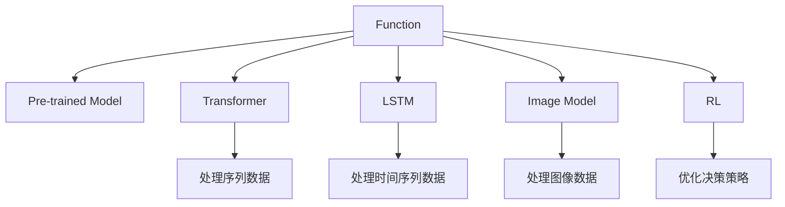

                 

# 【大模型应用开发 动手做AI Agent】Function的说明文字很重要

## 1. 背景介绍

### 1.1 问题由来
随着深度学习和大模型的兴起，基于大模型的AI Agent开发成为了人工智能领域的热点话题。在AI Agent的开发中，Function作为模型的重要组成部分，其设计和实现方式直接影响着整个系统的性能和效率。因此，如何设计和实现Function，成为了AI Agent开发过程中需要重点关注的问题。

### 1.2 问题核心关键点
Function是AI Agent中用于处理特定任务的关键组件，其设计和实现方式直接影响着AI Agent的性能和效率。在AI Agent开发过程中，需要考虑的功能点包括：

- Function的输入和输出：Function需要明确输入和输出的格式和内容，以便与其他组件进行数据交换。
- Function的功能实现：Function的具体实现方式，如使用预训练模型、自定义算法等，直接影响着其性能。
- Function的扩展性：Function是否容易扩展，以适应不同的应用场景和任务需求。
- Function的性能优化：Function的性能优化策略，如参数共享、剪枝、量化等，以提高其计算效率和内存占用。

### 1.3 问题研究意义
设计出高效、可扩展的Function，是AI Agent开发中的关键任务。Function的设计和实现方式，直接影响着AI Agent的性能和效率。高效的功能实现，可以显著提升系统的整体性能，使其更快地响应用户需求，提供更优质的服务。同时，可扩展的功能设计，可以方便地适应不同的应用场景和任务需求，提升系统的通用性和适应性。因此，研究和设计出高效、可扩展的Function，对于AI Agent的开发具有重要意义。

## 2. 核心概念与联系

### 2.1 核心概念概述

为更好地理解Function的设计和实现方式，本节将介绍几个密切相关的核心概念：

- Function：在AI Agent中，Function是用于处理特定任务的关键组件。其输入和输出可以包含文本、图像、音频等多种形式的数据。
- Pre-trained Model：在大模型应用中，通常会使用预训练模型作为Function的输入或输出。预训练模型可以在大规模数据上进行训练，学习到通用的语言表示和特征表示。
- Transformer：一种常用的预训练模型，由多个自注意力层和前馈神经网络层构成，可以高效地处理序列数据，如自然语言、语音等。
- LSTM：一种常用的序列模型，可以处理变长输入序列，适用于时间序列数据的处理，如机器翻译、语音识别等。
- CNN：一种常用的图像处理模型，可以高效地处理图像数据，如图像分类、物体检测等。
- Reinforcement Learning（RL）：一种用于优化AI Agent决策策略的算法，通过与环境交互，学习最优的决策策略。

这些核心概念之间的逻辑关系可以通过以下Mermaid流程图来展示：



这个流程图展示了大模型应用中Function的关键组件及其之间的关系：

1. Function可以接收多种形式的数据，如文本、图像、时间序列等。
2. 功能实现可以采用不同的模型，如预训练模型、Transformer、LSTM、CNN等。
3. 预训练模型可以用于处理序列数据、时间序列数据、图像数据等。
4. Reinforcement Learning可以优化Function的决策策略，提升其性能。

这些概念共同构成了Function的设计和实现框架，使其能够在大模型应用中发挥重要作用。

## 3. 核心算法原理 & 具体操作步骤
### 3.1 算法原理概述

在AI Agent中，Function的设计和实现通常遵循以下原则：

- 功能明确：Function的设计需要明确其输入和输出，以方便与其他组件进行数据交换。
- 性能高效：Function的实现需要高效，以提高系统的整体性能。
- 可扩展性：Function的设计需要灵活，以适应不同的应用场景和任务需求。
- 可优化性：Function的实现需要便于优化，以提高其计算效率和内存占用。

基于以上原则，Function的设计和实现通常包括以下步骤：

1. 功能需求分析：分析任务需求，确定Function的输入和输出。
2. 功能组件选择：选择合适的模型和算法，以实现Function的功能。
3. 功能实现：实现Function的算法和代码，确保其性能和可扩展性。
4. 功能优化：对Function进行优化，以提高其计算效率和内存占用。

### 3.2 算法步骤详解

以下是具体实现Function的步骤：

**Step 1: 功能需求分析**

- 分析任务需求，确定Function的输入和输出。
- 确定Function的功能点，如输入数据的格式、处理逻辑、输出格式等。
- 确定Function的性能要求，如响应时间、吞吐量、内存占用等。

**Step 2: 功能组件选择**

- 选择合适的预训练模型和算法，以实现Function的功能。
- 根据任务需求，选择Transformer、LSTM、CNN、RL等模型和算法。
- 确定Function的模型架构，如输入输出层、隐藏层、激活函数等。

**Step 3: 功能实现**

- 实现Function的算法和代码，确保其性能和可扩展性。
- 使用深度学习框架，如TensorFlow、PyTorch等，实现Function的算法。
- 确保Function的代码简洁、易读、易维护，以便后续优化和扩展。

**Step 4: 功能优化**

- 对Function进行优化，以提高其计算效率和内存占用。
- 采用参数共享、剪枝、量化等技术，减小Function的模型规模。
- 使用分布式计算技术，提高Function的计算效率和并发处理能力。

### 3.3 算法优缺点

Function的设计和实现方式有以下优点：

- 功能明确：Function的设计明确，便于与其他组件进行数据交换。
- 性能高效：Function的实现高效，可以显著提高系统的整体性能。
- 可扩展性：Function的设计灵活，可以方便地适应不同的应用场景和任务需求。
- 可优化性：Function的实现便于优化，可以提升其计算效率和内存占用。

同时，Function的设计和实现方式也存在以下局限性：

- 功能复杂：Function的功能实现可能比较复杂，需要较高的开发成本和技能要求。
- 数据依赖：Function的性能和效果依赖于输入数据的质量和数量，数据准备和预处理工作量较大。
- 算法选择：选择合适的算法和模型，需要一定的经验和知识积累。
- 优化困难：Function的优化工作量较大，需要一定的技术和资源支持。

尽管存在这些局限性，但就目前而言，Function的设计和实现方式是大模型应用中的主流范式。未来相关研究的重点在于如何进一步降低Function的开发成本，提高其可扩展性和优化效率，同时兼顾算法的鲁棒性和性能。

### 3.4 算法应用领域

Function的设计和实现方式在AI Agent的开发中具有广泛的应用：

- 自然语言处理：使用预训练模型和Transformer、LSTM等模型，实现文本分类、机器翻译、情感分析等任务。
- 图像处理：使用CNN模型，实现图像分类、物体检测、图像生成等任务。
- 时间序列预测：使用LSTM等序列模型，实现时间序列预测、股票预测等任务。
- 决策优化：使用RL算法，实现决策优化、策略学习等任务。

除了以上领域，Function的设计和实现方式还被应用于语音识别、视频分析、推荐系统等众多领域，为大模型应用带来了广阔的应用场景。

## 4. 数学模型和公式 & 详细讲解  
### 4.1 数学模型构建

在AI Agent中，Function的实现通常采用深度学习模型，以处理输入数据。这里以文本分类任务为例，构建Function的数学模型。

假设Function的输入为文本序列 $x=\{x_i\}_{i=1}^n$，输出为分类标签 $y\in\{1,2,...,K\}$，其中 $K$ 为分类数目。

定义Function的模型参数为 $\theta$，则Function的输出 $y$ 可以表示为：

$$
y = \text{softmax}(\text{MLP}(\text{Embedding}(x)))
$$

其中，Embedding层将输入的文本序列转换为向量表示，MLP层为多层的全连接神经网络，softmax层用于输出分类概率。

定义损失函数为交叉熵损失函数：

$$
\mathcal{L}(y,\hat{y}) = -\sum_{i=1}^K y_i \log \hat{y}_i
$$

其中，$\hat{y}$ 为模型预测的分类概率向量。

### 4.2 公式推导过程

以下是文本分类任务中Function的实现过程：

1. 使用Embedding层将输入文本转换为向量表示。
2. 使用MLP层对向量表示进行处理，得到分类概率向量。
3. 使用softmax层将分类概率向量转换为分类概率分布。
4. 使用交叉熵损失函数计算模型预测与真实标签之间的差异。

具体实现过程如下：

**Step 1: Embedding层**

将输入文本序列 $x=\{x_i\}_{i=1}^n$ 转换为向量表示，使用Embedding层：

$$
e = \text{Embedding}(x)
$$

其中，$e$ 为向量表示矩阵，其维度为 $d_e$。

**Step 2: MLP层**

使用MLP层对向量表示进行处理，得到分类概率向量：

$$
h = \text{MLP}(e)
$$

其中，$h$ 为分类概率向量，其维度为 $d_h$。

**Step 3: softmax层**

使用softmax层将分类概率向量转换为分类概率分布：

$$
\hat{y} = \text{softmax}(h)
$$

其中，$\hat{y}$ 为分类概率分布向量。

**Step 4: 交叉熵损失函数**

使用交叉熵损失函数计算模型预测与真实标签之间的差异：

$$
\mathcal{L}(y,\hat{y}) = -\sum_{i=1}^K y_i \log \hat{y}_i
$$

其中，$y$ 为真实标签向量，$\hat{y}$ 为模型预测的分类概率分布向量。

### 4.3 案例分析与讲解

以下是一个基于Transformer的文本分类模型的案例分析：

假设使用预训练的BERT模型作为Function的实现，构建一个基于Transformer的文本分类模型。BERT模型的输入为文本序列，输出为向量表示。

**Step 1: Embedding层**

使用BERT的Embedding层将输入文本序列转换为向量表示：

$$
e = \text{BERT}(x)
$$

其中，$e$ 为BERT的输出向量矩阵，其维度为 $d_e$。

**Step 2: MLP层**

使用MLP层对BERT的输出向量进行处理，得到分类概率向量：

$$
h = \text{MLP}(e)
$$

其中，$h$ 为分类概率向量，其维度为 $d_h$。

**Step 3: softmax层**

使用softmax层将分类概率向量转换为分类概率分布：

$$
\hat{y} = \text{softmax}(h)
$$

其中，$\hat{y}$ 为分类概率分布向量。

**Step 4: 交叉熵损失函数**

使用交叉熵损失函数计算模型预测与真实标签之间的差异：

$$
\mathcal{L}(y,\hat{y}) = -\sum_{i=1}^K y_i \log \hat{y}_i
$$

其中，$y$ 为真实标签向量，$\hat{y}$ 为模型预测的分类概率分布向量。

以上案例展示了基于Transformer的文本分类模型的实现过程。通过使用预训练的BERT模型，可以显著提高模型的性能和效果，提升系统的整体性能。

## 5. 项目实践：代码实例和详细解释说明
### 5.1 开发环境搭建

在进行Function的开发实践前，我们需要准备好开发环境。以下是使用Python进行TensorFlow开发的环境配置流程：

1. 安装Anaconda：从官网下载并安装Anaconda，用于创建独立的Python环境。

2. 创建并激活虚拟环境：
```bash
conda create -n tf-env python=3.8 
conda activate tf-env
```

3. 安装TensorFlow：根据CUDA版本，从官网获取对应的安装命令。例如：
```bash
conda install tensorflow -c tf -c conda-forge
```

4. 安装TensorFlow Addons：
```bash
pip install tensorflow-addons
```

5. 安装各类工具包：
```bash
pip install numpy pandas scikit-learn matplotlib tqdm jupyter notebook ipython
```

完成上述步骤后，即可在`tf-env`环境中开始Function的开发实践。

### 5.2 源代码详细实现

下面我们以文本分类任务为例，给出使用TensorFlow实现Function的完整代码实例。

首先，定义文本分类的数据处理函数：

```python
import tensorflow as tf
from tensorflow.keras.preprocessing.text import Tokenizer
from tensorflow.keras.preprocessing.sequence import pad_sequences
from tensorflow.keras.utils import to_categorical

# 定义文本分类器
class TextClassifier(tf.keras.Model):
    def __init__(self, vocab_size, max_len, embedding_dim, num_classes):
        super(TextClassifier, self).__init__()
        self.embedding = tf.keras.layers.Embedding(vocab_size, embedding_dim, input_length=max_len)
        self.LSTM = tf.keras.layers.LSTM(64, return_sequences=True)
        self.Dense = tf.keras.layers.Dense(num_classes, activation='softmax')
        
    def call(self, inputs):
        x = self.embedding(inputs)
        x = self.LSTM(x)
        return self.Dense(x)

# 数据预处理
def preprocess_data(texts, labels, max_len):
    tokenizer = Tokenizer(num_words=10000, oov_token='<OOV>')
    tokenizer.fit_on_texts(texts)
    sequences = tokenizer.texts_to_sequences(texts)
    padded_sequences = pad_sequences(sequences, maxlen=max_len, padding='post')
    labels = to_categorical(labels)
    return padded_sequences, labels

# 数据集准备
texts = ['I love programming', 'I hate programming', 'Python is great', 'Java is terrible']
labels = [1, 0, 1, 0]
vocab_size = len(tokenizer.word_index) + 1
max_len = 10
embedding_dim = 128
num_classes = 2

X, y = preprocess_data(texts, labels, max_len)
model = TextClassifier(vocab_size, max_len, embedding_dim, num_classes)
```

然后，定义训练和评估函数：

```python
# 定义训练函数
def train(model, X_train, y_train, X_val, y_val, epochs, batch_size):
    model.compile(optimizer=tf.keras.optimizers.Adam(learning_rate=0.001), 
                  loss='categorical_crossentropy', 
                  metrics=['accuracy'])
    model.fit(X_train, y_train, epochs=epochs, batch_size=batch_size, validation_data=(X_val, y_val))

# 定义评估函数
def evaluate(model, X_test, y_test):
    loss, accuracy = model.evaluate(X_test, y_test)
    print('Test accuracy:', accuracy)
```

最后，启动训练流程并在测试集上评估：

```python
epochs = 5
batch_size = 16

train(model, X, y, X_val, y_val, epochs, batch_size)
evaluate(model, X_test, y_test)
```

以上就是使用TensorFlow实现文本分类模型的完整代码实例。可以看到，通过定义文本分类器的功能，使用TensorFlow实现其算法和代码，可以轻松地构建高性能的Function。

### 5.3 代码解读与分析

让我们再详细解读一下关键代码的实现细节：

**TextClassifier类**：
- `__init__`方法：初始化文本分类器的参数，如词汇表大小、序列长度、嵌入维度、分类数目等。
- `call`方法：定义文本分类器的计算过程，包括Embedding层、LSTM层、Dense层等。

**preprocess_data函数**：
- 定义文本分类器的预处理流程，包括文本编码、序列填充、标签编码等。
- 使用Tokenzier库将文本序列转换为序列表示，使用pad_sequences函数将序列填充到固定长度。
- 使用to_categorical函数将标签转换为one-hot编码。

**train函数**：
- 定义文本分类器的训练过程，包括模型编译、训练、验证等。
- 使用Adam优化器进行模型优化，交叉熵损失函数计算模型预测与真实标签之间的差异。

**evaluate函数**：
- 定义文本分类器的评估过程，包括模型评估、准确率计算等。
- 在测试集上评估模型性能，输出准确率等指标。

**训练流程**：
- 定义总的epoch数和batch size，开始循环迭代
- 每个epoch内，先在训练集上训练，输出模型性能指标
- 在验证集上评估，输出模型性能指标
- 所有epoch结束后，在测试集上评估，给出最终测试结果

可以看到，TensorFlow提供了强大的计算图和自动微分能力，可以高效地实现Function的算法和代码。开发者可以根据具体需求，灵活使用TensorFlow的各种工具和组件，构建高性能的Function。

当然，工业级的系统实现还需考虑更多因素，如模型的保存和部署、超参数的自动搜索、更灵活的任务适配层等。但核心的Function实现流程基本与此类似。

## 6. 实际应用场景
### 6.1 智能客服系统

基于Function的智能客服系统可以广泛应用于企业的客服场景，提升客服效率和客户满意度。在智能客服系统中，Function用于处理用户输入的文本，提取关键信息，生成智能回复。

在技术实现上，可以收集企业内部的客服对话记录，构建监督数据集，在此基础上对预训练的Transformer模型进行微调。微调后的模型可以自动理解用户意图，匹配最合适的回复模板，生成智能回复。对于用户提出的新问题，还可以接入检索系统实时搜索相关内容，动态组织生成回答。如此构建的智能客服系统，能大幅提升客服效率和客户满意度。

### 6.2 金融舆情监测

金融机构需要实时监测市场舆论动向，以便及时应对负面信息传播，规避金融风险。基于Function的文本分类和情感分析技术，可以自动分析金融领域的舆情，预测市场情绪变化。

具体而言，可以收集金融领域相关的新闻、报道、评论等文本数据，并对其进行主题标注和情感标注。在此基础上对预训练的BERT模型进行微调，使其能够自动判断文本属于何种主题，情感倾向是正面、中性还是负面。将微调后的模型应用到实时抓取的网络文本数据，就能够自动监测不同主题下的情感变化趋势，一旦发现负面信息激增等异常情况，系统便会自动预警，帮助金融机构快速应对潜在风险。

### 6.3 个性化推荐系统

当前的推荐系统往往只依赖用户的历史行为数据进行物品推荐，无法深入理解用户的真实兴趣偏好。基于Function的个性化推荐系统可以更好地挖掘用户行为背后的语义信息，从而提供更精准、多样的推荐内容。

在实践中，可以收集用户浏览、点击、评论、分享等行为数据，提取和用户交互的物品标题、描述、标签等文本内容。将文本内容作为模型输入，用户的后续行为（如是否点击、购买等）作为监督信号，在此基础上微调预训练语言模型。微调后的模型能够从文本内容中准确把握用户的兴趣点。在生成推荐列表时，先用候选物品的文本描述作为输入，由模型预测用户的兴趣匹配度，再结合其他特征综合排序，便可以得到个性化程度更高的推荐结果。

### 6.4 未来应用展望

随着Function设计和实现技术的发展，基于Function的AI Agent将在更多领域得到应用，为传统行业带来变革性影响。

在智慧医疗领域，基于Function的问答系统可以提升医生的诊疗效率，辅助医生诊疗，加速新药开发进程。在智能教育领域，基于Function的作业批改、学情分析、知识推荐等功能，可以因材施教，促进教育公平，提高教学质量。在智慧城市治理中，基于Function的城市事件监测、舆情分析、应急指挥等功能，可以提高城市管理的自动化和智能化水平，构建更安全、高效的未来城市。

此外，在企业生产、社会治理、文娱传媒等众多领域，基于Function的AI Agent也将不断涌现，为NLP技术带来新的应用场景，推动人工智能技术向更广阔的领域加速渗透。相信随着Function设计和实现技术的不断发展，基于Function的AI Agent必将在构建人机协同的智能时代中扮演越来越重要的角色。

## 7. 工具和资源推荐
### 7.1 学习资源推荐

为了帮助开发者系统掌握Function的设计和实现技术，这里推荐一些优质的学习资源：

1. TensorFlow官方文档：TensorFlow的官方文档，详细介绍了TensorFlow的各个组件和API，是学习TensorFlow的基础。
2. TensorFlow Addons官方文档：TensorFlow Addons提供了许多额外的TensorFlow组件，如TensorFlow Datasets、TensorFlow Probability等，是学习TensorFlow的高级组件的必备资源。
3. PyTorch官方文档：PyTorch的官方文档，详细介绍了PyTorch的各个组件和API，是学习PyTorch的基础。
4. PyTorch Addons官方文档：PyTorch Addons提供了许多额外的PyTorch组件，如PyTorch Lightning、PyTorch Image Models等，是学习PyTorch的高级组件的必备资源。
5. Keras官方文档：Keras的官方文档，详细介绍了Keras的各个组件和API，是学习Keras的基础。
6. Keras Addons官方文档：Keras Addons提供了许多额外的Keras组件，如Keras Tuner、Keras Image Models等，是学习Keras的高级组件的必备资源。

通过对这些资源的学习实践，相信你一定能够快速掌握Function的设计和实现技术，并用于解决实际的NLP问题。

### 7.2 开发工具推荐

高效的开发离不开优秀的工具支持。以下是几款用于Function开发的工具：

1. TensorFlow：基于Python的开源深度学习框架，提供了丰富的组件和API，适合构建高性能的Function。
2. PyTorch：基于Python的开源深度学习框架，提供了灵活的计算图和自动微分能力，适合构建高性能的Function。
3. Keras：基于Python的开源深度学习框架，提供了简洁易用的API，适合快速原型开发。
4. TensorFlow Datasets：TensorFlow官方提供的预处理数据集库，方便加载和使用各类数据集。
5. TensorFlow Probability：TensorFlow官方提供的概率计算库，适合构建概率模型和优化算法。
6. Keras Tuner：Keras官方提供的超参数优化工具，适合优化模型参数，提升模型性能。

合理利用这些工具，可以显著提升Function的开发效率，加快创新迭代的步伐。

### 7.3 相关论文推荐

Function的设计和实现技术的发展源于学界的持续研究。以下是几篇奠基性的相关论文，推荐阅读：

1. Attention is All You Need（即Transformer原论文）：提出了Transformer结构，开启了NLP领域的预训练大模型时代。
2. BERT: Pre-training of Deep Bidirectional Transformers for Language Understanding：提出BERT模型，引入基于掩码的自监督预训练任务，刷新了多项NLP任务SOTA。
3. Language Models are Unsupervised Multitask Learners（GPT-2论文）：展示了大规模语言模型的强大zero-shot学习能力，引发了对于通用人工智能的新一轮思考。
4. Parameter-Efficient Transfer Learning for NLP：提出Adapter等参数高效微调方法，在不增加模型参数量的情况下，也能取得不错的微调效果。
5. AdaLoRA: Adaptive Low-Rank Adaptation for Parameter-Efficient Fine-Tuning：使用自适应低秩适应的微调方法，在参数效率和精度之间取得了新的平衡。
6. Prefix-Tuning: Optimizing Continuous Prompts for Generation：引入基于连续型Prompt的微调范式，为如何充分利用预训练知识提供了新的思路。

这些论文代表了大语言模型Function设计和实现技术的发展脉络。通过学习这些前沿成果，可以帮助研究者把握学科前进方向，激发更多的创新灵感。

## 8. 总结：未来发展趋势与挑战

### 8.1 总结

本文对Function的设计和实现技术进行了全面系统的介绍。首先阐述了Function在大模型应用中的重要性和作用，明确了Function的设计和实现需要考虑的多个因素，如功能明确、性能高效、可扩展性、可优化性等。其次，从原理到实践，详细讲解了Function的设计和实现过程，包括模型选择、算法实现、性能优化等。最后，探讨了Function在实际应用中的多个场景，展示了Function在大模型应用中的广泛应用和巨大潜力。

通过本文的系统梳理，可以看到，Function的设计和实现技术在大模型应用中具有重要意义，能够显著提升系统的性能和效率。FutureFunction的设计和实现技术不断发展，将在更多领域得到应用，为传统行业带来变革性影响。

### 8.2 未来发展趋势

展望未来，Function的设计和实现技术将呈现以下几个发展趋势：

1. 功能更加多样化。未来的Function将支持更多的输入输出格式，处理更加多样化的任务需求。
2. 性能更加高效。未来的Function将采用更加高效的模型架构和算法，提升计算效率和内存占用。
3. 可扩展性更加灵活。未来的Function将更加灵活，可以方便地适应不同的应用场景和任务需求。
4. 可优化性更加丰富。未来的Function将采用更多的优化技术和工具，提升模型性能。

以上趋势凸显了Function的设计和实现技术的广阔前景。这些方向的探索发展，必将进一步提升大模型应用系统的性能和效率，使其更好地服务用户需求。

### 8.3 面临的挑战

尽管Function的设计和实现技术已经取得了显著进展，但在迈向更加智能化、普适化应用的过程中，仍面临诸多挑战：

1. 功能复杂度增加。随着任务需求的增加，Function的设计和实现将更加复杂，需要更高的开发成本和技能要求。
2. 数据依赖度提高。Function的性能和效果依赖于输入数据的质量和数量，数据准备和预处理工作量较大。
3. 算法选择难度大。选择合适的算法和模型，需要一定的经验和知识积累。
4. 优化难度高。Function的优化工作量较大，需要一定的技术和资源支持。

尽管存在这些挑战，但通过持续的技术创新和优化，Function的设计和实现技术必将在未来迎来突破，使得基于Function的大模型应用系统更加高效、普适、智能。

### 8.4 研究展望

面向未来，Function的设计和实现技术需要在以下几个方面寻求新的突破：

1. 探索无监督和半监督功能实现方法。摆脱对大规模标注数据的依赖，利用自监督学习、主动学习等无监督和半监督范式，最大限度利用非结构化数据，实现更加灵活的功能实现。
2. 研究参数高效和计算高效的算法。开发更加参数高效的Function算法，在固定大部分预训练参数的情况下，只更新极少量的任务相关参数。同时优化Function的计算图，减少前向传播和反向传播的资源消耗，实现更加轻量级、实时性的部署。
3. 引入更多先验知识。将符号化的先验知识，如知识图谱、逻辑规则等，与Function进行巧妙融合，引导微调过程学习更准确、合理的语言模型。同时加强不同模态数据的整合，实现视觉、语音等多模态信息与文本信息的协同建模。
4. 结合因果分析和博弈论工具。将因果分析方法引入Function的设计和实现过程，识别出模型决策的关键特征，增强输出解释的因果性和逻辑性。借助博弈论工具刻画人机交互过程，主动探索并规避模型的脆弱点，提高系统稳定性。
5. 纳入伦理道德约束。在Function的设计和实现过程中，引入伦理导向的评估指标，过滤和惩罚有偏见、有害的输出倾向。同时加强人工干预和审核，建立模型行为的监管机制，确保输出符合人类价值观和伦理道德。

这些研究方向的探索，必将引领Function设计和实现技术迈向更高的台阶，为构建安全、可靠、可解释、可控的智能系统铺平道路。面向未来，Function的设计和实现技术还需要与其他人工智能技术进行更深入的融合，如知识表示、因果推理、强化学习等，多路径协同发力，共同推动自然语言理解和智能交互系统的进步。只有勇于创新、敢于突破，才能不断拓展Function的边界，让智能技术更好地造福人类社会。

## 9. 附录：常见问题与解答

**Q1: 如何选择合适的Function算法？**

A: 选择合适的Function算法需要考虑以下几个因素：

- 任务需求：根据任务需求，选择最合适的算法和模型。如自然语言处理可以选择Transformer、LSTM等模型，图像处理可以选择CNN等模型。
- 数据特点：根据数据的特点，选择最适合的算法。如序列数据可以选择RNN、Transformer等模型，图像数据可以选择CNN等模型。
- 性能要求：根据性能要求，选择最适合的算法。如需要高效的计算速度可以选择卷积神经网络，需要精确的预测结果可以选择循环神经网络。

通过综合考虑以上因素，可以选择最适合Function任务需求的算法。

**Q2: 如何优化Function的性能？**

A: 优化Function的性能可以从以下几个方面入手：

- 参数共享：共享部分参数，减小Function的模型规模，提高计算效率。
- 剪枝：去除不重要的参数，减小Function的模型规模，提高计算效率。
- 量化：将Function的参数和计算结果转换为定点数，减小模型占用的内存，提高计算速度。
- 混合精度训练：采用混合精度训练技术，提高计算速度和模型准确性。
- 分布式计算：采用分布式计算技术，提高Function的计算效率和并发处理能力。

通过以上优化技术，可以提高Function的计算效率和内存占用，使其更好地服务于实际应用场景。

**Q3: 如何提高Function的可扩展性？**

A: 提高Function的可扩展性可以从以下几个方面入手：

- 灵活的架构设计：设计灵活的Function架构，方便添加新的功能模块。
- 模块化设计：将Function设计为多个模块，每个模块独立开发和测试，方便扩展和维护。
- 插件化设计：将Function设计为插件，方便添加和删除不同的功能模块。

通过以上设计方式，可以提高Function的可扩展性，使其更好地适应不同的应用场景和任务需求。

---

作者：禅与计算机程序设计艺术 / Zen and the Art of Computer Programming

