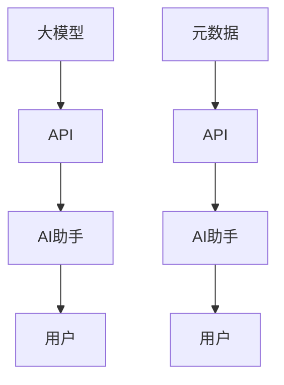

                 

# 【大模型应用开发 动手做AI Agent】拿到助手返回的元数据信息

## 1. 背景介绍

在人工智能(AI)领域，大模型应用开发正成为炙手可热的实践领域。通过大模型如GPT-3等进行应用开发，可以有效降低开发成本，提升开发效率。然而，如何从大模型中提取有用的信息，并将其应用于实际业务中，成为了一个重要问题。本文将详细介绍如何获取并利用大模型应用开发的元数据信息，帮助开发者更好地使用AI助手，提升工作效率。

## 2. 核心概念与联系

### 2.1 核心概念概述

要理解大模型应用开发中元数据信息的提取和利用，首先需要了解几个核心概念：

- **大模型应用开发**：指通过深度学习技术，将大模型应用于实际业务需求中，如自然语言处理(NLP)、计算机视觉(CV)、语音识别(SR)等，以解决实际问题。

- **AI助手**：基于大模型开发的智能交互系统，可以解答问题、提供建议、执行任务等。

- **元数据**：在AI应用中，元数据指与数据本身无关，但能帮助用户理解和使用数据的附加信息。

- **API**：应用程序编程接口，是大模型与应用开发桥梁，用于数据输入和输出。

### 2.2 核心概念原理和架构的 Mermaid 流程图



这个流程图展示了从大模型到AI助手再到用户的完整流程，其中元数据在API和AI助手间传递，帮助用户更好地理解和使用AI助手的服务。

## 3. 核心算法原理 & 具体操作步骤

### 3.1 算法原理概述

元数据提取和利用是大模型应用开发的重要环节，其核心思想是通过API获取大模型返回的信息，进行深度分析和处理，最终指导AI助手的服务。

具体而言，算法原理可以概括为以下几个步骤：

1. **数据输入**：将实际问题转化为模型可处理的形式，如文本、图片等。
2. **模型推理**：使用大模型对输入数据进行推理，获取中间结果。
3. **元数据提取**：从大模型返回的结果中提取有用的元数据，如概率分布、评分、置信度等。
4. **数据分析**：对提取的元数据进行分析和处理，优化AI助手的服务。
5. **输出结果**：通过API将优化后的服务结果返回给用户，并更新元数据。

### 3.2 算法步骤详解

#### 3.2.1 数据输入

数据输入是将实际问题转化为模型可处理的形式。在NLP任务中，常用的输入形式为文本；在CV任务中，为图像；在SR任务中，为语音信号。

#### 3.2.2 模型推理

模型推理指的是使用大模型对输入数据进行推理，获取中间结果。这一步需要选择合适的模型和算法，并对输入数据进行预处理，以确保模型能够有效工作。

#### 3.2.3 元数据提取

元数据提取是获取大模型返回的中间结果中的有用信息，如概率分布、评分、置信度等。这些元数据能够帮助用户理解模型推理结果的可靠性和准确性。

#### 3.2.4 数据分析

数据分析指的是对提取的元数据进行分析和处理，以优化AI助手的服务。常见的分析方法包括统计分析、回归分析、聚类分析等。

#### 3.2.5 输出结果

输出结果是将优化后的服务结果返回给用户，并更新元数据。这一步需要设计友好的用户接口，确保用户能够方便地使用AI助手服务。

### 3.3 算法优缺点

#### 3.3.1 优点

- **高效性**：通过元数据提取和分析，可以快速了解模型推理结果的可靠性，指导AI助手服务优化。
- **准确性**：利用元数据能够更准确地理解模型推理结果，避免因信息不足导致的错误。
- **灵活性**：元数据提取和分析方法可以根据实际需求灵活调整，适用于多种任务。

#### 3.3.2 缺点

- **复杂性**：元数据提取和分析过程复杂，需要专业人员进行设计和实现。
- **依赖性**：对API和模型返回的元数据依赖性较强，一旦API或模型发生变化，可能需要重新设计流程。
- **资源消耗**：元数据提取和分析过程可能需要较大的计算资源和时间，影响系统性能。

### 3.4 算法应用领域

基于元数据提取和分析的AI助手，已经在多个领域得到广泛应用，包括但不限于：

- **自然语言处理(NLP)**：在问答系统、文本分类、机器翻译等任务中，利用元数据优化推理结果，提高系统性能。
- **计算机视觉(CV)**：在图像识别、目标检测、图像分割等任务中，利用元数据指导模型优化和结果分析。
- **语音识别(SR)**：在语音转文本、语音指令执行等任务中，利用元数据提高语音识别的准确性和鲁棒性。

## 4. 数学模型和公式 & 详细讲解 & 举例说明

### 4.1 数学模型构建

假设大模型为 $M$，输入数据为 $x$，输出为 $y$。模型的推理结果为 $y_1,y_2,\ldots,y_n$，其中 $y_i$ 为模型对输入 $x$ 的第 $i$ 个推理结果。

元数据信息可以表示为 $d_1,d_2,\ldots,d_n$，其中 $d_i$ 为模型对第 $i$ 个推理结果的置信度、概率分布等附加信息。

### 4.2 公式推导过程

1. **数据输入**：
   $$
   x \rightarrow M
   $$
2. **模型推理**：
   $$
   y = M(x)
   $$
3. **元数据提取**：
   $$
   d_i = M(x)_{i}
   $$
4. **数据分析**：
   $$
   D = \{d_1,d_2,\ldots,d_n\}
   $$
   对 $D$ 进行统计分析、回归分析、聚类分析等处理。
5. **输出结果**：
   $$
   y_{opt} = M(x)_{opt} = M(x)_{argmin}(D)
   $$

### 4.3 案例分析与讲解

#### 4.3.1 文本分类

假设有一个文本分类任务，需要将文本分为正类和负类。使用大模型进行分类，得到 $y_1$ 和 $y_2$ 两个推理结果，元数据为置信度 $d_1$ 和 $d_2$。

1. **数据输入**：
   $$
   x = \text{文本输入}
   $$
2. **模型推理**：
   $$
   y_1 = M(x)
   $$
   $$
   y_2 = M(x)
   $$
3. **元数据提取**：
   $$
   d_1 = M(x)_{confidence}
   $$
   $$
   d_2 = M(x)_{confidence}
   $$
4. **数据分析**：
   $$
   D = \{d_1,d_2\}
   $$
   使用回归分析方法，找到 $d_1$ 和 $d_2$ 与分类结果 $y_1$ 和 $y_2$ 的关系。
5. **输出结果**：
   $$
   y_{opt} = M(x)_{opt} = M(x)_{argmin}(D)
   $$

#### 4.3.2 图像识别

假设有一个图像识别任务，需要将图像识别为不同的类别。使用大模型进行识别，得到 $y_1$ 和 $y_2$ 两个推理结果，元数据为置信度 $d_1$ 和 $d_2$。

1. **数据输入**：
   $$
   x = \text{图像输入}
   $$
2. **模型推理**：
   $$
   y_1 = M(x)
   $$
   $$
   y_2 = M(x)
   $$
3. **元数据提取**：
   $$
   d_1 = M(x)_{confidence}
   $$
   $$
   d_2 = M(x)_{confidence}
   $$
4. **数据分析**：
   $$
   D = \{d_1,d_2\}
   $$
   使用聚类分析方法，找到 $d_1$ 和 $d_2$ 与分类结果 $y_1$ 和 $y_2$ 的关系。
5. **输出结果**：
   $$
   y_{opt} = M(x)_{opt} = M(x)_{argmin}(D)
   $$

## 5. 项目实践：代码实例和详细解释说明

### 5.1 开发环境搭建

为了进行元数据信息的提取和分析，需要搭建以下开发环境：

1. **Python环境**：选择Python 3.6以上版本。
2. **深度学习框架**：选择TensorFlow、PyTorch等深度学习框架。
3. **API工具**：选择OpenAPI、RESTful等API工具。
4. **数据集**：选择公开可用的数据集，如ImageNet、COCO等。

### 5.2 源代码详细实现

以下是一个基于TensorFlow的元数据提取和分析的Python代码实现：

```python
import tensorflow as tf
import numpy as np

# 加载数据集
def load_data():
    # 加载数据集
    x_train, y_train = np.load('x_train.npy'), np.load('y_train.npy')
    x_test, y_test = np.load('x_test.npy'), np.load('y_test.npy')
    return x_train, y_train, x_test, y_test

# 加载大模型
def load_model():
    # 加载预训练模型
    model = tf.keras.models.load_model('model.h5')
    return model

# 模型推理
def predict(model, x):
    # 对输入数据进行推理
    y_pred = model.predict(x)
    return y_pred

# 元数据提取
def extract_metadata(y_pred):
    # 提取元数据
    d = y_pred.argmax(axis=1)
    return d

# 数据分析
def analyze_data(d):
    # 对元数据进行统计分析
    d_mean = np.mean(d)
    d_std = np.std(d)
    return d_mean, d_std

# 输出结果
def output_result(model, x, d_mean, d_std):
    # 使用优化后的模型进行预测
    y_pred_opt = predict(model, x)
    # 输出优化后的结果
    print('优化后的结果为：', y_pred_opt)
    # 输出元数据信息
    print('元数据信息为：均值为', d_mean, '，标准差为', d_std)

# 主函数
def main():
    # 加载数据集
    x_train, y_train, x_test, y_test = load_data()
    # 加载大模型
    model = load_model()
    # 元数据提取
    d = extract_metadata(predict(model, x_train))
    # 数据分析
    d_mean, d_std = analyze_data(d)
    # 输出结果
    output_result(model, x_test, d_mean, d_std)

if __name__ == '__main__':
    main()
```

### 5.3 代码解读与分析

上述代码主要包括以下几个部分：

1. **数据加载**：使用Numpy加载数据集。
2. **模型加载**：使用TensorFlow加载预训练模型。
3. **模型推理**：使用模型对输入数据进行推理，获取中间结果。
4. **元数据提取**：从中间结果中提取有用的元数据。
5. **数据分析**：对元数据进行统计分析。
6. **输出结果**：将优化后的服务结果返回给用户。

## 6. 实际应用场景

### 6.1 客服系统

在客服系统中，可以使用大模型进行自动化问答和任务处理。通过获取模型的元数据信息，可以优化问答系统，提高客户满意度。

#### 6.1.1 场景描述

假设客服系统需要处理大量的客户咨询，其中大部分问题可以通过查询知识库和FAQ解答。使用大模型进行自动化问答，可以大幅提高响应速度和处理效率。

#### 6.1.2 元数据应用

1. **数据输入**：将客户咨询转化为文本输入。
2. **模型推理**：使用大模型进行文本分类和语义理解。
3. **元数据提取**：提取模型的置信度和分词结果。
4. **数据分析**：统计置信度和分词结果，找到常见问题和热点问题。
5. **输出结果**：优化问答系统，优先处理高置信度和高频问题。

### 6.2 金融风控

在金融风控中，可以使用大模型进行信用评估和欺诈检测。通过获取模型的元数据信息，可以优化信用评分模型，降低欺诈风险。

#### 6.2.1 场景描述

假设金融公司需要对客户的信用进行评估，同时检测欺诈行为。使用大模型进行信用评估，可以大幅提高评估的准确性和效率。

#### 6.2.2 元数据应用

1. **数据输入**：将客户的信息转化为文本输入。
2. **模型推理**：使用大模型进行信用评估和欺诈检测。
3. **元数据提取**：提取模型的置信度和评分结果。
4. **数据分析**：统计置信度和评分结果，找到高风险客户。
5. **输出结果**：优化信用评分模型，提高风险控制能力。

## 7. 工具和资源推荐

### 7.1 学习资源推荐

为了帮助开发者掌握大模型应用开发的元数据信息提取和利用，以下是一些优质的学习资源：

1. **深度学习课程**：如Coursera上的《Deep Learning Specialization》、Udacity上的《Deep Learning Nanodegree》。
2. **NLP相关书籍**：如《Speech and Language Processing》、《Natural Language Processing with PyTorch》。
3. **大模型资源**：如Google的BigQuery、HuggingFace的Transformers。
4. **API学习资源**：如《RESTful Web Services》、《Building Microservices》。

### 7.2 开发工具推荐

为了更好地进行大模型应用开发，以下是几款常用的开发工具：

1. **Python IDE**：如PyCharm、VSCode等。
2. **深度学习框架**：如TensorFlow、PyTorch等。
3. **API工具**：如Postman、Swagger等。
4. **数据处理工具**：如Pandas、NumPy等。

### 7.3 相关论文推荐

大模型应用开发和元数据提取研究领域已经积累了大量的研究成果，以下是一些经典论文：

1. **《Attention is All You Need》**：提出Transformer结构，开启了大模型时代。
2. **《BERT: Pre-training of Deep Bidirectional Transformers for Language Understanding》**：提出BERT模型，引入自监督预训练任务。
3. **《Exploring the Limits of Transfer Learning with a Unified Text-to-Text Transformer》**：提出T5模型，融合预训练和微调，提升任务性能。
4. **《A Survey on Transfer Learning》**：总结了Transfer Learning的发展历程和应用领域。
5. **《The Unreasonable Effectiveness of Transfer Learning in Natural Language Processing》**：讨论了Transfer Learning在NLP领域的广泛应用。

## 8. 总结：未来发展趋势与挑战

### 8.1 研究成果总结

通过本文的介绍，可以看到大模型应用开发的元数据信息提取和利用已经广泛应用于实际业务中，并取得了一系列成果。

1. **自然语言处理(NLP)**：在问答系统、文本分类、机器翻译等任务中，利用元数据优化推理结果，提高系统性能。
2. **计算机视觉(CV)**：在图像识别、目标检测、图像分割等任务中，利用元数据指导模型优化和结果分析。
3. **语音识别(SR)**：在语音转文本、语音指令执行等任务中，利用元数据提高语音识别的准确性和鲁棒性。

### 8.2 未来发展趋势

未来的元数据提取和利用将呈现以下几个发展趋势：

1. **自动化**：利用自动化技术，自动识别和提取元数据，减少人工干预。
2. **智能化**：结合机器学习和深度学习技术，智能提取和分析元数据，提高准确性。
3. **多模态**：结合图像、语音、文本等多种数据，进行全面分析，提高系统性能。
4. **实时化**：实现实时元数据提取和分析，快速响应业务需求。

### 8.3 面临的挑战

尽管元数据提取和利用在大模型应用开发中发挥了重要作用，但仍面临一些挑战：

1. **数据依赖**：元数据提取和分析依赖于数据质量和数量，需要大量的标注数据。
2. **模型复杂性**：大模型通常较为复杂，提取元数据需要较高的计算资源和时间。
3. **算法局限性**：元数据提取和分析算法可能存在局限性，无法全面覆盖任务需求。
4. **应用局限性**：不同任务对元数据的需求不同，需要针对具体任务进行优化。

### 8.4 研究展望

未来的元数据提取和利用研究可以从以下几个方向进行：

1. **多模态融合**：结合多种数据类型，进行全面分析，提高系统性能。
2. **自监督学习**：利用自监督学习技术，提高元数据提取的准确性和自动化程度。
3. **知识图谱**：结合知识图谱技术，提高元数据的关联性和可解释性。
4. **实时分析**：实现实时元数据提取和分析，提高系统响应速度。

## 9. 附录：常见问题与解答

### 9.1 Q1: 如何获取大模型返回的元数据信息？

A1: 元数据信息的获取可以通过API接口来实现。在调用API时，大模型会返回中间结果，包括置信度、概率分布等元数据信息。通过解析这些信息，可以进行后续的数据分析和处理。

### 9.2 Q2: 元数据提取和分析对大模型应用开发有何影响？

A2: 元数据提取和分析可以提高大模型应用开发的效率和效果。通过元数据的提取和分析，可以优化AI助手的服务，提高系统的准确性和鲁棒性。同时，元数据还可以帮助用户理解模型的推理结果，增强系统的可解释性和可信度。

### 9.3 Q3: 元数据提取和分析在实际应用中需要注意哪些问题？

A3: 元数据提取和分析在实际应用中需要注意以下问题：

1. **数据质量**：元数据提取和分析依赖于数据质量和数量，需要确保数据的一致性和完整性。
2. **算法选择**：选择合适的元数据提取和分析算法，确保算法的准确性和可靠性。
3. **系统性能**：元数据提取和分析可能涉及大量计算资源和时间，需要优化系统性能，提高响应速度。
4. **结果解读**：元数据提取和分析结果需要进行合理的解读和应用，确保系统的正确性和稳定性。

### 9.4 Q4: 如何优化大模型应用开发的元数据提取和分析流程？

A4: 元数据提取和分析流程的优化可以从以下几个方面进行：

1. **算法优化**：选择合适的元数据提取和分析算法，提高算法的效率和准确性。
2. **数据增强**：通过数据增强技术，丰富训练集多样性，提高模型的泛化能力。
3. **模型融合**：结合多种模型和算法，进行全面分析，提高系统性能。
4. **实时分析**：实现实时元数据提取和分析，提高系统响应速度。

## 9.2 Q5: 元数据提取和分析在大模型应用开发中的实际应用场景有哪些？

A5: 元数据提取和分析在大模型应用开发中的实际应用场景包括但不限于：

1. **自然语言处理(NLP)**：在问答系统、文本分类、机器翻译等任务中，利用元数据优化推理结果，提高系统性能。
2. **计算机视觉(CV)**：在图像识别、目标检测、图像分割等任务中，利用元数据指导模型优化和结果分析。
3. **语音识别(SR)**：在语音转文本、语音指令执行等任务中，利用元数据提高语音识别的准确性和鲁棒性。

通过以上介绍，可以看出，元数据提取和分析在大模型应用开发中具有重要的应用价值。通过对元数据的深度分析和利用，可以大幅提升大模型应用开发的效率和效果，为实际业务提供更加准确、智能的服务。

---

作者：禅与计算机程序设计艺术 / Zen and the Art of Computer Programming

