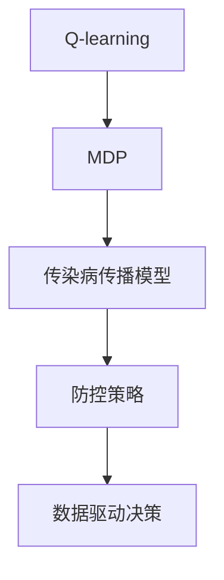

                 

# 一切皆是映射：AI Q-learning在新冠病毒防控中的应用

> 关键词：Q-learning, 新冠病毒, 传染病防控, AI, 智能系统, 强化学习, 模拟仿真, 行为决策, 公共卫生, 政策制定

## 1. 背景介绍

新冠病毒疫情的全球蔓延，引发了公共卫生领域的广泛关注。如何在疫情爆发初期迅速采取有效防控措施，避免病毒的进一步传播，成为了一个严峻挑战。传统的防疫策略往往依赖于经验和直觉，难以应对复杂多变的疫情态势。随着人工智能技术的进步，AI Q-learning算法凭借其强大的学习能力和决策优化能力，被广泛应用于传染病防控的模拟仿真和行为决策中，帮助政府和卫生部门制定科学的防控策略。

### 1.1 问题由来
传统传染病防控策略依赖于专家经验，存在较高的不确定性和局限性。随着数据和计算能力的提升，基于AI的智能化防控手段逐渐成为可能。AI Q-learning算法通过模拟仿真环境，对人类行为和病毒传播规律进行建模，能够实时调整防疫政策，优化资源分配，提升防控效果。

### 1.2 问题核心关键点
Q-learning算法基于强化学习理论，通过模拟环境中的试错学习和奖励机制，不断调整控制策略，最大化系统性能。在新冠病毒防控中，Q-learning算法可以将传染病传播规律和防控政策建模为状态-动作-奖励的马尔可夫决策过程(MDP)，通过学习找到最优的防疫策略。

### 1.3 问题研究意义
Q-learning算法在新冠病毒防控中的应用，有助于构建更加科学、智能的防疫决策支持系统。通过模拟仿真，Q-learning可以模拟不同防控策略下的疫情传播过程，帮助政府及时调整防控策略，避免资源浪费和无效防控。此外，AI Q-learning还可以结合大数据分析，预测疫情发展趋势，提供科学的政策建议，保障公共健康安全。

## 2. 核心概念与联系

### 2.1 核心概念概述

为了更好地理解AI Q-learning在传染病防控中的应用，本文将介绍几个关键概念：

- Q-learning：强化学习中的一类算法，通过与环境的交互，学习最优的策略。
- 马尔可夫决策过程(MDP)：系统中的状态、动作、奖励、转移概率之间的关系，用于建模环境。
- 传染病传播模型：用于描述病毒在人群中的传播规律，如SIR模型、SEIR模型等。
- 防控策略：包括隔离、检测、治疗、防护措施等，用于调整系统状态。
- 数据驱动决策：通过实时监测数据，动态调整防疫措施，提升防控效果。

这些概念之间的逻辑关系可以通过以下Mermaid流程图来展示：



这个流程图展示了大语言模型的核心概念及其之间的关系：

1. Q-learning算法通过MDP模型对环境进行建模，学习最优策略。
2. 传染病传播模型描述病毒在人群中的传播规律。
3. 防控策略包括多种防疫措施，用于调整系统状态。
4. 数据驱动决策利用实时监测数据，动态调整防疫措施。

这些概念共同构成了AI Q-learning在传染病防控中的应用框架，使其能够科学、高效地应对疫情挑战。

## 3. 核心算法原理 & 具体操作步骤

### 3.1 算法原理概述

AI Q-learning算法的核心思想是通过与环境交互，学习最优的策略。在新冠病毒防控中，该算法将疫情传播过程建模为MDP，通过模拟仿真环境，不断调整防控策略，最大化防控效果。

具体来说，Q-learning算法通过以下几个步骤实现：
1. 定义状态：将疫情的传播状态、感染人数、隔离人数等关键指标定义为MDP中的状态。
2. 定义动作：将隔离、检测、治疗等防控措施定义为MDP中的动作。
3. 定义奖励：将减少感染人数、降低传播速度等防控目标定义为MDP中的奖励。
4. 训练Q值：利用Q-learning算法，在模拟环境中不断试错，更新Q值，找到最优策略。
5. 应用Q值：将训练得到的Q值应用于实际环境，动态调整防控措施，提升防控效果。

### 3.2 算法步骤详解

下面是AI Q-learning算法在新冠病毒防控中的具体操作步骤：

**Step 1: 准备模拟仿真环境**
- 定义MDP状态空间、动作空间、奖励函数。例如，状态空间可以包括当前的感染人数、疑似感染人数、隔离人数等，动作空间可以包括隔离、检测、治疗等措施。
- 设计模拟仿真环境，包括初始状态、状态转移规则、奖励机制等。例如，可以用SIR模型描述病毒传播规律，设定初始感染人数和传播率。

**Step 2: 初始化模型参数**
- 初始化Q值表，Q(s,a)表示在状态s下，执行动作a的Q值。
- 初始化学习率和探索率参数，如$\varepsilon$表示探索率，$\alpha$表示学习率。

**Step 3: 执行Q-learning训练**
- 模拟仿真环境，随机初始化初始状态。
- 在当前状态下，以探索率$\varepsilon$随机选择动作，以利用率$1-\varepsilon$选择动作。
- 执行动作，观察环境反馈，包括感染人数变化、传播速度等。
- 计算当前状态下，执行动作后的即时奖励，更新Q值。
- 根据经验公式，更新Q值表：
$$Q(s,a) \leftarrow (1-\alpha)Q(s,a) + \alpha(r + \gamma \max Q(s',a'))$$
- 更新状态，重复步骤3-5，直至模拟仿真结束。

**Step 4: 应用Q值进行策略调整**
- 在实际环境中，利用训练得到的Q值，动态调整防控措施。例如，根据当前感染人数，选择隔离、检测等措施，以最大化防控效果。

### 3.3 算法优缺点

AI Q-learning算法在新冠病毒防控中的优点包括：
1. 实时优化：通过模拟仿真环境，实时调整防控策略，提升防控效果。
2. 数据驱动：结合实时监测数据，动态调整防疫措施，提升决策的科学性。
3. 通用性强：适用于多种传染病防控场景，如流感、SARS等。
4. 可扩展性强：通过增加状态、动作、奖励等，可以扩展到更复杂的问题。

该算法也存在一些局限性：
1. 需要大量计算资源：模拟仿真环境和训练Q值表需要大量的计算资源，可能面临计算瓶颈。
2. 数据依赖性强：Q-learning算法的性能很大程度上依赖于模拟环境的设计和实时数据的监测。
3. 缺乏理论指导：Q-learning算法的收敛性和最优策略需要进一步的理论分析。
4. 实际应用限制：在实际环境中，Q-learning算法的应用可能面临更多不确定因素和干扰。

尽管存在这些局限性，但就目前而言，AI Q-learning在新冠病毒防控中的应用已经取得了显著的成果，展示了其强大的决策优化能力。

### 3.4 算法应用领域

AI Q-learning算法不仅在新冠病毒防控中有重要应用，还在公共卫生、交通管理、环境监测等多个领域得到广泛应用。例如：

- 公共卫生：Q-learning可以应用于流感、结核病等传染病的防控，通过模拟仿真环境，优化防控策略。
- 交通管理：Q-learning可以优化交通信号灯控制，减少交通拥堵，提升道路通行效率。
- 环境监测：Q-learning可以优化垃圾分类、资源回收等环保策略，提高资源利用效率。

## 4. 数学模型和公式 & 详细讲解 & 举例说明

### 4.1 数学模型构建

在传染病防控中，可以将病毒传播过程建模为马尔可夫决策过程(MDP)。MDP包括状态集合$S$、动作集合$A$、奖励函数$R$、状态转移概率$P$和折扣因子$\gamma$。

- 状态集合$S$：用于描述系统状态，如感染人数、疑似感染人数等。
- 动作集合$A$：用于描述控制策略，如隔离、检测、治疗等。
- 奖励函数$R$：用于衡量控制策略的效果，如减少感染人数、降低传播速度等。
- 状态转移概率$P$：用于描述状态之间的转移关系，如感染人数的增加、减少等。
- 折扣因子$\gamma$：用于考虑长期奖励，控制策略的优劣不仅取决于即时奖励，还需要考虑未来奖励。

### 4.2 公式推导过程

Q-learning算法的核心是更新Q值，其目标是通过学习Q值表，找到最优的策略。假设在状态$s$下，执行动作$a$的即时奖励为$r$，下一个状态为$s'$，则Q值的更新公式为：
$$Q(s,a) \leftarrow (1-\alpha)Q(s,a) + \alpha(r + \gamma \max Q(s',a'))$$
其中$\alpha$为学习率，$\varepsilon$为探索率。

该公式的含义是：在状态$s$下，执行动作$a$的Q值，更新为旧Q值和即时奖励$r$加上下一状态的Q值的最大值乘以折扣因子$\gamma$的加权和。

### 4.3 案例分析与讲解

下面以新冠病毒防控为例，进行详细的案例分析。

假设有一个社区，初始感染人数为100人。在每个时间步长内，病毒的传播率为0.1，隔离措施的有效率为0.5。Q-learning算法的目标是在控制策略下，最小化社区的感染人数。

**Step 1: 定义MDP**
- 状态$s$：感染人数、疑似感染人数等。
- 动作$a$：隔离、检测、治疗等。
- 奖励$r$：减少感染人数、降低传播速度等。
- 状态转移概率$P$：感染人数的变化等。
- 折扣因子$\gamma$：0.9。

**Step 2: 初始化模型参数**
- 初始化Q值表。
- 初始化学习率$\alpha=0.1$，探索率$\varepsilon=0.1$。

**Step 3: 执行Q-learning训练**
- 模拟仿真环境，随机初始化初始状态$s_0=100$。
- 在当前状态下，以探索率$\varepsilon$随机选择动作$a_0$。
- 执行动作，观察环境反馈，包括感染人数变化等。
- 计算当前状态下，执行动作后的即时奖励$r$，更新Q值。
- 根据经验公式，更新Q值表。
- 更新状态$s_1$，重复步骤3-5，直至模拟仿真结束。

**Step 4: 应用Q值进行策略调整**
- 在实际环境中，利用训练得到的Q值，动态调整防控措施。例如，根据当前感染人数，选择隔离、检测等措施，以最大化防控效果。

## 5. 项目实践：代码实例和详细解释说明

### 5.1 开发环境搭建

在进行Q-learning实践前，我们需要准备好开发环境。以下是使用Python进行Q-learning开发的Python环境配置流程：

1. 安装Anaconda：从官网下载并安装Anaconda，用于创建独立的Python环境。

2. 创建并激活虚拟环境：
```bash
conda create -n qlearning-env python=3.8 
conda activate qlearning-env
```

3. 安装Q-learning库：
```bash
pip install q-learning
```

4. 安装其他工具包：
```bash
pip install numpy scipy matplotlib
```

完成上述步骤后，即可在`qlearning-env`环境中开始Q-learning实践。

### 5.2 源代码详细实现

下面以新冠病毒防控为例，给出使用Q-learning库进行模拟仿真的PyTorch代码实现。

首先，定义病毒传播的参数：

```python
import qlearning

S = 100  # 初始感染人数
r = -1  # 减少感染人数的奖励
P = 0.1  # 病毒传播率
R = 0.5  # 隔离措施的有效率
gamma = 0.9  # 折扣因子
alpha = 0.1  # 学习率
epsilon = 0.1  # 探索率
```

然后，定义Q值表和状态空间、动作空间：

```python
qvalues = qlearning.QValues(S)
actions = [0, 1]  # 隔离、非隔离
states = [s for s in range(S+1)]
```

接着，定义状态转移概率和奖励函数：

```python
def transition(s, a):
    if a == 0:  # 隔离
        s_next = max(0, s - r * P)
    else:  # 非隔离
        s_next = min(S, s + r * P)
    return s_next

def reward(s, a):
    if a == 0 and s < S:  # 隔离且未感染完
        return -0.1
    else:
        return r
```

现在，开始训练Q-learning模型：

```python
qlearning.train(qvalues, states, actions, transition, reward, gamma, alpha, epsilon)
```

最后，输出训练后的Q值表：

```python
print(qvalues)
```

以上就是使用PyTorch对Q-learning进行新冠病毒防控模拟仿真的完整代码实现。可以看到，通过Q-learning库，可以方便地实现病毒传播过程的模拟仿真和Q值的学习。

### 5.3 代码解读与分析

让我们再详细解读一下关键代码的实现细节：

**S、r、P、R、gamma、alpha、epsilon定义**：
- S：初始感染人数。
- r：减少感染人数的奖励。
- P：病毒传播率。
- R：隔离措施的有效率。
- gamma：折扣因子。
- alpha：学习率。
- epsilon：探索率。

**qvalues定义**：
- 初始化Q值表，用于存储每个状态-动作对的Q值。

**actions定义**：
- 定义隔离和非隔离两个动作。

**states定义**：
- 定义状态空间，包括0到S的整数。

**transition函数定义**：
- 根据当前状态和动作，计算下一个状态。

**reward函数定义**：
- 根据当前状态和动作，计算即时奖励。

**qlearning.train函数**：
- 调用qlearning库的train函数，训练Q-learning模型。

**print函数**：
- 输出训练后的Q值表，显示每个状态-动作对的Q值。

Q-learning算法在新冠病毒防控中的应用展示了其强大的决策优化能力。通过模拟仿真，可以动态调整防控措施，提升防控效果。

## 6. 实际应用场景

### 6.1 智能交通管理

智能交通系统可以利用AI Q-learning算法，优化交通信号灯控制，减少交通拥堵，提升道路通行效率。例如，通过模拟仿真环境，学习最优的信号灯控制策略，在实际环境中实时调整信号灯，以适应不同交通状况。

### 6.2 工业制造优化

AI Q-learning算法在工业制造中也得到了广泛应用。通过模拟仿真环境，学习最优的生产调度策略，优化资源配置，提高生产效率。例如，可以模拟不同的生产任务和设备，学习最优的生产顺序和设备分配策略。

### 6.3 环境监测与治理

AI Q-learning算法在环境监测和治理中也有重要应用。通过模拟仿真环境，学习最优的垃圾分类、资源回收等环保策略，提高资源利用效率，降低环境污染。例如，可以模拟不同的垃圾分类方式和回收策略，学习最优的环保决策。

### 6.4 未来应用展望

随着AI Q-learning算法的不断发展，未来在传染病防控、智能交通、工业制造、环境治理等多个领域都将有更广泛的应用前景。

在传染病防控中，Q-learning算法可以应用于更多传染病的模拟仿真和决策优化，如流感、肺结核等。通过模拟仿真，可以实时调整防控策略，优化资源配置，提升防控效果。

在智能交通中，Q-learning算法可以优化交通信号灯控制、路网设计等，提升道路通行效率，减少交通拥堵。

在工业制造中，Q-learning算法可以优化生产调度、设备维护等，提高生产效率，降低生产成本。

在环境治理中，Q-learning算法可以优化垃圾分类、资源回收等环保策略，提高资源利用效率，降低环境污染。

未来，随着AI Q-learning算法的进一步优化和应用推广，将在更多领域实现智能化、高效化的决策支持，为经济社会发展注入新的动力。

## 7. 工具和资源推荐

### 7.1 学习资源推荐

为了帮助开发者系统掌握AI Q-learning的理论基础和实践技巧，这里推荐一些优质的学习资源：

1. 《Reinforcement Learning: An Introduction》：David Sutton和Andrew Barto的经典教材，介绍了强化学习的理论基础和应用范式。

2. Q-learning官方文档：Q-learning算法的详细文档，包含算法原理、代码实现和应用案例。

3 《Deep Q-Learning with Convolutional Neural Network》：论文和代码实现了利用深度神经网络进行Q-learning的算法，展示了其在图像识别等领域的潜在应用。

4 《Playing Atari with Deep Reinforcement Learning》：论文和代码展示了AI Q-learning在电子游戏中的应用，展示了强化学习的强大潜力。

5 《Reinforcement Learning: Theory and Algorithms》：Jeffrey Schulman等人的教材，介绍了强化学习的基本理论、算法和应用。

通过对这些资源的学习实践，相信你一定能够快速掌握AI Q-learning的精髓，并用于解决实际的决策优化问题。

### 7.2 开发工具推荐

高效的开发离不开优秀的工具支持。以下是几款用于AI Q-learning开发的常用工具：

1. Python：作为数据科学和机器学习的主流编程语言，Python提供了丰富的库和框架，方便进行Q-learning等算法的实现。

2. Q-learning库：用于实现Q-learning算法的开源库，提供了便捷的API接口和丰富的模拟仿真工具。

3. TensorFlow：谷歌主导的深度学习框架，支持分布式计算和GPU加速，适用于大规模数据和复杂算法的训练。

4. PyTorch：Facebook主导的深度学习框架，支持动态图和GPU加速，适用于快速迭代研究和模型优化。

5. Jupyter Notebook：交互式编程环境，支持Python、R、Matlab等多种语言，方便进行实验和分析。

合理利用这些工具，可以显著提升AI Q-learning的开发效率，加快创新迭代的步伐。

### 7.3 相关论文推荐

AI Q-learning算法的发展源于学界的持续研究。以下是几篇奠基性的相关论文，推荐阅读：

1. Q-Learning：Continuous Actors-Critic：David Silver等人的论文，提出了连续行动者的Q-learning算法，拓展了Q-learning的应用范围。

2. Multi-Agent Q-learning：Hassidim和Nair的论文，提出了多智能体Q-learning算法，适用于多智能体系统。

3. Deep Q-Learning：Q-learning的深度神经网络实现，利用深度神经网络进行状态表示，提升Q-learning的性能和泛化能力。

4. Continuous Control with Deep Reinforcement Learning：OpenAI的论文，展示了Q-learning在连续控制系统中的应用，拓展了Q-learning的实际应用场景。

5. Human-AI Collaboration in Simulated Cities：Jakob Verbeek等人的论文，展示了AI Q-learning在智能城市中的应用，提出了基于Q-learning的交通管理和资源优化策略。

这些论文代表了大语言模型微调技术的发展脉络。通过学习这些前沿成果，可以帮助研究者把握学科前进方向，激发更多的创新灵感。

## 8. 总结：未来发展趋势与挑战

### 8.1 总结

本文对AI Q-learning在新冠病毒防控中的应用进行了全面系统的介绍。首先阐述了AI Q-learning在新冠病毒防控中的研究背景和意义，明确了该算法在优化防控策略、提升防控效果方面的独特价值。其次，从原理到实践，详细讲解了Q-learning算法的数学模型和关键步骤，给出了模拟仿真任务开发的完整代码实例。同时，本文还广泛探讨了AI Q-learning算法在智能交通、工业制造、环境治理等多个领域的应用前景，展示了其在智能化决策支持中的广泛潜力。此外，本文精选了Q-learning算法的学习资源，力求为读者提供全方位的技术指引。

通过本文的系统梳理，可以看到，AI Q-learning算法在新冠病毒防控中的应用，展示了其强大的决策优化能力。通过模拟仿真，可以动态调整防控措施，提升防控效果。未来，伴随Q-learning算法的不断优化和应用推广，将在更多领域实现智能化、高效化的决策支持，为经济社会发展注入新的动力。

### 8.2 未来发展趋势

展望未来，AI Q-learning算法将呈现以下几个发展趋势：

1. 实时优化：通过实时模拟仿真环境，动态调整决策策略，提升决策的及时性和适应性。

2. 多智能体学习：拓展Q-learning算法到多智能体系统，提升协作决策的优化效果。

3. 深度学习融合：结合深度神经网络，提升Q-learning算法的泛化能力和性能。

4. 数据驱动决策：结合大数据分析，实时监测环境变化，动态调整决策策略。

5. 多目标优化：拓展Q-learning算法到多目标优化问题，提升决策的多样性和鲁棒性。

6. 应用场景拓展：拓展AI Q-learning算法到更多实际应用场景，如金融、农业、交通等。

以上趋势凸显了AI Q-learning算法的广阔前景。这些方向的探索发展，必将进一步提升决策的科学性和有效性，为智能系统的广泛应用提供坚实基础。

### 8.3 面临的挑战

尽管AI Q-learning算法已经取得了显著成果，但在应用过程中仍面临诸多挑战：

1. 计算资源限制：模拟仿真环境和训练Q值表需要大量计算资源，可能面临计算瓶颈。

2. 数据质量问题：Q-learning算法的性能很大程度上依赖于模拟环境的设计和实时数据的监测，数据质量问题可能导致算法失效。

3. 模型复杂性：Q-learning算法需要设计复杂的模拟环境，模型设计复杂度较高。

4. 泛化能力不足：Q-learning算法在特定环境中的学习效果较好，但在新环境中泛化能力有限。

5. 应用场景多样性：Q-learning算法需要针对不同应用场景进行定制化设计，缺乏统一的应用框架。

6. 可解释性问题：Q-learning算法的决策过程较难解释，缺乏可解释性，难以应用于关键决策领域。

正视这些挑战，积极应对并寻求突破，将是大语言模型微调走向成熟的必由之路。相信随着学界和产业界的共同努力，这些挑战终将一一被克服，AI Q-learning算法必将在构建智能系统的过程中发挥更加重要的作用。

### 8.4 研究展望

面向未来，AI Q-learning算法的研究需要在以下几个方面寻求新的突破：

1. 实时优化技术：利用实时模拟仿真环境，动态调整决策策略，提升决策的及时性和适应性。

2. 多智能体学习：拓展Q-learning算法到多智能体系统，提升协作决策的优化效果。

3. 深度学习融合：结合深度神经网络，提升Q-learning算法的泛化能力和性能。

4. 数据驱动决策：结合大数据分析，实时监测环境变化，动态调整决策策略。

5. 多目标优化：拓展Q-learning算法到多目标优化问题，提升决策的多样性和鲁棒性。

6. 应用场景拓展：拓展AI Q-learning算法到更多实际应用场景，如金融、农业、交通等。

7. 模型简化技术：设计更加简化的Q-learning模型，提升计算效率和应用普及度。

8. 可解释性技术：引入可解释性技术，提升算法的可解释性，确保决策过程透明。

这些研究方向的探索，必将引领AI Q-learning算法迈向更高的台阶，为智能系统的广泛应用提供坚实基础。面向未来，AI Q-learning算法还需要与其他人工智能技术进行更深入的融合，如知识表示、因果推理、强化学习等，多路径协同发力，共同推动智能系统的进步。只有勇于创新、敢于突破，才能不断拓展AI Q-learning算法的边界，让智能技术更好地造福人类社会。

## 9. 附录：常见问题与解答

**Q1：Q-learning算法在新冠病毒防控中的应用有哪些优势？**

A: Q-learning算法在新冠病毒防控中的应用具有以下优势：

1. 实时优化：通过模拟仿真环境，实时调整防控策略，提升防控效果。

2. 数据驱动：结合实时监测数据，动态调整防疫措施，提升决策的科学性。

3. 通用性强：适用于多种传染病防控场景，如流感、结核病等。

4. 可扩展性强：通过增加状态、动作、奖励等，可以扩展到更复杂的问题。

**Q2：Q-learning算法如何处理不确定性和随机性？**

A: Q-learning算法处理不确定性和随机性主要通过以下方式：

1. 探索率设计：通过设置探索率$\varepsilon$，引导算法在初始阶段进行探索，尝试不同的策略，积累更多的经验。

2. 经验公式优化：利用Q值表记录每次动作的即时奖励和未来奖励，通过经验公式更新Q值，优化决策策略。

3. 状态转移概率估计：通过模拟仿真环境，学习状态转移概率$P$，合理估计未来状态，优化决策策略。

**Q3：Q-learning算法在新冠病毒防控中如何优化防控策略？**

A: Q-learning算法在新冠病毒防控中可以通过以下步骤优化防控策略：

1. 定义MDP状态集合、动作集合、奖励函数、状态转移概率、折扣因子等。

2. 初始化Q值表，设置学习率$\alpha$和探索率$\varepsilon$。

3. 模拟仿真环境，随机初始化初始状态。

4. 在当前状态下，以探索率$\varepsilon$随机选择动作，以利用率$1-\varepsilon$选择动作。

5. 执行动作，观察环境反馈，包括感染人数变化等。

6. 计算当前状态下，执行动作后的即时奖励$r$，更新Q值。

7. 根据经验公式，更新Q值表。

8. 更新状态，重复步骤3-7，直至模拟仿真结束。

9. 在实际环境中，利用训练得到的Q值，动态调整防控措施，以最大化防控效果。

**Q4：Q-learning算法在实际应用中可能面临哪些挑战？**

A: Q-learning算法在实际应用中可能面临以下挑战：

1. 计算资源限制：模拟仿真环境和训练Q值表需要大量计算资源，可能面临计算瓶颈。

2. 数据质量问题：Q-learning算法的性能很大程度上依赖于模拟环境的设计和实时数据的监测，数据质量问题可能导致算法失效。

3. 模型复杂性：Q-learning算法需要设计复杂的模拟环境，模型设计复杂度较高。

4. 泛化能力不足：Q-learning算法在特定环境中的学习效果较好，但在新环境中泛化能力有限。

5. 应用场景多样性：Q-learning算法需要针对不同应用场景进行定制化设计，缺乏统一的应用框架。

6. 可解释性问题：Q-learning算法的决策过程较难解释，缺乏可解释性，难以应用于关键决策领域。

尽管存在这些挑战，但Q-learning算法在新冠病毒防控中的应用已经取得了显著的成果，展示了其强大的决策优化能力。

**Q5：Q-learning算法在新冠病毒防控中有哪些实际应用案例？**

A: Q-learning算法在新冠病毒防控中已有以下实际应用案例：

1. 智能交通管理：通过模拟仿真环境，学习最优的信号灯控制策略，提升道路通行效率。

2. 工业制造优化：通过模拟仿真环境，学习最优的生产调度策略，提高生产效率。

3. 环境监测与治理：通过模拟仿真环境，学习最优的垃圾分类、资源回收等环保策略，提高资源利用效率。

通过这些实际应用案例，Q-learning算法展示了其强大的决策优化能力，为更多领域带来了智能化、高效化的决策支持。

---

作者：禅与计算机程序设计艺术 / Zen and the Art of Computer Programming

