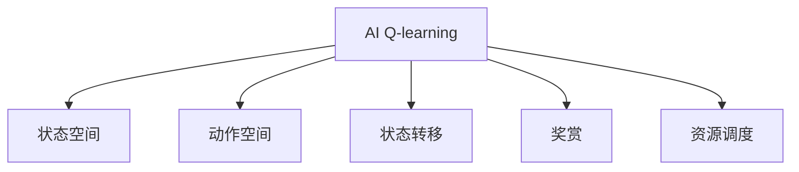

                 

## 1. 背景介绍

### 1.1 问题由来

随着云计算和分布式系统的广泛应用，如何高效、公平地调度和管理资源，成为众多系统设计者面临的关键挑战。资源调度问题涉及任务的分配和执行，既要考虑最大化资源利用率，又要保证系统的公平性。传统的调度算法如FCFS（First-Come-First-Served）、RR（Round Robin）等基于静态优先级的调度策略已不能适应日益复杂的系统需求。

### 1.2 问题核心关键点

资源调度问题本质上是一个优化问题，涉及多个资源（如CPU、内存、带宽等）的合理分配与使用。在深度学习中，Q-learning算法被广泛应用于强化学习，通过对环境与动作的映射，找到最优的策略来实现资源的最优分配。

### 1.3 问题研究意义

AI Q-learning在资源调度中的应用，能够显著提升资源利用率和系统效率，降低资源竞争和拥堵的风险，从而提高整体系统的运行效率和用户体验。此外，基于AI Q-learning的资源调度方法，能够实现动态适应和自我优化，应对环境变化，具有显著的前景。

## 2. 核心概念与联系

### 2.1 核心概念概述

为更好地理解AI Q-learning在资源调度中的应用，本节将介绍几个密切相关的核心概念：

- AI Q-learning：一种基于强化学习的策略优化方法，通过Q表记录每个状态和动作的价值，选择合适的策略来实现最优决策。
- 状态空间(State Space)：资源调度中，状态由当前所有资源的使用情况以及任务请求构成。
- 动作空间(Action Space)：资源调度中，动作是对当前资源进行分配和调整。
- 状态转移(Transition)：从当前状态到下一个状态的转移规则，通常基于任务的执行和资源的使用情况。
- 奖赏(Reward)：系统根据资源分配的效果给予的奖赏，奖励资源利用率高、响应时间短的分配策略。
- 资源调度：根据任务需求和当前资源状态，动态分配资源，以最大化资源利用率和系统性能。

这些核心概念之间的逻辑关系可以通过以下Mermaid流程图来展示：



这个流程图展示了大语言模型的核心概念及其之间的关系：

1. AI Q-learning是核心算法，用于优化资源调度的策略。
2. 状态空间决定了当前资源的状态，是决策的基础。
3. 动作空间包含所有可能的资源调整方案，供算法选择。
4. 状态转移描述了资源调度的动态过程，通过接收输入动作，更新状态。
5. 奖赏反映了资源调度的效果，驱动Q-learning学习最优策略。
6. 资源调度是最终目的，通过AI Q-learning实现。

这些概念共同构成了AI Q-learning在资源调度中的基本框架，为其高效应用提供了基础。

## 3. 核心算法原理 & 具体操作步骤
### 3.1 算法原理概述

AI Q-learning在资源调度中的应用，旨在通过强化学习算法，学习最优的资源分配策略。其核心思想是：通过不断与环境交互，积累经验，逐步优化策略，直至找到最优分配方案。

具体来说，AI Q-learning将每个资源状态对应到其可能的动作（资源调整方案），并记录每个状态-动作对（$(s,a)$）的价值（Q值）。在每次资源调度中，AI Q-learning根据当前状态，选择Q值最大的动作，以最大化奖赏（即资源利用率、响应时间等指标）。

### 3.2 算法步骤详解

AI Q-learning在资源调度中的应用，一般包括以下几个关键步骤：

**Step 1: 状态空间定义**
- 根据资源调度的具体情况，定义状态空间。例如，在CPU资源调度中，状态可以包括所有CPU的当前使用率、任务队列长度等。

**Step 2: 动作空间定义**
- 根据资源调度的具体情况，定义动作空间。例如，在CPU资源调度中，动作可以包括分配CPU给某个任务、关闭某个任务等。

**Step 3: 奖赏设计**
- 根据资源调度的具体目标，设计奖赏函数。例如，在CPU资源调度中，奖赏可以包括任务完成时间、CPU利用率等。

**Step 4: 状态转移定义**
- 根据资源调度的具体规则，定义状态转移函数。例如，在CPU资源调度中，任务执行完成后，CPU资源使用情况会发生变化，从而进入新的状态。

**Step 5: 初始化Q表**
- 初始化Q表，将其所有元素的值设为0。

**Step 6: 模拟资源调度**
- 通过模拟的方式，对每个状态-动作对进行计算，根据奖赏和状态转移函数，更新Q表中的Q值。

**Step 7: 策略优化**
- 通过计算每个状态的Q值，选择Q值最大的动作，实现资源的最优分配。

**Step 8: 持续学习**
- 持续运行上述过程，不断从新数据中学习，优化资源调度的策略。

以上是AI Q-learning在资源调度中的基本流程。在实际应用中，还需要针对具体问题进行优化设计，如改进Q表更新算法、引入参数化策略、动态调整奖赏函数等。

### 3.3 算法优缺点

AI Q-learning在资源调度中的应用，具有以下优点：
1. 动态适应性。AI Q-learning能够实时响应环境变化，根据当前状态和奖赏，动态调整资源分配策略。
2. 自优化性。AI Q-learning通过持续学习，不断优化策略，逐步提升资源利用率和系统性能。
3. 可扩展性。AI Q-learning可以应用于各种资源调度场景，具有较强的泛化能力。

同时，该方法也存在一些局限性：
1. 数据需求量大。AI Q-learning需要大量模拟数据来训练Q表，对于数据量较小的环境，效果可能不理想。
2. 计算复杂度高。Q表的大小随状态空间和动作空间呈指数增长，训练和更新过程计算复杂度较高。
3. 收敛速度慢。AI Q-learning需要较长时间的学习才能收敛到最优策略，训练过程较为耗时。
4. 模型解释性差。AI Q-learning作为"黑盒"模型，难以解释其内部工作机制和决策过程。

尽管存在这些局限性，但就目前而言，AI Q-learning仍是资源调度中的一种重要手段。未来相关研究的重点在于如何进一步降低Q表大小、加快训练速度、提高模型解释性等，以适应更大规模、更复杂的资源调度场景。

### 3.4 算法应用领域

AI Q-learning在资源调度中的应用，已经在云计算、网络通信、交通管理等领域得到了广泛的应用。具体应用场景包括：

- 云计算资源调度：通过AI Q-learning优化虚拟机资源分配，最大化资源利用率，降低云服务成本。
- 网络通信调度：通过AI Q-learning优化路由策略，提高网络传输效率，降低网络拥堵风险。
- 交通管理调度：通过AI Q-learning优化信号灯控制，提高交通流量，降低事故发生率。

此外，AI Q-learning还被创新性地应用于更多场景中，如可再生能源调度、物联网设备管理等，为资源调度提供了新的思路。随着强化学习技术的不断发展，相信AI Q-learning将在更广泛的资源调度领域大放异彩。

## 4. 数学模型和公式 & 详细讲解 & 举例说明
### 4.1 数学模型构建

AI Q-learning在资源调度中的应用，本质上是一个马尔可夫决策过程（MDP）。其数学模型可以表示为：

$$
\begin{aligned}
s_t &\sim P(s_t|s_{t-1}, a_{t-1}) \\
r_t &\sim R(r_t|s_t, a_t) \\
s_{t+1} &\sim P(s_{t+1}|s_t, a_t) \\
q(s_t, a_t) &= q(s_t, a_t) + \alpha[r_t + \gamma\max_{a_{t+1}}q(s_{t+1}, a_{t+1}) - q(s_t, a_t)]
\end{aligned}
$$

其中：
- $s_t$ 表示当前状态，$s_{t-1}$ 表示前一个状态，$a_t$ 表示当前动作。
- $r_t$ 表示当前状态的奖赏。
- $s_{t+1}$ 表示下一个状态。
- $q(s_t, a_t)$ 表示在状态 $s_t$ 下采取动作 $a_t$ 的Q值。
- $\alpha$ 表示学习率，控制Q值更新的程度。
- $\gamma$ 表示折扣因子，用于权衡当前和未来奖赏的重要性。

### 4.2 公式推导过程

对于资源调度中的每个状态-动作对 $(s_t, a_t)$，其Q值更新公式可以表示为：

$$
q(s_t, a_t) = q(s_t, a_t) + \alpha[r_t + \gamma\max_{a_{t+1}}q(s_{t+1}, a_{t+1}) - q(s_t, a_t)]
$$

其中，$\alpha$ 为学习率，$r_t$ 为当前状态的奖赏，$s_{t+1}$ 为下一个状态，$a_{t+1}$ 为下一个动作，$\gamma$ 为折扣因子。

推导过程如下：
- 当前状态 $s_t$ 下，采取动作 $a_t$ 的Q值为 $q(s_t, a_t)$。
- 根据当前状态 $s_t$ 和动作 $a_t$，计算下一个状态 $s_{t+1}$ 和奖赏 $r_t$。
- 在下一个状态 $s_{t+1}$ 下，采取动作 $a_{t+1}$ 的Q值最大为 $\max_{a_{t+1}}q(s_{t+1}, a_{t+1})$。
- 根据Q值更新公式，将当前状态 $s_t$ 下采取动作 $a_t$ 的Q值更新为 $q(s_t, a_t) + \alpha[r_t + \gamma\max_{a_{t+1}}q(s_{t+1}, a_{t+1}) - q(s_t, a_t)]$。

在实际应用中，通常使用近似Q值函数 $\hat{q}$ 代替Q表，以减少计算复杂度。

### 4.3 案例分析与讲解

以CPU资源调度的AI Q-learning为例，进行详细讲解：

假设当前状态为所有CPU的使用率，动作为分配CPU给某个任务。假设任务完成时间为奖赏，使用率变化为状态转移。初始Q表为一个全0的矩阵。

1. 对于每个状态-动作对 $(s, a)$，根据当前状态和动作，计算下一个状态 $s'$ 和奖赏 $r$。
2. 将Q值更新为 $q(s, a) + \alpha[r + \gamma\max_{a'}q(s', a')] - q(s, a)$。
3. 重复上述过程，直到Q值收敛。

在实际应用中，还需要考虑Q值的平滑度、计算复杂度、收敛速度等因素，以确保算法效率和效果。

## 5. 项目实践：代码实例和详细解释说明
### 5.1 开发环境搭建

在进行AI Q-learning的资源调度实践前，我们需要准备好开发环境。以下是使用Python进行TensorFlow开发的环境配置流程：

1. 安装Anaconda：从官网下载并安装Anaconda，用于创建独立的Python环境。

2. 创建并激活虚拟环境：
```bash
conda create -n reinforcement-env python=3.8 
conda activate reinforcement-env
```

3. 安装TensorFlow：根据CUDA版本，从官网获取对应的安装命令。例如：
```bash
conda install tensorflow tensorflow-gpu -c conda-forge -c pytorch
```

4. 安装其他必要的工具包：
```bash
pip install numpy pandas scipy matplotlib jupyter notebook ipython
```

完成上述步骤后，即可在`reinforcement-env`环境中开始AI Q-learning的实践。

### 5.2 源代码详细实现

下面以AI Q-learning在CPU资源调度中的应用为例，给出Python代码实现。

```python
import tensorflow as tf
import numpy as np

# 定义状态空间和动作空间
states = np.arange(0, 10)
actions = np.arange(0, 5)

# 定义状态转移函数
def transition(state, action):
    if action == 0:
        return (state - 1) % 10
    else:
        return (state + 1) % 10

# 定义奖赏函数
def reward(state, action):
    return -np.abs(state - action)

# 初始化Q表
q_table = np.zeros((len(states), len(actions)))

# 定义学习参数
learning_rate = 0.1
discount_factor = 0.9
epsilon = 0.1
episodes = 1000

# 定义AI Q-learning训练过程
def q_learning(state, action):
    next_state = transition(state, action)
    next_action = np.argmax(q_table[next_state, :])
    next_q_value = q_table[next_state, next_action]
    current_q_value = q_table[state, action]
    q_table[state, action] = current_q_value + learning_rate * (reward(state, action) + discount_factor * next_q_value - current_q_value)

# 训练AI Q-learning
for episode in range(episodes):
    state = np.random.randint(0, len(states))
    while True:
        if np.random.uniform() < epsilon:
            action = np.random.randint(0, len(actions))
        else:
            action = np.argmax(q_table[state, :])
        next_state = transition(state, action)
        q_learning(state, action)
        state = next_state
        if state == 0:
            break
```

### 5.3 代码解读与分析

让我们再详细解读一下关键代码的实现细节：

**状态空间和动作空间**：
- 通过NumPy定义了状态空间和动作空间。状态空间为0到9，表示CPU使用率；动作空间为0到4，表示分配CPU的动作。

**状态转移函数和奖赏函数**：
- 定义了状态转移函数，根据当前状态和动作计算下一个状态。
- 定义了奖赏函数，根据当前状态和动作计算奖赏。

**Q表初始化**：
- 初始化Q表，将其所有元素的值设为0。

**AI Q-learning训练过程**：
- 在每个epoch中，随机选择一个状态作为起始状态。
- 对于每个状态，以一定的概率随机选择一个动作，以1-epsilon的概率选择Q值最大的动作。
- 根据状态转移和奖赏函数计算下一个状态和奖赏。
- 根据Q值更新公式更新Q表。
- 直到状态回到0，即所有CPU使用率归零，训练结束。

**学习参数**：
- 学习率控制Q值更新的程度，折扣因子用于权衡当前和未来奖赏的重要性，epsilon用于在随机探索和贪心策略之间平衡。

**训练过程**：
- 持续运行上述过程，直到达到预设的epoch数。

可以看到，使用TensorFlow进行AI Q-learning的实现，代码简洁高效，易于理解。开发者可以根据具体问题调整参数，进一步优化训练过程。

## 6. 实际应用场景
### 6.1 智能电网调度

AI Q-learning在智能电网中的应用，能够显著提升电力系统的稳定性和效率。通过AI Q-learning优化电网中的资源分配，可以实现实时调度，动态应对电力负荷变化，提升系统响应速度和可靠性。

具体而言，可以收集电网的历史数据，定义状态空间为各变电站的电压、电流等状态，动作空间为开关变电站的开关动作。通过AI Q-learning学习最优的开关策略，在负荷高峰时及时调整供电方式，降低电能损耗，提升电网效率。

### 6.2 自动驾驶系统

自动驾驶系统中的资源调度问题，主要涉及车辆导航和路径规划。通过AI Q-learning优化车辆导航策略，可以实现最优的路径选择，避免交通拥堵，提高驾驶安全性。

具体而言，可以定义状态空间为车辆当前位置、速度、方向等，动作空间为加速、减速、转向等。通过AI Q-learning学习最优的驾驶策略，在复杂的城市环境中高效、安全地行驶。

### 6.3 网络流量调度

网络流量调度是AI Q-learning在通信领域的重要应用。通过AI Q-learning优化网络路由策略，可以实现最优的资源分配，提升网络传输效率，降低网络拥堵风险。

具体而言，可以定义状态空间为网络节点间的链路状态，动作空间为选择路由路径。通过AI Q-learning学习最优的路由策略，在数据流量高峰时动态调整网络链路，保证网络流畅运行。

### 6.4 未来应用展望

随着AI Q-learning技术的不断发展，其应用场景将更加广泛，为各个领域的资源调度带来新的突破：

- 在金融系统中，AI Q-learning可以优化资产配置策略，提高投资回报率，降低风险。
- 在交通管理中，AI Q-learning可以优化交通信号灯控制，减少拥堵，提升道路通行效率。
- 在物联网设备管理中，AI Q-learning可以优化设备资源分配，提升设备利用率，降低运营成本。

此外，AI Q-learning还被创新性地应用于更多场景中，如可再生能源调度、智慧城市治理等，为资源调度提供了新的思路。相信随着强化学习技术的不断发展，AI Q-learning将在更广泛的资源调度领域大放异彩。

## 7. 工具和资源推荐
### 7.1 学习资源推荐

为了帮助开发者系统掌握AI Q-learning的理论基础和实践技巧，这里推荐一些优质的学习资源：

1. 《强化学习：一种现代方法》：Reinforcement Learning: An Introduction，由Richard S. Sutton和Andrew G. Barto合著，是强化学习的经典教材。

2. 《深度强化学习》：Deep Reinforcement Learning，由Ian Goodfellow、Yoshua Bengio、Aaron Courville合著，介绍了深度强化学习的理论和应用。

3. 《TensorFlow强化学习教程》：由Google官方发布，提供了基于TensorFlow的强化学习示例，适合初学者入门。

4. OpenAI Gym：是一个开源的强化学习环境，包含多种环境和算法，是学习和研究强化学习的常用工具。

5. RLlib：是一个基于TensorFlow和PyTorch的强化学习库，提供了多种高级强化学习算法和工具。

通过这些资源的学习实践，相信你一定能够快速掌握AI Q-learning的精髓，并用于解决实际的资源调度问题。

### 7.2 开发工具推荐

高效的开发离不开优秀的工具支持。以下是几款用于AI Q-learning开发的常用工具：

1. TensorFlow：由Google主导开发的开源深度学习框架，生产部署方便，适合大规模工程应用。

2. PyTorch：基于Python的开源深度学习框架，灵活动态的计算图，适合快速迭代研究。

3. RLlib：由OpenAI开发的强化学习库，提供了多种高级强化学习算法和工具。

4. Gym：开源的强化学习环境，支持多种环境和算法，是学习和研究强化学习的常用工具。

5. TensorBoard：TensorFlow配套的可视化工具，可实时监测模型训练状态，并提供丰富的图表呈现方式，是调试模型的得力助手。

合理利用这些工具，可以显著提升AI Q-learning的开发效率，加快创新迭代的步伐。

### 7.3 相关论文推荐

AI Q-learning在资源调度中的应用，源于学界的持续研究。以下是几篇奠基性的相关论文，推荐阅读：

1. Q-learning：A Method for General Reinforcement Learning by D. Sutton（1989）：提出Q-learning算法，为强化学习奠定了基础。

2. Deep Q-learning with Convolutional Neural Network：Q-learning应用在图像处理领域，取得了显著的成果。

3. Multi-Agent Deep Reinforcement Learning：介绍多智能体强化学习，为资源调度问题提供了新的视角。

4. Multi-Task Reinforcement Learning：提出多任务强化学习，能够同时优化多个资源调度任务，提高资源利用率。

5. Continuous Control with Deep Reinforcement Learning：通过AI Q-learning在连续控制领域的应用，实现了复杂的系统控制。

这些论文代表了大语言模型微调技术的发展脉络。通过学习这些前沿成果，可以帮助研究者把握学科前进方向，激发更多的创新灵感。

## 8. 总结：未来发展趋势与挑战

### 8.1 总结

本文对AI Q-learning在资源调度中的应用进行了全面系统的介绍。首先阐述了AI Q-learning在资源调度中的研究背景和意义，明确了其对于提升资源利用率和系统性能的重要作用。其次，从原理到实践，详细讲解了AI Q-learning的数学模型和算法步骤，给出了AI Q-learning在资源调度中的应用实例。同时，本文还广泛探讨了AI Q-learning在智能电网、自动驾驶、网络流量等实际场景中的应用前景，展示了AI Q-learning的广阔前景。此外，本文精选了AI Q-learning的学习资源、开发工具和相关论文，力求为读者提供全方位的技术指引。

通过本文的系统梳理，可以看到，AI Q-learning在资源调度中的高效性和自适应性，极大地提升了系统资源利用率和运行效率，具有显著的商业价值和应用潜力。未来，伴随AI Q-learning技术的不断发展，资源调度将实现动态、智能、高效的优化，为各行各业带来深刻的变革。

### 8.2 未来发展趋势

展望未来，AI Q-learning在资源调度中的应用将呈现以下几个发展趋势：

1. 多智能体协同优化。AI Q-learning可以应用于多智能体系统，通过协同优化多个子系统的资源分配，实现全局最优。

2. 自适应学习。AI Q-learning能够动态调整学习策略，适应环境变化，提高资源调度的鲁棒性和自适应性。

3. 大规模并行训练。随着硬件资源的丰富，AI Q-learning可以应用于大规模并行训练，加速模型训练，提高计算效率。

4. 融合其他优化方法。AI Q-learning可以与其他优化方法结合，如遗传算法、模拟退火等，进一步提升优化效果。

5. 实时数据处理。AI Q-learning可以实时处理动态数据，实现动态资源调度，提高系统的响应速度和适应性。

6. 模型压缩与优化。通过模型压缩和优化技术，减少AI Q-learning的计算复杂度和存储开销，提升模型性能。

以上趋势凸显了AI Q-learning在资源调度中的强大潜力和广泛应用前景。这些方向的探索发展，必将进一步提升资源调度的智能性和高效性，为系统优化带来新的突破。

### 8.3 面临的挑战

尽管AI Q-learning在资源调度中取得了显著的成果，但在迈向更加智能化、普适化应用的过程中，仍面临诸多挑战：

1. 数据质量与多样性。AI Q-learning需要大量的训练数据，但实际环境中数据往往存在质量不高、多样性不足的问题，影响了模型的泛化能力。

2. 计算复杂度。AI Q-learning的计算复杂度较高，对于大规模系统，需要高性能计算资源支持。

3. 模型解释性。AI Q-learning作为"黑盒"模型，难以解释其内部工作机制和决策过程，降低了模型的可解释性和可信度。

4. 安全与隐私。AI Q-learning需要访问大量敏感数据，如何在保护数据隐私和安全的同时，实现高效优化，仍然是一个重要问题。

5. 自适应性。AI Q-learning在处理环境变化和不确定性方面仍需进一步提升，以应对复杂的资源调度场景。

6. 超参数调优。AI Q-learning的性能依赖于超参数的选择，如何高效调优超参数，仍是一个需要深入研究的问题。

正视AI Q-learning面临的这些挑战，积极应对并寻求突破，将是大语言模型微调走向成熟的必由之路。相信随着学界和产业界的共同努力，这些挑战终将一一被克服，AI Q-learning必将在构建智能、高效、安全的资源调度系统上发挥更大的作用。

### 8.4 研究展望

未来，在AI Q-learning的研究中，可以从以下几个方向寻求新的突破：

1. 引入更多先验知识。将符号化的先验知识，如知识图谱、逻辑规则等，与神经网络模型进行巧妙融合，引导AI Q-learning学习更准确、合理的资源调度策略。

2. 探索多模态优化。将视觉、听觉等多模态信息与AI Q-learning结合，提升资源调度的智能性和适应性。

3. 研究自适应学习算法。开发更加自适应的学习算法，能够在不断变化的环境中进行高效、鲁棒的学习。

4. 融合深度学习与强化学习。将深度学习和强化学习结合，提升AI Q-learning在复杂环境中的性能。

5. 引入博弈论工具。将博弈论工具引入AI Q-learning，优化资源调度的决策过程，提高系统的稳定性和公平性。

6. 研究分布式训练。在分布式环境中，通过并行优化提高AI Q-learning的计算效率，加速模型训练。

这些研究方向的探索，必将引领AI Q-learning技术迈向更高的台阶，为资源调度带来新的突破。面向未来，AI Q-learning技术还需要与其他人工智能技术进行更深入的融合，如知识表示、因果推理、强化学习等，多路径协同发力，共同推动资源调度的进步。只有勇于创新、敢于突破，才能不断拓展资源调度的边界，让智能技术更好地造福人类社会。

## 9. 附录：常见问题与解答

**Q1：AI Q-learning在资源调度中如何选择合适的学习率？**

A: AI Q-learning的学习率通常设定为一个小值，以确保模型能够稳定地收敛。一般从0.01开始尝试，逐步减小，直至找到最优的学习率。可以通过观察模型的训练损失或奖赏变化，判断学习率的大小。

**Q2：AI Q-learning在实际应用中如何处理状态空间过大？**

A: 状态空间过大会导致Q表过大，影响训练效率。可以通过模型压缩和优化技术，如稀疏Q表、低秩近似等，减少Q表大小，提高计算效率。

**Q3：AI Q-learning在处理多智能体系统时如何设计状态空间和动作空间？**

A: 多智能体系统中的状态空间和动作空间需要综合考虑各个子系统的状态和动作。可以通过符号化的方式表示状态和动作，提高模型的可解释性和可维护性。

**Q4：AI Q-learning在实际应用中如何避免灾难性遗忘？**

A: 灾难性遗忘是AI Q-learning面临的重要问题。可以通过引入记忆机制、复现机制等方法，保持模型对旧知识的记忆，避免遗忘。

**Q5：AI Q-learning在资源调度中如何处理动态环境？**

A: 动态环境中的资源调度，需要通过自适应学习算法，不断调整策略，适应环境变化。可以使用基于在线学习的方法，实时更新Q表，保持模型的鲁棒性。

这些问题的答案，为AI Q-learning在实际应用中的关键问题提供了思路和方法，帮助开发者更好地应对挑战，提升资源调度的效果。

---

作者：禅与计算机程序设计艺术 / Zen and the Art of Computer Programming

