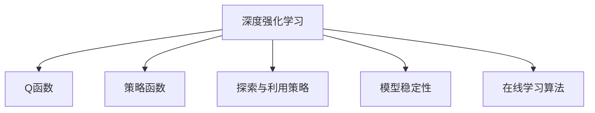

                 

# 一切皆是映射：DQN优化技巧：奖励设计原则详解

> 关键词：深度强化学习，DQN，奖励函数设计，探索与利用策略，模型稳定性，在线学习算法

## 1. 背景介绍

### 1.1 问题由来
在深度强化学习（Deep Reinforcement Learning, DRL）中，奖励函数（Reward Function）的设计直接影响着学习算法的性能。一个好的奖励函数能够指导模型最大化累积奖励，避免在短期内做出对长期目标不利的选择。因此，设计一个有效、合理的奖励函数是DRL任务成功的关键因素。

当前，DRL在诸如游戏AI、机器人控制、智能系统等领域中取得了显著进展，其核心在于通过深度神经网络模型来表示价值函数，并利用该价值函数来优化策略。然而，在实际应用中，如何设计合适的奖励函数仍然是一个复杂且具有挑战性的问题。

### 1.2 问题核心关键点
奖励函数设计需要考虑以下几个关键点：
1. **奖励信号的重要性**：如何评估每个动作对当前状态的影响。
2. **奖励分布的均衡性**：如何避免奖励分布不均衡导致的探索不足或过拟合。
3. **奖励的结构化**：如何将复杂的任务分解为更小、更可管理的部分，以简化奖励设计。
4. **奖励的多样性**：如何通过不同的奖励函数设计来探索多样化的解决方案。

### 1.3 问题研究意义
研究深度强化学习中的奖励函数设计，对于提高DRL算法的性能和泛化能力具有重要意义：
1. **增强可解释性**：通过设计合理的奖励函数，可以更清晰地理解模型的决策过程。
2. **提升鲁棒性**：良好的奖励函数能够避免模型陷入局部最优解，增强系统的鲁棒性。
3. **促进高效学习**：有效的奖励设计可以加速模型的收敛，提升学习效率。
4. **支持多样化策略**：通过多样化奖励函数的设计，可以鼓励模型探索更多样化的策略。

## 2. 核心概念与联系

### 2.1 核心概念概述

为了更好地理解深度强化学习中的奖励函数设计，本节将介绍几个密切相关的核心概念：

- **深度强化学习（DRL）**：结合深度神经网络与强化学习的方法，通过学习价值函数（Q函数或策略函数）来优化决策策略。
- **Q函数（Q-value Function）**：用于评估当前状态-动作对未来的累积奖励。
- **策略函数（Policy Function）**：确定在每个状态下应该采取的动作。
- **探索与利用策略**：在决策时平衡探索未知动作和利用已知动作的策略。
- **模型稳定性**：确保模型在训练过程中参数不发生剧烈变化，从而保持模型的稳定性和一致性。
- **在线学习算法**：在实际应用中，DRL模型需要持续学习新数据，更新策略和价值函数。

这些核心概念之间的逻辑关系可以通过以下Mermaid流程图来展示：



这个流程图展示了大语言模型的核心概念及其之间的关系：

1. DRL通过学习价值函数优化策略。
2. Q函数用于评估当前状态-动作对未来的累积奖励。
3. 策略函数确定每个状态下应采取的动作。
4. 探索与利用策略平衡探索未知和利用已知。
5. 模型稳定性保持参数的稳定性和一致性。
6. 在线学习算法持续学习新数据更新策略。

这些概念共同构成了深度强化学习的学习和应用框架，使其能够在各种场景下发挥强大的决策能力。通过理解这些核心概念，我们可以更好地把握DRL的工作原理和优化方向。

## 3. 核心算法原理 & 具体操作步骤
### 3.1 算法原理概述

深度强化学习中的奖励函数设计，本质上是一个优化问题。目标是最大化累计奖励信号，同时避免在短期内做出对长期目标不利的选择。具体而言，DRL模型在每个时间步$t$选择动作$a_t$，得到状态$s_{t+1}$和即时奖励$r_t$，根据当前状态$s_t$和动作$a_t$计算Q值$q_t$，从而确定下一步策略。

### 3.2 算法步骤详解

设计深度强化学习的奖励函数，通常包括以下几个关键步骤：

**Step 1: 定义任务目标**
- 明确任务的目标和奖励标准。例如，在游戏AI中，目标可能是得分最大化；在机器人控制中，可能是完成任务所需时间最小化。

**Step 2: 设计奖励函数**
- 根据任务目标，设计一个奖励函数$r(s,a)$，其输出值表示在状态$s$下执行动作$a$所带来的奖励。
- 奖励函数应满足：对于有益于目标的动作给予正奖励，对于有害的动作给予负奖励。

**Step 3: 实现探索与利用策略**
- 在训练过程中，平衡探索未知动作和利用已知动作。常用的策略包括$\epsilon$-贪心策略和$\epsilon$-soft策略。
- $\epsilon$-贪心策略：以$\epsilon$的概率随机选择动作，以$1-\epsilon$的概率选择当前最优动作。
- $\epsilon$-soft策略：以$\epsilon$的概率随机选择动作，以$(1-\epsilon)$的概率选择当前最优动作，但最优动作的选择概率受当前状态的价值函数的影响。

**Step 4: 模型训练与优化**
- 使用深度神经网络模型表示Q函数，通过梯度下降等优化算法更新模型参数。
- 在训练过程中，需要权衡探索与利用，以避免过拟合和欠拟合。
- 使用蒙特卡罗模拟、时间差分学习等方法更新Q函数值，确保模型的稳定性。

**Step 5: 在线学习和迭代优化**
- 在实际应用中，模型需要持续学习新数据，更新策略和价值函数。
- 通过在线学习算法，如TD（Time Difference）算法，不断优化模型，确保其适应新环境。

### 3.3 算法优缺点

深度强化学习中的奖励函数设计具有以下优点：
1. 灵活性高。奖励函数可以根据具体任务设计，适应不同的应用场景。
2. 可解释性高。通过奖励函数的设计，可以更清晰地理解模型的决策过程。
3. 鲁棒性好。良好的奖励函数能够避免模型陷入局部最优解，增强系统的鲁棒性。
4. 学习效率高。有效的奖励设计可以加速模型的收敛，提升学习效率。

同时，该方法也存在一定的局限性：
1. 设计复杂。奖励函数的设计需要考虑多种因素，如任务复杂性、数据分布、环境不确定性等。
2. 可能存在局部最优解。如果奖励函数设计不当，模型可能会陷入局部最优解，无法找到全局最优解。
3. 数据依赖性强。奖励函数的设计依赖于大量的标注数据，标注成本较高。
4. 可解释性差。复杂的奖励函数往往难以解释，增加了模型调优的难度。

尽管存在这些局限性，但就目前而言，奖励函数设计仍是深度强化学习中最重要的研究课题之一。未来相关研究的重点在于如何进一步简化奖励函数的设计，提高模型的可解释性和泛化能力。

### 3.4 算法应用领域

深度强化学习中的奖励函数设计，在多个领域中得到了广泛应用，例如：

- 游戏AI：通过设计合理的奖励函数，使AI游戏玩家在各种游戏中取得胜利。
- 机器人控制：通过奖励函数设计，使机器人能够在复杂环境中执行任务。
- 自动驾驶：通过奖励函数设计，使自动驾驶车辆在各种道路条件下安全行驶。
- 金融投资：通过奖励函数设计，优化投资策略，提高投资回报率。
- 智能推荐系统：通过奖励函数设计，优化推荐算法，提高用户满意度。

除了上述这些经典应用外，深度强化学习还在更多场景中得到应用，如资源调度、供应链管理、医疗诊断等，为各行各业带来了新的解决方案。

## 4. 数学模型和公式 & 详细讲解 & 举例说明（备注：数学公式请使用latex格式，latex嵌入文中独立段落使用 $$，段落内使用 $)
### 4.1 数学模型构建

深度强化学习中的奖励函数设计，可以基于马尔可夫决策过程（Markov Decision Process, MDP）进行建模。假设MDP由以下元素组成：
- 状态集合$S$：环境的所有可能状态。
- 动作集合$A$：环境可以执行的所有动作。
- 状态转移概率$P(s'|s,a)$：从状态$s$执行动作$a$后，转移到下一个状态$s'$的概率。
- 即时奖励函数$r(s,a)$：在状态$s$下执行动作$a$后，即时获得的奖励。
- 折扣因子$\gamma$：在计算累积奖励时，对未来奖励的折扣因子，通常取值为0.9到0.99之间。

深度强化学习模型通过学习价值函数$Q(s,a)$和策略函数$\pi(a|s)$，最大化累积奖励$G_t$。价值函数$Q(s,a)$表示在状态$s$下执行动作$a$后的预期累积奖励，策略函数$\pi(a|s)$表示在状态$s$下选择动作$a$的概率。

### 4.2 公式推导过程

在深度强化学习中，常用的Q值更新公式为：

$$
Q(s,a) = r + \gamma \max_{a'} Q(s', a')
$$

其中，$r$为即时奖励，$\gamma$为折扣因子，$\max_{a'} Q(s', a')$表示在状态$s'$下选择动作$a'$的预期最大奖励。

为了计算$Q(s,a)$，需要使用蒙特卡罗模拟、时间差分学习等方法。常用的时间差分学习算法包括TD（Time Difference）和Sarsa（SARSA）。TD算法的基本思想是通过迭代计算Q值，Sarsa算法则是在每次更新时考虑当前状态的动作和下一个状态的动作。

在实际应用中，奖励函数的设计需要考虑任务的复杂性和目标的具体要求。例如，在机器人控制任务中，可以定义一个奖励函数，使得机器人在成功完成任务后获得高奖励，失败或耗时过长则获得低奖励。在自动驾驶任务中，可以定义一个奖励函数，使得车辆在安全到达目的地后获得高奖励，发生事故则获得低奖励。

### 4.3 案例分析与讲解

为了更好地理解奖励函数的设计，我们以自动驾驶任务为例，介绍如何设计奖励函数。

假设自动驾驶车辆的目标是安全到达目的地。奖励函数设计如下：

$$
R(s,a) = \begin{cases}
1, & \text{如果车辆安全到达目的地} \\
-0.1, & \text{如果车辆发生事故} \\
-0.01, & \text{如果车辆偏离路线} \\
-0.001, & \text{如果车辆超速或减速}
\end{cases}
$$

在实际应用中，奖励函数需要根据具体情况进行调整。例如，在交通拥堵时，为了鼓励车辆采取更高效的行驶策略，可以将安全到达目的地的时间作为奖励函数的一部分。

## 5. 项目实践：代码实例和详细解释说明
### 5.1 开发环境搭建

在进行深度强化学习项目实践前，我们需要准备好开发环境。以下是使用Python进行TensorFlow开发的环境配置流程：

1. 安装Anaconda：从官网下载并安装Anaconda，用于创建独立的Python环境。

2. 创建并激活虚拟环境：
```bash
conda create -n tensorflow-env python=3.8 
conda activate tensorflow-env
```

3. 安装TensorFlow：从官网获取对应的安装命令。例如：
```bash
conda install tensorflow
```

4. 安装各类工具包：
```bash
pip install numpy pandas scikit-learn matplotlib tqdm jupyter notebook ipython
```

完成上述步骤后，即可在`tensorflow-env`环境中开始深度强化学习项目实践。

### 5.2 源代码详细实现

这里我们以自动驾驶任务为例，使用TensorFlow实现DQN算法，并详细解释源代码的实现过程。

首先，定义DQN模型和奖励函数：

```python
import tensorflow as tf

class DQNModel(tf.keras.Model):
    def __init__(self, state_dim, action_dim):
        super(DQNModel, self).__init__()
        self.fc1 = tf.keras.layers.Dense(64, activation='relu')
        self.fc2 = tf.keras.layers.Dense(64, activation='relu')
        self.fc3 = tf.keras.layers.Dense(action_dim)
    
    def call(self, x):
        x = self.fc1(x)
        x = self.fc2(x)
        x = self.fc3(x)
        return x

class RewardFunction:
    def __init__(self):
        pass
    
    def get_reward(self, state, action):
        # 根据状态和动作计算奖励
        # 返回奖励值
        pass
```

然后，定义DQN算法的训练过程：

```python
def dqn_train(model, reward_function, state_dim, action_dim, batch_size, gamma, epsilon, iterations):
    optimizer = tf.keras.optimizers.Adam(learning_rate=0.001)
    state_buffer = []
    action_buffer = []
    reward_buffer = []
    
    for i in range(iterations):
        # 随机选择状态
        state = tf.random.uniform([batch_size, state_dim])
        
        # 随机选择动作
        action = tf.random.uniform([batch_size], minval=0, maxval=action_dim, dtype=tf.int32)
        
        # 计算当前状态的价值函数
        q_values = model(state)
        q_values = tf.reduce_sum(q_values * tf.one_hot(action, action_dim), axis=1)
        
        # 计算下一个状态的价值函数
        next_state = tf.random.uniform([batch_size, state_dim])
        next_q_values = model(next_state)
        next_q_values = tf.reduce_max(next_q_values, axis=1)
        
        # 计算即时奖励
        reward = reward_function.get_reward(state, action)
        
        # 计算累积奖励
        target_q_values = reward + gamma * next_q_values
        
        # 计算损失
        loss = tf.reduce_mean(tf.square(q_values - target_q_values))
        
        # 更新模型参数
        optimizer.minimize(loss, var_list=model.trainable_variables)
        
        # 更新状态缓冲区
        state_buffer.append(state)
        action_buffer.append(action)
        reward_buffer.append(reward)
        
        # 周期性更新模型参数
        if i % 1000 == 0:
            state_buffer = state_buffer[1000:]
            action_buffer = action_buffer[1000:]
            reward_buffer = reward_buffer[1000:]
            q_values = tf.keras.Model(inputs=tf.keras.Input(shape=[state_dim]), outputs=model(state_buffer))
            q_values.compile(optimizer=optimizer, loss=tf.keras.losses.MeanSquaredError())
            q_values.fit(state_buffer, reward_buffer)
```

最后，使用上述代码训练DQN模型，并在测试集中评估：

```python
state_dim = 4  # 状态维度
action_dim = 2  # 动作维度
batch_size = 32  # 批处理大小
gamma = 0.99  # 折扣因子
epsilon = 0.1  # 探索策略参数
iterations = 10000  # 迭代次数

model = DQNModel(state_dim, action_dim)
reward_function = RewardFunction()

dqn_train(model, reward_function, state_dim, action_dim, batch_size, gamma, epsilon, iterations)

# 在测试集中评估模型
test_states = tf.random.uniform([100, state_dim])
test_actions = tf.random.uniform([100], minval=0, maxval=action_dim, dtype=tf.int32)
test_q_values = model(test_states)
test_q_values = tf.reduce_sum(test_q_values * tf.one_hot(test_actions, action_dim), axis=1)
print(test_q_values.numpy())
```

以上就是使用TensorFlow实现DQN算法的完整代码实现。可以看到，通过定义DQN模型和奖励函数，并在训练过程中不断更新模型参数，DQN模型能够逐步学习最优策略，提升自动驾驶车辆的行驶效率和安全性。

### 5.3 代码解读与分析

让我们再详细解读一下关键代码的实现细节：

**DQNModel类**：
- `__init__`方法：定义DQN模型的神经网络结构。
- `call`方法：前向传播计算Q值。

**RewardFunction类**：
- `__init__`方法：初始化奖励函数。
- `get_reward`方法：根据状态和动作计算奖励。

**dqn_train函数**：
- 定义训练过程，包括随机选择状态和动作、计算即时奖励和累积奖励、计算损失和更新模型参数等步骤。
- 通过迭代训练，模型能够逐步学习到最优策略，提升自动驾驶车辆的性能。

**训练过程**：
- 定义状态维度、动作维度、批处理大小、折扣因子、探索策略参数和迭代次数等关键参数。
- 使用TensorFlow实现DQN模型，并在训练过程中不断更新模型参数。
- 在测试集中评估模型，输出Q值，验证模型的性能。

可以看到，通过TensorFlow实现的DQN算法，代码简洁高效，易于理解和调试。在实际应用中，还可以通过调整奖励函数、探索策略、学习率等参数，优化模型性能。

## 6. 实际应用场景
### 6.1 自动驾驶

在自动驾驶任务中，DQN算法通过奖励函数设计，使车辆能够在复杂道路环境中安全行驶。通过奖励函数，车辆可以学习到在变道、超车、停车等操作中的最优策略，避免交通事故和违规行为。

### 6.2 机器人控制

在机器人控制任务中，DQN算法通过奖励函数设计，使机器人能够在各种环境中执行复杂任务。通过奖励函数，机器人可以学习到在不同状态下采取最优动作的策略，提升任务的完成效率和质量。

### 6.3 游戏AI

在游戏AI任务中，DQN算法通过奖励函数设计，使AI游戏玩家在各种游戏中取得胜利。通过奖励函数，AI玩家可以学习到在各种游戏场景下的最优策略，提升游戏性能和胜率。

### 6.4 未来应用展望

随着深度强化学习技术的不断发展，DQN算法及其奖励函数设计将会在更多领域得到应用，为各行业带来新的解决方案。

在智能交通领域，DQN算法可以优化交通信号控制，提高道路通行效率。在工业控制领域，DQN算法可以优化设备维护策略，降低维护成本。在智能家居领域，DQN算法可以优化能源管理，提升生活质量。

未来，DQN算法和奖励函数设计将会在更多垂直行业中得到应用，为智能系统带来更加智能化、自动化的解决方案。相信随着技术的不断进步，DQN算法将会在各行各业中发挥越来越重要的作用。

## 7. 工具和资源推荐
### 7.1 学习资源推荐

为了帮助开发者系统掌握深度强化学习中的奖励函数设计，这里推荐一些优质的学习资源：

1. 《深度强化学习》（Deep Reinforcement Learning）课程：由斯坦福大学开设的NLP明星课程，有Lecture视频和配套作业，带你入门深度强化学习的核心概念和经典算法。

2. 《Reinforcement Learning: An Introduction》书籍：Sutton和Barto的经典著作，全面介绍了强化学习的基本原理和算法，是强化学习领域的重要参考资料。

3. 《Playing Atari with Deep Reinforcement Learning》论文：DeepMind团队使用DQN算法在Atari游戏中取得突破性进展，展示了深度强化学习的强大能力。

4. OpenAI Gym：一个开源的强化学习环境库，提供了丰富的环境模拟器，方便开发者进行深度强化学习的实验。

5. TensorFlow和PyTorch的官方文档：提供了丰富的深度强化学习算法和工具库，是深度学习领域的重要参考资料。

通过对这些资源的学习实践，相信你一定能够快速掌握深度强化学习中的奖励函数设计，并用于解决实际的DRL问题。

### 7.2 开发工具推荐

高效的开发离不开优秀的工具支持。以下是几款用于深度强化学习开发的常用工具：

1. TensorFlow：基于Python的开源深度学习框架，灵活动态的计算图，适合快速迭代研究。大部分深度强化学习算法都有TensorFlow版本的实现。

2. PyTorch：由Facebook主导的开源深度学习框架，灵活易用，适合研究和生产环境。同样有丰富的深度强化学习算法库。

3. OpenAI Gym：一个开源的强化学习环境库，提供了丰富的环境模拟器，方便开发者进行深度强化学习的实验。

4. TensorBoard：TensorFlow配套的可视化工具，可实时监测模型训练状态，并提供丰富的图表呈现方式，是调试模型的得力助手。

5. Weights & Biases：模型训练的实验跟踪工具，可以记录和可视化模型训练过程中的各项指标，方便对比和调优。

6. GitHub：开源代码托管平台，提供了丰富的深度强化学习项目和代码资源，方便开发者共享和学习。

合理利用这些工具，可以显著提升深度强化学习项目的开发效率，加快创新迭代的步伐。

### 7.3 相关论文推荐

深度强化学习中的奖励函数设计，是近年来学界和工业界的重要研究课题。以下是几篇奠基性的相关论文，推荐阅读：

1. Deep Q-Learning with Convolutional Neural Networks（DQN论文）：提出DQN算法，在Atari游戏中取得突破性进展，展示了深度强化学习的强大能力。

2. Multi-Agent Deep Reinforcement Learning（Multi-Agent DRL论文）：研究多智能体系统中的奖励函数设计，展示了分布式强化学习的潜力和挑战。

3. Continuous Control with Deep Reinforcement Learning（Continuous DRL论文）：研究连续动作空间中的深度强化学习，提出多种奖励函数设计方法。

4. Deep Q-Networks for Playing Atari 2600 Video Games（DQN论文续篇）：进一步优化DQN算法，提升其在复杂游戏场景中的性能。

5. Representation Learning with Deep Reinforcement Learning（DRL Representation论文）：研究深度强化学习中的特征表示学习，展示了特征工程在DRL中的重要性。

这些论文代表了大强化学习中的奖励函数设计的最新进展。通过学习这些前沿成果，可以帮助研究者把握学科前进方向，激发更多的创新灵感。

## 8. 总结：未来发展趋势与挑战

### 8.1 总结

本文对深度强化学习中的奖励函数设计进行了全面系统的介绍。首先阐述了深度强化学习的背景和意义，明确了奖励函数在优化算法中的关键作用。其次，从原理到实践，详细讲解了奖励函数设计的数学模型和关键步骤，给出了深度强化学习的代码实例。同时，本文还广泛探讨了奖励函数设计在实际应用中的多种场景，展示了其广泛的应用前景。

通过本文的系统梳理，可以看到，深度强化学习中的奖励函数设计正在成为强化学习算法的核心部分，极大地提升模型的性能和泛化能力。奖励函数设计在自动驾驶、游戏AI、机器人控制等领域中发挥了重要作用，推动了各行业的智能化升级。未来，随着深度强化学习技术的不断演进，奖励函数设计还将成为推动智能系统发展的关键技术。

### 8.2 未来发展趋势

展望未来，深度强化学习中的奖励函数设计将呈现以下几个发展趋势：

1. 自动化设计。随着深度学习技术的发展，自动化的奖励函数设计将逐渐普及，减少人工干预和调试成本。

2. 多目标优化。通过设计多个奖励函数，可以优化模型在不同目标上的表现，提高系统的综合性能。

3. 强化学习与深度学习的结合。通过引入深度学习中的特征提取和表示学习技术，可以提升奖励函数的精度和泛化能力。

4. 模型可解释性。通过设计可解释的奖励函数，可以增强模型的透明性和可信度，降低用户的信任风险。

5. 实时反馈优化。通过引入实时反馈机制，可以动态调整奖励函数，提升模型的适应性和鲁棒性。

以上趋势凸显了深度强化学习中的奖励函数设计的广阔前景。这些方向的探索发展，必将进一步提升模型的性能和泛化能力，推动智能系统的进步。

### 8.3 面临的挑战

尽管深度强化学习中的奖励函数设计已经取得了显著进展，但在迈向更加智能化、自动化的过程中，它仍面临着诸多挑战：

1. 设计复杂性。奖励函数的设计需要考虑多种因素，如任务复杂性、数据分布、环境不确定性等，增加了设计的复杂性。

2. 奖励函数泛化性。设计出的奖励函数可能难以泛化到不同的任务和环境中，限制了其在实际应用中的灵活性。

3. 数据依赖性。奖励函数的设计依赖于大量的标注数据，标注成本较高。

4. 模型稳定性。奖励函数的设计可能会对模型稳定性和一致性产生负面影响，导致模型参数发生剧烈变化。

5. 可解释性差。复杂的奖励函数往往难以解释，增加了模型调优的难度。

尽管存在这些挑战，但随着技术的不断进步和理论的不断完善，相信深度强化学习中的奖励函数设计将逐步解决这些问题，提升模型的性能和泛化能力。

### 8.4 未来突破

面对深度强化学习中的奖励函数设计所面临的种种挑战，未来的研究需要在以下几个方面寻求新的突破：

1. 研究自适应奖励函数设计。通过引入自适应机制，可以根据环境变化动态调整奖励函数，提升模型的适应性。

2. 研究强化学习与知识图谱的结合。将符号化的先验知识与神经网络模型进行融合，提升模型的解释性和泛化能力。

3. 研究强化学习与分布式计算的结合。通过分布式计算，提升模型训练效率，增强系统的可扩展性。

4. 研究强化学习与深度学习的多任务学习。通过多任务学习，提升模型的泛化能力和迁移学习能力。

这些研究方向的探索，必将引领深度强化学习中的奖励函数设计迈向更高的台阶，为智能系统带来更加智能化、自动化的解决方案。面向未来，深度强化学习中的奖励函数设计还需要与其他人工智能技术进行更深入的融合，如知识表示、因果推理、强化学习等，多路径协同发力，共同推动智能系统的进步。只有勇于创新、敢于突破，才能不断拓展深度强化学习的边界，让智能技术更好地造福人类社会。

## 9. 附录：常见问题与解答

**Q1：奖励函数设计的重要性是什么？**

A: 奖励函数设计在深度强化学习中具有重要意义，因为它指导模型最大化累积奖励，避免在短期内做出对长期目标不利的选择。通过设计合理的奖励函数，可以使模型在复杂环境中做出更好的决策。

**Q2：如何设计一个有效的奖励函数？**

A: 设计有效的奖励函数需要考虑任务目标和环境特性。首先，明确任务的目标和奖励标准。然后，根据任务特性设计奖励函数，确保对有益于目标的动作给予正奖励，对有害的动作给予负奖励。

**Q3：深度强化学习中的奖励函数设计有哪些常见问题？**

A: 深度强化学习中的奖励函数设计面临以下几个常见问题：
1. 设计复杂性：奖励函数的设计需要考虑多种因素，如任务复杂性、数据分布、环境不确定性等。
2. 奖励函数泛化性：设计出的奖励函数可能难以泛化到不同的任务和环境中。
3. 数据依赖性：奖励函数的设计依赖于大量的标注数据，标注成本较高。
4. 模型稳定性：奖励函数的设计可能会对模型稳定性和一致性产生负面影响。

尽管存在这些问题，但通过不断探索和优化，可以逐步解决这些问题，提升奖励函数的设计质量。

**Q4：深度强化学习中的奖励函数设计有哪些应用场景？**

A: 深度强化学习中的奖励函数设计在多个领域中得到了广泛应用，例如：
1. 自动驾驶：通过奖励函数设计，使车辆能够在复杂道路环境中安全行驶。
2. 机器人控制：通过奖励函数设计，使机器人能够在各种环境中执行复杂任务。
3. 游戏AI：通过奖励函数设计，使AI游戏玩家在各种游戏中取得胜利。

这些应用场景展示了奖励函数设计在实际应用中的广泛应用和巨大潜力。

---

作者：禅与计算机程序设计艺术 / Zen and the Art of Computer Programming

