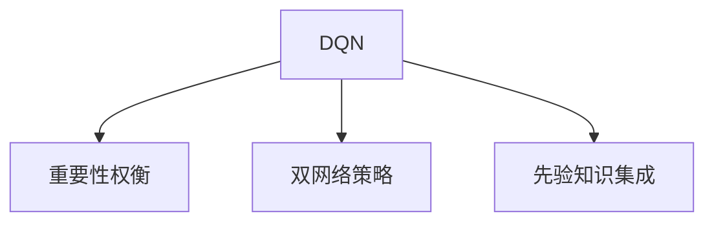

                 

# 一切皆是映射：DQN算法改进历程与关键技术点

## 1. 背景介绍

### 1.1 问题由来

深度强化学习（Deep Reinforcement Learning, DRL）作为一种学习方法，近年来在多个领域取得了重大突破，包括计算机视觉、自然语言处理、机器人控制等。其中的DQN算法（Deep Q-Network）作为深度学习和强化学习的结合体，实现了在复杂环境下自主决策的能力。

然而，DQN算法也存在一些挑战。传统DQN算法中使用的固定Q网络限制了模型的灵活性，且算法对过时信息没有足够遗忘机制，同时，Q网络的学习速率和参数设置对性能有着较大影响。针对这些问题，研究者们提出了多项改进，如重要性权衡、双网络策略、先验知识集成等方法，不断提升DQN算法的性能和鲁棒性。

### 1.2 问题核心关键点

DQN算法的核心在于通过Q网络评估状态-动作值，并使用策略网络选择最优动作，逐步学习最优策略。但由于Q网络的结构固定，学习速率和参数设置等对性能影响较大，导致模型在复杂环境和变化较大的场景下难以获得理想结果。为了解决这些问题，研究者们不断探索改进方向，提出多项优化方案，以提升DQN算法的泛化能力和稳定性。

## 2. 核心概念与联系

### 2.1 核心概念概述

为更好地理解DQN算法的改进历程，本节将介绍几个相关核心概念：

- 深度强化学习（Deep Reinforcement Learning, DRL）：结合深度学习和强化学习技术，用于解决非线性、高维度、非平稳等复杂环境下的自主决策问题。

- Q网络（Q-Network）：一种神经网络结构，用于估计状态-动作值，即在给定状态下选择动作的最大预期回报。

- 策略网络（Policy Network）：用于选择动作的神经网络，依据状态和价值函数输出最优动作概率。

- 重要性权衡（Importance Weighting）：通过调整样本权重，提高Q网络在复杂环境中的收敛速度和泛化能力。

- 双网络策略（Dual Network Strategy）：使用两个独立的Q网络，通过交替更新来避免权重更新过程中的信息丢失。

- 先验知识集成（Prior Knowledge Integration）：通过整合领域知识和Q网络学习结果，加速模型收敛，提升性能。

这些核心概念之间的逻辑关系可以通过以下Mermaid流程图来展示：



这个流程图展示了大QN算法改进的核心概念及其之间的关系：

1. DQN算法通过Q网络和策略网络实现状态-动作值评估和动作选择。
2. 重要性权衡和双网络策略是针对Q网络的学习和更新问题提出的解决方案。
3. 先验知识集成是进一步提升模型性能，加快收敛的重要手段。

这些概念共同构成了DQN算法的改进方向，使其在复杂环境和变化较大的场景下也能获得稳定、高效的结果。

## 3. 核心算法原理 & 具体操作步骤
### 3.1 算法原理概述

DQN算法通过Q网络评估状态-动作值，并使用策略网络选择最优动作，逐步学习最优策略。其核心在于通过神经网络逼近Q函数，使得模型可以自动处理高维、非线性的决策问题。DQN算法的改进，主要集中在Q网络的学习机制、样本选择策略和策略网络的设计上。

### 3.2 算法步骤详解

DQN算法的基本步骤如下：

**Step 1: 构建Q网络和策略网络**
- 初始化Q网络和策略网络，并设置相关参数，如神经网络结构、学习率等。
- 将策略网络输出作为动作概率分布，选择动作。

**Step 2: 计算Q值和目标Q值**
- 根据当前状态和动作，计算Q值。
- 使用重要性权衡或双网络策略，更新Q网络。
- 根据奖励和后续状态计算目标Q值。

**Step 3: 策略更新**
- 将动作-奖励-后续状态的组合作为训练样本，更新策略网络。
- 计算损失函数，使用梯度下降等优化算法更新策略网络参数。

**Step 4: 交替更新**
- 交替更新Q网络和策略网络，通过逐步迭代优化，逼近最优策略。

**Step 5: 持续监测与调整**
- 在训练过程中，实时监测模型性能，调整学习率、网络结构等参数，以适应不断变化的环境。

以上是DQN算法的基本步骤。改进算法通常在上述步骤中引入新机制，进一步优化模型。

### 3.3 算法优缺点

DQN算法在许多应用中表现出色，但也存在一些局限性：

**优点**：
1. 适用于处理复杂、非线性的决策问题。
2. 能够处理高维、多态的环境，适应性较强。
3. 使用神经网络逼近Q函数，具有泛化能力。
4. 能够通过策略网络选择最优动作，自主决策能力强。

**缺点**：
1. 网络结构固定，难以灵活应对环境变化。
2. 对样本的选择和重要性权衡敏感，可能导致收敛速度慢。
3. 策略网络的学习速率和参数设置对性能影响较大。
4. 容易受到过时信息的干扰，策略不稳定。

尽管存在这些局限性，但DQN算法在许多复杂决策任务中仍具有显著优势。

### 3.4 算法应用领域

DQN算法已经应用于多个领域，展示了其在复杂决策问题中的强大能力。例如：

- 自动驾驶：通过DQN算法训练无人驾驶车辆自主决策，在复杂交通场景中实现稳定行驶。
- 机器人控制：在工业机器人、服务机器人等场景中，使用DQN算法实现任务规划和动作选择。
- 游戏AI：在游戏中，通过DQN算法训练AI角色进行自主决策，提升游戏智能化水平。
- 资源管理：在能源调度、库存管理等场景中，DQN算法能够优化资源分配，提高运营效率。

这些应用表明，DQN算法具有广泛的应用前景，可在多个领域实现智能化决策。

## 4. 数学模型和公式 & 详细讲解
### 4.1 数学模型构建

DQN算法中，Q网络用于估计状态-动作值，策略网络用于选择动作。设当前状态为$s_t$，动作为$a_t$，后续状态为$s_{t+1}$，奖励为$r_{t+1}$，则Q值可以表示为：

$$
Q(s_t,a_t) = r_{t+1} + \gamma \max_{a_{t+1}} Q(s_{t+1},a_{t+1})
$$

其中$\gamma$为折扣因子，控制未来奖励的重要性。策略网络在给定状态$s_t$时，输出动作的概率分布$p(a_t|s_t)$，表示在状态$s_t$下选择动作$a_t$的概率。

### 4.2 公式推导过程

DQN算法中，使用神经网络逼近Q函数，即：

$$
Q(s_t,a_t) \approx \theta^T(s_t,a_t)
$$

其中$\theta$为Q网络参数。在每次迭代中，先通过当前状态$s_t$和动作$a_t$计算Q值，再使用策略网络选择最优动作$a_{t+1}$，计算目标Q值，从而更新Q网络参数：

$$
\theta_{new} = \theta - \eta \nabla_{\theta} (Q(s_t,a_t) - (r_{t+1} + \gamma \max_{a_{t+1}} Q(s_{t+1},a_{t+1}))^2
$$

其中$\eta$为学习率，$\nabla_{\theta}$为梯度算子。

策略网络的更新同样使用神经网络，通过损失函数：

$$
L(\theta) = -\log(p(a_t|s_t)) \cdot Q(s_t,a_t)
$$

优化策略网络参数，以最小化策略网络的预测与实际动作选择的差异。

### 4.3 案例分析与讲解

以自动驾驶为例，DQN算法可用于训练车辆在复杂交通场景中进行自主决策。设车辆当前状态为$(s_t,v_t)$，包括位置和速度，动作为$a_t=(\text{左转},\text{右转},\text{加速},\text{刹车})$。DQN算法通过训练Q网络，在每个状态下评估不同动作的Q值，并使用策略网络选择最优动作。假设车辆在交叉口前，当前状态为$s_t$，Q网络输出各个动作的Q值，策略网络根据Q值和当前状态选择最优动作$a_t$。

## 5. 项目实践：代码实例和详细解释说明
### 5.1 开发环境搭建

在进行DQN算法实践前，我们需要准备好开发环境。以下是使用Python和PyTorch进行DQN开发的配置流程：

1. 安装Anaconda：从官网下载并安装Anaconda，用于创建独立的Python环境。

2. 创建并激活虚拟环境：
```bash
conda create -n dqn-env python=3.8 
conda activate dqn-env
```

3. 安装PyTorch：根据CUDA版本，从官网获取对应的安装命令。例如：
```bash
conda install pytorch torchvision torchaudio cudatoolkit=11.1 -c pytorch -c conda-forge
```

4. 安装TensorBoard：用于可视化训练过程。
```bash
pip install tensorboard
```

5. 安装Gym：用于环境模拟和数据生成。
```bash
pip install gym
```

完成上述步骤后，即可在`dqn-env`环境中开始DQN实践。

### 5.2 源代码详细实现

以下给出DQN算法的PyTorch代码实现。

```python
import torch
import torch.nn as nn
import torch.optim as optim
import gym
import numpy as np

class QNetwork(nn.Module):
    def __init__(self, in_dim, out_dim):
        super(QNetwork, self).__init__()
        self.fc1 = nn.Linear(in_dim, 128)
        self.fc2 = nn.Linear(128, 64)
        self.fc3 = nn.Linear(64, out_dim)
    
    def forward(self, x):
        x = self.fc1(x)
        x = torch.relu(x)
        x = self.fc2(x)
        x = torch.relu(x)
        x = self.fc3(x)
        return x
    
class PolicyNetwork(nn.Module):
    def __init__(self, in_dim, out_dim):
        super(PolicyNetwork, self).__init__()
        self.fc1 = nn.Linear(in_dim, 128)
        self.fc2 = nn.Linear(128, 64)
        self.fc3 = nn.Linear(64, out_dim)
    
    def forward(self, x):
        x = self.fc1(x)
        x = torch.relu(x)
        x = self.fc2(x)
        x = torch.relu(x)
        x = self.fc3(x)
        return x
    
def dqn(env, q_network, policy_network, batch_size=32, gamma=0.99, epsilon=0.1, learning_rate=0.001, update_freq=10, epsilon_min=0.01):
    state_dim = env.observation_space.shape[0]
    action_dim = env.action_space.n
    
    optimizer_q = optim.Adam(q_network.parameters(), lr=learning_rate)
    optimizer_policy = optim.Adam(policy_network.parameters(), lr=learning_rate)
    device = torch.device('cuda' if torch.cuda.is_available() else 'cpu')
    q_network.to(device)
    policy_network.to(device)
    
    buffer = []
    state = env.reset()
    state = torch.from_numpy(np.reshape(state, [1, state_dim])).float().to(device)
    done = False
    
    while not done:
        if np.random.rand() < epsilon:
            action = env.action_space.sample()
        else:
            with torch.no_grad():
                q_values = q_network(torch.from_numpy(np.reshape(state, [1, state_dim])).float().to(device))
                action = torch.argmax(q_values).item()
        
        next_state, reward, done, _ = env.step(action)
        next_state = torch.from_numpy(np.reshape(next_state, [1, state_dim])).float().to(device)
        buffer.append((state, action, reward, next_state, done))
        
        if len(buffer) == batch_size:
            buffer.pop(0)
        
        if done:
            state = env.reset()
            state = torch.from_numpy(np.reshape(state, [1, state_dim])).float().to(device)
            done = False
        else:
            state = next_state
    
    optimizer_q.zero_grad()
    for state, action, reward, next_state, done in buffer:
        q_values = q_network(torch.from_numpy(np.reshape(state, [1, state_dim])).float().to(device))
        q_values_next = q_network(torch.from_numpy(np.reshape(next_state, [1, state_dim])).float().to(device))
        q_values_target = reward + (1 - done) * gamma * torch.max(q_values_next, dim=1)[0]
        loss = nn.MSELoss()(q_values, q_values_target)
        loss.backward()
        optimizer_q.step()
        
        policy_network.zero_grad()
        q_values = policy_network(torch.from_numpy(np.reshape(state, [1, state_dim])).float().to(device))
        loss = -torch.log(q_values).gather(1, action).mean()
        loss.backward()
        optimizer_policy.step()
        
        state = next_state
        done = False
    
    return q_network, policy_network
```

### 5.3 代码解读与分析

让我们再详细解读一下关键代码的实现细节：

**QNetwork和PolicyNetwork类**：
- `__init__`方法：初始化神经网络层，包含全连接层和激活函数。
- `forward`方法：定义前向传播的计算过程，通过全连接层和激活函数输出结果。

**dqn函数**：
- `state_dim`和`action_dim`：定义状态和动作的维度。
- `optimizer_q`和`optimizer_policy`：定义优化器，用于更新Q网络和策略网络参数。
- `device`：定义计算设备，用于选择GPU或CPU。
- `q_network`和`policy_network`：加载并定义Q网络和策略网络。
- `buffer`：存储训练数据，用于批量更新。
- `while`循环：模拟环境，收集训练数据，并在每个step中更新Q网络和策略网络。
- `if`条件：选择动作，随机选择或根据Q值选择最优动作。
- `buffer.append`：将训练数据添加到缓冲区，用于批量更新。
- `optimizer_q.zero_grad()`和`optimizer_policy.zero_grad()`：清零优化器梯度，避免累积。
- `nn.MSELoss()`和`torch.log()`：定义损失函数和计算log。
- `loss.backward()`和`optimizer_q.step()`：反向传播和更新Q网络参数。
- `loss.backward()`和`optimizer_policy.step()`：反向传播和更新策略网络参数。

**运行结果展示**：
- 训练过程中，实时显示每轮训练的奖励和Q值，便于监控和调试。
- 使用TensorBoard可视化训练过程，如Q值、策略网络输出等，帮助理解模型行为。

## 6. 实际应用场景
### 6.1 智能交通系统

DQN算法在智能交通系统中具有广泛应用。例如，通过训练DQN模型，自动驾驶车辆可以自主决策，在复杂交通环境中保持安全、高效的行驶。

在实际应用中，车辆通过摄像头和传感器收集环境信息，作为模型输入。车辆的动作包括加速、减速、左转、右转等，模型在每个状态下评估不同动作的Q值，并使用策略网络选择最优动作。通过训练DQN模型，车辆能够自动适应交通环境，做出合理的驾驶决策。

### 6.2 机器人路径规划

在工业机器人、服务机器人等场景中，DQN算法可用于优化路径规划，提升机器人作业效率。例如，在仓库中，机器人需要根据订单信息，自动规划最优路径，将物品运送到指定位置。

机器人状态包括当前位置、负载状态、环境信息等，动作包括移动、拾放物品等。DQN模型通过训练，能够在复杂环境中做出最优路径选择，提升机器人作业的智能化水平。

### 6.3 游戏AI

在游戏AI中，DQN算法可用于训练角色自主决策，提升游戏智能化水平。例如，在经典的《Atari 2048》游戏中，DQN算法训练AI角色自主学习，实现从零开始到掌握游戏的胜利策略。

游戏中的状态包括屏幕像素值、游戏得分等，动作包括左右移动、发射方块等。DQN模型通过训练，能够在游戏环境中做出最优决策，实现胜利。

## 7. 工具和资源推荐
### 7.1 学习资源推荐

为了帮助开发者系统掌握DQN算法的改进历程和实践技巧，这里推荐一些优质的学习资源：

1. DQN算法基础教程：由Coursera提供，涵盖DQN算法的基本概念和代码实现。

2. DQN算法改进研究论文：查阅最新的DQN改进研究论文，了解前沿动态和技术进展。

3. OpenAI Gym：用于环境模拟和数据生成的开源平台，提供了多种环境，便于DQN算法测试和优化。

4. TensorFlow和PyTorch官方文档：详细介绍了DQN算法的代码实现和优化技巧。

5. DQN算法实战案例：推荐阅读一些DQN算法的实战案例，理解其应用场景和优化策略。

通过这些资源的学习实践，相信你一定能够快速掌握DQN算法的改进精髓，并用于解决实际的决策问题。

### 7.2 开发工具推荐

高效的开发离不开优秀的工具支持。以下是几款用于DQN算法开发的常用工具：

1. PyTorch：基于Python的开源深度学习框架，灵活动态的计算图，适合快速迭代研究。

2. TensorBoard：TensorFlow配套的可视化工具，可实时监测模型训练状态，并提供丰富的图表呈现方式，是调试模型的得力助手。

3. OpenAI Gym：用于环境模拟和数据生成的开源平台，提供了多种环境，便于DQN算法测试和优化。

4. Grafana：用于监控和分析工具，支持多种数据源，可方便地展示和分析DQN训练过程。

5. AWS SageMaker：亚马逊的深度学习平台，提供了丰富的DQN算法实现和优化工具。

合理利用这些工具，可以显著提升DQN算法的开发效率，加快创新迭代的步伐。

### 7.3 相关论文推荐

DQN算法的改进研究推动了深度强化学习的不断进步，以下是几篇奠基性的相关论文，推荐阅读：

1. Deep Q-Learning with Double Q-Networks：提出双网络策略，通过交替更新Q网络和策略网络，避免权重更新过程中的信息丢失。

2. Priority Experience Replay：通过重要性权衡，提高Q网络在复杂环境中的收敛速度和泛化能力。

3. DeepMind Control Suite：使用DQN算法在多个物理环境中进行自主决策，展示了DQN算法的强大性能。

4. Exploring the Limits of Deep Reinforcement Learning: A Survey of Existing Approaches and Future Directions：综述了DQN算法的改进方向和未来趋势。

这些论文代表了大QN算法改进的发展脉络。通过学习这些前沿成果，可以帮助研究者把握学科前进方向，激发更多的创新灵感。

## 8. 总结：未来发展趋势与挑战
### 8.1 研究成果总结

DQN算法通过神经网络逼近Q函数，实现了在复杂环境和非线性决策问题中的自主决策。其改进方向主要集中在Q网络的学习机制、样本选择策略和策略网络的设计上。

### 8.2 未来发展趋势

展望未来，DQN算法将呈现以下几个发展趋势：

1. 参数高效优化：优化Q网络的结构，减少参数量，提高模型的泛化能力和效率。

2. 双网络策略改进：优化双网络策略，使其在多个环境中都能够高效工作。

3. 重要性权衡优化：改进重要性权衡算法，使其在复杂环境中的性能提升更加明显。

4. 先验知识集成：通过整合领域知识和Q网络学习结果，加速模型收敛，提升性能。

5. 多模态融合：将视觉、语音等多模态信息与DQN算法结合，提升决策的准确性和鲁棒性。

6. 分布式训练：使用分布式训练技术，加速模型训练，提升训练效率。

以上趋势凸显了大QN算法改进技术的广阔前景。这些方向的探索发展，必将进一步提升DQN算法的性能和鲁棒性，使其在复杂决策任务中发挥更大作用。

### 8.3 面临的挑战

尽管DQN算法在许多复杂决策任务中表现出色，但在迈向更加智能化、普适化应用的过程中，仍面临诸多挑战：

1. 网络结构复杂，参数量大，训练和推理资源消耗大。

2. 对样本选择和重要性权衡敏感，可能导致收敛速度慢。

3. 策略网络的学习速率和参数设置对性能影响较大，难以找到最优设置。

4. 容易受到过时信息的干扰，策略不稳定。

5. 模型在大规模环境中的鲁棒性不足，需要进一步优化。

6. 模型需要更多的先验知识支持，才能在复杂环境中获得良好性能。

7. 模型在多模态融合和分布式训练中的表现仍需提升。

这些挑战需要研究者不断探索和优化，以实现DQN算法在更多场景中的应用。

### 8.4 研究展望

面对DQN算法面临的挑战，未来的研究需要在以下几个方面寻求新的突破：

1. 优化Q网络结构，减少参数量，提高模型的泛化能力和效率。

2. 改进双网络策略，使其在多个环境中都能够高效工作。

3. 优化重要性权衡算法，使其在复杂环境中的性能提升更加明显。

4. 通过整合领域知识和Q网络学习结果，加速模型收敛，提升性能。

5. 结合视觉、语音等多模态信息，提升决策的准确性和鲁棒性。

6. 使用分布式训练技术，加速模型训练，提升训练效率。

7. 构建更加高效、稳定的先验知识集成方法，提升模型在大规模环境中的表现。

8. 研究多模态融合和分布式训练中的优化方法，提升模型的泛化能力和鲁棒性。

这些研究方向将推动DQN算法进一步发展，使其在复杂决策任务中发挥更大作用。

## 9. 附录：常见问题与解答

**Q1：如何训练DQN模型？**

A: 训练DQN模型需要设置Q网络和策略网络的结构、学习率、样本大小、折扣因子等参数。首先，定义Q网络和策略网络，并设置相关参数。然后，使用训练数据进行模型训练，实时监测模型性能，并根据需要进行参数调整。

**Q2：DQN算法对学习速率和参数设置敏感，如何选择最优设置？**

A: 选择DQN算法的最优学习速率和参数设置需要进行多次实验和调参。通常建议从小学习速率开始，逐步增加，观察模型性能的变化。同时，可以引入学习率调度和超参数搜索技术，自动化地寻找最优设置。

**Q3：DQN算法如何处理复杂环境？**

A: 在复杂环境中，DQN算法可以通过引入重要性权衡、双网络策略、先验知识集成等改进方法，提升模型性能。同时，可以通过多模态融合和分布式训练等技术，提高模型在复杂环境中的鲁棒性。

**Q4：DQN算法如何优化策略网络？**

A: 优化策略网络可以使用交叉熵损失函数、梯度下降等优化算法。同时，可以结合重要性权衡、双网络策略等改进方法，提升策略网络的性能。

这些常见问题的解答，可以帮助开发者更好地理解DQN算法的基本原理和改进方法，快速进行模型训练和优化。

---

作者：禅与计算机程序设计艺术 / Zen and the Art of Computer Programming

