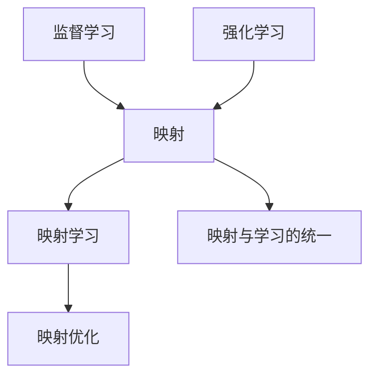

                 

## 1. 背景介绍

### 1.1 问题由来
在机器学习的海洋中，监督学习和强化学习（Reinforcement Learning, RL）是两大核心范式。它们分别以标签数据和环境反馈为指导，从不同的角度训练模型，以实现复杂的决策和行为优化。尽管它们看似差异很大，但在底层都基于一种共享的哲学思想：**映射**。

### 1.2 问题核心关键点
映射是指通过某种映射关系，将输入转化为输出。无论是监督学习还是强化学习，它们的根本目标都是建立输入到输出的高效映射，从而实现对现实世界的理解和控制。只不过，监督学习通过大量标注数据，手动构造输入与输出之间的映射，而强化学习则通过智能体在环境中的试错，自动构建输入与输出之间的映射。

当前，监督学习和强化学习在各个应用领域都有广泛的应用，如自然语言处理（NLP）、计算机视觉（CV）、机器人控制等。然而，它们之间的思想差异也导致了研究上的某些分裂，使得同一领域的研究者有时对两种方法的思考方式和问题设定都不相同。

本文将从这两个看似独立的领域出发，探讨它们背后的共同思想——映射，进而揭示监督学习与强化学习之间的内在联系，以及如何通过**映射**的视角，更好地理解机器学习模型。

## 2. 核心概念与联系

### 2.1 核心概念概述

- **监督学习（Supervised Learning）**：指利用带有标签的训练数据，学习输入到输出的映射关系。常见任务包括分类、回归、序列预测等。

- **强化学习（Reinforcement Learning, RL）**：指智能体在与环境的交互中，通过试错的方式学习最优行为策略，以达到某种目标。常见任务包括游戏、机器人控制、路径规划等。

- **映射（Mapping）**：指通过某种规则或算法，将输入数据转换为对应的输出数据。映射思想是机器学习的核心，广泛应用于监督学习和强化学习。

- **映射学习（Mapping Learning）**：指通过映射规则，将输入数据与输出数据进行关联。映射学习既可以是显式的（如监督学习中的分类任务），也可以是隐式的（如强化学习中的状态转移和行为策略）。

- **映射优化（Mapping Optimization）**：指通过优化算法，调整映射规则的参数，以最小化输入与输出之间的差距，从而提升映射的准确性和泛化能力。

- **映射与学习的统一**：在监督学习和强化学习中，映射思想始终贯穿其中。它们通过不同的方式，共同追求输入与输出之间的高效映射关系。

这些核心概念之间的逻辑关系可以通过以下Mermaid流程图来展示：



这个流程图展示了大语言模型的核心概念及其之间的关系：

1. 监督学习和强化学习通过不同的方式，共同构建输入与输出之间的映射关系。
2. 映射学习是对输入和输出之间关系的显式或隐式建模。
3. 映射优化是调整映射规则，以提高映射的准确性和泛化能力。
4. 映射与学习的统一揭示了这两种学习范式之间的内在联系。

## 3. 核心算法原理 & 具体操作步骤
### 3.1 算法原理概述

监督学习和强化学习虽然在形式上有所不同，但它们的核心思想是相通的：构建输入到输出的映射关系。具体而言，监督学习通过输入和输出之间的标签关系，直接训练模型进行映射；而强化学习通过智能体在环境中的行为反馈，间接学习映射。

### 3.2 算法步骤详解

**监督学习步骤**：

1. **数据准备**：收集标注数据，将其分为训练集和测试集。
2. **模型选择**：选择合适的模型架构，如线性模型、神经网络等。
3. **特征提取**：将输入数据转换为模型所需的特征表示。
4. **训练模型**：使用训练集数据，通过最小化损失函数，优化模型参数。
5. **评估模型**：使用测试集数据，评估模型性能。

**强化学习步骤**：

1. **环境定义**：定义环境状态和行为空间，构建环境模型。
2. **智能体设计**：设计智能体的策略和行为准则。
3. **交互试错**：智能体在环境中进行试错，收集状态和奖励信息。
4. **策略优化**：使用强化学习算法，如Q-learning、SARSA等，优化智能体策略。
5. **策略评估**：使用测试环境评估智能体策略的性能。

### 3.3 算法优缺点

**监督学习优点**：

- 明确标注数据：监督学习有明确的输入-输出对，训练过程有清晰的指导。
- 训练速度快：有明确的监督信号，训练过程较为高效。
- 模型可解释性：监督学习模型可以通过标签进行解释，理解其决策逻辑。

**监督学习缺点**：**

- 数据标注成本高：需要大量标注数据，标注成本高昂。
- 泛化能力差：过于依赖标注数据，泛化能力受限。
- 模型鲁棒性差：模型过于依赖训练数据，泛化能力差。

**强化学习优点**：

- 无需标注数据：强化学习通过智能体与环境的交互，自动学习输入-输出映射。
- 泛化能力强：强化学习模型可以在无标注数据的情况下，学习通用的映射规则。
- 模型鲁棒性高：智能体在环境中不断试错，学习鲁棒的决策策略。

**强化学习缺点**：**

- 训练过程复杂：智能体需要与环境进行交互，训练过程较为复杂。
- 模型可解释性差：强化学习模型较为"黑盒"，难以解释其内部决策逻辑。
- 数据效率低：需要大量与环境交互的样本，训练效率较低。

### 3.4 算法应用领域

监督学习和强化学习在诸多领域都有广泛的应用：

- **监督学习应用**：自然语言处理（NLP）、计算机视觉（CV）、时间序列预测、异常检测等。
- **强化学习应用**：机器人控制、游戏AI、自动驾驶、金融交易等。

## 4. 数学模型和公式 & 详细讲解  
### 4.1 数学模型构建

监督学习和强化学习均通过数学模型进行表示。在监督学习中，常见的模型包括线性回归、逻辑回归、决策树、神经网络等。在强化学习中，常见的模型包括Q-learning模型、策略梯度模型、Actor-Critic模型等。

以线性回归模型为例，其数学模型为：

$$
y = \theta^T x + b
$$

其中 $y$ 为输出，$x$ 为输入特征，$\theta$ 为模型参数，$b$ 为偏置。

在强化学习中，常见的模型包括Q-learning模型和策略梯度模型。以Q-learning模型为例，其数学模型为：

$$
Q(s,a) = r + \gamma \max_{a'} Q(s',a')
$$

其中 $Q(s,a)$ 为状态-动作值函数，$r$ 为即时奖励，$\gamma$ 为折扣因子，$s'$ 为下一个状态，$a'$ 为下一个动作。

### 4.2 公式推导过程

在监督学习中，线性回归模型的损失函数为均方误差损失函数：

$$
L(\theta) = \frac{1}{2N} \sum_{i=1}^N (y_i - \theta^T x_i)^2
$$

通过梯度下降法，最小化损失函数，得到模型参数 $\theta$ 的更新公式：

$$
\theta \leftarrow \theta - \alpha \frac{\partial L(\theta)}{\partial \theta}
$$

其中 $\alpha$ 为学习率，$\frac{\partial L(\theta)}{\partial \theta}$ 为损失函数对模型参数的梯度。

在强化学习中，Q-learning模型的损失函数为最小化Q值预测的误差：

$$
L(Q) = \frac{1}{N} \sum_{i=1}^N \left( Q(s_i,a_i) - (r_i + \gamma \max_{a'} Q(s_{i+1},a')) \right)^2
$$

通过梯度下降法，最小化损失函数，得到Q值函数的更新公式：

$$
Q(s,a) \leftarrow Q(s,a) + \alpha(r + \gamma \max_{a'} Q(s',a') - Q(s,a))
$$

其中 $\alpha$ 为学习率，$Q(s',a')$ 为下一个状态-动作的Q值预测。

### 4.3 案例分析与讲解

**案例一：监督学习中的线性回归**

假设我们要预测房价，收集了历史房价数据，每个数据包含房屋面积、地理位置等特征，以及对应的房价。我们将这些数据作为训练集，使用线性回归模型进行训练，模型参数为 $\theta$。

**案例二：强化学习中的Q-learning**

假设我们要训练一个智能体，使其在迷宫中学会找到出口。智能体可以通过四个方向进行移动，每个方向对应一个动作。每次移动后，智能体会获得即时奖励 $r$，如果到达出口，获得奖励 $R$。通过Q-learning模型，智能体可以在不断试错中，学习最优的动作策略。

## 5. 项目实践：代码实例和详细解释说明
### 5.1 开发环境搭建

在进行监督学习和强化学习的项目实践前，我们需要准备好开发环境。以下是使用Python进行PyTorch开发的环境配置流程：

1. 安装Anaconda：从官网下载并安装Anaconda，用于创建独立的Python环境。

2. 创建并激活虚拟环境：
```bash
conda create -n pytorch-env python=3.8 
conda activate pytorch-env
```

3. 安装PyTorch：根据CUDA版本，从官网获取对应的安装命令。例如：
```bash
conda install pytorch torchvision torchaudio cudatoolkit=11.1 -c pytorch -c conda-forge
```

4. 安装TensorFlow：
```bash
conda install tensorflow
```

5. 安装TensorBoard：
```bash
pip install tensorboard
```

6. 安装各类工具包：
```bash
pip install numpy pandas scikit-learn matplotlib tqdm jupyter notebook ipython
```

完成上述步骤后，即可在`pytorch-env`环境中开始项目实践。

### 5.2 源代码详细实现

下面我们以监督学习中的线性回归和强化学习中的Q-learning为例，给出完整的代码实现。

**线性回归示例**：

```python
import torch
import torch.nn as nn
import torch.optim as optim
import numpy as np
import pandas as pd
from sklearn.model_selection import train_test_split
from sklearn.metrics import mean_squared_error

class LinearRegression(nn.Module):
    def __init__(self, n_features):
        super(LinearRegression, self).__init__()
        self.linear = nn.Linear(n_features, 1)

    def forward(self, x):
        return self.linear(x)

def train_linear_regression(model, train_data, test_data, learning_rate, epochs):
    train_x, train_y = train_data.drop('price', axis=1), train_data['price']
    test_x, test_y = test_data.drop('price', axis=1), test_data['price']
    train_x, val_x, train_y, val_y = train_test_split(train_x, train_y, test_size=0.2)
    train_loader = torch.utils.data.DataLoader(train_x, batch_size=32, shuffle=True)
    val_loader = torch.utils.data.DataLoader(val_x, batch_size=32, shuffle=True)
    test_loader = torch.utils.data.DataLoader(test_x, batch_size=32, shuffle=True)
    
    criterion = nn.MSELoss()
    optimizer = optim.SGD(model.parameters(), lr=learning_rate)
    
    for epoch in range(epochs):
        train_loss = 0
        val_loss = 0
        for batch_idx, (features, targets) in enumerate(train_loader):
            features, targets = features.to(device), targets.to(device)
            optimizer.zero_grad()
            output = model(features)
            loss = criterion(output, targets)
            loss.backward()
            optimizer.step()
            train_loss += loss.item()
        val_loss = sum(criterion(model(val_x), val_y).item() for _ in val_loader)
        test_loss = sum(criterion(model(test_x), test_y).item() for _ in test_loader)
        print(f'Epoch {epoch+1}, Train Loss: {train_loss/len(train_loader):.4f}, Val Loss: {val_loss:.4f}, Test Loss: {test_loss:.4f}')
    return model, test_loss

# 准备数据
data = pd.read_csv('house_prices.csv')
model = LinearRegression(data.shape[1])
train_data, test_data = train_test_split(data, test_size=0.2)

# 训练模型
model, test_loss = train_linear_regression(model, train_data, test_data, learning_rate=0.01, epochs=100)
print(f'Test MSE: {test_loss:.4f}')
```

**Q-learning示例**：

```python
import gym
import numpy as np
import matplotlib.pyplot as plt

env = gym.make('CartPole-v1')
state_dim = env.observation_space.shape[0]
action_dim = env.action_space.n
replay_buffer = []

def epsilon_greedy(Q, state, epsilon):
    if np.random.rand() < epsilon:
        return env.action_space.sample()
    else:
        return np.argmax(Q[state])

def q_learning(Q, env, episodes, epsilon, alpha, gamma):
    rewards = []
    for episode in range(episodes):
        state = env.reset()
        done = False
        reward = 0
        while not done:
            action = epsilon_greedy(Q, state, epsilon)
            next_state, reward, done, _ = env.step(action)
            Q[state, action] += alpha * (reward + gamma * np.max(Q[next_state, :]) - Q[state, action])
            state = next_state
            reward += reward
        rewards.append(reward)
    plt.plot(rewards)
    return Q, rewards

Q = np.zeros((state_dim, action_dim))
Q, rewards = q_learning(Q, env, episodes=1000, epsilon=0.1, alpha=0.1, gamma=0.9)
plt.title('Q-Learning CartPole')
plt.xlabel('Episode')
plt.ylabel('Reward')
plt.show()
```

以上代码实现了一个简单的线性回归模型和一个Q-learning智能体，用于解决房价预测和迷宫路径问题。

### 5.3 代码解读与分析

**线性回归示例**：

- 定义了一个线性回归模型类，包含一个线性层。
- 在训练函数中，使用均方误差损失函数和随机梯度下降法进行模型训练。
- 使用train_test_split将数据集分为训练集和验证集，并进行数据加载。
- 定义了训练和测试函数，输出每个epoch的损失函数值。

**Q-learning示例**：

- 使用gym库创建了一个CartPole环境，模拟智能体在迷宫中移动。
- 定义了epsilon-greedy策略，用于探索和利用之间的平衡。
- 定义了Q-learning算法，通过与环境的交互，逐步优化Q值函数。
- 绘制了智能体在迷宫中累积奖励的变化趋势。

## 6. 实际应用场景

### 6.1 金融投资

在金融投资领域，监督学习和强化学习均有着广泛的应用：

- **监督学习应用**：市场趋势预测、信用风险评估、情感分析等。通过收集历史数据，监督学习模型可以预测未来的市场变化，评估投资风险，以及分析市场情绪。
- **强化学习应用**：自动交易系统、资产组合优化、量化策略等。通过在虚拟市场中不断试错，强化学习模型可以自动学习最优的交易策略，优化资产配置。

### 6.2 自动驾驶

在自动驾驶领域，监督学习和强化学习同样不可或缺：

- **监督学习应用**：道路标志识别、行人检测、车辆分类等。通过收集大量带有标签的图像数据，监督学习模型可以准确识别道路上的标志、行人和车辆。
- **强化学习应用**：路径规划、车流控制、自主驾驶等。通过在虚拟环境中不断试错，强化学习模型可以学习最优的路径规划和驾驶策略，实现自动驾驶。

### 6.3 医疗诊断

在医疗诊断领域，监督学习和强化学习也有着广泛的应用：

- **监督学习应用**：疾病诊断、影像识别、基因表达分析等。通过收集大量带有标签的医学数据，监督学习模型可以准确识别疾病、分析影像和基因表达。
- **强化学习应用**：手术规划、机器人辅助诊断、个性化治疗等。通过在虚拟环境中不断试错，强化学习模型可以学习最优的手术路径和治疗策略，提高医疗效果。

### 6.4 未来应用展望

未来，监督学习和强化学习将在更多领域得到应用，为各行各业带来变革性影响。

在智慧医疗领域，基于监督学习和强化学习的大数据模型将提升医疗服务的智能化水平，辅助医生诊疗，加速新药开发进程。

在智能教育领域，基于监督学习和强化学习的多模态学习系统将因材施教，促进教育公平，提高教学质量。

在智慧城市治理中，基于监督学习和强化学习的智能系统将提高城市管理的自动化和智能化水平，构建更安全、高效的未来城市。

此外，在企业生产、社会治理、文娱传媒等众多领域，基于监督学习和强化学习的智能系统也将不断涌现，为经济社会发展注入新的动力。相信随着技术的日益成熟，监督学习和强化学习必将在构建人机协同的智能时代中扮演越来越重要的角色。

## 7. 工具和资源推荐
### 7.1 学习资源推荐

为了帮助开发者系统掌握监督学习和强化学习的理论基础和实践技巧，这里推荐一些优质的学习资源：

1. 《机器学习》（周志华）：系统介绍机器学习的基本概念和算法，包括监督学习和强化学习的核心思想。
2. CS231n《深度学习与计算机视觉》课程：斯坦福大学开设的计算机视觉明星课程，涵盖了监督学习和强化学习在视觉任务中的应用。
3. 《强化学习》（Sutton & Barto）：强化学习领域的经典教材，详细介绍了强化学习的基本算法和应用场景。
4. DeepMind官方博客：DeepMind的研究团队在强化学习领域的最新进展和研究成果，具有很高的参考价值。
5. OpenAI博客：OpenAI在自然语言处理和强化学习领域的最新研究成果和思考，极具启发性。

通过对这些资源的学习实践，相信你一定能够快速掌握监督学习和强化学习的精髓，并用于解决实际的机器学习问题。

### 7.2 开发工具推荐

高效的开发离不开优秀的工具支持。以下是几款用于监督学习和强化学习开发的常用工具：

1. PyTorch：基于Python的开源深度学习框架，灵活性高，支持监督学习和强化学习。
2. TensorFlow：由Google主导开发的开源深度学习框架，生产部署方便，适合大规模工程应用。
3. Keras：高级神经网络API，支持监督学习和强化学习，易于上手。
4. Jupyter Notebook：交互式Python编程环境，适合进行监督学习和强化学习的实验和调试。
5. TensorBoard：TensorFlow配套的可视化工具，可实时监测模型训练状态，并提供丰富的图表呈现方式。

合理利用这些工具，可以显著提升监督学习和强化学习任务的开发效率，加快创新迭代的步伐。

### 7.3 相关论文推荐

监督学习和强化学习在机器学习领域有着重要的地位，相关研究论文繁多。以下是几篇奠基性的相关论文，推荐阅读：

1. Backpropagation：反向传播算法，是深度学习中的关键技术，也是监督学习的基础。
2. Q-Learning：Watkins等人提出的Q-learning算法，是强化学习领域的经典算法。
3. REINFORCE：Williams等人提出的REINFORCE算法，是策略梯度算法的经典案例。
4. AlphaGo：DeepMind在强化学习领域的重大突破，引入了深度神经网络和蒙特卡罗树搜索，实现了在围棋领域的超人类水平。
5. DeepMind实验室：DeepMind的研究团队在强化学习领域的最新进展和研究成果，具有很高的参考价值。

这些论文代表了大语言模型微调技术的发展脉络。通过学习这些前沿成果，可以帮助研究者把握学科前进方向，激发更多的创新灵感。

## 8. 总结：未来发展趋势与挑战

### 8.1 总结

本文对监督学习和强化学习的思想进行深入探讨，揭示了它们之间的内在联系，以及如何通过**映射**的视角，更好地理解机器学习模型。首先阐述了监督学习和强化学习的核心思想：构建输入到输出的映射关系，从而实现对现实世界的理解和控制。接着，通过具体案例展示了这两种学习范式的实践方法，并对比了它们的优缺点。最后，我们讨论了监督学习和强化学习在各个领域的应用前景，并展望了未来的发展方向。

通过本文的系统梳理，可以看到，监督学习和强化学习虽然在形式上有所不同，但在底层都基于一种共享的哲学思想——映射。它们通过不同的方式，共同追求输入与输出之间的高效映射关系。这为我们理解机器学习模型提供了一个全新的视角，有助于更好地构建和优化模型。

### 8.2 未来发展趋势

展望未来，监督学习和强化学习将继续在各个领域得到广泛应用，为各行各业带来变革性影响。

1. **跨领域融合**：监督学习和强化学习将在更多领域进行交叉融合，如计算机视觉与自然语言处理的结合、强化学习与深度学习的网络结构设计等。
2. **混合学习范式**：混合学习范式将监督学习和强化学习进行结合，发挥各自的优势，提升模型的性能。例如，利用监督学习进行数据预处理，利用强化学习进行模型优化。
3. **深度学习优化**：深度学习模型在监督学习和强化学习中都将得到优化，提升模型的表现力。例如，引入更多的深度神经网络结构，提升模型的特征表示能力。
4. **数据高效利用**：未来的机器学习模型将更高效地利用数据，减少对标注数据的依赖。例如，利用自监督学习、半监督学习、对抗学习等方法，提高模型的泛化能力。
5. **可解释性和透明度**：未来的机器学习模型将更加注重可解释性和透明度，提升模型的可信度。例如，引入可解释性算法，增强模型的决策过程的解释能力。
6. **多模态融合**：未来的机器学习模型将支持多模态数据的融合，提升模型的表达能力。例如，结合文本、图像、语音等多种数据，构建多模态学习系统。

以上趋势凸显了监督学习和强化学习技术的广阔前景。这些方向的探索发展，必将进一步提升机器学习模型的性能和应用范围，为经济社会发展注入新的动力。

### 8.3 面临的挑战

尽管监督学习和强化学习已经取得了瞩目成就，但在迈向更加智能化、普适化应用的过程中，它们仍面临着诸多挑战：

1. **数据标注成本高**：监督学习依赖大量标注数据，标注成本高昂。特别是在长尾领域，标注数据稀缺，难以获得高质量的标注数据。
2. **泛化能力差**：监督学习模型过于依赖训练数据，泛化能力受限。面对新的数据分布，模型容易出现过拟合或泛化能力不足的问题。
3. **模型鲁棒性差**：强化学习模型在面对复杂的决策环境时，容易受到环境干扰，导致鲁棒性不足。
4. **模型可解释性差**：监督学习和强化学习模型较为"黑盒"，难以解释其内部决策逻辑。特别是在高风险领域，模型的可解释性尤为重要。
5. **计算资源消耗大**：监督学习和强化学习模型在训练和推理时，需要消耗大量的计算资源，特别是在大规模数据和高维特征空间中。
6. **数据安全和隐私保护**：监督学习和强化学习模型在处理敏感数据时，需要注重数据安全和隐私保护，避免数据泄露和滥用。

正视监督学习和强化学习面临的这些挑战，积极应对并寻求突破，将使得这两种学习范式更加成熟和实用。相信随着技术的不断进步，监督学习和强化学习必将在构建人机协同的智能时代中发挥更大的作用。

### 8.4 研究展望

未来的研究需要在以下几个方面寻求新的突破：

1. **多模态融合**：研究如何更好地融合多模态数据，提升模型的表达能力和泛化能力。例如，结合文本、图像、语音等多种数据，构建多模态学习系统。
2. **混合学习范式**：探索监督学习和强化学习的混合学习范式，充分发挥各自的优势，提升模型的性能。例如，利用监督学习进行数据预处理，利用强化学习进行模型优化。
3. **深度学习优化**：研究深度学习模型的优化方法，提升模型的表现力。例如，引入更多的深度神经网络结构，提升模型的特征表示能力。
4. **数据高效利用**：研究如何高效利用数据，减少对标注数据的依赖。例如，利用自监督学习、半监督学习、对抗学习等方法，提高模型的泛化能力。
5. **可解释性和透明度**：研究如何提升模型的可解释性和透明度，增强模型的可信度。例如，引入可解释性算法，增强模型的决策过程的解释能力。
6. **跨领域融合**：研究如何将监督学习和强化学习进行交叉融合，提升模型的应用范围和表现力。例如，结合计算机视觉与自然语言处理的结合、强化学习与深度学习的网络结构设计等。

这些研究方向的探索，必将引领监督学习和强化学习技术迈向更高的台阶，为构建安全、可靠、可解释、可控的智能系统铺平道路。面向未来，监督学习和强化学习需要与其他人工智能技术进行更深入的融合，如知识表示、因果推理、强化学习等，多路径协同发力，共同推动人工智能技术的发展。只有勇于创新、敢于突破，才能不断拓展机器学习模型的边界，让智能技术更好地造福人类社会。

## 9. 附录：常见问题与解答

**Q1：监督学习与强化学习在思想上有什么联系？**

A: 监督学习和强化学习在思想上有着密切的联系，它们都基于映射的思想。监督学习通过标注数据，手动构造输入与输出之间的映射关系，而强化学习通过智能体与环境的交互，自动学习输入与输出之间的映射关系。两种学习范式虽然在形式上有所不同，但在底层都追求建立输入到输出的高效映射关系。

**Q2：监督学习和强化学习有哪些共同点？**

A: 监督学习和强化学习有以下共同点：

- 都基于映射的思想：通过输入到输出的映射关系，实现对现实世界的理解和控制。
- 都可以处理大规模数据：监督学习和强化学习都可以处理大规模的数据，提升模型的泛化能力。
- 都可以进行多模态融合：监督学习和强化学习都可以处理多模态数据，提升模型的表达能力。
- 都可以实现自动学习：监督学习和强化学习都可以自动学习输入与输出之间的映射关系，提升模型的性能。

**Q3：监督学习和强化学习有哪些不同点？**

A: 监督学习和强化学习有以下不同点：

- 数据来源不同：监督学习依赖标注数据，而强化学习依赖环境反馈。
- 学习方式不同：监督学习通过手动构造标签进行学习，而强化学习通过智能体的试错进行学习。
- 模型结构不同：监督学习模型通常为前向网络，而强化学习模型通常为策略网络。
- 可解释性不同：监督学习模型较为"白盒"，容易解释其决策逻辑，而强化学习模型较为"黑盒"，难以解释其内部决策逻辑。

**Q4：如何优化监督学习和强化学习的模型性能？**

A: 优化监督学习和强化学习模型的性能，可以从以下几个方面进行：

- 数据高效利用：利用自监督学习、半监督学习、对抗学习等方法，提高模型的泛化能力。
- 深度学习优化：引入更多的深度神经网络结构，提升模型的特征表示能力。
- 模型可解释性：引入可解释性算法，增强模型的决策过程的解释能力。
- 多模态融合：研究如何更好地融合多模态数据，提升模型的表达能力和泛化能力。

合理利用这些优化方法，可以显著提升监督学习和强化学习模型的性能，更好地应对实际问题。

