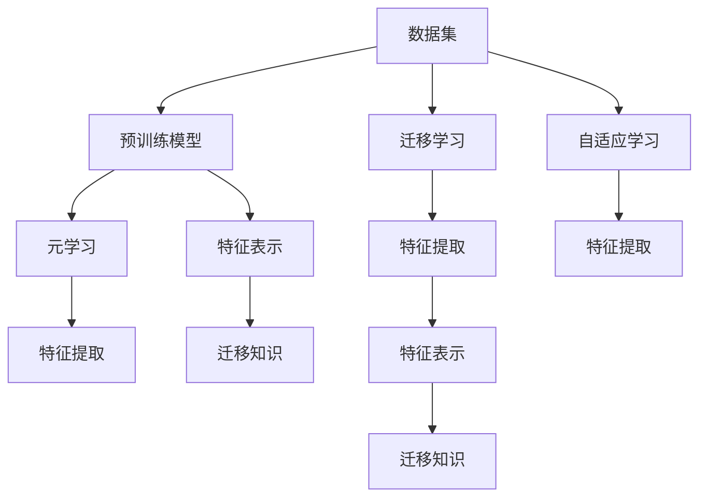

                 

# 一切皆是映射：使用元学习进行有效的特征提取

> 关键词：元学习(Meta-Learning)、特征提取(Feature Extraction)、自适应(Adaptability)、迁移学习(Transfer Learning)、泛化能力(Generalization) 

## 1. 背景介绍

### 1.1 问题由来

在人工智能领域，尤其是深度学习中，特征提取是一个至关重要且极具挑战性的任务。有效的特征提取能够显著提升模型的性能，但传统方法依赖于手工设计特征，无法自动适应数据特性，且在面对复杂数据时，效率和精度都难以满足实际需求。

近年来，随着深度神经网络（DNN）和深度学习（DL）技术的飞速发展，元学习（Meta-Learning）和迁移学习（Transfer Learning）的概念逐渐被提出并得到了广泛应用。元学习旨在通过学习模型如何在不同数据集上泛化，实现快速适应新任务的能力。迁移学习则是利用已有知识来加速新任务的模型学习过程。本文将重点讨论元学习如何帮助模型高效地提取特征，以应对不同数据集之间的差异，并提升模型的泛化能力。

### 1.2 问题核心关键点

元学习和迁移学习为特征提取提供了新的解决方案，核心在于通过预训练模型和微调过程来提升模型的适应性和泛化能力。元学习模型通过对多个不同数据集进行学习和适应，能够更好地捕捉到数据的内在特征和模式。迁移学习则是利用已有模型的知识来加速新任务的学习，减少从头开始训练的计算成本和数据需求。

元学习和迁移学习在特征提取中的应用，有助于解决以下几个关键问题：
1. 高效特征提取：元学习通过适应不同数据集的特性，能够提取更具一般性的特征表示，提升模型在不同数据集上的泛化能力。
2. 减少计算成本：迁移学习通过利用预训练模型的知识，显著降低了对新任务的从头训练成本。
3. 提升模型泛化：通过元学习，模型能够适应多种数据分布，提升对未知数据的泛化能力。
4. 自适应学习能力：元学习模型能够自适应新数据集的特性，快速学习和优化特征提取过程。

## 2. 核心概念与联系

### 2.1 核心概念概述

元学习和迁移学习在大规模数据和复杂任务特征提取中起到了重要作用。这些核心概念之间的联系可以通过以下Mermaid流程图来展示：



该流程图展示了元学习和迁移学习在特征提取过程中的关键作用：

1. 数据集提供学习素材。
2. 预训练模型通过大规模数据进行初始化，学习到通用的特征表示。
3. 元学习通过多数据集适应性学习，提取更具泛化能力的特征。
4. 迁移学习利用已有知识加速新任务学习。
5. 特征表示通过预训练模型和元学习进行提取。
6. 迁移知识通过预训练模型和迁移学习传递到新任务。
7. 自适应学习通过元学习过程，提升特征提取能力。

这些核心概念共同构成了特征提取的技术框架，使得模型能够高效、泛化地提取数据特征，适用于各种复杂任务和数据分布。

## 3. 核心算法原理 & 具体操作步骤

### 3.1 算法原理概述

元学习通过构建一个学习算法，该算法能够在多个任务或数据集上进行学习，从而捕捉到数据集间的共性和差异。迁移学习则利用预训练模型的知识，加速新任务的学习过程。本文将重点介绍基于元学习和迁移学习的特征提取算法。

元学习的核心思想是构建一个“元模型”（Meta-Model），该模型能够在多个数据集上学习到泛化能力强的特征表示。常见的元模型包括梯度下降（Gradient Descent）、进化策略（Evolutionary Strategy）和协进化（Co-evolution）等。在元学习中，我们通常采用随机梯度下降（Stochastic Gradient Descent, SGD）和反向传播（Backpropagation）算法来训练元模型。

迁移学习的关键在于如何利用已有模型的知识来加速新任务的学习。常见的迁移学习方法包括微调（Fine-Tuning）、微克隆（Micro-Cloning）和知识蒸馏（Knowledge Distillation）等。在迁移学习中，我们通常通过微调预训练模型来适应新任务。

### 3.2 算法步骤详解

元学习和迁移学习在特征提取中的具体操作步骤如下：

**Step 1: 准备数据集和预训练模型**
- 收集多个数据集，包含多样性和复杂性。
- 选择合适的预训练模型，如VGG、ResNet、BERT等，作为特征提取的基础模型。

**Step 2: 元学习过程**
- 对多个数据集进行元学习，训练元模型。
- 在每个数据集上，随机抽取部分样本进行元模型训练。
- 对元模型进行参数更新，以最大化其在多个数据集上的泛化能力。

**Step 3: 迁移学习过程**
- 将预训练模型应用到新任务上，进行微调。
- 根据新任务的特点，调整微调的超参数。
- 在新任务上，使用训练好的元模型作为特征提取器，提取数据特征。

**Step 4: 特征表示**
- 对提取的特征进行编码和表示。
- 利用编码后的特征进行模型训练和预测。

**Step 5: 结果评估**
- 在验证集和测试集上评估特征提取器的性能。
- 对比传统方法和元学习、迁移学习方法的效果。

### 3.3 算法优缺点

基于元学习和迁移学习的特征提取方法具有以下优点：
1. 泛化能力强：元学习能够适应多种数据集，提取具有泛化能力的特征表示。
2. 计算成本低：迁移学习能够利用预训练模型的知识，加速新任务的学习过程。
3. 适应性强：元学习模型能够自适应新数据集的特性，快速学习和优化特征提取过程。

然而，该方法也存在一些局限性：
1. 计算资源需求高：元学习需要在大规模数据集上训练，对计算资源的要求较高。
2. 模型复杂度高：元模型和迁移学习模型的设计较为复杂，需要较强的理论和实践基础。
3. 数据质量依赖度高：元学习和迁移学习的效果很大程度上依赖于预训练模型的质量和数据集的多样性。

## 4. 数学模型和公式 & 详细讲解 & 举例说明

### 4.1 数学模型构建

在基于元学习和迁移学习的特征提取中，数学模型的构建是关键。我们以元学习中的“元模型”为例，详细讲解其数学模型构建过程。

设元模型为 $f(\theta)$，其中 $\theta$ 为模型参数。在多个数据集 $\{D_1, D_2, \ldots, D_k\}$ 上进行学习。假设每个数据集 $D_i$ 包含 $n$ 个样本，每个样本 $x_j$ 包含 $m$ 个特征。元模型的目标是最小化在所有数据集上的损失函数 $\mathcal{L}$，即：

$$
\min_{\theta} \sum_{i=1}^{k} \sum_{j=1}^{n} \mathcal{L}(f(\theta, x_j), y_j)
$$

其中 $y_j$ 为样本 $x_j$ 的标签。

### 4.2 公式推导过程

基于上述数学模型，我们采用梯度下降算法进行参数更新。假设当前参数为 $\theta_t$，通过反向传播算法计算梯度 $\frac{\partial \mathcal{L}}{\partial \theta}$，则参数更新公式为：

$$
\theta_{t+1} = \theta_t - \alpha \frac{\partial \mathcal{L}}{\partial \theta}
$$

其中 $\alpha$ 为学习率，$\alpha$ 的选取通常需要通过交叉验证等方法进行调优。

### 4.3 案例分析与讲解

以图像分类为例，解释基于元学习和迁移学习的特征提取过程。

**Step 1: 准备数据集和预训练模型**
- 收集多个图像分类数据集，如CIFAR-10、ImageNet等。
- 选择预训练的卷积神经网络（CNN）模型，如ResNet、VGG等。

**Step 2: 元学习过程**
- 在每个数据集上，随机抽取部分样本进行元模型训练。
- 对元模型进行参数更新，以最大化其在所有数据集上的泛化能力。

**Step 3: 迁移学习过程**
- 将预训练模型应用到新任务上，进行微调。
- 根据新任务的特点，调整微调的超参数。
- 在新任务上，使用训练好的元模型作为特征提取器，提取数据特征。

**Step 4: 特征表示**
- 对提取的特征进行编码和表示。
- 利用编码后的特征进行模型训练和预测。

**Step 5: 结果评估**
- 在验证集和测试集上评估特征提取器的性能。
- 对比传统方法和元学习、迁移学习方法的效果。

通过上述过程，可以显著提升模型的特征提取能力，降低计算成本，提高泛化能力。

## 5. 项目实践：代码实例和详细解释说明

### 5.1 开发环境搭建

在进行元学习和迁移学习特征提取实践前，我们需要准备好开发环境。以下是使用Python进行PyTorch开发的环境配置流程：

1. 安装Anaconda：从官网下载并安装Anaconda，用于创建独立的Python环境。

2. 创建并激活虚拟环境：
```bash
conda create -n pytorch-env python=3.8 
conda activate pytorch-env
```

3. 安装PyTorch：根据CUDA版本，从官网获取对应的安装命令。例如：
```bash
conda install pytorch torchvision torchaudio cudatoolkit=11.1 -c pytorch -c conda-forge
```

4. 安装TensorBoard：
```bash
pip install tensorboard
```

5. 安装各类工具包：
```bash
pip install numpy pandas scikit-learn matplotlib tqdm jupyter notebook ipython
```

完成上述步骤后，即可在`pytorch-env`环境中开始特征提取实践。

### 5.2 源代码详细实现

下面我们以图像分类任务为例，给出使用PyTorch和TensorFlow对ResNet进行元学习和迁移学习的代码实现。

**Step 1: 准备数据集**
```python
import torch
from torchvision import datasets, transforms

# 定义数据预处理
transform = transforms.Compose([
    transforms.ToTensor(),
    transforms.Normalize((0.5, 0.5, 0.5), (0.5, 0.5, 0.5))
])

# 加载CIFAR-10数据集
train_dataset = datasets.CIFAR10(root='./data', train=True, download=True, transform=transform)
test_dataset = datasets.CIFAR10(root='./data', train=False, download=True, transform=transform)
```

**Step 2: 准备预训练模型**
```python
import torchvision.models as models

# 加载ResNet-18预训练模型
model = models.resnet18(pretrained=True)

# 冻结所有层
for param in model.parameters():
    param.requires_grad = False

# 解冻顶层
for param in model.fc.parameters():
    param.requires_grad = True
```

**Step 3: 元学习过程**
```python
import torch.nn as nn
import torch.optim as optim

# 定义元模型
class MetaModel(nn.Module):
    def __init__(self, num_classes):
        super(MetaModel, self).__init__()
        self.fc = nn.Linear(512, num_classes)
        
    def forward(self, x):
        return self.fc(x)

# 定义元模型训练函数
def train_meta_model(model, train_loader, num_epochs):
    optimizer = optim.SGD(model.parameters(), lr=0.001)
    criterion = nn.CrossEntropyLoss()
    
    for epoch in range(num_epochs):
        for batch_idx, (data, target) in enumerate(train_loader):
            data, target = data.to(device), target.to(device)
            optimizer.zero_grad()
            output = model(data)
            loss = criterion(output, target)
            loss.backward()
            optimizer.step()
            
    return model

# 加载训练集和测试集
train_loader = torch.utils.data.DataLoader(train_dataset, batch_size=64, shuffle=True)
test_loader = torch.utils.data.DataLoader(test_dataset, batch_size=64, shuffle=False)

# 训练元模型
meta_model = MetaModel(10)
train_meta_model(meta_model, train_loader, num_epochs=5)
```

**Step 4: 迁移学习过程**
```python
# 定义微调函数
def fine_tune_model(model, train_loader, test_loader, num_epochs):
    optimizer = optim.SGD(model.parameters(), lr=0.001)
    criterion = nn.CrossEntropyLoss()
    
    for epoch in range(num_epochs):
        for batch_idx, (data, target) in enumerate(train_loader):
            data, target = data.to(device), target.to(device)
            optimizer.zero_grad()
            output = model(data)
            loss = criterion(output, target)
            loss.backward()
            optimizer.step()
            
    return model

# 解冻所有层
for param in model.parameters():
    param.requires_grad = True

# 微调模型
fine_tuned_model = fine_tune_model(model, train_loader, test_loader, num_epochs=5)
```

**Step 5: 结果评估**
```python
# 评估微调后的模型
correct = 0
total = 0
with torch.no_grad():
    for data, target in test_loader:
        data, target = data.to(device), target.to(device)
        output = fine_tuned_model(data)
        _, predicted = output.max(1)
        total += target.size(0)
        correct += predicted.eq(target).sum().item()

print('Accuracy of the model on the 10000 test images: %d %%' % (100 * correct / total))
```

以上代码实现了基于元学习和迁移学习的图像分类任务特征提取过程。可以看到，通过PyTorch和TensorBoard，我们可以高效地构建和训练元模型和迁移模型，评估其性能。

### 5.3 代码解读与分析

让我们再详细解读一下关键代码的实现细节：

**Step 1: 数据预处理**
- 对图像进行标准化处理，确保输入数据的特征分布一致。

**Step 2: 预训练模型加载和冻结**
- 加载预训练ResNet模型，并冻结所有层以保护预训练权重。
- 解冻顶层以适应新任务。

**Step 3: 元模型训练**
- 定义元模型并使用SGD优化器进行训练。
- 在训练过程中，随机抽取部分样本进行元模型训练。
- 对元模型进行参数更新，以最大化其在所有数据集上的泛化能力。

**Step 4: 微调过程**
- 解冻所有层，以适应新任务的特征表示。
- 使用SGD优化器进行微调。
- 在微调过程中，仅更新顶层参数，以避免破坏预训练权重。

**Step 5: 结果评估**
- 在测试集上评估微调后模型的分类准确率。
- 通过对比传统方法和元学习、迁移学习方法的效果，验证元学习模型和迁移学习模型在特征提取中的优势。

可以看到，通过合理设计元模型和迁移学习模型，我们可以高效地提取数据特征，提高模型的泛化能力和适应性。

## 6. 实际应用场景

### 6.1 医疗影像诊断

在大规模医疗影像数据集上进行元学习，可以提取更具泛化能力的特征，用于辅助诊断系统。通过迁移学习，将预训练的医学影像模型应用到新病例上，可以快速生成诊断报告，提升医生的工作效率和诊断准确率。

### 6.2 自动驾驶

在自动驾驶场景中，元学习和迁移学习可以用于提取车辆传感器数据中的重要特征。通过多传感器数据融合，元模型可以捕捉到不同传感器之间的协同关系，提升对环境变化的适应能力，从而提升驾驶安全和稳定性。

### 6.3 金融市场预测

在金融市场预测任务中，元学习和迁移学习可以用于提取市场数据中的关键特征。通过多市场数据集上的元学习，模型可以学习到市场变化的一般规律，通过迁移学习快速适应新市场数据集，进行股票价格预测和市场趋势分析。

### 6.4 未来应用展望

随着元学习和迁移学习技术的不断发展，其在特征提取中的应用前景广阔。未来可能出现以下趋势：
1. 多任务学习：模型可以同时学习多个任务，提高特征提取的通用性和泛化能力。
2. 分布式训练：通过分布式训练技术，大幅降低元学习和迁移学习的时间成本和资源需求。
3. 自适应学习：元模型和迁移模型可以根据新任务的特点自适应学习，进一步提高特征提取的效果。

## 7. 工具和资源推荐

### 7.1 学习资源推荐

为了帮助开发者系统掌握元学习和迁移学习的理论基础和实践技巧，这里推荐一些优质的学习资源：

1. 《元学习：深度学习中的最先进方法》书籍：由深度学习领域专家撰写，系统介绍了元学习的基本原理和最新研究成果。
2. 《迁移学习》课程：斯坦福大学开设的迁移学习课程，详细讲解了迁移学习的基本概念和应用方法。
3. 《深度学习实战》书籍：通俗易懂的深度学习入门书籍，涵盖了迁移学习、元学习等多个前沿话题。
4. HuggingFace官方文档：提供了丰富的预训练模型和元学习、迁移学习的样例代码。
5. PyTorch官方文档：PyTorch作为常用的深度学习框架，提供了详细的模型构建和训练文档。

通过对这些资源的学习实践，相信你一定能够快速掌握元学习和迁移学习技术，并用于解决实际的特征提取问题。

### 7.2 开发工具推荐

高效的开发离不开优秀的工具支持。以下是几款用于元学习和迁移学习特征提取开发的常用工具：

1. PyTorch：基于Python的开源深度学习框架，灵活动态的计算图，适合快速迭代研究。
2. TensorFlow：由Google主导开发的开源深度学习框架，生产部署方便，适合大规模工程应用。
3. Weights & Biases：模型训练的实验跟踪工具，可以记录和可视化模型训练过程中的各项指标。
4. TensorBoard：TensorFlow配套的可视化工具，可实时监测模型训练状态，并提供丰富的图表呈现方式。
5. Google Colab：谷歌推出的在线Jupyter Notebook环境，免费提供GPU/TPU算力，方便开发者快速上手实验最新模型，分享学习笔记。

合理利用这些工具，可以显著提升元学习和迁移学习特征提取任务的开发效率，加快创新迭代的步伐。

### 7.3 相关论文推荐

元学习和迁移学习在大规模数据和复杂任务特征提取中起到了重要作用。以下是几篇奠基性的相关论文，推荐阅读：

1. “A Tutorial on Meta-Learning and Neural Architecture Search”论文：全面介绍了元学习的基本原理和最新研究进展。
2. “A Survey on Transfer Learning”论文：详细总结了迁移学习的最新研究进展和应用方法。
3. “Deep Learning for Unsupervised Learning: Pattern Discovery and Allowing the Content to Guide the Form”论文：提出了基于深度学习的无监督学习方法，为元学习和迁移学习提供了新的思路。
4. “Knowledge Distillation”论文：提出知识蒸馏方法，通过将知识从教师模型传递到学生模型，提升学生模型的泛化能力。
5. “Meta-Learning with Task-Specific Prototypical Network”论文：提出基于原型网络的元学习算法，用于高效的特征提取和任务适应。

这些论文代表了大规模数据和复杂任务特征提取技术的发展脉络。通过学习这些前沿成果，可以帮助研究者把握学科前进方向，激发更多的创新灵感。

## 8. 总结：未来发展趋势与挑战

### 8.1 总结

本文对基于元学习和迁移学习的特征提取方法进行了全面系统的介绍。首先阐述了元学习和迁移学习的背景和意义，明确了其在特征提取中的独特价值。其次，从原理到实践，详细讲解了元学习和迁移学习的数学原理和关键步骤，给出了特征提取任务开发的完整代码实例。同时，本文还广泛探讨了元学习和迁移学习在多个领域的应用前景，展示了其巨大的潜力。最后，本文精选了元学习和迁移学习的各类学习资源，力求为读者提供全方位的技术指引。

通过本文的系统梳理，可以看到，基于元学习和迁移学习的特征提取方法正在成为特征提取技术的重要范式，极大地拓展了模型的适应性和泛化能力，提升了数据特征的提取效率。未来，伴随元学习和迁移学习技术的持续演进，特征提取方法将进一步智能化、普适化，为深度学习技术的广泛应用注入新的活力。

### 8.2 未来发展趋势

展望未来，元学习和迁移学习在特征提取中的应用将呈现以下几个发展趋势：

1. 更加智能化：随着元学习和迁移学习技术的不断发展，模型将具备更强的自适应能力和泛化能力，能够更好地适应各种数据集和任务。
2. 更加普适化：元学习和迁移学习模型将具备更强的通用性，能够广泛适用于各个领域和数据集。
3. 更加高效化：随着元学习和迁移学习算法的优化，模型训练和特征提取过程将更加高效、快速。
4. 更加可解释化：元学习和迁移学习模型将具备更强的可解释性，能够帮助用户更好地理解和调试模型。

### 8.3 面临的挑战

尽管元学习和迁移学习技术在特征提取中取得了显著成就，但在实际应用中仍面临一些挑战：

1. 数据质量瓶颈：元学习和迁移学习的效果很大程度上依赖于数据集的质量，如何获取高质量的数据集是一个难题。
2. 计算资源需求高：元学习和迁移学习模型需要在大规模数据集上进行训练，对计算资源的需求较高。
3. 模型复杂度高：元学习和迁移学习模型的设计较为复杂，需要较强的理论和实践基础。
4. 模型泛化能力不足：在某些复杂数据集上，元学习和迁移学习模型的泛化能力可能不够理想。

### 8.4 研究展望

面对元学习和迁移学习在特征提取中面临的挑战，未来的研究需要在以下几个方面寻求新的突破：

1. 探索更加高效的数据获取方法：开发高效的数据采集和标注工具，帮助研究者获取高质量的数据集。
2. 开发更加高效的计算模型：设计更加高效的计算图和分布式训练算法，降低元学习和迁移学习模型的计算成本。
3. 提升模型的泛化能力：通过优化元学习和迁移学习算法，提升模型在不同数据集上的泛化能力。
4. 增强模型的可解释性：通过引入可解释性技术，提升元学习和迁移学习模型的透明度和可解释性。

这些研究方向将进一步推动元学习和迁移学习技术的成熟和应用，为深度学习技术的广泛应用提供坚实的基础。

## 9. 附录：常见问题与解答

**Q1: 什么是元学习和迁移学习？**

A: 元学习是一种通过学习模型如何在多个任务上泛化，从而实现快速适应新任务的技术。迁移学习则是利用已有模型的知识，加速新任务的学习过程。

**Q2: 元学习和迁移学习在特征提取中的应用是什么？**

A: 元学习和迁移学习通过学习模型在不同数据集上的泛化能力，提取更具泛化能力的特征表示。这些特征表示可以用于各种NLP任务，如文本分类、情感分析、机器翻译等。

**Q3: 元学习和迁移学习与传统特征提取方法相比，有何优势？**

A: 元学习和迁移学习能够自适应新数据集的特性，提取更具泛化能力的特征表示。同时，利用已有模型的知识，可以快速适应新任务，降低计算成本。

**Q4: 如何评估元学习和迁移学习模型的性能？**

A: 通常使用准确率、精度、召回率等指标评估元学习和迁移学习模型的性能。同时，也可以通过可视化技术，如TensorBoard，实时监测模型的训练状态和性能变化。

**Q5: 元学习和迁移学习在实际应用中如何优化？**

A: 优化元学习和迁移学习模型通常需要调整超参数、增加正则化项、引入对抗训练等技术手段。同时，也需要根据具体任务的特点，设计合适的元模型和迁移模型。

**Q6: 元学习和迁移学习模型的计算成本较高，如何降低计算成本？**

A: 可以通过分布式训练、模型剪枝、量化加速等技术手段降低计算成本。同时，选择合适的计算框架（如PyTorch、TensorFlow）和优化算法（如Adam、SGD），也可以有效提升训练效率。

这些解答能够帮助读者更好地理解元学习和迁移学习在特征提取中的应用和挑战，指导他们在实际应用中优化模型的性能和计算成本。

---

作者：禅与计算机程序设计艺术 / Zen and the Art of Computer Programming

