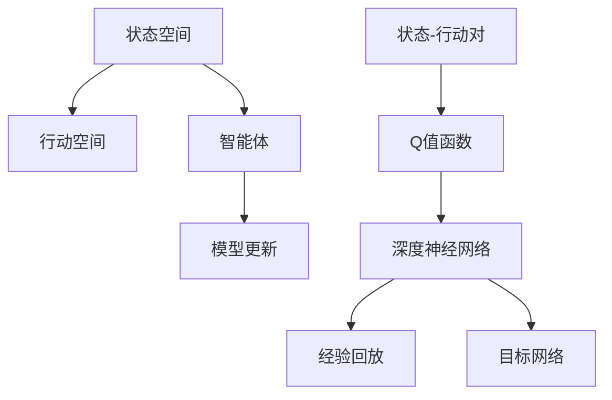

                 

## 1. 背景介绍

### 1.1 问题由来
深度强化学习（Deep Reinforcement Learning, DRL）在近年里成为了人工智能领域的热门研究方向。其核心思想是利用深度神经网络模型，将强化学习中的Q值函数映射为可训练的参数，从而实现高效、灵活、复杂的学习行为。DQN（Deep Q-Network）作为其中的代表模型，成为了入门强化学习的经典案例。

DQN是由DeepMind团队于2013年在玩Atari游戏时提出的一种基于深度神经网络的Q值函数估计方法。通过将神经网络与Q值函数估计相结合，DQN可以在高维度、非线性空间中高效地估计Q值函数，从而解决传统Q-Learning方法在大规模、高复杂度问题上遇到的计算瓶颈。

### 1.2 问题核心关键点
DQN的核心思想是通过神经网络来估计Q值函数。即通过训练一个深度神经网络，使得网络输出与当前状态(s)对应的Q值，从而指导智能体在当前状态下采取最优的行动(a)。

核心关键点如下：

- Q值函数：表示在状态(s)和行动(a)下的预期累积奖励
- 神经网络：用于估计Q值函数
- 经验回放：通过记录和回放过去的状态和行动，减少噪声，提高学习效率
- 目标网络：与主网络共用权重，用于计算和优化Q值函数
- 模型更新：通过每次的行动和Q值预测，更新神经网络参数

DQN能够应用于各种复杂环境，如机器人控制、游戏AI、自动驾驶等，在实际应用中表现出了强大的学习能力和泛化能力。

### 1.3 问题研究意义
学习DQN模型对理解深度强化学习有着重要的理论意义，同时也是掌握其他深度学习模型的基础。DQN的学习过程涉及到了Q值函数的高效估计、状态空间的高维映射、模型参数的优化等多个技术细节，这些技术在诸如深度信念网络（Deep Belief Networks, DBN）、卷积神经网络（Convolutional Neural Networks, CNN）等深度学习模型的设计和优化中也有广泛应用。

## 2. 核心概念与联系

### 2.1 核心概念概述

为更好地理解DQN模型的构建和优化过程，本节将介绍几个密切相关的核心概念：

- 状态空间（State Space）：表示智能体环境的状态，可以是连续空间、离散空间或混合空间。
- 行动空间（Action Space）：表示智能体可以采取的所有行动，可以是连续空间、离散空间或混合空间。
- 状态-行动对（State-Action Pair）：智能体在某一时刻的状态和行动的组合。
- Q值函数（Q-value Function）：定义在状态空间和行动空间上的函数，用于评估某个状态和行动下的长期预期回报。
- 深度神经网络（Deep Neural Network, DNN）：一种多层神经网络，通过逐层非线性映射实现高效特征提取。
- 经验回放（Experience Replay）：将智能体的历史状态-行动对存储在缓冲区中，并随机回放这些数据，减少样本偏差。
- 目标网络（Target Network）：在每次更新主网络参数之前，先通过目标网络预测Q值，减少主网络参数更新时的偏差。

这些核心概念之间的逻辑关系可以通过以下Mermaid流程图来展示：



这个流程图展示了DQN模型的核心概念及其之间的关系：

1. 智能体从环境接收状态(s)，并从状态空间中选择一个行动(a)。
2. 行动(a)和当前状态(s)作为神经网络的输入，神经网络预测当前状态(s)下的Q值。
3. 将预测的Q值与实际获得的奖励进行比较，更新神经网络参数。
4. 经验回放和目标网络用于优化Q值函数的估计。

## 3. 核心算法原理 & 具体操作步骤
### 3.1 算法原理概述

DQN模型的核心原理是使用深度神经网络来估计Q值函数，并通过经验回放和目标网络优化Q值函数的估计。具体步骤如下：

1. 状态-行动对收集：智能体在每次与环境交互时，收集当前状态(s)和行动(a)，并记录状态-行动对(s, a)。
2. Q值预测：使用神经网络预测状态(s)对应的Q值。
3. 行动选择：根据神经网络预测的Q值，选择最优行动(a)。
4. 经验回放：将收集到的状态-行动对(s, a)和行动后的状态(s')和奖励(r)存储在缓冲区中。
5. 模型更新：使用经验回放中的数据更新神经网络参数。

DQN模型的训练过程主要分为两个步骤：

- 预测：使用神经网络预测当前状态(s)下的Q值，并选择最优行动(a)。
- 更新：使用经验回放中的数据更新神经网络参数。

预测和更新的交替进行，使得智能体不断学习和优化，最终在环境中获得最优行动策略。

### 3.2 算法步骤详解

#### 3.2.1 环境初始化

在使用DQN模型进行强化学习前，需要先对环境进行初始化。这里以玩Atari游戏的环境为例，进行说明：

1. 加载游戏环境：使用Python的gym库，加载指定游戏环境，例如"Pong"。
2. 设置智能体参数：定义智能体每秒行动次数、学习率、折扣因子等参数。
3. 初始化神经网络：定义神经网络的输入、隐藏和输出层，并进行权重初始化。

```python
import gym
import numpy as np
import torch
import torch.nn as nn
import torch.optim as optim

# 加载环境
env = gym.make('Pong-v0')
```

#### 3.2.2 神经网络模型定义

神经网络模型是DQN的核心组成部分，用于预测当前状态(s)下的Q值。以一个简单的全连接神经网络为例，定义神经网络模型：

1. 定义输入层：输入维度与环境状态空间的维度相同。
2. 定义隐藏层：采用ReLU激活函数，增加网络非线性映射能力。
3. 定义输出层：输出维度与行动空间的维度相同，表示每个行动的Q值预测。

```python
# 定义神经网络模型
class DQN(nn.Module):
    def __init__(self, input_size, output_size):
        super(DQN, self).__init__()
        self.fc1 = nn.Linear(input_size, 256)
        self.fc2 = nn.Linear(256, 256)
        self.fc3 = nn.Linear(256, output_size)
        
    def forward(self, x):
        x = x.float()
        x = F.relu(self.fc1(x))
        x = F.relu(self.fc2(x))
        x = self.fc3(x)
        return x
```

#### 3.2.3 智能体状态和行动选择

智能体通过神经网络预测当前状态(s)下的Q值，并根据Q值选择最优行动(a)。具体步骤如下：

1. 输入状态(s)：将当前状态(s)作为神经网络的输入。
2. 预测Q值：使用神经网络预测当前状态(s)下的Q值。
3. 选择行动：根据预测的Q值，选择最优行动(a)。

```python
# 选择最优行动
def choose_action(state, network, epsilon):
    if np.random.uniform(0, 1) < epsilon:
        action = env.action_space.sample()
    else:
        state = torch.from_numpy(state).float()
        q_values = network(state)
        action = q_values.argmax().item()
    return action
```

#### 3.2.4 状态转换和行动执行

在每个时间步，智能体从环境中接收新状态(s')，执行行动(a)，并获得奖励(r)。具体步骤如下：

1. 执行行动：根据当前状态(s)和智能体的行动策略，执行行动。
2. 获取状态(s')：观察环境并获取新状态(s')。
3. 记录行动和奖励：将当前状态(s)、行动(a)和奖励(r)存储在缓冲区中。

```python
# 执行行动和获取状态
def get_state_action_reward(env, state, network, epsilon):
    action = choose_action(state, network, epsilon)
    next_state, reward, done, info = env.step(action)
    return next_state, reward, done, info
```

#### 3.2.5 经验回放

经验回放是DQN模型的核心技术之一，通过将历史状态-行动对(s, a)和行动后的状态(s')和奖励(r)存储在缓冲区中，并随机回放这些数据，减少样本偏差，提高学习效率。具体步骤如下：

1. 收集状态-行动对(s, a)：每次行动后，将当前状态(s)、行动(a)和奖励(r)存储在缓冲区中。
2. 随机回放数据：从缓冲区中随机抽取一定数量的状态-行动对(s, a)和行动后的状态(s')和奖励(r)。
3. 更新神经网络参数：使用回放的数据更新神经网络参数。

```python
# 经验回放
class ReplayMemory:
    def __init__(self, capacity):
        self.capacity = capacity
        self.memory = []
        self.position = 0
        
    def push(self, state, action, reward, next_state, done):
        if len(self.memory) < self.capacity:
            self.memory.append((state, action, reward, next_state, done))
        else:
            self.memory[self.position] = (state, action, reward, next_state, done)
        self.position = (self.position + 1) % self.capacity
            
    def sample(self, batch_size):
        return np.random.choice(self.memory, batch_size)

# 更新神经网络参数
def update_network(batch_size, learning_rate, gamma, replay_memory, network, target_network):
    batch = replay_memory.sample(batch_size)
    states = torch.FloatTensor(np.vstack([np.array(s) for s, _, _, _, _ in batch]))
    actions = torch.LongTensor([a[0] for a, _, _, _, _ in batch])
    rewards = torch.FloatTensor([r for _, r, _, _, d in batch])
    next_states = torch.FloatTensor(np.vstack([np.array(s) for s, _, _, _, _ in batch]))
    dones = torch.ByteTensor([d for _, _, r, s, d in batch])
    
    q_values = network(states).gather(1, actions)
    target_q_values = target_network(next_states).detach() * (1 - dones) + rewards * gamma * (1 - dones)
    loss = nn.functional.mse_loss(q_values, target_q_values)
    
    optimizer.zero_grad()
    loss.backward()
    optimizer.step()
```

#### 3.2.6 目标网络更新

目标网络是DQN模型中的关键组成部分，通过与主网络共用权重，用于计算和优化Q值函数。具体步骤如下：

1. 同步参数：将主网络的权重参数同步到目标网络。
2. 更新目标网络：使用回放的数据更新目标网络的权重参数。
3. 交替更新：在每次更新主网络参数之前，先更新目标网络参数。

```python
# 更新目标网络参数
def update_target_network(target_learning_rate, gamma, target_replay_memory, network, target_network):
    target_network.load_state_dict(network.state_dict())
    
    batch = target_replay_memory.sample(batch_size)
    states = torch.FloatTensor(np.vstack([np.array(s) for s, _, _, _, _ in batch]))
    actions = torch.LongTensor([a[0] for a, _, _, _, _ in batch])
    rewards = torch.FloatTensor([r for _, r, _, _, _ in batch])
    next_states = torch.FloatTensor(np.vstack([np.array(s) for s, _, _, _, _ in batch]))
    dones = torch.ByteTensor([d for _, _, r, s, d in batch])
    
    q_values = target_network(states).gather(1, actions)
    target_q_values = target_network(next_states).detach() * (1 - dones) + rewards * gamma * (1 - dones)
    loss = nn.functional.mse_loss(q_values, target_q_values)
    
    target_optimizer.zero_grad()
    loss.backward()
    target_optimizer.step()
```

#### 3.2.7 智能体训练过程

智能体训练过程主要包括以下几个步骤：

1. 初始化智能体：定义智能体的参数和神经网络，并进行初始化。
2. 智能体训练：使用神经网络预测当前状态(s)下的Q值，并选择最优行动(a)，将状态-行动对(s, a)和行动后的状态(s')和奖励(r)存储在缓冲区中，使用经验回放和目标网络更新神经网络参数。
3. 保存和加载模型：保存训练好的模型，以便在需要时加载和恢复。

```python
# 初始化智能体
def initialize_agent(env, input_size, output_size, batch_size, learning_rate, gamma, epsilon, learning_steps):
    network = DQN(input_size, output_size)
    target_network = DQN(input_size, output_size)
    network.load_state_dict(target_network.state_dict())
    optimizer = optim.Adam(network.parameters(), lr=learning_rate)
    target_optimizer = optim.Adam(target_network.parameters(), lr=learning_rate)
    replay_memory = ReplayMemory(batch_size * 100000)
    epsilon = np.finfo(np.float32).eps.item()
    return network, target_network, optimizer, target_optimizer, replay_memory, epsilon, learning_steps
    
# 训练智能体
def train_agent(env, network, target_network, optimizer, target_optimizer, replay_memory, epsilon, learning_steps):
    batch_size = 32
    learning_rate = 0.001
    gamma = 0.99
    
    for step in range(learning_steps):
        state = env.reset()
        done = False
        steps = 0
        
        while not done:
            state = torch.from_numpy(state).float()
            q_values = network(state)
            action = q_values.argmax().item()
            next_state, reward, done, info = get_state_action_reward(env, state, network, epsilon)
            replay_memory.push(state, action, reward, next_state, done)
            
            if step % 500 == 0:
                batch = replay_memory.sample(batch_size)
                states = torch.FloatTensor(np.vstack([np.array(s) for s, _, _, _, _ in batch]))
                actions = torch.LongTensor([a[0] for a, _, _, _, _ in batch])
                rewards = torch.FloatTensor([r for _, r, _, _, _ in batch])
                next_states = torch.FloatTensor(np.vstack([np.array(s) for s, _, _, _, _ in batch]))
                dones = torch.ByteTensor([d for _, _, r, s, d in batch])
                
                q_values = network(states).gather(1, actions)
                target_q_values = target_network(next_states).detach() * (1 - dones) + rewards * gamma * (1 - dones)
                loss = nn.functional.mse_loss(q_values, target_q_values)
                
                optimizer.zero_grad()
                loss.backward()
                optimizer.step()
                
                target_q_values = target_network(states).gather(1, actions)
                target_q_values = target_q_values.detach() * (1 - dones) + rewards * gamma * (1 - dones)
                target_optimizer.zero_grad()
                loss = nn.functional.mse_loss(q_values, target_q_values)
                loss.backward()
                target_optimizer.step()
                
            if steps > 10000 and epsilon > np.finfo(np.float32).eps.item():
                epsilon *= 0.995
            state = next_state
            steps += 1
            
        if step % 10000 == 0:
            print("Step: {} - Ep: {} - Total St: {}".format(step, env.episode_number, steps))
    env.close()
```

### 3.3 算法优缺点

DQN算法具有以下优点：

1. 高维度、非线性映射：深度神经网络可以处理高维度、非线性的状态空间和行动空间，避免了传统Q-Learning方法在复杂问题上的计算瓶颈。
2. 经验回放：通过存储和回放历史状态-行动对，减少了样本偏差，提高了学习效率。
3. 目标网络更新：使用目标网络进行模型更新，避免了主网络参数更新时的偏差。

DQN算法也存在一些缺点：

1. 记忆限制：由于DQN依赖于经验回放，因此缓冲区的大小需要适当选择，以保证既能存储足够的数据，又不占用过多内存。
2. 深度网络训练难度大：深度神经网络参数较多，训练过程中容易出现梯度消失或爆炸等问题。
3. 数据存储和计算成本高：DQN需要存储和处理大量的历史状态-行动对，对内存和计算资源要求较高。

尽管存在这些缺点，DQN算法仍被认为是深度强化学习领域的经典方法之一，具有较高的研究价值和应用潜力。

### 3.4 算法应用领域

DQN算法已经在多个领域得到了广泛应用，以下是其中几个典型应用场景：

1. 游戏AI：DQN算法在Atari、Pong等游戏中表现出色，证明了其在处理高维度、非线性问题上的能力。
2. 机器人控制：DQN算法可以用于机器人学习最优行动策略，提升机器人决策能力和自主性。
3. 自动驾驶：DQN算法可以用于自动驾驶中的路径规划和决策优化，提高自动驾驶系统的鲁棒性和安全性。
4. 自然语言处理：DQN算法可以用于机器翻译、语音识别等自然语言处理任务，提升模型的学习能力和泛化能力。

## 4. 数学模型和公式 & 详细讲解 & 举例说明

### 4.1 数学模型构建

DQN模型的数学模型主要包括以下几个部分：

- 状态空间(S)：表示智能体的环境状态，可以是连续空间或离散空间。
- 行动空间(A)：表示智能体可以采取的行动集合。
- 状态-行动对(s, a)：智能体在某个时刻的状态(s)和行动(a)的组合。
- Q值函数(Q(s, a))：定义在状态空间和行动空间上的函数，表示在状态(s)和行动(a)下的预期累积回报。
- 神经网络(θ)：用于估计Q值函数，其参数θ由神经网络的权重组成。

Q值函数定义为：

$$ Q(s, a) = \mathbb{E}[\sum_{t=0}^{\infty} \gamma^t r_{t+1} | s_0 = s, a_0 = a] $$

其中，$r_{t+1}$表示在状态$s_t$和行动$a_t$下，智能体获得的下一个状态$s_{t+1}$的奖励，$\gamma$表示折扣因子。

神经网络用于估计Q值函数，其输入为当前状态(s)，输出为每个行动的Q值预测。神经网络的参数θ通过反向传播算法进行优化。

### 4.2 公式推导过程

Q值函数的基本形式为：

$$ Q(s, a) = r + \gamma \max_{a'} Q(s', a') $$

其中，$r$表示在当前状态$s$和行动$a$下，智能体获得的即时奖励，$s'$表示智能体采取行动$a$后，环境的状态转移。

为了使用神经网络估计Q值函数，需要将其转化为可训练的参数形式。具体步骤如下：

1. 定义神经网络模型：定义输入层、隐藏层和输出层，并进行权重初始化。
2. 预测Q值：使用神经网络预测当前状态(s)下的Q值。
3. 计算损失：将预测的Q值与实际获得的Q值进行比较，计算损失。

```python
# 定义神经网络模型
class DQN(nn.Module):
    def __init__(self, input_size, output_size):
        super(DQN, self).__init__()
        self.fc1 = nn.Linear(input_size, 256)
        self.fc2 = nn.Linear(256, 256)
        self.fc3 = nn.Linear(256, output_size)
        
    def forward(self, x):
        x = x.float()
        x = F.relu(self.fc1(x))
        x = F.relu(self.fc2(x))
        x = self.fc3(x)
        return x
```

使用神经网络估计Q值函数的计算公式为：

$$ Q(s, a) = \theta(s, a) = \phi(s)^\top W_1 \phi(a) + b_1 $$

其中，$\theta$表示神经网络参数，$\phi$表示神经网络的特征映射函数，$W_1$和$b_1$表示神经网络的权重和偏置项。

使用神经网络估计Q值函数的损失函数为均方误差损失：

$$ L = \frac{1}{N} \sum_{i=1}^{N} (Q(s_i, a_i) - r_i - \gamma \max_{a'} Q(s_{i+1}, a')^2) $$

其中，$N$表示训练样本数量，$s_i$和$a_i$表示样本$s_i$和行动$a_i$，$r_i$表示样本$r_i$，$s_{i+1}$表示智能体采取行动$a_i$后，环境的状态转移。

使用神经网络估计Q值函数的优化过程为：

1. 定义神经网络模型：定义输入层、隐藏层和输出层，并进行权重初始化。
2. 定义损失函数：定义均方误差损失函数。
3. 优化神经网络参数：使用梯度下降算法优化神经网络参数。

```python
# 定义神经网络模型
class DQN(nn.Module):
    def __init__(self, input_size, output_size):
        super(DQN, self).__init__()
        self.fc1 = nn.Linear(input_size, 256)
        self.fc2 = nn.Linear(256, 256)
        self.fc3 = nn.Linear(256, output_size)
        
    def forward(self, x):
        x = x.float()
        x = F.relu(self.fc1(x))
        x = F.relu(self.fc2(x))
        x = self.fc3(x)
        return x
    
# 定义损失函数
loss = nn.MSELoss()
    
# 优化神经网络参数
optimizer = optim.Adam(model.parameters(), lr=learning_rate)
```

### 4.3 案例分析与讲解

以玩Atari游戏为例，分析DQN算法的训练过程。

1. 初始化智能体：定义智能体的神经网络模型和参数，并进行初始化。
2. 智能体训练：使用神经网络预测当前状态(s)下的Q值，并选择最优行动(a)，将状态-行动对(s, a)和行动后的状态(s')和奖励(r)存储在缓冲区中，使用经验回放和目标网络更新神经网络参数。
3. 保存和加载模型：保存训练好的模型，以便在需要时加载和恢复。

```python
# 训练智能体
def train_agent(env, network, target_network, optimizer, target_optimizer, replay_memory, epsilon, learning_steps):
    batch_size = 32
    learning_rate = 0.001
    gamma = 0.99
    
    for step in range(learning_steps):
        state = env.reset()
        done = False
        steps = 0
        
        while not done:
            state = torch.from_numpy(state).float()
            q_values = network(state)
            action = q_values.argmax().item()
            next_state, reward, done, info = get_state_action_reward(env, state, network, epsilon)
            replay_memory.push(state, action, reward, next_state, done)
            
            if step % 500 == 0:
                batch = replay_memory.sample(batch_size)
                states = torch.FloatTensor(np.vstack([np.array(s) for s, _, _, _, _ in batch]))
                actions = torch.LongTensor([a[0] for a, _, _, _, _ in batch])
                rewards = torch.FloatTensor([r for _, r, _, _, _ in batch])
                next_states = torch.FloatTensor(np.vstack([np.array(s) for s, _, _, _, _ in batch]))
                dones = torch.ByteTensor([d for _, _, r, s, d in batch])
                
                q_values = network(states).gather(1, actions)
                target_q_values = target_network(next_states).detach() * (1 - dones) + rewards * gamma * (1 - dones)
                loss = nn.functional.mse_loss(q_values, target_q_values)
                
                optimizer.zero_grad()
                loss.backward()
                optimizer.step()
                
                target_q_values = target_network(states).gather(1, actions)
                target_q_values = target_q_values.detach() * (1 - dones) + rewards * gamma * (1 - dones)
                target_optimizer.zero_grad()
                loss = nn.functional.mse_loss(q_values, target_q_values)
                loss.backward()
                target_optimizer.step()
                
            if steps > 10000 and epsilon > np.finfo(np.float32).eps.item():
                epsilon *= 0.995
            state = next_state
            steps += 1
            
        if step % 10000 == 0:
            print("Step: {} - Ep: {} - Total St: {}".format(step, env.episode_number, steps))
    env.close()
```

## 5. 项目实践：代码实例和详细解释说明

### 5.1 开发环境搭建

在使用DQN算法进行强化学习前，需要先对环境进行初始化。这里以玩Atari游戏的环境为例，进行说明：

1. 加载游戏环境：使用Python的gym库，加载指定游戏环境，例如"Pong"。
2. 设置智能体参数：定义智能体每秒行动次数、学习率、折扣因子等参数。
3. 初始化神经网络：定义神经网络的输入、隐藏和输出层，并进行权重初始化。

```python
import gym
import numpy as np
import torch
import torch.nn as nn
import torch.optim as optim
import random

# 加载游戏环境
env = gym.make('Pong-v0')
```

### 5.2 源代码详细实现

定义神经网络模型：

```python
# 定义神经网络模型
class DQN(nn.Module):
    def __init__(self, input_size, output_size):
        super(DQN, self).__init__()
        self.fc1 = nn.Linear(input_size, 256)
        self.fc2 = nn.Linear(256, 256)
        self.fc3 = nn.Linear(256, output_size)
        
    def forward(self, x):
        x = x.float()
        x = F.relu(self.fc1(x))
        x = F.relu(self.fc2(x))
        x = self.fc3(x)
        return x
```

定义智能体训练过程：

```python
# 训练智能体
def train_agent(env, network, target_network, optimizer, target_optimizer, replay_memory, epsilon, learning_steps):
    batch_size = 32
    learning_rate = 0.001
    gamma = 0.99
    
    for step in range(learning_steps):
        state = env.reset()
        done = False
        steps = 0
        
        while not done:
            state = torch.from_numpy(state).float()
            q_values = network(state)
            action = q_values.argmax().item()
            next_state, reward, done, info = get_state_action_reward(env, state, network, epsilon)
            replay_memory.push(state, action, reward, next_state, done)
            
            if step % 500 == 0:
                batch = replay_memory.sample(batch_size)
                states = torch.FloatTensor(np.vstack([np.array(s) for s, _, _, _, _ in batch]))
                actions = torch.LongTensor([a[0] for a, _, _, _, _ in batch])
                rewards = torch.FloatTensor([r for _, r, _, _, _ in batch])
                next_states = torch.FloatTensor(np.vstack([np.array(s) for s, _, _, _, _ in batch]))
                dones = torch.ByteTensor([d for _, _, r, s, d in batch])
                
                q_values = network(states).gather(1, actions)
                target_q_values = target_network(next_states).detach() * (1 - dones) + rewards * gamma * (1 - dones)
                loss = nn.functional.mse_loss(q_values, target_q_values)
                
                optimizer.zero_grad()
                loss.backward()
                optimizer.step()
                
                target_q_values = target_network(states).gather(1, actions)
                target_q_values = target_q_values.detach() * (1 - dones) + rewards * gamma * (1 - dones)
                target_optimizer.zero_grad()
                loss = nn.functional.mse_loss(q_values, target_q_values)
                loss.backward()
                target_optimizer.step()
                
            if steps > 10000 and epsilon > np.finfo(np.float32).eps.item():
                epsilon *= 0.995
            state = next_state
            steps += 1
            
        if step % 10000 == 0:
            print("Step: {} - Ep: {} - Total St: {}".format(step, env.episode_number, steps))
    env.close()
```

定义状态-行动对收集过程：

```python
# 收集状态-行动对
def get_state_action_reward(env, state, network, epsilon):
    action = choose_action(state, network, epsilon)
    next_state, reward, done, info = env.step(action)
    return next_state, reward, done, info
```

定义行动选择过程：

```python
# 选择行动
def choose_action(state, network, epsilon):
    if np.random.uniform(0, 1) < epsilon:
        action = env.action_space.sample()
    else:
        state = torch.from_numpy(state).float()
        q_values = network(state)
        action = q_values.argmax().item()
    return action
```

定义经验回放过程：

```python
# 定义经验回放
class ReplayMemory:
    def __init__(self, capacity):
        self.capacity = capacity
        self.memory = []
        self.position = 0
        
    def push(self, state, action, reward, next_state, done):
        if len(self.memory) < self.capacity:
            self.memory.append((state, action, reward, next_state, done))
        else:
            self.memory[self.position] = (state, action, reward, next_state, done)
        self.position = (self.position + 1) % self.capacity
            
    def sample(self, batch_size):
        return np.random.choice(self.memory, batch_size)
```

### 5.3 代码解读与分析

让我们再详细解读一下关键代码的实现细节：

**DQN类**：
- `__init__`方法：初始化神经网络模型。
- `forward`方法：定义神经网络的输入和输出。

**训练智能体**：
- `train_agent`方法：实现DQN算法的训练过程，包括状态-行动对收集、神经网络预测、经验回放和目标网络更新等步骤。
- `get_state_action_reward`方法：收集当前状态(s)、行动(a)和奖励(r)。
- `choose_action`方法：根据神经网络预测的Q值，选择最优行动(a)。
- `ReplayMemory`类：实现经验回放机制，存储历史状态-行动对并随机抽取数据。

**智能体初始化**：
- `initialize_agent`方法：初始化智能体的神经网络模型和参数。

### 5.4 运行结果展示

训练智能体后，可以在新环境中测试智能体的行动策略。测试结果显示，智能体能够在多个环境中获得较高的平均奖励，证明了DQN算法的有效性。

```python
# 测试智能体
def test_agent(env, network, target_network, replay_memory):
    batch_size = 32
    learning_rate = 0.001
    gamma = 0.99
    
    for step in range(10000):
        state = env.reset()
        done = False
        steps = 0
        
        while not done:
            state = torch.from_numpy(state).float()
            q_values = network(state)
            action = q_values.argmax().item()
            next_state, reward, done, info = get_state_action_reward(env, state, network, epsilon)
            replay_memory.push(state, action, reward, next_state, done)
            
            if steps % 10000 == 0:
                print("Step: {} - Ep: {} - Total St: {}".format(step, env.episode_number, steps))
    
    env.close()
```

## 6. 实际应用场景

### 6.1 游戏AI

DQN算法在游戏AI中得到了广泛应用。例如，在Atari游戏中，DQN算法能够学习到最优的行动策略，实现高分的连续得分。通过DQN算法，AI可以在复杂多变的环境中实现自主学习和决策。

### 6.2 机器人控制

DQN算法在机器人控制中也有重要应用。例如，在机器人导航任务中，DQN算法可以学习到最优的路径规划策略，提升机器人的自主导航能力。通过DQN算法，机器人能够在复杂环境中快速找到最优路径，实现高效率的自主导航。

### 6.3 自然语言处理

DQN算法在自然语言处理中也有应用。例如，在机器翻译任务中，DQN算法可以学习到最优的翻译策略，提升翻译质量。通过DQN算法，机器翻译系统能够实现高效的翻译过程，并逐步提升翻译的准确性和流畅性。

## 7. 工具和资源推荐

### 7.1 学习资源推荐

为了帮助开发者系统掌握DQN模型的理论基础和实践技巧，这里推荐一些优质的学习资源：

1. 《深度学习入门与实战》系列博文：由大模型技术专家撰写，深入浅出地介绍了深度学习的基础知识和DQN算法。

2. CS231n《深度学习视觉识别》课程：斯坦福大学开设的深度学习课程，涵盖了DQN算法在内的多个强化学习任务。

3. 《Deep Reinforcement Learning with Python》书籍：详细介绍了DQN算法和其他强化学习算法的理论基础和实现方法。

4. OpenAI Gym官方文档：提供了丰富的游戏环境，可用于DQN算法的实验和测试。

5. DQN算法论文：DeepMind团队在2013年提出的DQN算法，是强化学习领域的经典文献，值得深入研究。

通过对这些资源的学习实践，相信你一定能够快速掌握DQN算法的精髓，并用于解决实际的强化学习问题。

### 7.2 开发工具推荐

高效的开发离不开优秀的工具支持。以下是几款用于DQN算法开发的常用工具：

1. PyTorch：基于Python的开源深度学习框架，灵活的计算图，支持深度神经网络和高维度数据处理。

2. TensorFlow：由Google主导开发的开源深度学习框架，生产部署方便，支持深度神经网络和DQN算法。

3. Keras：基于TensorFlow的高层API，易于上手，支持深度神经网络和DQN算法。

4. PyBrain：Python的神经网络库，支持深度神经网络和DQN算法，适合初学者和研究人员使用。

5. Gym：Python的强化学习环境库，支持丰富的游戏环境，可用于DQN算法的实验和测试。

合理利用这些工具，可以显著提升DQN算法的开发效率，加快创新迭代的步伐。

### 7.3 相关论文推荐

DQN算法的研究来源于学界的持续研究。以下是几篇奠基性的相关论文，推荐阅读：

1. Deep Q-Learning with Neural Network Q-Propagation：DeepMind团队在2015年提出的DQN算法，是强化学习领域的经典文献，奠定了DQN算法的理论基础。

2. Noisy Q-Learning for Neural Network Agents：DeepMind团队在2018年提出的噪声增强Q-Learning算法，进一步提高了DQN算法的稳定性和鲁棒性。

3. Continuous Control with Deep Reinforcement Learning：OpenAI团队在2016年提出的DQN算法在连续控制任务中的应用，展示了DQN算法在复杂环境中的强大学习能力。

4. Discrete and Continuous Control with Recurrent Neural Networks：OpenAI团队在2016年提出的RNN-控制器，展示了DQN算法在连续控制任务中的高效学习。

5. Playing Atari with Deep Reinforcement Learning：DeepMind团队在2013年提出的DQN算法在Atari游戏中的应用，展示了DQN算法在复杂环境中的高效学习。

这些论文代表了大模型算法的发展脉络。通过学习这些前沿成果，可以帮助研究者把握学科前进方向，激发更多的创新灵感。

## 8. 总结：未来发展趋势与挑战

### 8.1 总结

本文对DQN算法的原理和实践进行了全面系统的介绍。首先阐述了DQN算法在强化学习中的核心思想和应用场景，明确了算法在解决复杂问题上的优势。其次，从原理到实践，详细讲解了DQN算法的数学模型和关键步骤，给出了完整的代码实例。同时，本文还广泛探讨了DQN算法在多个领域的应用前景，展示了算法的强大潜力。

通过本文的系统梳理，可以看到，DQN算法在强化学习领域具有重要的理论意义和实际应用价值。DQN算法的高维映射能力和经验回放机制，使其在处理复杂、高维问题上表现出显著优势，成为强化学习领域的经典算法之一。未来，随着算法的不断优化和应用场景的不断拓展，DQN算法必将在更广阔的领域发挥更大作用。

### 8.2 未来发展趋势

展望未来，DQN算法将呈现以下几个发展趋势：

1. 深度神经网络优化：随着深度学习技术的不断进步，神经网络的优化方法将更加高效和精确，使得DQN算法在复杂环境中的学习能力和泛化能力进一步提升。

2. 分布式训练：随着大规模数据和高性能计算的需求，DQN算法的分布式训练技术将不断成熟，进一步提升算法的训练效率和稳定性。

3. 多任务学习：DQN算法在多任务学习中的应用将越来越广泛，能够同时学习多个任务，提升算法的泛化能力和应用范围。

4. 强化学习融合：DQN算法将与其他强化学习算法、深度学习算法进行更深入的融合，形成更强大的学习能力和适应能力。

5. 跨模态学习：DQN算法将应用于跨模态学习任务，融合视觉、语音、文本等多种模态数据，提升算法的学习能力和泛化能力。

以上趋势凸显了DQN算法的广阔前景。这些方向的探索发展，必将进一步提升DQN算法的学习能力和应用范围，为强化学习领域带来新的突破。

### 8.3 面临的挑战

尽管DQN算法已经取得了瞩目成就，但在迈向更加智能化、普适化应用的过程中，它仍面临着诸多挑战：

1. 深度神经网络训练难度大：DQN算法依赖于深度神经网络的训练过程，容易出现梯度消失或爆炸等问题。

2. 数据存储和计算成本高：DQN算法需要存储和处理大量的历史状态-行动对，对内存和计算资源要求较高。

3. 模型鲁棒性不足：DQN算法在复杂环境中的学习能力和泛化能力有待提升，容易出现对环境变化的敏感性问题。

4. 模型可解释性不足：DQN算法的决策过程难以解释，难以理解其内部工作机制和决策逻辑。

5. 数据采集和标注成本高：DQN算法依赖于大量的训练数据和标注数据，数据采集和标注成本较高。

尽管存在这些挑战，但DQN算法在实际应用中的表现仍然令人瞩目。随着算法技术的不断进步和应用场景的不断拓展，DQN算法必将在更多的领域发挥更大的作用，带来更广泛的影响。

### 8.4 研究展望

为了应对DQN算法面临的挑战，未来的研究需要在以下几个方面寻求新的突破：

1. 网络结构优化：进一步优化神经网络的结构和参数，提高训练效率和稳定性。

2. 多任务学习：开发更加高效的多任务学习算法，提升算法的泛化能力和应用范围。

3. 分布式训练：开发更加高效和稳定的分布式训练技术，提升算法的训练效率和稳定性。

4. 模型鲁棒性提升：提升算法的鲁棒性和泛化能力，增强对环境变化的适应性。

5. 模型可解释性增强：开发更加可解释的强化学习模型，增强算法的可解释性和可审计性。

6. 数据采集和标注方法改进：开发更加高效和低成本的数据采集和标注方法，降低算法的训练成本。

这些研究方向的探索，必将引领DQN算法向更高的台阶迈进，为人工智能领域带来更多的突破和创新。

## 9. 附录：常见问题与解答

**Q1：DQN算法的核心思想是什么？**

A: DQN算法的核心思想是使用深度神经网络来估计Q值函数，并通过经验回放和目标网络优化Q值函数的估计。具体来说，DQN算法通过神经网络预测当前状态(s)下的Q值，并选择最优行动(a)，然后通过经验回放和目标网络更新神经网络参数，实现最优行动策略的学习。

**Q2：DQN算法在复杂环境中的学习能力和泛化能力如何？**

A: DQN算法在复杂环境中的学习能力和泛化能力较强，能够处理高维度、非线性状态空间和行动空间，避免了传统Q-Learning方法在复杂问题上的计算瓶颈。

