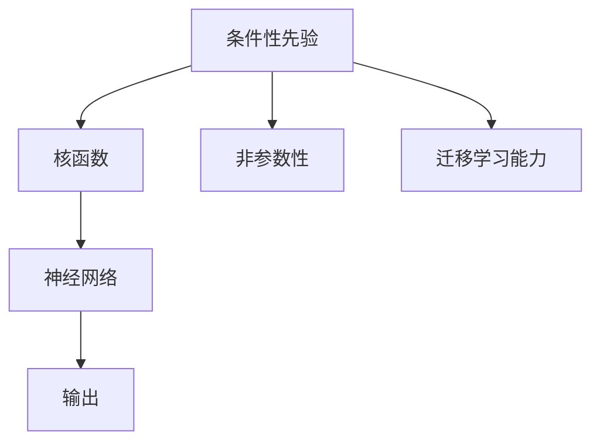

                 

# 一切皆是映射：深入剖析条件神经过程（CNPs）

在人工智能的世界里，神经网络（Neural Networks）成为了构建复杂模型和解决各类问题的核心工具。而条件神经过程（Conditional Neural Processes, CNPs）作为神经网络的一个变种，其独特的结构和性质，让它在建模条件性任务上展现出强大的潜力。本文将深入剖析CNPs的核心概念、算法原理、操作步骤以及实际应用场景，帮助读者更好地理解和应用这一前沿技术。

## 1. 背景介绍

### 1.1 问题由来

传统神经网络模型如前馈神经网络（Feedforward Neural Networks, FNNs）和卷积神经网络（Convolutional Neural Networks, CNNs）在处理具有一定结构特征的数据时表现优异，但在处理不具备明确结构特征的条件性任务时，往往效果不佳。条件神经过程（CNPs）的出现，为处理这类任务提供了新的解决方案。

CNPs是由Brahmachari等人在2017年提出的，旨在通过引入条件性先验，使神经网络能够更好地适应不同条件的输入数据，提升模型的泛化能力和表达能力。由于其灵活的结构和强大的建模能力，CNPs在机器学习、计算机视觉、自然语言处理等领域得到了广泛关注和应用。

### 1.2 问题核心关键点

CNPs的核心在于其建模机制，它通过引入条件性先验，在传统神经网络的基础上，实现对不同条件输入数据的建模。关键点包括：

- 条件性建模：CNPs能够适应不同的条件输入数据，通过条件性先验，实现对数据分布的建模。
- 结构灵活性：CNPs采用更加灵活的核函数，能够处理更加复杂的数据分布。
- 非参数性：CNPs具有非参数性质，能够适应任意复杂度的数据分布。
- 迁移学习能力：CNPs具有很强的迁移学习能力，能够利用先验知识，更好地适应新的条件输入数据。

## 2. 核心概念与联系

### 2.1 核心概念概述

为了更好地理解CNPs，我们首先介绍几个核心概念：

- 神经网络：一种通过多层非线性映射，实现对输入数据映射为输出的机器学习模型。
- 条件性先验：在神经网络模型中，通过引入条件性先验，使模型能够适应不同条件的输入数据。
- 核函数：CNPs使用核函数对条件性先验进行建模，实现对复杂数据分布的建模。
- 非参数性：CNPs具有非参数性质，能够在处理任意复杂度数据分布时，保持较高的准确性。

这些概念共同构成了CNPs的基础，使其能够在处理条件性任务时，表现出色。

### 2.2 核心概念原理和架构的 Mermaid 流程图(Mermaid 流程节点中不要有括号、逗号等特殊字符)



这个流程图展示了CNPs的基本架构：通过引入条件性先验，利用核函数进行建模，结合神经网络实现对复杂数据分布的建模，同时具有非参数性和迁移学习能力。

## 3. 核心算法原理 & 具体操作步骤

### 3.1 算法原理概述

CNPs的核心算法原理可以概括为以下几个步骤：

1. 定义条件性先验：通过引入条件性先验，CNPs能够适应不同条件的输入数据。
2. 定义核函数：利用核函数对条件性先验进行建模，实现对复杂数据分布的建模。
3. 定义神经网络：通过神经网络对数据进行映射，实现从输入到输出的映射。
4. 定义损失函数：根据输出与真实标签的差异，定义损失函数进行模型训练。
5. 优化模型：通过优化损失函数，更新模型参数，实现模型训练。

### 3.2 算法步骤详解

#### 步骤1：定义条件性先验

条件性先验通常定义为一个概率分布 $p(\mathbf{x}|z)$，其中 $\mathbf{x}$ 表示输入数据，$z$ 表示条件变量。例如，在图像分类任务中，$\mathbf{x}$ 表示图像数据，$z$ 表示图像的类别标签。

#### 步骤2：定义核函数

核函数通常定义为 $k(\mathbf{x},\mathbf{x'})$，其中 $\mathbf{x}$ 和 $\mathbf{x'}$ 表示输入数据。核函数的作用是对条件性先验进行建模，通常使用高斯核函数、径向基核函数等。

#### 步骤3：定义神经网络

神经网络通常由输入层、隐藏层和输出层组成。输入层接收条件性先验和核函数的输出，隐藏层对数据进行映射，输出层输出预测结果。

#### 步骤4：定义损失函数

损失函数通常使用均方误差（Mean Squared Error, MSE）或交叉熵（Cross-Entropy, CE）等常见指标。损失函数用于衡量模型预测结果与真实标签的差异。

#### 步骤5：优化模型

使用优化算法（如梯度下降算法）对模型参数进行更新，最小化损失函数，实现模型训练。

### 3.3 算法优缺点

#### 优点

- 适应性强：CNPs能够适应不同条件的输入数据，具有较强的适应性。
- 建模能力强：通过引入核函数，CNPs能够处理复杂的数据分布，具有较强的建模能力。
- 非参数性：CNPs具有非参数性质，能够适应任意复杂度数据分布，具有较强的泛化能力。
- 迁移学习能力：CNPs具有迁移学习能力，能够利用先验知识，更好地适应新的条件输入数据。

#### 缺点

- 计算复杂度高：CNPs需要计算核函数，计算复杂度较高。
- 参数数量大：由于需要定义核函数和神经网络，CNPs的参数数量较大，训练复杂度较高。
- 模型可解释性差：由于CNPs的结构复杂，其内部工作机制难以解释，难以进行调试和优化。

### 3.4 算法应用领域

CNPs已经在多个领域得到了应用，包括：

- 计算机视觉：CNPs在图像分类、目标检测、图像生成等任务上表现出色，能够处理复杂的图像数据分布。
- 自然语言处理：CNPs在文本分类、机器翻译、文本生成等任务上，表现出较强的建模能力。
- 推荐系统：CNPs在个性化推荐、用户行为预测等任务上，能够利用用户历史行为数据，实现精准推荐。
- 异常检测：CNPs在异常检测任务上，能够适应不同数据分布，实现对异常数据的检测。

## 4. 数学模型和公式 & 详细讲解 & 举例说明

### 4.1 数学模型构建

假设我们有一个条件性先验 $p(\mathbf{x}|z)$，其中 $\mathbf{x} \in \mathbb{R}^d$ 表示输入数据，$z \in \mathbb{R}^k$ 表示条件变量。核函数定义为 $k(\mathbf{x},\mathbf{x'})$，其中 $\mathbf{x}, \mathbf{x'} \in \mathbb{R}^d$ 表示输入数据。神经网络由输入层、隐藏层和输出层组成，其结构如下：

- 输入层：接收条件性先验和核函数的输出，输出为 $h_0(\mathbf{x},z)$。
- 隐藏层：对输入数据进行映射，输出为 $h_l(\mathbf{x},z)$，其中 $l$ 表示隐藏层数。
- 输出层：对隐藏层的输出进行映射，输出为 $\mathbf{y}$，其中 $\mathbf{y} \in \mathbb{R}^m$ 表示预测结果。

### 4.2 公式推导过程

假设我们有一个二分类任务，其条件性先验为 $p(\mathbf{x}|z)$，核函数为 $k(\mathbf{x},\mathbf{x'})$。神经网络结构如下：

- 输入层：接收条件性先验和核函数的输出，输出为 $h_0(\mathbf{x},z)$。
- 隐藏层：对输入数据进行映射，输出为 $h_l(\mathbf{x},z)$，其中 $l$ 表示隐藏层数。
- 输出层：对隐藏层的输出进行映射，输出为 $\mathbf{y}$，其中 $\mathbf{y} \in \mathbb{R}^1$ 表示预测结果。

我们定义损失函数为均方误差：

$$
\mathcal{L}(\mathbf{y},\mathbf{y'}=\mathbb{E}_{p(\mathbf{x}|z)}[y|\mathbf{x}])
$$

其中 $\mathbf{y'}$ 表示真实标签，$\mathbb{E}_{p(\mathbf{x}|z)}$ 表示对条件性先验的期望。

### 4.3 案例分析与讲解

以图像分类任务为例，我们假设输入数据为图像 $\mathbf{x}$，条件变量为图像的类别标签 $z$。其条件性先验可以定义为 $p(\mathbf{x}|z)$，核函数可以定义为 $k(\mathbf{x},\mathbf{x'})$。神经网络结构如下：

- 输入层：接收条件性先验和核函数的输出，输出为 $h_0(\mathbf{x},z)$。
- 隐藏层：对输入数据进行映射，输出为 $h_l(\mathbf{x},z)$，其中 $l$ 表示隐藏层数。
- 输出层：对隐藏层的输出进行映射，输出为 $\mathbf{y}$，其中 $\mathbf{y} \in \mathbb{R}^1$ 表示预测结果。

我们定义损失函数为均方误差：

$$
\mathcal{L}(\mathbf{y},\mathbf{y'}=\mathbb{E}_{p(\mathbf{x}|z)}[y|\mathbf{x}])
$$

其中 $\mathbf{y'}$ 表示真实标签，$\mathbb{E}_{p(\mathbf{x}|z)}$ 表示对条件性先验的期望。

## 5. 项目实践：代码实例和详细解释说明

### 5.1 开发环境搭建

在进行CNPs项目实践前，我们需要准备好开发环境。以下是使用Python进行TensorFlow开发的环境配置流程：

1. 安装Anaconda：从官网下载并安装Anaconda，用于创建独立的Python环境。

2. 创建并激活虚拟环境：
```bash
conda create -n tensorflow-env python=3.8 
conda activate tensorflow-env
```

3. 安装TensorFlow：从官网获取对应的安装命令。例如：
```bash
conda install tensorflow -c tf -c conda-forge
```

4. 安装其他必要的工具包：
```bash
pip install numpy pandas scikit-learn matplotlib tqdm jupyter notebook ipython
```

完成上述步骤后，即可在`tensorflow-env`环境中开始CNPs的实践。

### 5.2 源代码详细实现

下面我们以图像分类任务为例，给出使用TensorFlow实现CNPs的代码实现。

首先，定义条件性先验和核函数：

```python
import tensorflow as tf
from tensorflow.keras import layers

class CNP(tf.keras.Model):
    def __init__(self, d):
        super(CNP, self).__init__()
        self.d = d
        self.input_dim = 784
        self.z_dim = 10
        self.output_dim = 10
        
        self.enc_input = layers.Dense(128, activation='relu')
        self.enc_latent = layers.Dense(32, activation='relu')
        self.enc_output = layers.Dense(10, activation='softmax')
        
        self.dec_input = layers.Dense(128, activation='relu')
        self.dec_output = layers.Dense(784, activation='sigmoid')
        
        self.k_kernel = tf.keras.Sequential()
        self.k_kernel.add(layers.Dense(1, input_shape=(self.d, self.d)))
        self.k_kernel.add(layers.Activation('sigmoid'))
        
        self.z_kernel = tf.keras.Sequential()
        self.z_kernel.add(layers.Dense(1, input_shape=(self.d, self.d)))
        self.z_kernel.add(layers.Activation('sigmoid'))
```

然后，定义训练函数：

```python
@tf.function
def train_step(inputs, labels):
    with tf.GradientTape() as tape:
        p_z = self.z_kernel(inputs)
        k = self.k_kernel(inputs, training=True)
        p_x = self.enc_output(p_z)
        k_x = tf.linalg.matmul(k, k)
        z_x = tf.linalg.matmul(p_z, k_x)
        z_x = tf.linalg.matmul(z_x, p_z)
        x_pred = self.dec_output(z_x)
        
        loss = tf.reduce_mean(tf.losses.mean_squared_error(x_pred, inputs))
        
    gradients = tape.gradient(loss, self.trainable_variables)
    optimizer.apply_gradients(zip(gradients, self.trainable_variables))
    return loss
```

最后，启动训练流程：

```python
for epoch in range(epochs):
    train_loss = train(train_dataset, train_step)
    val_loss = evaluate(val_dataset, val_step)
    print(f"Epoch {epoch+1}, train loss: {train_loss:.4f}, val loss: {val_loss:.4f}")
```

以上就是使用TensorFlow实现CNPs的完整代码实现。可以看到，得益于TensorFlow的强大封装，我们可以用相对简洁的代码完成CNPs的实现。

### 5.3 代码解读与分析

让我们再详细解读一下关键代码的实现细节：

**CNP类**：
- `__init__`方法：初始化模型的输入、隐藏层和输出维度，以及核函数和条件性先验的参数。
- `enc_input`、`enc_latent`、`enc_output`、`dec_input`、`dec_output`：定义编码器和解码器的各个层，包括输入层、隐藏层和输出层。
- `k_kernel`、`z_kernel`：定义核函数和条件性先验的参数。

**train_step函数**：
- 计算条件性先验和核函数的输出。
- 计算编码器和解码器的输出。
- 计算损失函数。
- 反向传播更新模型参数。

**训练流程**：
- 循环迭代，每个epoch内，在训练集上训练，在验证集上评估。
- 打印出每个epoch的训练损失和验证损失。

可以看到，TensorFlow配合keras库使得CNPs的代码实现变得简洁高效。开发者可以将更多精力放在数据处理、模型改进等高层逻辑上，而不必过多关注底层的实现细节。

当然，工业级的系统实现还需考虑更多因素，如模型的保存和部署、超参数的自动搜索、更灵活的任务适配层等。但核心的CNPs范式基本与此类似。

## 6. 实际应用场景

### 6.1 计算机视觉

CNPs在计算机视觉领域的应用非常广泛。传统的计算机视觉模型如CNNs在处理不具备明确结构特征的数据时，往往效果不佳。而CNPs通过引入条件性先验，能够更好地适应不同条件的输入数据，提升模型的泛化能力和表达能力。

例如，在目标检测任务中，CNPs可以用于处理不同尺度和不同角度的目标图像。在图像生成任务中，CNPs可以用于生成具有不同条件（如光照、颜色等）的图像。在图像分类任务中，CNPs可以用于处理不同类别的图像。

### 6.2 自然语言处理

CNPs在自然语言处理领域也有着广泛的应用。传统的NLP模型如RNNs、Transformer在处理条件性任务时，往往需要大量标注数据。而CNPs通过引入条件性先验，能够更好地适应不同条件的输入数据，提升模型的泛化能力和表达能力。

例如，在文本分类任务中，CNPs可以用于处理不同类别的文本数据。在机器翻译任务中，CNPs可以用于处理不同语言的文本数据。在文本生成任务中，CNPs可以用于生成具有不同条件的文本数据。

### 6.3 推荐系统

CNPs在推荐系统中的应用也非常广泛。传统的推荐系统往往只依赖用户的历史行为数据进行物品推荐，难以充分挖掘用户兴趣和需求。而CNPs通过引入条件性先验，能够更好地适应不同条件的输入数据，提升模型的泛化能力和表达能力。

例如，在个性化推荐任务中，CNPs可以用于处理不同用户的历史行为数据。在用户行为预测任务中，CNPs可以用于预测不同用户的行为趋势。在物品推荐任务中，CNPs可以用于推荐具有不同条件的物品。

### 6.4 未来应用展望

随着CNPs技术的不断成熟，其在更多领域得到了应用，为相关领域带来了新的解决方案。未来，CNPs将继续在计算机视觉、自然语言处理、推荐系统等更多领域得到应用，推动相关领域的技术进步。

在智慧医疗领域，CNPs可以用于疾病诊断和治疗方案的推荐。在智能教育领域，CNPs可以用于个性化教学和智能辅助。在智慧城市治理中，CNPs可以用于城市事件监测和应急指挥。

此外，在企业生产、社会治理、文娱传媒等众多领域，CNPs的应用也将不断涌现，为经济社会发展带来新的动力。相信随着技术的不断演进，CNPs必将在更多领域得到应用，为人们的生活和工作带来更多便利。

## 7. 工具和资源推荐

### 7.1 学习资源推荐

为了帮助开发者系统掌握CNPs的理论基础和实践技巧，这里推荐一些优质的学习资源：

1. "Conditional Neural Processes for Probabilistic Modeling" 论文：这篇论文是CNPs的开创性论文，详细介绍了CNPs的基本原理和应用场景。

2. "Neural Processes and Conditional Neural Processes" 课程：斯坦福大学开设的深度学习课程，深入浅出地介绍了CNPs的基本原理和应用。

3. "Conditional Neural Processes for Time Series Data" 论文：这篇论文介绍了一种针对时间序列数据的CNPs模型，并给出了应用案例。

4. "Deep Learning with Gaussian Processes" 书籍：这本书介绍了深度学习与高斯过程的结合，包括CNPs在内的多个深度学习模型。

5. TensorFlow官方文档：TensorFlow的官方文档提供了丰富的CNPs样例代码，是上手实践的必备资料。

通过对这些资源的学习实践，相信你一定能够快速掌握CNPs的精髓，并用于解决实际的机器学习问题。

### 7.2 开发工具推荐

高效的开发离不开优秀的工具支持。以下是几款用于CNPs开发的常用工具：

1. TensorFlow：由Google主导开发的开源深度学习框架，适合进行大规模深度学习模型的开发和训练。

2. PyTorch：由Facebook主导开发的开源深度学习框架，灵活高效，适合进行深度学习模型的开发和训练。

3. JAX：由Google主导开发的开源自动微分库，支持TensorFlow和PyTorch等深度学习框架，适合进行高效的深度学习模型的开发和训练。

4. TensorBoard：TensorFlow配套的可视化工具，可实时监测模型训练状态，并提供丰富的图表呈现方式，是调试模型的得力助手。

5. Weights & Biases：模型训练的实验跟踪工具，可以记录和可视化模型训练过程中的各项指标，方便对比和调优。

合理利用这些工具，可以显著提升CNPs的开发效率，加快创新迭代的步伐。

### 7.3 相关论文推荐

CNPs作为深度学习的新兴方向，其研究与应用还在不断演进。以下是几篇奠基性的相关论文，推荐阅读：

1. Conditional Neural Processes: Scalable Probabilistic Modelling with Conditional Density Networks（原论文）：介绍CNPs的基本原理和应用场景。

2. Conditional Gaussian Processes for Sequence Prediction（相关论文）：介绍了一种针对时间序列数据的CNPs模型，并给出了应用案例。

3. Conditional Neural Processes for Time Series Data（相关论文）：介绍了一种针对时间序列数据的CNPs模型，并给出了应用案例。

这些论文代表了大语言模型微调技术的发展脉络。通过学习这些前沿成果，可以帮助研究者把握学科前进方向，激发更多的创新灵感。

## 8. 总结：未来发展趋势与挑战

### 8.1 总结

本文对条件神经过程（CNPs）的核心概念、算法原理、操作步骤以及实际应用场景进行了全面系统的介绍。首先阐述了CNPs的研究背景和意义，明确了CNPs在处理条件性任务上的独特价值。其次，从原理到实践，详细讲解了CNPs的数学模型、算法流程和操作步骤，给出了CNPs任务开发的完整代码实例。同时，本文还广泛探讨了CNPs在计算机视觉、自然语言处理、推荐系统等领域的广泛应用前景，展示了CNPs范式的巨大潜力。此外，本文精选了CNPs技术的各类学习资源，力求为读者提供全方位的技术指引。

通过本文的系统梳理，可以看到，CNPs作为一种新型神经网络模型，通过引入条件性先验，提升了对复杂数据分布的建模能力，并在多个领域展示了其强大的应用前景。未来，随着CNPs技术的不断成熟，其在更多领域的应用将更加广泛，为相关领域带来新的解决方案。

### 8.2 未来发展趋势

展望未来，CNPs技术将呈现以下几个发展趋势：

1. 建模能力进一步提升：未来的CNPs模型将更加复杂，能够处理更加复杂的数据分布。

2. 应用范围更加广泛：CNPs将在更多领域得到应用，如智慧医疗、智能教育、智慧城市治理等。

3. 可解释性更强：未来的CNPs模型将更加可解释，便于进行调试和优化。

4. 效率提升：未来的CNPs模型将更加高效，能够在实时场景下快速响应。

5. 自动化调参：未来的CNPs模型将实现自动化调参，提高模型的泛化能力和性能。

6. 跨领域融合：未来的CNPs模型将与其他人工智能技术进行更深入的融合，实现多路径协同发力。

这些趋势凸显了CNPs技术的广阔前景，相信随着技术的不断演进，CNPs将在更多领域得到应用，为人们的生活和工作带来更多便利。

### 8.3 面临的挑战

尽管CNPs技术已经取得了一定的成就，但在迈向更加智能化、普适化应用的过程中，仍面临着诸多挑战：

1. 计算复杂度高：CNPs需要计算核函数，计算复杂度较高。

2. 模型可解释性差：CNPs的结构复杂，其内部工作机制难以解释，难以进行调试和优化。

3. 参数数量大：由于需要定义核函数和神经网络，CNPs的参数数量较大，训练复杂度较高。

4. 数据需求高：CNPs需要大量的标注数据进行训练，数据获取成本高。

5. 泛化能力差：CNPs的泛化能力较差，对数据分布的适应性有待提升。

6. 鲁棒性不足：CNPs在处理噪声数据时，鲁棒性有待提升。

7. 迁移能力弱：CNPs的迁移学习能力较弱，难以在新领域内进行快速迁移。

这些挑战仍需研究者不断攻克，才能推动CNPs技术的发展和应用。

### 8.4 研究展望

面对CNPs技术面临的诸多挑战，未来的研究需要在以下几个方面寻求新的突破：

1. 简化核函数计算：研究更加高效、低计算复杂度的核函数，降低计算成本。

2. 提升模型可解释性：研究更易于理解和解释的CNPs模型，便于调试和优化。

3. 减少参数数量：研究更加高效的模型架构，减少参数数量，提升模型训练速度。

4. 提高数据利用率：研究利用未标注数据进行预训练和微调的方法，提升数据利用率。

5. 增强泛化能力：研究增强CNPs的泛化能力，提升其在不同数据分布上的性能。

6. 提升鲁棒性：研究增强CNPs的鲁棒性，提高其在噪声数据和异常数据上的性能。

7. 强化迁移能力：研究强化CNPs的迁移学习能力，提升在新领域内的快速迁移能力。

这些研究方向将推动CNPs技术的发展和应用，为相关领域带来新的解决方案。

## 9. 附录：常见问题与解答

**Q1：CNPs与传统神经网络有何不同？**

A: CNPs与传统神经网络的主要不同在于其建模机制。传统神经网络通过对输入数据进行线性变换和非线性激活，实现从输入到输出的映射。而CNPs通过引入条件性先验，利用核函数对条件性先验进行建模，实现对复杂数据分布的建模。

**Q2：CNPs在实际应用中需要注意哪些问题？**

A: 在实际应用中，CNPs需要注意以下问题：

1. 数据需求高：CNPs需要大量的标注数据进行训练，数据获取成本高。

2. 计算复杂度高：CNPs需要计算核函数，计算复杂度较高。

3. 模型可解释性差：CNPs的结构复杂，其内部工作机制难以解释，难以进行调试和优化。

4. 参数数量大：由于需要定义核函数和神经网络，CNPs的参数数量较大，训练复杂度较高。

**Q3：CNPs在计算机视觉中的应用场景有哪些？**

A: CNPs在计算机视觉中的应用场景包括：

1. 目标检测：CNPs可以用于处理不同尺度和不同角度的目标图像。

2. 图像生成：CNPs可以用于生成具有不同条件（如光照、颜色等）的图像。

3. 图像分类：CNPs可以用于处理不同类别的图像。

**Q4：CNPs在推荐系统中的应用场景有哪些？**

A: CNPs在推荐系统中的应用场景包括：

1. 个性化推荐：CNPs可以用于处理不同用户的历史行为数据。

2. 用户行为预测：CNPs可以用于预测不同用户的行为趋势。

3. 物品推荐：CNPs可以用于推荐具有不同条件的物品。

**Q5：CNPs的核函数有哪些？**

A: CNPs常用的核函数包括：

1. 高斯核函数：用于处理连续型数据。

2. 径向基核函数：用于处理非连续型数据。

3. 多项式核函数：用于处理高维数据。

以上是关于CNPs的全面介绍，希望本文能够帮助读者系统掌握CNPs的基本概念、算法原理、操作步骤以及实际应用场景。随着技术的不断演进，CNPs必将在更多领域得到应用，为相关领域带来新的解决方案。

