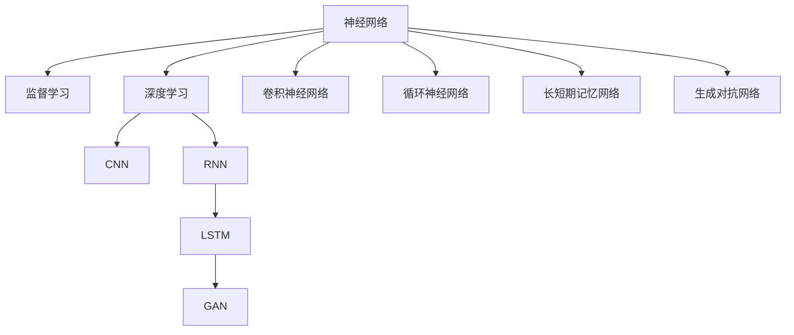

                 

# 一切皆是映射：神经网络在金融欺诈检测中的应用

> 关键词：金融欺诈检测,神经网络,监督学习,深度学习,算法优化,案例分析,深度学习框架,系统部署

## 1. 背景介绍

金融欺诈检测是金融领域中一个极其重要的任务。金融欺诈行为不仅给金融机构带来直接的经济损失，还严重损害了客户对金融系统的信任。传统的金融欺诈检测方法，如规则引擎和基于统计的方法，存在许多局限性，难以应对复杂的欺诈模式和不断演变的欺诈手段。而神经网络，作为深度学习的重要分支，凭借其强大的特征提取和泛化能力，在金融欺诈检测领域逐渐展现出巨大的潜力。

### 1.1 问题由来

金融欺诈检测面临的主要挑战包括：
- 数据量大且异构。金融机构需要处理各种交易记录、用户行为数据等，数据结构复杂多样。
- 欺诈行为多样且隐蔽。欺诈行为形式多样，手段不断翻新，检测难度大。
- 实时性和精度要求高。金融系统需快速响应欺诈行为，且检测结果需要高准确性。

### 1.2 问题核心关键点
神经网络在金融欺诈检测中的应用，关键在于将大规模数据转化为网络模型可以理解的特征，并通过模型学习识别欺诈行为的模式。神经网络主要分为监督学习和非监督学习两种方式：

- **监督学习**：利用标注数据训练神经网络模型，使其学习欺诈和正常交易的特征差异，并进行分类。
- **非监督学习**：利用未标注数据进行聚类、降维等预处理，提取潜在模式再进行检测。

本文聚焦于监督学习的神经网络应用，通过深入探讨算法原理和实践方法，展示其在金融欺诈检测中的强大能力。

## 2. 核心概念与联系

### 2.1 核心概念概述

为更好地理解神经网络在金融欺诈检测中的应用，本节将介绍几个密切相关的核心概念：

- **神经网络**：一种模仿人脑神经元工作方式的计算模型，由大量相互连接的节点组成，可以处理非线性问题。
- **监督学习**：利用有标签数据训练模型，使其能够进行分类或回归等任务。
- **深度学习**：一种基于多层次神经网络的机器学习方法，能够自动学习特征表示，适用于大规模数据。
- **卷积神经网络(CNN)**：一种特殊形式的神经网络，主要用于图像处理和序列数据，通过卷积层和池化层提取局部特征。
- **循环神经网络(RNN)**：一种能够处理序列数据的神经网络，适用于时间序列和自然语言等序列型数据。
- **长短期记忆网络(LSTM)**：一种RNN的变种，能够有效捕捉长期依赖关系，适用于自然语言生成和序列预测。
- **生成对抗网络(GAN)**：一种生成模型，通过博弈论思想训练生成器和判别器，生成逼真的欺诈样本。

这些核心概念之间的逻辑关系可以通过以下Mermaid流程图来展示：



这个流程图展示了大语言模型的核心概念及其之间的关系：

1. 神经网络是深度学习的基础，通过多层次的节点构建起复杂的计算模型。
2. 监督学习是一种有标签训练的方式，利用标注数据训练神经网络。
3. CNN和RNN等特定类型的神经网络，具有针对特定任务的良好特性。
4. LSTM和GAN等变种网络，扩展了神经网络的应用范围和能力。
5. 神经网络与深度学习、卷积神经网络、循环神经网络等技术密切相关，互相促进。

这些概念共同构成了神经网络在金融欺诈检测中的应用框架，使其能够在各种场景下发挥强大的特征提取和模式识别能力。通过理解这些核心概念，我们可以更好地把握神经网络的工作原理和优化方向。

## 3. 核心算法原理 & 具体操作步骤
### 3.1 算法原理概述

神经网络在金融欺诈检测中的应用，基于以下基本原理：

- 利用标注数据训练神经网络，学习欺诈与正常交易之间的特征差异。
- 通过卷积、池化、激活等操作，提取数据的局部和全局特征。
- 利用多层网络结构，逐步抽象和归纳数据的高级特征。
- 通过softmax、sigmoid等激活函数，将网络输出转化为类别概率，进行分类。
- 利用交叉熵、均方误差等损失函数，优化模型参数，提升检测精度。

形式化地，假设训练集为 $D=\{(x_i,y_i)\}_{i=1}^N$，其中 $x_i$ 为输入特征，$y_i$ 为标签（0或1），表示样本是否为欺诈行为。神经网络模型的目标是最小化损失函数 $L$，即：

$$
\min_{\theta} \frac{1}{N} \sum_{i=1}^N L(y_i,f_{\theta}(x_i))
$$

其中 $f_{\theta}(x_i)$ 表示输入 $x_i$ 通过神经网络模型后的输出，$\theta$ 为模型参数。常见损失函数包括交叉熵损失、均方误差损失等。

### 3.2 算法步骤详解

神经网络在金融欺诈检测中的应用，主要包括以下几个关键步骤：

**Step 1: 数据准备和预处理**

1. 收集金融机构的历史交易数据，包括交易金额、时间、地点、用户信息等。
2. 对数据进行清洗和标准化，去除噪声和异常值，处理缺失值。
3. 将数据集分为训练集、验证集和测试集，进行数据划分。

**Step 2: 模型选择和设计**

1. 选择合适的神经网络架构，如CNN、RNN、LSTM等，考虑输入数据的特征和任务特点。
2. 设计网络结构，包括输入层、隐藏层、输出层等。隐藏层可以设计多个卷积核、循环层等。
3. 确定损失函数、优化器等模型超参数。

**Step 3: 模型训练**

1. 使用训练集数据，前向传播计算模型输出。
2. 计算损失函数，反向传播更新模型参数。
3. 在验证集上评估模型性能，防止过拟合。
4. 重复上述过程直至模型收敛。

**Step 4: 模型评估和应用**

1. 使用测试集数据评估模型性能，计算准确率、召回率、F1值等指标。
2. 将训练好的模型应用于新的交易数据，进行实时欺诈检测。
3. 根据实时检测结果，及时发出警报或采取相应措施。

### 3.3 算法优缺点

神经网络在金融欺诈检测中的应用，具有以下优点：
1. 强大的特征提取能力。能够自动学习数据的复杂特征，发现欺诈行为的隐藏模式。
2. 泛化能力强。能够在未见过的交易数据上取得良好表现。
3. 鲁棒性强。能够处理多种数据类型和数据结构。
4. 可解释性。虽然神经网络是黑盒模型，但可以通过可视化工具解释其决策过程。

同时，神经网络在金融欺诈检测中也有以下局限性：
1. 数据依赖性强。需要高质量的标注数据进行训练，获取数据成本高。
2. 计算资源需求大。神经网络模型参数多，计算资源需求大。
3. 模型复杂度高。模型结构复杂，难以调试和优化。
4. 对抗样本脆弱。模型容易受到对抗样本的攻击，检测效果不稳定。
5. 数据隐私问题。需要处理大量敏感数据，存在数据泄露风险。

尽管存在这些局限性，但神经网络在金融欺诈检测中的应用前景广阔，通过持续优化和改进，可以克服其局限性，提升检测效果。

### 3.4 算法应用领域

神经网络在金融欺诈检测中的应用，广泛覆盖了以下领域：

- 信用卡欺诈检测：识别信用卡交易中的异常行为，预防信用卡欺诈。
- 身份盗窃检测：检测身份信息被盗用或滥用情况，保护客户隐私。
- 贷款欺诈检测：识别贷款申请中的欺诈行为，保障贷款安全性。
- 保险欺诈检测：检测保险理赔中的欺诈行为，防止不当理赔。
- 在线交易检测：识别网络交易中的欺诈行为，保护客户财产。
- 网络钓鱼检测：识别网络钓鱼攻击，防止客户信息泄露。

除了这些直接应用外，神经网络还被应用于欺诈数据生成、欺诈行为模拟等辅助任务中，进一步提升了欺诈检测的精度和效率。

## 4. 数学模型和公式 & 详细讲解 & 举例说明

### 4.1 数学模型构建

以下我们以CNN应用于金融欺诈检测为例，给出神经网络模型的数学模型构建过程。

假设输入数据为 $x=[x_1,x_2,...,x_n]$，其中 $x_i \in \mathbb{R}^d$，表示一个 $d$ 维的向量。神经网络模型由多个卷积层、池化层和全连接层构成，最终输出一个概率 $p \in [0,1]$，表示输入为欺诈行为的概率。

设神经网络模型的参数为 $\theta$，包括卷积核、偏置、全连接层权重等。模型输出为 $f_{\theta}(x)$，则损失函数 $L$ 可以表示为：

$$
L = -\frac{1}{N} \sum_{i=1}^N [y_i \log p_i + (1-y_i) \log (1-p_i)]
$$

其中 $y_i$ 为标注标签，$p_i = f_{\theta}(x_i)$ 为模型输出。

### 4.2 公式推导过程

以下我们以二分类任务为例，推导CNN模型的数学公式。

设输入数据为 $x=[x_1,x_2,...,x_n]$，其中 $x_i \in \mathbb{R}^d$。卷积层输出为 $H=[h_1,h_2,...,h_n]$，其中 $h_i \in \mathbb{R}^{d'}$。池化层输出为 $P=[p_1,p_2,...,p_n]$，其中 $p_i \in \mathbb{R}^{d''}$。全连接层输出为 $O=[o_1,o_2,...,o_n]$，其中 $o_i \in \mathbb{R}$。模型输出为 $p=[p_1,p_2,...,p_n]$，其中 $p_i \in [0,1]$。

卷积层的数学公式为：

$$
h_i = f_{\theta_1} * x_i
$$

其中 $f_{\theta_1}=[f_1,f_2,...,f_m]$ 为卷积核，$*$ 表示卷积操作，$x_i$ 表示输入数据。

池化层的数学公式为：

$$
p_i = g_{\theta_2}(H_i)
$$

其中 $g_{\theta_2}$ 为池化函数，$H_i$ 表示第 $i$ 个卷积层的输出。

全连接层的数学公式为：

$$
o_i = \theta_3^{T} h_i
$$

其中 $\theta_3$ 为全连接层权重，$h_i$ 表示池化层的输出。

模型输出的数学公式为：

$$
p_i = \sigma(\theta_4^T o_i)
$$

其中 $\sigma$ 为激活函数，$\theta_4$ 为输出层权重。

综合以上步骤，CNN模型的数学公式可以表示为：

$$
p = \sigma(\theta_4^T \sigma(\theta_3^T g_{\theta_2}(f_{\theta_1} * x)))
$$

其中 $*$ 表示卷积操作，$g_{\theta_2}$ 表示池化函数，$\sigma$ 为激活函数。

在得到模型输出后，可以进一步计算损失函数 $L$，使用反向传播算法更新模型参数，最小化损失函数 $L$。

### 4.3 案例分析与讲解

以信用卡欺诈检测为例，假设输入数据为信用卡交易信息，包括金额、时间、地点等。可以设计一个基于CNN的欺诈检测模型，利用卷积层和池化层提取交易金额、时间、地点等局部特征，通过全连接层进行分类。训练时，使用交叉熵损失函数进行优化，在验证集上评估模型性能，最终在测试集上进行实时检测。

## 5. 项目实践：代码实例和详细解释说明
### 5.1 开发环境搭建

在进行金融欺诈检测的神经网络模型开发前，我们需要准备好开发环境。以下是使用Python进行TensorFlow开发的环境配置流程：

1. 安装Anaconda：从官网下载并安装Anaconda，用于创建独立的Python环境。

2. 创建并激活虚拟环境：
```bash
conda create -n tf-env python=3.8 
conda activate tf-env
```

3. 安装TensorFlow：根据CUDA版本，从官网获取对应的安装命令。例如：
```bash
conda install tensorflow -c conda-forge
```

4. 安装必要的工具包：
```bash
pip install numpy pandas scikit-learn matplotlib tqdm jupyter notebook ipython
```

完成上述步骤后，即可在`tf-env`环境中开始模型开发。

### 5.2 源代码详细实现

下面我们以信用卡欺诈检测为例，给出使用TensorFlow对CNN模型进行训练的PyTorch代码实现。

首先，定义模型类：

```python
import tensorflow as tf
from tensorflow.keras import layers

class CNNModel(tf.keras.Model):
    def __init__(self, input_dim):
        super(CNNModel, self).__init__()
        self.conv1 = layers.Conv2D(32, (3, 3), activation='relu')
        self.pool1 = layers.MaxPooling2D((2, 2))
        self.flatten = layers.Flatten()
        self.dense1 = layers.Dense(64, activation='relu')
        self.dense2 = layers.Dense(1, activation='sigmoid')

    def call(self, inputs):
        x = self.conv1(inputs)
        x = self.pool1(x)
        x = self.flatten(x)
        x = self.dense1(x)
        x = self.dense2(x)
        return x
```

然后，定义数据集：

```python
import numpy as np
from sklearn.model_selection import train_test_split
from tensorflow.keras.utils import to_categorical

X_train, X_test, y_train, y_test = train_test_split(X, y, test_size=0.2, random_state=42)

X_train = np.expand_dims(X_train, axis=-1)
X_test = np.expand_dims(X_test, axis=-1)

y_train = to_categorical(y_train, num_classes=2)
y_test = to_categorical(y_test, num_classes=2)
```

接着，定义模型编译和训练：

```python
model = CNNModel(input_dim=3)
model.compile(optimizer='adam', loss='binary_crossentropy', metrics=['accuracy'])

history = model.fit(X_train, y_train, epochs=10, batch_size=64, validation_data=(X_test, y_test))
```

最后，在测试集上评估模型性能：

```python
test_loss, test_acc = model.evaluate(X_test, y_test, verbose=2)
print('Test loss:', test_loss)
print('Test accuracy:', test_acc)
```

以上就是使用TensorFlow对CNN模型进行信用卡欺诈检测的完整代码实现。可以看到，TensorFlow提供了便捷的API，使得模型开发和训练变得简单高效。

### 5.3 代码解读与分析

让我们再详细解读一下关键代码的实现细节：

**CNNModel类**：
- `__init__`方法：初始化卷积层、池化层、全连接层等组件。
- `call`方法：定义模型前向传播过程，包括卷积、池化、全连接等操作。

**数据集定义**：
- `train_test_split`方法：将数据集划分为训练集和测试集。
- `to_categorical`方法：将标签转换为one-hot编码。

**模型编译和训练**：
- `compile`方法：设置模型优化器、损失函数和评估指标。
- `fit`方法：在训练集上训练模型，并在验证集上评估模型性能。

**模型评估**：
- `evaluate`方法：在测试集上评估模型性能，输出损失和准确率。

可以看到，TensorFlow提供了完整的模型构建和训练工具，开发者可以专注于模型的设计，而不必过多关注底层实现细节。通过这些工具，神经网络在金融欺诈检测中的应用变得非常简单高效。

## 6. 实际应用场景
### 6.1 智能客服系统

神经网络在金融欺诈检测中的应用，可以应用于智能客服系统的欺诈检测中。智能客服系统利用自然语言处理技术，自动解答客户咨询，减少人工客服的工作量。但在处理复杂或异常的客户咨询时，仍需要人工干预和判断。

通过引入神经网络模型，智能客服系统可以初步识别欺诈行为，将可疑问题转接人工客服进一步处理。这样可以大大提升客服系统的响应速度和处理能力，同时减轻人工客服的负担。

### 6.2 金融风险管理

神经网络在金融欺诈检测中的应用，可以应用于金融机构的全面风险管理。金融欺诈不仅对金融机构造成经济损失，还可能引发市场恐慌和系统性风险。

通过神经网络模型对交易数据进行实时检测，金融机构可以及时发现和应对欺诈行为，保护客户财产，保障市场稳定。同时，利用神经网络模型分析欺诈行为的模式和趋势，金融机构可以调整风险控制策略，提高风险管理能力。

### 6.3 金融数据安全

神经网络在金融欺诈检测中的应用，可以应用于金融数据的隐私和安全保护。金融数据通常包含大量敏感信息，如个人账户信息、交易记录等。一旦泄露，可能对客户和金融机构造成巨大损失。

通过神经网络模型对金融数据进行异常检测和风险评估，金融机构可以及时发现数据泄露风险，采取相应措施保护数据安全。同时，利用神经网络模型进行数据加密和隐私保护，提升数据的安全性和可靠性。

## 7. 工具和资源推荐
### 7.1 学习资源推荐

为了帮助开发者系统掌握神经网络在金融欺诈检测中的应用，这里推荐一些优质的学习资源：

1. 《深度学习入门》系列书籍：作者李沐，详细介绍了深度学习的基本概念和应用，包括神经网络、卷积神经网络、循环神经网络等。
2. CS231n《卷积神经网络》课程：斯坦福大学开设的图像处理课程，涵盖了卷积神经网络的原理和实践。
3. CS224n《自然语言处理》课程：斯坦福大学开设的NLP课程，介绍了自然语言处理的基本方法和深度学习技术。
4. 《TensorFlow实战Google深度学习》书籍：介绍TensorFlow的基本使用方法和深度学习模型的实现。
5. 《Python深度学习》书籍：作者Francois Chollet，详细介绍了使用Keras构建深度学习模型的过程和实践经验。

通过对这些资源的学习实践，相信你一定能够快速掌握神经网络在金融欺诈检测中的应用，并用于解决实际的金融问题。

### 7.2 开发工具推荐

高效的开发离不开优秀的工具支持。以下是几款用于神经网络应用开发的常用工具：

1. TensorFlow：由Google主导开发的深度学习框架，生产部署方便，适合大规模工程应用。
2. PyTorch：基于Python的开源深度学习框架，灵活动态的计算图，适合快速迭代研究。
3. Keras：高层次的深度学习API，易于上手，支持多种深度学习框架。
4. Weights & Biases：模型训练的实验跟踪工具，可以记录和可视化模型训练过程中的各项指标。
5. TensorBoard：TensorFlow配套的可视化工具，可实时监测模型训练状态，提供丰富的图表呈现方式。
6. Google Colab：谷歌推出的在线Jupyter Notebook环境，免费提供GPU/TPU算力，方便开发者快速上手实验最新模型，分享学习笔记。

合理利用这些工具，可以显著提升神经网络在金融欺诈检测中的应用开发效率，加快创新迭代的步伐。

### 7.3 相关论文推荐

神经网络在金融欺诈检测中的应用，得益于学界的持续研究。以下是几篇奠基性的相关论文，推荐阅读：

1. Convolutional Neural Networks for Fraud Detection（Arxiv 2017）：提出使用卷积神经网络进行信用卡欺诈检测，引入池化层和激活函数。
2. Long Short-Term Memory-Based credit card fraud detection（IEEE Transactions on Dependable and Secure Computing 2019）：提出使用LSTM进行信用卡欺诈检测，引入门控机制捕捉长期依赖关系。
3. Anomaly Detection Using Convolutional Neural Networks（IEEE Transactions on Cybernetics 2019）：提出使用CNN进行异常检测，利用卷积操作提取局部特征。
4. A comparative study of Neural Network Models for Fraud Detection（Applied Soft Computing 2021）：对比多种神经网络模型在金融欺诈检测中的应用效果，给出模型选择的指导。
5. Generative Adversarial Networks for Fraud Detection（IEEE Transactions on Dependable and Secure Computing 2020）：提出使用生成对抗网络生成欺诈样本，提高检测模型的泛化能力。

这些论文代表了大语言模型微调技术的发展脉络。通过学习这些前沿成果，可以帮助研究者把握学科前进方向，激发更多的创新灵感。

## 8. 总结：未来发展趋势与挑战

### 8.1 总结

本文对神经网络在金融欺诈检测中的应用进行了全面系统的介绍。首先阐述了金融欺诈检测面临的主要挑战和神经网络的优势，明确了神经网络在处理大规模、异构数据时的强大能力。其次，从原理到实践，详细讲解了神经网络模型的构建和训练过程，给出了具体的代码实现。同时，本文还广泛探讨了神经网络在智能客服、金融风险管理、金融数据安全等实际应用场景中的价值，展示了神经网络在金融领域的广泛应用前景。此外，本文精选了神经网络应用的各类学习资源，力求为读者提供全方位的技术指引。

通过本文的系统梳理，可以看到，神经网络在金融欺诈检测中的应用前景广阔，凭借其强大的特征提取和泛化能力，能够在实时、高效、准确地识别欺诈行为。未来，伴随神经网络模型的持续优化和改进，必将在金融领域带来更大的变革性影响。

### 8.2 未来发展趋势

展望未来，神经网络在金融欺诈检测中的应用将呈现以下几个发展趋势：

1. 模型规模持续增大。随着算力成本的下降和数据规模的扩张，神经网络模型的参数量还将持续增长。超大规模神经网络模型蕴含的丰富特征，有望支撑更加复杂多变的欺诈模式。
2. 模型结构不断优化。未来的神经网络模型将更加注重结构优化，通过网络融合、层次划分等手段，提升模型的效率和泛化能力。
3. 多模态数据融合。未来的欺诈检测模型将融合视觉、音频等多模态数据，提升对欺诈行为的全面感知和识别。
4. 对抗样本防御。随着欺诈手段的不断升级，对抗样本的防御将成为欺诈检测的重要研究方向。未来的神经网络模型将具备更好的对抗样本鲁棒性。
5. 端到端学习。未来的欺诈检测模型将实现端到端学习，即在训练过程中同时考虑模型推理效率和数据隐私保护。
6. 自监督学习。未来的神经网络模型将利用无监督学习的方式，从大规模数据中提取欺诈特征，减少对标注数据的依赖。

以上趋势凸显了神经网络在金融欺诈检测中的广阔前景。这些方向的探索发展，必将进一步提升欺诈检测的精度和效率，为金融机构带来更大的价值。

### 8.3 面临的挑战

尽管神经网络在金融欺诈检测中的应用已经取得了显著成效，但在迈向更加智能化、普适化应用的过程中，仍面临诸多挑战：

1. 数据获取和标注困难。高质量标注数据的高获取成本，成为限制神经网络应用的主要瓶颈。如何在少量标注数据上取得理想效果，需要更多研究突破。
2. 模型训练时间长。大规模神经网络模型的训练需要大量的计算资源，耗时长且成本高。如何优化模型训练过程，提高训练效率，是一个亟需解决的问题。
3. 对抗样本攻击。神经网络模型容易受到对抗样本的攻击，检测效果不稳定。如何增强模型鲁棒性，避免对抗样本攻击，将是重要的研究方向。
4. 数据隐私保护。神经网络模型处理大量敏感数据，存在数据泄露风险。如何保护数据隐私，同时保障模型的安全性，是一个重要的研究方向。
5. 模型可解释性不足。神经网络模型通常是黑盒模型，难以解释其内部工作机制。如何提高模型的可解释性，增强用户信任，是一个亟需解决的问题。
6. 模型依赖性高。神经网络模型依赖大量的数据和计算资源，难以在资源有限的场景下进行应用。如何设计轻量级模型，降低资源依赖，是未来研究方向之一。

尽管存在这些挑战，但随着学界和产业界的共同努力，神经网络在金融欺诈检测中的应用必将不断取得新的突破。通过持续优化和改进，可以克服其局限性，提升欺诈检测的精度和效率。

### 8.4 研究展望

面对神经网络在金融欺诈检测中面临的挑战，未来的研究需要在以下几个方面寻求新的突破：

1. 探索无监督和半监督学习。摆脱对大规模标注数据的依赖，利用自监督学习、主动学习等无监督和半监督范式，最大限度利用非结构化数据，实现更加灵活高效的欺诈检测。
2. 研究参数高效和计算高效的神经网络结构。开发更加参数高效的神经网络模型，在固定大部分网络参数的同时，只更新极少量的任务相关参数。同时优化神经网络模型的计算图，减少前向传播和反向传播的资源消耗，实现更加轻量级、实时性的部署。
3. 融合因果推断和博弈论思想。通过引入因果推断和博弈论思想，增强神经网络模型建立稳定因果关系的能力，学习更加普适、鲁棒的数据特征表示。
4. 引入更多先验知识。将符号化的先验知识，如知识图谱、逻辑规则等，与神经网络模型进行巧妙融合，引导神经网络模型学习更准确、合理的特征表示。
5. 结合因果分析和博弈论工具。将因果分析方法引入神经网络模型，识别出模型决策的关键特征，增强输出解释的因果性和逻辑性。借助博弈论工具刻画人机交互过程，主动探索并规避模型的脆弱点，提高系统稳定性。
6. 纳入伦理道德约束。在神经网络模型的训练目标中引入伦理导向的评估指标，过滤和惩罚有害的输出倾向。同时加强人工干预和审核，建立模型行为的监管机制，确保输出符合人类价值观和伦理道德。

这些研究方向的探索，必将引领神经网络在金融欺诈检测中的应用迈向更高的台阶，为构建安全、可靠、可解释、可控的金融系统提供新的技术路径。面向未来，神经网络技术还需要与其他人工智能技术进行更深入的融合，如知识表示、因果推理、强化学习等，多路径协同发力，共同推动金融欺诈检测技术的进步。只有勇于创新、敢于突破，才能不断拓展神经网络的应用边界，让人工智能技术更好地造福金融领域。

## 9. 附录：常见问题与解答

**Q1：神经网络在金融欺诈检测中是否具有可解释性？**

A: 神经网络模型通常是黑盒模型，难以解释其内部工作机制和决策逻辑。然而，通过可视化工具如TensorBoard，可以观察神经网络在训练过程中的参数变化和输出结果，提供一定的可解释性。此外，近年来越来越多的研究致力于可解释性神经网络，提出了一系列的可解释性方法和工具，帮助理解神经网络的决策过程。例如，LIME（Local Interpretable Model-agnostic Explanations）可以提供局部可解释性，SHAP（SHapley Additive exPlanations）提供全局可解释性。

**Q2：神经网络在金融欺诈检测中是否容易受到对抗样本攻击？**

A: 神经网络模型容易受到对抗样本的攻击，即通过微小的扰动，使模型输出发生明显偏差。这使得神经网络在金融欺诈检测中的应用面临一定的安全风险。为了应对这一问题，可以采用以下方法：
1. 对抗训练：在训练过程中引入对抗样本，提高模型的鲁棒性。
2. 模型融合：利用多个模型的输出进行综合，减少对抗样本的影响。
3. 鲁棒性正则化：在损失函数中加入鲁棒性正则项，抑制对抗样本的影响。
4. 对抗检测：在检测过程中，引入对抗检测方法，识别和过滤对抗样本。

**Q3：神经网络在金融欺诈检测中是否需要大量标注数据？**

A: 神经网络在金融欺诈检测中通常需要大量标注数据进行训练。虽然现代神经网络模型具备较强的泛化能力，但标注数据的多样性和数量仍是影响模型性能的重要因素。对于标注数据较少的情况，可以考虑使用半监督学习、迁移学习等方法，利用无标注数据和外部知识，提升模型的泛化能力。此外，最近提出的自监督学习技术，如预训练-微调方法，可以在少量标注数据上取得显著效果。

**Q4：神经网络在金融欺诈检测中是否需要进行多层次特征提取？**

A: 神经网络在金融欺诈检测中通常需要进行多层次特征提取，以捕捉不同层次的数据特征。低层次特征提取器（如卷积层）可以捕捉局部特征，如时间、金额等。高层次特征提取器（如全连接层）可以捕捉全局特征，如用户行为模式、交易趋势等。通过多层次特征提取，神经网络模型能够更好地学习复杂的欺诈模式，提升检测精度。

**Q5：神经网络在金融欺诈检测中是否需要进行对抗训练？**

A: 神经网络在金融欺诈检测中通常需要进行对抗训练，以提高模型的鲁棒性。对抗训练是指在训练过程中，引入对抗样本，使模型对对抗样本具有一定的鲁棒性。这可以防止欺诈者通过对抗样本攻击来欺骗模型。对抗训练的方法包括FGM（Fast Gradient Sign Method）、PGD（Projected Gradient Descent）等。

---

作者：禅与计算机程序设计艺术 / Zen and the Art of Computer Programming

