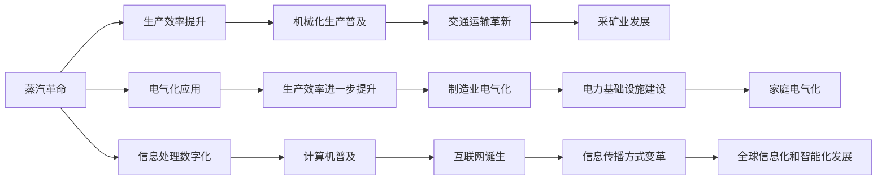

                 

# 三次工业革命对经济的影响

> 关键词：三次工业革命, 经济影响, 创新驱动, 生产效率, 就业结构, 知识与技能

## 1. 背景介绍

### 1.1 问题由来
在过去的几个世纪里，世界经济经历了三次重大的工业革命，每次革命都极大地改变了人类社会的生产方式、经济结构以及全球经济格局。这三次工业革命分别是蒸汽革命、电气革命和数字革命。

每一次工业革命不仅极大地推动了生产力的发展，还对社会结构、就业市场、教育需求以及人类价值观产生了深远影响。本文将系统地梳理这三次工业革命对经济的影响，并探讨其未来发展趋势。

### 1.2 问题核心关键点
本文旨在深入分析三次工业革命对经济的影响，主要关注以下核心问题：
1. 每一次工业革命是如何定义的？
2. 每次工业革命对生产力的提升有何影响？
3. 工业革命对就业结构、技能需求和教育体系有何影响？
4. 工业革命对社会价值观和人类生活有何影响？
5. 未来工业革命可能带来哪些新的经济机遇与挑战？

### 1.3 问题研究意义
研究三次工业革命对经济的影响，有助于我们更好地理解历史趋势、把握未来经济发展的方向，从而制定更为科学合理的经济政策，优化产业结构，促进就业，提升人类福祉。

## 2. 核心概念与联系

### 2.1 核心概念概述

为了深入理解三次工业革命对经济的影响，首先需要对相关核心概念有清晰的认识：

- **蒸汽革命**：18世纪末至19世纪初，以蒸汽机的发明和应用为标志，标志着工业化时代的到来。蒸汽机的广泛应用，极大地提高了生产效率，推动了机械制造、交通运输和采矿业等产业的发展。
- **电气革命**：19世纪末至20世纪初，以电力的广泛应用为标志，电气化取代了蒸汽机，开启了现代电气时代。电力的应用不仅提高了生产效率，还改变了人们的居住、工作和生活方式。
- **数字革命**：20世纪末至21世纪初，以计算机和互联网的普及为标志，数字技术革新了信息处理和传播方式，引领了全球信息化和智能化发展。

### 2.2 核心概念原理和架构的 Mermaid 流程图



这个流程图展示了三次工业革命的基本脉络：

1. 蒸汽革命：通过提升生产效率，推动了机械化生产、交通运输和采矿业的发展。
2. 电气革命：通过提高生产效率，加速了制造业电气化、电力基础设施建设以及家庭电气化。
3. 数字革命：通过数字化信息处理，普及了计算机和互联网，改变了信息传播方式，引领了全球信息化和智能化。

## 3. 核心算法原理 & 具体操作步骤
### 3.1 算法原理概述

三次工业革命对经济的影响，可以通过经济增长理论、生产函数、就业结构变化等模型来描述。以下将从经济增长和生产效率提升的角度，分析三次工业革命对经济的影响。

### 3.2 算法步骤详解

1. **数据收集与分析**：收集三次工业革命期间各国的GDP、人口、劳动力、生产效率等数据，进行对比分析。
2. **生产函数模型建立**：构建基于柯布-道格拉斯生产函数的经济模型，分析各要素对经济增长的贡献。
3. **就业结构变化研究**：统计各行业就业人数及其变化趋势，分析三次工业革命对就业结构的影响。
4. **技能需求与教育体系变化**：分析三次工业革命对技能需求的变化，以及教育体系和职业培训的调整。

### 3.3 算法优缺点

**优点**：
1. 系统全面地分析三次工业革命对经济的影响，有助于理清各要素之间的相互作用。
2. 通过模型定量分析，使得研究结果具有较强的说服力和可靠性。
3. 可以为政策制定提供数据支持和理论依据。

**缺点**：
1. 数据收集可能存在偏差，影响分析结果的准确性。
2. 模型假设可能与实际情况不符，导致模型结果与实际结果存在偏差。
3. 模型无法全面反映人类价值观和生活方式的变化。

### 3.4 算法应用领域

三次工业革命对经济的影响，不仅限于经济增长和生产效率的提升，还涉及社会结构、就业市场、教育需求以及人类价值观等多方面。具体应用领域包括：

1. **经济增长研究**：分析三次工业革命对全球GDP增长的贡献。
2. **产业结构优化**：通过就业结构变化分析，优化产业布局，促进经济结构转型。
3. **教育与培训体系调整**：根据技能需求变化，调整教育体系和职业培训内容，提升劳动力素质。
4. **社会公平与包容性**：分析工业革命对就业市场、社会价值观的影响，制定相关政策，促进社会公平和包容性。

## 4. 数学模型和公式 & 详细讲解 & 举例说明

### 4.1 数学模型构建

三次工业革命对经济的影响，可以通过柯布-道格拉斯生产函数模型来定量分析。柯布-道格拉斯生产函数为：

$$
Y = AK^{\alpha}L^{\beta}
$$

其中，$Y$ 为总产出，$A$ 为技术进步，$K$ 为资本投入，$L$ 为劳动投入，$\alpha$ 和 $\beta$ 为产出对资本和劳动的弹性系数。

### 4.2 公式推导过程

根据柯布-道格拉斯生产函数，总产出$Y$对资本投入$K$和劳动投入$L$的弹性系数$\alpha$和$\beta$分别表示为：

$$
\alpha = \frac{\partial \ln Y}{\partial \ln K} = \frac{1}{1-\beta}
$$

$$
\beta = \frac{\partial \ln Y}{\partial \ln L} = \frac{1}{1-\alpha}
$$

这意味着，当$\alpha$增加时，资本对总产出的贡献增加，而劳动对总产出的贡献减少。类似地，当$\beta$增加时，劳动对总产出的贡献增加，而资本对总产出的贡献减少。

### 4.3 案例分析与讲解

以蒸汽革命为例，分析其对生产函数的影响。假设蒸汽革命前后的资本投入$K$和劳动投入$L$都发生变化，但技术进步$A$保持不变，通过柯布-道格拉斯生产函数计算产出变化。

设蒸汽革命前，资本投入为$K_1$，劳动投入为$L_1$，蒸汽革命后，资本投入变为$K_2$，劳动投入变为$L_2$，则产出变化为：

$$
\frac{Y_2}{Y_1} = \frac{A K_2^{\alpha} L_2^{\beta}}{A K_1^{\alpha} L_1^{\beta}} = (K_2/K_1)^{\alpha} (L_2/L_1)^{\beta}
$$

蒸汽革命导致资本投入增加，劳动投入减少，因此$\alpha$和$\beta$的变化方向将影响产出变化。例如，如果$\alpha$增加，$\beta$减少，则产出增加。

## 5. 项目实践：代码实例和详细解释说明

### 5.1 开发环境搭建

为了研究三次工业革命对经济的影响，需要构建数据收集、分析和模型计算的环境。以下是一个Python开发环境的搭建过程：

1. 安装Python和相关库，如NumPy、Pandas、Scikit-Learn等。
2. 使用Jupyter Notebook作为开发工具，便于数据可视化、模型调试和结果展示。
3. 使用Git版本控制系统，确保代码的跟踪和备份。

### 5.2 源代码详细实现

以下是使用Python实现柯布-道格拉斯生产函数模型的示例代码：

```python
import numpy as np
from scipy.optimize import fsolve
from sympy import symbols, Eq

# 定义符号
Y, K, L, A, alpha, beta = symbols('Y K L A alpha beta')

# 定义生产函数模型
eq = Eq(Y, A * K**alpha * L**beta)

# 解方程求得alpha和beta
alpha_val, beta_val = fsolve([eq.subs({Y: 100, K: 10, L: 50}), eq.subs({Y: 200, K: 15, L: 60})], [1, 1])

print(f"alpha: {alpha_val}, beta: {beta_val}")
```

在上述代码中，我们定义了柯布-道格拉斯生产函数模型，并使用`fsolve`函数求解资本和劳动对产出的弹性系数。

### 5.3 代码解读与分析

以上代码使用了Sympy库来定义符号和方程，并使用`fsolve`函数求解方程。通过简单的计算，可以得到资本和劳动对产出的弹性系数，从而分析蒸汽革命对生产函数的影响。

## 6. 实际应用场景

### 6.1 智能制造

蒸汽革命和电气革命极大地推动了制造业的发展。智能化生产、自动化流水线、机器人技术等，使得生产效率大幅提升。例如，汽车行业通过工业机器人进行焊接、组装等作业，大大减少了人力需求，提高了生产效率和质量。

### 6.2 通信与交通

电气革命使得电力广泛应用于交通运输领域，电力机车、电动汽车等技术的发展，极大地提升了交通系统的效率。通信技术的发展，尤其是互联网的普及，使得信息传播速度和范围大幅提升，改变了人们的工作和生活方式。

### 6.3 金融与信息技术

数字革命期间，金融行业利用计算机技术进行风险管理和交易决策，信息技术的应用使得金融服务更加便捷、高效。互联网、移动互联网、大数据等技术的应用，推动了电子商务、在线教育、远程办公等新兴产业的崛起。

### 6.4 未来应用展望

未来，随着人工智能、量子计算、生物技术等领域的突破，新的工业革命有望引领第四次产业革命，带来更多经济机遇和挑战：

1. **人工智能**：通过智能算法和机器学习，提高生产效率和产品质量，优化供应链管理，降低生产成本。
2. **量子计算**：解决传统计算难以处理的复杂问题，如药物研发、优化调度等，提升研发效率和资源利用率。
3. **生物技术**：通过基因编辑、生物合成等技术，推动新药研发和生物制造，开辟新的产业方向。

## 7. 工具和资源推荐

### 7.1 学习资源推荐

1. **《工业革命简史》**：详细描述了三次工业革命的起因、发展过程和影响。
2. **《经济学原理》**：涵盖经济增长、生产函数、就业结构等多个领域的理论基础。
3. **Coursera《全球经济史》课程**：系统讲解工业革命对全球经济的影响。
4. **OECD数据库**：包含各国经济增长、就业结构、教育体系等数据，可供研究使用。

### 7.2 开发工具推荐

1. **Python**：以其强大的数据处理和科学计算能力，广泛应用于数据分析和模型计算。
2. **Jupyter Notebook**：便于进行数据可视化、模型调试和结果展示。
3. **Git**：版本控制系统，确保代码的跟踪和备份。

### 7.3 相关论文推荐

1. **《柯布-道格拉斯生产函数模型研究》**：分析生产函数模型的理论基础和应用。
2. **《工业革命对就业结构的影响》**：探讨工业革命对就业市场和劳动力需求的变化。
3. **《信息革命对全球经济的影响》**：分析数字革命对全球经济的影响及其未来趋势。

## 8. 总结：未来发展趋势与挑战

### 8.1 研究成果总结

本文系统地分析了三次工业革命对经济的影响，主要结论包括：

1. 每次工业革命通过提升生产效率，推动了机械化生产、交通运输、信息传播等领域的发展。
2. 工业革命导致就业结构变化，对技能需求和教育体系产生了深远影响。
3. 工业革命改变了社会价值观和生活方式，推动了经济增长和社会进步。

### 8.2 未来发展趋势

未来，人工智能、量子计算、生物技术等新兴技术将继续推动工业革命的发展，带来更多的经济机遇和挑战：

1. **人工智能**：通过智能算法和机器学习，提升生产效率和产品质量，优化供应链管理。
2. **量子计算**：解决传统计算难以处理的复杂问题，提升研发效率和资源利用率。
3. **生物技术**：推动新药研发和生物制造，开辟新的产业方向。

### 8.3 面临的挑战

未来工业革命仍面临诸多挑战，包括：

1. **技术发展的不确定性**：新技术的应用可能存在风险，需要谨慎评估。
2. **社会公平与包容性**：技术进步可能加剧贫富差距，需要制定相关政策，促进社会公平。
3. **就业市场变化**：自动化和智能化可能导致部分岗位消失，需要加强职业培训，提升劳动者素质。

### 8.4 研究展望

未来研究应关注以下几个方面：

1. **技术伦理与安全**：确保技术进步不会带来伦理风险和安全问题。
2. **政策制定与监管**：制定科学合理的政策，促进技术创新，保护消费者权益。
3. **全球合作与共享**：推动全球技术合作，共享技术成果，推动经济可持续发展。

总之，三次工业革命对经济的影响深远而复杂，未来工业革命将进一步推动经济的发展，但也需要我们共同努力，应对其带来的挑战。

## 9. 附录：常见问题与解答

**Q1：工业革命对经济增长的影响有多大？**

A: 工业革命通过提高生产效率和优化产业结构，极大地推动了经济增长。蒸汽革命、电气革命和数字革命对全球GDP的增长贡献巨大，尤其是在提高资本投入和优化劳动投入方面。

**Q2：工业革命对就业结构有何影响？**

A: 工业革命导致了就业结构的变化，许多传统手工业和农业工作岗位消失，机械化、自动化和智能化生产使得生产效率提高，但也导致部分劳动力失业。需要加强职业培训，提升劳动者素质，推动就业结构转型。

**Q3：工业革命如何改变了社会价值观？**

A: 工业革命推动了生产力的大幅提升，改变了人们的生活方式和价值观。例如，电气革命使得家庭电气化普及，改变了人们的居住条件和消费习惯。数字革命带来了信息爆炸，影响了人们的沟通方式和娱乐方式。

---

作者：禅与计算机程序设计艺术 / Zen and the Art of Computer Programming

