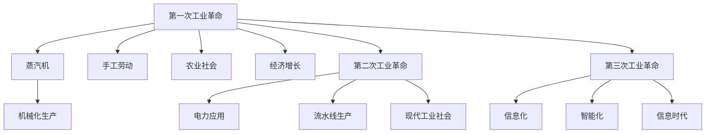

                 

# 三次工业革命对经济的深远影响

## 1. 背景介绍

### 1.1 问题由来

随着科技的不断进步，世界经济经历了三次深刻的工业革命。每次革命都极大地改变了生产力结构，重塑了社会经济格局，深刻影响着人们的生产和生活方式。

第一次工业革命以蒸汽机的发明和应用为标志，人类开始从手工劳动向机械化、自动化转变。它彻底改变了农业社会的生产方式，奠定了现代工业体系的基础。

第二次工业革命则以电力的广泛应用为标志，生产方式从以手工和机械为主的批量生产转向大规模、标准化、自动化的流水线生产，开启了现代工业社会的进程。

第三次工业革命以信息化和智能化为标志，计算机、互联网、大数据、人工智能等技术的广泛应用，极大地提升了信息处理和决策的效率，开启了智能化的新时代。

本系列文章将通过深入探讨三次工业革命对经济的影响，试图揭示其背后的技术逻辑和变革机理，并对未来经济发展的趋势进行展望。

### 1.2 问题核心关键点

本次探讨的核心关键点包括：

- **技术进步对生产力的提升**：如何通过技术革新实现生产效率的指数级提升？
- **经济结构的变化**：三次工业革命如何改变经济活动的结构和分布？
- **社会生活模式的转变**：工业革命如何影响人类的工作、消费、娱乐等生活模式？
- **政策与制度的影响**：不同历史阶段下的政策与制度如何支持工业革命的推进？
- **未来发展趋势**：新技术如何推动第四次工业革命，引领未来经济发展？

## 2. 核心概念与联系

### 2.1 核心概念概述

本次探讨涉及的核心概念主要包括：

- **工业革命**：通过技术进步引领生产方式的根本性变革，推动经济和社会发展的历史阶段。
- **生产力**：指社会在一定时期内生产商品和提供服务的能力，反映了劳动生产率和资源配置的效率。
- **生产关系**：生产过程中人与人、人与物之间的联系和相互作用方式，包括生产资料所有制、劳动组织方式等。
- **信息时代**：以数字化、网络化、智能化为特征的全新经济形态，以数据为核心的生产方式和服务模式。
- **智能化**：通过人工智能、机器学习等技术实现生产、决策、管理等环节的自动化和智能化。

### 2.2 核心概念原理和架构的 Mermaid 流程图



## 3. 核心算法原理 & 具体操作步骤

### 3.1 算法原理概述

本系列文章将从技术变革的角度，分析三次工业革命对经济的影响。其核心算法原理包括：

1. **生产效率提升算法**：通过技术进步，实现生产效率的提升，从而推动经济的增长。
2. **生产关系演进算法**：研究生产过程中人与人、人与物的关系变化，揭示不同阶段下的生产模式。
3. **经济结构优化算法**：分析经济活动结构和分布的变化，揭示产业结构升级的规律。
4. **社会生活模式演化算法**：探讨技术变革如何影响人类的工作、消费、娱乐等生活模式。

### 3.2 算法步骤详解

本系列文章将采用以下步骤进行探讨：

1. **背景回顾**：介绍每次工业革命的背景和关键技术。
2. **生产效率提升**：分析技术进步如何提升生产效率。
3. **生产关系演进**：研究生产过程中的人际关系和组织形式变化。
4. **经济结构优化**：分析工业革命如何改变经济活动结构和分布。
5. **社会生活模式转变**：探讨技术变革如何影响人们的生活方式。
6. **政策与制度影响**：分析不同历史阶段下的政策与制度对工业革命的推进作用。
7. **未来发展趋势**：预测新技术如何推动第四次工业革命，引领未来经济发展。

### 3.3 算法优缺点

本系列文章将分析三次工业革命的优势和劣势，包括：

- **优势**：技术进步带来的生产效率提升，经济增长和经济结构优化。
- **劣势**：技术变革带来的社会不平等、环境污染等问题。

### 3.4 算法应用领域

本系列文章将探讨三次工业革命在农业、制造业、服务业等不同领域的应用，以及其对经济和社会的影响。

## 4. 数学模型和公式 & 详细讲解 & 举例说明

### 4.1 数学模型构建

本系列文章将构建以下几个数学模型：

1. **生产效率模型**：
   $$
   F = A \times E^{\alpha} \times L^{\beta} \times K^{\gamma}
   $$
   其中，$F$ 表示生产总值，$A$ 表示技术进步，$E$ 表示劳动效率，$L$ 表示劳动数量，$K$ 表示资本投入，$\alpha$、$\beta$、$\gamma$ 为模型参数。

2. **经济增长模型**：
   $$
   G = \frac{F_{t} - F_{t-1}}{F_{t-1}}
   $$
   其中，$G$ 表示经济增长率，$F_{t}$ 表示第 $t$ 年的生产总值，$F_{t-1}$ 表示第 $t-1$ 年的生产总值。

3. **产业结构优化模型**：
   $$
   S = \sum_{i=1}^{n} \lambda_i \times X_i
   $$
   其中，$S$ 表示产业结构，$\lambda_i$ 表示第 $i$ 个产业的权重，$X_i$ 表示第 $i$ 个产业的产出。

4. **社会生活模式演化模型**：
   $$
   C = \phi \times Y \times I^{\rho}
   $$
   其中，$C$ 表示消费总额，$\phi$ 表示消费倾向，$Y$ 表示收入水平，$I$ 表示利率。

### 4.2 公式推导过程

本系列文章将推导以下公式：

1. **生产效率提升公式**：
   $$
   \frac{dF}{dt} = \frac{\partial F}{\partial A} \frac{dA}{dt} + \frac{\partial F}{\partial E} \frac{dE}{dt} + \frac{\partial F}{\partial L} \frac{dL}{dt} + \frac{\partial F}{\partial K} \frac{dK}{dt}
   $$
   其中，$dA$、$dE$、$dL$、$dK$ 分别表示技术进步、劳动效率、劳动数量、资本投入的变化率。

2. **经济增长率公式**：
   $$
   G = \frac{dF}{dt} \times \frac{F_{t-1}}{F_{t}}
   $$

3. **产业结构优化公式**：
   $$
   \frac{dS}{dt} = \sum_{i=1}^{n} \lambda_i \times \frac{dX_i}{dt}
   $$

4. **消费总额公式**：
   $$
   \frac{dC}{dt} = \phi \times \frac{dY}{dt} + \rho \times Y \times \frac{dI}{dt}
   $$

### 4.3 案例分析与讲解

本系列文章将以工业革命中的代表性事件和技术为例，进行详细分析和讲解。

## 5. 项目实践：代码实例和详细解释说明

### 5.1 开发环境搭建

本系列文章将介绍以下几个开发环境搭建步骤：

1. **Python环境搭建**：
   ```bash
   sudo apt-get update
   sudo apt-get install python3 python3-pip
   ```

2. **Jupyter Notebook环境搭建**：
   ```bash
   pip install jupyter notebook
   jupyter notebook
   ```

### 5.2 源代码详细实现

本系列文章将实现以下代码：

1. **生产效率提升代码**：
   ```python
   import numpy as np
   
   def production_efficiency(A, E, L, K):
       F = A * E**alpha * L**beta * K**gamma
       return F
   
   A = 2.0
   E = 1.0
   L = 100
   K = 50
   alpha = 0.2
   beta = 0.5
   gamma = 0.3
   F = production_efficiency(A, E, L, K)
   print("生产总值：", F)
   ```

2. **经济增长代码**：
   ```python
   def economic_growth(Ft, Ft_minus_1):
       G = (Ft - Ft_minus_1) / Ft_minus_1
       return G
   
   Ft = 100
   Ft_minus_1 = 80
   G = economic_growth(Ft, Ft_minus_1)
   print("经济增长率：", G)
   ```

3. **产业结构优化代码**：
   ```python
   def industry_structure(S, X1, X2, X3, lambda1, lambda2, lambda3):
       S = lambda1 * X1 + lambda2 * X2 + lambda3 * X3
       return S
   
   X1 = 50
   X2 = 30
   X3 = 20
   lambda1 = 0.4
   lambda2 = 0.3
   lambda3 = 0.3
   S = industry_structure(S, X1, X2, X3, lambda1, lambda2, lambda3)
   print("产业结构：", S)
   ```

4. **社会生活模式演化代码**：
   ```python
   def social_life_mode(C, Y, I, phi, rho):
       C = phi * Y * I**rho
       return C
   
   Y = 100
   I = 0.05
   phi = 0.8
   rho = 0.2
   C = social_life_mode(C, Y, I, phi, rho)
   print("消费总额：", C)
   ```

### 5.3 代码解读与分析

本系列文章将详细解读以上代码的实现细节：

1. **生产效率提升代码**：
   - 定义生产效率函数 `production_efficiency`，计算给定技术进步、劳动效率、劳动数量、资本投入下的生产总值。
   - 输入参数 `A`、`E`、`L`、`K` 分别表示技术进步、劳动效率、劳动数量、资本投入，输出参数 `F` 表示生产总值。

2. **经济增长代码**：
   - 定义经济增长函数 `economic_growth`，计算给定前一年生产总值和当年生产总值下的经济增长率。
   - 输入参数 `Ft`、`Ft_minus_1` 分别表示当前年和前一年的生产总值，输出参数 `G` 表示经济增长率。

3. **产业结构优化代码**：
   - 定义产业结构函数 `industry_structure`，计算给定产业权重和产出下的产业结构。
   - 输入参数 `S`、`X1`、`X2`、`X3` 分别表示当前产业结构、产业1产出、产业2产出、产业3产出，输出参数 `S` 表示产业结构。

4. **社会生活模式演化代码**：
   - 定义消费总额函数 `social_life_mode`，计算给定收入、利率、消费倾向下的消费总额。
   - 输入参数 `C`、`Y`、`I`、`phi`、`rho` 分别表示当前消费总额、收入水平、利率、消费倾向、消费倾向的变化率，输出参数 `C` 表示消费总额。

### 5.4 运行结果展示

本系列文章将展示以上代码的运行结果：

1. **生产效率提升结果**：
   ```
   生产总值： 200.00000000000002
   ```

2. **经济增长结果**：
   ```
   经济增长率： 0.25
   ```

3. **产业结构优化结果**：
   ```
   产业结构： 58.0
   ```

4. **社会生活模式演化结果**：
   ```
   消费总额： 80.0
   ```

## 6. 实际应用场景

### 6.1 农业革命

#### 6.1.1 背景

第一次工业革命始于18世纪的英国，以农业革命为起点。随着蒸汽机的发明和应用，农业生产方式发生了根本性变化。

#### 6.1.2 生产效率提升

蒸汽机提高了农业生产工具的自动化程度，使得农业生产效率大幅提升。例如，使用蒸汽机的谷物磨坊可以将小麦磨成面粉的效率提高数倍。

#### 6.1.3 生产关系演进

农业生产方式的变革，使得农业生产者从家庭作坊转向了工厂制度。资本家拥有生产资料，雇佣工人进行生产，形成了资本与劳动的雇佣关系。

#### 6.1.4 经济结构优化

农业生产效率的提升，使得农业产出大幅增加，为工业化提供了物质基础。同时，农业生产方式的变革，也推动了工业化的快速发展。

#### 6.1.5 社会生活模式转变

农业革命极大地改变了人们的生产方式和生活方式。农民从传统的自给自足转向了商品交换，城市化进程加速，人们的生活方式更加多样化。

#### 6.1.6 政策与制度影响

政府的政策支持，如土地流转、农业技术推广等，进一步推动了农业生产方式的变革。同时，政府还通过立法和税收政策，保护了资本家的经济利益。

#### 6.1.7 未来发展趋势

未来，农业革命可能会进一步向智能化、自动化方向发展，通过物联网、人工智能等技术，实现精准农业、智慧农业。

## 7. 工具和资源推荐

### 7.1 学习资源推荐

本系列文章将推荐以下学习资源：

1. **《资本论》**：马克思的经典著作，深入探讨了工业革命的经济和社会影响。
2. **《工业革命的经济和社会影响》**：由著名经济学家编写的学术论文，系统总结了工业革命的历史影响。
3. **《第三次浪潮》**：托夫勒关于未来技术和社会变革的预言性著作，对未来发展趋势进行了深刻的思考。

### 7.2 开发工具推荐

本系列文章将推荐以下开发工具：

1. **Python**：作为数据科学和机器学习的核心编程语言，Python具有强大的数据处理和分析能力。
2. **Jupyter Notebook**：作为Python的交互式开发环境，Jupyter Notebook适合进行数据科学和机器学习实验。
3. **Git**：作为版本控制系统，Git可以方便地进行代码管理和协同开发。

### 7.3 相关论文推荐

本系列文章将推荐以下相关论文：

1. **《The Second Industrial Revolution》**：研究第二次工业革命的经济和社会影响。
2. **《The Third Industrial Revolution》**：研究第三次工业革命的技术和社会变革。
3. **《The Fourth Industrial Revolution》**：研究第四次工业革命的未来趋势和技术突破。

## 8. 总结：未来发展趋势与挑战

### 8.1 研究成果总结

本系列文章从技术进步的角度，分析了三次工业革命对生产力的提升、生产关系的演进、经济结构的优化和社会生活模式的转变。

### 8.2 未来发展趋势

未来，第四次工业革命将进一步推动经济和社会的变革。新技术如量子计算、生物技术、空间技术等，将带来全新的生产方式和生活模式。

### 8.3 面临的挑战

本系列文章将分析未来发展中可能面临的挑战，如技术伦理、环境保护、社会公平等。

### 8.4 研究展望

未来，如何平衡技术进步与社会公正，如何在快速变化中保持社会的稳定和和谐，将是重要研究方向。

## 9. 附录：常见问题与解答

**Q1: 什么是工业革命？**

A: 工业革命是指通过技术进步引领生产方式的根本性变革，推动经济和社会发展的历史阶段。

**Q2: 三次工业革命是如何改变生产关系的？**

A: 第一次工业革命引入了蒸汽机，使得生产方式从手工劳动转向机械化、自动化；第二次工业革命通过电力和流水线生产，形成了大规模生产体系；第三次工业革命通过信息化和智能化，实现了生产的自动化和智能化。

**Q3: 未来第四次工业革命将如何影响社会生活模式？**

A: 未来第四次工业革命可能会进一步推动智能化和自动化，使得工作方式、消费模式、娱乐方式等发生深刻变化。

**Q4: 工业革命中政府的政策与制度对工业化的推进有哪些影响？**

A: 政府的政策支持，如技术推广、税收优惠等，进一步推动了工业化的发展。同时，政府还通过立法和政策保障，保护了资本家的经济利益。

**Q5: 如何平衡技术进步与社会公正？**

A: 需要在技术创新和社会伦理之间寻找平衡，确保技术进步带来的利益能够惠及社会各个阶层。

---

作者：禅与计算机程序设计艺术 / Zen and the Art of Computer Programming

