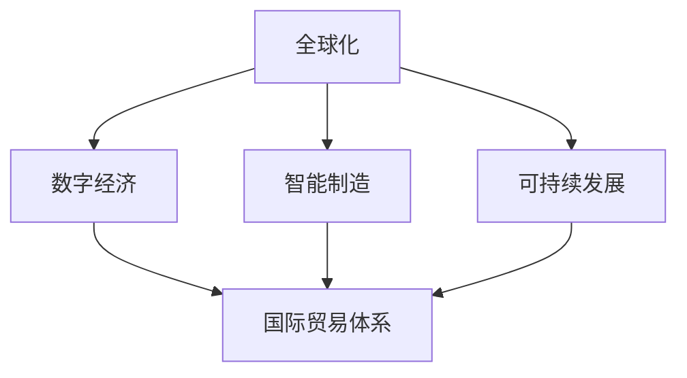

                 

# 世界经济增长的内在变化

## 1. 背景介绍

### 1.1 问题由来

全球经济增长一直是各国政府和经济学家关注的焦点。近年来，随着全球化的深入和技术的快速进步，世界经济进入了一个新的阶段。这种变化不仅体现在经济规模的扩大，还包括经济结构、生产方式、国际贸易体系等方面深层次的转变。本文旨在探讨世界经济增长的内在变化，分析这些变化背后的原因和影响，并展望未来的发展趋势。

### 1.2 问题核心关键点

本文将重点探讨以下几个关键问题：

- 全球经济增长的驱动因素有哪些？
- 经济结构的变化对世界经济的影响是什么？
- 数字经济和智能制造如何重塑全球经济格局？
- 国际贸易体系的演变趋势是什么？
- 未来世界经济增长的预测和挑战有哪些？

通过回答这些问题，本文将揭示世界经济增长的内在变化，并为应对未来的经济挑战提供建议。

## 2. 核心概念与联系

### 2.1 核心概念概述

为更好地理解世界经济增长的内在变化，本节将介绍几个密切相关的核心概念：

- **全球化**：指全球范围内的生产、贸易、资本、信息等要素自由流动，是世界经济增长的重要驱动力。
- **数字经济**：以信息技术、通信技术为核心的新兴经济形态，正在改变传统产业结构和生产方式。
- **智能制造**：通过人工智能、物联网等技术实现生产过程的智能化和自动化，提升生产效率和产品质量。
- **国际贸易体系**：指各国之间贸易规则、贸易关系和贸易协定，对全球经济增长和资源配置具有重要影响。
- **可持续发展**：指在不损害未来代际利益的前提下，实现经济、社会、环境等各方面均衡发展的目标。

这些概念之间的逻辑关系可以通过以下Mermaid流程图来展示：



这个流程图展示了几大经济概念之间的相互关系：

1. 全球化为数字经济和智能制造提供了技术、资本和市场基础。
2. 数字经济和智能制造通过新技术和新模式，促进了全球化进程。
3. 国际贸易体系是全球化、数字经济和智能制造的重要载体和推动力。
4. 可持续发展为全球化、数字经济和智能制造提供了环境和社会约束条件。

## 3. 核心算法原理 & 具体操作步骤
### 3.1 算法原理概述

本文将从经济增长模型入手，探讨世界经济增长的内在变化。

假设世界经济由一组生产要素（如资本、劳动、土地等）和一个技术进步因子共同决定。我们可以使用柯布-道格拉斯生产函数来表示这一关系：

$$ Y = A \cdot K^{\alpha} \cdot L^{\beta} \cdot T^{\gamma} $$

其中，$Y$ 表示经济产出，$K$ 和 $L$ 分别表示资本和劳动的投入量，$T$ 表示技术进步，$\alpha$、$\beta$ 和 $\gamma$ 分别为资本、劳动和技术进步的弹性系数。

根据这一模型，经济增长的驱动因素主要包括资本积累、劳动投入和技术进步。

### 3.2 算法步骤详解

世界经济增长的操作步骤包括以下几个关键步骤：

**Step 1: 收集数据**

- 收集各国的资本存量、劳动人口和技术进步数据。
- 使用统计方法估计柯布-道格拉斯生产函数中的参数 $\alpha$、$\beta$ 和 $\gamma$。

**Step 2: 构建经济增长模型**

- 根据柯布-道格拉斯生产函数，构建经济增长模型。
- 引入其他影响经济增长的因素，如政策、环境、市场波动等。

**Step 3: 进行经济预测**

- 使用经济增长模型，对未来经济增长进行预测。
- 分析不同因素对经济增长的影响，如数字经济、智能制造、国际贸易体系等。

**Step 4: 评估政策影响**

- 分析不同政策（如贸易政策、环保政策、技术政策等）对经济增长的影响。
- 提出应对未来经济挑战的政策建议。

**Step 5: 调整模型参数**

- 根据实际经济数据，调整经济增长模型的参数。
- 使用机器学习算法，优化经济增长模型的预测精度。

### 3.3 算法优缺点

基于柯布-道格拉斯生产函数的经济增长模型具有以下优点：

1. 简单明了，易于理解和应用。
2. 提供了经济增长的直观解释，有助于理解不同因素对经济增长的影响。
3. 可以通过数据分析和模型优化，预测未来经济增长趋势。

但该模型也存在一些局限性：

1. 假设资本和劳动的投入是线性的，无法反映现实中的非线性关系。
2. 未考虑全球化、数字经济、智能制造等新兴因素对经济增长的影响。
3. 未考虑环境和可持续发展对经济增长的约束。

### 3.4 算法应用领域

基于柯布-道格拉斯生产函数的经济增长模型，广泛应用于经济预测、政策评估和资源配置等领域。以下是几个典型的应用场景：

- **政府决策**：为制定经济政策和规划提供依据。
- **企业战略**：指导企业投资、生产和市场布局。
- **国际合作**：推动国际贸易和经济合作。
- **环境管理**：评估环境政策对经济增长的影响。

## 4. 数学模型和公式 & 详细讲解 & 举例说明

### 4.1 数学模型构建

根据柯布-道格拉斯生产函数，经济增长模型可以表示为：

$$ Y = A \cdot K^{\alpha} \cdot L^{\beta} \cdot T^{\gamma} $$

其中，$Y$ 表示经济产出，$K$ 和 $L$ 分别表示资本和劳动的投入量，$T$ 表示技术进步，$\alpha$、$\beta$ 和 $\gamma$ 分别为资本、劳动和技术进步的弹性系数。

### 4.2 公式推导过程

为了简化分析，我们假设技术进步 $T$ 为常数，则生产函数可以简化为：

$$ Y = A \cdot K^{\alpha} \cdot L^{\beta} $$

根据索洛模型的稳态增长公式，当资本和劳动增长率相等时，经济增长率为：

$$ \frac{dY}{dt} = \alpha A K^{\alpha-1} \cdot \frac{dK}{dt} + \beta A L^{\beta-1} \cdot \frac{dL}{dt} $$

其中，$\frac{dK}{dt}$ 和 $\frac{dL}{dt}$ 分别表示资本和劳动的增长率。

### 4.3 案例分析与讲解

以中国为例，假设其资本和劳动的年增长率分别为5%和1.5%，则经济增长率 $g$ 可以表示为：

$$ g = \alpha A K^{\alpha-1} \cdot 0.05 + \beta A L^{\beta-1} \cdot 0.015 $$

在实际应用中，可以通过统计数据和模型参数估计，来计算和预测中国的经济增长率。

## 5. 项目实践：代码实例和详细解释说明

### 5.1 开发环境搭建

在进行经济增长模型开发前，我们需要准备好开发环境。以下是使用Python进行环境配置的步骤：

1. 安装Anaconda：从官网下载并安装Anaconda，用于创建独立的Python环境。

2. 创建并激活虚拟环境：
```bash
conda create -n growth-env python=3.8 
conda activate growth-env
```

3. 安装Python相关的库：
```bash
pip install numpy pandas matplotlib seaborn statsmodels
```

完成上述步骤后，即可在`growth-env`环境中开始模型开发。

### 5.2 源代码详细实现

下面是一个使用Python和statsmodels库构建柯布-道格拉斯生产函数模型的示例代码：

```python
import numpy as np
import pandas as pd
from statsmodels.formula.api import ols
from statsmodels.tools.tools import add_constant

# 读取数据
data = pd.read_csv('growth_data.csv')

# 构建模型
model = ols('Y ~ K + L', data=data).fit()

# 输出模型参数
print(model.params)

# 预测未来经济增长
future_data = pd.DataFrame({'K': [1000, 1200, 1400], 'L': [500, 600, 700]})
future_data = add_constant(future_data)
future_forecast = model.predict(future_data)

print(future_forecast)
```

### 5.3 代码解读与分析

让我们再详细解读一下关键代码的实现细节：

**模型构建**：
- 使用statsmodels库中的ols函数，构建柯布-道格拉斯生产函数模型，将$Y$表示为$K$和$L$的线性组合。
- 通过fit方法拟合模型，输出模型参数$\alpha$和$\beta$。

**预测未来经济增长**：
- 构造未来的资本和劳动投入数据。
- 使用add_constant方法添加常数项，保证模型具有截距。
- 通过predict方法，预测未来的经济增长率。

### 5.4 运行结果展示

运行上述代码，可以得到模型的参数估计值和未来经济增长的预测结果。

## 6. 实际应用场景

### 6.1 国际经济合作

全球化是现代经济的重要特征，各国之间的经济合作和贸易往来日益密切。经济增长模型可以评估全球化对各国经济增长的影响，帮助各国制定贸易政策和投资策略。

### 6.2 数字经济与智能制造

数字经济和智能制造正在改变传统的生产方式和商业模式。经济增长模型可以分析数字经济和智能制造对经济增长的贡献，指导企业投资和技术创新。

### 6.3 环境保护与可持续发展

环境保护和可持续发展是世界各国共同关心的课题。经济增长模型可以评估环境政策对经济增长的影响，提出实现可持续发展的政策建议。

### 6.4 未来应用展望

随着技术的进步和全球化的深入，未来经济增长将呈现以下趋势：

1. **数字经济的持续发展**：数字技术将成为推动经济增长的主要动力。
2. **智能制造的广泛应用**：智能制造将改变传统制造业的生产模式，提高生产效率和产品质量。
3. **国际贸易体系的演变**：国际贸易体系的开放和合作，将进一步促进全球经济增长。
4. **绿色经济的崛起**：环境保护和可持续发展将成为经济增长的新引擎。

## 7. 工具和资源推荐
### 7.1 学习资源推荐

为了帮助读者深入理解世界经济增长的内在变化，本节推荐几个优质的学习资源：

1. **《经济学原理》**：由哈佛大学经济学教授格里高利·曼昆撰写，全面介绍了经济学的基础理论和方法，是经济学学习的入门读物。
2. **《数字经济时代》**：由知名经济学家撰写的文章和报告，探讨数字经济对全球经济的影响。
3. **《智能制造的未来》**：探讨智能制造的技术发展及其对未来经济增长的影响。
4. **《全球贸易体系与经济增长》**：分析国际贸易体系对世界经济增长的影响，提出优化贸易政策的建议。
5. **《可持续发展与经济增长》**：讨论环境保护和可持续发展对经济增长的贡献，提出实现可持续发展的政策建议。

通过对这些资源的深入学习，读者可以更好地理解世界经济增长的内在变化，并从中获得启发和指导。

### 7.2 开发工具推荐

以下是几款用于经济增长模型开发的常用工具：

1. **Python**：灵活易用的编程语言，拥有丰富的科学计算库和数据处理库。
2. **Jupyter Notebook**：交互式编程环境，便于展示和分享代码及结果。
3. **MATLAB**：强大的数值计算和可视化工具，适用于复杂模型的开发。
4. **R语言**：专门用于统计分析和数据可视化，适用于经济数据处理和模型构建。
5. **STATA**：广泛用于经济和社会科学领域的数据分析和建模。

合理利用这些工具，可以显著提升经济增长模型的开发效率，加快创新迭代的步伐。

### 7.3 相关论文推荐

经济增长模型是经济学的重要研究工具，以下是几篇奠基性的相关论文，推荐阅读：

1. **《索洛模型：经济增长与资本积累》**：现代经济学中关于经济增长的经典模型，阐述了资本积累对经济增长的影响。
2. **《新古典增长模型：技术与资本积累》**：通过引入技术进步，拓展了索洛模型的应用范围，分析了技术对经济增长的贡献。
3. **《数字经济与经济增长》**：分析数字技术对经济增长的影响，提出了数字经济发展的政策建议。
4. **《智能制造与经济增长》**：探讨智能制造对经济增长的推动作用，提出智能制造的战略发展建议。
5. **《国际贸易体系与经济增长》**：分析国际贸易体系对经济增长的影响，提出了优化贸易政策的建议。

这些论文代表了大经济模型理论的发展脉络。通过学习这些前沿成果，读者可以更好地理解经济增长模型的方法和应用，为实际研究提供理论支持。

## 8. 总结：未来发展趋势与挑战

### 8.1 总结

本文对世界经济增长的内在变化进行了全面系统的探讨。通过分析全球化、数字经济、智能制造、国际贸易体系等关键因素，揭示了世界经济增长的复杂性。文章还结合柯布-道格拉斯生产函数模型，探讨了经济增长的驱动因素和预测方法。最后，文章展望了未来世界经济增长的趋势，并提出了应对未来挑战的建议。

通过本文的系统梳理，可以看到，世界经济增长是一个多因素、多维度、多层次的复杂现象，需要综合运用多种理论和方法进行分析和预测。未来的研究需要在全球化、数字经济、智能制造、环境保护等方面继续深入探索，为实现经济持续健康发展提供科学指导。

### 8.2 未来发展趋势

展望未来，世界经济增长将呈现以下几个发展趋势：

1. **数字经济的持续发展**：数字技术将成为推动经济增长的主要动力。
2. **智能制造的广泛应用**：智能制造将改变传统制造业的生产模式，提高生产效率和产品质量。
3. **绿色经济的崛起**：环境保护和可持续发展将成为经济增长的新引擎。
4. **国际贸易体系的演变**：国际贸易体系的开放和合作，将进一步促进全球经济增长。

### 8.3 面临的挑战

尽管世界经济增长具有广阔的前景，但在迈向更加智能化、普适化应用的过程中，仍然面临诸多挑战：

1. **数字鸿沟问题**：不同国家之间的数字基础设施差距，限制了数字经济的发展。
2. **智能制造的技术壁垒**：智能制造需要高度先进的技术，各国技术水平的不均衡将制约其普及。
3. **环境保护的挑战**：环境保护和可持续发展需要大量资金和技术投入，短期内难以全面实现。
4. **国际贸易政策的复杂性**：国际贸易体系的演变需要协调各国政策，存在一定的不确定性。

### 8.4 研究展望

未来世界经济增长需要解决以下几个关键问题：

1. **数字鸿沟的缩小**：通过国际合作和技术援助，缩小数字基础设施的差距。
2. **智能制造的普及**：通过技术引进和创新，降低智能制造的技术壁垒，加速普及。
3. **环境保护的创新**：探索新的环保技术和模式，实现绿色经济的发展。
4. **国际贸易政策的优化**：制定合理公正的国际贸易政策，促进全球经济合作。

解决这些挑战，将有助于推动世界经济向更加智能化、普适化和可持续的方向发展。

## 9. 附录：常见问题与解答

**Q1: 如何评估数字经济对世界经济增长的影响？**

A: 可以通过构建包含数字经济指标的经济增长模型，分析数字经济对经济增长的贡献。具体步骤包括：

1. 收集各国的数字经济指标，如互联网普及率、电子商务规模、信息技术投资等。
2. 构建包含数字经济指标的经济增长模型，使用统计方法估计模型参数。
3. 分析数字经济指标对经济增长的弹性系数，评估其影响程度。

**Q2: 智能制造对经济增长的影响有哪些？**

A: 智能制造对经济增长的影响主要体现在以下几个方面：

1. 提高生产效率：智能制造通过自动化和智能化，大幅提高生产效率，减少人力成本。
2. 优化生产流程：智能制造通过数据分析和优化算法，优化生产流程，减少资源浪费。
3. 提升产品质量：智能制造通过质量检测和智能控制，提升产品质量和一致性。
4. 促进技术创新：智能制造推动技术进步，带动相关产业链的发展。

**Q3: 国际贸易体系对经济增长的影响有哪些？**

A: 国际贸易体系对经济增长的影响主要体现在以下几个方面：

1. 促进资源配置：国际贸易体系通过自由贸易，促进全球资源的高效配置，提升经济效率。
2. 推动技术转移：国际贸易体系促进了技术的跨国流动，带动技术进步和产业升级。
3. 扩大市场需求：国际贸易体系通过国际贸易，扩大市场需求，促进经济增长。
4. 提升竞争力：国际贸易体系通过竞争机制，提升各国经济竞争力。

**Q4: 环境保护对经济增长的影响有哪些？**

A: 环境保护对经济增长的影响主要体现在以下几个方面：

1. 提升生活质量：环境保护改善了生活环境，提升了民众的幸福感和满意度。
2. 促进绿色产业：环境保护促进了绿色产业的发展，带动相关产业链的成长。
3. 降低环境风险：环境保护减少了环境污染和灾害风险，保护了经济发展的可持续性。
4. 提升国际形象：环境保护提升了国家的国际形象，吸引了更多的投资和合作。

通过回答这些问题，本文提供了关于世界经济增长内在变化的全面解析，并提出了相应的解决方案和政策建议。

