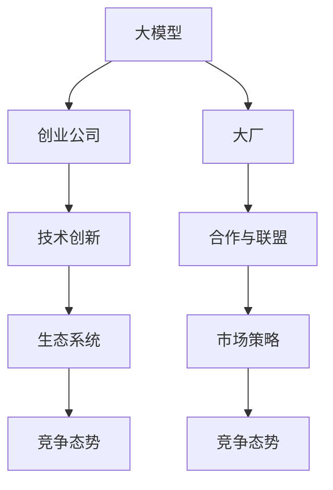

                 

# 中国大厂与大模型创业公司的竞争

## 1. 背景介绍

近年来，随着人工智能技术的飞速发展，大模型技术愈发成为各大企业争相布局的重点领域。以中国为代表的大型科技公司（以下简称“大厂”）与新兴的大模型创业公司（以下简称“创业公司”），在人工智能应用和落地场景中展开了激烈竞争。大厂凭借其强大的资本、技术、人才优势，在构建智能化解决方案方面表现突出；创业公司则以灵活机动、创新速度快的特点，快速抓住市场机会。双方各有所长，竞争态势错综复杂。本文旨在通过分析大厂与创业公司在技术、应用、资源等方面的竞争态势，为人工智能领域的从业人员提供参考，以期在未来的竞争中占据有利地位。

## 2. 核心概念与联系

### 2.1 核心概念概述

1. **大模型（Large Model）**：指具有大规模参数量，用于处理复杂任务的人工智能模型，如自然语言处理(NLP)中的BERT、GPT等模型。

2. **创业公司**：指以人工智能技术为核心竞争力，致力于提供创新解决方案的企业。

3. **大厂**：指拥有丰富资源和强大技术实力的大型科技公司，如阿里巴巴、腾讯、百度、字节跳动等。

4. **竞争态势**：指不同企业在大模型技术应用、产品落地、市场拓展等方面的相互博弈和争夺市场份额的行为。

5. **合作与联盟**：指企业之间基于各自优势，通过联合研发、技术共享等方式，实现互利共赢的合作模式。

6. **生态系统**：指由技术、数据、人才、应用场景等元素构成，相互依存、共同发展的复杂系统。

7. **技术创新**：指企业在新技术研发、应用场景探索等方面的持续探索和突破。

8. **市场策略**：指企业为提升自身竞争力，针对目标市场所采取的战略和措施。

### 2.2 核心概念原理和架构的 Mermaid 流程图



## 3. 核心算法原理 & 具体操作步骤

### 3.1 算法原理概述

大厂与创业公司在竞争中主要围绕以下几个方面展开：

1. **技术研发**：
   - 大厂拥有强大的技术团队和研发资源，可以投入大量人力和财力进行大模型技术的研究和优化。
   - 创业公司则以灵活机动、快速迭代的特点，持续推出创新解决方案和技术突破。

2. **应用落地**：
   - 大厂凭借其在行业积累的数据资源和应用场景，能够快速将大模型应用于企业内部或外部场景中。
   - 创业公司则以市场为导向，针对特定领域或需求，推出更具针对性的应用产品。

3. **市场策略**：
   - 大厂通过其庞大的市场影响力，进行广泛的市场推广和品牌建设。
   - 创业公司则以灵活的市场策略和精确定位，快速切入细分市场。

4. **生态合作**：
   - 大厂通过与科研机构、行业协会等合作，构建广泛的生态系统。
   - 创业公司则通过与初创企业、开发者等合作，快速提升自身技术实力和市场影响力。

5. **资源投入**：
   - 大厂在人才、数据、资本等方面具有显著优势，能够持续进行技术研发和市场投入。
   - 创业公司则通过高效利用有限资源，专注于技术突破和产品创新。

### 3.2 算法步骤详解

1. **技术研发**：
   - 大厂：组建强大的技术团队，进行基础研究、算法优化、模型训练等，推出具有技术领先性的大模型。
   - 创业公司：聚焦特定技术领域，利用灵活机制，快速迭代推出技术突破和创新应用。

2. **应用落地**：
   - 大厂：利用其在行业积累的数据资源，结合具体应用场景，快速部署大模型，提供定制化解决方案。
   - 创业公司：针对特定领域或需求，推出轻量级、高效能的应用产品，快速占领市场。

3. **市场策略**：
   - 大厂：通过市场推广、品牌建设、战略合作等方式，提升市场份额和品牌影响力。
   - 创业公司：通过灵活的市场策略、精准定位、快速响应市场需求，快速占领市场。

4. **生态合作**：
   - 大厂：通过与科研机构、行业协会等合作，构建广泛的生态系统，提升技术影响力。
   - 创业公司：通过与初创企业、开发者等合作，快速提升自身技术实力和市场影响力。

5. **资源投入**：
   - 大厂：在人才、数据、资本等方面具有显著优势，能够持续进行技术研发和市场投入。
   - 创业公司：通过高效利用有限资源，专注于技术突破和产品创新。

### 3.3 算法优缺点

#### 3.3.1 大厂的优缺点

**优点**：
1. **资源丰富**：大厂拥有庞大的资本、人才和数据资源，能够持续进行技术研发和市场投入。
2. **技术领先**：大厂具备强大的技术实力，能够推出具有技术领先性的产品。
3. **市场影响力**：大厂具有强大的市场影响力，能够快速推广和应用其大模型技术。

**缺点**：
1. **组织庞大**：大厂的组织结构庞大，决策链条长，灵活性相对较低。
2. **创新难度大**：大厂的技术研发和市场策略受制于现有业务模式和利益关系，创新难度较大。
3. **竞争压力**：大厂面临创业公司灵活机动、快速迭代的竞争压力，可能失去部分市场份额。

#### 3.3.2 创业公司的优缺点

**优点**：
1. **灵活机动**：创业公司以灵活机动、快速迭代的特点，能够快速抓住市场机会。
2. **创新能力强**：创业公司技术团队精干，聚焦特定技术领域，能够持续推出技术突破和创新应用。
3. **市场策略灵活**：创业公司能够通过灵活的市场策略和精准定位，快速占领市场。

**缺点**：
1. **资源有限**：创业公司在人才、数据、资本等方面相对有限，可能影响其长期发展。
2. **技术风险高**：创业公司面临较高的技术风险，若技术突破未能实现，可能影响市场竞争力。
3. **市场竞争力差**：创业公司规模较小，市场影响力相对较弱，可能难以对抗大厂的强大市场策略。

### 3.4 算法应用领域

大厂与创业公司在多个领域展开了竞争，主要包括但不限于以下方面：

1. **自然语言处理（NLP）**：
   - 大厂：推出具有技术领先性的语言模型，如百度的文心一言、腾讯的ERNIE等，广泛应用于智能客服、机器翻译、文本摘要等场景。
   - 创业公司：通过轻量级、高效能的语言模型，如智源AI的AIman-11，快速切入细分市场，提供定制化解决方案。

2. **计算机视觉（CV）**：
   - 大厂：推出大型的计算机视觉模型，如阿里巴巴的DAMO-ViT，广泛应用于图像识别、视频分析等场景。
   - 创业公司：通过高效能、低延迟的计算机视觉模型，如商汤科技的Swin Transformer，快速占领市场。

3. **推荐系统**：
   - 大厂：利用其庞大的数据资源，推出具有广泛应用的推荐系统，如阿里巴巴的天机算法、腾讯的推荐系统。
   - 创业公司：通过精确定位、快速迭代，推出针对特定场景的推荐系统，如艾博科技的推荐引擎。

4. **自动驾驶**：
   - 大厂：推出具有技术领先的自动驾驶系统，如百度的Apollo、腾讯的Timi AI，广泛应用于智能交通、自动驾驶汽车等场景。
   - 创业公司：通过创新技术突破和灵活的市场策略，推出具有竞争力的自动驾驶系统，如AutoX智能驾驶系统。

## 4. 数学模型和公式 & 详细讲解 & 举例说明

### 4.1 数学模型构建

大厂与创业公司在竞争中，数学模型主要应用于以下几个方面：

1. **大模型训练**：通过优化算法和损失函数，对大模型进行训练，提升模型性能。
2. **应用模型评估**：通过评估指标，如准确率、召回率、F1分数等，评估模型在特定应用场景中的表现。
3. **市场竞争分析**：通过竞争分析模型，评估竞争对手的市场表现和策略，制定自身市场策略。

### 4.2 公式推导过程

以自然语言处理中的BERT模型为例，推导其训练和评估公式。

BERT模型基于Transformer结构，其训练过程主要包括预训练和微调两个阶段：

1. **预训练**：
   - 损失函数：
     $$
     L_{pre} = \frac{1}{N} \sum_{i=1}^N (L_{masked\_predict} + L_{next\_sentence\_predict})
     $$
     其中 $L_{masked\_predict}$ 表示掩码语言模型损失，$L_{next\_sentence\_predict}$ 表示下一句预测损失。

2. **微调**：
   - 损失函数：
     $$
     L_{fine\_tune} = \frac{1}{N} \sum_{i=1}^N \ell(M_{\theta}(x_i),y_i)
     $$
     其中 $\ell$ 为特定任务的损失函数，如交叉熵损失。

3. **应用评估**：
   - 准确率（Precision）：
     $$
     P = \frac{TP}{TP+FP}
     $$
   - 召回率（Recall）：
     $$
     R = \frac{TP}{TP+FN}
     $$
   - F1分数（F1 Score）：
     $$
     F1 = 2 \times \frac{P \times R}{P + R}
     $$

### 4.3 案例分析与讲解

以百度的文心一言为例，分析其技术研发和市场策略。

1. **技术研发**：
   - 文心一言基于BERT模型进行预训练，通过大规模数据和算法优化，提升了模型的语言理解能力。
   - 在微调阶段，利用特定任务的标注数据，对模型进行任务适配，提升了模型在特定任务中的表现。

2. **市场策略**：
   - 百度通过其强大的市场影响力，进行广泛的市场推广和品牌建设，提升市场份额。
   - 通过与科研机构、行业协会等合作，构建广泛的生态系统，提升技术影响力。

## 5. 项目实践：代码实例和详细解释说明

### 5.1 开发环境搭建

以下是使用Python进行BERT微调的开发环境搭建流程：

1. 安装Anaconda：
   ```bash
   conda create -n pytorch-env python=3.8 
   conda activate pytorch-env
   ```

2. 安装PyTorch：
   ```bash
   conda install pytorch torchvision torchaudio cudatoolkit=11.1 -c pytorch -c conda-forge
   ```

3. 安装Transformers库：
   ```bash
   pip install transformers
   ```

4. 安装各类工具包：
   ```bash
   pip install numpy pandas scikit-learn matplotlib tqdm jupyter notebook ipython
   ```

### 5.2 源代码详细实现

以下是在TensorFlow框架下对BERT进行微调的PyTorch代码实现：

```python
from transformers import BertTokenizer, BertForSequenceClassification
import torch
import tensorflow as tf

# 加载预训练模型和分词器
tokenizer = BertTokenizer.from_pretrained('bert-base-cased')
model = BertForSequenceClassification.from_pretrained('bert-base-cased', num_labels=2)

# 定义数据处理函数
def create_dataset(texts, labels, tokenizer, max_len=128):
    encoding = tokenizer(texts, return_tensors='tf', max_length=max_len, padding='max_length', truncation=True)
    input_ids = encoding['input_ids']
    attention_mask = encoding['attention_mask']
    labels = tf.convert_to_tensor(labels, dtype=tf.int64)
    return {
        'input_ids': input_ids.numpy(),
        'attention_mask': attention_mask.numpy(),
        'labels': labels.numpy()
    }

# 加载训练集和验证集
train_dataset = create_dataset(train_texts, train_labels, tokenizer)
dev_dataset = create_dataset(dev_texts, dev_labels, tokenizer)

# 定义优化器
optimizer = tf.keras.optimizers.AdamW(learning_rate=2e-5)

# 定义损失函数
loss_fn = tf.keras.losses.SparseCategoricalCrossentropy(from_logits=True)

# 定义模型训练函数
def train_step(inputs):
    model.train()
    with tf.GradientTape() as tape:
        outputs = model(inputs['input_ids'], attention_mask=inputs['attention_mask'])
        loss = loss_fn(inputs['labels'], outputs.logits, reduction=tf.keras.losses.Reduction.NONE)
    gradients = tape.gradient(loss, model.trainable_variables)
    optimizer.apply_gradients(zip(gradients, model.trainable_variables))
    return loss.numpy()

# 定义模型评估函数
def evaluate_step(inputs):
    model.eval()
    with tf.GradientTape() as tape:
        outputs = model(inputs['input_ids'], attention_mask=inputs['attention_mask'])
        loss = loss_fn(inputs['labels'], outputs.logits, reduction=tf.keras.losses.Reduction.NONE)
    return loss.numpy()

# 训练和评估模型
epochs = 5
batch_size = 16

for epoch in range(epochs):
    total_loss = 0
    for batch in train_dataset:
        loss = train_step(batch)
        total_loss += loss
    print(f'Epoch {epoch+1}, train loss: {total_loss/len(train_dataset):.3f}')

    total_loss = 0
    for batch in dev_dataset:
        loss = evaluate_step(batch)
        total_loss += loss
    print(f'Epoch {epoch+1}, dev loss: {total_loss/len(dev_dataset):.3f}')
```

### 5.3 代码解读与分析

1. **数据处理函数**：
   - 定义数据处理函数 `create_dataset`，将文本数据转化为模型所需的格式，并计算标签。

2. **加载数据集**：
   - 使用 `create_dataset` 函数加载训练集和验证集，转化为模型所需的格式。

3. **定义优化器**：
   - 使用 `AdamW` 优化器，设置学习率。

4. **定义损失函数**：
   - 使用 `SparseCategoricalCrossentropy` 损失函数，适用于多分类任务。

5. **模型训练和评估函数**：
   - 定义 `train_step` 和 `evaluate_step` 函数，分别用于模型训练和评估。

6. **训练和评估模型**：
   - 设置训练轮数和批次大小，循环训练模型并打印训练和评估结果。

## 6. 实际应用场景

### 6.1 智能客服系统

大厂和创业公司均在智能客服系统中进行了广泛应用。例如，百度的文心一言广泛应用于智能客服场景，通过微调BERT模型，提升了客服系统的对话理解和回复能力。

### 6.2 金融舆情监测

大厂和创业公司也在金融舆情监测领域展开了竞争。例如，阿里巴巴的大模型技术被应用于金融舆情监测，通过微调BERT模型，提升了金融舆情的监测和分析能力。

### 6.3 个性化推荐系统

个性化推荐系统也是大厂和创业公司竞争的重要领域。例如，腾讯的推荐系统通过微调BERT模型，实现了个性化推荐，提升了用户体验。

### 6.4 未来应用展望

未来，大厂和创业公司将在更多领域展开竞争。例如，在智慧医疗、智慧教育、智慧城市等领域，双方将进一步拓展大模型的应用场景，提升技术水平和市场竞争力。

## 7. 工具和资源推荐

### 7.1 学习资源推荐

1. **《Transformer从原理到实践》系列博文**：介绍Transformer原理、BERT模型、微调技术等前沿话题，适合从业者学习。

2. **CS224N《深度学习自然语言处理》课程**：斯坦福大学开设的NLP明星课程，涵盖NLP基本概念和经典模型。

3. **《Natural Language Processing with Transformers》书籍**：Transformers库的作者所著，全面介绍NLP任务开发，包括微调范式。

4. **HuggingFace官方文档**：提供预训练模型和微调样例，是微调开发的必备资料。

5. **CLUE开源项目**：提供中文NLP数据集和基准测试，助力中文NLP技术发展。

### 7.2 开发工具推荐

1. **PyTorch**：基于Python的开源深度学习框架，适合快速迭代研究。

2. **TensorFlow**：Google主导的深度学习框架，适合大规模工程应用。

3. **Transformers库**：提供预训练语言模型和微调方法，是微调开发的利器。

4. **Weights & Biases**：实验跟踪工具，记录和可视化模型训练指标。

5. **TensorBoard**：TensorFlow配套的可视化工具，监测模型训练状态。

### 7.3 相关论文推荐

1. **Attention is All You Need**：Transformer原论文，开创了大模型时代。

2. **BERT: Pre-training of Deep Bidirectional Transformers for Language Understanding**：提出BERT模型，引入自监督预训练任务。

3. **Language Models are Unsupervised Multitask Learners（GPT-2论文）**：展示大模型zero-shot学习能力，引发对通用人工智能的思考。

4. **Parameter-Efficient Transfer Learning for NLP**：提出Adapter等参数高效微调方法，提高微调效率。

5. **Prefix-Tuning: Optimizing Continuous Prompts for Generation**：引入连续型Prompt，实现无监督微调。

## 8. 总结：未来发展趋势与挑战

### 8.1 研究成果总结

大厂与创业公司在技术、应用、资源等方面展开激烈竞争，取得了显著进展。大厂凭借其强大的资本、技术、人才优势，推出了具有技术领先性的解决方案；创业公司则以灵活机动、快速迭代的特点，快速占领市场。双方各有优势，竞争态势复杂多变。

### 8.2 未来发展趋势

未来，大厂与创业公司将在更多领域展开竞争，探索大模型技术的更多应用场景，提升技术水平和市场竞争力。

### 8.3 面临的挑战

大厂和创业公司在竞争中面临诸多挑战：

1. **资源有限**：创业公司在人才、数据、资本等方面相对有限，可能影响其长期发展。
2. **技术风险高**：创业公司面临较高的技术风险，若技术突破未能实现，可能影响市场竞争力。
3. **市场策略差异**：大厂和创业公司在市场策略上存在差异，影响其市场表现。
4. **合作与竞争**：双方在合作与竞争中寻求平衡，影响其技术发展和市场拓展。

### 8.4 研究展望

未来，大厂和创业公司需要在技术创新、应用落地、市场策略等方面进行深入研究，积极应对挑战，提升竞争力。

## 9. 附录：常见问题与解答

**Q1：大厂与创业公司在技术研发上谁更具优势？**

A: 大厂在技术研发方面具有显著优势，拥有强大的技术团队和丰富的资源。但创业公司灵活机动、快速迭代的特点，在某些特定领域可能更具优势。

**Q2：大厂与创业公司在应用落地上有何不同？**

A: 大厂凭借其在行业积累的数据资源和应用场景，能够快速将大模型应用于企业内部或外部场景中；创业公司则通过精确定位、快速迭代，推出轻量级、高效能的应用产品，快速占领市场。

**Q3：大厂与创业公司在市场策略上谁更具优势？**

A: 大厂具有强大的市场影响力，能够进行广泛的市场推广和品牌建设；创业公司通过灵活的市场策略和精准定位，快速占领市场。

**Q4：大厂与创业公司在生态合作上有何不同？**

A: 大厂通过与科研机构、行业协会等合作，构建广泛的生态系统；创业公司通过与初创企业、开发者等合作，快速提升自身技术实力和市场影响力。

**Q5：大厂与创业公司在资源投入上有何不同？**

A: 大厂在人才、数据、资本等方面具有显著优势，能够持续进行技术研发和市场投入；创业公司通过高效利用有限资源，专注于技术突破和产品创新。

---

作者：禅与计算机程序设计艺术 / Zen and the Art of Computer Programming

