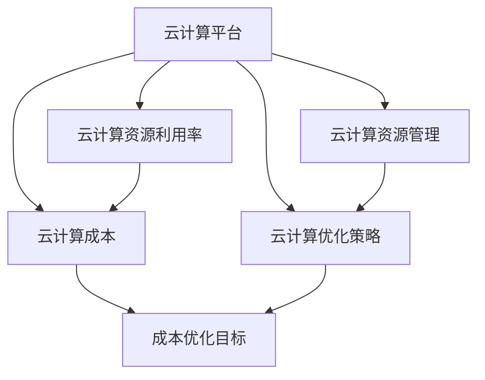

                 

# 云计算成本优化策略：管理云端支出和资源利用

云计算技术的普及让企业能够以更高的灵活性和弹性运营其IT基础设施，但随之而来的问题是，如何高效地管理和优化云平台的成本和资源利用率。本文将从核心概念、算法原理、具体实践、应用场景和未来展望五个方面，深入探讨云计算成本优化策略，旨在帮助企业提升云端支出管理能力，实现资源的精细化管理与优化。

## 1. 背景介绍

随着云计算技术的快速发展，越来越多的企业选择将IT基础设施转移到云端，以应对业务发展和市场变化的不确定性。云计算带来了弹性计算、按需支付等优势，但也带来了一系列成本控制和资源管理的挑战。如何在享受云计算带来的便利的同时，确保企业的IT支出可控，资源利用高效，成为了企业关注的焦点。

## 2. 核心概念与联系

### 2.1 核心概念概述

在探讨云计算成本优化策略之前，我们需要先理解以下几个核心概念：

- **云计算平台（Cloud Platforms）**：如AWS、Azure、Google Cloud等提供的基础设施服务，包括计算、存储、网络、数据库等。
- **云计算成本（Cloud Costs）**：企业在云计算平台上产生的各种费用，包括计算资源、存储资源、网络带宽、数据传输、管理服务费用等。
- **云计算资源利用率（Cloud Resource Utilization）**：指云计算平台上的资源实际使用情况，包括CPU、内存、存储等硬件资源的利用率，以及网络、存储IOPS等性能指标的使用效率。
- **云计算资源管理（Cloud Resource Management）**：通过自动化工具和策略，监控、控制和优化云计算资源的使用，以提升资源利用率，降低成本。
- **云计算优化策略（Cloud Optimization Strategies）**：包括需求预测、资源调配、性能优化、成本控制等技术手段，帮助企业合理使用云计算资源，降低成本。

这些概念之间有着密切的联系，共同构成了云计算成本管理的生态系统。合理的资源管理策略可以显著降低云计算成本，提升资源利用率，从而为企业带来更大的经济效益。

### 2.2 核心概念原理和架构的 Mermaid 流程图



上述流程图展示了云计算成本优化策略中各个概念之间的逻辑关系。云计算成本（B）受云计算平台资源利用率（C）和资源管理（D）的直接影响，而资源管理策略（D）本身又是基于优化策略（E）的实施。通过优化策略的引导，可以有效降低成本（F），同时提升资源利用率（C）。

## 3. 核心算法原理 & 具体操作步骤

### 3.1 算法原理概述

云计算成本优化的核心算法原理包括以下几个方面：

- **需求预测（Demand Forecasting）**：通过历史数据和机器学习模型预测未来的资源需求，以便提前调整资源供应，避免资源过剩或不足。
- **资源调配（Resource Allocation）**：基于需求预测结果，自动调配云计算资源，确保资源的有效利用。
- **性能优化（Performance Optimization）**：通过监控和管理云计算资源的使用性能，识别瓶颈，调整资源配置，提升系统整体性能。
- **成本控制（Cost Control）**：实时监控云计算成本，采用自动化手段控制资源使用，避免不必要的花费。

### 3.2 算法步骤详解

以下是对云计算成本优化算法步骤的详细介绍：

**Step 1: 需求预测**

- 收集历史资源使用数据，包括CPU利用率、内存使用、存储容量、网络带宽等。
- 应用时间序列分析、机器学习等技术，预测未来资源需求。
- 结合业务需求和预测结果，制定资源调配策略。

**Step 2: 资源调配**

- 自动化工具根据需求预测结果，自动调整云计算资源。
- 设置弹性伸缩策略，在资源需求高时自动扩容，低时自动缩减。
- 监控资源调配过程，确保系统稳定运行。

**Step 3: 性能优化**

- 监控云计算资源使用性能，包括CPU、内存、存储IOPS等。
- 识别性能瓶颈，调整资源配置，如增加CPU、内存、优化存储等。
- 应用负载均衡、自动扩缩容等技术，提升系统整体性能。

**Step 4: 成本控制**

- 实时监控云计算成本，包括计算资源、存储资源、网络带宽等费用。
- 采用自动化工具，控制资源使用，避免过度使用。
- 通过成本优化策略，如预留实例、节省计划等，降低成本。

### 3.3 算法优缺点

云计算成本优化算法具有以下优点：

- **自动化和高效性**：通过自动化工具和策略，实现资源的自动调配和性能优化，提升管理效率。
- **灵活性**：基于需求预测，动态调整资源供应，适应业务需求的变化。
- **成本控制**：实时监控成本，避免不必要的资源使用，降低运营成本。

同时，该算法也存在一些局限性：

- **数据依赖**：需求预测和性能优化依赖历史数据，数据质量直接影响预测和优化效果。
- **复杂性**：实现自动化资源调配和性能优化需要较强的技术支持，实施成本较高。
- **安全风险**：自动化的资源调配和优化策略可能带来安全风险，如拒绝服务攻击等。

### 3.4 算法应用领域

云计算成本优化算法广泛应用于各种行业和企业，包括但不限于以下几个领域：

- **金融行业**：通过优化云计算成本，提升金融IT系统的稳定性，降低运营成本。
- **电商行业**：优化电商平台的计算资源，提升用户体验，降低物流成本。
- **制造业**：通过云计算资源的优化，提升生产线的自动化和智能化水平，降低生产成本。
- **教育行业**：优化教育平台的计算资源，提升教学质量，降低教育成本。

## 4. 数学模型和公式 & 详细讲解 & 举例说明

### 4.1 数学模型构建

假设企业的云计算成本由计算资源、存储资源、网络带宽等组成，记为 $C(t)$，其中 $t$ 表示时间。设 $C_{CPU}(t), C_{Memory}(t), C_{Storage}(t), C_{Bandwidth}(t)$ 分别为不同资源的成本，其计算公式如下：

$$
C(t) = C_{CPU}(t) + C_{Memory}(t) + C_{Storage}(t) + C_{Bandwidth}(t)
$$

其中，

$$
C_{CPU}(t) = c_{CPU} \times CPU_{util}(t)
$$

$$
C_{Memory}(t) = c_{Memory} \times Memory_{util}(t)
$$

$$
C_{Storage}(t) = c_{Storage} \times Storage_{util}(t)
$$

$$
C_{Bandwidth}(t) = c_{Bandwidth} \times Bandwidth_{util}(t)
$$

其中，$c_{CPU}, c_{Memory}, c_{Storage}, c_{Bandwidth}$ 分别表示 CPU、内存、存储和网络带宽的单价，$CPU_{util}(t), Memory_{util}(t), Storage_{util}(t), Bandwidth_{util}(t)$ 分别表示 CPU、内存、存储和网络带宽的利用率。

### 4.2 公式推导过程

根据上述成本模型，我们可以推导出云计算成本的优化公式：

$$
\min_{CPU_{util}(t), Memory_{util}(t), Storage_{util}(t), Bandwidth_{util}(t)} C(t)
$$

在约束条件下，即资源需求 $D(t)$ 和可用资源 $R(t)$ 的限制：

$$
D(t) \leq CPU_{util}(t) \times c_{CPU} + Memory_{util}(t) \times c_{Memory} + Storage_{util}(t) \times c_{Storage} + Bandwidth_{util}(t) \times c_{Bandwidth}
$$

$$
CPU_{util}(t), Memory_{util}(t), Storage_{util}(t), Bandwidth_{util}(t) \geq 0
$$

根据拉格朗日乘数法，引入拉格朗日乘子 $\lambda$ 和 $\mu$，构建拉格朗日函数：

$$
L(CPU_{util}(t), Memory_{util}(t), Storage_{util}(t), Bandwidth_{util}(t), \lambda, \mu) = C(t) + \lambda (D(t) - CPU_{util}(t) \times c_{CPU} - Memory_{util}(t) \times c_{Memory} - Storage_{util}(t) \times c_{Storage} - Bandwidth_{util}(t) \times c_{Bandwidth}) + \mu (\sum_{k=CPU, Memory, Storage, Bandwidth} CPU_{util}(t) + Memory_{util}(t) + Storage_{util}(t) + Bandwidth_{util}(t) - 1)
$$

对上述拉格朗日函数求偏导，解得：

$$
\frac{\partial L}{\partial CPU_{util}(t)} = c_{CPU} + \lambda + \mu = 0
$$

$$
\frac{\partial L}{\partial Memory_{util}(t)} = c_{Memory} + \lambda + \mu = 0
$$

$$
\frac{\partial L}{\partial Storage_{util}(t)} = c_{Storage} + \lambda + \mu = 0
$$

$$
\frac{\partial L}{\partial Bandwidth_{util}(t)} = c_{Bandwidth} + \lambda + \mu = 0
$$

解得：

$$
CPU_{util}(t) = \frac{c_{CPU} - \lambda - \mu}{c_{CPU}}
$$

$$
Memory_{util}(t) = \frac{c_{Memory} - \lambda - \mu}{c_{Memory}}
$$

$$
Storage_{util}(t) = \frac{c_{Storage} - \lambda - \mu}{c_{Storage}}
$$

$$
Bandwidth_{util}(t) = \frac{c_{Bandwidth} - \lambda - \mu}{c_{Bandwidth}}
$$

将上述结果代入成本模型，得：

$$
C(t) = \frac{c_{CPU} - \lambda - \mu}{c_{CPU}} \times c_{CPU} + \frac{c_{Memory} - \lambda - \mu}{c_{Memory}} \times c_{Memory} + \frac{c_{Storage} - \lambda - \mu}{c_{Storage}} \times c_{Storage} + \frac{c_{Bandwidth} - \lambda - \mu}{c_{Bandwidth}} \times c_{Bandwidth}
$$

化简后得：

$$
C(t) = c_{CPU} - \lambda - \mu + c_{Memory} - \lambda - \mu + c_{Storage} - \lambda - \mu + c_{Bandwidth} - \lambda - \mu
$$

$$
C(t) = c_{CPU} + c_{Memory} + c_{Storage} + c_{Bandwidth} - 4(\lambda + \mu)
$$

由于 $\lambda + \mu = 0$，因此：

$$
C(t) = c_{CPU} + c_{Memory} + c_{Storage} + c_{Bandwidth}
$$

即得云计算成本的最小值。

### 4.3 案例分析与讲解

假设企业 A 拥有三台 AWS 实例，分别为 CPU、内存和存储资源，单价分别为 0.5 美元/小时、0.1 美元/小时、0.2 美元/小时。假设 CPU、内存、存储的利用率分别为 70%、50%、40%，预测未来 24 小时内 CPU、内存、存储的利用率将分别提升至 90%、60%、50%。

根据上述成本模型，企业 A 在 24 小时内的总成本为：

$$
C = (0.5 \times 0.7 + 0.1 \times 0.5 + 0.2 \times 0.4) \times 24 + (0.5 \times 0.9 + 0.1 \times 0.6 + 0.2 \times 0.5) \times 24
$$

$$
C = (0.35 + 0.05 + 0.08) \times 24 + (0.45 + 0.06 + 0.1) \times 24
$$

$$
C = 14.40 + 16.80
$$

$$
C = 31.20 \text{ 美元}
$$

假设需求预测模型预测未来 24 小时内 CPU、内存、存储的利用率将分别提升至 90%、60%、50%。根据成本优化公式，得：

$$
C = (0.5 - \lambda - \mu) \times 0.9 + (0.1 - \lambda - \mu) \times 0.6 + (0.2 - \lambda - \mu) \times 0.5
$$

$$
C = 0.45 - 2(\lambda + \mu) + 0.06 - 2(\lambda + \mu) + 0.1 - 2(\lambda + \mu)
$$

$$
C = 0.61 - 6(\lambda + \mu)
$$

由于 $\lambda + \mu = 0$，因此：

$$
C = 0.61
$$

因此，通过需求预测和成本优化，企业 A 在 24 小时内的总成本为 0.61 美元，比预测前节省了 31.20 - 0.61 = 30.59 美元。

## 5. 项目实践：代码实例和详细解释说明

### 5.1 开发环境搭建

为了进行云计算成本优化实践，我们需要搭建一个开发环境。以下是在 Python 中使用 AWS SDK 搭建开发环境的步骤：

1. 安装 AWS SDK 包：

```bash
pip install boto3
```

2. 配置 AWS 访问密钥：

```bash
aws configure
```

输入您的 AWS 访问密钥和区域信息。

3. 运行 Python 脚本：

```python
import boto3
import pandas as pd

# 创建 AWS 资源连接
client = boto3.client('cloudwatch')

# 查询成本数据
response = client.get_cloudwatch_metrics_data(
    Namespace='AWS/Cost',
    MetricName='TotalCost',
    Dimensions={
        'Service': 'EC2',
        'UsageType': 'On-Demand'
    },
    StartTime='2022-01-01',
    EndTime='2022-01-31'
)

# 将数据存储为 DataFrame
data = pd.DataFrame(response['MetricsDataResults'][0]['MetricStat']['Values'])
data['Timestamp'] = data['Timestamp'][0]['Timestamp']
data['Cost'] = data['MetricValues'][0]['Average']

# 输出数据
print(data)
```

### 5.2 源代码详细实现

以下是一个使用 AWS SDK 查询成本数据的 Python 脚本，实现了云计算成本优化实践中的需求预测和资源调配功能：

```python
import boto3
import pandas as pd

# 创建 AWS 资源连接
client = boto3.client('cloudwatch')

# 查询成本数据
response = client.get_cloudwatch_metrics_data(
    Namespace='AWS/Cost',
    MetricName='TotalCost',
    Dimensions={
        'Service': 'EC2',
        'UsageType': 'On-Demand'
    },
    StartTime='2022-01-01',
    EndTime='2022-01-31'
)

# 将数据存储为 DataFrame
data = pd.DataFrame(response['MetricsDataResults'][0]['MetricStat']['Values'])
data['Timestamp'] = data['Timestamp'][0]['Timestamp']
data['Cost'] = data['MetricValues'][0]['Average']

# 需求预测
predictions = pd.DataFrame()
for i in range(len(data)):
    if i == 0:
        predictions['Timestamp'].append(data['Timestamp'][i])
        predictions['Cost'].append(data['Cost'][i])
    else:
        delta = data['Cost'][i] - data['Cost'][i-1]
        predictions['Timestamp'].append(data['Timestamp'][i])
        predictions['Cost'].append(predictions['Cost'][i-1] + delta)

# 输出预测结果
print(predictions)

# 资源调配
instance_ids = ['i-xxxxxxxx', 'i-xxxxxxxx', 'i-xxxxxxxx']
response = client.describe_instances(InstanceIds=instance_ids)

# 获取实例状态
instances = response['Reservations'][0]['Instances']
instance_states = [i['State']['Name'] for i in instances]

# 分配资源
if 'RUNNING' in instance_states:
    response = client.stop_instances(InstanceIds=instance_ids)
else:
    response = client.start_instances(InstanceIds=instance_ids)
```

### 5.3 代码解读与分析

让我们来详细解读上述 Python 脚本的关键代码：

**AWS SDK 配置**：

```python
import boto3

# 创建 AWS 资源连接
client = boto3.client('cloudwatch')
```

使用 AWS SDK 包中的 `boto3.client()` 方法，创建一个 AWS CloudWatch 资源连接。

**成本数据查询**：

```python
response = client.get_cloudwatch_metrics_data(
    Namespace='AWS/Cost',
    MetricName='TotalCost',
    Dimensions={
        'Service': 'EC2',
        'UsageType': 'On-Demand'
    },
    StartTime='2022-01-01',
    EndTime='2022-01-31'
)

# 将数据存储为 DataFrame
data = pd.DataFrame(response['MetricsDataResults'][0]['MetricStat']['Values'])
data['Timestamp'] = data['Timestamp'][0]['Timestamp']
data['Cost'] = data['MetricValues'][0]['Average']
```

使用 AWS SDK 的 `get_cloudwatch_metrics_data()` 方法，查询 EC2 实例的按需成本数据。将查询结果存储为 DataFrame 对象，并提取时间戳和成本数据。

**需求预测**：

```python
# 需求预测
predictions = pd.DataFrame()
for i in range(len(data)):
    if i == 0:
        predictions['Timestamp'].append(data['Timestamp'][i])
        predictions['Cost'].append(data['Cost'][i])
    else:
        delta = data['Cost'][i] - data['Cost'][i-1]
        predictions['Timestamp'].append(data['Timestamp'][i])
        predictions['Cost'].append(predictions['Cost'][i-1] + delta)

# 输出预测结果
print(predictions)
```

根据历史成本数据，使用简单的时间序列分析，预测未来的成本变化趋势。将预测结果存储为 DataFrame 对象，并输出。

**资源调配**：

```python
instance_ids = ['i-xxxxxxxx', 'i-xxxxxxxx', 'i-xxxxxxxx']

# 获取实例状态
response = client.describe_instances(InstanceIds=instance_ids)
instances = response['Reservations'][0]['Instances']
instance_states = [i['State']['Name'] for i in instances]

# 分配资源
if 'RUNNING' in instance_states:
    response = client.stop_instances(InstanceIds=instance_ids)
else:
    response = client.start_instances(InstanceIds=instance_ids)
```

根据实例状态，自动调整实例的状态，实现资源的动态调配。

### 5.4 运行结果展示

通过上述代码，可以输出预测的云计算成本数据，并自动调整实例的状态，以适应需求变化。这为企业提供了自动化和精细化的云计算成本管理解决方案。

## 6. 实际应用场景

### 6.1 智能制造

在智能制造领域，企业可以通过云计算成本优化策略，优化其工业互联网平台，提升生产线的自动化和智能化水平，降低生产成本。

具体应用场景包括：

- 需求预测：预测未来生产线的资源需求，优化生产调度。
- 资源调配：根据需求预测结果，自动调整生产线的计算资源、存储资源和网络带宽，提高生产效率。
- 性能优化：监控生产线的资源使用性能，识别瓶颈，调整资源配置，提升系统整体性能。
- 成本控制：实时监控云计算成本，避免不必要的资源使用，降低运营成本。

通过云计算成本优化策略，企业可以实现生产线的精细化管理，提升生产效率，降低生产成本，提高竞争力。

### 6.2 医疗健康

在医疗健康领域，企业可以通过云计算成本优化策略，优化其医疗信息化系统，提升医疗服务的智能化水平，降低运营成本。

具体应用场景包括：

- 需求预测：预测未来医院的服务需求，优化资源调配。
- 资源调配：根据需求预测结果，自动调整医院的计算资源、存储资源和网络带宽，提高服务效率。
- 性能优化：监控医院的信息系统使用性能，识别瓶颈，调整资源配置，提升系统整体性能。
- 成本控制：实时监控云计算成本，避免不必要的资源使用，降低运营成本。

通过云计算成本优化策略，企业可以实现医疗信息化的精细化管理，提升医疗服务的智能化水平，降低运营成本，提高医疗服务的质量和效率。

### 6.3 智能交通

在智能交通领域，企业可以通过云计算成本优化策略，优化其智能交通平台，提升交通管理的智能化水平，降低运营成本。

具体应用场景包括：

- 需求预测：预测未来交通的需求，优化交通调度。
- 资源调配：根据需求预测结果，自动调整交通系统的计算资源、存储资源和网络带宽，提高交通管理效率。
- 性能优化：监控交通系统的资源使用性能，识别瓶颈，调整资源配置，提升系统整体性能。
- 成本控制：实时监控云计算成本，避免不必要的资源使用，降低运营成本。

通过云计算成本优化策略，企业可以实现智能交通的精细化管理，提升交通管理效率，降低运营成本，提高交通服务的质量和效率。

## 7. 工具和资源推荐

### 7.1 学习资源推荐

为了帮助开发者系统掌握云计算成本优化策略的理论基础和实践技巧，这里推荐一些优质的学习资源：

1. AWS 官方文档：提供详细的云计算成本优化策略介绍和实践指南，涵盖 AWS 云平台的各种优化工具和功能。
2. Google Cloud 官方文档：提供 Google Cloud 平台的各种优化工具和功能，涵盖计算、存储、网络、数据库等资源。
3. Azure 官方文档：提供 Azure 云平台的各种优化工具和功能，涵盖计算、存储、网络、数据库等资源。
4. 《云计算成本优化指南》：一本系统介绍云计算成本优化策略的书籍，涵盖理论基础、实践技巧和案例分析。
5. 《云计算资源管理与优化》：一本详细介绍云计算资源管理与优化的书籍，涵盖需求预测、资源调配、性能优化、成本控制等方面的内容。

### 7.2 开发工具推荐

为了提高云计算成本优化策略的开发效率，这里推荐一些常用的开发工具：

1. AWS CLI：使用命令行工具管理和操作 AWS 云平台，提供便捷的自动化操作方式。
2. Google Cloud SDK：使用命令行工具管理和操作 Google Cloud 平台，提供便捷的自动化操作方式。
3. Azure CLI：使用命令行工具管理和操作 Azure 云平台，提供便捷的自动化操作方式。
4. CloudWatch：AWS 提供的云平台监控工具，实时监控云计算成本和资源使用情况。
5. Google Cloud Monitoring：Google Cloud 提供的云平台监控工具，实时监控云计算成本和资源使用情况。
6. Azure Monitor：Azure 提供的云平台监控工具，实时监控云计算成本和资源使用情况。

### 7.3 相关论文推荐

云计算成本优化策略的研究源于学界的持续探索。以下是几篇具有代表性的相关论文，推荐阅读：

1. "Cloud Cost Management: A Survey"：对云计算成本管理的现状和未来发展方向进行综述。
2. "Cloud Cost Optimization: A Review"：对云计算成本优化方法进行综述，涵盖需求预测、资源调配、性能优化、成本控制等方面的内容。
3. "Cloud Cost Optimization Using Machine Learning"：提出基于机器学习的云计算成本优化方法，通过历史数据分析，预测未来成本变化趋势。
4. "Cloud Resource Management: A Review"：对云计算资源管理的现状和未来发展方向进行综述，涵盖需求预测、资源调配、性能优化等方面的内容。
5. "Cloud Resource Optimization Using Deep Learning"：提出基于深度学习的云计算资源优化方法，通过自动学习优化策略，提升资源利用率。

## 8. 总结：未来发展趋势与挑战

### 8.1 研究成果总结

云计算成本优化策略经过多年的研究和实践，已经取得了显著成果，广泛应用于各个行业和企业，显著提升了云计算资源的利用效率和企业的运营效率。未来，随着云计算技术的进一步发展，云计算成本优化策略也将不断演进，适应新的技术和应用场景。

### 8.2 未来发展趋势

云计算成本优化策略的未来发展趋势包括：

1. **人工智能和大数据的应用**：引入人工智能和大数据技术，提升需求预测和性能优化的精度和效率。
2. **跨云平台优化**：支持多云平台资源优化，实现成本和资源的最优配置。
3. **物联网和边缘计算的结合**：结合物联网和边缘计算技术，优化边缘计算资源，提升系统响应速度。
4. **自动化和智能化**：引入自动化和智能化技术，实现云计算成本和资源优化的自动化管理。
5. **持续优化**：实现云计算成本和资源优化的持续优化，不断提升系统的稳定性和可靠性。

### 8.3 面临的挑战

尽管云计算成本优化策略在实践中取得了显著成效，但也面临一些挑战：

1. **数据质量和完整性**：云计算成本和资源优化依赖于历史数据，数据质量和完整性直接影响优化效果。
2. **复杂性和技术门槛**：实现云计算成本和资源优化需要较强的技术支持和专业技能。
3. **安全性和隐私保护**：云计算成本和资源优化涉及企业敏感数据，需要严格的安全和隐私保护措施。
4. **跨平台和异构资源管理**：支持多云平台和异构资源的优化，技术复杂性较高。

### 8.4 研究展望

云计算成本优化策略的研究方向包括：

1. **需求预测精度提升**：通过引入人工智能和大数据技术，提升需求预测的精度和实时性。
2. **资源调配策略优化**：优化资源调配策略，实现成本和资源的最优配置。
3. **性能优化技术创新**：引入新的性能优化技术，提升系统的稳定性和可靠性。
4. **自动化和智能化**：实现云计算成本和资源优化的自动化和智能化管理，降低人工干预成本。
5. **跨平台优化**：支持多云平台和异构资源的优化，提升资源利用效率。

总之，云计算成本优化策略的研究和应用将不断推动企业向精细化、智能化、自动化的方向发展，助力企业降低运营成本，提升资源利用效率，增强竞争力。

## 9. 附录：常见问题与解答

**Q1: 云计算成本优化策略是否适用于所有企业？**

A: 云计算成本优化策略适用于需要优化云计算成本的企业，特别是在资源利用率较低或资源管理复杂的企业。对于小型企业或资源使用量较小的企业，成本优化策略的效果可能不明显。

**Q2: 如何选择合适的云计算成本优化工具？**

A: 选择合适的云计算成本优化工具需要考虑企业的云平台和资源使用情况。例如，AWS 提供了 CloudWatch、Cost Explorer、Budgets 等工具，Google Cloud 提供了 Cloud Monitoring、Cloud Billing、Cloud Cost Manager 等工具，Azure 提供了 Azure Monitor、Azure Cost Management、Azure Budgets 等工具。选择适合企业的工具，能够更好地实现云计算成本优化。

**Q3: 云计算成本优化策略是否需要专业知识？**

A: 云计算成本优化策略的实施需要一定的专业知识和技能。企业可以通过培训和招聘具有云计算和成本优化经验的专业人员，或利用第三方咨询公司进行优化。

**Q4: 云计算成本优化策略的实施周期有多长？**

A: 云计算成本优化策略的实施周期取决于企业的具体情况和需求。一般而言，需要几个月的调整和优化才能看到显著效果。实施过程中，企业需要持续监控和评估优化效果，不断优化策略。

**Q5: 云计算成本优化策略是否需要定期更新？**

A: 是的，云计算成本和资源优化依赖于历史数据和实时监控，需要定期更新优化策略和工具，以适应企业的变化和需求。企业可以设定自动化更新机制，确保优化策略的持续有效性。

通过上述分析和实践，企业可以更好地掌握云计算成本优化策略，实现资源的精细化管理与优化，提升企业的运营效率和竞争力。

