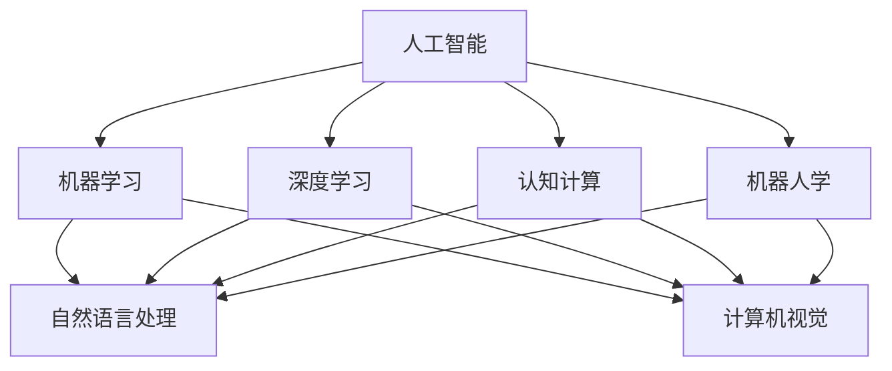

                 

# 人工智能作为独立学科的建立

> 关键词：人工智能, 独立学科, 发展历程, 学术框架, 研究方向, 技术应用, 社会影响

## 1. 背景介绍

### 1.1 问题由来

人工智能（Artificial Intelligence, AI）作为现代科技的前沿领域，其发展历史可以追溯到20世纪50年代。从早期的符号推理到深度学习算法的崛起，人工智能在理论和应用上都取得了长足的进展。然而，尽管如此，人工智能作为一门独立学科的地位仍未得到广泛认可。

当前，人工智能更多是被看作计算机科学或工程学的子领域，而非一门独立的学科。这种地位的模糊性限制了人工智能研究的深入和跨学科融合，也影响了其在社会和经济中的广泛应用。因此，本文将探讨如何将人工智能建立为一门独立学科，并在此基础上进行更深入的研究和应用。

### 1.2 问题核心关键点

将人工智能建立为一门独立学科的核心关键点包括：
- 确立清晰的研究范围和目标
- 建立系统的学术框架和标准
- 促进跨学科的交流与合作
- 推动政策支持和产业投入
- 提高社会认知和公众参与

这些关键点将共同构成人工智能作为一门独立学科的基础，推动其学术研究和实际应用的深度和广度。

## 2. 核心概念与联系

### 2.1 核心概念概述

为更好地理解人工智能学科的建立，本文将介绍几个核心概念及其联系：

- **人工智能（AI）**：使用计算机算法和系统模拟人类智能行为的技术领域。
- **机器学习（ML）**：通过数据驱动的方式，使计算机系统具备自我学习能力，是AI的重要分支。
- **深度学习（DL）**：机器学习的一种，使用多层次神经网络进行复杂模式识别和学习，是当前AI研究的热点。
- **认知计算（CC）**：模拟人类认知过程，如感知、记忆、推理等，以实现更高级别的智能系统。
- **符号推理（SR）**：基于规则和逻辑的推理方法，用于知识表示和问题求解。
- **自然语言处理（NLP）**：研究计算机如何理解、处理和生成人类语言。
- **计算机视觉（CV）**：使计算机具备视觉感知和图像理解能力的技术。
- **机器人学（Robotics）**：结合AI、机器人和自动化技术的学科，研究如何使机器人执行复杂任务。

这些概念之间相互关联，共同构建了人工智能的学术和应用框架。

### 2.2 核心概念原理和架构的 Mermaid 流程图



这个流程图展示了人工智能核心概念之间的相互关系和联系。人工智能的研究和应用涵盖了机器学习、深度学习、认知计算、自然语言处理、计算机视觉和机器人学等多个领域。

## 3. 核心算法原理 & 具体操作步骤

### 3.1 算法原理概述

人工智能的研究和应用涉及到多种算法和技术，以下将简要介绍几个核心算法：

- **监督学习（Supervised Learning）**：通过有标签数据训练模型，预测新数据标签。
- **无监督学习（Unsupervised Learning）**：从无标签数据中学习，发现数据内在结构和模式。
- **强化学习（Reinforcement Learning）**：通过与环境交互，学习最优决策策略。
- **神经网络（Neural Networks）**：模拟人脑神经元连接，用于模式识别和预测。
- **支持向量机（SVM）**：通过在高维空间中寻找最优超平面，进行分类和回归。

### 3.2 算法步骤详解

以下是几个核心算法的详细步骤：

#### 3.2.1 监督学习

1. **数据准备**：收集和标注有标签数据。
2. **模型训练**：使用训练数据集训练模型，调整模型参数。
3. **模型评估**：使用验证集评估模型性能，选择合适的参数。
4. **模型预测**：使用测试集评估模型泛化能力，进行实际预测。

#### 3.2.2 无监督学习

1. **数据准备**：收集无标签数据集。
2. **模型训练**：通过聚类、降维等方法发现数据内在结构。
3. **模型评估**：使用各种评估指标评估模型性能，如聚类质量、降维效果。
4. **模型应用**：将模型应用于实际问题，如数据可视化、异常检测等。

#### 3.2.3 强化学习

1. **环境定义**：定义问题和环境，包括状态空间、动作空间和奖励函数。
2. **模型训练**：使用Q-learning等算法训练智能体，学习最优策略。
3. **模型评估**：在测试环境中评估智能体性能，调整参数。
4. **模型应用**：将智能体应用于实际问题，如自动驾驶、游戏AI等。

#### 3.2.4 神经网络

1. **网络设计**：设计神经网络结构，确定层数、节点数、激活函数等。
2. **模型训练**：使用训练数据集训练模型，优化网络权重。
3. **模型评估**：使用验证集评估模型性能，避免过拟合。
4. **模型应用**：将模型应用于图像识别、语音识别等实际问题。

#### 3.2.5 支持向量机

1. **数据准备**：收集和标注有标签数据。
2. **模型训练**：使用SVM算法在高维空间中寻找最优超平面。
3. **模型评估**：使用各种评估指标评估模型性能，如分类准确率、泛化误差。
4. **模型应用**：将模型应用于实际问题，如文本分类、人脸识别等。

### 3.3 算法优缺点

不同算法的优缺点如下：

#### 监督学习

- **优点**：有标签数据易获取，模型泛化能力强。
- **缺点**：对标注数据质量要求高，可能存在过拟合问题。

#### 无监督学习

- **优点**：无需标注数据，模型具备自适应能力。
- **缺点**：模型性能难以量化，应用场景受限。

#### 强化学习

- **优点**：适用于复杂环境，模型具备主动学习能力。
- **缺点**：训练时间长，模型鲁棒性差。

#### 神经网络

- **优点**：模型性能优异，适用于复杂模式识别。
- **缺点**：参数量巨大，训练耗时长，过拟合风险高。

#### 支持向量机

- **优点**：模型简单，泛化能力强。
- **缺点**：高维数据处理能力弱，模型可解释性差。

## 4. 数学模型和公式 & 详细讲解 & 举例说明

### 4.1 数学模型构建

以下以线性回归模型为例，介绍数学模型的构建过程。

设训练数据集为 $(x_i, y_i)$，其中 $x_i \in \mathbb{R}^n$ 为输入向量，$y_i \in \mathbb{R}$ 为输出标签。目标为使用线性模型 $f(x) = \theta^T x$ 拟合数据，其中 $\theta$ 为模型参数。

最小化损失函数：

$$
\min_{\theta} \sum_{i=1}^N (y_i - f(x_i))^2
$$

### 4.2 公式推导过程

根据最小二乘法，求解最优参数 $\theta$：

$$
\theta = (X^T X)^{-1} X^T y
$$

其中 $X = [x_1, x_2, ..., x_N]^T$。

### 4.3 案例分析与讲解

假设有一个简单的数据集：

$$
\begin{align*}
x_1 &= [1, 2]^T, &y_1 &= 3 \\
x_2 &= [2, 3]^T, &y_2 &= 5 \\
x_3 &= [3, 4]^T, &y_3 &= 7
\end{align*}
$$

使用上述公式求解最优参数 $\theta$：

$$
\begin{align*}
X &= \begin{bmatrix} 1 & 2 \\ 2 & 3 \\ 3 & 4 \end{bmatrix}, &y &= \begin{bmatrix} 3 \\ 5 \\ 7 \end{bmatrix} \\
\theta &= \begin{bmatrix} 2 \\ 3 \end{bmatrix}
\end{align*}
$$

最终模型为 $f(x) = 2x_1 + 3x_2$，用于预测新的输入向量。

## 5. 项目实践：代码实例和详细解释说明

### 5.1 开发环境搭建

在使用Python进行深度学习项目开发时，需要以下环境：

1. **Python**：建议安装最新版本的Python，如3.8及以上。
2. **深度学习框架**：如TensorFlow、PyTorch、Keras等。
3. **科学计算库**：如NumPy、SciPy、Pandas等。
4. **可视化工具**：如Matplotlib、Seaborn、TensorBoard等。

以下是一个简单的开发环境搭建示例：

```bash
# 安装Python和pip
sudo apt-get update
sudo apt-get install python3 python3-pip
pip3 install -U pip
pip3 install --upgrade pip
```

### 5.2 源代码详细实现

以下是使用TensorFlow进行线性回归模型训练的示例代码：

```python
import tensorflow as tf
import numpy as np

# 准备数据
x = np.array([[1, 2], [2, 3], [3, 4]])
y = np.array([3, 5, 7])

# 定义模型
theta = tf.Variable(tf.random.normal([2]))
f = lambda x: tf.matmul(x, theta)

# 定义损失函数
loss_fn = lambda y_true, y_pred: tf.reduce_mean(tf.square(y_true - y_pred))

# 定义优化器
optimizer = tf.optimizers.SGD(learning_rate=0.01)

# 训练模型
for i in range(1000):
    with tf.GradientTape() as tape:
        y_pred = f(x)
        loss = loss_fn(y, y_pred)
    gradients = tape.gradient(loss, theta)
    optimizer.apply_gradients(zip(gradients, [theta]))

# 输出结果
print("最优参数：", theta)
```

### 5.3 代码解读与分析

上述代码实现了使用SGD优化器进行线性回归模型训练的过程。具体步骤如下：

1. **准备数据**：定义输入向量 $x$ 和输出标签 $y$。
2. **定义模型**：定义线性模型 $f(x) = \theta^T x$，并使用TensorFlow变量存储参数 $\theta$。
3. **定义损失函数**：定义均方误差损失函数 $loss = \frac{1}{N} \sum_{i=1}^N (y_i - f(x_i))^2$。
4. **定义优化器**：使用SGD优化器，设置学习率为0.01。
5. **训练模型**：在每次迭代中，计算损失函数的梯度，使用优化器更新参数 $\theta$。
6. **输出结果**：输出最优参数 $\theta$。

## 6. 实际应用场景

### 6.1 医疗诊断

人工智能在医疗诊断领域具有广泛应用。通过分析医疗影像、基因数据、病历记录等，人工智能可以帮助医生进行疾病诊断、治疗方案推荐、患者管理等。

例如，使用深度学习模型对医疗影像进行分析和识别，可以辅助放射科医生快速诊断肿瘤、骨折等疾病。使用自然语言处理技术，可以从病历记录中提取有用信息，用于病情分析和预后预测。

### 6.2 金融风控

人工智能在金融风控领域可以用于欺诈检测、信用评估、风险管理等。通过分析交易数据、客户行为数据等，人工智能可以实时监控交易行为，识别异常交易，降低金融风险。

例如，使用强化学习模型进行交易策略优化，可以实现自动化的交易管理和风险控制。使用无监督学习技术对客户行为进行分析，可以发现潜在风险客户，提前采取防范措施。

### 6.3 自动驾驶

自动驾驶是人工智能在交通领域的重要应用之一。通过使用计算机视觉和深度学习技术，自动驾驶系统可以实时感知和分析道路环境，进行路径规划和决策，实现自动驾驶。

例如，使用卷积神经网络对道路图像进行分析和识别，可以识别交通标志、车辆、行人等。使用强化学习技术进行路径规划和决策，可以保证自动驾驶车辆的安全性和稳定性。

### 6.4 未来应用展望

未来，人工智能将在更多领域得到广泛应用，带来深远的社会和经济影响：

1. **智能城市**：人工智能将广泛应用于城市管理，如智能交通、智慧环保、智能安防等，提升城市运行效率和居民生活质量。
2. **教育**：人工智能将用于个性化教育、智能辅导、学习分析等，提供更高效、个性化的教育服务。
3. **农业**：人工智能将用于农业生产、疾病防治、作物监测等，提升农业生产效率和食品安全。
4. **能源**：人工智能将用于能源管理、智能电网、可再生能源等，实现能源的高效利用和环保节能。
5. **军事**：人工智能将用于智能装备、情报分析、指挥决策等，提升军事实力和作战效率。

## 7. 工具和资源推荐

### 7.1 学习资源推荐

以下是一些优质的学习资源，帮助你掌握人工智能的基础知识和应用技术：

1. **Coursera**：提供多门人工智能相关课程，涵盖机器学习、深度学习、自然语言处理等领域。
2. **Udacity**：提供深度学习专项课程，包括神经网络、卷积神经网络、循环神经网络等。
3. **edX**：提供多门计算机科学和人工智能课程，涵盖计算机视觉、自然语言处理等方向。
4. **ArXiv**：提供大量人工智能领域的最新研究成果和论文，是学习前沿技术的重要来源。
5. **Kaggle**：提供多个人工智能竞赛，通过实际项目实践，提升解决实际问题的能力。

### 7.2 开发工具推荐

以下是一些常用的开发工具，提升人工智能项目的开发效率和质量：

1. **Jupyter Notebook**：提供交互式编程环境，支持代码和文本的混合编辑。
2. **PyCharm**：专业的Python开发工具，支持AI框架和库的集成开发。
3. **Visual Studio Code**：轻量级代码编辑器，支持多种语言和框架。
4. **Anaconda**：Python的科学计算环境，方便安装和管理AI相关的库和工具。
5. **TensorBoard**：TensorFlow的可视化工具，用于监控和调试模型训练过程。

### 7.3 相关论文推荐

以下是一些经典的人工智能论文，推荐阅读：

1. **神经网络的反直觉行为**（Neural Network Behavior is Still Unintuitive）：深度学习专家Yoshua Bengio等发表的论文，探讨深度学习模型的内部行为和性质。
2. **生成对抗网络**（Generative Adversarial Networks）：Ian Goodfellow等发表的论文，提出生成对抗网络（GAN）的框架，用于生成高质量的图像和数据。
3. **深度学习的超调问题**（The Lottery Ticket Hypothesis）：谷歌研究人员发表的论文，提出深度学习模型的"彩票假说"，研究稀疏连接在模型训练中的作用。
4. **强化学习的理论基础**（Theoretical Foundations of Reinforcement Learning）：Richard Sutton等发表的书籍，系统介绍强化学习的理论基础和算法框架。
5. **自然语言处理综述**（Natural Language Processing Surveys）：Tom McKeown等发表的综述，涵盖自然语言处理的主要研究方向和应用场景。

## 8. 总结：未来发展趋势与挑战

### 8.1 研究成果总结

人工智能作为一门新兴的学科，经过几十年的发展，已经在理论和应用上取得了显著的成果。以下是对主要研究成果的总结：

1. **深度学习**：以神经网络为基础，通过大量数据训练，实现复杂模式的识别和预测。
2. **自然语言处理**：研究计算机如何理解、处理和生成人类语言。
3. **计算机视觉**：研究计算机如何感知和理解图像和视频。
4. **机器人学**：结合AI和机器人技术，实现自动化的复杂任务。
5. **强化学习**：通过与环境交互，学习最优决策策略。

### 8.2 未来发展趋势

未来，人工智能将继续朝着以下方向发展：

1. **深度强化学习**：结合深度学习和强化学习，实现更加高效和智能的决策系统。
2. **多模态学习**：结合视觉、语音、文本等多种模态数据，实现更加全面和智能的认知系统。
3. **跨领域应用**：将人工智能应用于更多领域，如医疗、金融、教育等。
4. **通用智能**：研究如何让机器具备更广泛的知识和智能，实现通用人工智能（AGI）的目标。
5. **伦理和安全**：研究如何让AI系统具备更高的伦理和安全保障，避免潜在的风险和危害。

### 8.3 面临的挑战

尽管人工智能在多个领域取得了重要进展，但仍面临一些挑战：

1. **计算资源不足**：深度学习和强化学习模型需要大量的计算资源，目前的计算能力难以满足需求。
2. **数据隐私和安全**：大规模数据集的收集和使用，可能涉及隐私和安全性问题。
3. **模型可解释性**：深度学习模型通常被称为"黑盒"系统，难以解释其内部行为和决策过程。
4. **伦理和社会影响**：人工智能系统可能带来伦理和社会问题，如就业、公平等。
5. **法规和标准**：缺乏统一的标准和法规，制约了人工智能的普及和应用。

### 8.4 研究展望

未来，人工智能的研究和应用将朝着以下几个方向进行：

1. **跨学科融合**：与其他学科进行深入的融合，如心理学、社会学等。
2. **智能化工程**：将AI应用于工程领域，提升生产效率和质量。
3. **社会化应用**：将AI应用于社会服务，如智能教育、智能医疗等。
4. **伦理和安全保障**：研究如何让AI系统具备更高的伦理和社会保障。
5. **可持续性**：研究如何让AI系统具备可持续性，实现长期发展。

## 9. 附录：常见问题与解答

**Q1: 人工智能和机器学习、深度学习的关系是什么？**

A: 人工智能是研究如何让机器具备智能行为的学科，包括机器学习、深度学习、自然语言处理、计算机视觉等方向。机器学习和深度学习是人工智能的重要分支，通过数据驱动的方式，使机器具备学习能力和智能推理。

**Q2: 人工智能的发展历程是怎样的？**

A: 人工智能的发展历程可以分为以下几个阶段：

1. **符号推理阶段**：20世纪50-60年代，主要使用规则和逻辑进行推理。
2. **专家系统阶段**：20世纪70-80年代，研究如何构建专家系统，实现特定领域的问题求解。
3. **机器学习阶段**：20世纪80年代末至90年代初，研究如何通过数据驱动的方式进行学习。
4. **深度学习阶段**：20世纪90年代末至今，研究如何使用多层次神经网络进行复杂模式识别和学习。

**Q3: 人工智能在医疗领域的应用有哪些？**

A: 人工智能在医疗领域的应用包括：

1. **影像识别**：使用计算机视觉技术对医疗影像进行分析和识别，如CT、MRI等。
2. **疾病诊断**：使用深度学习模型对病历记录进行分析和诊断，如癌症、心血管疾病等。
3. **治疗方案推荐**：使用自然语言处理技术对医疗文献进行分析，推荐治疗方案。
4. **患者管理**：使用智能推荐系统进行患者管理和跟踪，提升医疗服务效率。

**Q4: 人工智能在金融领域的应用有哪些？**

A: 人工智能在金融领域的应用包括：

1. **欺诈检测**：使用深度学习模型对交易数据进行分析，识别异常交易行为。
2. **信用评估**：使用机器学习模型对客户数据进行分析，评估信用风险。
3. **风险管理**：使用强化学习模型进行交易策略优化，实现风险管理。
4. **量化交易**：使用深度学习模型进行市场分析和预测，实现量化交易。

**Q5: 人工智能在自动驾驶领域的应用有哪些？**

A: 人工智能在自动驾驶领域的应用包括：

1. **感知**：使用计算机视觉技术对道路环境进行感知和分析。
2. **路径规划**：使用深度学习模型进行路径规划和决策。
3. **智能驾驶**：结合感知和路径规划技术，实现自动驾驶车辆的安全行驶。
4. **环境建模**：使用强化学习技术进行环境建模和仿真，提升驾驶安全性。

---
作者：禅与计算机程序设计艺术 / Zen and the Art of Computer Programming

