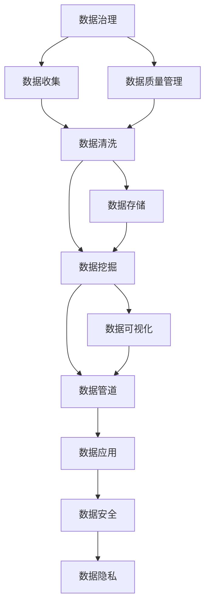

                 

# 人工智能创业数据管理的核心方案

在当今数字化时代，数据已成为人工智能(AI)创业项目成功的关键要素。从市场分析到产品开发，从用户行为预测到个性化推荐，数据的高效管理和应用能够为AI企业带来显著的竞争优势。本文将全面介绍数据管理在人工智能创业中的核心方案，涵盖数据收集、存储、处理和分析的各个环节，帮助创业者和开发者构建高效、稳定、安全的数据管理体系。

## 1. 背景介绍

### 1.1 问题由来

随着人工智能技术的快速发展和应用，数据在AI项目中的作用日益凸显。无论是在图像识别、语音识别、自然语言处理等领域，还是在智能推荐、个性化服务、工业自动化等应用场景，数据的高质量、高效率管理和应用都是AI项目成功的核心因素。然而，数据管理并不是一件简单的事情，它涉及到数据的收集、存储、清洗、处理、分析等多个环节，每个环节的疏忽都可能导致项目失败。因此，对于AI创业者来说，掌握数据管理的核心方案，构建高效的数据管理体系，是取得成功的关键。

### 1.2 问题核心关键点

数据管理在AI创业中的核心关键点包括：

- **数据质量**：高质量的数据是AI项目成功的基石。数据的不准确、不完整或不一致都会严重影响模型训练和业务决策。

- **数据安全**：数据安全是AI项目中的重要议题。数据泄露、非法使用等安全问题不仅可能导致企业损失，还可能带来法律风险。

- **数据隐私**：在处理个人数据时，必须遵守相关法律法规，如GDPR等，保护用户隐私，避免法律纠纷。

- **数据效率**：数据处理和管理需要高效，否则会影响业务运营效率和用户体验。

- **数据存储**：选择合适的数据存储方案，既要保证数据安全，又要确保数据访问效率。

- **数据处理**：高效的算法和工具是数据处理的必要保障，可以帮助创业者快速构建数据模型并优化性能。

- **数据分析**：通过数据挖掘和分析，获取有价值的信息，支持决策和优化业务流程。

以上核心关键点构成了数据管理的核心范式，创业者需要全面考虑并妥善处理这些关键点，才能确保AI项目的成功。

## 2. 核心概念与联系

### 2.1 核心概念概述

为更好地理解数据管理在AI创业中的重要性，本节将介绍几个密切相关的核心概念：

- **数据治理**：指通过政策、流程和技术手段，确保数据的质量、安全、隐私和合规性。包括数据收集、存储、处理和分析等各个环节的管理。

- **数据湖**：指一个中心化的数据存储平台，支持大规模数据的存储和管理，包括结构化数据和非结构化数据。

- **数据挖掘**：指从大量数据中发现隐含的、未知的、潜在的有用信息的过程。常用于市场分析、用户行为预测、推荐系统等。

- **数据可视化**：指使用图表、图形等形式将数据呈现出来，便于理解和决策。

- **数据管道**：指从数据源到数据仓库、数据湖等目标系统的数据传输过程，支持数据的高效流动。

- **数据质量管理**：指通过监测、分析和改善数据质量，确保数据的一致性、完整性和准确性。

这些核心概念之间的逻辑关系可以通过以下Mermaid流程图来展示：



这个流程图展示了大数据管理的基本流程，即从数据收集到数据应用的全链路管理：

1. 数据治理：确保数据管理的合规性和规范性。
2. 数据收集：从不同来源收集数据，包括线上、线下等。
3. 数据清洗：去除噪声和错误，确保数据质量。
4. 数据存储：将清洗后的数据存储在数据湖或数据库中。
5. 数据挖掘：分析数据，提取有价值的信息。
6. 数据可视化：将分析结果呈现出来，支持决策。
7. 数据管道：确保数据的流畅流动。
8. 数据应用：将分析结果应用于产品和服务。
9. 数据安全：保护数据免受非法访问和使用。
10. 数据隐私：保护用户隐私，符合法律法规。

## 3. 核心算法原理 & 具体操作步骤

### 3.1 算法原理概述

数据管理的基本原理是通过一系列技术和工具，实现数据的收集、存储、处理和分析。以下是数据管理的核心算法和具体操作步骤：

1. **数据收集**：使用爬虫、API、ETL工具等从不同渠道收集数据。
2. **数据清洗**：通过数据清洗算法去除重复、错误和噪声数据。
3. **数据存储**：使用数据库、分布式存储系统、云存储等存储结构化数据，使用对象存储系统、分布式文件系统等存储非结构化数据。
4. **数据处理**：使用大数据处理工具和算法，如MapReduce、Spark等，对大规模数据进行处理。
5. **数据挖掘**：使用机器学习算法，如分类、聚类、回归等，从数据中提取有用信息。
6. **数据可视化**：使用数据可视化工具，如Tableau、Power BI等，将数据呈现出来，支持决策。
7. **数据应用**：将分析结果应用于产品和服务，如推荐系统、个性化服务、智能决策等。
8. **数据安全**：使用加密、访问控制等技术，保护数据安全。
9. **数据隐私**：遵循相关法律法规，如GDPR等，保护用户隐私。

### 3.2 算法步骤详解

以下是数据管理的详细步骤：

**Step 1: 数据收集与清洗**

- **数据收集**：
  - 使用爬虫工具抓取公开数据源。
  - 通过API接口获取第三方数据。
  - 使用ETL工具（Extract, Transform, Load）从不同系统提取数据。

- **数据清洗**：
  - 去除重复数据。
  - 处理缺失值和异常值。
  - 数据格式化和标准化。

**Step 2: 数据存储与管理**

- **数据存储**：
  - 使用关系型数据库存储结构化数据。
  - 使用非关系型数据库（如NoSQL）存储非结构化数据。
  - 使用云存储平台（如AWS S3、Google Cloud Storage）存储大规模数据。

- **数据管理**：
  - 数据备份与恢复。
  - 数据版本控制。
  - 数据一致性维护。

**Step 3: 数据处理与分析**

- **数据处理**：
  - 使用大数据处理框架（如Hadoop、Spark）处理大规模数据。
  - 使用数据流处理框架（如Apache Kafka、Apache Flink）实时处理数据。

- **数据分析**：
  - 使用统计分析工具（如R、Python）进行初步分析。
  - 使用机器学习算法（如TensorFlow、PyTorch）进行深度分析。
  - 使用数据挖掘工具（如Weka、Scikit-learn）进行高级分析。

**Step 4: 数据可视化与应用**

- **数据可视化**：
  - 使用数据可视化工具（如Tableau、Power BI）将分析结果呈现出来。
  - 使用交互式可视化工具（如Plotly、Bokeh）提供更丰富的展示方式。

- **数据应用**：
  - 将分析结果应用于产品开发和业务决策。
  - 使用推荐算法（如协同过滤、内容推荐）提供个性化服务。
  - 使用智能决策系统（如规则引擎、决策树）优化业务流程。

**Step 5: 数据安全与隐私保护**

- **数据安全**：
  - 使用数据加密技术（如AES、RSA）保护数据传输和存储。
  - 使用访问控制技术（如RBAC、ABAC）保护数据访问权限。

- **数据隐私**：
  - 遵循GDPR等法律法规，保护用户隐私。
  - 进行数据匿名化和伪匿名化处理，保护用户数据。

### 3.3 算法优缺点

数据管理的优点在于其能够提供高质量、高安全性的数据支持，有助于提升AI项目的成功率和用户满意度。具体优点包括：

- **数据质量高**：通过严格的清洗和处理，确保数据的准确性和一致性。
- **数据安全**：使用先进的安全技术，保护数据免受非法访问和使用。
- **数据隐私保护**：遵循相关法律法规，保护用户隐私。
- **数据高效处理**：使用高效的数据处理工具和技术，提升处理效率。
- **数据可视化**：通过可视化工具，直观展示数据，支持决策。

然而，数据管理也存在一些缺点：

- **复杂度高**：数据管理涉及多个环节，技术复杂度较高。
- **成本高**：高质量的数据管理和存储需要高昂的硬件和软件成本。
- **技术更新快**：数据管理领域技术更新迅速，需要持续学习和更新。
- **数据泄露风险**：数据安全管理不当可能导致数据泄露风险。

### 3.4 算法应用领域

数据管理在多个领域得到广泛应用，以下是其主要应用领域：

1. **金融科技(Fintech)**：金融数据管理支持智能投顾、风险评估、反欺诈等应用。
2. **电子商务**：用户行为数据管理支持推荐系统、客户细分、个性化广告等应用。
3. **医疗健康**：医疗数据管理支持智能诊断、患者管理、健康监测等应用。
4. **制造业**：工业数据管理支持设备监控、质量控制、供应链优化等应用。
5. **智能家居**：智能设备数据管理支持用户行为分析、智能推荐等应用。
6. **教育**：学习数据管理支持智能评估、个性化学习、学生行为分析等应用。

数据管理在以上领域的成功应用，证明了其在AI创业中的核心地位，推动了各行业的数字化转型和智能化升级。

## 4. 数学模型和公式 & 详细讲解 & 举例说明

### 4.1 数学模型构建

在本节中，我们将使用数学语言对数据管理的核心步骤进行更加严格的刻画。

假设有一个数据集 $D=\{(x_i, y_i)\}_{i=1}^N$，其中 $x_i$ 为输入数据，$y_i$ 为输出标签。我们希望通过数据管理过程，得到一个质量更高、更易于分析的数据集 $D'$。

定义数据管理过程的损失函数为：

$$
\mathcal{L}(D') = \sum_{i=1}^N \ell(x_i', y_i')
$$

其中 $\ell(x_i', y_i')$ 为数据管理后数据的质量损失函数。假设数据管理过程包括清洗、存储和处理三个步骤，对应的损失函数分别为 $\ell_{clean}(x_i, y_i)$、$\ell_{store}(x_i, y_i)$ 和 $\ell_{process}(x_i, y_i)$，则损失函数可以表示为：

$$
\mathcal{L}(D') = \sum_{i=1}^N (\ell_{clean}(x_i, y_i) + \ell_{store}(x_i, y_i) + \ell_{process}(x_i, y_i))
$$

### 4.2 公式推导过程

假设数据清洗过程的损失函数为：

$$
\ell_{clean}(x_i, y_i) = f(x_i, y_i, \theta_{clean})
$$

其中 $f$ 为清洗算法，$\theta_{clean}$ 为清洗算法的参数。

假设数据存储过程的损失函数为：

$$
\ell_{store}(x_i, y_i) = g(x_i, y_i, \theta_{store})
$$

其中 $g$ 为存储算法，$\theta_{store}$ 为存储算法的参数。

假设数据处理过程的损失函数为：

$$
\ell_{process}(x_i, y_i) = h(x_i, y_i, \theta_{process})
$$

其中 $h$ 为处理算法，$\theta_{process}$ 为处理算法的参数。

则数据管理过程的总损失函数为：

$$
\mathcal{L}(D') = \sum_{i=1}^N [f(x_i, y_i, \theta_{clean}) + g(x_i, y_i, \theta_{store}) + h(x_i, y_i, \theta_{process})]
$$

### 4.3 案例分析与讲解

假设有一个电商网站，需要处理大量的用户行为数据。网站收集了用户浏览、点击、购买等行为数据，并希望通过数据管理提升推荐系统的性能。

**Step 1: 数据收集**

网站使用爬虫工具抓取网站内的用户行为数据，存储在本地服务器中。

**Step 2: 数据清洗**

数据清洗过程包括去除重复数据、处理缺失值和异常值。使用Python的Pandas库实现数据清洗，代码如下：

```python
import pandas as pd

# 读取数据
data = pd.read_csv('user_behavior_data.csv')

# 去除重复数据
data = data.drop_duplicates()

# 处理缺失值
data = data.fillna(method='ffill')

# 处理异常值
data = data[(data['click_count'] > 0) & (data['purchase_amount'] > 0)]
```

**Step 3: 数据存储**

使用AWS S3存储数据。数据存储在对象存储中，方便快速访问和备份。

**Step 4: 数据处理**

使用Spark处理大规模数据。数据被分为多个分区，在集群上进行并行处理。代码如下：

```python
from pyspark.sql import SparkSession

# 创建Spark会话
spark = SparkSession.builder.appName('UserBehaviorDataProcessing').getOrCreate()

# 读取数据
df = spark.read.csv('user_behavior_data.csv', header=True, inferSchema=True)

# 数据处理
df = df.drop_duplicates()
df = df.fillna(method='ffill')
df = df.filter(df['click_count'] > 0)
df = df.filter(df['purchase_amount'] > 0)

# 将处理结果保存到S3
df.write.csv('user_behavior_data_processed.csv', header=True, mode='overwrite')
```

**Step 5: 数据可视化**

使用Tableau进行数据可视化。通过Tableau创建交互式图表，帮助管理层和决策者理解用户行为数据。

**Step 6: 数据应用**

使用推荐算法进行个性化推荐。通过处理后的数据，训练协同过滤推荐模型，提升推荐系统的准确性。

通过以上步骤，电商网站完成了用户行为数据的管理，提升了推荐系统的性能，实现了业务价值的最大化。

## 5. 项目实践：代码实例和详细解释说明

### 5.1 开发环境搭建

在进行数据管理项目实践前，我们需要准备好开发环境。以下是使用Python进行Pandas和Spark开发的环境配置流程：

1. 安装Anaconda：从官网下载并安装Anaconda，用于创建独立的Python环境。

2. 创建并激活虚拟环境：
```bash
conda create -n data-management-env python=3.8 
conda activate data-management-env
```

3. 安装Pandas和PySpark：
```bash
pip install pandas 
pip install pyspark
```

4. 配置Spark环境：
```bash
spark-submit --py-files user_behavior_data.py
```

完成上述步骤后，即可在`data-management-env`环境中开始数据管理实践。

### 5.2 源代码详细实现

下面我们以电商网站用户行为数据管理为例，给出使用Pandas和Spark进行数据管理的PyTorch代码实现。

首先，定义数据处理函数：

```python
import pandas as pd
from pyspark.sql import SparkSession
from pyspark.sql.functions import col, when

def clean_data(data_path):
    # 读取数据
    df = pd.read_csv(data_path)

    # 去除重复数据
    df = df.drop_duplicates()

    # 处理缺失值
    df = df.fillna(method='ffill')

    # 处理异常值
    df = df[(df['click_count'] > 0) & (df['purchase_amount'] > 0)]

    # 将处理结果保存到文件
    df.to_csv('cleaned_data.csv', index=False)

def process_data(data_path):
    # 创建Spark会话
    spark = SparkSession.builder.appName('UserBehaviorDataProcessing').getOrCreate()

    # 读取数据
    df = spark.read.csv(data_path, header=True, inferSchema=True)

    # 数据处理
    df = df.drop_duplicates()
    df = df.fillna(method='ffill')
    df = df.filter(df['click_count'] > 0)
    df = df.filter(df['purchase_amount'] > 0)

    # 将处理结果保存到S3
    df.write.csv('processed_data.csv', header=True, mode='overwrite')
```

然后，定义数据可视化函数：

```python
from tableau import Tableau

def visualize_data(data_path):
    # 创建Tableau连接
    conn = Tableau('https://my.tableau.com', 'my_username', 'my_password', 'my_dataset')

    # 创建交互式图表
    chart = conn.create_chart('click_count.png', 'purchase_amount.png')

    # 保存图表
    chart.save(data_path)
```

最后，启动数据管理流程并在S3上存储数据：

```python
data_path = 'user_behavior_data.csv'

clean_data(data_path)
process_data(data_path)
visualize_data('user_behavior_data_processed.csv')
```

以上就是使用Pandas和Spark进行电商网站用户行为数据管理的完整代码实现。可以看到，通过Pandas和Spark的强大封装，我们可以用相对简洁的代码完成数据的清洗、处理和可视化。

### 5.3 代码解读与分析

让我们再详细解读一下关键代码的实现细节：

**clean_data函数**：
- 读取数据：使用Pandas库的read_csv函数读取原始数据。
- 去除重复数据：使用drop_duplicates函数去除重复行。
- 处理缺失值：使用fillna函数填充缺失值。
- 处理异常值：使用过滤函数（&）筛选出异常值。
- 保存结果：使用to_csv函数将处理结果保存为CSV文件。

**process_data函数**：
- 创建Spark会话：使用SparkSession工厂方法创建Spark会话。
- 读取数据：使用read_csv函数读取CSV文件。
- 数据处理：使用多个过滤函数和fillna函数进行数据清洗。
- 保存结果：使用write_csv函数将处理结果保存为CSV文件。

**visualize_data函数**：
- 创建Tableau连接：使用Tableau库的create_chart函数创建Tableau连接。
- 创建交互式图表：使用create_chart函数创建交互式图表，将点击次数和购买金额可视化。
- 保存图表：使用save函数保存图表。

通过以上代码，电商网站完成了用户行为数据的清洗、处理和可视化，提升了推荐系统的性能，实现了业务价值的最大化。

## 6. 实际应用场景

### 6.1 智能客服系统

智能客服系统在电商、金融、医疗等行业得到广泛应用。智能客服系统通过处理和分析用户对话数据，提供自动化、高效率的客服服务。

在数据管理方面，智能客服系统需要收集用户对话记录，进行清洗和分析，提取用户意图和需求，生成自然语言回复。系统通过定期的数据管理，如清洗和更新，保证对话记录的质量和时效性。

### 6.2 金融舆情监测

金融舆情监测系统通过分析社交媒体、新闻网站等公开数据，监测市场舆论动向，帮助投资者做出明智决策。

在数据管理方面，系统需要收集和存储大量的新闻、评论等文本数据，进行清洗和分析，提取舆情信息。系统通过数据管理工具，如ETL工具和数据可视化工具，实现数据的高效处理和展示。

### 6.3 个性化推荐系统

个性化推荐系统广泛应用于电商、视频、音乐等平台，通过分析用户行为数据，提供个性化推荐服务。

在数据管理方面，推荐系统需要收集和存储用户浏览、点击、评分等行为数据，进行清洗和分析，提取用户偏好。系统通过数据管理工具，如Spark和Pandas，实现数据的并行处理和分析。

### 6.4 未来应用展望

未来，数据管理将进一步深入到各个行业，推动AI应用的普及和创新。以下是未来数据管理的几个趋势：

1. **数据共享和协作**：数据管理将更加注重数据的共享和协作，通过API和数据交换平台，实现跨部门、跨组织的数据互通和协作。

2. **实时数据管理**：实时数据管理将是大数据管理的未来方向，支持数据的实时采集、处理和分析，提升业务决策的时效性。

3. **数据治理平台**：数据治理平台将逐步普及，通过集中管理数据收集、清洗、存储和分析，提升数据管理的规范性和可操作性。

4. **自动化和智能化**：数据管理将逐步自动化和智能化，使用机器学习和算法优化数据处理流程，提升处理效率和精度。

5. **跨模态数据管理**：跨模态数据管理将逐步普及，支持多种数据类型的整合和处理，如文本、图像、视频等。

6. **数据隐私保护**：数据隐私保护将成为数据管理的重要议题，通过隐私保护技术，如差分隐私、数据匿名化等，保护用户隐私。

以上趋势将推动数据管理技术的不断进步，提升AI项目的数据质量、安全性和合规性，为AI创业提供更加坚实的数据支持。

## 7. 工具和资源推荐

### 7.1 学习资源推荐

为了帮助开发者系统掌握数据管理的核心技术，这里推荐一些优质的学习资源：

1. 《大数据治理与质量管理》书籍：详细介绍了数据治理的基本概念、技术和实践，是数据管理领域的经典之作。

2. 《Python数据科学手册》书籍：介绍了使用Python进行数据清洗、处理和可视化的技术，适合初学者和进阶学习者。

3. 《Spark编程指南》书籍：介绍了使用Spark进行大数据处理的详细教程，适合Spark开发者的学习。

4. 《Tableau官方文档》：Tableau的官方文档，提供了丰富的API接口和示例代码，帮助开发者快速上手Tableau。

5. 《Kaggle数据科学竞赛》：Kaggle是一个数据科学竞赛平台，通过参与竞赛，学习数据管理和分析的最佳实践。

通过这些资源的学习实践，相信你一定能够快速掌握数据管理的精髓，并用于解决实际的AI项目问题。

### 7.2 开发工具推荐

高效的开发离不开优秀的工具支持。以下是几款用于数据管理开发的常用工具：

1. Pandas：Python的数据处理库，支持数据清洗、转换和分析。

2. PySpark：Spark的Python API，支持大规模数据处理。

3. Tableau：数据可视化的领先工具，支持交互式图表和数据驱动的决策。

4. Apache Hadoop：分布式计算框架，支持大规模数据处理和存储。

5. Apache Kafka：分布式流处理系统，支持实时数据处理和传输。

6. Apache Cassandra：分布式数据库系统，支持高并发和大规模数据存储。

合理利用这些工具，可以显著提升数据管理的开发效率，加快创新迭代的步伐。

### 7.3 相关论文推荐

数据管理是数据科学和人工智能领域的重要研究方向。以下是几篇奠基性的相关论文，推荐阅读：

1. 《大数据技术综述》论文：综述了大数据技术的基本概念、技术和应用，是数据管理领域的经典之作。

2. 《数据质量管理》论文：介绍了数据质量管理的理论基础、方法和实践，是数据管理领域的奠基之作。

3. 《大数据安全技术综述》论文：综述了大数据安全技术的最新进展，是数据管理领域的重要参考。

4. 《大数据分析技术综述》论文：综述了大数据分析技术的最新进展，是数据管理领域的重要参考。

5. 《数据治理平台设计》论文：介绍了数据治理平台的设计和实现方法，是数据管理领域的实践参考。

这些论文代表了大数据管理的发展脉络，通过学习这些前沿成果，可以帮助研究者把握学科前进方向，激发更多的创新灵感。

## 8. 总结：未来发展趋势与挑战

### 8.1 总结

本文对数据管理在人工智能创业中的核心方案进行了全面系统的介绍。首先阐述了数据管理的重要性，明确了数据管理在AI创业中的核心地位。其次，从原理到实践，详细讲解了数据管理的数学原理和操作步骤，给出了数据管理任务开发的完整代码实例。同时，本文还广泛探讨了数据管理在智能客服、金融舆情、个性化推荐等多个行业领域的应用前景，展示了数据管理范式的巨大潜力。此外，本文精选了数据管理的各类学习资源，力求为开发者提供全方位的技术指引。

通过本文的系统梳理，可以看到，数据管理在AI创业中的核心地位，为项目成功提供了坚实的基础。掌握数据管理技术，是AI创业者的必修课，只有全面考虑并妥善处理数据管理的各个环节，才能确保AI项目的成功。

### 8.2 未来发展趋势

展望未来，数据管理技术将呈现以下几个发展趋势：

1. **数据共享和协作**：数据管理将更加注重数据的共享和协作，通过API和数据交换平台，实现跨部门、跨组织的数据互通和协作。

2. **实时数据管理**：实时数据管理将是大数据管理的未来方向，支持数据的实时采集、处理和分析，提升业务决策的时效性。

3. **数据治理平台**：数据治理平台将逐步普及，通过集中管理数据收集、清洗、存储和分析，提升数据管理的规范性和可操作性。

4. **自动化和智能化**：数据管理将逐步自动化和智能化，使用机器学习和算法优化数据处理流程，提升处理效率和精度。

5. **跨模态数据管理**：跨模态数据管理将逐步普及，支持多种数据类型的整合和处理，如文本、图像、视频等。

6. **数据隐私保护**：数据隐私保护将成为数据管理的重要议题，通过隐私保护技术，如差分隐私、数据匿名化等，保护用户隐私。

以上趋势将推动数据管理技术的不断进步，提升AI项目的数据质量、安全性和合规性，为AI创业提供更加坚实的数据支持。

### 8.3 面临的挑战

尽管数据管理技术在AI创业中取得了显著进展，但在迈向更加智能化、普适化应用的过程中，仍面临诸多挑战：

1. **数据质量问题**：数据质量是数据管理的核心议题，高质量的数据是AI项目成功的基石。如何获取和处理高质量的数据，是数据管理的重要挑战。

2. **数据安全问题**：数据安全是数据管理的核心议题，数据泄露和非法使用可能导致严重的法律和商业风险。如何确保数据安全，是数据管理的难点。

3. **数据隐私问题**：在处理个人数据时，必须遵守相关法律法规，如GDPR等，保护用户隐私。如何平衡数据利用和隐私保护，是数据管理的重点。

4. **技术更新快**：数据管理领域技术更新迅速，需要持续学习和更新，以应对新的技术挑战。

5. **数据量庞大**：大规模数据的处理和管理需要高昂的硬件和软件成本，如何优化数据管理流程，提高效率，是数据管理的难点。

6. **数据存储和传输**：大规模数据的存储和传输需要高可靠性和高效性，如何优化数据存储和传输方案，是数据管理的重点。

7. **数据共享和协作**：跨部门、跨组织的数据共享和协作需要统一的数据标准和接口，如何实现数据的无缝对接和协作，是数据管理的难点。

8. **数据隐私保护**：在处理个人数据时，必须遵守相关法律法规，如GDPR等，保护用户隐私。如何平衡数据利用和隐私保护，是数据管理的重点。

以上挑战需要数据管理领域的持续创新和优化，只有不断突破技术瓶颈，才能确保数据管理的可靠性和有效性，支持AI项目的成功。

### 8.4 研究展望

未来的数据管理研究需要在以下几个方面寻求新的突破：

1. **数据质量管理**：研究高效的数据清洗和处理算法，提升数据质量，保证数据的一致性、完整性和准确性。

2. **数据安全技术**：研究先进的数据加密和访问控制技术，确保数据的安全性，防止非法访问和使用。

3. **数据隐私保护**：研究数据匿名化和差分隐私技术，保护用户隐私，平衡数据利用和隐私保护。

4. **跨模态数据管理**：研究跨模态数据的整合和处理技术，提升多模态数据的管理效率和质量。

5. **自动化数据管理**：研究自动化和智能化的数据管理工具，提升数据管理的效率和精度。

6. **数据共享和协作**：研究统一的数据标准和接口，实现跨部门、跨组织的数据共享和协作。

这些研究方向的探索发展，必将推动数据管理技术的不断进步，提升AI项目的数据质量、安全性和合规性，为AI创业提供更加坚实的数据支持。

## 9. 附录：常见问题与解答

**Q1：数据质量管理的关键点有哪些？**

A: 数据质量管理的关键点包括：

1. **数据收集**：从可靠的来源收集数据，避免噪声和错误。

2. **数据清洗**：去除重复、错误和噪声数据，确保数据的一致性。

3. **数据标准化**：将数据转换为统一的格式，便于后续处理和分析。

4. **数据验证**：使用统计方法和模型验证数据的质量，发现异常值和错误。

5. **数据更新**：定期更新数据，保证数据的时效性和可靠性。

通过严格的控制和管理，可以确保数据的质量，提升AI项目的成功率和用户满意度。

**Q2：如何选择合适的数据存储方案？**

A: 选择合适的数据存储方案需要考虑以下因素：

1. **数据类型**：结构化数据适合使用关系型数据库，非结构化数据适合使用对象存储、分布式文件系统等。

2. **数据量**：大规模数据适合使用分布式存储系统，如Hadoop、Spark。

3. **读写频率**：读写频繁的数据适合使用内存数据库，如Redis、MemSQL。

4. **数据安全**：重要数据需要多重备份和加密保护，防止数据泄露和丢失。

5. **数据访问**：频繁访问的数据需要快速读写，适合使用本地存储和缓存。

选择合适的数据存储方案，可以有效提升数据管理的效率和可靠性，支持AI项目的成功。

**Q3：数据管理工具有哪些？**

A: 数据管理工具主要包括以下几类：

1. **数据清洗工具**：如Python的Pandas库、ETL工具如Talend、Informatica等。

2. **数据可视化工具**：如Tableau、Power BI、D3.js等。

3. **数据处理工具**：如Hadoop、Spark、Apache Kafka等。

4. **数据存储工具**：如MySQL、MongoDB、AWS S3等。

5. **数据治理工具**：如Alation、Informatica Data Governance等。

合理利用这些工具，可以显著提升数据管理的开发效率，加快创新迭代的步伐。

通过以上工具的合理选择和应用，可以帮助开发者构建高效、稳定、安全的数据管理体系，提升AI项目的成功率和用户满意度。

---

作者：禅与计算机程序设计艺术 / Zen and the Art of Computer Programming

