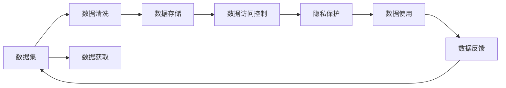

                 

# 人工智能创业数据管理的策略与方案

## 1. 背景介绍

### 1.1 问题由来

随着人工智能(AI)技术的迅猛发展，数据管理成为创业公司人工智能应用的基石。高质量的数据不仅是模型训练的基础，更是提升算法性能的关键因素。然而，许多AI创业公司在数据获取、清洗、存储、管理和使用的过程中，面临着诸多挑战。

数据管理不仅仅是数据工程师的职责，更是数据科学家和产品经理必须重视的问题。数据管理不当，不仅会导致模型性能下滑，还会浪费企业资源，甚至可能触碰到数据隐私法规的雷区。

因此，本文将深入探讨人工智能创业公司如何高效、合规、安全地管理数据，从数据获取、清洗、存储、使用到隐私保护，全方位制定数据管理策略。

## 2. 核心概念与联系

### 2.1 核心概念概述

为更好地理解人工智能创业公司数据管理的策略与方案，本节将介绍几个关键概念：

- **数据集（Dataset）**：人工智能项目所需的原始数据集合，通常包括训练集、验证集和测试集。
- **数据清洗（Data Cleaning）**：通过一系列技术手段去除数据中的噪声和错误，使数据质量达到模型训练的要求。
- **数据存储（Data Storage）**：将数据集存放在本地数据库或云存储中，便于后续的访问和分析。
- **数据访问控制（Data Access Control）**：对数据集的访问进行权限控制，保证数据的安全性和隐私性。
- **隐私保护（Privacy Protection）**：在数据管理中遵守隐私法规，避免用户数据泄露或滥用。

这些核心概念之间的逻辑关系可以通过以下Mermaid流程图来展示：



这个流程图展示了数据管理的基本流程：

1. 数据获取：通过API接口、爬虫、公开数据集等方式获取原始数据。
2. 数据清洗：去除异常值、噪声和错误，提升数据质量。
3. 数据存储：将清洗后的数据存储在数据库或云存储中。
4. 数据访问控制：设置访问权限，限制非授权人员获取数据。
5. 隐私保护：遵循法规，确保用户数据的安全和隐私。
6. 数据使用：使用数据训练模型，进行分析和预测。
7. 数据反馈：根据模型输出，进一步优化数据获取和清洗策略。

## 3. 核心算法原理 & 具体操作步骤

### 3.1 算法原理概述

人工智能创业公司数据管理的核心原理包括以下几个方面：

- **数据采集策略**：明确数据来源、采集方式、频率和样本量，制定统一的数据采集标准。
- **数据清洗方法**：使用缺失值处理、去重、异常值检测等技术对数据进行预处理，提高数据质量。
- **数据存储架构**：采用分布式文件系统、数据库等技术，实现高效、可靠的数据存储。
- **访问控制机制**：通过身份认证、权限管理、审计日志等手段，保证数据访问的安全性。
- **隐私保护措施**：采用数据脱敏、加密、匿名化等技术，确保数据隐私保护。

### 3.2 算法步骤详解

以下是人工智能创业公司数据管理的具体操作步骤：

#### 3.2.1 数据采集

- **确定数据源**：明确数据来源，包括公共数据集、API接口、爬虫采集等。
- **设计采集程序**：编写数据采集脚本，确保采集过程自动化、可重复。
- **验证数据质量**：通过抽样检查，验证采集的数据质量，确保样本分布均匀、无明显偏差。

#### 3.2.2 数据清洗

- **缺失值处理**：使用均值、中位数、插值等方法填补缺失值。
- **去重处理**：使用哈希表、记录唯一标识符等方式去重，确保数据集的唯一性。
- **异常值检测**：使用统计方法、机器学习算法等检测和处理异常值，保证数据一致性。

#### 3.2.3 数据存储

- **选择合适的存储方式**：根据数据类型和访问需求，选择文件系统、数据库、云存储等存储方式。
- **设计存储架构**：采用分布式存储、高可用性设计，确保数据的高效访问和可靠性。
- **数据备份和恢复**：定期备份数据，确保数据在故障或灾难情况下能够快速恢复。

#### 3.2.4 数据访问控制

- **身份认证**：使用OAuth、JWT等认证方式，确保数据访问者的身份合法。
- **权限管理**：根据角色和权限设置数据访问权限，限制非授权人员访问。
- **审计日志**：记录数据访问日志，便于追踪和审计。

#### 3.2.5 隐私保护

- **数据脱敏**：对敏感数据进行脱敏处理，如姓名、地址等，确保数据匿名化。
- **加密存储**：使用AES、RSA等加密算法，确保数据在存储和传输过程中不被泄露。
- **合规检查**：确保数据管理过程符合GDPR、CCPA等隐私法规，避免法律风险。

### 3.3 算法优缺点

数据管理策略的主要优点包括：

- **提高数据质量**：通过清洗和预处理，提升数据质量，为模型训练提供可靠基础。
- **增强安全性**：通过访问控制和隐私保护措施，确保数据的安全性和隐私性。
- **优化资源利用**：采用分布式存储和访问控制，提高数据的利用效率，降低存储成本。

主要缺点包括：

- **数据采集复杂**：数据采集过程可能面临隐私法规限制、数据源不稳定性等问题。
- **数据清洗耗时**：数据清洗过程复杂耗时，对资源和技术要求较高。
- **数据存储成本高**：大容量数据的存储需要高性能设备和高成本维护。
- **隐私保护挑战**：隐私法规严格，隐私保护措施需细致设计，避免法律风险。

## 4. 数学模型和公式 & 详细讲解 & 举例说明

### 4.1 数学模型构建

#### 4.1.1 数据清洗模型

数据清洗是数据管理的重要环节，常用的数据清洗模型包括：

- **缺失值处理模型**：
  $$
  \hat{x}_i = \left\{
  \begin{array}{ll}
  x_i, & \text{if } x_i \neq \text{NaN} \\
  \bar{x}, & \text{if } x_i = \text{NaN}
  \end{array}
  \right.
  $$
  其中，$\hat{x}_i$ 表示处理后的缺失值，$x_i$ 表示原始缺失值，$\bar{x}$ 表示均值或中位数。

- **异常值检测模型**：
  $$
  z = \frac{x - \mu}{\sigma}
  $$
  其中，$z$ 表示标准化后的值，$\mu$ 表示均值，$\sigma$ 表示标准差。当 $|z| > k$ 时，表示存在异常值，其中 $k$ 为异常值阈值。

#### 4.1.2 数据存储模型

数据存储模型包括文件系统和数据库系统，这里以SQL数据库为例：

- **SQL数据库模型**：
  $$
  \begin{aligned}
  &\text{CREATE TABLE table_name (} \\
  &\quad \text{column1 INT}, \\
  &\quad \text{column2 VARCHAR(255)}, \\
  &\quad \text{column3 BOOLEAN} \\
  &\text{);} \\
  \end{aligned}
  $$

#### 4.1.3 数据访问控制模型

数据访问控制通常使用RBAC（Role-Based Access Control）模型，用户通过角色进行权限管理：

- **RBAC模型**：
  $$
  \text{Access Control} = \text{Role} \times \text{Permission}
  $$

#### 4.1.4 隐私保护模型

隐私保护模型通常使用数据脱敏和加密技术：

- **数据脱敏模型**：
  $$
  \text{Sensitive Data} \rightarrow \text{Anonymized Data}
  $$
- **数据加密模型**：
  $$
  \text{Plain Text Data} \rightarrow \text{Encrypted Data} \rightarrow \text{Decrypted Data}
  $$

### 4.2 公式推导过程

#### 4.2.1 缺失值处理公式推导

$$
\hat{x}_i = \left\{
\begin{array}{ll}
x_i, & \text{if } x_i \neq \text{NaN} \\
\bar{x}, & \text{if } x_i = \text{NaN}
\end{array}
\right.
$$

其中，$\bar{x}$ 表示均值或中位数，可以通过以下公式计算：

$$
\bar{x} = \frac{1}{N} \sum_{i=1}^N x_i
$$

#### 4.2.2 异常值检测公式推导

$$
z = \frac{x - \mu}{\sigma}
$$

其中，$\mu$ 和 $\sigma$ 分别表示均值和标准差，可以通过以下公式计算：

$$
\mu = \frac{1}{N} \sum_{i=1}^N x_i
$$

$$
\sigma = \sqrt{\frac{1}{N} \sum_{i=1}^N (x_i - \mu)^2}
$$

#### 4.2.3 数据存储模型推导

- **SQL数据库插入数据**：
  $$
  \text{INSERT INTO table_name (column1, column2, column3) VALUES (value1, value2, value3)}
  $$

#### 4.2.4 数据访问控制模型推导

- **RBAC授权模型**：
  $$
  \text{Access Control} = \text{Role} \times \text{Permission}
  $$

#### 4.2.5 隐私保护模型推导

- **数据脱敏模型**：
  $$
  \text{Sensitive Data} \rightarrow \text{Anonymized Data}
  $$

- **数据加密模型**：
  $$
  \text{Plain Text Data} \rightarrow \text{Encrypted Data} \rightarrow \text{Decrypted Data}
  $$

### 4.3 案例分析与讲解

#### 4.3.1 数据清洗案例

假设有一个用户评分数据集，其中包含用户ID、电影ID和评分。数据集中有部分用户ID和电影ID缺失，需要进行清洗：

1. 确定缺失值：通过抽样检查，发现部分用户ID和电影ID缺失。
2. 缺失值处理：使用均值填补缺失值，即 $\hat{x}_i = \frac{1}{N} \sum_{i=1}^N x_i$。
3. 异常值检测：使用标准差检测异常值，即当 $|z| > k$ 时，表示存在异常值。

#### 4.3.2 数据存储案例

假设需要将用户评分数据存储在SQL数据库中，设计如下表结构：

```sql
CREATE TABLE user_ratings (
  user_id INT,
  movie_id INT,
  rating FLOAT,
  timestamp TIMESTAMP
);
```

#### 4.3.3 数据访问控制案例

假设有一个企业员工访问数据集，需要设置访问权限：

1. 确定角色：根据员工职位，设置不同的角色，如管理员、数据分析师、数据工程师等。
2. 分配权限：根据角色设置权限，管理员可以访问所有数据，数据分析师只能访问部分数据，数据工程师需要访问所有数据。
3. 审计日志：记录每个角色对数据的访问记录，便于追踪和审计。

#### 4.3.4 隐私保护案例

假设有一个包含个人健康数据的系统，需要保护隐私：

1. 数据脱敏：将姓名、地址等敏感信息进行匿名化处理。
2. 数据加密：使用AES加密算法，对敏感数据进行加密存储。
3. 合规检查：确保数据管理过程符合GDPR等隐私法规，避免法律风险。

## 5. 项目实践：代码实例和详细解释说明

### 5.1 开发环境搭建

在进行数据管理实践前，我们需要准备好开发环境。以下是使用Python进行Pandas、SQLite开发的环境配置流程：

1. 安装Anaconda：从官网下载并安装Anaconda，用于创建独立的Python环境。

2. 创建并激活虚拟环境：
```bash
conda create -n data-management python=3.8 
conda activate data-management
```

3. 安装Pandas：
```bash
conda install pandas
```

4. 安装SQLite：
```bash
conda install sqlite
```

5. 安装SQLAlchemy：
```bash
pip install sqlalchemy
```

6. 安装Flask：
```bash
pip install flask
```

完成上述步骤后，即可在`data-management`环境中开始数据管理实践。

### 5.2 源代码详细实现

下面我们以数据清洗为例，给出使用Pandas进行数据清洗的Python代码实现。

```python
import pandas as pd
import numpy as np

# 读取数据集
data = pd.read_csv('data.csv')

# 数据清洗
# 处理缺失值
data.fillna(data.mean(), inplace=True)

# 去重处理
data.drop_duplicates(inplace=True)

# 异常值检测
data['z_score'] = (data - data.mean()) / data.std()
data = data[data['z_score'].abs() < 3]

# 保存数据
data.to_csv('cleaned_data.csv', index=False)
```

以上代码展示了数据清洗的基本流程，包括缺失值处理、去重和异常值检测。使用Pandas库，我们可以快速完成这些清洗操作，并保存到本地文件中。

### 5.3 代码解读与分析

让我们再详细解读一下关键代码的实现细节：

- **数据读取**：使用`pd.read_csv`方法读取CSV格式的数据集。
- **缺失值处理**：使用`fillna`方法填充缺失值，这里使用均值填补。
- **去重处理**：使用`drop_duplicates`方法去重，确保数据的唯一性。
- **异常值检测**：计算数据的标准差和均值，使用`z_score`检测异常值，这里设定阈值为3，表示超出3倍标准差的数据为异常值。
- **数据保存**：使用`to_csv`方法将清洗后的数据保存为CSV文件。

## 6. 实际应用场景

### 6.1 智能推荐系统

智能推荐系统是人工智能创业公司的重要应用场景，通过分析用户行为和兴趣，为用户推荐个性化商品。数据管理在推荐系统中的作用非常重要：

1. **数据采集**：通过日志文件、用户行为数据、交易记录等采集数据。
2. **数据清洗**：去除异常值和噪声，提升数据质量。
3. **数据存储**：将数据存储在分布式数据库中，确保高可用性和可扩展性。
4. **数据访问控制**：设置访问权限，确保数据安全。
5. **隐私保护**：对用户数据进行脱敏处理，保护用户隐私。

通过合理的 data management，智能推荐系统能够精准地为用户推荐商品，提升用户体验和销售转化率。

### 6.2 金融风险评估

金融风险评估是人工智能创业公司的另一重要应用场景，通过分析用户财务数据和行为，评估用户信用风险。数据管理在金融风险评估中的作用包括：

1. **数据采集**：通过银行交易记录、信用卡消费数据、社交媒体数据等采集数据。
2. **数据清洗**：去除异常值和噪声，提升数据质量。
3. **数据存储**：将数据存储在安全的数据库中，确保数据隐私和安全。
4. **数据访问控制**：设置访问权限，确保数据安全。
5. **隐私保护**：对敏感数据进行加密和匿名化处理，保护用户隐私。

通过合理的 data management，金融风险评估系统能够精准地评估用户信用风险，提升风险控制能力。

### 6.3 医疗诊断系统

医疗诊断系统是人工智能创业公司的重要应用场景，通过分析患者病历和症状，提供诊断建议。数据管理在医疗诊断系统中的作用包括：

1. **数据采集**：通过医院病历数据、患者问卷数据、传感器数据等采集数据。
2. **数据清洗**：去除异常值和噪声，提升数据质量。
3. **数据存储**：将数据存储在医疗数据库中，确保数据安全和隐私。
4. **数据访问控制**：设置访问权限，确保数据安全。
5. **隐私保护**：对敏感数据进行加密和匿名化处理，保护患者隐私。

通过合理的 data management，医疗诊断系统能够精准地提供诊断建议，提升医疗服务质量。

### 6.4 未来应用展望

随着人工智能技术的不断进步，数据管理将在更多领域得到应用，为传统行业带来变革性影响。

在智慧城市治理中，数据管理技术可以帮助政府收集和分析各类数据，提升城市管理效率和公共服务水平。

在智能制造领域，数据管理技术可以帮助企业优化生产流程，提高产品质量和生产效率。

在自动驾驶领域，数据管理技术可以帮助汽车厂商收集和分析海量驾驶数据，提升车辆智能化水平和安全性能。

此外，在教育、娱乐、能源等多个领域，数据管理技术也将得到广泛应用，为社会各行各业带来新的机遇和挑战。

## 7. 工具和资源推荐

### 7.1 学习资源推荐

为了帮助开发者系统掌握数据管理技术的理论基础和实践技巧，这里推荐一些优质的学习资源：

1. 《数据科学基础》系列书籍：由著名数据科学家撰写，系统介绍了数据管理的核心概念和方法。
2. 《Python数据科学手册》：详细介绍了使用Python进行数据清洗、存储和分析的方法。
3. 《SQL必知必会》：适合初学者，介绍了SQL语言的基本语法和操作技巧。
4. 《大数据时代》：讲述了大数据技术的发展历程和应用案例，对数据管理有深刻的见解。

通过对这些资源的学习实践，相信你一定能够快速掌握数据管理的精髓，并用于解决实际的数据问题。

### 7.2 开发工具推荐

高效的开发离不开优秀的工具支持。以下是几款用于数据管理开发的常用工具：

1. Pandas：基于Python的开源数据处理库，提供了丰富的数据清洗和分析功能。
2. SQLAlchemy：Python中的ORM框架，支持多种数据库，方便进行数据存储和操作。
3. SQLite：轻量级的关系型数据库，适合存储小规模数据。
4. Flask：基于Python的Web框架，方便搭建数据管理API接口。

合理利用这些工具，可以显著提升数据管理的开发效率，加快创新迭代的步伐。

### 7.3 相关论文推荐

数据管理技术的不断发展源于学界的持续研究。以下是几篇奠基性的相关论文，推荐阅读：

1. "Data Management: A Survey"（数据管理综述）：综述了数据管理的核心技术和方法，具有很高的参考价值。
2. "Big Data: A Review"（大数据综述）：详细介绍了大数据技术的原理和应用，对数据管理有深刻见解。
3. "Privacy-Preserving Data Mining"（隐私保护数据挖掘）：介绍了隐私保护技术的基本概念和算法，适用于数据管理中的隐私保护部分。
4. "Data Mining: Concepts and Techniques"（数据挖掘概念和技术）：系统介绍了数据挖掘的核心方法和应用，对数据管理有重要参考价值。

这些论文代表了大数据管理技术的发展脉络。通过学习这些前沿成果，可以帮助研究者把握学科前进方向，激发更多的创新灵感。

## 8. 总结：未来发展趋势与挑战

### 8.1 总结

本文对人工智能创业公司数据管理的策略与方案进行了全面系统的介绍。首先阐述了数据管理在人工智能创业公司的重要性，明确了数据管理在数据采集、清洗、存储、使用和隐私保护等方面的核心策略。其次，从原理到实践，详细讲解了数据管理的数学模型和操作步骤，给出了数据管理任务开发的完整代码实例。同时，本文还广泛探讨了数据管理技术在多个行业领域的应用前景，展示了数据管理范式的巨大潜力。最后，本文精选了数据管理技术的各类学习资源，力求为读者提供全方位的技术指引。

通过本文的系统梳理，可以看到，数据管理在人工智能创业公司中的重要性日益凸显，其作用不仅限于数据存储和访问，更涉及隐私保护、合规性、安全性等多个层面。数据管理技术的发展，不仅需要技术突破，更需要法律、伦理、社会等各界的共同努力，才能实现真正安全、高效、合规的数据应用。

### 8.2 未来发展趋势

展望未来，数据管理技术将呈现以下几个发展趋势：

1. **自动化数据管理**：随着AI技术的进步，数据管理将变得更加自动化和智能化。智能化的数据采集、清洗、存储和分析系统，将大幅提高数据管理的效率和精度。
2. **边缘计算与数据管理**：边缘计算技术的兴起，将使得数据管理更加靠近数据源，降低数据传输成本，提高数据处理效率。
3. **区块链与数据管理**：区块链技术可以提供去中心化、可追溯的数据管理方式，适用于金融、医疗等敏感领域的数据管理。
4. **数据治理与数据管理**：数据治理将成为数据管理的重要组成部分，通过制定数据标准、优化数据流程、强化数据安全等手段，提升数据管理的合规性和安全性。
5. **多模态数据管理**：随着物联网和传感技术的发展，数据类型将更加多样化，多模态数据管理技术将能够高效处理和融合不同类型的数据。

这些趋势凸显了数据管理技术的广阔前景。未来的数据管理技术将更加智能化、自动化、安全化和多样化，为人工智能技术的应用提供更加可靠的基础。

### 8.3 面临的挑战

尽管数据管理技术已经取得了一定进展，但在迈向更加智能化、普适化应用的过程中，它仍面临着诸多挑战：

1. **数据隐私与安全**：随着数据量的大幅增加，数据隐私和安全问题变得愈发突出。如何在保护隐私的前提下，提供高效的数据管理服务，是一个亟待解决的问题。
2. **数据质量控制**：数据质量的提升需要耗费大量时间和资源，如何在数据管理过程中确保数据质量，需要更加智能化的数据清洗和监控机制。
3. **数据存储成本**：大规模数据存储需要高性能设备和大量资源，如何降低数据存储成本，提高数据存储效率，是一个重要的研究方向。
4. **数据管理标准化**：不同企业的数据管理方式和标准不一致，缺乏统一的数据管理标准，导致数据共享和互操作性差。
5. **数据管理平台化**：现有的数据管理工具多为独立的模块，缺乏统一的数据管理平台，无法实现全流程的数据管理。

这些挑战需要我们在技术、标准和平台化等方面进行深入研究和探索，才能实现数据管理的可持续发展。

### 8.4 研究展望

未来的数据管理研究需要在以下几个方面寻求新的突破：

1. **自动化数据管理技术**：开发更加智能化的数据管理工具，实现自动化的数据采集、清洗、存储和分析。
2. **区块链数据管理**：利用区块链技术，实现去中心化、透明化的数据管理，提升数据安全性和可信度。
3. **边缘计算与数据管理**：探索边缘计算技术在数据管理中的应用，降低数据传输成本，提高数据处理效率。
4. **数据治理与数据管理**：制定统一的数据管理标准和流程，提升数据管理的规范化和标准化水平。
5. **多模态数据管理**：研究多模态数据融合和分析技术，提升数据的综合利用能力。

这些研究方向将引领数据管理技术的发展方向，推动数据管理技术的成熟和普及。

## 9. 附录：常见问题与解答

**Q1：数据管理如何提高模型性能？**

A: 数据管理通过提升数据质量和效率，直接影响模型性能。高质量的数据能够提供更丰富的特征，提升模型训练的效果；高效的数据管理能够加速模型训练，提高预测速度。

**Q2：数据管理中如何避免数据泄露风险？**

A: 数据管理中避免数据泄露风险主要从以下几个方面入手：
1. 数据加密：对敏感数据进行加密存储和传输，防止未授权访问。
2. 数据脱敏：对用户ID、姓名等敏感信息进行匿名化处理，确保数据隐私。
3. 访问控制：设置严格的访问权限，限制非授权人员访问。
4. 审计日志：记录数据访问日志，便于追踪和审计。

**Q3：数据管理中的自动化技术有哪些？**

A: 数据管理中的自动化技术包括：
1. 自动化数据采集：通过爬虫、API接口等方式自动获取数据。
2. 自动化数据清洗：使用算法自动检测和处理数据中的异常值、缺失值和噪声。
3. 自动化数据存储：通过分布式文件系统和数据库实现数据的高效存储和访问。
4. 自动化数据访问控制：根据角色和权限自动控制数据访问。

这些自动化技术能够大幅提高数据管理的效率和精度，降低人工操作的成本和风险。

**Q4：数据管理中如何保证数据的实时性？**

A: 保证数据实时性主要从以下几个方面入手：
1. 数据采集：通过实时日志文件、实时传感器数据等方式获取实时数据。
2. 数据存储：使用分布式文件系统和数据库，确保数据的高效存储和访问。
3. 数据访问控制：设置严格的访问权限，确保数据的安全性。
4. 数据同步：使用消息队列、数据流等技术实现数据同步，确保数据的时效性。

合理利用这些技术，可以确保数据管理系统的实时性，满足实时性要求高的应用场景。

**Q5：数据管理中的数据质量控制方法有哪些？**

A: 数据质量控制主要从以下几个方面入手：
1. 数据清洗：去除异常值、噪声和错误，提升数据质量。
2. 数据校验：使用校验码、 checksum 等方法检测数据完整性。
3. 数据一致性：确保数据在不同时间和空间上的统一性，避免数据不一致。
4. 数据标注：对数据进行标注和注释，提高数据的可用性和准确性。

这些方法能够有效提升数据质量，为模型训练提供可靠的基础。

---

作者：禅与计算机程序设计艺术 / Zen and the Art of Computer Programming

