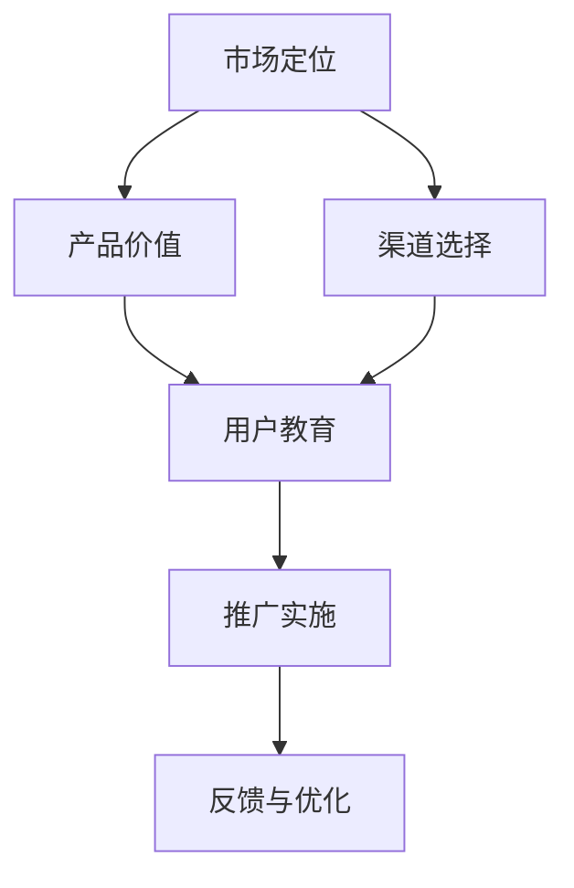

                 

## 1. 背景介绍

### 1.1 问题由来
随着人工智能(AI)技术的日益成熟和应用场景的不断拓展，越来越多的企业开始探索AI创业之路。然而，成功的AI创业不仅仅依赖于先进的技术，更在于有效的市场推广和商业化策略。在AI领域，推广策略的正确与否，往往决定了产品能否成功落地，能否实现商业上的可持续增长。

### 1.2 问题核心关键点
本文将重点探讨AI创业中推广策略的核心概念，包括市场定位、产品价值、渠道选择、用户教育等关键要素，并通过案例分析来揭示其背后的原理和实践路径。此外，我们还将分析当前AI创业在推广策略方面存在的一些常见问题，并提出解决方案和未来趋势。

### 1.3 问题研究意义
深入理解AI创业中的推广策略，有助于企业更好地将技术优势转化为商业价值，加速AI技术的市场应用和产业化进程。通过分析成功案例和失败教训，可以为后来者提供宝贵的经验借鉴，避免重蹈覆辙，同时也能为AI创业生态系统的健康发展贡献力量。

## 2. 核心概念与联系

### 2.1 核心概念概述

为更好地理解AI创业中的推广策略，我们需要先明确几个核心概念：

- **市场定位(Market Segmentation)**：指根据用户的不同需求、行为、特征等将市场划分为若干个子市场的过程，旨在发现和锁定最有潜力的目标用户群体。
- **产品价值(Product Value)**：指产品在实际使用中为用户带来的好处和效益，包括功能、易用性、性能、安全性等，是推广策略的核心驱动力。
- **渠道选择(Channel Selection)**：指选择何种渠道将产品推广到目标用户，包括线上（如社交媒体、搜索引擎、应用商店）和线下（如展会、会议、合作伙伴）等，需要根据目标用户的行为习惯和偏好来决定。
- **用户教育(User Education)**：指通过各种方式帮助用户理解和使用产品，提升其价值感知，并培养用户对品牌的忠诚度。

这些概念之间的关系可以通过以下Mermaid流程图来展示：



这个流程图展示了从市场定位到推广实施的整个流程，其中市场定位是起点，产品价值是核心，渠道选择是手段，用户教育是过程，推广实施和反馈与优化则是持续迭代的结果。

## 3. 核心算法原理 & 具体操作步骤

### 3.1 算法原理概述

AI创业中的推广策略可以视为一个复杂的市场优化问题。其核心目标是最大化产品的市场份额和用户价值，同时最小化推广成本。推广策略的优化通常需要通过以下几个步骤：

1. **市场定位**：确定目标用户群体，进行市场细分。
2. **产品价值分析**：分析产品对目标用户的实际价值，确定产品独特卖点。
3. **渠道选择**：选择最适合目标用户的推广渠道，制定推广计划。
4. **用户教育**：通过教育和培训提升用户对产品的价值感知和购买意愿。
5. **推广实施**：执行推广计划，监测效果并进行调整优化。

这些步骤可以通过一个简单的数学模型来表示，其中推广效果由推广渠道的选择和执行方式决定，产品价值和用户教育是影响推广效果的重要因素，而市场定位则决定了推广的资源配置。

### 3.2 算法步骤详解

以下将详细介绍推广策略优化的一般步骤：

#### 3.2.1 市场定位

**Step 1: 数据收集与分析**
- 收集市场和用户数据，包括人口统计特征、行为数据、偏好数据等。
- 使用数据分析工具（如Google Analytics、Tableau）进行市场细分，找出具有共同特征的潜在用户群体。

**Step 2: 目标用户确定**
- 基于数据分析结果，确定最有潜力的目标用户群体。
- 分析目标用户的行为和需求，制定针对性的推广策略。

#### 3.2.2 产品价值分析

**Step 1: 功能与用户体验**
- 列出产品的主要功能和用户界面，评估其易用性和用户体验。
- 通过用户调查和反馈收集，了解用户对产品功能的评价和改进建议。

**Step 2: 性能与安全性**
- 评估产品的性能指标，如响应时间、数据处理速度、稳定性等。
- 分析产品的安全性特征，确保用户数据和隐私安全。

#### 3.2.3 渠道选择

**Step 1: 渠道评估**
- 分析不同推广渠道的特点和优劣，如成本、覆盖范围、用户行为等。
- 评估每种渠道对目标用户的吸引力，选择最适合的渠道。

**Step 2: 推广计划制定**
- 根据目标用户的行为和渠道特点，制定详细的推广计划。
- 确定推广的关键指标和预期效果，如品牌曝光率、转化率等。

#### 3.2.4 用户教育

**Step 1: 内容开发**
- 根据产品特点和用户需求，开发适合的教育内容，如使用手册、教程视频、在线课程等。
- 设计互动性强的用户界面和交互流程，提升用户的学习体验。

**Step 2: 教育方式选择**
- 选择合适的教育方式，如在线培训、线下讲座、社交媒体教学等。
- 建立用户社区，促进用户之间的经验分享和知识传递。

#### 3.2.5 推广实施与反馈

**Step 1: 推广活动执行**
- 按照推广计划，执行各类推广活动，如广告投放、内容营销、公关活动等。
- 使用自动化工具（如Google Ads、Facebook Ads）进行精准投放，提升广告效果。

**Step 2: 效果监测与优化**
- 实时监测推广效果，如访问量、转化率、用户反馈等。
- 根据反馈结果调整推广策略，优化资源配置，提升推广效果。

### 3.3 算法优缺点

AI创业中的推广策略具有以下优点：
1. **精准定位**：通过市场定位和目标用户分析，能够精准锁定最有潜力的用户群体。
2. **价值突出**：强调产品价值分析，帮助企业从竞争激烈的市场中脱颖而出。
3. **渠道多样化**：选择多样化的推广渠道，覆盖不同用户群体，提升品牌曝光率。
4. **用户教育**：通过用户教育提升用户对产品的价值感知，增强用户忠诚度。

同时，推广策略也存在一些局限性：
1. **高成本**：推广策略的实施通常需要投入大量的人力和财力资源。
2. **风险高**：市场变化快速，推广策略的效果难以完全预测，风险较高。
3. **复杂度高**：推广策略需要综合考虑多个因素，设计和执行过程复杂。

尽管存在这些挑战，但通过合理的规划和执行，推广策略仍是大规模AI创业成功的关键之一。

### 3.4 算法应用领域

AI创业中的推广策略在多个领域得到了广泛应用，如医疗AI、金融科技、智能制造等。这些领域的产品和服务往往需要大量的市场推广和用户教育，以实现其商业价值。

例如，在医疗AI领域，推广策略可以用于提升医生对AI诊断工具的认知和使用率，提高诊断准确性和效率。在金融科技领域，推广策略可以用于普及AI风险评估和智能理财服务，提升用户体验和市场份额。在智能制造领域，推广策略可以用于推广AI驱动的生产优化和管理软件，提升生产效率和质量。

## 4. 数学模型和公式 & 详细讲解 & 举例说明

### 4.1 数学模型构建

推广策略的优化问题可以视为一个多目标优化问题。假设有两个目标：市场份额最大化和推广成本最小化。设市场份额为 $X$，推广成本为 $Y$，推广效果为 $Z$。则推广策略优化的目标函数为：

$$
\max_{x,y} f(x,y) = (X - \epsilon_1)(Z - \epsilon_2)
$$

其中 $\epsilon_1, \epsilon_2$ 为常数，$x$ 和 $y$ 分别表示推广策略的决策变量，如渠道选择、广告预算、用户教育预算等。

### 4.2 公式推导过程

在推广策略优化中，推广效果 $Z$ 通常由以下几个因素决定：
1. **推广渠道选择**：不同渠道对目标用户的覆盖率和吸引力不同，选择合适的渠道可以显著提升推广效果。
2. **广告投放策略**：广告投放的时机、频率、内容等对用户行为和转化率有显著影响。
3. **用户教育**：通过用户教育和培训，提高用户对产品的理解和价值感知，增加转化率。

我们可以将推广效果 $Z$ 表示为渠道选择 $x_1$、广告投放策略 $x_2$ 和用户教育 $x_3$ 的函数：

$$
Z = g(x_1, x_2, x_3)
$$

推广效果 $Z$ 的优化目标可以表示为：

$$
\max_{x_1, x_2, x_3} g(x_1, x_2, x_3)
$$

### 4.3 案例分析与讲解

以某AI诊断工具的推广策略为例，我们可以从以下角度进行分析：

**市场定位**：目标用户为医院和诊所的医生，市场细分基于地理位置、医院等级和科室类型。

**产品价值分析**：产品的主要价值在于提高诊断准确率和效率，减少误诊和漏诊。

**渠道选择**：选择线上渠道（如医院官网、医患平台）和线下渠道（如医院推广活动、医学大会）进行推广。

**用户教育**：通过在线教程、专题讲座、医学论坛等形式，提升医生对AI诊断工具的理解和信任。

**推广实施与反馈**：通过A/B测试和数据分析，实时监测推广效果，调整优化广告投放策略和用户教育计划。

通过这种推广策略，该AI诊断工具在市场上取得了显著的成功，提高了医生的使用率和医院的诊断水平，实现了商业上的成功。

## 5. 项目实践：代码实例和详细解释说明

### 5.1 开发环境搭建

在进行推广策略优化实践前，我们需要准备好开发环境。以下是使用Python进行推广策略优化的环境配置流程：

1. 安装Python：从官网下载并安装Python，确保版本为3.6或以上。
2. 安装必要的库：使用pip安装numpy、pandas、scikit-learn、matplotlib等库。
3. 数据准备：收集和整理市场、用户、产品数据，确保数据格式和质量。
4. 模型搭建：使用scikit-learn或其他机器学习框架搭建推广策略优化模型。
5. 模型训练与评估：使用训练集和验证集数据，对模型进行训练和评估。

### 5.2 源代码详细实现

以下是一个简单的推广策略优化模型的Python实现，包含市场定位、产品价值分析和渠道选择三个步骤：

```python
import numpy as np
from sklearn.model_selection import train_test_split
from sklearn.ensemble import RandomForestRegressor

# 市场定位
def market_segmentation(data):
    # 数据预处理和特征工程
    X = data[['age', 'gender', 'location']]
    y = data['sales']
    X_train, X_test, y_train, y_test = train_test_split(X, y, test_size=0.2)
    
    # 训练市场定位模型
    model = RandomForestRegressor(n_estimators=100, random_state=42)
    model.fit(X_train, y_train)
    y_pred = model.predict(X_test)
    
    return y_pred

# 产品价值分析
def product_value_analysis(data):
    # 数据预处理和特征工程
    X = data[['price', 'quality', 'user_reviews']]
    y = data['value']
    X_train, X_test, y_train, y_test = train_test_split(X, y, test_size=0.2)
    
    # 训练产品价值分析模型
    model = RandomForestRegressor(n_estimators=100, random_state=42)
    model.fit(X_train, y_train)
    y_pred = model.predict(X_test)
    
    return y_pred

# 渠道选择
def channel_selection(data):
    # 数据预处理和特征工程
    X = data[['cost', 'reach', 'engagement']]
    y = data['sales']
    X_train, X_test, y_train, y_test = train_test_split(X, y, test_size=0.2)
    
    # 训练渠道选择模型
    model = RandomForestRegressor(n_estimators=100, random_state=42)
    model.fit(X_train, y_train)
    y_pred = model.predict(X_test)
    
    return y_pred
```

### 5.3 代码解读与分析

在上述代码中，我们使用了RandomForestRegressor模型来模拟市场定位、产品价值分析和渠道选择的过程。这些模型可以根据历史数据进行训练，并预测未来的推广效果。

- **市场定位**：通过分析用户的年龄、性别和地理位置，预测市场的潜力和分布。
- **产品价值分析**：通过分析产品的价格、质量和用户评价，预测产品的价值和市场反应。
- **渠道选择**：通过分析不同渠道的成本、覆盖范围和用户参与度，预测渠道的选择效果。

以上模型可以进一步结合数据分析和优化算法，如遗传算法、粒子群算法等，进行推广策略的优化。

## 6. 实际应用场景

### 6.1 医疗AI推广策略

在医疗AI领域，推广策略可以用于推广AI诊断工具、药物推荐系统和智能护理机器人等。这些产品和服务通常需要经过严格的市场验证和用户教育，才能真正落地应用。

以AI诊断工具为例，推广策略可以包括以下几个步骤：

- **市场定位**：根据医院等级、科室类型、地理位置等因素，确定目标用户。
- **产品价值分析**：通过实际病例和临床数据，评估AI诊断工具的准确率和效率提升效果。
- **渠道选择**：通过医院官网、医患平台和医学大会进行推广，提升品牌知名度。
- **用户教育**：通过在线教程、专题讲座和医学论坛，提升医生的使用率和信任度。

### 6.2 金融科技推广策略

在金融科技领域，推广策略可以用于推广AI风险评估系统、智能理财应用和区块链平台等。这些产品和服务通常需要高可靠性和用户信任，推广策略的执行需要格外谨慎。

以AI风险评估系统为例，推广策略可以包括以下几个步骤：

- **市场定位**：根据金融机构类型、客户需求、地理位置等因素，确定目标用户。
- **产品价值分析**：通过金融数据和历史案例，评估AI风险评估系统的准确率和风险降低效果。
- **渠道选择**：通过银行官网、金融论坛和行业展会进行推广，提升品牌影响力和用户参与度。
- **用户教育**：通过在线培训和用户手册，提升金融机构和客户对AI风险评估系统的理解和信任。

### 6.3 智能制造推广策略

在智能制造领域，推广策略可以用于推广AI驱动的生产优化和管理软件。这些产品和服务通常需要与工业设备和管理系统无缝集成，推广策略的执行需要技术支持和合作伙伴的支持。

以AI生产优化软件为例，推广策略可以包括以下几个步骤：

- **市场定位**：根据制造行业、企业规模、地理位置等因素，确定目标用户。
- **产品价值分析**：通过生产数据和实验结果，评估AI生产优化软件的效果和成本效益。
- **渠道选择**：通过工业展会、技术论坛和合作伙伴推广，提升品牌知名度和市场份额。
- **用户教育**：通过技术培训和案例演示，提升制造企业对AI生产优化软件的理解和接受度。

## 7. 工具和资源推荐

### 7.1 学习资源推荐

为了帮助开发者系统掌握AI创业中的推广策略，这里推荐一些优质的学习资源：

1. **《AI创业之路》系列博文**：由AI创业领域的专家撰写，深入浅出地介绍了AI创业中的市场定位、产品价值分析、渠道选择等核心概念。

2. **斯坦福大学《人工智能创业》课程**：斯坦福大学的知名课程，涵盖了AI创业的多个方面，包括市场调研、产品开发、用户教育等。

3. **《AI创业实战手册》书籍**：涵盖了AI创业的各个环节，从市场定位到用户教育，提供了详细的案例分析和操作步骤。

4. **Coursera《AI商业化》课程**：Coursera平台的AI商业化课程，通过实际案例教授AI创业中的推广策略和商业化路径。

5. **Google AI创业指南**：谷歌提供的AI创业指南，包含市场分析、用户教育、渠道选择等实用技巧。

通过对这些资源的学习实践，相信你一定能够快速掌握AI创业中的推广策略，并用于解决实际的AI推广问题。

### 7.2 开发工具推荐

高效的推广策略优化开发离不开优秀的工具支持。以下是几款用于推广策略优化的常用工具：

1. **Python**：作为AI领域的主流编程语言，Python具有丰富的库和工具，适合推广策略优化的算法实现。
2. **Pandas**：数据处理和分析库，支持大规模数据集的处理和分析，适合推广策略中的数据预处理。
3. **Scikit-learn**：机器学习库，支持多种分类和回归算法，适合推广策略中的模型训练和评估。
4. **Tableau**：数据可视化工具，适合推广策略中的市场分析和用户教育。
5. **Google Analytics**：网站流量和用户行为分析工具，适合推广策略中的渠道效果监测。

合理利用这些工具，可以显著提升推广策略优化的开发效率，加快创新迭代的步伐。

### 7.3 相关论文推荐

推广策略的优化涉及多个学科领域的知识，以下是几篇奠基性的相关论文，推荐阅读：

1. **市场定位与用户细分**：研究如何通过市场细分和目标用户分析，提升产品和服务的市场竞争力。

2. **产品价值与用户体验**：探讨如何设计高价值、易用性强的产品，满足用户需求，提升用户满意度。

3. **渠道选择与推广策略**：分析不同渠道的特点和效果，选择最合适的推广渠道，制定有效的推广计划。

4. **用户教育与品牌建设**：研究如何通过用户教育提升用户对产品的价值感知，增强品牌忠诚度。

5. **推广效果监测与优化**：探讨如何通过数据驱动的方式，实时监测推广效果，不断优化推广策略。

这些论文代表了大规模AI创业中的推广策略的演进脉络。通过学习这些前沿成果，可以帮助研究者把握学科前进方向，激发更多的创新灵感。

## 8. 总结：未来发展趋势与挑战

### 8.1 总结

本文对AI创业中的推广策略进行了全面系统的介绍。首先阐述了推广策略在AI创业中的重要性，明确了市场定位、产品价值、渠道选择、用户教育等核心概念。其次，从原理到实践，详细讲解了推广策略的数学模型和关键步骤，给出了推广策略优化模型的代码实现。同时，本文还广泛探讨了推广策略在多个行业领域的应用前景，展示了推广策略范式的巨大潜力。此外，本文精选了推广策略的各类学习资源，力求为读者提供全方位的技术指引。

通过本文的系统梳理，可以看到，推广策略在AI创业中的关键作用，以及其对AI技术落地应用的推动作用。未来，伴随AI技术的持续发展和市场环境的不断变化，推广策略也需要不断迭代和优化，以适应新的市场挑战和技术趋势。

### 8.2 未来发展趋势

展望未来，AI创业中的推广策略将呈现以下几个发展趋势：

1. **数据驱动**：利用大数据和人工智能技术，通过分析用户行为和市场趋势，优化推广策略。
2. **个性化推广**：根据用户的不同需求和偏好，提供定制化的推广内容和渠道，提升用户体验。
3. **多渠道整合**：整合线上和线下渠道，实现全渠道推广，提升品牌影响力和市场覆盖率。
4. **社交媒体营销**：利用社交媒体平台，通过用户互动和内容传播，提升品牌知名度和用户参与度。
5. **用户反馈机制**：建立用户反馈机制，及时了解用户需求和意见，优化产品和服务。

### 8.3 面临的挑战

尽管推广策略在大规模AI创业中具有重要价值，但在实践过程中仍面临诸多挑战：

1. **数据隐私和安全**：在推广策略中需要收集和处理大量用户数据，如何保护用户隐私和数据安全是一个重要问题。
2. **用户需求多样性**：不同用户群体的需求和行为差异大，如何设计多样化的推广策略满足其需求，是一个挑战。
3. **市场竞争激烈**：AI领域的市场竞争日益激烈，如何在众多竞品中脱颖而出，是一个难题。
4. **资源投入高**：推广策略的实施需要投入大量的人力和财力资源，如何高效利用资源，是一个现实问题。

### 8.4 研究展望

面对推广策略面临的种种挑战，未来的研究需要在以下几个方面寻求新的突破：

1. **数据隐私保护**：研究如何在推广策略中保护用户隐私和数据安全，同时利用数据驱动的优化。
2. **个性化推广技术**：研究如何通过机器学习和人工智能技术，实现个性化的推广策略，提升用户体验。
3. **多渠道整合策略**：研究如何整合线上和线下渠道，实现全渠道推广，提升品牌影响力和市场覆盖率。
4. **社交媒体营销方法**：研究如何在社交媒体平台进行有效的营销推广，提升品牌知名度和用户参与度。
5. **用户反馈和优化机制**：研究如何建立用户反馈机制，及时了解用户需求和意见，优化产品和服务。

这些研究方向的探索，必将引领AI创业中的推广策略走向更高的台阶，为AI技术的市场应用和产业化进程提供更多可能性。

## 9. 附录：常见问题与解答

**Q1: 什么是推广策略的优化模型？**

A: 推广策略的优化模型是一种机器学习模型，通过分析历史数据和用户行为，预测不同推广渠道和策略的效果，帮助企业选择最优的推广方案。常用的优化模型包括线性回归、随机森林、神经网络等。

**Q2: 如何选择合适的推广渠道？**

A: 选择合适的推广渠道需要综合考虑多个因素，如目标用户的特征、渠道的成本和效果等。通常可以通过A/B测试和市场调研，选择最合适的渠道进行推广。

**Q3: 推广策略中的用户教育有哪些形式？**

A: 用户教育的形式多种多样，包括在线教程、专题讲座、产品手册、案例演示等。企业应根据产品和用户特点，选择最适合的教育形式，提升用户对产品的理解和价值感知。

**Q4: 推广策略的优化效果如何评估？**

A: 推广策略的优化效果可以通过多种指标进行评估，如市场份额、品牌曝光率、用户参与度、转化率等。企业应根据具体目标和市场环境，选择合适的评估指标，实时监测推广效果。

**Q5: 推广策略中如何保护用户隐私？**

A: 在推广策略中保护用户隐私，需要严格遵守相关法律法规，如GDPR、CCPA等。企业应设计匿名化处理机制，避免直接收集和使用用户的个人信息。同时，应建立用户数据保护机制，保障数据安全和隐私。

通过这些常见问题的解答，相信你一定能够更好地理解AI创业中的推广策略，并在实际操作中取得成功。

---

作者：禅与计算机程序设计艺术 / Zen and the Art of Computer Programming

