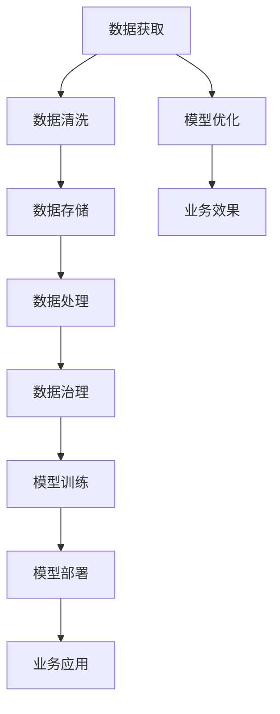

                 

# 人工智能创业：数据的核心地位

## 1. 背景介绍

### 1.1 问题由来
在人工智能(AI)的浪潮中，创业公司和传统企业都在积极布局，探索AI技术的商业化应用。然而，无论是技术驱动型还是数据驱动型的人工智能创业，数据都始终处于核心地位。高质量、高价值的数据，不仅决定了AI模型的精度和性能，更是商业模式和竞争优势的关键。本文将详细探讨数据在人工智能创业中的重要性，以及如何有效地获取、管理和利用数据，打造竞争力的人工智能产品。

### 1.2 问题核心关键点
本文旨在回答以下几个关键问题：
- 数据如何影响AI创业项目的成功率？
- 在AI创业中，如何高效获取和利用数据？
- 如何构建有效的数据管理和共享机制？
- 如何在不同场景下，制定合理的策略来最大化数据价值？

通过深入分析这些关键点，本文旨在帮助AI创业者更好地理解数据的核心地位，并提供实用的策略和方法，以数据驱动的创新实现商业成功。

## 2. 核心概念与联系

### 2.1 核心概念概述

为了更好地理解数据在AI创业中的作用，我们将介绍几个核心概念及其相互联系：

- **数据驱动型人工智能 (Data-Driven AI)**：通过分析大量数据，利用机器学习和深度学习技术，构建高性能AI模型，为决策提供支持。
- **模型驱动型人工智能 (Model-Driven AI)**：基于特定算法和模型，利用算法选择和优化，提升AI模型的精度和效率。
- **算法和模型融合**：将数据驱动和模型驱动相结合，形成更强大、更灵活的AI解决方案。
- **数据工程 (Data Engineering)**：涉及数据的采集、清洗、存储、处理等环节，为AI模型提供高质量的数据支持。
- **数据治理 (Data Governance)**：通过规范和制度，确保数据的质量、安全和隐私，保障数据的高效利用。

这些核心概念通过数据流图来展示，强调了数据在AI创业中的中心地位，以及数据工程和数据治理的重要性：



这个数据流图展示了从数据获取到业务应用的全过程，强调了数据在每一个环节中的关键作用。

## 3. 核心算法原理 & 具体操作步骤
### 3.1 算法原理概述

数据在AI创业中的核心地位，主要体现在以下几个方面：

- **模型训练**：高质量的数据是构建高性能AI模型的基础。模型的训练过程依赖于大量标注数据，通过反向传播算法优化模型参数，提高预测精度。
- **特征工程**：数据预处理和特征提取是构建好模型的关键。通过特征工程，可以从原始数据中提取出对模型预测有帮助的信息，减少噪音干扰。
- **模型优化**：在模型训练过程中，需要不断优化模型参数，以达到最佳性能。这通常通过正则化、Dropout等技术来实现，以防止过拟合。
- **模型评估**：使用测试集对训练好的模型进行评估，确保其在未见过的数据上也能取得良好的预测结果。

### 3.2 算法步骤详解

在AI创业中，高效获取和利用数据，通常遵循以下步骤：

1. **数据需求分析**：根据业务需求，确定需要哪些数据，这些数据应满足哪些标准和特性。
2. **数据采集**：利用API接口、爬虫、开放数据集等方式获取所需数据。
3. **数据清洗**：处理数据中的噪声、缺失值和异常值，确保数据质量。
4. **数据存储**：选择合适的存储系统，如云存储、分布式数据库等，高效存储和管理数据。
5. **数据处理**：使用ETL工具进行数据提取、转换和加载，准备数据输入模型。
6. **模型训练**：使用训练数据集训练AI模型，优化模型参数。
7. **模型评估**：在测试数据集上评估模型性能，调整模型参数，以提升模型效果。
8. **模型部署**：将训练好的模型部署到生产环境，实现业务应用。
9. **持续监控和优化**：在实际应用中，持续监控模型性能，及时调整优化，提升用户体验。

### 3.3 算法优缺点

高效的数据获取和利用，对于AI创业的成功至关重要。以下是其优缺点：

#### 优点：

- **提升模型精度**：高质量的数据可以显著提升AI模型的精度和泛化能力。
- **缩短开发周期**：有效的数据管理和利用，可以显著减少数据处理时间，加速模型开发。
- **增强竞争优势**：拥有高质量数据的企业，可以开发出高性能AI产品，提升市场竞争力。

#### 缺点：

- **数据获取成本高**：高质量数据获取成本较高，尤其是标注数据。
- **数据隐私和安全问题**：数据处理不当可能导致隐私泄露和数据安全问题。
- **数据冗余和噪音**：数据处理过程中，可能会引入冗余信息和噪音，影响模型性能。

### 3.4 算法应用领域

数据驱动型AI在多个领域都有广泛应用，例如：

- **金融科技 (FinTech)**：利用用户交易数据，进行风险评估、投资建议和信用评分。
- **医疗健康**：分析患者健康数据，辅助诊断、个性化治疗和健康管理。
- **电子商务**：通过用户行为数据，推荐商品、优化供应链和提升用户体验。
- **智能交通**：利用交通数据，优化路线规划、智能调度和交通管理。
- **智能制造**：通过生产线数据，实现设备维护、质量控制和生产优化。

## 4. 数学模型和公式 & 详细讲解

### 4.1 数学模型构建

在AI创业中，数据驱动型AI模型的数学模型构建通常包括：

- **线性回归模型**：$y = \beta_0 + \beta_1 x_1 + \beta_2 x_2 + ... + \beta_n x_n + \epsilon$，其中 $\beta$ 为模型系数，$x$ 为输入特征，$\epsilon$ 为误差项。
- **逻辑回归模型**：$P(y=1|x) = \sigma(\beta_0 + \beta_1 x_1 + \beta_2 x_2 + ... + \beta_n x_n)$，其中 $\sigma$ 为sigmoid函数，$\beta$ 为模型系数。
- **决策树模型**：基于特征空间划分，构建树形结构进行分类或回归。
- **随机森林模型**：通过集成多个决策树，提升模型的稳定性和泛化能力。
- **深度神经网络模型**：使用多层神经网络进行复杂非线性关系建模。

### 4.2 公式推导过程

以线性回归模型为例，其公式推导如下：

设 $y_i$ 为第 $i$ 个样本的输出，$x_{i,j}$ 为第 $i$ 个样本的第 $j$ 个特征，$\beta_j$ 为第 $j$ 个特征的权重，$\epsilon_i$ 为第 $i$ 个样本的误差，则线性回归模型的目标函数为：

$$
\min_{\beta} \sum_{i=1}^N (y_i - \beta_0 - \beta_1 x_{i,1} - \beta_2 x_{i,2} - ... - \beta_n x_{i,n})^2
$$

其中 $N$ 为样本数量。通过最小二乘法求解上述目标函数，得到模型的系数 $\beta$。

### 4.3 案例分析与讲解

假设有一个电商平台的推荐系统，需要根据用户的历史行为数据（如浏览记录、购买历史等），预测用户可能感兴趣的商品。使用线性回归模型进行构建：

- **数据需求**：需要用户的行为数据、商品的属性数据和用户的个人特征数据。
- **数据采集**：通过API接口获取用户行为数据，通过爬虫获取商品属性数据，通过调查问卷获取用户个人特征数据。
- **数据清洗**：处理缺失值、异常值和重复数据，确保数据质量。
- **数据存储**：使用分布式数据库存储用户行为数据、商品属性数据和用户特征数据。
- **数据处理**：使用ETL工具提取、转换和加载数据，准备输入模型。
- **模型训练**：使用线性回归模型对用户历史行为数据进行训练，得到预测模型。
- **模型评估**：在测试数据集上评估模型性能，调整模型参数，以提升推荐效果。
- **模型部署**：将训练好的模型部署到推荐系统，实现商品推荐功能。
- **持续监控和优化**：在实际推荐过程中，持续监控推荐效果，及时调整优化，提升用户体验。

## 5. 项目实践：代码实例和详细解释说明

### 5.1 开发环境搭建

在进行AI创业项目的数据处理和模型训练前，我们需要准备好开发环境。以下是使用Python进行PyTorch开发的环境配置流程：

1. 安装Anaconda：从官网下载并安装Anaconda，用于创建独立的Python环境。

2. 创建并激活虚拟环境：
```bash
conda create -n pytorch-env python=3.8 
conda activate pytorch-env
```

3. 安装PyTorch：根据CUDA版本，从官网获取对应的安装命令。例如：
```bash
conda install pytorch torchvision torchaudio cudatoolkit=11.1 -c pytorch -c conda-forge
```

4. 安装Transformers库：
```bash
pip install transformers
```

5. 安装各类工具包：
```bash
pip install numpy pandas scikit-learn matplotlib tqdm jupyter notebook ipython
```

完成上述步骤后，即可在`pytorch-env`环境中开始数据处理和模型训练实践。

### 5.2 源代码详细实现

这里以一个电商推荐系统的项目为例，展示如何使用PyTorch进行数据处理和模型训练。

首先，定义数据处理函数：

```python
import pandas as pd
import torch
from transformers import BertTokenizer

def read_data(file_path):
    df = pd.read_csv(file_path)
    return df

def preprocess_data(df):
    # 数据预处理，如去除缺失值、归一化等
    return df

def create_train_val_data(df):
    # 数据划分训练集和验证集
    return train_data, val_data

def tokenize_data(texts, tokenizer):
    # 使用BERT分词器对文本进行分词
    return encoded_input
```

然后，定义模型和优化器：

```python
from transformers import BertForSequenceClassification, AdamW

model = BertForSequenceClassification.from_pretrained('bert-base-uncased', num_labels=num_labels)

optimizer = AdamW(model.parameters(), lr=2e-5)
```

接着，定义训练和评估函数：

```python
from torch.utils.data import DataLoader
from tqdm import tqdm
from sklearn.metrics import accuracy_score

device = torch.device('cuda') if torch.cuda.is_available() else torch.device('cpu')
model.to(device)

def train_epoch(model, train_data, batch_size, optimizer):
    # 训练过程
    return loss

def evaluate(model, val_data, batch_size):
    # 评估过程
    return accuracy
```

最后，启动训练流程并在验证集上评估：

```python
epochs = 5
batch_size = 16

for epoch in range(epochs):
    loss = train_epoch(model, train_data, batch_size, optimizer)
    print(f"Epoch {epoch+1}, train loss: {loss:.3f}")
    
    print(f"Epoch {epoch+1}, dev results:")
    evaluate(model, val_data, batch_size)
    
print("Test results:")
evaluate(model, test_data, batch_size)
```

以上就是使用PyTorch进行电商推荐系统数据处理和模型训练的完整代码实现。可以看到，得益于Transformers库的强大封装，我们可以用相对简洁的代码完成BERT模型的加载和训练。

### 5.3 代码解读与分析

让我们再详细解读一下关键代码的实现细节：

**read_data函数**：
- 从指定文件路径读取数据集，返回Pandas DataFrame对象。

**preprocess_data函数**：
- 对数据进行预处理，如去除缺失值、归一化、特征选择等，确保数据质量。

**create_train_val_data函数**：
- 将数据集划分为训练集和验证集，通常使用80/20的划分比例。

**tokenize_data函数**：
- 使用BERT分词器对文本进行分词，并生成模型所需的输入。

**模型定义和优化器设置**：
- 加载预训练的BERT模型，并设置优化器的学习率等参数。

**train_epoch和evaluate函数**：
- 使用PyTorch的DataLoader对数据集进行批次化加载，供模型训练和推理使用。
- 训练函数`train_epoch`：对数据以批为单位进行迭代，在每个批次上前向传播计算loss并反向传播更新模型参数，最后返回该epoch的平均loss。
- 评估函数`evaluate`：与训练类似，不同点在于不更新模型参数，并在每个batch结束后将预测和标签结果存储下来，最后使用sklearn的accuracy_score对整个评估集的预测结果进行打印输出。

**训练流程**：
- 定义总的epoch数和batch size，开始循环迭代
- 每个epoch内，先在训练集上训练，输出平均loss
- 在验证集上评估，输出模型精度
- 所有epoch结束后，在测试集上评估，给出最终测试结果

可以看到，PyTorch配合Transformers库使得数据处理和模型训练的代码实现变得简洁高效。开发者可以将更多精力放在模型改进、数据预处理等高层逻辑上，而不必过多关注底层的实现细节。

当然，工业级的系统实现还需考虑更多因素，如模型的保存和部署、超参数的自动搜索、更灵活的任务适配层等。但核心的数据驱动型AI开发流程基本与此类似。

## 6. 实际应用场景

### 6.1 金融风控

在金融领域，数据驱动型AI技术可以广泛应用于风险评估、反欺诈检测、信用评分等方面。传统金融风控依赖人工审核，难以处理大规模数据和实时需求。而使用数据驱动型AI模型，可以自动化地分析海量数据，快速识别出高风险行为，有效降低金融风险。

具体而言，可以收集金融领域相关的网络行为数据、交易数据、信用数据等，训练基于深度学习模型的风控系统。在实时交易中，系统可以自动分析用户行为，预测潜在的欺诈和风险，提供及时预警和控制措施。

### 6.2 智能制造

在智能制造领域，数据驱动型AI技术可以应用于设备维护、生产调度、质量控制等方面。传统制造企业往往依赖经验丰富的工程师，难以应对设备故障和生产线的复杂变化。而使用数据驱动型AI模型，可以实时监测设备状态，预测故障并进行自动化维护，优化生产调度，提高生产效率和质量。

具体而言，可以收集生产设备的运行数据、生产线的实时数据、质量检测数据等，训练基于深度学习模型的预测和优化系统。系统可以实时分析设备状态，预测故障并生成维护方案，优化生产调度和质量控制，实现高效、精确的智能制造。

### 6.3 智慧城市

在智慧城市建设中，数据驱动型AI技术可以应用于交通管理、环境监测、公共安全等方面。传统城市管理依赖人力和传感器，难以全面、实时地收集和处理数据。而使用数据驱动型AI模型，可以全面感知城市运行状态，实现智能化、精细化管理，提升城市治理水平。

具体而言，可以收集城市交通流量数据、环境监测数据、公共安全数据等，训练基于深度学习模型的智能管理平台。平台可以实时分析交通流量，优化交通调度，减少拥堵；分析环境数据，监测污染源并进行治理；分析公共安全数据，及时发现和响应安全事件，保障城市安全稳定。

### 6.4 未来应用展望

随着数据驱动型AI技术的不断发展和应用，未来将有更多的创新突破，带来新的应用场景和商业价值：

1. **全链路AI应用**：在金融、医疗、制造、城市管理等不同领域，数据驱动型AI技术将实现全链路的智能化应用，从数据采集、处理到模型训练、部署，形成完整的AI产业链。

2. **跨领域AI融合**：数据驱动型AI技术将与其他AI技术如自然语言处理、计算机视觉等进行融合，形成多模态的智能应用，提升AI模型的复杂度和应用范围。

3. **自动化数据管理**：随着数据量的激增，数据驱动型AI技术将结合自动化数据管理工具，实现数据的高效采集、清洗、存储和处理，降低数据管理成本。

4. **数据共享和开放**：数据驱动型AI技术将推动数据共享和开放，形成数据共享平台，促进AI技术的普惠化和产业化。

5. **隐私保护和伦理**：数据驱动型AI技术将更加重视隐私保护和伦理问题，通过数据匿名化、差分隐私等技术，保障用户隐私和数据安全。

## 7. 工具和资源推荐

### 7.1 学习资源推荐

为了帮助开发者系统掌握数据驱动型AI的理论基础和实践技巧，这里推荐一些优质的学习资源：

1. **《深度学习》书籍**：由Ian Goodfellow等人合著，全面介绍了深度学习的基本概念和算法，涵盖数据驱动型AI的多个方面。
2. **《机器学习实战》系列文章**：详细介绍了机器学习算法的实现过程和应用场景，对数据驱动型AI的应用有实际指导意义。
3. **Kaggle竞赛**：参与Kaggle的机器学习竞赛，通过实战练习，提高数据处理和模型训练能力。
4. **Coursera课程**：包括斯坦福大学的《机器学习》课程、约翰霍普金斯大学的《数据科学导论》课程等，提供系统的机器学习知识体系。
5. **博客和论坛**：如Towards Data Science、KDnuggets等，提供丰富的数据驱动型AI技术文章和讨论。

通过对这些资源的学习实践，相信你一定能够快速掌握数据驱动型AI的精髓，并用于解决实际的AI问题。

### 7.2 开发工具推荐

高效的开发离不开优秀的工具支持。以下是几款用于数据驱动型AI开发常用的工具：

1. **Jupyter Notebook**：用于数据处理和模型训练的交互式编程环境，支持多种编程语言和库。
2. **Pandas**：用于数据处理和分析的Python库，提供强大的数据处理功能，如数据清洗、数据透视等。
3. **PyTorch**：基于Python的深度学习框架，支持动态图和静态图，易于模型训练和部署。
4. **TensorFlow**：由Google主导开发的深度学习框架，支持分布式训练和部署，适用于大规模应用场景。
5. **AWS SageMaker**：亚马逊提供的机器学习平台，提供数据处理、模型训练和部署的一站式服务。
6. **Google Cloud AI Platform**：Google提供的AI平台，提供数据处理、模型训练和部署的多种解决方案。

合理利用这些工具，可以显著提升数据驱动型AI开发的效率，加速模型训练和部署的流程。

### 7.3 相关论文推荐

数据驱动型AI技术的发展源于学界的持续研究。以下是几篇奠基性的相关论文，推荐阅读：

1. **《大数据的挑战：数据工程与科学》**：讨论了大数据时代的挑战和机遇，对数据驱动型AI技术的发展具有指导意义。
2. **《数据驱动的AI：基于大规模数据的应用》**：介绍了数据驱动型AI技术在各个领域的应用，提供了丰富的案例分析。
3. **《深度学习与数据科学：理论和应用》**：涵盖了深度学习和数据科学的基础知识和应用方法，对数据驱动型AI技术的发展有深入的讨论。
4. **《数据驱动型AI：理论和实践》**：系统介绍了数据驱动型AI技术的理论基础和实践方法，对AI创业者具有重要参考价值。

这些论文代表了大数据驱动型AI技术的发展脉络。通过学习这些前沿成果，可以帮助研究者把握学科前进方向，激发更多的创新灵感。

## 8. 总结：未来发展趋势与挑战

### 8.1 总结

本文对数据驱动型人工智能在AI创业中的重要性进行了全面系统的介绍。首先阐述了数据如何影响AI创业项目的成功率，明确了数据在各个环节中的关键作用。其次，从算法原理和具体操作步骤的角度，详细讲解了数据驱动型AI的实现流程，并给出了数据驱动型AI的完整代码实例。最后，本文还探讨了数据驱动型AI在多个领域的应用前景，展示了其广阔的发展空间。

通过本文的系统梳理，可以看到，数据驱动型AI在AI创业中的核心地位，以及其对商业成功的巨大推动作用。未来，伴随着数据量的激增和数据技术的进步，数据驱动型AI技术将进一步拓展其应用范围，成为人工智能商业化的重要推动力。

### 8.2 未来发展趋势

展望未来，数据驱动型AI技术将呈现以下几个发展趋势：

1. **数据驱动与算法融合**：未来的AI系统将更加注重数据驱动与算法驱动的融合，形成更强大、更灵活的解决方案。
2. **实时数据处理**：随着数据量的激增，实时数据处理技术将得到更广泛的应用，实现数据的实时分析和处理。
3. **自动化数据管理**：自动化数据管理工具将不断发展，提升数据处理的效率和质量，降低数据管理成本。
4. **跨领域数据融合**：不同领域的数据将更加容易融合，实现跨领域的智能应用。
5. **数据共享和开放**：数据共享平台和开放数据将更加普及，促进AI技术的普惠化和产业化。

### 8.3 面临的挑战

尽管数据驱动型AI技术已经取得了瞩目成就，但在迈向更加智能化、普适化应用的过程中，它仍面临着诸多挑战：

1. **数据质量问题**：高质量数据获取和处理的成本较高，且数据质量难以保证。
2. **数据隐私和安全问题**：数据处理不当可能导致隐私泄露和数据安全问题。
3. **数据冗余和噪音**：数据处理过程中，可能会引入冗余信息和噪音，影响模型性能。
4. **模型解释性问题**：数据驱动型AI模型的决策过程通常缺乏可解释性，难以对其推理逻辑进行分析和调试。

### 8.4 研究展望

面对数据驱动型AI所面临的挑战，未来的研究需要在以下几个方面寻求新的突破：

1. **自动化数据管理**：开发更加自动化和高效的数据管理工具，提升数据处理效率。
2. **数据隐私和安全保护**：研究数据隐私保护技术，确保数据安全。
3. **模型解释性和可控性**：开发更具解释性和可控性的AI模型，提高模型可信度。
4. **跨领域数据融合**：研究跨领域数据融合技术，提升数据处理的灵活性和准确性。
5. **数据驱动与算法融合**：研究数据驱动与算法驱动的融合技术，实现更全面、更高效的数据利用。

这些研究方向将引领数据驱动型AI技术的发展，为人工智能创业提供更加强大、可靠、高效的技术支撑。总之，数据驱动型AI技术需要在数据获取、处理、管理和应用等多个环节进行全面优化，才能实现更广泛的应用和商业成功。

