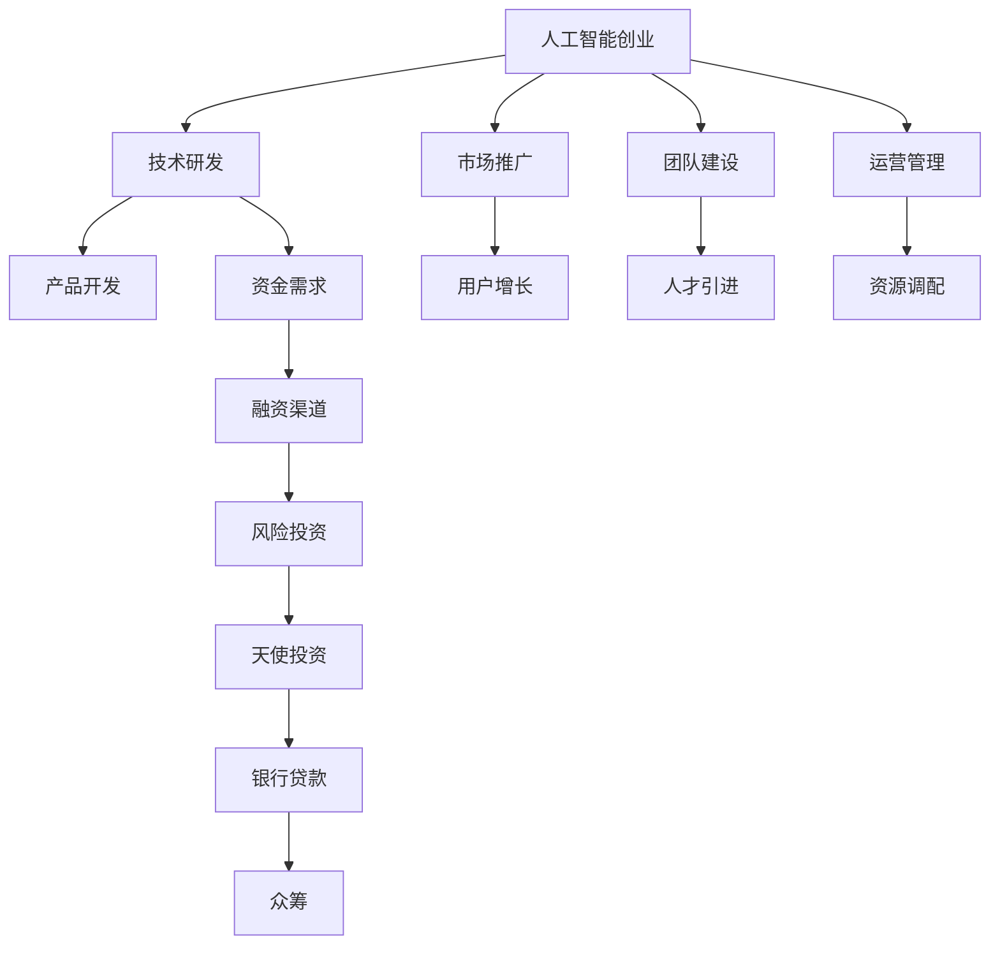

                 

# 人工智能创业：资金支持的重要性

## 1. 背景介绍

在人工智能（AI）和机器学习（ML）领域，技术的快速发展使得创业公司不断涌现。这些公司利用先进的技术解决具体问题，提升业务效率，改善用户体验。然而，尽管技术是成功的基石，但创业成功同样依赖于充足的资金支持。本文将从多个角度探讨资金支持在AI创业中的重要性，分析不同的融资渠道和策略，并给出实际建议。

## 2. 核心概念与联系

### 2.1 核心概念概述

#### 2.1.1 人工智能创业
人工智能创业是指使用AI和ML技术解决特定行业问题，创建新企业或改造现有业务流程的创业活动。创业公司的目标是通过技术创新和商业模式创新，提供更具价值的产品或服务。

#### 2.1.2 资金支持
资金支持是创业公司运营和发展不可或缺的资源。它可以用于技术研发、市场推广、团队建设、运营管理等多个方面。充足的资金支持不仅能提高公司的稳定性，还能加速产品迭代和市场拓展。

#### 2.1.3 融资渠道
融资渠道是指创业公司获取资金的方式，包括但不限于风险投资、天使投资、银行贷款、众筹等。不同的融资方式各有优缺点，需要根据公司阶段和需求进行合理选择。

### 2.2 核心概念原理和架构的 Mermaid 流程图



该图展示了人工智能创业的基本架构，从技术研发到市场推广，再到团队建设和运营管理，资金需求贯穿整个流程。融资渠道根据需求的不同，包括风险投资、天使投资、银行贷款和众筹等多种方式。

## 3. 核心算法原理 & 具体操作步骤

### 3.1 算法原理概述

#### 3.1.1 算法原理概述

人工智能创业中，资金支持的算法原理主要基于创业公司的需求和资源配置。资金支持的目的是通过合理的融资策略，最大化利用可用资源，加速公司的发展。

1. **资金需求评估**：评估公司当前和未来的资金需求，确定资金缺口。
2. **融资渠道选择**：根据公司的规模、行业、发展阶段等因素，选择合适的融资渠道。
3. **资金分配**：将获得的资金合理分配到技术研发、市场推广、团队建设、运营管理等各个环节。

#### 3.1.2 算法步骤详解

1. **需求评估**：根据公司战略目标、市场计划、运营成本等因素，进行详细的资金需求评估。
2. **融资策略**：选择合适的融资渠道，包括风险投资、天使投资、银行贷款、众筹等。
3. **资金分配**：制定详细的资金分配计划，确保资金的高效使用。
4. **监控和调整**：定期监控资金使用情况，根据实际情况进行调整。

### 3.2 算法优缺点

#### 3.2.1 算法优点

1. **加速公司发展**：资金支持能够加速技术研发、市场推广、团队建设等关键环节，提升公司发展速度。
2. **降低风险**：通过合理的融资策略，能够分散公司风险，增强公司的稳定性。
3. **提升市场竞争力**：充足的资金支持能够增强公司的市场竞争力，吸引更多的客户和合作伙伴。

#### 3.2.2 算法缺点

1. **资金成本高**：高额的资金支持需要支付较高的利息或股权回报，增加公司的财务负担。
2. **限制决策**：资金支持往往伴随着投资者或债权人的要求和限制，影响公司的独立性和决策自由。
3. **稀释股份**：通过股权融资，现有股东的股份会被稀释，影响公司的控制权。

### 3.3 算法应用领域

#### 3.3.1 技术研发
资金支持在技术研发方面至关重要。技术研发需要大量的资金投入，包括设备购买、人才引进、实验室建设等。充足的资金能够确保公司持续推进技术创新，保持竞争优势。

#### 3.3.2 市场推广
市场推广需要大量的资金投入，包括市场调研、广告投放、公关活动等。资金支持能够帮助公司快速扩大市场份额，提升品牌知名度。

#### 3.3.3 团队建设
人才是公司的核心竞争力。资金支持能够吸引和留住顶尖人才，提高公司的整体实力。

#### 3.3.4 运营管理
运营管理需要大量的资金投入，包括人力资源、物流、仓储、办公室租赁等。充足的资金支持能够确保公司的运营效率和稳定性。

## 4. 数学模型和公式 & 详细讲解 & 举例说明

### 4.1 数学模型构建

#### 4.1.1 资金需求模型

假设公司当前资金需求为 $D$，未来每年所需资金为 $D_1$，公司当前资金为 $F$，未来每年可获得的资金为 $F_1$。则公司未来 $N$ 年的总资金缺口 $G$ 可以表示为：

$$ G = \sum_{n=1}^{N} (D_n - F_n) $$

其中，$D_n$ 表示第 $n$ 年的资金需求，$F_n$ 表示第 $n$ 年的可用资金。

### 4.2 公式推导过程

假设公司每年所需资金 $D$ 与研发投入、市场推广、团队建设、运营管理等各个环节的需求成正比，可以表示为：

$$ D = k_1 \cdot R + k_2 \cdot M + k_3 \cdot T + k_4 \cdot O $$

其中，$R$、$M$、$T$、$O$ 分别表示研发投入、市场推广、团队建设、运营管理所需资金，$k_1$、$k_2$、$k_3$、$k_4$ 为系数。

### 4.3 案例分析与讲解

#### 4.3.1 案例背景

某AI创业公司正在开发一款智能客服系统，预计未来三年内每年所需资金为 $D_1 = 1000$ 万元。公司当前可用资金为 $F = 500$ 万元，每年可获得的资金为 $F_1 = 300$ 万元。

#### 4.3.2 资金需求计算

根据公式 $G = \sum_{n=1}^{3} (D_n - F_n)$，计算公司未来三年的总资金缺口：

$$ G = (1000 - 500) + (1000 - 300) + (1000 - 300) = 1300 $$

即公司未来三年需要额外获得1300万元的资金支持。

## 5. 项目实践：代码实例和详细解释说明

### 5.1 开发环境搭建

#### 5.1.1 环境搭建步骤

1. 安装Python：确保Python版本为3.8以上。
2. 安装Pandas和NumPy：用于数据处理。
3. 安装Matplotlib：用于绘制图表。
4. 安装SciPy：用于数学计算。

### 5.2 源代码详细实现

#### 5.2.1 代码实现

```python
import pandas as pd
import numpy as np
import matplotlib.pyplot as plt
from scipy.optimize import minimize

# 定义资金需求函数
def funding_needs(r, m, t, o, k1, k2, k3, k4):
    return k1 * r + k2 * m + k3 * t + k4 * o

# 定义资金缺口函数
def funding_gap(r, m, t, o, k1, k2, k3, k4, f, d, n):
    return np.sum([d - f for _ in range(n)])

# 定义求解函数
def solve_funding(f, d, k1, k2, k3, k4, n):
    # 初始化资金需求矩阵
    funding_matrix = np.zeros((n, 4))
    funding_matrix[:, 0] = d
    funding_matrix[:, 1] = f
    funding_matrix[:, 2] = k1
    funding_matrix[:, 3] = k2

    # 求解最小资金缺口
    res = minimize(funding_gap, funding_matrix, args=(k1, k2, k3, k4, f, d, n))
    return res.x

# 输入数据
r, m, t, o = 500, 300, 100, 200  # 研发投入、市场推广、团队建设、运营管理所需资金
k1, k2, k3, k4 = 0.5, 0.3, 0.4, 0.2  # 系数
f, d, n = 500, 1000, 3  # 可用资金、未来每年所需资金、时间

# 求解最小资金缺口
gap = solve_funding(f, d, k1, k2, k3, k4, n)
print("未来三年资金缺口为：", gap)
```

### 5.3 代码解读与分析

#### 5.3.1 代码实现步骤

1. **资金需求函数**：定义资金需求函数 `funding_needs`，用于计算每年的资金需求。
2. **资金缺口函数**：定义资金缺口函数 `funding_gap`，用于计算未来 $N$ 年的总资金缺口。
3. **求解函数**：定义求解函数 `solve_funding`，使用 `scipy.optimize.minimize` 求解最小资金缺口。
4. **输入数据**：定义公司当前可用资金 $F$、未来每年所需资金 $D$、系数 $k_1$、$k_2$、$k_3$、$k_4$、时间 $N$。
5. **求解并输出结果**：调用求解函数 `solve_funding`，输出最小资金缺口。

## 6. 实际应用场景

### 6.1 智能客服系统

智能客服系统通过自然语言处理（NLP）技术，提供7x24小时不间断的客户服务。公司需要大量的资金进行研发和技术迭代，同时需要进行大规模的市场推广和团队建设。充足的资金支持能够加速产品开发和市场拓展，提升客户满意度。

### 6.2 医疗影像诊断

医疗影像诊断技术通过AI技术，辅助医生进行疾病诊断和治疗方案制定。研发过程中需要大量的资金投入，包括设备采购、算法开发、数据集构建等。充足的资金支持能够确保技术研发的持续性和成果转化率。

### 6.3 智能制造

智能制造通过AI技术，提升生产线的自动化和智能化水平。公司需要大量的资金进行设备升级、机器人部署和工艺优化。充足的资金支持能够提高生产效率和产品质量，降低运营成本。

## 7. 工具和资源推荐

### 7.1 学习资源推荐

1. **《AI创业指南》**：这本书详细介绍了AI创业的各个环节，包括市场分析、技术研发、团队建设等。
2. **Coursera《创业管理》课程**：由斯坦福大学提供，涵盖创业的各个方面，包括融资、市场推广、运营管理等。
3. **Y Combinator《YC创始入门》**：提供创业指导、融资建议、市场分析等多方面的资源。

### 7.2 开发工具推荐

1. **Jupyter Notebook**：用于编写和运行Python代码，支持代码块、数学公式和可视化展示。
2. **GitHub**：用于代码版本控制和协作开发，支持项目管理、代码仓库和问题追踪等功能。
3. **PyCharm**：强大的Python开发环境，提供代码自动补全、错误提示、调试等功能。

### 7.3 相关论文推荐

1. **《人工智能创业：资金、技术、市场》**：本文探讨了人工智能创业中资金、技术、市场的关系，提出了一套完整的创业方案。
2. **《机器学习创业的资金需求和融资策略》**：本文分析了机器学习创业的资金需求和不同融资渠道的优势和劣势，给出了实用的融资建议。
3. **《智能制造的资金支持和管理》**：本文研究了智能制造的资金需求和管理策略，提出了一套有效的资金管理方案。

## 8. 总结：未来发展趋势与挑战

### 8.1 研究成果总结

人工智能创业中，资金支持的重要性不言而喻。资金支持能够加速技术研发、市场推广、团队建设等关键环节，提升公司的发展速度和竞争力。同时，资金支持也能够分散公司风险，增强公司的稳定性。

### 8.2 未来发展趋势

1. **技术创新**：随着AI技术的不断发展，资金支持将更多地投入技术研发和创新，推动公司的技术领先地位。
2. **市场拓展**：资金支持将用于大规模的市场推广和市场营销，提高公司的市场占有率和品牌知名度。
3. **团队建设**：资金支持将用于引进和留住顶尖人才，提升公司的整体实力。
4. **国际合作**：随着全球化的加速，资金支持将用于国际市场拓展和合作，增强公司的全球竞争力。

### 8.3 面临的挑战

1. **资金成本**：高额的资金支持需要支付较高的利息或股权回报，增加公司的财务负担。
2. **决策限制**：资金支持往往伴随着投资者或债权人的要求和限制，影响公司的独立性和决策自由。
3. **股份稀释**：通过股权融资，现有股东的股份会被稀释，影响公司的控制权。
4. **市场风险**：市场竞争激烈，需要资金支持以确保公司的市场份额和竞争力。

### 8.4 研究展望

未来，资金支持在AI创业中的重要性将继续增强。资金支持的应用将更加灵活和多样化，帮助创业公司快速发展和扩张。同时，资金支持也需要结合其他策略，如技术创新、市场拓展、团队建设等，形成全面的支持体系，提升公司的整体竞争力。

## 9. 附录：常见问题与解答

### 9.1 常见问题

**Q1：为什么AI创业需要资金支持？**

A: AI创业需要大量的资金支持，用于技术研发、市场推广、团队建设、运营管理等各个环节。充足的资金支持能够加速公司的发展，提升公司的竞争力和稳定性。

**Q2：资金支持有哪些渠道？**

A: AI创业的资金支持渠道包括风险投资、天使投资、银行贷款、众筹等。不同的融资渠道各有优缺点，需要根据公司阶段和需求进行合理选择。

**Q3：如何评估公司的资金需求？**

A: 公司资金需求的评估需要综合考虑技术研发、市场推广、团队建设、运营管理等各个环节的需求，根据历史数据和未来规划进行合理预测。

**Q4：如何选择合适的融资渠道？**

A: 选择合适的融资渠道需要考虑公司的规模、行业、发展阶段等因素。一般来说，风险投资适合成长型企业，天使投资适合初创企业，银行贷款适合稳健型企业，众筹适合具有较高公众吸引力的企业。

**Q5：如何合理分配资金？**

A: 合理的资金分配需要根据公司的战略目标和业务需求进行规划。例如，将大部分资金投入到研发和技术创新中，保持公司的技术领先地位。同时，也需要合理分配到市场推广、团队建设、运营管理等各个环节，确保公司的高效运营和市场竞争。

**Q6：如何优化资金使用？**

A: 优化资金使用需要定期监控资金使用情况，及时调整资金分配策略。例如，通过数据分析发现资金使用效率低下的环节，及时调整和优化。

### 9.2 解答

**A1: AI创业需要资金支持，用于技术研发、市场推广、团队建设、运营管理等各个环节。充足的资金支持能够加速公司的发展，提升公司的竞争力和稳定性。**

**A2: AI创业的资金支持渠道包括风险投资、天使投资、银行贷款、众筹等。不同的融资渠道各有优缺点，需要根据公司阶段和需求进行合理选择。**

**A3: 公司资金需求的评估需要综合考虑技术研发、市场推广、团队建设、运营管理等各个环节的需求，根据历史数据和未来规划进行合理预测。**

**A4: 选择合适的融资渠道需要考虑公司的规模、行业、发展阶段等因素。一般来说，风险投资适合成长型企业，天使投资适合初创企业，银行贷款适合稳健型企业，众筹适合具有较高公众吸引力的企业。**

**A5: 合理的资金分配需要根据公司的战略目标和业务需求进行规划。例如，将大部分资金投入到研发和技术创新中，保持公司的技术领先地位。同时，也需要合理分配到市场推广、团队建设、运营管理等各个环节，确保公司的高效运营和市场竞争。**

**A6: 优化资金使用需要定期监控资金使用情况，及时调整资金分配策略。例如，通过数据分析发现资金使用效率低下的环节，及时调整和优化。**

---

作者：禅与计算机程序设计艺术 / Zen and the Art of Computer Programming

