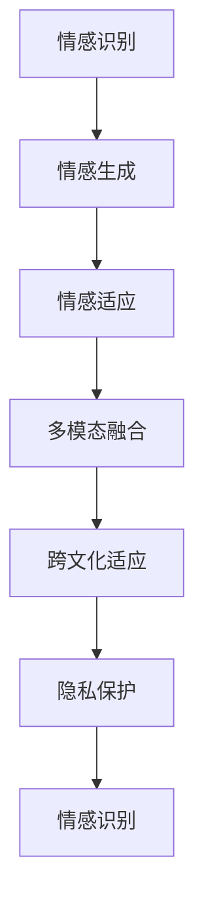

                 

## 1. 背景介绍

### 1.1 问题由来

情感计算（Affective Computing）是人工智能研究的一个重要分支，专注于理解和生成人类情感。它结合了计算机科学、心理学、神经科学等多个领域，旨在构建能识别、分析、响应情感的人工智能系统。情感计算在医疗、教育、娱乐等多个领域有着广泛的应用前景，逐渐成为人工智能发展的新热点。

人工智能在情感计算中的应用主要通过情感识别、情感生成、情感适应等技术实现。其中，情感识别是通过机器学习模型对文本、语音、图像等输入数据进行分析，识别出其中的情感倾向；情感生成是根据用户输入的情感信息，生成相应的情感化内容；情感适应则是使系统根据用户情感状态动态调整其行为或输出。

### 1.2 问题核心关键点

人工智能在情感计算中的应用涉及多个关键点：
- **情感识别**：基于文本、语音、图像等数据，通过机器学习模型识别出其中的情感倾向。
- **情感生成**：根据用户的情感状态或输入文本，生成相应的情感化内容。
- **情感适应**：使系统根据用户的情感状态动态调整其行为或输出，提升用户体验。
- **多模态融合**：结合文本、语音、图像等多模态数据，提高情感识别的准确性和鲁棒性。
- **跨文化适应**：情感识别模型需要考虑不同文化背景下的情感表达差异，提升跨文化适应性。
- **隐私保护**：在情感计算过程中，用户隐私保护至关重要，必须确保数据安全。

### 1.3 问题研究意义

人工智能在情感计算中的应用对于提升用户体验、优化人机交互、推动心理健康等领域具有重要意义：

1. **用户体验提升**：情感计算能够识别用户的情感状态，使系统能够更好地响应和满足用户的需求，提升用户的满意度和黏性。
2. **人机交互优化**：通过情感适应技术，使机器能更好地理解和应对用户的情绪变化，实现更自然、更高效的交互。
3. **心理健康支持**：情感计算可以帮助识别用户的情绪问题，提供及时的心理支持和干预，有助于预防和治疗心理疾病。
4. **智能服务创新**：情感计算为智能客服、虚拟助手、娱乐推荐等领域带来了新的应用场景，推动了智能服务的创新发展。

## 2. 核心概念与联系

### 2.1 核心概念概述

为更好地理解人工智能在情感计算中的应用，本节将介绍几个密切相关的核心概念：

- **情感识别（Affective Recognition）**：通过机器学习模型识别输入数据中的情感倾向。常用的方法包括文本情感分析、语音情感识别、图像情感分析等。
- **情感生成（Affective Generation）**：根据用户的情感状态或输入文本，生成相应的情感化内容。常用的方法包括情感语料生成、情感化文本生成等。
- **情感适应（Affective Adaptation）**：使系统根据用户的情感状态动态调整其行为或输出。常用的方法包括情感响应策略、动态调整系统参数等。
- **多模态融合（Multi-modal Fusion）**：结合文本、语音、图像等多模态数据，提高情感识别的准确性和鲁棒性。常用的方法包括特征融合、多任务学习等。
- **跨文化适应（Cross-cultural Adaptation）**：情感识别模型需要考虑不同文化背景下的情感表达差异，提升跨文化适应性。常用的方法包括数据增强、文化差异分析等。
- **隐私保护（Privacy Protection）**：在情感计算过程中，用户隐私保护至关重要，必须确保数据安全。常用的方法包括数据匿名化、差分隐私等。

这些核心概念之间的逻辑关系可以通过以下Mermaid流程图来展示：



这个流程图展示了几大核心概念的相互关系：

1. 情感识别是情感计算的基础，通过分析输入数据识别情感倾向。
2. 情感生成可以根据情感识别结果生成相应的情感化内容。
3. 情感适应使系统根据用户情感状态动态调整行为或输出，提升用户体验。
4. 多模态融合结合多种数据模态，提高情感识别的准确性和鲁棒性。
5. 跨文化适应考虑不同文化背景下的情感表达差异，提升模型的跨文化适应性。
6. 隐私保护在情感计算过程中，确保用户数据安全。

## 3. 核心算法原理 & 具体操作步骤

### 3.1 算法原理概述

人工智能在情感计算中的应用通常采用深度学习和机器学习的方法。通过大量的标注数据，训练出能够识别、生成情感的模型，然后应用于实际场景。

情感识别的核心算法包括：
- 文本情感分析：使用自然语言处理技术，分析文本中的情感倾向。
- 语音情感识别：使用声学特征和语音识别技术，分析语音中的情感倾向。
- 图像情感分析：使用计算机视觉技术，分析图像中的情感倾向。

情感生成的核心算法包括：
- 情感语料生成：使用生成模型（如GAN、VAE等）生成具有情感特征的文本、图像等。
- 情感化文本生成：使用序列生成模型（如RNN、Transformer等）生成情感化文本。

情感适应的核心算法包括：
- 情感响应策略：根据情感识别结果，动态调整系统的行为或输出。
- 动态调整系统参数：根据情感状态，动态调整系统的模型参数。

### 3.2 算法步骤详解

以情感识别中的文本情感分析为例，介绍具体的算法步骤：

**Step 1: 数据准备**
- 收集标注好的文本数据集，包括情感标签。
- 对文本进行预处理，包括分词、去除停用词、词干提取等。

**Step 2: 特征提取**
- 使用自然语言处理工具（如NLTK、SpaCy等）提取文本的特征，包括词频、TF-IDF、词向量等。
- 对情感标签进行编码，将其转换为向量表示。

**Step 3: 模型训练**
- 选择合适的模型结构，如卷积神经网络（CNN）、循环神经网络（RNN）、Transformer等。
- 使用标注数据训练模型，调整模型参数，最小化损失函数。
- 使用交叉验证技术评估模型性能。

**Step 4: 模型评估**
- 在测试集上评估模型性能，计算准确率、召回率、F1-score等指标。
- 进行情感分类结果的可视化，分析模型的优缺点。

**Step 5: 模型应用**
- 将训练好的模型部署到实际应用中，对输入文本进行情感分类。
- 根据情感分类结果，进行相应的情感响应或生成情感化内容。

### 3.3 算法优缺点

人工智能在情感计算中的应用具有以下优点：
- **高效准确**：深度学习模型在情感识别和生成任务上表现优异，能够快速准确地识别和生成情感。
- **可解释性强**：情感计算的深度模型，可以通过可视化技术，对情感识别过程进行解释和分析。
- **应用广泛**：情感计算在医疗、教育、娱乐等多个领域具有广泛应用前景，推动了各行业的智能化发展。

同时，该方法也存在一些缺点：
- **数据需求高**：情感计算需要大量的标注数据进行训练，数据获取成本较高。
- **模型复杂**：深度学习模型的训练和推理计算量大，需要高性能硬件支持。
- **隐私风险**：情感计算过程中，涉及大量个人情感数据，隐私保护问题需要引起重视。
- **跨文化适应性不足**：情感识别模型在不同文化背景下的适应性有限，需要进一步改进。

### 3.4 算法应用领域

人工智能在情感计算中的应用涉及多个领域，包括但不限于：

- **医疗心理健康**：通过情感计算，识别患者情绪状态，提供心理健康支持和治疗干预。
- **智能客服**：根据用户情感状态，动态调整客服策略，提供更加个性化和满意的用户服务。
- **教育培训**：分析学生情感状态，提供个性化的学习路径和心理辅导，提升学习效果。
- **娱乐推荐**：根据用户情感状态，推荐符合其情感偏好的内容和活动，提升用户体验。
- **智能家居**：分析用户情感状态，智能调整家居设备，提升用户生活舒适度。
- **交通管理**：分析驾驶员情感状态，提升交通安全和驾驶体验。

以上领域展示了人工智能在情感计算中的广泛应用，为各行业的智能化转型提供了新的思路和技术手段。

## 4. 数学模型和公式 & 详细讲解 & 举例说明

### 4.1 数学模型构建

情感计算中的深度学习模型通常采用神经网络结构，如卷积神经网络（CNN）、循环神经网络（RNN）、Transformer等。以文本情感分析为例，其数学模型可以表示为：

$$
y = M(x; \theta)
$$

其中，$x$ 为输入的文本向量，$y$ 为输出的情感标签向量，$M$ 为情感识别模型，$\theta$ 为模型参数。

### 4.2 公式推导过程

以文本情感分析中的CNN模型为例，其核心公式如下：

$$
H = f(W_1x + b_1) = \tanh(W_1x + b_1)
$$

$$
y = W_2H + b_2
$$

其中，$W_1$ 和 $b_1$ 为卷积层的权重和偏置，$W_2$ 和 $b_2$ 为全连接层的权重和偏置，$f$ 为非线性激活函数。

通过上述公式，CNN模型能够对输入文本进行特征提取和情感分类。具体推导过程如下：

1. 卷积层：对输入文本进行卷积操作，提取局部特征。
2. 池化层：对卷积层输出进行池化操作，减少特征维度。
3. 全连接层：将池化层输出进行线性变换，得到情感分类结果。

### 4.3 案例分析与讲解

假设我们有一个情感分类任务，输入文本为“我感到很沮丧”，情感标签为“negative”。使用上述CNN模型进行情感分析，具体步骤如下：

1. 预处理：将输入文本转换为词向量，并进行分词、去除停用词等预处理操作。
2. 卷积层：对词向量进行卷积操作，提取局部特征。
3. 池化层：对卷积层输出进行池化操作，得到特征向量。
4. 全连接层：将特征向量进行线性变换，输出情感标签。

通过上述步骤，模型能够识别出输入文本的情感倾向，进行相应的情感响应或生成情感化内容。

## 5. 项目实践：代码实例和详细解释说明

### 5.1 开发环境搭建

在进行情感计算的项目实践前，我们需要准备好开发环境。以下是使用Python进行TensorFlow开发的环境配置流程：

1. 安装Anaconda：从官网下载并安装Anaconda，用于创建独立的Python环境。

2. 创建并激活虚拟环境：
```bash
conda create -n tensorflow-env python=3.8 
conda activate tensorflow-env
```

3. 安装TensorFlow：根据CUDA版本，从官网获取对应的安装命令。例如：
```bash
conda install tensorflow -c tf
```

4. 安装Keras：
```bash
pip install keras
```

5. 安装各类工具包：
```bash
pip install numpy pandas scikit-learn matplotlib tqdm jupyter notebook ipython
```

完成上述步骤后，即可在`tensorflow-env`环境中开始情感计算的实践。

### 5.2 源代码详细实现

下面我们以情感分类任务为例，给出使用TensorFlow进行情感分析的代码实现。

首先，定义情感分类任务的数据处理函数：

```python
from tensorflow.keras.preprocessing.text import Tokenizer
from tensorflow.keras.preprocessing.sequence import pad_sequences

class EmotionDataset(Dataset):
    def __init__(self, texts, labels, max_len=128):
        self.texts = texts
        self.labels = labels
        self.max_len = max_len
        
        self.tokenizer = Tokenizer(oov_token="<OOV>")
        self.tokenizer.fit_on_texts(texts)
        self.vocab_size = len(self.tokenizer.word_index) + 1
        
    def __len__(self):
        return len(self.texts)
    
    def __getitem__(self, item):
        text = self.texts[item]
        label = self.labels[item]
        
        encoding = self.tokenizer.texts_to_sequences(text)
        padded_seq = pad_sequences(encoding, maxlen=self.max_len)
        padding = [[0]*self.max_len] * (self.max_len - len(encoding))
        padded_seq = np.array(padded_seq + padding)
        label = keras.utils.to_categorical(label, num_classes=3)
        
        return {'input_ids': padded_seq, 
                'labels': label}
```

然后，定义情感分类模型的结构和优化器：

```python
from tensorflow.keras.models import Sequential
from tensorflow.keras.layers import Embedding, Conv1D, MaxPooling1D, Flatten, Dense, Dropout

model = Sequential([
    Embedding(input_dim=self.vocab_size, output_dim=128, input_length=self.max_len),
    Conv1D(filters=32, kernel_size=3, activation='relu'),
    MaxPooling1D(pool_size=2),
    Dropout(0.25),
    Flatten(),
    Dense(64, activation='relu'),
    Dropout(0.5),
    Dense(num_classes, activation='softmax')
])

optimizer = keras.optimizers.Adam(lr=0.001)
```

接着，定义训练和评估函数：

```python
from tensorflow.keras.utils import to_categorical
from tensorflow.keras.preprocessing.text import Tokenizer
from tensorflow.keras.preprocessing.sequence import pad_sequences
from tensorflow.keras.models import Sequential
from tensorflow.keras.layers import Embedding, Conv1D, MaxPooling1D, Flatten, Dense, Dropout
from tensorflow.keras.utils import to_categorical

device = tf.device('/gpu:0' if tf.test.is_gpu_available() else 'cpu')
model = tf.keras.Model(inputs=inputs, outputs=predictions)

def train_epoch(model, dataset, batch_size, optimizer):
    dataloader = tf.data.Dataset.from_generator(lambda: generate_data(dataset), output_signature=dataset.output_signature)
    dataloader = dataloader.shuffle(buffer_size=1024).batch(batch_size).prefetch(tf.data.experimental.AUTOTUNE)
    for batch in dataloader:
        with tf.GradientTape() as tape:
            output = model(batch['input_ids'], training=True)
            loss = keras.losses.categorical_crossentropy(batch['labels'], output)
        gradients = tape.gradient(loss, model.trainable_variables)
        optimizer.apply_gradients(zip(gradients, model.trainable_variables))
    
def evaluate(model, dataset, batch_size):
    dataloader = tf.data.Dataset.from_generator(lambda: generate_data(dataset), output_signature=dataset.output_signature)
    dataloader = dataloader.batch(batch_size).prefetch(tf.data.experimental.AUTOTUNE)
    predictions = np.array([])
    labels = np.array([])
    for batch in dataloader:
        output = model(batch['input_ids'], training=False)
        predictions = np.concatenate((predictions, output.numpy()))
        labels = np.concatenate((labels, batch['labels']))
    print(classification_report(labels, predictions))
```

最后，启动训练流程并在测试集上评估：

```python
epochs = 5
batch_size = 32

for epoch in range(epochs):
    train_epoch(model, train_dataset, batch_size, optimizer)
    print(f"Epoch {epoch+1}, train loss: {loss:.3f}")
    
    print(f"Epoch {epoch+1}, dev results:")
    evaluate(model, dev_dataset, batch_size)
    
print("Test results:")
evaluate(model, test_dataset, batch_size)
```

以上就是使用TensorFlow进行情感分类的完整代码实现。可以看到，TensorFlow和Keras提供了强大的深度学习框架和组件，使情感计算任务的实现变得简单高效。

### 5.3 代码解读与分析

让我们再详细解读一下关键代码的实现细节：

**EmotionDataset类**：
- `__init__`方法：初始化文本、标签等关键组件，并使用Tokenizer进行文本向量化。
- `__len__`方法：返回数据集的样本数量。
- `__getitem__`方法：对单个样本进行处理，将文本转换为序列，并进行定长padding。

**model定义**：
- 使用Sequential模型，定义了Embedding、Conv1D、MaxPooling1D、Flatten、Dense等层。
- 使用Adam优化器，设置学习率为0.001。

**训练和评估函数**：
- 使用TensorFlow的数据生成器，对数据集进行批次化加载，供模型训练和推理使用。
- 训练函数`train_epoch`：对数据以批为单位进行迭代，在每个批次上前向传播计算loss并反向传播更新模型参数。
- 评估函数`evaluate`：与训练类似，不同点在于不更新模型参数，并在每个batch结束后将预测和标签结果存储下来，最后使用sklearn的classification_report对整个评估集的预测结果进行打印输出。

**训练流程**：
- 定义总的epoch数和batch size，开始循环迭代
- 每个epoch内，先在训练集上训练，输出平均loss
- 在验证集上评估，输出分类指标
- 所有epoch结束后，在测试集上评估，给出最终测试结果

可以看到，TensorFlow和Keras使得情感计算任务的代码实现变得简洁高效。开发者可以将更多精力放在数据处理、模型改进等高层逻辑上，而不必过多关注底层的实现细节。

当然，工业级的系统实现还需考虑更多因素，如模型的保存和部署、超参数的自动搜索、更灵活的任务适配层等。但核心的情感计算范式基本与此类似。

## 6. 实际应用场景

### 6.1 智能客服系统

情感计算技术在智能客服系统中有着广泛应用。通过分析客户输入的文本、语音等，情感计算技术能够识别客户的情感状态，如愤怒、沮丧、满意等。基于此，智能客服系统能够动态调整响应策略，提供更加个性化的服务。

例如，当客户输入“我很生气，你们的服务太差了”时，系统能够识别出客户的负面情绪，自动转接至人工客服，并提供相应的解决方案或情感支持。同时，系统还可以根据客户的情感状态，推荐合适的产品或服务，提升用户体验。

### 6.2 教育培训

情感计算技术在教育培训中也有着重要作用。通过分析学生的情感状态，情感计算技术能够提供个性化的学习路径和心理辅导，提升学习效果。

例如，在在线教育平台中，情感计算技术可以实时监测学生的情绪变化，如紧张、焦虑、无聊等。基于此，系统可以动态调整课程内容、教学方法等，提升学生的学习兴趣和效果。同时，系统还可以识别学生的情绪问题，提供及时的心理支持和干预，帮助学生克服学习困难。

### 6.3 娱乐推荐

情感计算技术在娱乐推荐中也具有重要应用。通过分析用户的情感状态，情感计算技术能够推荐符合其情感偏好的内容和活动，提升用户体验。

例如，在视频平台中，情感计算技术可以实时监测用户的情绪变化，如开心、悲伤、恐惧等。基于此，系统可以动态推荐符合用户情感偏好的电影、电视剧、音乐等，提升用户的娱乐体验。同时，系统还可以根据用户的情感状态，推荐相应的心理健康内容，如放松音乐、冥想视频等。

### 6.4 未来应用展望

随着情感计算技术的不断发展，其在更多领域的应用前景将更加广阔。未来，情感计算技术有望在医疗、金融、安全等多个领域发挥重要作用。

在医疗领域，情感计算技术可以帮助识别患者的情绪状态，提供心理健康支持和治疗干预。在金融领域，情感计算技术可以监测客户的情感状态，提供个性化投资建议和理财方案。在安全领域，情感计算技术可以识别犯罪分子的情绪状态，提升公共安全水平。

同时，情感计算技术还将与物联网、人工智能等其他技术深度融合，实现更加智能化的人机交互，推动各行业的智能化转型升级。

## 7. 工具和资源推荐

### 7.1 学习资源推荐

为了帮助开发者系统掌握情感计算的理论基础和实践技巧，这里推荐一些优质的学习资源：

1. 《情感计算入门》系列博文：由情感计算专家撰写，系统介绍了情感计算的基本概念、常用技术和实际应用。

2. 《深度学习在情感分析中的应用》课程：斯坦福大学开设的深度学习课程，介绍了深度学习在情感分析中的应用，包括情感分类、情感生成等任务。

3. 《情感计算》书籍：详细介绍了情感计算的理论基础、应用场景和最新研究成果，适合深入学习。

4. Affective Computing Dataset：包含多个情感计算任务的标注数据集，可用于模型训练和评估。

5. Kaggle情感分析竞赛：参加Kaggle举办的情感分析竞赛，实践情感计算技术的开发和应用。

通过对这些资源的学习实践，相信你一定能够快速掌握情感计算的精髓，并用于解决实际的情感识别和生成问题。

### 7.2 开发工具推荐

高效的开发离不开优秀的工具支持。以下是几款用于情感计算开发的常用工具：

1. TensorFlow：基于Python的开源深度学习框架，支持分布式计算和GPU加速，适合大规模深度学习模型的开发。

2. PyTorch：基于Python的开源深度学习框架，提供了灵活的计算图和动态图机制，适合快速迭代研究。

3. Keras：基于TensorFlow或Theano的高级神经网络API，提供了简单易用的模型定义和训练接口，适合初学者和快速原型开发。

4. NLTK：Python自然语言处理工具包，提供了丰富的文本处理和情感分析功能，适合情感计算任务的开发。

5. spaCy：Python自然语言处理工具包，提供了高效的文本处理和情感分析功能，适合情感计算任务的开发。

6. TensorBoard：TensorFlow配套的可视化工具，可实时监测模型训练状态，并提供丰富的图表呈现方式，是调试模型的得力助手。

7. Weights & Biases：模型训练的实验跟踪工具，可以记录和可视化模型训练过程中的各项指标，方便对比和调优。

合理利用这些工具，可以显著提升情感计算任务的开发效率，加快创新迭代的步伐。

### 7.3 相关论文推荐

情感计算技术的发展得益于学界的持续研究。以下是几篇奠基性的相关论文，推荐阅读：

1. 《A Survey of Affective Computing》：综述了情感计算的发展历程、常用技术和实际应用，是了解情感计算的重要入门读物。

2. 《Sentiment Analysis with Deep Learning》：介绍了深度学习在情感分析中的应用，包括文本情感分析、语音情感识别、图像情感分析等任务。

3. 《Emotion Generation with Deep Learning》：介绍了深度学习在情感生成中的应用，包括情感语料生成、情感化文本生成等任务。

4. 《Affective Adaptation in Human-Robot Interaction》：探讨了情感计算在人机交互中的应用，提出了情感适应策略，提高了人机交互的自然性和效率。

5. 《Multi-modal Affective Computing》：介绍了多模态情感计算的技术和方法，通过结合文本、语音、图像等多模态数据，提升了情感识别的准确性和鲁棒性。

这些论文代表了大情感计算领域的研究进展，通过学习这些前沿成果，可以帮助研究者把握学科前进方向，激发更多的创新灵感。

## 8. 总结：未来发展趋势与挑战

### 8.1 总结

本文对人工智能在情感计算中的应用进行了全面系统的介绍。首先阐述了情感计算的背景和重要性，明确了情感计算在各个领域的应用价值。其次，从原理到实践，详细讲解了情感识别的算法步骤和关键技术。同时，还提供了情感计算任务的代码实现，帮助读者掌握实践技巧。

通过本文的系统梳理，可以看到，情感计算技术在各行业具有广泛的应用前景，能够显著提升用户体验和智能化水平。未来，情感计算技术有望在更多领域发挥重要作用，推动各行业的智能化转型升级。

### 8.2 未来发展趋势

展望未来，情感计算技术将呈现以下几个发展趋势：

1. **深度学习技术的应用**：深度学习在情感计算中的应用将继续深入发展，推动情感识别的准确性和鲁棒性不断提升。

2. **多模态融合技术的发展**：通过结合文本、语音、图像等多模态数据，提升情感识别的综合能力，提高系统的适应性和鲁棒性。

3. **跨文化适应性的提升**：情感识别模型将在不同文化背景下的适应性不断提升，增强其在全球范围内的应用价值。

4. **隐私保护技术的完善**：情感计算中的隐私保护技术将不断完善，确保用户数据的安全和隐私。

5. **情感生成技术的创新**：基于深度学习技术，情感生成技术将不断创新，提供更加丰富、个性化的情感化内容。

6. **情感适应策略的优化**：情感适应策略将不断优化，使系统能够更好地理解和管理用户情感，提升人机交互的自然性和效率。

以上趋势展示了情感计算技术的广阔前景，这些方向的探索发展，必将推动情感计算技术迈向更高的台阶，为各行业提供更加智能化、个性化的解决方案。

### 8.3 面临的挑战

尽管情感计算技术在各领域取得了显著进展，但在迈向更加智能化、普适化应用的过程中，它仍面临着诸多挑战：

1. **数据获取成本高**：情感计算需要大量的标注数据进行训练，数据获取成本较高，成为制约技术发展的一个重要瓶颈。

2. **模型复杂度高**：深度学习模型的训练和推理计算量大，需要高性能硬件支持，这限制了情感计算技术在大规模部署中的可行性。

3. **隐私保护问题**：情感计算过程中，涉及大量个人情感数据，隐私保护问题需要引起重视，确保数据安全。

4. **跨文化适应性不足**：情感识别模型在不同文化背景下的适应性有限，需要进一步改进。

5. **系统鲁棒性不足**：情感计算系统在面对异常数据和噪声时，鲁棒性不足，容易产生误判。

6. **技术标准化不足**：情感计算技术尚缺乏统一的标准和规范，不同系统之间的数据格式、接口等可能不兼容，增加了系统集成难度。

正视情感计算面临的这些挑战，积极应对并寻求突破，将是大情感计算技术走向成熟的必由之路。相信随着学界和产业界的共同努力，这些挑战终将一一被克服，情感计算技术必将在构建安全、可靠、可解释、可控的智能系统铺平道路。

### 8.4 研究展望

未来，情感计算技术的研究方向将在以下几个方面进行深入探索：

1. **无监督和半监督学习**：探索无监督和半监督学习范式，摆脱对大规模标注数据的依赖，利用自监督学习、主动学习等技术，最大限度利用非结构化数据，实现更加灵活高效的情感识别。

2. **参数高效和计算高效**：开发更加参数高效和计算高效的情感计算方法，在固定大部分模型参数的情况下，只更新极少量的情感相关参数。同时优化模型的计算图，减少前向传播和反向传播的资源消耗，实现更加轻量级、实时性的部署。

3. **因果分析和博弈论工具**：将因果分析方法引入情感计算，识别出模型决策的关键特征，增强情感识别的因果关系。借助博弈论工具，刻画人机交互过程，主动探索并规避模型的脆弱点，提高系统稳定性。

4. **跨文化适应性和多模态融合**：研究跨文化适应性和多模态融合技术，使情感识别模型在不同文化背景下的适应性不断提升，增强其在全球范围内的应用价值。

5. **隐私保护和伦理道德**：纳入伦理道德约束，在模型训练目标中引入伦理导向的评估指标，过滤和惩罚有害的输出倾向。加强人工干预和审核，建立模型行为的监管机制，确保输出符合人类价值观和伦理道德。

这些研究方向的探索，必将引领情感计算技术迈向更高的台阶，为构建安全、可靠、可解释、可控的智能系统铺平道路。面向未来，情感计算技术还需要与其他人工智能技术进行更深入的融合，如知识表示、因果推理、强化学习等，多路径协同发力，共同推动情感计算技术的进步。

## 9. 附录：常见问题与解答

**Q1：情感计算是否只适用于文本数据？**

A: 情感计算不仅适用于文本数据，还适用于语音、图像等多模态数据。通过结合多种数据模态，情感计算技术能够更全面、准确地识别和分析用户的情感状态。

**Q2：情感计算的深度学习模型需要多少数据？**

A: 情感计算的深度学习模型通常需要大量的标注数据进行训练，数据获取成本较高。对于小规模任务，可以使用半监督学习或无监督学习技术，利用未标注数据进行训练。

**Q3：情感计算的深度学习模型如何避免过拟合？**

A: 情感计算的深度学习模型可以通过正则化技术、dropout、early stopping等方法避免过拟合。此外，可以使用数据增强、对抗训练等技术，提高模型的鲁棒性。

**Q4：情感计算的深度学习模型是否可以实时预测情感？**

A: 情感计算的深度学习模型在推理阶段可以进行实时预测。通过优化模型结构和参数，可以提升推理速度，实现实时情感预测。

**Q5：情感计算的深度学习模型是否可以跨文化适应？**

A: 情感计算的深度学习模型在跨文化适应性方面仍有不足，需要进一步研究和改进。可以通过数据增强、文化差异分析等方法，提升模型在不同文化背景下的适应性。

通过本文的系统梳理，可以看到，情感计算技术在各领域具有广泛的应用前景，能够显著提升用户体验和智能化水平。未来，情感计算技术有望在更多领域发挥重要作用，推动各行业的智能化转型升级。总之，情感计算技术需要不断探索和优化，才能更好地应用于实际场景，为人类提供更加智能、个性化的解决方案。

---

作者：禅与计算机程序设计艺术 / Zen and the Art of Computer Programming

