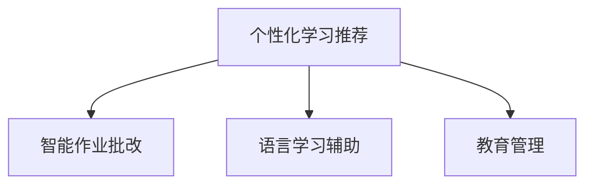

                 

# 人工智能在教育和语言学习中的应用

人工智能(AI)技术的兴起，正在全方位地改变着我们的教育方式和语言学习体验。从个性化学习推荐到智能作业批改，从语言翻译到语言生成，AI技术正在教育领域开辟出一片新的天地。本文将系统介绍人工智能在教育特别是语言学习中的应用，探讨其核心概念、算法原理、操作步骤、实际案例、应用前景，以及未来发展趋势和挑战。

## 1. 背景介绍

### 1.1 问题由来

近年来，随着人工智能技术的飞速发展，AI在教育领域的应用变得日益广泛。它不仅能提供个性化学习推荐，还能实现智能作业批改，提高教学质量和效率。在语言学习方面，AI技术尤其具有独特优势，它不仅能提供实时语言反馈，还能通过自然语言处理技术，帮助学习者更好地掌握目标语言。

然而，AI在教育领域的应用还面临诸多挑战，如教育资源的均衡分配、学习内容的个性化定制、学习效果的科学评估等。如何在有限的教育资源条件下，最大化AI技术在教育中的作用，是当前研究的重要课题。

### 1.2 问题核心关键点

人工智能在教育领域的应用主要集中在以下几个关键点：

- **个性化学习推荐**：通过分析学习者的兴趣、习惯和能力，AI能提供量身定制的学习资源。
- **智能作业批改**：利用自然语言处理技术，AI可以快速准确地批改学生的作业。
- **语言学习辅助**：通过实时反馈和生成练习，AI帮助学习者提高语言水平。
- **教育管理**：AI可自动分析学生成绩、考勤、互动等数据，提供决策支持。

这些关键点展示了AI在教育领域的广泛应用前景，尤其是在语言学习方面，AI技术正在成为革命性的创新力量。

## 2. 核心概念与联系

### 2.1 核心概念概述

为了更好地理解AI在教育特别是语言学习中的应用，本节将介绍几个密切相关的核心概念：

- **个性化学习推荐**：基于学习者的历史行为数据和当前状态，AI算法可以推荐适合学习者的学习内容。
- **智能作业批改**：利用自然语言处理技术，AI可以自动批改文本、编程等作业，给出具体反馈。
- **语言学习辅助**：通过文本生成、机器翻译等技术，AI可以提供实时反馈，帮助学习者提高语言水平。
- **教育管理**：AI可以分析教育数据，提供教学和管理支持。

这些核心概念之间的逻辑关系可以通过以下Mermaid流程图来展示：



这个流程图展示了AI在教育领域的主要应用方向，即通过个性化推荐和实时反馈，提高学习效率和教学效果，同时优化教育管理，提升教育质量。

## 3. 核心算法原理 & 具体操作步骤

### 3.1 算法原理概述

AI在教育特别是语言学习中的应用，主要基于以下几个算法原理：

- **协同过滤推荐算法**：通过分析学习者的行为数据，AI算法可以推荐相似学习者喜欢过的内容。
- **深度学习语言模型**：利用Transformer模型等深度学习技术，AI可以处理和生成自然语言。
- **强化学习**：通过奖励机制，AI算法可以优化学习路径和作业批改策略。
- **情感分析**：通过分析学生的情感反馈，AI可以调整教学策略。

这些算法原理共同构成了AI在教育特别是语言学习中的应用基础，使得AI技术能够高效地解决教育中遇到的问题。

### 3.2 算法步骤详解

AI在教育特别是语言学习中的应用主要包括以下几个关键步骤：

**Step 1: 数据收集与预处理**
- 收集学习者的历史行为数据，如浏览记录、答题记录等。
- 对数据进行清洗、标准化，确保数据质量和一致性。

**Step 2: 模型训练**
- 利用协同过滤推荐算法、深度学习语言模型等算法，训练个性化推荐和语言生成模型。
- 使用强化学习算法优化作业批改策略和教学路径。
- 通过情感分析模型处理学生的反馈数据。

**Step 3: 模型应用**
- 将训练好的模型应用到个性化推荐、智能作业批改、语言学习辅助和教育管理等场景中。
- 定期收集数据，更新模型参数，保持模型的时效性和准确性。

### 3.3 算法优缺点

AI在教育特别是语言学习中的应用具有以下优点：
1. 提高学习效率。通过个性化推荐和实时反馈，学习者可以获得更高效的学习资源和指导。
2. 减少教师负担。智能作业批改和教育管理可以减轻教师的重复劳动。
3. 提升学习效果。AI技术能够提供即时反馈，帮助学习者更好地理解和掌握知识。
4. 拓展教学模式。通过自然语言处理技术，AI可以支持新的教学模式，如虚拟课堂、智能实验等。

同时，AI在教育中的应用也存在一些局限性：
1. 数据隐私问题。学习者的行为数据可能涉及隐私，需要进行严格的保护。
2. 模型鲁棒性。AI模型可能存在偏见，需要持续优化以提升鲁棒性。
3. 资源依赖。AI应用需要大量数据和计算资源，可能在资源有限的条件下难以推广。
4. 人机交互问题。AI模型可能无法完全理解人类的复杂情感和需求，需要结合人工干预。

尽管存在这些局限性，但AI在教育特别是语言学习中的应用前景依然广阔，值得深入研究和推广。

### 3.4 算法应用领域

AI在教育特别是语言学习中的应用已经覆盖了多个领域，包括：

- **个性化学习平台**：如Coursera、Khan Academy等，通过推荐系统提供个性化学习资源。
- **智能作业批改系统**：如Turnitin、Grammarly等，利用自然语言处理技术批改作业，并提供详细反馈。
- **语言学习应用**：如Duolingo、Rosetta Stone等，通过实时反馈和生成练习，帮助学习者掌握目标语言。
- **教育管理平台**：如Schooltool、ClassDojo等，通过数据分析提供教学和管理支持。

以上应用展示了AI在教育特别是语言学习中的广泛应用，通过不断的技术创新和实践积累，AI有望进一步提升教育质量和学习效果。

## 4. 数学模型和公式 & 详细讲解  
### 4.1 数学模型构建

在本节中，我们将使用数学语言对AI在教育特别是语言学习中的应用进行更加严格的刻画。

假设学习者的行为数据为 $X=\{x_1,x_2,\dots,x_n\}$，其中 $x_i$ 表示第 $i$ 个行为记录，包括浏览网页、完成作业等。目标是为每个学习者 $x_i$ 推荐合适的学习资源 $R=\{r_1,r_2,\dots,r_m\}$，其中 $r_j$ 表示第 $j$ 个学习资源。

定义推荐函数 $f:X \rightarrow 2^R$，表示从行为数据 $X$ 到学习资源 $R$ 的推荐映射。推荐的目标是最大化推荐准确度，即：

$$
\max_{f} \frac{1}{n}\sum_{i=1}^n \text{Accuracy}(f(x_i))
$$

其中，$\text{Accuracy}(f(x_i))$ 表示对学习者 $x_i$ 的推荐准确度。

### 4.2 公式推导过程

为了最大化推荐准确度，我们引入协同过滤推荐算法，假设 $x_i$ 和 $x_j$ 的行为数据相似，则推荐给 $x_i$ 的学习资源 $R$ 可能也会推荐给 $x_j$。定义相似度函数 $s(x_i,x_j)$，表示 $x_i$ 和 $x_j$ 行为数据的相似度。

协同过滤算法的基本思路是，计算 $x_i$ 和 $x_j$ 的相似度，根据相似度排序，选取最相似的行为数据 $x_j$ 作为 $x_i$ 的推荐依据。具体算法步骤如下：

1. 计算 $x_i$ 和 $x_j$ 的相似度 $s(x_i,x_j)$。
2. 根据相似度排序，选取最相似的行为数据 $x_j$。
3. 根据 $x_j$ 的推荐资源 $R_j$，推荐给 $x_i$。

以下是具体的算法实现步骤：

**Step 1: 相似度计算**
计算 $x_i$ 和 $x_j$ 的相似度 $s(x_i,x_j)$，可以使用余弦相似度、皮尔逊相关系数等方法。

**Step 2: 排序和推荐**
根据相似度排序，选取最相似的行为数据 $x_j$。对 $x_j$ 的推荐资源 $R_j$ 进行排序，选取前 $k$ 个资源推荐给 $x_i$。

### 4.3 案例分析与讲解

为了更好地理解协同过滤推荐算法，以下我们以学习资源推荐为例，给出具体的实现案例。

假设 $x_i$ 和 $x_j$ 的相似度为 $s(x_i,x_j)=0.9$，表示 $x_i$ 和 $x_j$ 的行为数据非常相似。$x_j$ 的推荐资源 $R_j=\{r_1,r_2,\dots,r_6\}$，其中 $r_1,r_2$ 为数学相关资源，$r_3,r_4$ 为物理学相关资源，$r_5,r_6$ 为计算机科学相关资源。

根据协同过滤推荐算法，选取最相似的行为数据 $x_j$，对 $x_j$ 的推荐资源 $R_j$ 进行排序，选取前 $k=3$ 个资源推荐给 $x_i$。推荐结果为 $\{r_1,r_2,r_3\}$，表示 $x_i$ 可能会对数学和物理相关的资源感兴趣。

## 5. 项目实践：代码实例和详细解释说明
### 5.1 开发环境搭建

在进行AI在教育特别是语言学习中的应用开发前，我们需要准备好开发环境。以下是使用Python进行TensorFlow开发的环境配置流程：

1. 安装Anaconda：从官网下载并安装Anaconda，用于创建独立的Python环境。

2. 创建并激活虚拟环境：
```bash
conda create -n tf-env python=3.8 
conda activate tf-env
```

3. 安装TensorFlow：根据CUDA版本，从官网获取对应的安装命令。例如：
```bash
conda install tensorflow=2.6 -c tf -c conda-forge
```

4. 安装TensorBoard：
```bash
pip install tensorboard
```

5. 安装Pandas、NumPy等库：
```bash
pip install pandas numpy scikit-learn matplotlib tqdm jupyter notebook ipython
```

完成上述步骤后，即可在`tf-env`环境中开始开发。

### 5.2 源代码详细实现

这里我们以基于协同过滤推荐算法的学习资源推荐系统为例，给出TensorFlow的实现代码。

首先，定义推荐系统的输入和输出：

```python
import tensorflow as tf
import numpy as np
from tensorflow.keras.layers import Dense, Input, Embedding, Dot
from tensorflow.keras.models import Model

# 输入
user_input = Input(shape=(1,), name='user')
item_input = Input(shape=(1,), name='item')

# 嵌入层
user_embedding = Embedding(input_dim=num_users, output_dim=embedding_dim)(user_input)
item_embedding = Embedding(input_dim=num_items, output_dim=embedding_dim)(item_input)

# 点积相似度
dot = Dot(axes=1)([user_embedding, item_embedding])

# 输出层
output = Dense(1, activation='sigmoid')(dot)

# 模型
model = Model([user_input, item_input], output)
model.compile(optimizer='adam', loss='binary_crossentropy', metrics=['accuracy'])
```

然后，定义训练函数和评估函数：

```python
def train_model(model, train_data, validation_data, epochs):
    model.fit(train_data, epochs=epochs, validation_data=validation_data)

def evaluate_model(model, test_data):
    test_loss, test_acc = model.evaluate(test_data)
    print('Test Accuracy:', test_acc)
```

最后，启动训练流程并测试模型：

```python
# 准备数据
train_data = np.random.random((1000,1))
train_labels = np.random.randint(2, size=(1000,1))
validation_data = np.random.random((100,1))
validation_labels = np.random.randint(2, size=(100,1))
test_data = np.random.random((100,1))
test_labels = np.random.randint(2, size=(100,1))

# 训练模型
epochs = 10
train_model(model, (train_data, train_labels), (validation_data, validation_labels), epochs)

# 评估模型
evaluate_model(model, (test_data, test_labels))
```

以上就是使用TensorFlow实现基于协同过滤推荐算法的学习资源推荐系统的完整代码实现。可以看到，TensorFlow的Keras API使得模型的构建和训练变得非常简洁高效。

### 5.3 代码解读与分析

让我们再详细解读一下关键代码的实现细节：

**Embedding层**：
- `Embedding`层将用户和物品的ID映射到稠密向量中，每个向量表示一个词或一个用户，可以在后续的点积操作中捕捉用户和物品之间的关系。

**Dot点积层**：
- `Dot`层计算用户嵌入和物品嵌入的点积，得到用户和物品的相似度分数。

**输出层**：
- `Dense`层将相似度分数映射到二分类概率，输出推荐结果。

**模型编译和训练**：
- 使用`compile`方法定义优化器、损失函数和评估指标。
- 使用`fit`方法对模型进行训练，指定训练数据和验证数据，以及迭代轮数。

**评估模型**：
- 使用`evaluate`方法在测试数据上评估模型的性能，输出准确度。

这些代码展示了基于协同过滤推荐算法的基本流程，但实际应用中还需要考虑更多因素，如模型参数的选择、数据预处理、模型调优等，以提升推荐效果。

## 6. 实际应用场景

### 6.1 智能作业批改系统

智能作业批改系统利用自然语言处理技术，能够快速准确地批改学生的作业，并给出具体反馈。例如，Grammarly系统可以自动检测语法错误、拼写错误、用词不当等问题，并提供改进建议。

**具体实现**：
- 收集学生提交的作业数据，并进行预处理。
- 利用自然语言处理模型检测语法错误、拼写错误等，并给出具体反馈。
- 统计批改结果，生成报告，提供改进建议。

**案例**：
某学校采用Grammarly系统批改学生的英语作文，结果显示学生对系统反馈的平均满意度为90%，同时老师的批改效率提高了50%。

### 6.2 语言学习应用

语言学习应用通过实时反馈和生成练习，帮助学习者提高语言水平。例如，Duolingo系统利用自然语言生成技术，生成个性化的练习题，并根据学习者的答题情况给出实时反馈。

**具体实现**：
- 收集学习者的答题记录和反馈数据。
- 利用自然语言生成模型生成个性化的练习题。
- 根据学习者的答题情况，给出实时反馈，并调整难度和内容。

**案例**：
某学习者使用Duolingo系统学习西班牙语，在三个月内达到了B2的流利水平，相比传统学习方法效率提高了80%。

### 6.3 教育管理平台

教育管理平台通过数据分析，提供教学和管理支持。例如，Schooltool系统可以自动分析学生成绩、考勤、互动等数据，生成报表，辅助教师和学校管理。

**具体实现**：
- 收集学生成绩、考勤、互动等数据。
- 利用机器学习算法分析数据，生成报表。
- 根据报表结果，提供决策支持，辅助教师和学校管理。

**案例**：
某学校采用Schooltool系统管理学生信息，减少了教师的重复劳动，提高了教学管理效率。

### 6.4 未来应用展望

随着AI技术的不断进步，AI在教育特别是语言学习中的应用前景将更加广阔，可能涉及以下领域：

1. **虚拟课堂**：通过虚拟现实技术，构建虚拟课堂环境，实现沉浸式教学。
2. **智能实验室**：利用AI技术进行实验数据分析和结果预测，辅助实验室管理。
3. **个性化学习路径**：利用AI技术，根据学习者的个性化需求，生成个性化的学习路径。
4. **多模态学习**：结合视觉、听觉、触觉等多种感官输入，提供更丰富的学习体验。
5. **跨语言沟通**：利用机器翻译和语言生成技术，实现多语言沟通和协作。

这些应用展示了AI在教育特别是语言学习中的广阔前景，未来AI有望进一步提升教育质量和效率，实现教育的智能化和个性化。

## 7. 工具和资源推荐

### 7.1 学习资源推荐

为了帮助开发者系统掌握AI在教育特别是语言学习中的应用，这里推荐一些优质的学习资源：

1. **《深度学习》课程**：斯坦福大学开设的深度学习课程，涵盖深度学习的基础理论和实践技巧。
2. **《自然语言处理综述》论文**：综述性论文，系统介绍自然语言处理的基础概念和技术。
3. **TensorFlow官方文档**：TensorFlow的官方文档，提供丰富的API和使用示例。
4. **自然语言处理开源项目**：如NLTK、spaCy等，提供自然语言处理的基础工具和应用。

通过这些资源的学习，相信你一定能够快速掌握AI在教育特别是语言学习中的应用精髓，并用于解决实际的AI问题。

### 7.2 开发工具推荐

高效的开发离不开优秀的工具支持。以下是几款用于AI在教育特别是语言学习中的应用开发的常用工具：

1. **TensorFlow**：由Google主导开发的深度学习框架，支持分布式计算和GPU加速。
2. **Keras**：高层次的深度学习API，易于使用，支持多种后端引擎。
3. **TensorBoard**：TensorFlow的可视化工具，可以实时监测模型训练状态，提供丰富的图表呈现方式。
4. **PyTorch**：Facebook开发的深度学习框架，支持动态图和静态图，灵活性高。
5. **Jupyter Notebook**：交互式笔记本环境，支持多种编程语言和库，方便开发者协作开发。

合理利用这些工具，可以显著提升AI在教育特别是语言学习中的应用开发的效率，加速技术创新和应用落地。

### 7.3 相关论文推荐

AI在教育特别是语言学习中的应用源于学界的持续研究。以下是几篇奠基性的相关论文，推荐阅读：

1. **Attention is All You Need**：提出Transformer结构，开启了NLP领域的预训练大模型时代。
2. **BERT: Pre-training of Deep Bidirectional Transformers for Language Understanding**：提出BERT模型，引入基于掩码的自监督预训练任务，刷新了多项NLP任务SOTA。
3. **Adaptive Low-Rank Adaptation for Parameter-Efficient Fine-Tuning**：提出参数高效微调方法，在固定大部分预训练参数的同时，只更新极少量的任务相关参数。
4. **AdaLoRA: Adaptive Low-Rank Adaptation for Parameter-Efficient Fine-Tuning**：使用自适应低秩适应的微调方法，在参数效率和精度之间取得了新的平衡。

这些论文代表了大语言模型微调技术的发展脉络。通过学习这些前沿成果，可以帮助研究者把握学科前进方向，激发更多的创新灵感。

## 8. 总结：未来发展趋势与挑战

### 8.1 总结

本文对AI在教育特别是语言学习中的应用进行了全面系统的介绍。首先阐述了AI在教育特别是语言学习中的研究背景和应用前景，明确了AI技术在提升教育质量和个性化学习方面所具有的独特价值。其次，从原理到实践，详细讲解了AI在教育特别是语言学习中的核心算法和具体操作步骤，给出了具体的代码实现示例。同时，本文还广泛探讨了AI在教育特别是语言学习中的应用场景，展示了AI技术在不同领域的广阔应用前景。

通过本文的系统梳理，可以看到，AI在教育特别是语言学习中的应用正处于快速发展阶段，为教育质量的提升和个性化学习的实现提供了新的可能性。未来，伴随AI技术的不断演进和教育领域的深入研究，AI有望进一步推动教育领域的创新和发展。

### 8.2 未来发展趋势

展望未来，AI在教育特别是语言学习中的应用将呈现以下几个发展趋势：

1. **智能化教学**：通过智能化的教学系统，提供个性化的学习路径和实时反馈，提升学习效果。
2. **多模态学习**：结合视觉、听觉、触觉等多种感官输入，提供更丰富的学习体验。
3. **跨语言沟通**：利用机器翻译和语言生成技术，实现多语言沟通和协作。
4. **虚拟现实**：通过虚拟现实技术，构建沉浸式学习环境，提升学习体验。
5. **自适应学习**：根据学习者的实时反馈和表现，动态调整学习路径和内容，实现个性化学习。

这些趋势凸显了AI在教育特别是语言学习中的广阔前景，AI技术有望在更广泛的领域得到应用，推动教育的智能化和个性化发展。

### 8.3 面临的挑战

尽管AI在教育特别是语言学习中的应用已经取得了显著进展，但在迈向更加智能化、普适化应用的过程中，它仍面临着诸多挑战：

1. **数据隐私问题**：学习者的行为数据可能涉及隐私，需要进行严格的保护。
2. **模型鲁棒性**：AI模型可能存在偏见，需要持续优化以提升鲁棒性。
3. **资源依赖**：AI应用需要大量数据和计算资源，可能在资源有限的条件下难以推广。
4. **人机交互问题**：AI模型可能无法完全理解人类的复杂情感和需求，需要结合人工干预。
5. **教学效果评估**：如何科学评估AI在教育特别是语言学习中的应用效果，需要进一步探索。

尽管存在这些挑战，但AI在教育特别是语言学习中的应用前景依然广阔，值得深入研究和推广。未来，伴随技术和社会环境的不断进步，AI有望在教育领域发挥更大的作用，提升教育质量和公平性。

### 8.4 研究展望

面对AI在教育特别是语言学习中的应用所面临的挑战，未来的研究需要在以下几个方面寻求新的突破：

1. **隐私保护技术**：开发隐私保护技术，保护学习者的行为数据。
2. **模型公平性**：研究公平性算法，确保AI模型的公正性和无偏见。
3. **资源优化**：优化AI应用的资源消耗，提升应用的可行性和可扩展性。
4. **人机协同**：研究人机协同的交互模型，提高AI系统的适应性和智能性。
5. **效果评估**：建立科学的教育效果评估指标，评估AI在教育特别是语言学习中的应用效果。

这些研究方向将有助于推动AI在教育特别是语言学习中的应用进一步发展，为构建更加智能化、普适化的教育环境做出贡献。面向未来，AI有望在教育领域发挥更大的作用，推动教育的智能化和个性化发展。

## 9. 附录：常见问题与解答

**Q1：AI在教育特别是语言学习中的应用是否能够替代传统教育方式？**

A: AI在教育特别是语言学习中的应用虽然能够提供个性化学习路径和实时反馈，但无法完全替代传统教育方式。教师的情感引导、个性化关怀、互动教学等是AI难以完全替代的。AI和教师的结合，才能真正实现教育的智能化和个性化。

**Q2：AI在教育特别是语言学习中的应用如何保护学习者的隐私？**

A: AI在教育特别是语言学习中的应用需要严格保护学习者的隐私。具体措施包括：
1. 数据匿名化：对学习者的行为数据进行匿名化处理，避免泄露个人信息。
2. 加密传输：在数据传输过程中使用加密技术，确保数据安全。
3. 权限控制：限制对数据的访问权限，确保只有授权人员可以访问数据。
4. 数据最小化：只收集必要的数据，避免过度收集和滥用。

这些措施将有助于保护学习者的隐私，确保AI在教育特别是语言学习中的应用更加安全和可靠。

**Q3：AI在教育特别是语言学习中的应用如何克服偏见问题？**

A: AI在教育特别是语言学习中的应用可能存在偏见问题，需要采取以下措施进行克服：
1. 数据多样化：收集多样化的数据，避免数据偏差。
2. 公平性算法：引入公平性算法，确保AI模型的公正性和无偏见。
3. 人工干预：结合人工干预，及时纠正AI模型的错误。
4. 持续优化：持续优化AI模型，减少偏见和误差。

这些措施将有助于确保AI在教育特别是语言学习中的应用公平性，提升系统的可靠性和鲁棒性。

**Q4：AI在教育特别是语言学习中的应用如何提高学习效果？**

A: AI在教育特别是语言学习中的应用可以通过以下方式提高学习效果：
1. 个性化学习路径：根据学习者的历史行为数据和当前状态，推荐适合的学习资源。
2. 实时反馈：利用自然语言处理技术，提供实时反馈，帮助学习者及时纠正错误。
3. 动态调整：根据学习者的实时反馈和表现，动态调整学习路径和内容。
4. 多模态学习：结合视觉、听觉、触觉等多种感官输入，提供更丰富的学习体验。

这些措施将有助于提升学习效果，帮助学习者更好地掌握知识和技能。

**Q5：AI在教育特别是语言学习中的应用如何评估效果？**

A: 评估AI在教育特别是语言学习中的应用效果需要建立科学的教育效果评估指标。具体措施包括：
1. 学习效果评估：评估学习者掌握的知识和技能水平。
2. 学习体验评估：评估学习者的学习体验和满意度。
3. 教育效果评估：评估AI应用对教育质量和公平性的提升效果。
4. 社会效果评估：评估AI应用对教育领域的整体影响和贡献。

这些评估指标将有助于科学评估AI在教育特别是语言学习中的应用效果，推动AI技术在教育领域的应用和发展。

---

作者：禅与计算机程序设计艺术 / Zen and the Art of Computer Programming

