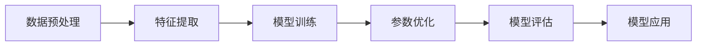

                 

# 人工智能的深度学习与模式识别

> 关键词：深度学习,模式识别,神经网络,卷积神经网络(CNN),循环神经网络(RNN),自编码器(AE),生成对抗网络(GAN),深度强化学习(DRL),计算机视觉,自然语言处理(NLP)

## 1. 背景介绍

### 1.1 问题由来

深度学习作为人工智能领域的重要技术分支，近年来在图像识别、语音识别、自然语言处理等领域取得了显著进展。特别是深度神经网络，通过模拟人脑神经元的工作机制，从原始数据中自动学习特征表示，具有强大的表征能力。然而，尽管深度学习已经取得了丰硕的成果，其复杂度也随之增加，导致训练和推理过程耗时耗资源，难以在实际应用中广泛推广。

模式识别作为人工智能的核心技术之一，旨在通过机器学习算法自动识别和分类数据。传统的模式识别方法如SVM、KNN等，通常需要手工设计特征工程，难以处理复杂的数据结构。而深度学习通过端到端的神经网络模型，自动从原始数据中提取特征，具有更高的识别准确率和更强的泛化能力。

因此，深度学习与模式识别的结合，不仅能够提升模式识别的效率和精度，还能够拓展应用领域，提升人工智能系统的实用性和可扩展性。本文将对深度学习与模式识别的核心概念、原理与应用实践进行全面探讨。

### 1.2 问题核心关键点

深度学习和模式识别的核心关键点在于：
1. 深度神经网络的结构设计，包括卷积神经网络(CNN)、循环神经网络(RNN)、自编码器(AE)、生成对抗网络(GAN)等。
2. 深度学习框架的选择和应用，如TensorFlow、PyTorch、Keras等。
3. 模式识别任务的定义和处理，如图像分类、目标检测、语音识别、自然语言处理等。
4. 深度学习模型的训练、优化和评估，包括损失函数、优化器、正则化、过拟合等。
5. 深度学习模型的实际应用，如自动驾驶、智能安防、语音助手、智能客服等。

本文将对以上关键点进行详细讲解，并通过具体案例和代码实例，帮助读者全面掌握深度学习与模式识别的核心技术。

## 2. 核心概念与联系

### 2.1 核心概念概述

深度学习与模式识别是人工智能领域的重要技术分支，两者相辅相成，共同推动了人工智能技术的进步。以下是对核心概念的概述：

- **深度学习(Deep Learning)**：通过多层神经网络自动学习数据特征的表示，具有强大的数据建模能力。深度学习模型通常包含大量的参数和复杂的结构，适合处理复杂的数据结构。

- **模式识别(Pattern Recognition)**：利用机器学习算法自动识别和分类数据，具有高效、准确、自动化的特点。模式识别广泛应用于图像识别、语音识别、自然语言处理等领域。

- **神经网络(Neural Network)**：深度学习的基础模型，通过模拟人脑神经元的工作机制，自动学习数据特征的表示。

- **卷积神经网络(CNN)**：应用于图像处理领域的神经网络，通过卷积操作提取局部特征。

- **循环神经网络(RNN)**：应用于序列数据处理的神经网络，通过循环结构捕捉序列信息。

- **自编码器(AE)**：通过编码器-解码器结构，将数据压缩为低维表示，然后再解码还原，常用于特征提取和数据降维。

- **生成对抗网络(GAN)**：通过生成器和判别器两个模型相互对抗，生成逼真的样本，常用于图像生成和数据增强。

- **深度强化学习(DRL)**：通过智能体与环境的交互，学习最优策略，常用于机器人控制和自动驾驶等领域。

### 2.2 核心概念原理和架构的 Mermaid 流程图

以下是一个简单的深度学习与模式识别过程的 Mermaid 流程图：



该流程图示意了深度学习与模式识别的核心过程：
1. 数据预处理：对原始数据进行清洗、归一化、标注等处理，便于模型训练。
2. 特征提取：通过深度神经网络自动学习数据特征，生成高维表示。
3. 模型训练：通过反向传播算法优化模型参数，最小化损失函数。
4. 参数优化：通过正则化、Dropout、Early Stopping等方法避免过拟合。
5. 模型评估：在验证集上评估模型性能，选择最优模型。
6. 模型应用：将模型部署到实际应用场景中，进行预测和分类。

## 3. 核心算法原理 & 具体操作步骤

### 3.1 算法原理概述

深度学习与模式识别的核心算法原理，主要包括以下几个方面：

1. **前向传播**：将输入数据传递到模型中，计算模型输出。前向传播的计算过程可以表示为：
   $$
   y = h_W(x) = \sigma(W \cdot x + b)
   $$
   其中，$x$ 为输入数据，$W$ 为权重矩阵，$b$ 为偏置向量，$\sigma$ 为激活函数。

2. **反向传播**：根据输出误差计算模型参数梯度，使用梯度下降等优化算法更新模型参数。反向传播的计算过程可以表示为：
   $$
   \frac{\partial \ell(y, t)}{\partial W} = \frac{\partial \ell(y, t)}{\partial y} \cdot \frac{\partial y}{\partial W}
   $$
   其中，$\ell$ 为损失函数，$t$ 为真实标签，$y$ 为模型输出。

3. **优化算法**：包括梯度下降法、Adam、Adagrad等，用于最小化损失函数，更新模型参数。

4. **正则化**：通过L1、L2正则、Dropout等方法避免过拟合，提高模型泛化能力。

5. **损失函数**：包括交叉熵损失、均方误差损失等，用于衡量模型输出与真实标签之间的差异。

### 3.2 算法步骤详解

以下是对深度学习与模式识别核心算法步骤的详解：

**Step 1: 数据预处理**

1. **数据清洗**：去除噪声、缺失值等无用数据，保证数据质量。
2. **数据归一化**：将数据缩放到0-1之间，防止梯度爆炸。
3. **数据标注**：为每个样本打上标签，作为监督信号。

**Step 2: 特征提取**

1. **选择模型**：根据任务类型，选择合适的深度学习模型，如CNN、RNN、AE等。
2. **模型训练**：将数据集分为训练集、验证集和测试集，使用训练集对模型进行优化。
3. **模型评估**：在验证集上评估模型性能，选择最优模型。

**Step 3: 模型训练**

1. **选择优化器**：根据模型特点，选择合适的优化器，如Adam、SGD等。
2. **设置超参数**：包括学习率、批大小、迭代轮数等，影响模型收敛速度和泛化能力。
3. **训练模型**：使用训练集对模型进行反向传播和参数更新。

**Step 4: 模型评估**

1. **验证集评估**：在验证集上评估模型性能，选择最优模型。
2. **测试集评估**：在测试集上评估模型性能，对比微调前后的精度提升。

**Step 5: 模型应用**

1. **模型部署**：将训练好的模型部署到实际应用场景中，进行预测和分类。
2. **持续优化**：根据新数据，定期重新微调模型，保持模型性能。

### 3.3 算法优缺点

深度学习与模式识别的优缺点如下：

**优点**：
1. **自动化特征提取**：深度学习自动从数据中学习特征，无需手工设计。
2. **高识别准确率**：深度学习模型具有强大的泛化能力，识别准确率高。
3. **可扩展性强**：深度学习模型可以处理大规模数据，适合复杂任务。

**缺点**：
1. **计算资源消耗大**：深度学习模型参数量大，训练和推理耗时耗资源。
2. **过拟合风险高**：深度学习模型容易过拟合，泛化能力不足。
3. **模型解释困难**：深度学习模型通常被视为"黑盒"，难以解释模型决策逻辑。

### 3.4 算法应用领域

深度学习与模式识别在多个领域中得到了广泛应用：

1. **计算机视觉**：包括图像分类、目标检测、人脸识别等任务。
2. **自然语言处理**：包括文本分类、情感分析、机器翻译等任务。
3. **语音识别**：包括语音转文本、语音识别等任务。
4. **智能推荐系统**：通过用户行为数据，推荐个性化的产品和服务。
5. **金融风控**：通过用户交易数据，预测欺诈行为。
6. **医疗诊断**：通过医学图像数据，辅助医生进行疾病诊断。
7. **自动驾驶**：通过传感器数据，实现自动驾驶和环境感知。

## 4. 数学模型和公式 & 详细讲解 & 举例说明

### 4.1 数学模型构建

深度学习与模式识别的数学模型，主要包括以下几个方面：

1. **神经网络模型**：包括卷积神经网络、循环神经网络、自编码器等，用于提取数据特征。
2. **深度学习框架**：如TensorFlow、PyTorch、Keras等，用于定义和训练深度学习模型。
3. **损失函数**：如交叉熵损失、均方误差损失等，用于衡量模型输出与真实标签之间的差异。

**卷积神经网络模型**：
$$
f(x) = \sum_i \sum_j W_i j x_{ij} + b_i
$$
其中，$W$ 为权重矩阵，$b$ 为偏置向量，$x$ 为输入数据。

**循环神经网络模型**：
$$
h_t = f(h_{t-1}, x_t)
$$
其中，$h$ 为隐藏状态，$x$ 为输入数据，$f$ 为映射函数。

**自编码器模型**：
$$
\hat{x} = D(E(x))
$$
其中，$E$ 为编码器，$D$ 为解码器。

### 4.2 公式推导过程

以下是对深度学习与模式识别数学模型和公式的推导过程：

**卷积神经网络推导**：
$$
f(x) = \sum_i \sum_j W_i j x_{ij} + b_i
$$

**循环神经网络推导**：
$$
h_t = f(h_{t-1}, x_t)
$$

**自编码器推导**：
$$
\hat{x} = D(E(x))
$$

### 4.3 案例分析与讲解

以下是一个简单的图像分类案例，用于讲解深度学习与模式识别的基本流程：

**数据预处理**：
1. **数据清洗**：去除噪声、缺失值等无用数据。
2. **数据归一化**：将数据缩放到0-1之间。
3. **数据标注**：为每个样本打上标签，如猫、狗、鸟等。

**特征提取**：
1. **选择模型**：选择卷积神经网络模型，包含多个卷积层、池化层、全连接层。
2. **模型训练**：将数据集分为训练集、验证集和测试集，使用训练集对模型进行优化。
3. **模型评估**：在验证集上评估模型性能，选择最优模型。

**模型训练**：
1. **选择优化器**：选择Adam优化器，设置学习率为0.001。
2. **设置超参数**：设置批大小为32，迭代轮数为10。
3. **训练模型**：使用训练集对模型进行反向传播和参数更新。

**模型评估**：
1. **验证集评估**：在验证集上评估模型性能，选择最优模型。
2. **测试集评估**：在测试集上评估模型性能，对比微调前后的精度提升。

**模型应用**：
1. **模型部署**：将训练好的模型部署到实际应用场景中，进行图像分类预测。
2. **持续优化**：根据新数据，定期重新微调模型，保持模型性能。

## 5. 项目实践：代码实例和详细解释说明

### 5.1 开发环境搭建

在进行深度学习与模式识别项目实践前，我们需要准备好开发环境。以下是使用Python进行TensorFlow和Keras开发的环境配置流程：

1. 安装Anaconda：从官网下载并安装Anaconda，用于创建独立的Python环境。

2. 创建并激活虚拟环境：
```bash
conda create -n tf-env python=3.8 
conda activate tf-env
```

3. 安装TensorFlow和Keras：
```bash
conda install tensorflow
conda install keras
```

4. 安装各类工具包：
```bash
pip install numpy pandas scikit-learn matplotlib tqdm jupyter notebook ipython
```

完成上述步骤后，即可在`tf-env`环境中开始深度学习与模式识别实践。

### 5.2 源代码详细实现

这里我们以图像分类任务为例，给出使用TensorFlow和Keras进行深度学习模型训练的Python代码实现。

首先，定义图像分类任务的数据处理函数：

```python
import numpy as np
from tensorflow.keras.preprocessing.image import ImageDataGenerator
from tensorflow.keras.applications import VGG16
from tensorflow.keras.models import Sequential
from tensorflow.keras.layers import Dense, Flatten

train_dir = 'path/to/train/dir'
val_dir = 'path/to/val/dir'
batch_size = 32
img_height = 224
img_width = 224

train_datagen = ImageDataGenerator(rescale=1./255)
val_datagen = ImageDataGenerator(rescale=1./255)

train_generator = train_datagen.flow_from_directory(train_dir,
                                                 target_size=(img_height, img_width),
                                                 batch_size=batch_size,
                                                 class_mode='binary')

val_generator = val_datagen.flow_from_directory(val_dir,
                                              target_size=(img_height, img_width),
                                              batch_size=batch_size,
                                              class_mode='binary')

model = Sequential([
    VGG16(weights='imagenet', include_top=False, input_shape=(img_height, img_width, 3)),
    Flatten(),
    Dense(256, activation='relu'),
    Dense(1, activation='sigmoid')
])

model.compile(optimizer='adam',
              loss='binary_crossentropy',
              metrics=['accuracy'])
```

然后，定义训练和评估函数：

```python
from tensorflow.keras.callbacks import EarlyStopping

epochs = 10
early_stopping = EarlyStopping(monitor='val_loss', patience=3)

history = model.fit(train_generator,
                    steps_per_epoch=train_generator.n // batch_size,
                    epochs=epochs,
                    validation_data=val_generator,
                    validation_steps=val_generator.n // batch_size,
                    callbacks=[early_stopping])
```

最后，启动训练流程并在验证集上评估：

```python
test_dir = 'path/to/test/dir'
test_datagen = ImageDataGenerator(rescale=1./255)

test_generator = test_datagen.flow_from_directory(test_dir,
                                                target_size=(img_height, img_width),
                                                batch_size=batch_size,
                                                class_mode='binary')

loss, acc = model.evaluate(test_generator, verbose=0)
print(f'Test Loss: {loss:.4f}')
print(f'Test Accuracy: {acc:.4f}')
```

以上就是使用TensorFlow和Keras进行图像分类任务微调的完整代码实现。可以看到，借助深度学习框架的强大封装，我们可以用相对简洁的代码完成模型的定义、训练和评估。

### 5.3 代码解读与分析

让我们再详细解读一下关键代码的实现细节：

**数据预处理**：
- `ImageDataGenerator`：用于数据增强和归一化处理。
- `flow_from_directory`：用于从目录中加载图像数据。

**模型定义**：
- `VGG16`：使用预训练的VGG16模型，去除顶部全连接层。
- `Flatten`：将卷积层的输出展开成一维数组。
- `Dense`：添加全连接层，用于分类。

**模型编译**：
- `compile`：设置优化器、损失函数和评估指标。

**模型训练**：
- `fit`：使用训练集对模型进行优化，设置验证集评估。
- `EarlyStopping`：设置EarlyStopping回调，防止过拟合。

**模型评估**：
- `evaluate`：在测试集上评估模型性能。

**模型部署**：
- 模型的部署和推理应用，需结合具体应用场景进行开发。

## 6. 实际应用场景

### 6.1 计算机视觉

深度学习与模式识别在计算机视觉领域的应用非常广泛，包括图像分类、目标检测、人脸识别、图像生成等任务。以下是一个简单的图像分类案例，用于讲解深度学习与模式识别的基本流程：

**数据预处理**：
1. **数据清洗**：去除噪声、缺失值等无用数据。
2. **数据归一化**：将数据缩放到0-1之间。
3. **数据标注**：为每个样本打上标签，如猫、狗、鸟等。

**特征提取**：
1. **选择模型**：选择卷积神经网络模型，包含多个卷积层、池化层、全连接层。
2. **模型训练**：将数据集分为训练集、验证集和测试集，使用训练集对模型进行优化。
3. **模型评估**：在验证集上评估模型性能，选择最优模型。

**模型训练**：
1. **选择优化器**：选择Adam优化器，设置学习率为0.001。
2. **设置超参数**：设置批大小为32，迭代轮数为10。
3. **训练模型**：使用训练集对模型进行反向传播和参数更新。

**模型评估**：
1. **验证集评估**：在验证集上评估模型性能，选择最优模型。
2. **测试集评估**：在测试集上评估模型性能，对比微调前后的精度提升。

**模型应用**：
1. **模型部署**：将训练好的模型部署到实际应用场景中，进行图像分类预测。
2. **持续优化**：根据新数据，定期重新微调模型，保持模型性能。

### 6.2 自然语言处理

深度学习与模式识别在自然语言处理领域的应用也非常广泛，包括文本分类、情感分析、机器翻译、对话系统等任务。以下是一个简单的文本分类案例，用于讲解深度学习与模式识别的基本流程：

**数据预处理**：
1. **数据清洗**：去除噪声、缺失值等无用数据。
2. **数据归一化**：将文本数据转换为数字表示。
3. **数据标注**：为每个样本打上标签，如正面、负面、中性等。

**特征提取**：
1. **选择模型**：选择循环神经网络模型，包含多个LSTM层、全连接层。
2. **模型训练**：将数据集分为训练集、验证集和测试集，使用训练集对模型进行优化。
3. **模型评估**：在验证集上评估模型性能，选择最优模型。

**模型训练**：
1. **选择优化器**：选择Adam优化器，设置学习率为0.001。
2. **设置超参数**：设置批大小为32，迭代轮数为10。
3. **训练模型**：使用训练集对模型进行反向传播和参数更新。

**模型评估**：
1. **验证集评估**：在验证集上评估模型性能，选择最优模型。
2. **测试集评估**：在测试集上评估模型性能，对比微调前后的精度提升。

**模型应用**：
1. **模型部署**：将训练好的模型部署到实际应用场景中，进行文本分类预测。
2. **持续优化**：根据新数据，定期重新微调模型，保持模型性能。

## 7. 工具和资源推荐

### 7.1 学习资源推荐

为了帮助开发者系统掌握深度学习与模式识别的理论基础和实践技巧，这里推荐一些优质的学习资源：

1. 《深度学习》书籍：Ian Goodfellow等著，全面介绍了深度学习的基本原理和应用。
2. 《模式识别》课程：斯坦福大学开设的机器学习课程，涵盖深度学习、模式识别等内容。
3. 《TensorFlow官方文档》：TensorFlow官方文档，提供全面的API和示例代码。
4. 《Keras官方文档》：Keras官方文档，提供简洁的API和示例代码。
5. 《计算机视觉：算法与应用》书籍：Richard Szeliski著，介绍了计算机视觉的算法和应用。

通过这些资源的学习实践，相信你一定能够快速掌握深度学习与模式识别的精髓，并用于解决实际的NLP问题。

### 7.2 开发工具推荐

高效的开发离不开优秀的工具支持。以下是几款用于深度学习与模式识别开发的常用工具：

1. TensorFlow：由Google主导开发的开源深度学习框架，功能强大，社区活跃。
2. PyTorch：由Facebook主导开发的深度学习框架，动态计算图，易于调试。
3. Keras：基于TensorFlow和Theano的高级深度学习框架，提供简洁的API，适合快速开发。
4. Jupyter Notebook：交互式开发环境，支持Python、R等多种语言，方便数据探索和模型调试。
5. Visual Studio Code：轻量级开发工具，支持代码高亮、调试等功能。

合理利用这些工具，可以显著提升深度学习与模式识别的开发效率，加快创新迭代的步伐。

### 7.3 相关论文推荐

深度学习与模式识别的发展源于学界的持续研究。以下是几篇奠基性的相关论文，推荐阅读：

1. ImageNet Large Scale Visual Recognition Challenge：Alex Krizhevsky等著，介绍了大规模图像分类任务的解决方案。
2. RNN: Learning to Execute：Ian Goodfellow等著，介绍了序列到序列的生成模型。
3. AlphaGo Zero：David Silver等著，介绍了深度强化学习在博弈中的应用。
4. Attention Is All You Need：Ashish Vaswani等著，介绍了Transformer模型。

这些论文代表了大深度学习与模式识别技术的发展脉络。通过学习这些前沿成果，可以帮助研究者把握学科前进方向，激发更多的创新灵感。

## 8. 总结：未来发展趋势与挑战

### 8.1 研究成果总结

深度学习与模式识别在过去几年取得了显著进展，应用于计算机视觉、自然语言处理、智能推荐等多个领域，提升了任务的识别准确率和泛化能力。特别是在图像分类、目标检测、语音识别、文本生成等领域，基于深度学习的模型已经刷新了多项SOTA。

### 8.2 未来发展趋势

未来，深度学习与模式识别技术将呈现以下几个发展趋势：

1. **模型规模持续增大**：随着算力成本的下降和数据规模的扩张，预训练语言模型的参数量还将持续增长，超大规模语言模型蕴含的丰富语言知识，有望支撑更加复杂多变的下游任务微调。

2. **模型结构不断优化**：深度学习模型将不断优化，引入新的结构如Transformer、ResNet等，提升模型的识别能力和泛化能力。

3. **应用领域不断拓展**：深度学习与模式识别将不断拓展应用领域，应用于医疗、金融、物流、交通等多个行业，推动智能化社会的建设。

4. **跨领域融合发展**：深度学习与模式识别将与其他人工智能技术进行更深入的融合，如知识表示、因果推理、强化学习等，共同推动智能系统的进步。

5. **伦理道德成为重要考量**：深度学习与模式识别将更加重视伦理道德问题，如隐私保护、数据安全、模型偏见等，保障算法的公平性和可信度。

### 8.3 面临的挑战

尽管深度学习与模式识别已经取得了丰硕的成果，但在迈向更加智能化、普适化应用的过程中，仍面临诸多挑战：

1. **计算资源瓶颈**：深度学习模型参数量大，训练和推理过程耗时耗资源，难以在实际应用中广泛推广。

2. **数据依赖性强**：深度学习模型的性能很大程度上依赖于标注数据的质量和数量，获取高质量标注数据的成本较高。

3. **过拟合风险高**：深度学习模型容易过拟合，泛化能力不足，难以适应复杂多变的数据分布。

4. **模型可解释性差**：深度学习模型通常被视为"黑盒"，难以解释模型决策逻辑，影响算法的可信度。

5. **安全性问题**：深度学习模型可能学习到有害信息，产生误导性、歧视性的输出，给实际应用带来安全隐患。

6. **数据隐私保护**：深度学习模型需要大量的训练数据，如何保护用户隐私和数据安全，成为重要的研究方向。

### 8.4 研究展望

面对深度学习与模式识别面临的挑战，未来的研究需要在以下几个方面寻求新的突破：

1. **参数高效微调方法**：开发更加参数高效的微调方法，在固定大部分预训练参数的同时，只更新极少量的任务相关参数。

2. **数据增强技术**：引入更多数据增强技术，扩充训练集，提升模型的泛化能力。

3. **对抗样本防御**：研究对抗样本防御技术，提高模型的鲁棒性，避免被恶意攻击。

4. **跨模态学习**：引入多模态数据，提升模型的泛化能力和鲁棒性。

5. **知识图谱融合**：将符号化的先验知识，如知识图谱、逻辑规则等，与神经网络模型进行巧妙融合，提升模型的解释性和可控性。

6. **伦理道德约束**：在模型训练目标中引入伦理导向的评估指标，过滤和惩罚有害的输出倾向，确保模型的公平性和可信度。

这些研究方向将引领深度学习与模式识别技术迈向更高的台阶，为构建安全、可靠、可解释、可控的智能系统铺平道路。面向未来，深度学习与模式识别技术还需要与其他人工智能技术进行更深入的融合，多路径协同发力，共同推动自然语言理解和智能交互系统的进步。只有勇于创新、敢于突破，才能不断拓展语言模型的边界，让智能技术更好地造福人类社会。

## 9. 附录：常见问题与解答

**Q1: 深度学习与模式识别在NLP中的应用有哪些？**

A: 深度学习与模式识别在NLP领域的应用非常广泛，包括文本分类、情感分析、机器翻译、对话系统等任务。通过深度学习与模式识别，可以提升文本处理的自动化和智能化水平，为NLP技术的发展提供新的动力。

**Q2: 深度学习与模式识别在实际应用中需要注意哪些问题？**

A: 深度学习与模式识别的实际应用中需要注意以下几个问题：

1. **数据质量**：确保训练数据的标注质量，避免噪声和偏差。
2. **计算资源**：深度学习模型参数量大，训练和推理过程耗时耗资源，需要合理规划计算资源。
3. **模型泛化能力**：避免过拟合，提升模型的泛化能力。
4. **模型可解释性**：确保模型的决策过程可解释，提高算法的可信度。
5. **安全性问题**：避免有害信息的输出，保护用户隐私和数据安全。

**Q3: 深度学习与模式识别的未来发展趋势是什么？**

A: 深度学习与模式识别的未来发展趋势包括以下几个方面：

1. **模型规模持续增大**：超大规模语言模型将带来更丰富的语言知识，支撑复杂多变的下游任务微调。
2. **模型结构不断优化**：新的模型结构如Transformer、ResNet等将提升模型的识别能力和泛化能力。
3. **应用领域不断拓展**：深度学习与模式识别将拓展应用领域，应用于医疗、金融、物流、交通等多个行业，推动智能化社会的建设。
4. **跨领域融合发展**：深度学习与模式识别将与其他人工智能技术进行更深入的融合，如知识表示、因果推理、强化学习等，共同推动智能系统的进步。
5. **伦理道德成为重要考量**：深度学习与模式识别将更加重视伦理道德问题，如隐私保护、数据安全、模型偏见等，保障算法的公平性和可信度。

**Q4: 深度学习与模式识别在实际应用中面临哪些挑战？**

A: 深度学习与模式识别在实际应用中面临以下几个挑战：

1. **计算资源瓶颈**：深度学习模型参数量大，训练和推理过程耗时耗资源，难以在实际应用中广泛推广。
2. **数据依赖性强**：深度学习模型的性能很大程度上依赖于标注数据的质量和数量，获取高质量标注数据的成本较高。
3. **过拟合风险高**：深度学习模型容易过拟合，泛化能力不足，难以适应复杂多变的数据分布。
4. **模型可解释性差**：深度学习模型通常被视为"黑盒"，难以解释模型决策逻辑，影响算法的可信度。
5. **安全性问题**：深度学习模型可能学习到有害信息，产生误导性、歧视性的输出，给实际应用带来安全隐患。
6. **数据隐私保护**：深度学习模型需要大量的训练数据，如何保护用户隐私和数据安全，成为重要的研究方向。

**Q5: 深度学习与模式识别在实际应用中如何优化模型性能？**

A: 深度学习与模式识别的模型性能优化可以通过以下几个方面进行：

1. **数据增强**：通过回译、近义替换等方式扩充训练集。
2. **正则化**：使用L2正则、Dropout、Early Stopping等方法避免过拟合。
3. **对抗训练**：引入对抗样本，提高模型鲁棒性。
4. **模型裁剪**：去除不必要的层和参数，减小模型尺寸，加快推理速度。
5. **量化加速**：将浮点模型转为定点模型，压缩存储空间，提高计算效率。
6. **多模型集成**：训练多个模型，取平均输出，抑制过拟合。

**Q6: 深度学习与模式识别在实际应用中如何保障数据隐私和安全性？**

A: 深度学习与模式识别在实际应用中保障数据隐私和安全性可以通过以下几个方面进行：

1. **数据脱敏**：对敏感数据进行匿名化、去标识化处理，保护用户隐私。
2. **数据加密**：对数据进行加密存储和传输，防止数据泄露。
3. **访问控制**：通过身份认证、权限管理等手段，控制数据访问权限，防止非法获取。
4. **模型鲁棒性**：提高模型的鲁棒性，防止对抗攻击和恶意攻击。
5. **模型可解释性**：确保模型的决策过程可解释，提高算法的可信度。
6. **模型训练目标**：在模型训练目标中引入伦理导向的评估指标，过滤和惩罚有害的输出倾向。

以上是深度学习与模式识别在实际应用中需要注意的问题，通过合理设计算法和模型，可以提升系统的性能和可靠性，保障数据隐私和安全性。

