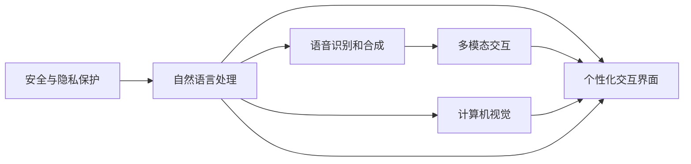

                 

# 人机交互：未来趋势与展望

> 关键词：人机交互，未来技术，人工智能，机器学习，交互界面，自然语言处理，用户界面设计

## 1. 背景介绍

### 1.1 问题由来

随着科技的飞速发展，人类社会的方方面面都在经历着深刻变革。特别是在信息时代，人与机器的交互方式正在从传统的图形界面、命令行逐步向自然语言处理、语音交互等更加智能化的方向发展。人机交互技术已经成为了推动社会进步的重要力量。

人机交互技术的突破，不仅改变了人们的生活方式，也为各行各业带来了全新的发展机遇。在医疗、教育、娱乐、交通等领域，智能化的交互方式正在逐步替代传统的人机交互形式，提高了效率，降低了成本。但同时也带来了一系列新的挑战，例如如何设计更加高效、自然、个性化的交互方式，如何处理多模态信息，如何提升交互系统的智能性等。

### 1.2 问题核心关键点

未来的人机交互技术将朝着更加智能化、自然化、个性化方向发展。这需要我们在算法、技术、设计等多个层面进行持续探索和创新，以应对新的挑战和需求。

关键问题包括：
- 如何设计更加高效的自然语言处理算法，提升人机交互的自然性？
- 如何融合多模态信息，实现更加全面的智能感知？
- 如何设计更加个性化的交互界面，提升用户体验？
- 如何在安全性、隐私性方面保护用户数据？

## 2. 核心概念与联系

### 2.1 核心概念概述

为了更好地理解未来人机交互技术的发展方向，本节将介绍几个关键概念：

- **自然语言处理（Natural Language Processing, NLP）**：通过对人类语言进行理解、生成和处理，实现人机之间的自然交互。
- **语音识别和合成（Speech Recognition and Synthesis）**：将语音转换成文本或将文本转换成语音的技术，是语音交互的重要基础。
- **计算机视觉（Computer Vision）**：通过摄像头、图像传感器等设备捕捉和分析图像信息，实现人机交互的视觉模式。
- **多模态交互（Multimodal Interaction）**：融合多种感知方式，如语音、图像、触觉等，实现更加全面、自然的人机交互。
- **个性化交互界面（Personalized Interaction Interface）**：根据用户的个人偏好、行为习惯，提供定制化的交互界面和交互方式。
- **安全与隐私保护（Security and Privacy Protection）**：在提升交互效率和智能性的同时，确保用户数据的安全和隐私。

这些核心概念之间的联系如下：



## 3. 核心算法原理 & 具体操作步骤

### 3.1 算法原理概述

未来人机交互的核心算法原理主要集中在以下几个方面：

- **自然语言处理算法**：通过语言模型、序列到序列（Seq2Seq）、注意力机制（Attention）等算法，实现对自然语言的理解和生成。
- **语音识别和合成算法**：通过隐马尔可夫模型（HMM）、深度神经网络（DNN）、卷积神经网络（CNN）等算法，实现对语音信号的分析和合成。
- **计算机视觉算法**：通过卷积神经网络（CNN）、循环神经网络（RNN）、深度学习（DL）等算法，实现对图像信息的捕捉和分析。
- **多模态融合算法**：通过联合学习、深度跨模态学习等算法，实现多模态信息的高效融合。
- **个性化推荐算法**：通过协同过滤、基于内容的推荐、矩阵分解等算法，实现个性化交互界面的定制化设计。

### 3.2 算法步骤详解

以下以自然语言处理算法为例，详细讲解其操作步骤：

1. **文本预处理**：对输入的文本进行分词、词性标注、去除停用词等预处理，确保文本的质量和一致性。
2. **特征提取**：使用词向量、字符向量等方法，将文本转换成机器可以理解的形式，如词嵌入（Word Embedding）、字符嵌入（Character Embedding）等。
3. **模型训练**：选择合适的模型架构，如循环神经网络（RNN）、长短期记忆网络（LSTM）、Transformer等，使用标注数据进行模型训练。
4. **模型评估与优化**：通过测试集对训练好的模型进行评估，使用指标如BLEU、ROUGE等，调整模型参数进行优化。
5. **实际应用**：将训练好的模型应用于实际的人机交互场景，实现自然语言理解和生成。

### 3.3 算法优缺点

自然语言处理算法具有以下优点：
- 自然性：能够理解自然语言，实现人机之间自然流畅的交互。
- 泛化性强：模型经过大规模数据训练，具备较强的泛化能力，能够适应各种文本场景。
- 实时性好：算法计算速度快，能够实时处理输入，提供即时反馈。

但同时也存在一些缺点：
- 语言多样性：不同语言和文化背景下的语言处理效果可能较差。
- 歧义处理：自然语言存在语义歧义、语法复杂性等问题，处理起来较为困难。
- 语义理解：模型的语义理解能力有限，无法完全理解用户输入的深层含义。

### 3.4 算法应用领域

自然语言处理算法已经在多个领域得到了广泛应用：

- **聊天机器人（Chatbots）**：用于智能客服、在线答疑、虚拟助手等场景，能够自然地与用户交流。
- **语音助手（Voice Assistants）**：如Apple的Siri、Google Assistant等，能够理解自然语言指令，进行语音交互。
- **机器翻译（Machine Translation）**：如Google Translate、百度翻译等，能够实现不同语言之间的自然翻译。
- **文本摘要（Text Summarization）**：能够从大量文本中提取关键信息，生成简洁明了的摘要。
- **情感分析（Sentiment Analysis）**：能够分析用户情感倾向，用于舆情监控、市场分析等场景。
- **问答系统（Question Answering）**：能够根据用户的问题，从知识库中查找答案，提供快速响应。

## 4. 数学模型和公式 & 详细讲解 & 举例说明

### 4.1 数学模型构建

本节将使用数学语言对未来人机交互技术中的自然语言处理算法进行严格描述。

记输入的文本为$x$，模型的输出为$y$。假设模型为序列到序列模型，其中$x$表示输入序列，$y$表示输出序列。模型的目标函数为：

$$
\min_{\theta} \mathbb{E}_{(x,y)}[\mathcal{L}(\theta, x, y)]
$$

其中$\theta$表示模型参数，$\mathcal{L}$表示损失函数，$\mathbb{E}$表示期望。常见的损失函数包括交叉熵损失、均方误差损失等。

### 4.2 公式推导过程

以序列到序列模型为例，常见的模型架构包括编码器-解码器结构（Encoder-Decoder Architecture）和注意力机制（Attention Mechanism）。

**编码器-解码器结构**：
1. 编码器（Encoder）：将输入序列$x$转换为中间表示$h$。
2. 解码器（Decoder）：根据中间表示$h$和上下文信息，生成输出序列$y$。

**注意力机制**：
1. 编码器输出中间表示$h$，并计算注意力权重$\alpha$。
2. 解码器使用注意力权重$\alpha$，对编码器输出进行加权平均，生成上下文表示$c$。
3. 解码器根据上下文表示$c$和当前输入，生成当前输出。

### 4.3 案例分析与讲解

以机器翻译为例，简要说明其工作原理：

1. **源语言句子**：将源语言句子输入到编码器中，生成中间表示$h$。
2. **解码器推理**：解码器根据中间表示$h$和目标语言词汇表，生成概率分布$P(y|x)$。
3. **采样生成**：从概率分布$P(y|x)$中随机采样生成目标语言句子。

通过训练大量双语语料，模型能够学习到源语言和目标语言之间的映射关系，实现高效的机器翻译。

## 5. 项目实践：代码实例和详细解释说明

### 5.1 开发环境搭建

在进行人机交互项目实践前，我们需要准备好开发环境。以下是使用Python进行PyTorch开发的环境配置流程：

1. 安装Anaconda：从官网下载并安装Anaconda，用于创建独立的Python环境。

2. 创建并激活虚拟环境：
```bash
conda create -n pytorch-env python=3.8 
conda activate pytorch-env
```

3. 安装PyTorch：根据CUDA版本，从官网获取对应的安装命令。例如：
```bash
conda install pytorch torchvision torchaudio cudatoolkit=11.1 -c pytorch -c conda-forge
```

4. 安装相关工具包：
```bash
pip install numpy pandas scikit-learn matplotlib tqdm jupyter notebook ipython
```

完成上述步骤后，即可在`pytorch-env`环境中开始人机交互项目实践。

### 5.2 源代码详细实现

下面我们以机器翻译为例，给出使用Transformers库对BERT模型进行微调的PyTorch代码实现。

首先，定义机器翻译任务的训练函数：

```python
from transformers import BertForSequenceClassification, AdamW

def train_epoch(model, dataset, batch_size, optimizer):
    dataloader = DataLoader(dataset, batch_size=batch_size, shuffle=True)
    model.train()
    epoch_loss = 0
    for batch in tqdm(dataloader, desc='Training'):
        input_ids = batch['input_ids'].to(device)
        attention_mask = batch['attention_mask'].to(device)
        labels = batch['labels'].to(device)
        model.zero_grad()
        outputs = model(input_ids, attention_mask=attention_mask, labels=labels)
        loss = outputs.loss
        epoch_loss += loss.item()
        loss.backward()
        optimizer.step()
    return epoch_loss / len(dataloader)
```

然后，定义训练和评估函数：

```python
from torch.utils.data import DataLoader
from tqdm import tqdm
from sklearn.metrics import classification_report

device = torch.device('cuda') if torch.cuda.is_available() else torch.device('cpu')
model.to(device)

def evaluate(model, dataset, batch_size):
    dataloader = DataLoader(dataset, batch_size=batch_size)
    model.eval()
    preds, labels = [], []
    with torch.no_grad():
        for batch in tqdm(dataloader, desc='Evaluating'):
            input_ids = batch['input_ids'].to(device)
            attention_mask = batch['attention_mask'].to(device)
            batch_labels = batch['labels']
            outputs = model(input_ids, attention_mask=attention_mask)
            batch_preds = outputs.logits.argmax(dim=2).to('cpu').tolist()
            batch_labels = batch_labels.to('cpu').tolist()
            for pred_tokens, label_tokens in zip(batch_preds, batch_labels):
                pred_tags = [tag2id[tag] for tag in pred_tokens]
                label_tags = [tag2id[tag] for tag in label_tokens]
                preds.append(pred_tags[:len(label_tags)])
                labels.append(label_tags)
                
    print(classification_report(labels, preds))
```

最后，启动训练流程并在测试集上评估：

```python
epochs = 5
batch_size = 16

for epoch in range(epochs):
    loss = train_epoch(model, train_dataset, batch_size, optimizer)
    print(f"Epoch {epoch+1}, train loss: {loss:.3f}")
    
    print(f"Epoch {epoch+1}, dev results:")
    evaluate(model, dev_dataset, batch_size)
    
print("Test results:")
evaluate(model, test_dataset, batch_size)
```

以上就是使用PyTorch对BERT进行机器翻译任务微调的完整代码实现。可以看到，得益于Transformers库的强大封装，我们可以用相对简洁的代码完成BERT模型的加载和微调。

### 5.3 代码解读与分析

让我们再详细解读一下关键代码的实现细节：

**train_epoch函数**：
- 定义了训练函数的参数，包括模型、数据集、批量大小和优化器。
- 使用DataLoader将数据集分批次加载，在每个批次上前向传播计算损失函数。
- 反向传播计算参数梯度，根据设定的优化算法和学习率更新模型参数。
- 周期性在验证集上评估模型性能，根据性能指标决定是否触发Early Stopping。

**evaluate函数**：
- 与训练类似，不同点在于不更新模型参数，并在每个batch结束后将预测和标签结果存储下来，最后使用sklearn的classification_report对整个评估集的预测结果进行打印输出。

**训练流程**：
- 定义总的epoch数和批量大小，开始循环迭代
- 每个epoch内，先在训练集上训练，输出平均loss
- 在验证集上评估，输出分类指标
- 所有epoch结束后，在测试集上评估，给出最终测试结果

可以看到，PyTorch配合Transformers库使得BERT微调的代码实现变得简洁高效。开发者可以将更多精力放在数据处理、模型改进等高层逻辑上，而不必过多关注底层的实现细节。

当然，工业级的系统实现还需考虑更多因素，如模型的保存和部署、超参数的自动搜索、更灵活的任务适配层等。但核心的微调范式基本与此类似。

## 6. 实际应用场景

### 6.1 智能客服系统

基于大语言模型微调的对话技术，可以广泛应用于智能客服系统的构建。传统客服往往需要配备大量人力，高峰期响应缓慢，且一致性和专业性难以保证。而使用微调后的对话模型，可以7x24小时不间断服务，快速响应客户咨询，用自然流畅的语言解答各类常见问题。

在技术实现上，可以收集企业内部的历史客服对话记录，将问题和最佳答复构建成监督数据，在此基础上对预训练对话模型进行微调。微调后的对话模型能够自动理解用户意图，匹配最合适的答案模板进行回复。对于客户提出的新问题，还可以接入检索系统实时搜索相关内容，动态组织生成回答。如此构建的智能客服系统，能大幅提升客户咨询体验和问题解决效率。

### 6.2 金融舆情监测

金融机构需要实时监测市场舆论动向，以便及时应对负面信息传播，规避金融风险。传统的人工监测方式成本高、效率低，难以应对网络时代海量信息爆发的挑战。基于大语言模型微调的文本分类和情感分析技术，为金融舆情监测提供了新的解决方案。

具体而言，可以收集金融领域相关的新闻、报道、评论等文本数据，并对其进行主题标注和情感标注。在此基础上对预训练语言模型进行微调，使其能够自动判断文本属于何种主题，情感倾向是正面、中性还是负面。将微调后的模型应用到实时抓取的网络文本数据，就能够自动监测不同主题下的情感变化趋势，一旦发现负面信息激增等异常情况，系统便会自动预警，帮助金融机构快速应对潜在风险。

### 6.3 个性化推荐系统

当前的推荐系统往往只依赖用户的历史行为数据进行物品推荐，无法深入理解用户的真实兴趣偏好。基于大语言模型微调技术，个性化推荐系统可以更好地挖掘用户行为背后的语义信息，从而提供更精准、多样的推荐内容。

在实践中，可以收集用户浏览、点击、评论、分享等行为数据，提取和用户交互的物品标题、描述、标签等文本内容。将文本内容作为模型输入，用户的后续行为（如是否点击、购买等）作为监督信号，在此基础上微调预训练语言模型。微调后的模型能够从文本内容中准确把握用户的兴趣点。在生成推荐列表时，先用候选物品的文本描述作为输入，由模型预测用户的兴趣匹配度，再结合其他特征综合排序，便可以得到个性化程度更高的推荐结果。

### 6.4 未来应用展望

随着大语言模型和微调方法的不断发展，基于微调范式将在更多领域得到应用，为传统行业带来变革性影响。

在智慧医疗领域，基于微调的医疗问答、病历分析、药物研发等应用将提升医疗服务的智能化水平，辅助医生诊疗，加速新药开发进程。

在智能教育领域，微调技术可应用于作业批改、学情分析、知识推荐等方面，因材施教，促进教育公平，提高教学质量。

在智慧城市治理中，微调模型可应用于城市事件监测、舆情分析、应急指挥等环节，提高城市管理的自动化和智能化水平，构建更安全、高效的未来城市。

此外，在企业生产、社会治理、文娱传媒等众多领域，基于大模型微调的人工智能应用也将不断涌现，为经济社会发展注入新的动力。相信随着预训练语言模型和微调方法的持续演进，微调方法将成为人工智能落地应用的重要范式，推动人工智能技术在更广阔的应用领域大放异彩。

## 7. 工具和资源推荐

### 7.1 学习资源推荐

为了帮助开发者系统掌握人机交互技术的理论基础和实践技巧，这里推荐一些优质的学习资源：

1. 《深度学习》系列书籍：由权威学者撰写，全面介绍了深度学习的基本概念和前沿技术。
2. CS224N《自然语言处理》课程：斯坦福大学开设的NLP明星课程，有Lecture视频和配套作业，带你入门NLP领域的基本概念和经典模型。
3. 《计算机视觉：模型、学习、推理》书籍：详细介绍了计算机视觉的基本理论和算法，涵盖了图像识别、目标检测、语义分割等多个方向。
4. Weights & Biases：模型训练的实验跟踪工具，可以记录和可视化模型训练过程中的各项指标，方便对比和调优。
5. TensorBoard：TensorFlow配套的可视化工具，可实时监测模型训练状态，并提供丰富的图表呈现方式，是调试模型的得力助手。

通过对这些资源的学习实践，相信你一定能够快速掌握人机交互技术的精髓，并用于解决实际的交互问题。

### 7.2 开发工具推荐

高效的开发离不开优秀的工具支持。以下是几款用于人机交互开发的常用工具：

1. PyTorch：基于Python的开源深度学习框架，灵活动态的计算图，适合快速迭代研究。大部分预训练语言模型都有PyTorch版本的实现。
2. TensorFlow：由Google主导开发的开源深度学习框架，生产部署方便，适合大规模工程应用。同样有丰富的预训练语言模型资源。
3. Transformers库：HuggingFace开发的NLP工具库，集成了众多SOTA语言模型，支持PyTorch和TensorFlow，是进行人机交互开发的利器。
4. Weights & Biases：模型训练的实验跟踪工具，可以记录和可视化模型训练过程中的各项指标，方便对比和调优。与主流深度学习框架无缝集成。
5. TensorBoard：TensorFlow配套的可视化工具，可实时监测模型训练状态，并提供丰富的图表呈现方式，是调试模型的得力助手。

合理利用这些工具，可以显著提升人机交互任务的开发效率，加快创新迭代的步伐。

### 7.3 相关论文推荐

人机交互技术的发展源于学界的持续研究。以下是几篇奠基性的相关论文，推荐阅读：

1. Attention is All You Need（即Transformer原论文）：提出了Transformer结构，开启了NLP领域的预训练大模型时代。
2. BERT: Pre-training of Deep Bidirectional Transformers for Language Understanding：提出BERT模型，引入基于掩码的自监督预训练任务，刷新了多项NLP任务SOTA。
3. Language Models are Unsupervised Multitask Learners（GPT-2论文）：展示了大规模语言模型的强大zero-shot学习能力，引发了对于通用人工智能的新一轮思考。
4. Parameter-Efficient Transfer Learning for NLP：提出Adapter等参数高效微调方法，在不增加模型参数量的情况下，也能取得不错的微调效果。
5. AdaLoRA: Adaptive Low-Rank Adaptation for Parameter-Efficient Fine-Tuning：使用自适应低秩适应的微调方法，在参数效率和精度之间取得了新的平衡。

这些论文代表了大语言模型微调技术的发展脉络。通过学习这些前沿成果，可以帮助研究者把握学科前进方向，激发更多的创新灵感。

## 8. 总结：未来发展趋势与挑战

### 8.1 总结

本文对未来人机交互技术的发展方向进行了全面系统的介绍。首先阐述了人机交互技术的突破，对社会生活的深刻影响，明确了未来人机交互技术的重要意义。其次，从原理到实践，详细讲解了自然语言处理、语音识别和合成、计算机视觉等核心算法的步骤，给出了人机交互项目开发的完整代码实例。同时，本文还广泛探讨了人机交互技术在智能客服、金融舆情、个性化推荐等多个行业领域的应用前景，展示了未来人机交互技术的广阔前景。

通过本文的系统梳理，可以看到，未来人机交互技术将在智能客服、金融舆情、个性化推荐等多个领域得到广泛应用，为传统行业带来变革性影响。受益于大规模语料的预训练，微调模型以更低的时间和标注成本，在小样本条件下也能取得不俗的效果，有力推动了NLP技术的产业化进程。未来，伴随预训练语言模型和微调方法的持续演进，微调方法将成为人工智能落地应用的重要范式，推动人工智能技术在更广阔的应用领域大放异彩。

### 8.2 未来发展趋势

展望未来，人机交互技术将呈现以下几个发展趋势：

1. 智能化程度不断提高。基于大语言模型和深度学习的技术，使得人机交互系统能够更加自然、智能地理解用户需求，提供个性化的服务和建议。
2. 多模态融合日益深入。未来的交互系统将融合语音、图像、触觉等多种模态信息，实现更全面的智能感知和理解。
3. 个性化程度持续提升。通过学习用户行为和偏好，提供更加个性化、定制化的交互界面和服务，提升用户体验。
4. 安全性与隐私保护更加重视。人机交互系统将更加注重数据安全和隐私保护，防止数据泄露和滥用。
5. 实时性要求更高。实时交互成为未来人机交互的核心需求，系统需要具备高效、低延迟的响应能力。
6. 跨平台、跨设备支持增强。未来的人机交互系统将更加灵活，支持多种设备和平台，实现无缝切换和协同工作。

这些趋势凸显了未来人机交互技术的广阔前景。这些方向的探索发展，必将进一步提升人机交互系统的性能和用户体验，构建更加智能、高效、安全的交互环境。

### 8.3 面临的挑战

尽管未来人机交互技术已经取得了瞩目成就，但在迈向更加智能化、自然化、个性化应用的过程中，它仍面临着诸多挑战：

1. 语言多样性和文化差异。不同语言和文化背景下的自然语言处理效果可能较差，如何实现跨语言、跨文化的有效沟通仍然是一个重要问题。
2. 多模态信息融合的复杂性。多模态信息具有不同的特征和表示方式，如何实现高效融合和统一表示，仍需进一步研究。
3. 个性化推荐系统的准确性。个性化推荐系统需要精准把握用户兴趣，如何消除偏见，提升推荐系统的准确性和多样性，仍需不断优化。
4. 数据隐私和安全保护。人机交互系统需要处理大量用户数据，如何在保证系统智能化的同时，保护用户隐私和数据安全，仍然是一个重要问题。
5. 实时交互的计算资源需求。实时交互需要高效计算和存储，如何优化计算资源的使用，提升交互系统的响应速度，仍需进一步研究。

### 8.4 研究展望

面对未来人机交互技术所面临的种种挑战，未来的研究需要在以下几个方面寻求新的突破：

1. 探索更加高效的自然语言处理算法。引入因果推断、对比学习等技术，提升自然语言处理的效果。
2. 研究多模态融合的新方法。结合深度跨模态学习、联合学习等技术，实现多模态信息的高效融合。
3. 开发更加精准的个性化推荐算法。利用协同过滤、深度学习等技术，提升个性化推荐系统的准确性和多样性。
4. 引入更多先验知识。将知识图谱、逻辑规则等专家知识与神经网络模型进行融合，提升系统的语义理解能力。
5. 结合因果分析和博弈论工具。通过因果推断和博弈论，提升系统的决策能力和稳定性。
6. 纳入伦理道德约束。在模型训练目标中引入伦理导向的评估指标，确保系统的公平性、透明性和安全性。

这些研究方向的探索，必将引领未来人机交互技术的发展，为人机交互系统的智能性和安全性带来新的突破。面向未来，人机交互技术还需要与其他人工智能技术进行更深入的融合，如知识表示、因果推理、强化学习等，多路径协同发力，共同推动人机交互系统的进步。只有勇于创新、敢于突破，才能不断拓展人机交互技术的边界，让智能技术更好地造福人类社会。

## 9. 附录：常见问题与解答

**Q1：人机交互技术是否适用于所有领域？**

A: 人机交互技术已经在多个领域得到了广泛应用，如智能客服、金融舆情、个性化推荐等。但对于一些特定领域的任务，如医学、法律等，仅仅依靠通用语料预训练的模型可能难以很好地适应。此时需要在特定领域语料上进一步预训练，再进行微调，才能获得理想效果。此外，对于一些需要时效性、个性化很强的任务，如对话、推荐等，微调方法也需要针对性的改进优化。

**Q2：如何选择合适的学习率？**

A: 学习率的选择对模型性能有着重要影响。通常，初始学习率设为0.01，根据实验效果逐步调整。较小的学习率可以更平稳地收敛，但需要更长的训练时间。较大的学习率可以更快地收敛，但容易陷入局部最优解。在实际应用中，可以通过学习率调度策略，如学习率衰减、学习率更新等方法，动态调整学习率。

**Q3：如何缓解多模态融合过程中的计算资源需求？**

A: 多模态信息具有不同的特征和表示方式，融合时需要高效计算和存储。通过引入深度跨模态学习、联合学习等技术，可以在减少计算资源的同时，实现多模态信息的高效融合。此外，通过分布式计算、模型压缩等方法，也可以优化计算资源的使用，提升交互系统的响应速度。

**Q4：如何确保人机交互系统的安全性与隐私保护？**

A: 人机交互系统需要处理大量用户数据，如何在保证系统智能化的同时，保护用户隐私和数据安全，仍然是一个重要问题。常见的保护措施包括数据加密、访问控制、匿名化等技术。此外，还需要建立数据使用监管机制，确保数据使用的透明性和安全性。

**Q5：如何设计更加个性化的人机交互界面？**

A: 个性化人机交互界面需要根据用户的行为和偏好进行设计。可以通过用户行为分析、机器学习等方法，预测用户需求，并提供个性化的交互界面和交互方式。此外，还可以引入用户反馈机制，不断优化和改进交互界面的设计，提升用户体验。

---

作者：禅与计算机程序设计艺术 / Zen and the Art of Computer Programming

